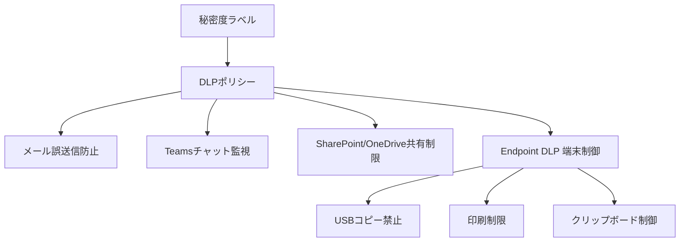
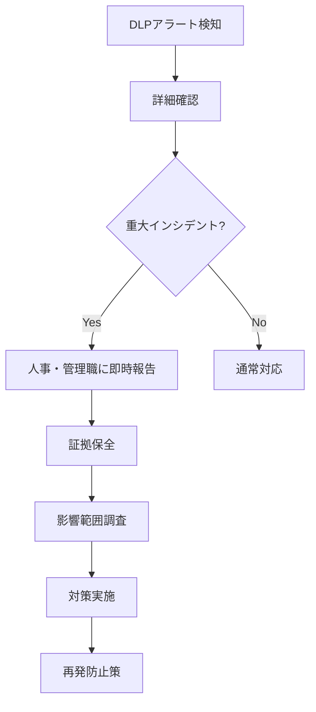

# Data Loss Prevention による情報漏洩の防止

本章では、Microsoft Purview Data Loss Prevention(DLP)を使用して、児童生徒の個人情報の外部流出を防止する方法を解説します。メール誤送信、USB持ち出し、私的クラウドストレージへのアップロードなど、教育機関で実際に発生しやすい情報漏洩シナリオへの対策を提供します。

:::message
**本章の前提条件**:
- Microsoft 365 A5ライセンスが必要(DLP機能が含まれる)
- 第10章で秘密度ラベルが構成済み
- Endpoint DLPのためにデバイスがオンボード済み(第9章)
:::

---

# 11.1 教育委員会向けDLP戦略

## 11.1.1 DLP実装の全体方針

**Data Loss Prevention(DLP)** は、機密情報が不適切に共有されるのを防止するための重要な対策です。秘密度ラベル(第10章)が「情報の分類」を担当するのに対し、DLPは「情報の流出防止」を担当します。

### DLPと秘密度ラベルの違い

| 機能 | 秘密度ラベル | DLP |
|-----|------------|-----|
| **目的** | 情報の分類と保護 | 情報流出の防止 |
| **適用タイミング** | ファイル作成時・保存時 | データ送信・共有時 |
| **保護対象** | ファイル・メール | データ送信・共有アクション |
| **動作** | 暗号化・アクセス制御 | ブロック・警告・監査 |

### DLPの多層防御アプローチ



## 11.1.2 保護対象データの特定

教育委員会が保護すべきデータ(文科省ガイドライン準拠):

| 機密性分類 | 保護対象データ | DLPでの検出方法 |
|----------|--------------|---------------|
| **機密性3** | 秘密文書相当 | 秘密度ラベル「秘密」 |
| **機密性2B** | 成績、健康情報、指導要録 | 秘密度ラベル「校務専用(教職員のみ)」 + カスタムSIT(学籍番号等) |
| **機密性2A** | 学習用データ、教材 | 秘密度ラベル「校内限定(教職員・生徒)」 |
| **機密性1** | 一般公開情報 | 保護不要 |

**SIT = Sensitive Information Types(機密情報の種類)**

## 11.1.3 DLP適用場所

DLPポリシーを適用する場所:

| 場所 | 説明 | 主な用途 |
|-----|------|---------|
| **Exchange Online** | メール | 誤送信防止、外部ドメインへの送信ブロック |
| **SharePoint/OneDrive** | ファイル共有 | 外部共有禁止、リンク共有制限 |
| **Teams** | チャット・チャネル | 機密情報のチャット送信防止 |
| **Devices(Endpoint DLP)** | Windows 10/11端末 | USBコピー禁止、印刷制限、クリップボード制御 |

## 11.1.4 ポリシー適用モード(段階的展開)

DLPポリシーは段階的に展開することを推奨します:

| モード | 説明 | 用途 |
|-------|------|------|
| **Simulation(テストモード)** | ポリシーマッチを記録するが、ブロックしない | 誤検知の確認、ポリシー調整 |
| **Turn on with policy tips(警告モード)** | ユーザーに警告を表示、オーバーライド可能 | 教職員への啓発、段階的移行 |
| **Enforce(ブロックモード)** | 違反をブロック | 本格運用 |

**推奨展開フロー**:
1. **Simulationモード**(1-2週間): 誤検知を確認
2. **Policy tipsモード**(1-2ヶ月): 教職員に警告表示、教育
3. **Enforceモード**: 本格運用開始

---

# 11.2 教育現場向けDLPポリシーの構成

## 11.2.1 ポリシーテンプレートの活用

Microsoftは、よく使われるDLPポリシーのテンプレートを提供しています。教育機関向けのテンプレート例:

| テンプレート名 | 検出する情報 | 教育機関での用途 |
|-------------|------------|----------------|
| **Japan Personal Information Protection Act** | マイナンバー、住民票コード | 児童生徒・教職員の個人情報保護 |
| **Japan My Number Act** | マイナンバー | 保護者・教職員のマイナンバー保護 |
| **カスタムポリシー** | 学籍番号、成績情報 | 教育機関特有の情報保護 |

## 11.2.2 DLPポリシーの作成手順

### ステップ1: DLPポリシーの作成

**前提条件**: コンプライアンス管理者またはセキュリティ管理者の権限

1. Microsoft Purviewポータル(https://purview.microsoft.com)にアクセス
2. **Data loss prevention** → **Policies** を選択
3. **Create policy** をクリック

### ステップ2: テンプレートの選択

**例: 「Japan Personal Information Protection Act」テンプレートを使用**

1. **Categories**: `Privacy`を選択
2. **Templates**: `Japan Personal Information Protection Act`を選択
3. **Next** をクリック

### ステップ3: ポリシー名と説明

- **Name**: `児童生徒個人情報保護ポリシー`
- **Description**: `児童生徒の個人情報(マイナンバー、学籍番号等)の外部流出を防止`

### ステップ4: 管理単位の割り当て(Admin units)

- **Full directory**: すべての教職員に適用

### ステップ5: 適用場所の選択

**推奨設定**(教育委員会向け):

- ✅ **Exchange email**(メール誤送信防止)
- ✅ **SharePoint sites**(ファイル共有制限)
- ✅ **OneDrive accounts**(個人ストレージ保護)
- ✅ **Teams chat and channel messages**(チャット監視)
- ✅ **Devices**(Endpoint DLP - USB等の制御)

### ステップ6: ポリシー設定のカスタマイズ

**Advanced DLP rules**で条件を詳細設定:

#### 条件(Conditions):

**Content contains**:
- ✅ Sensitive info types:
  - `Japan My Number - Personal`(マイナンバー)
  - `Japan Resident Registration Number`(住民票コード)
  - カスタムSIT: `学籍番号`(第10章で作成)

**または**

- ✅ Sensitivity labels:
  - `校務専用(教職員のみ)`(機密性2B)
  - `秘密`(機密性3)

#### アクション(Actions):

| アクション | 説明 | 推奨設定 |
|----------|------|---------|
| **Restrict access or encrypt the content** | SharePoint/OneDriveでのアクセス制限 | ✅ 有効 |
| **Audit or restrict activities on Windows device** | Endpoint DLPでの制御 | ✅ 有効(USBコピー禁止等) |

**Endpoint DLPの詳細設定**:

**File activities for all apps**:
- ✅ **Copy to a removable USB device**: `Block`(USB持ち出し禁止)
- ✅ **Copy to network shares**: `Audit only`(監査のみ)
- ✅ **Print**: `Block with override`(印刷時に理由入力)
- ✅ **Copy to clipboard**: `Audit only`

#### ユーザー通知(User notifications):

- ✅ **Use notifications to inform your users**: 有効化
- ✅ **Notify users in Office 365 service with a policy tip**: 有効化
- ✅ **Customize the policy tip text**: カスタマイズ

**カスタムポリシーティップの例**:
```
この操作は禁止されています。この文書には児童生徒の個人情報が含まれています。外部への送信・USB持ち出しは禁止されています。(文科省ガイドライン:機密性2B)
```

#### インシデントレポート(Incident reports):

- ✅ **Send an alert to admins when a rule match occurs**: 有効化
- **Email**: `security@youreducation.jp`(セキュリティ担当者のメール)
- **Severity level**: `High`

### ステップ7: ポリシーモードの選択

**初回展開時**:
- **Run the policy in simulation mode**: 有効化(1-2週間テスト)

**本格運用時**:
- **Turn it on right away**: 即座に有効化

### ステップ8: 確認と作成

- **Review and finish** → **Submit**

---

# 11.3 教育機関でよくある情報漏洩シナリオへの対策

## 11.3.1 シナリオ1: メールによる成績表の誤送信

### 問題

教職員が、成績表を添付したメールを誤って保護者の私的メールアドレス(Gmail等)に送信してしまう。

### DLPポリシーによる対策

**ポリシー設定**:

**条件**:
- **Content contains**: Sensitivity label = `校務専用(教職員のみ)`
- **Recipients**: `Domain is not` = `@youreducation.jp`(教育委員会ドメイン以外)

**アクション**:
- **Block the message**: メール送信をブロック
- **Policy tip**: 「この文書には児童生徒の個人情報が含まれています。外部ドメインへの送信は禁止されています。」

### 動作

1. 教職員が成績表(校務専用ラベル付き)を外部アドレスに送信しようとする
2. DLPポリシーがマッチ
3. **Policy tip**が表示: 送信がブロックされる
4. セキュリティ担当者にアラートメール送信

## 11.3.2 シナリオ2: USBへの成績情報持ち出し

### 問題

教職員が、自宅で作業するために成績表をUSBメモリにコピーしようとする。

### Endpoint DLPによる対策

**ポリシー設定**:

**条件**:
- **Content contains**: Sensitivity label = `校務専用(教職員のみ)`
- **File activities**: `Copy to a removable USB device`

**アクション**:
- **Block**: USBへのコピーをブロック
- **User notification**: 「この操作は禁止されています。校務情報のUSB持ち出しは禁止されています。OneDrive for Businessを使用してください。」

### 動作

1. 教職員が成績表ファイルをUSBにコピーしようとする
2. Endpoint DLPがブロック
3. ユーザーに通知が表示
4. セキュリティ担当者にアラート送信

## 11.3.3 シナリオ3: 私的クラウドストレージへのアップロード

### 問題

教職員が、Google DriveやDropboxに校務情報をアップロードしようとする。

### Endpoint DLPによる対策

**Endpoint DLP settings**での設定:

1. Microsoft Purviewポータル → **Data loss prevention** → **Endpoint DLP settings**
2. **Unallowed cloud services**:
   - `Google Drive`
   - `Dropbox`
   - `OneDrive Personal`

**DLPポリシー設定**:

**条件**:
- **Content contains**: Sensitivity label = `校務専用(教職員のみ)`
- **Browser activities**: `Upload to a restricted cloud service domain`

**アクション**:
- **Block**: アップロードをブロック

## 11.3.4 シナリオ4: Teamsチャットでの個人情報共有

### 問題

教職員が、Teamsチャットで誤って児童生徒の個人情報(学籍番号等)を送信してしまう。

### DLP for Teamsによる対策

**ポリシー設定**:

**条件**:
- **Content contains**: Custom SIT = `学籍番号`
- **Location**: `Teams chat and channel messages`

**アクション**:
- **Block the message**: チャット送信をブロック
- **Policy tip**: 「このメッセージには児童生徒の個人情報が含まれています。Teamsチャットでの共有は禁止されています。」

### 動作

1. 教職員がTeamsチャットで学籍番号を送信しようとする
2. DLPポリシーがマッチ
3. メッセージがブロックされ、送信者・受信者に通知が表示

---

# 11.4 Endpoint DLPの詳細構成

## 11.4.1 Endpoint DLP設定の構成

**Endpoint DLP settings**で、端末全体に適用されるグローバル設定を構成します。

### ブラウザとドメインの制限

**Unallowed browsers**(許可しないブラウザ):
- 私的ブラウザでの機密情報アクセスをブロック
- 推奨: 許可するブラウザを**Microsoft Edge**のみに限定

**Unallowed cloud services**(許可しないクラウドサービス):
- `drive.google.com`(Google Drive)
- `dropbox.com`
- `onedrive.live.com`(OneDrive Personal)

### ファイルパス除外

以下のフォルダはDLP監視から除外(システムフォルダ等):
- `C:\Windows\`
- `C:\Program Files\`

## 11.4.2 リムーバブルメディア制御

**USB・外付けHDDへのコピー制御**:

**DLPポリシーでの設定**:

**File activities for all apps**:
- **Copy to a removable USB device**:
  - `Block`(秘密度ラベル付きファイル)
  - `Audit only`(ラベルなしファイル)

**例外設定**:
- IT管理者グループは除外(バックアップ作業のため)

## 11.4.3 プリンター制御

**印刷制限**:

**File activities for all apps**:
- **Print**: `Block with override`

**動作**:
1. 教職員が校務専用ラベル付きファイルを印刷しようとする
2. ポリシーティップが表示
3. 業務上必要な場合、理由を入力してオーバーライド可能
4. 印刷ログが記録され、セキュリティ担当者に通知

---

# 11.5 DLPインシデントの管理と対応

## 11.5.1 アラートの確認とトリアージ

**DLPアラートの確認場所**:

1. Microsoft Purviewポータル → **Data loss prevention** → **Alerts**
2. アラートの優先度:
   - **High**: 機密性3(秘密)の外部流出
   - **Medium**: 機密性2B(校務専用)の外部流出
   - **Low**: 機密性2A(校内限定)の内部共有

### アラートのトリアージ手順

1. **アラートの詳細確認**:
   - 誰が(Who): 教職員のユーザー名
   - 何を(What): 機密情報の種類(マイナンバー、学籍番号等)
   - いつ(When): 発生日時
   - どこで(Where): メール、Teams、Endpoint等
   - どうした(How): 外部送信、USBコピー等

2. **優先度判定**:
   - 実際に情報が流出したか?(ブロック成功 vs 失敗)
   - 影響範囲は?(1件 vs 大量)
   - 機密性レベルは?(機密性3 > 2B > 2A)

3. **対応方針決定**:
   - **誤検知**: ポリシー調整
   - **教職員の誤操作**: 教育・フォロー
   - **重大インシデント**: 人事・管理職にエスカレーション

## 11.5.2 誤検知の処理と教職員へのフォロー

### 誤検知の例

- 学籍番号に似た番号(請求書番号等)が誤検知される
- 公開可能な情報が誤ってブロックされる

### 対応方法

1. **ポリシー調整**:
   - カスタムSITの正規表現を調整
   - 例外条件を追加

2. **教職員へのフォロー**:
   - 誤検知であることを説明
   - 正しい手順(SharePoint経由での共有等)を案内

## 11.5.3 重大インシデント発生時の対応フロー

### 重大インシデントの定義

- 機密性3(秘密)の外部流出
- 機密性2B(校務専用)の大量流出(100件以上)
- 退職予定者による大量ダウンロード

### 対応フロー



**証拠保全**:
- DLPアラートのスクリーンショット保存
- Activity explorerでのログ確認
- 該当ユーザーのアカウント一時停止(必要に応じて)

---

# まとめ

**本章で学んだこと**:

1. **DLP戦略**: 秘密度ラベルとDLPの連携、保護対象データの特定、適用場所の選択
2. **DLPポリシーの構成**: テンプレートの活用、カスタムポリシー作成、段階的展開(Simulation→Policy tips→Enforce)
3. **教育機関特有のシナリオ対策**:
   - メール誤送信防止(外部ドメインへの送信ブロック)
   - USBメモリへの持ち出し禁止
   - 私的クラウドストレージへのアップロード禁止
   - Teamsチャットでの個人情報共有防止
4. **Endpoint DLPの詳細構成**: USBコピー禁止、印刷制限、クリップボード制御、ブラウザ制限
5. **DLPインシデント管理**: アラートのトリアージ、誤検知対応、重大インシデント対応フロー

**文部科学省ガイドライン準拠**:
- ✅ 機密性2B/3の情報を秘密度ラベルとDLPで二重に保護
- ✅ 教育情報セキュリティポリシーに基づく情報流出防止対策

