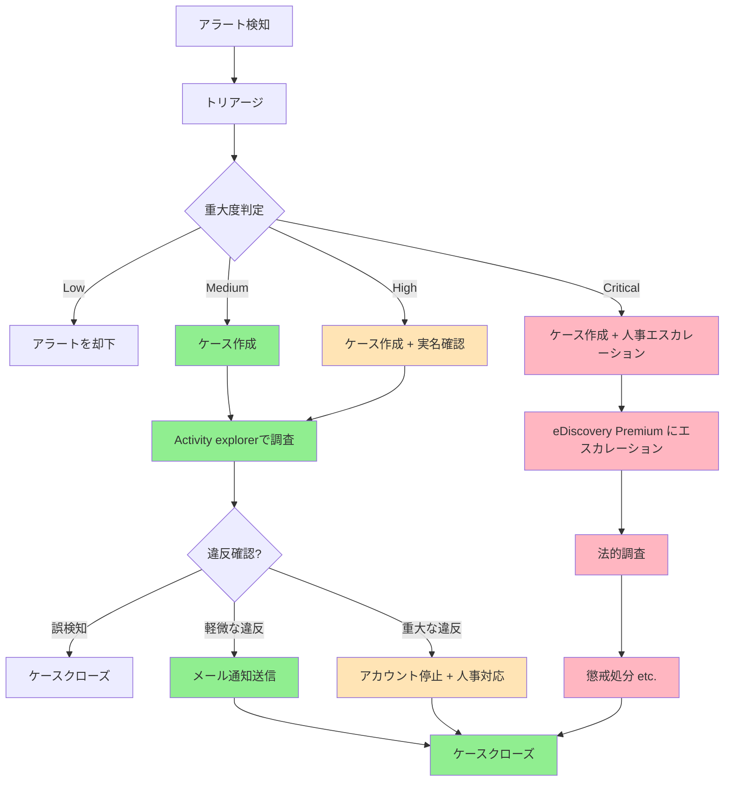

# Insider Risk Management による内部不正の検知と対応

本章では、Microsoft Purview Insider Risk Management を使用して、教職員による意図的・非意図的な情報持ち出しや不正行為を検知・対応する方法を解説します。退職時の大量ダウンロード、USBへの情報持ち出し、私的メールへの送信など、内部脅威の早期検知と適切な対応方法を提供します。

:::message
**本章の前提条件**:
- Microsoft 365 A5ライセンスが必要（Insider Risk Management機能が含まれる）
- 第10章で秘密度ラベルが構成済み
- 第11章でDLPポリシーが構成済み
- 倫理的運用とプライバシー保護の理解が必要
:::

---

# 12.1 教育機関における Insider Risk Management の考え方

## 12.1.1 内部脅威とは

**内部脅威（Insider Threat）** は、組織内の正当なアクセス権を持つ人物による、意図的または非意図的な情報漏洩や不正行為のリスクです。

### 教育現場での内部脅威の例

| 脅威タイプ | 具体例 | リスクレベル |
|----------|--------|-----------|
| **退職時の情報持ち出し** | 退職予定の教職員が、児童生徒の個人情報を大量にダウンロードし、USBで持ち出す | 高 |
| **私的利用のための情報持ち出し** | 教職員が成績情報を自宅のPCで作業するため、私的メールアドレスに送信 | 中 |
| **誤操作による情報流出** | 教職員が誤って機密情報を外部の保護者に送信 | 中 |
| **悪意のある情報漏洩** | 不満を持つ教職員が、意図的に児童生徒の個人情報を外部に漏洩 | 高 |

### なぜ教育機関で内部脅威管理が重要か

**教育機関特有のリスク**:
- ✅ **個人情報保護法対応**: 児童生徒の要配慮個人情報を扱うため、厳格な管理が必要
- ✅ **人事異動の多さ**: 年度末の退職・異動時に情報持ち出しリスクが高まる
- ✅ **教職員のITリテラシー格差**: 意図せず情報を漏洩してしまうケースが多い
- ✅ **児童生徒の保護**: 情報漏洩が児童生徒に直接的な被害を与える可能性

## 12.1.2 プライバシーとコンプライアンスの考慮事項

Insider Risk Managementは教職員の行動を監視する機能であるため、プライバシーと人権への配慮が不可欠です。

### プライバシー保護の原則

**Microsoftの「Privacy by Design」**:
1. **匿名化（Pseudonymization）**: ユーザー名は初期状態で匿名表示（User1, User2等）
2. **ロールベースアクセス制御**: 調査権限を持つ管理者のみが実名を閲覧可能
3. **監査ログ**: すべての調査アクションがログに記録され、監査可能

### 教育委員会での倫理的運用方針

**運用前に検討すべき事項**:
- ✅ **教職員組合・労働組合との協議**: 運用方針について事前に合意形成
- ✅ **就業規則への明記**: 内部脅威管理の実施を就業規則に明記
- ✅ **教職員への事前通知**: 監視の目的・範囲・方法を明確に説明
- ✅ **第三者監査**: 運用の適切性を定期的に第三者が監査

:::message alert
**重要**: Insider Risk Managementの導入は、教職員の監視ではなく、**組織全体の情報資産を守るための予防的措置**であることを明確に伝えることが重要です。
:::

## 12.1.3 匿名化とロールベースアクセス

Insider Risk Managementでは、教職員のプライバシーを保護しながら、セキュリティリスクを適切に管理するため、**匿名化**と**ロールベースアクセス制御**の仕組みが組み込まれています。アラートやケースを調査する際、デフォルトでは実名が表示されず、調査権限を持つ管理者のみが必要に応じて実名を確認できます。これにより、過度な監視を避けながら、重大なリスクには適切に対応できます。

### 匿名化の仕組み

**デフォルトの匿名化**:
- すべてのユーザーは「User1」「User2」のように匿名で表示
- 調査が必要な場合のみ、**Insider Risk Management Investigators** ロールを持つ管理者が実名を閲覧可能

### ロールベースアクセス制御

| ロール | 権限 | 誰が担うべきか |
|-------|------|-------------|
| **Insider Risk Management Admin** | 設定の構成、ポリシー作成 | セキュリティ管理者 |
| **Insider Risk Management Analysts** | アラートのレビュー、匿名でのケース作成 | セキュリティアナリスト |
| **Insider Risk Management Investigators** | 実名での調査、証拠の収集 | 人事責任者、法務担当 |
| **Insider Risk Management Auditors** | 監査ログの閲覧（読み取り専用） | 監査担当者 |

---

# 12.2 ポリシー設計と構成

Insider Risk Managementでは、組織のニーズに応じた**ポリシー**を作成し、どのような行動をリスクとして検知するかを定義します。ポリシーは、事前定義されたテンプレートから作成でき、教育機関特有のリスクシナリオに合わせて、トリガーイベント（監視開始条件）とリスク指標（監視対象の行動）を選択します。本節では、教育委員会に適したポリシー設計の方法を解説します。

## 12.2.1 ポリシーテンプレートの選択

Insider Risk Managementは、よく使われるシナリオに対応したテンプレートを提供しています。

### 教育委員会向け推奨テンプレート

| テンプレート | 用途 | 検知対象 |
|------------|------|---------|
| **Data theft by departing users** | 退職時の情報持ち出し検知 | 退職予定者の大量ダウンロード、USB持ち出し |
| **General data leaks** | 一般的な情報漏洩検知 | すべての教職員の情報流出行為 |
| **Data leaks by priority users** | 特権ユーザーの監視 | 管理職、IT管理者など、高権限者の行動監視 |
| **Risky AI usage** | 生成AI利用の監視 | ChatGPT等への機密情報入力 |

### テンプレートの選択基準

**最優先で実装すべきテンプレート**: **Data theft by departing users**
- 理由: 教育機関では年度末の人事異動が多く、退職時の情報持ち出しリスクが高いため

## 12.2.2 リスク指標（Indicators）の選択

リスク指標は、ポリシーがどのような行動をリスクとして検知するかを定義します。まず**トリガーイベント**によってユーザーの監視が開始され、その後、**ポリシー指標**で定義された具体的な行動（USBへのコピー、大量ダウンロードなど）が検知されると、リスクスコアが蓄積されます。教育委員会では、児童生徒の個人情報保護を最優先に、情報持ち出しリスクの高い指標を選択します。

### トリガーイベント（Triggering Events）

**ポリシーがユーザーの監視を開始する条件**:

| テンプレート | トリガーイベント |
|------------|---------------|
| **Data theft by departing users** | Microsoft 365 HRコネクタで退職日が設定された |
| **General data leaks** | DLPポリシー違反（High severityアラート） |
| **Data leaks by priority users** | 優先ユーザーグループに追加された |

### ポリシー指標（Policy Indicators）

**トリガーイベント後に監視する具体的な行動**:

#### 優先度：高（必ず有効化）

| 指標 | 説明 | 推奨設定 |
|-----|------|---------|
| **Copy to removable USB device** | USBへのファイルコピー | ✅ 有効 |
| **Download from SharePoint or OneDrive** | 大量ダウンロード | ✅ 有効 |
| **Send email with attachments to external domains** | 外部ドメインへのメール送信 | ✅ 有効 |
| **Copy files to cloud storage services** | 私的クラウドストレージへのアップロード | ✅ 有効 |

#### 優先度：中（推奨）

| 指標 | 説明 | 推奨設定 |
|-----|------|---------|
| **Access site from unallowed domain** | 許可されていないドメインからのアクセス | ✅ 有効 |
| **Print files** | 印刷行為 | ⚠️ Audit only（監査のみ） |
| **Delete files from SharePoint or OneDrive** | 大量削除 | ✅ 有効 |

## 12.2.3 しきい値の設定

リスクスコアを適切に計算するために、各指標のしきい値を設定します。

### しきい値設定の例（SharePointダウンロード）

**「Download from SharePoint or OneDrive」指標の場合**:

| しきい値レベル | ファイル数/日 | リスクスコアへの影響 | アラート重大度 |
|------------|------------|------------------|------------|
| **Low** | 10-19ファイル | 低い影響 | Low |
| **Medium** | 20-29ファイル | 中程度の影響 | Medium |
| **High** | 30ファイル以上 | 高い影響 | High |

**推奨しきい値（教育委員会向け）**:
- 退職予定者の場合: より低いしきい値（5-10ファイル/日）
- 一般教職員の場合: 標準しきい値（10-20ファイル/日）

---

# 12.3 教育委員会向けポリシーの作成手順

本節では、教育委員会で最も重要な「退職時の情報持ち出し検知」ポリシーを実際に作成する手順を解説します。まず、Microsoft 365 HRコネクタで退職予定者情報を連携し、次にポリシーを作成して、退職予定者による大量ダウンロードやUSBへのコピーなどの高リスク行動を検知できるようにします。設定は段階的に進め、誤検知を避けながら実効性の高い監視体制を構築します。

## 12.3.1 前提条件の構成

### ステップ1: Microsoft 365 HRコネクタの構成

退職時の情報持ち出しを検知するために、HRコネクタで退職予定者情報を連携します。

**1. データファイルの準備**

CSV形式で退職予定者情報を準備:

```csv
EmailAddress,ResignationDate
tanaka@youreducation.jp,2025-03-31
suzuki@youreducation.jp,2025-03-31
```

**2. HRコネクタの作成**

- Microsoft Purviewポータル（https://purview.microsoft.com）にアクセス
- **Settings** → **HR connector** → **Add** をクリック
- ファイルをアップロード、または Azure Blob Storageと連携

### ステップ2: 優先ユーザーグループの作成

管理職やIT管理者など、高権限を持つユーザーグループを作成します。

**設定箇所**:
- **Settings** → **Priority user groups** → **Create priority user group**

**例: 管理職グループ**

```
グループ名: 管理職
メンバー:
- principal@youreducation.jp（校長）
- viceprinciple@youreducation.jp（副校長）
- admin@youreducation.jp（教育委員会事務局長）
```

## 12.3.2 「退職時の情報持ち出し検知」ポリシーの作成

### ステップ1: ポリシーの作成開始

1. Microsoft Purviewポータル → **Insider Risk Management** → **Policies**
2. **Create policy** をクリック

### ステップ2: テンプレートの選択

- **Data theft by departing users** を選択

### ステップ3: ポリシー名と説明

```
名前: 退職予定者の情報持ち出し検知
説明: 退職日が設定された教職員による、児童生徒の個人情報の大量ダウンロード・USB持ち出しを検知します。
```

### ステップ4: ユーザーとグループの選択

- **All users**: すべての教職員を対象
- または **Specific users and groups**: 特定の部署のみを対象

### ステップ5: トリガーイベントの設定

- **User has a resignation date**: HRコネクタで退職日が設定されたユーザー

**カスタマイズ（オプション）**:
- **Detection begins**: 退職日の90日前から監視開始

### ステップ6: ポリシー指標の選択

**推奨指標**:

**Office indicators**:
- ✅ Download from SharePoint or OneDrive

**Device indicators**:
- ✅ Copy to removable USB device
- ✅ Copy to network shares
- ✅ Print

**Cloud storage indicators**:
- ✅ Copy files to cloud storage services（Google Drive, Dropbox等）

**Email indicators**:
- ✅ Send email with attachments to external domains

### ステップ7: しきい値の設定

**SharePointダウンロードのしきい値**:
- Low: 5ファイル/日
- Medium: 10ファイル/日
- High: 20ファイル/日

:::message
**退職予定者は通常より低いしきい値を設定**することで、早期にリスクを検知できます。
:::

### ステップ8: インシデントレポートの設定

- ✅ **Create an alert for every activity that matches this policy**: 有効化
- ✅ **Alert volume**: Medium または High
- ✅ **Email notification**: セキュリティ管理者、人事責任者のメールアドレス

### ステップ9: 確認と作成

- **Review and finish** → **Submit**

---

# 12.4 ケース管理とワークフロー

ポリシーによってアラートが生成されたら、セキュリティ管理者はアラートをレビューし、必要に応じて**ケース**を作成して詳細調査を行います。ケース管理では、アラートのトリアージ（重大度判定）から、実名での調査、証拠の収集、対応アクションの実施まで、体系的なワークフローに沿って進めます。本節では、アラート検知から事案解決までの一連のプロセスを解説します。

## 12.4.1 アラートのレビュー

### アラートダッシュボード

**アクセス方法**:
- Microsoft Purviewポータル → **Insider Risk Management** → **Alerts**

**表示される情報**:
- Alert ID
- User（匿名表示: User1, User2等）
- Policy
- Severity（High, Medium, Low）
- Time detected

### トリアージの手順

**1. アラートの詳細確認**

アラートをクリックして詳細を確認:
- **User activity timeline**: 時系列でのユーザー行動
- **Risk score**: 現在のリスクスコア
- **Alert details**: 具体的な違反内容

**2. アラートの分類**

| 判定 | 説明 | アクション |
|-----|------|----------|
| **Needs review** | 詳細調査が必要 | ケースを作成して調査 |
| **Dismissed** | 誤検知または低リスク | アラートを却下 |
| **Confirmed** | リスクが確認された | ケースを作成して対応 |

## 12.4.2 ケースの作成と調査

### ステップ1: ケースの作成

**アラートからケースを作成**:
1. アラートを選択
2. **Create case** をクリック
3. ケース名と説明を入力

```
ケース名: 退職予定者（User123）による大量ダウンロード
説明: 退職予定の教職員が、退職日30日前から児童生徒の個人情報を含むファイルを1日あたり50ファイル以上ダウンロードしている。
```

### ステップ2: ケースの調査

**User activity タブ**:
- 時系列でのユーザー行動を可視化
- リスクスコアの推移を確認

**Activity explorer タブ**:
- 具体的なファイルアクセス履歴を確認
- フィルター機能で特定の行動パターンを抽出

**Content explorer タブ**:
- ダウンロードされたファイルの実際の内容を確認
- 秘密度ラベルの有無を確認

:::message alert
**Content explorerでは実際のファイル内容が閲覧できます**。プライバシー保護のため、**Insider Risk Management Investigators** ロールを持つ管理者のみがアクセスできます。
:::

### ステップ3: 実名の確認（必要な場合のみ）

**匿名化を解除して実名を確認**:
1. ケース詳細画面で **Reveal** をクリック
2. 実名が表示される
3. **すべての操作が監査ログに記録される**

## 12.4.3 人事・管理職へのエスカレーション

セキュリティ管理者の調査で重大な違反が確認された場合、人事部門や管理職にエスカレーションし、組織的な対応を検討します。特に、機密性の高い情報の持ち出しや、退職予定者による大量ダウンロードなど、法的措置や懲戒処分が必要となる可能性がある事案では、eDiscovery (Premium)へエスカレーションして法的調査を実施します。

### エスカレーションが必要なケース

| 重大度 | 状況 | エスカレーション先 |
|-------|------|----------------|
| **Critical** | 退職予定者が機密性3（秘密）の情報を大量ダウンロード | 人事部長、教育委員会事務局長 |
| **High** | 機密性2B（校務専用）の情報を外部メールに送信 | 人事課長、セキュリティ責任者 |
| **Medium** | 私的クラウドストレージに少量アップロード | 直属の上司、セキュリティ担当者 |

### eDiscovery (Premium)へのエスカレーション

**法的調査が必要な場合**:
1. ケース詳細画面で **Escalate for investigation** をクリック
2. eDiscovery (Premium) ケースが自動作成される
3. 法務担当者が詳細調査を実施

## 12.4.4 証拠の収集と保全

重大な違反が確認された場合、人事処分や法的措置に備えて、証拠を適切に収集・保全する必要があります。Activity explorerでユーザーの行動ログを記録し、Content explorerで持ち出されたファイルの内容を保存します。すべての証拠は監査可能な形で記録し、後から改ざんされていないことを証明できるようにします。

### 証拠収集の手順

**1. Activity explorer でのログ収集**

- すべてのファイルアクセス履歴をエクスポート
- CSV形式でダウンロード

**2. Content explorer でのファイル保全**

- ダウンロードされたファイルのコピーを保存
- 秘密度ラベルと内容を記録

**3. 監査ログの取得**

Microsoft Purviewポータル → **Audit** → **Search** で以下を検索:
- ユーザー: 対象教職員
- アクティビティ: FileDownloaded, FileCopied, FileUploaded
- 期間: 調査対象期間

---

# 12.5 対応アクションとワークフロー

ケースの調査が完了したら、違反の重大度に応じて適切な対応アクションを実施します。軽微な違反には注意喚起のメール通知を送信し、重大な違反にはアカウント停止や人事処分を行います。対応完了後はケースをクローズし、再発防止策を検討します。本節では、具体的な対応アクションとケース全体のワークフローを解説します。

## 12.5.1 対応アクションの種類

### 1. メール通知の送信

**軽微な違反の場合**（誤操作等）:

**アクション**:
1. ケース詳細画面で **Send email notice** をクリック
2. 通知テンプレートを選択

**通知テンプレートの例**:

```
件名: 【重要】情報セキュリティポリシーに関する注意喚起

〇〇先生

お疲れ様です。教育委員会セキュリティ担当です。

先日、〇〇先生のアカウントで以下の操作が検知されました:
- 児童生徒の個人情報を含むファイルを外部メールアドレスに送信

この操作は教育情報セキュリティポリシーに違反する可能性があります。
個人情報を含むファイルは、OneDrive for Businessを使用して共有してください。

ご不明な点がございましたら、セキュリティ担当までご連絡ください。

教育委員会セキュリティ担当
```

### 2. ユーザーアカウントの一時停止

**重大な違反の場合**（悪意のある情報持ち出し等）:

**Power Automate フローで自動化**:
1. Insider Risk Management ケースが作成される
2. Power Automate フローが自動実行
3. Entra ID でユーザーアカウントを一時停止
4. 人事部長にメール通知

### 3. ケースのクローズ

**対応完了後**:
1. ケース詳細画面で **Resolve case** をクリック
2. 対応内容をCase notesに記録

**Case notesの例**:

```
日時: 2025-03-15 10:00
対応者: セキュリティ担当 山田

対応内容:
- 退職予定の鈴木先生が、児童生徒の成績情報を含むファイルを50ファイルダウンロード
- 本人に確認したところ、引継ぎ資料作成のためとのこと
- 引継ぎ資料は印刷物で作成するよう指導
- ダウンロードしたファイルは削除を確認
- 情報セキュリティ研修を再受講するよう指示

結論: 誤操作と判断し、ケースをクローズ
```

## 12.5.2 対応フロー図



---

# 12.6 倫理的運用とプライバシー配慮

Insider Risk Managementは教職員の行動を監視する強力な機能であるため、倫理的な運用とプライバシー保護が最も重要です。運用の目的は「教職員の監視」ではなく「児童生徒の個人情報保護」であることを明確にし、教職員への十分な説明と合意形成を行います。本節では、プライバシーを尊重しながら実効性のある運用を実現するためのガイドラインを提示します。

## 12.6.1 運用ガイドラインの策定

### 運用方針の明文化

**教育委員会で策定すべき運用ガイドライン**:

1. **目的の明確化**
   - 児童生徒の個人情報保護が第一目的
   - 教職員の監視が目的ではない

2. **対象範囲の明示**
   - 監視対象: 機密性2B/3の情報を扱う行為
   - 監視対象外: 一般的な業務行為

3. **実名確認の条件**
   - 明確なリスクが確認された場合のみ
   - 人事責任者の承認が必要

4. **保持期間**
   - ケースクローズ後6ヶ月で自動削除
   - 法的調査が必要な場合は保持期間延長

## 12.6.2 教職員への説明

### 導入時の説明会

**説明すべき内容**:
- ✅ **導入目的**: 児童生徒の個人情報を守るため
- ✅ **監視内容**: 機密情報の外部流出行為のみを監視
- ✅ **プライバシー保護**: 匿名化、ロールベースアクセス制御
- ✅ **誤操作への対応**: 教育・指導が中心、懲戒処分が目的ではない

### FAQ例

**Q: すべての業務が監視されるのですか？**
A: いいえ。監視対象は、児童生徒の個人情報（機密性2B/3）の取り扱いのみです。通常の業務メールやファイルアクセスは監視対象外です。

**Q: 誰が私の実名を閲覧できますか？**
A: 通常は匿名（User1等）で表示されます。明確なリスクが確認され、人事責任者の承認を得た場合のみ、調査担当者が実名を確認できます。

**Q: 誤操作でアラートが出た場合、処分されますか？**
A: いいえ。誤操作の場合は、適切な操作方法を教育・指導します。悪意のある情報持ち出しのみが懲戒対象となります。

## 12.6.3 定期的な監査

### 四半期ごとの監査項目

**監査すべき項目**:
1. **実名確認の適切性**: 不必要な実名確認が行われていないか
2. **ケース対応の適切性**: 過剰な処分が行われていないか
3. **監査ログの確認**: すべての調査操作がログに記録されているか
4. **誤検知率**: ポリシーのしきい値が適切か

---

# まとめ

**本章で学んだこと**:

1. **Insider Risk Managementの考え方**: 内部脅威の定義、プライバシー保護、倫理的運用
2. **ポリシー設計**: テンプレート選択、リスク指標の設定、しきい値の調整
3. **ポリシー作成**: 退職時の情報持ち出し検知ポリシーの具体的作成手順
4. **ケース管理**: アラートのトリアージ、ケース作成、調査、証拠収集
5. **対応アクション**: メール通知、アカウント停止、人事エスカレーション、eDiscoveryへの連携
6. **倫理的運用**: 運用ガイドラインの策定、教職員への説明、定期監査

**教育委員会での実装のポイント**:
- ✅ **プライバシー第一**: 匿名化、ロールベースアクセス制御を徹底
- ✅ **教育重視**: 懲戒処分ではなく、教育・指導を中心に
- ✅ **透明性**: 教職員に事前説明、運用方針の明文化
- ✅ **定期監査**: 四半期ごとに運用の適切性を監査

