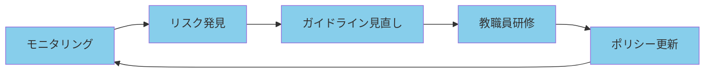

# 生成AI・Copilotのセキュリティとガバナンス

本章では、教育現場での生成AI・Microsoft Copilot利用を安全に管理する方法を解説します。教職員によるChatGPT等のAIツール利用を可視化し、児童生徒の個人情報が意図せず流出するリスクを防止する方法を提供します。

:::message
**本章の前提条件**:
- Microsoft 365 A5ライセンスが必要（DSPM for AI、Insider Risk Management等）
- 第10章で秘密度ラベルが構成済み
- 第11章でDLPポリシーが構成済み
- Microsoft 365 Copilot導入前または導入済みの環境
:::

---

# 13.1 教育現場におけるAI利用のリスクと対策の必要性

教育現場では、生成AIを活用した業務効率化が急速に進んでいます。一方で、教職員が児童生徒の個人情報を含む内容をChatGPT等の外部AIツールに入力してしまい、意図せず情報漏洩につながるリスクが顕在化しています。本節では、教育委員会が直面するAI利用の実態とリスク、そしてMicrosoft 365 A5で可能となるAI保護対策の必要性を解説します。

## 13.1.1 教育現場での生成AI利用の実態

教職員は、授業準備や保護者対応、会議の効率化など、さまざまな場面で生成AIを活用しています。しかし、組織が管理するMicrosoft Copilot以外に、個人で契約したChatGPTやGoogle GeminiなどのシャドーIT（許可されていないツール）も広く使われており、これらの利用実態を把握することが、情報漏洩リスク対策の第一歩となります。

### 教職員の利用シーン

**実際に使われている場面**:
- ✅ **授業準備**: 教材作成、テスト問題作成、指導案作成
- ✅ **保護者対応**: 保護者向け文書の作成、連絡事項の要約
- ✅ **会議効率化**: 会議議事録の要約、報告書作成
- ✅ **児童生徒支援**: 評価コメント作成、個別指導計画の下書き

### 利用されているAIツール

| AIツール | 利用状況 | 管理状況 |
|---------|---------|---------|
| **Microsoft Copilot for Microsoft 365** | 教育委員会が契約 | ✅ 管理可能 |
| **ChatGPT（無料版）** | 個人で利用 | ❌ シャドーIT |
| **Google Gemini** | 個人で利用 | ❌ シャドーIT |
| **Claude, Perplexity等** | 個人で利用 | ❌ シャドーIT |

## 13.1.2 生成AI利用に伴うリスク（教育委員会特有）

教育委員会が直面するAI利用リスクは、一般企業とは異なる重大性を持ちます。児童生徒の要配慮個人情報（成績、健康情報、家庭環境など）がAIツールに入力されると、個人情報保護法違反だけでなく、児童生徒の安全や権利を脅かす重大な事態につながります。本項では、教育現場特有のリスクシナリオと法令違反のリスクを具体的に解説します。

### 🚨 児童生徒の個人情報漏洩リスク

**具体的なリスクシナリオ**:

1. **成績情報のコピー&ペースト**
   - 教職員がChatGPTに成績表をコピーして評価コメント作成
   - 児童生徒の氏名・学籍番号が外部AIサービスに送信される

2. **個別支援計画の要約依頼**
   - 家庭環境・健康情報を含む相談記録をAIに入力
   - 要配慮個人情報が学習データとして利用されるリスク

3. **いじめ・虐待関連情報の入力**
   - 機密性の高い情報がAIツールに送信される
   - 個人情報保護法・児童福祉法違反のリスク

### 法令・規則違反のリスク

- ❌ **個人情報保護法違反**: 要配慮個人情報の適切な管理義務違反
- ❌ **教育情報セキュリティポリシー違反**: 文部科学省ガイドライン不遵守
- ❌ **個人情報保護条例違反**: 自治体条例違反

### シャドーIT（許可されていないAIツール）のリスク

| リスク | 説明 |
|-------|------|
| **可視化困難** | 教育委員会が把握していないAIツール利用 |
| **データ保存場所** | 海外サーバーに保存される |
| **学習データ利用** | 入力内容が学習データとして利用される（オプトアウト設定なし） |
| **セキュリティ不明** | セキュリティ認証（SOC2、ISO27001等）の有無不明 |

## 13.1.3 なぜA5が必要か（AI保護の観点）

教育現場での生成AI利用を安全に管理するには、AIツールへのデータ露出を可視化し、不適切な利用を検知する高度な機能が必要です。Microsoft 365 A3では基本的なセキュリティ機能しか利用できませんが、A5では、DSPM for AIやInsider Risk Managementなど、AI特有のリスクに対応した専門的な保護機能が利用可能になります。

A3では以下のAI保護機能が**利用できません。**

| 機能 | A3 | A5 | 説明 |
|-----|----|----|------|
| **DSPM for AI** | ❌ | ✅ | AIツールへのデータ露出を可視化 |
| **Insider Risk Management - Risky AI usage** | ❌ | ✅ | 不適切なAI利用を検知 |
| **SharePoint Advanced Management** | ❌ | ✅ | 過剰共有（Oversharing）の検出・制御 |
| **Defender for Cloud Apps - AI app discovery** | 基本のみ | ✅ | 許可されていないAIツールを検出 |

---

# 13.2 DSPM for AI による生成AI利用の可視化

## 13.2.1 DSPM for AI とは

**Data Security Posture Management (DSPM) for AI**は、AIツールと機密データの相互作用を可視化し、保護するMicrosoft Purviewの機能です。

### 主な機能

1. **AIアクティビティの可視化**
   - どの教職員がどのAIツールを使用しているか
   - 機密情報がどれだけAIツールに露出しているか

2. **ワンクリックポリシー**
   - すぐに使える事前構成済みポリシー
   - DLP、Communication Complianceポリシーを自動作成

3. **データリスク評価**
   - SharePointの過剰共有（Oversharing）を検出
   - 保護されていない機密情報を特定

4. **推奨アクション**
   - 秘密度ラベルの適用推奨
   - DLPポリシーの拡張提案

### 対象AIツール

| カテゴリ | 対象AIツール |
|---------|------------|
| **Copilot experiences and agents** | Microsoft 365 Copilot, Copilot Studio |
| **Enterprise AI apps** | ChatGPT Enterprise, Google Gemini Enterprise |
| **Other AI apps** | ChatGPT無料版, Claude, Perplexity等 |

## 13.2.2 DSPM for AIの設定手順

DSPM for AIを有効化することで、組織内のAI利用状況をリアルタイムで可視化し、機密情報がAIツールに露出しているリスクを検出できるようになります。設定は、前提条件の確認、機能の有効化、ダッシュボードでの継続的な監視という流れで進めます。本項では、教育委員会での初期設定手順を解説します。

### ステップ1: DSPM for AIへのアクセス

1. Microsoft Purviewポータル（https://purview.microsoft.com）にアクセス
2. **Solutions** → **DSPM for AI** を選択

### ステップ2: 前提条件の確認

**必須の前提条件**:

| 前提条件 | 確認方法 | 必要な理由 |
|---------|---------|----------|
| **Microsoft Purview Audit有効化** | Settings → Audit → Turn on auditing | AIアクティビティのログ記録に必要 |
| **デバイスのオンボーディング** | 第9章で完了済み | サードパーティAIサイトの監視に必要 |
| **ブラウザ拡張機能** | Microsoft Purview browser extension | サードパーティAIサイトの監視に必要 |

### ステップ3: ワンクリックポリシーの有効化

**推奨ポリシー**:

1. **Secure interactions from enterprise apps**
   - Microsoft 365 Copilotとの相互作用を監視
   - 1クリックで有効化

2. **Extend your insights for data discovery**
   - サードパーティAIサイト（ChatGPT, Gemini等）へのアクセスを監視
   - 機密情報の送信を検知

## 13.2.3 データリスク評価の実施

DSPM for AIは、SharePointサイトに保存されている機密ファイルのリスクを自動的に評価します。過剰共有（全職員がアクセス可能な状態）や、秘密度ラベルが付与されていない機密ファイルを検出し、Copilotが不適切にアクセスできる状態を特定します。本項では、デフォルト評価の確認とカスタム評価の実施方法を解説します。

### デフォルト評価の確認

**毎週自動実行される評価**:
- 上位100のSharePointサイト（使用頻度順）
- 過剰共有（Oversharing）の検出
- 保護されていない機密ファイルの特定

### 評価結果の確認方法

**Microsoft Purviewポータル → DSPM for AI → Data risk assessments**

**表示される情報**:

| 評価項目 | 説明 |
|---------|------|
| **Oversharing exposure** | 全職員がアクセス可能な児童生徒情報ファイル |
| **Unprotected sensitive files** | 秘密度ラベルが付いていない機密ファイル |
| **External sharing** | 外部共有設定のファイル |
| **Copilot accessibility** | Copilotがアクセス可能な機密ファイル |

### カスタム評価の実施

**特定のサイト・ユーザーを評価したい場合**:

1. **Data risk assessments** → **Run custom assessment**
2. 対象を選択:
   - 特定のSharePointサイト
   - 特定のユーザーグループ
3. **Run assessment** をクリック
4. 48時間以内に結果が表示される

---

# 13.3 Microsoft Copilot for Microsoft 365 の安全な利用

## 13.3.1 Copilot導入前の準備

Microsoft Copilot for Microsoft 365は、ユーザーがアクセス可能なすべてのファイルを参照して回答を生成します。そのため、導入前にSharePointの過剰共有を解消し、秘密度ラベルを適切に適用しておかないと、本来アクセスすべきでない機密情報がCopilotの回答に含まれてしまうリスクがあります。本項では、安全なCopilot導入のために必須となるデータガバナンスの確立手順を解説します。

### データガバナンスの確立

**Copilot展開前に必ず実施**:

1. **SharePointの過剰共有（Oversharing）の解消**
   - 「全職員公開」設定のサイト・ファイルを特定
   - 必要最小限のアクセス権限に変更

2. **秘密度ラベルの適用**
   - 児童生徒の個人情報ファイルにラベル適用
   - 自動ラベル付けポリシーの設定

3. **アクセス権の見直し**
   - 最小権限の原則に基づく設定
   - 不要なアクセス権の削除

### Copilotがアクセスできるデータの理解

**重要な原則**:
- ✅ Copilotは**ユーザーがアクセスできるデータのみ**にアクセス
- ✅ したがって、**適切なアクセス権設定が必須**
- ❌ Copilot専用の特別なアクセス権は存在しない

**例**:
- 教職員Aが成績表ファイルにアクセス権を持つ → Copilotも成績表にアクセス可能
- 教職員Aが成績表にアクセス権を持たない → Copilotもアクセス不可

## 13.3.2 SharePoint過剰共有の検出と対策

SharePointで「全職員がアクセス可能」な設定のままになっているサイトは、Copilotも同様にアクセスできるため、意図しない情報漏洩リスクが高まります。SharePoint Advanced Management（A5に含まれる）を使用して、過剰共有サイトを自動検出し、Copilot検索から除外したり、適切なアクセス制限を適用します。本項では、過剰共有の検出と対策の具体的な手順を解説します。

### SharePoint Advanced Managementの機能

**A5に含まれる機能**:

| 機能 | 説明 | 用途 |
|-----|------|------|
| **Data access governance reports** | 過剰共有サイトの自動検出 | 「全職員公開」サイトの特定 |
| **Restricted Content Discovery** | Copilot検索から除外 | 過剰共有サイトを一時的に非表示 |
| **Restricted Access Control** | 特定グループのみアクセス許可 | 機密サイトのアクセス制限 |

### 過剰共有サイトの検出手順

**1. Data access governance reportの実行**

SharePoint管理センター → **Reports** → **Data access governance**

**検出される問題例**:
- 全職員がアクセス可能な成績表ファイル
- 外部共有設定のままの児童生徒情報
- アクセス権が整理されていない古いサイト

**2. Restricted Content Discoveryの適用**

**一時的な対策**（修正作業中）:
```
対象サイト: https://youreducation.sharepoint.com/sites/StudentRecords
設定: Restricted Content Discovery = ON

効果:
- Copilot検索結果に表示されなくなる
- 全社検索（Org-wide search）からも除外
- アクセス権は変更されない（権限のあるユーザーは直接アクセス可能）
```

### 過剰共有の修正手順

**恒久的な対策**:

**SharePoint サイトのアクセス権修正**

```powershell
# 特定サイトの「全職員公開」設定を削除
Remove-SPOSiteGroup -Site "https://youreducation.sharepoint.com/sites/StudentRecords" -Identity "Everyone except external users"

# 特定のセキュリティグループのみアクセス許可
Set-SPOSite -Identity "https://youreducation.sharepoint.com/sites/StudentRecords" -RestrictedAccessControl $true -AllowedGroups "TeacherGroup@youreducation.jp"
```

## 13.3.3 Copilot監査ログの活用

Copilot導入後は、教職員がどのようなプロンプトを入力し、どの機密ファイルにアクセスしたかを監査ログで継続的に確認します。特に、児童生徒の個人情報を含むファイルへのアクセス状況を監視し、不適切な利用や情報漏洩のリスクを早期に検知します。本項では、Copilot監査ログの記録内容と確認方法を解説します。

### 記録される情報

**Copilotアクティビティログ**:

| ログ項目 | 内容 |
|---------|------|
| **Prompt** | Copilotへの質問・指示（プロンプト）|
| **Files referenced** | Copilotがアクセスしたファイル |
| **Sensitivity labels** | アクセスしたファイルの秘密度ラベル |
| **User** | 利用した教職員 |
| **Timestamp** | 利用日時 |

### 監査ログの確認方法

**Microsoft Purviewポータル → Audit → Search**

**検索条件の設定**:
```
Activities: CopilotInteraction
Date range: 過去7日間
Users: すべてまたは特定ユーザー

フィルター:
- Sensitivity labels: 校務専用（教職員のみ）
- Files referenced: *.xlsx（成績表ファイル等）
```

**確認すべきポイント**:
- ✅ 機密性2B/3のファイルへのアクセス頻度
- ✅ 通常と異なる時間帯のCopilot利用
- ✅ 大量のファイルアクセス

---

# 13.4 Defender for Cloud Apps によるAIアプリの管理

教職員が個人で利用しているChatGPTやGoogle GeminiなどのシャドーIT（許可されていないAIツール）を検出し、承認・非承認の管理を行います。Microsoft Defender for Cloud Appsを使用することで、組織の校務用端末からアクセスされているすべてのAIアプリを可視化し、リスクの高いツールはブロックできます。本節では、AIアプリのディスカバリーから承認管理、利用状況の継続監視までを解説します。

## 13.4.1 AI app discoveryの実装

Defender for Cloud Appsは、Defender for Endpointと統合することで、エージェントレスで校務用端末のAIアプリ利用を検出します。31,000以上のアプリカタログからAIツールを自動識別し、リスクスコアやコンプライアンス情報とともに可視化します。本項では、AIアプリディスカバリーの設定手順を解説します。

### Cloud Discoveryの構成

**Defender for Endpointとの統合**（推奨）:

**メリット**:
- ✅ エージェントレス検出（追加ソフト不要）
- ✅ すべての校務用端末を自動監視
- ✅ 第9章でオンボード済みならすぐに利用可能

**設定手順**:

1. Microsoft Defender for Cloud Appsポータル → **Settings** → **Cloud Discovery** → **Microsoft Defender for Endpoint**
2. **Enable Microsoft Defender for Endpoint integration** を有効化
3. 数時間後に検出開始

### 検出されるAIアプリの例

**Defender for Cloud Appsのカタログには31,000以上のアプリが登録**:

| AIアプリ | リスクスコア | コンプライアンス | データ保存場所 |
|---------|------------|--------------|-------------|
| **ChatGPT（無料版）** | 中リスク | ❌ SOC2未取得 | 米国 |
| **ChatGPT Enterprise** | 低リスク | ✅ SOC2取得 | 米国 |
| **Google Gemini** | 中リスク | △ 限定的 | 米国 |
| **Claude** | 中リスク | ✅ SOC2取得 | 米国 |
| **Perplexity** | 中リスク | ❌ 認証不明 | 不明 |

## 13.4.2 AIアプリの承認・非承認管理

検出されたAIアプリに対して、組織のポリシーに基づいて承認（Sanctioned）または非承認（Unsanctioned）のタグを付与し、管理します。承認されたMicrosoft Copilotは許可し、ChatGPT無料版などのリスクの高いツールは非承認として、Defender for Endpointと連携してブロックします。本項では、AIアプリの承認管理とブロック方法を解説します。

### ポリシーの設定

**1. 承認されたAIアプリ**

```
アプリ: Microsoft Copilot for Microsoft 365
タグ: Sanctioned（承認済み）
アクション: 許可
```

**2. 非承認AIアプリ**

```
アプリ: ChatGPT（無料版）
タグ: Unsanctioned（非承認）
理由: データが学習に使われる、SOC2未取得
アクション: ブロック（Defender for Endpoint経由）
```

### ブロック方法

**Defender for Endpointとの連携でブロック**:

1. Defender for Cloud Apps → **Cloud Discovery** → **Discovered apps**
2. ChatGPT（無料版）を選択
3. **Mark as Unsanctioned** をクリック
4. 自動的にDefender for Endpointに同期（最大3時間）
5. 校務用端末からのアクセスがブロックされる

:::message
**ユーザーへの事前通知**:
非承認AIアプリのブロック前に、教職員に事前通知し、代替手段（Microsoft Copilot for Microsoft 365の利用推奨）を案内することを推奨します。
:::

## 13.4.3 アプリ検出ポリシーの作成

AIツールは日々新しいものが登場するため、教職員が新しいAIアプリを使い始めた際に即座に検知できるポリシーを作成します。特に、リスクスコアの低い（セキュリティ認証が不明な）ツールや、カタログ未登録の新興AIサービスが複数の教職員に使われ始めた場合、セキュリティ担当者に自動アラートを送信します。本項では、新規AIアプリ検出ポリシーの作成方法を解説します。

### 新規AIアプリ検出ポリシー

**目的**: 新しいAIツールが使われ始めたら即座にアラート

**設定手順**:

Microsoft Defender for Cloud Apps → **Policies** → **Shadow IT** → **Create policy** → **App discovery policy**

```
ポリシー名: 新規AIアプリ検出
説明: 教職員が新しいAIツールを使い始めたら通知

フィルター:
- App category: Artificial Intelligence
- Risk score: < 7（リスクスコア7未満）
- Cloud app: Not in catalog（カタログ未登録）

トリガー条件:
- Number of users: 5 users/day以上

アクション:
- アラートをセキュリティ担当者にメール送信
- アプリを自動的にMonitoredタグ付け
```

---

# 13.5 教育委員会でのAI利用ガバナンス

技術的な対策だけでなく、教職員が安全にAIを活用できるよう、組織全体でのガバナンス体制を確立します。AI利用ガイドラインを策定し、何が許可され何が禁止されているかを明確にします。また、教職員への教育・研修を実施し、適切なAI活用方法を浸透させます。本節では、教育委員会でのAI利用ガバナンスの構築方法を解説します。

## 13.5.1 AI利用ガイドラインの策定

AI利用ガイドラインでは、承認されたAIツール、禁止事項、児童生徒の個人情報保護のルール、違反時の対応などを明文化します。教職員が日常業務でAIを使用する際に迷わないよう、具体的なシナリオと判断基準を提示します。本項では、教育委員会で策定すべきAI利用ガイドラインの内容を解説します。

### 策定すべき内容

**1. 利用可能なAIツール**

| AIツール | 利用可否 | 用途 | 条件 |
|---------|---------|------|------|
| **Microsoft Copilot for Microsoft 365** | ✅ 許可 | 授業準備、文書作成等 | 個人情報を含まない範囲 |
| **ChatGPT Enterprise** | △ 条件付き許可 | 特定業務のみ | 契約がある場合、管理職承認 |
| **ChatGPT（無料版）** | ❌ 禁止 | - | データが学習に使われる |
| **その他AIツール** | ❌ 原則禁止 | - | セキュリティ審査後のみ許可 |

**2. 入力禁止情報**

- ❌ **児童生徒の氏名・学籍番号**
- ❌ **成績情報、健康情報**
- ❌ **家庭環境、相談記録**
- ❌ **いじめ・虐待関連情報**
- ✅ **匿名化された一般的な教育事例**は許可

**3. 違反時の対応**

| 違反内容 | 対応 |
|---------|------|
| **軽微な違反**（誤操作） | 注意喚起、研修受講 |
| **重大な違反**（意図的） | アカウント停止、人事対応 |

## 13.5.2 教職員への研修

ガイドラインを策定しても、教職員がその内容を理解し、実践できなければ意味がありません。AI利用のリスクを具体的な事例で説明し、安全な利用方法を実践的に指導する研修を実施します。本項では、教職員向けAI研修の内容と実施方法を解説します。

### 研修内容

**1. AIツール利用のリスク理解**
- 個人情報漏洩のリスク
- 法令違反のリスク
- ハルシネーション（事実誤認）のリスク

**2. 安全な利用方法**
- Microsoft Copilot for Microsoft 365の使い方
- 匿名化の方法
- 入力前の確認ポイント

**3. 違反事例の共有**
- 他自治体での情報漏洩事例
- 社会問題化した事例

## 13.5.3 継続的な監視と改善

AI利用ガバナンスは、一度策定して終わりではありません。DSPM for AIやDefender for Cloud Appsのレポートを定期的にレビューし、新たなリスクや違反傾向を把握します。また、新しいAIツールの登場や利用状況の変化に応じて、ガイドラインを継続的に見直し、改善します。本項では、AI利用の継続的な監視と改善のプロセスを解説します。

### モニタリング項目

**月次でレビュー**:

1. **DSPM for AIレポート**
   - 機密情報露出量のトレンド
   - 新規AIアプリの利用状況

2. **Defender for Cloud Appsレポート**
   - シャドーIT（非承認AIアプリ）の利用状況
   - リスクの高いアプリの利用者

3. **Copilot監査ログ**
   - 機密性2B/3のファイルへのアクセス頻度
   - 異常なアクセスパターン

### 改善サイクル



---

# まとめ

**本章で学んだこと**:

1. **AI利用のリスク**: 教育現場特有のリスク（児童生徒情報漏洩、シャドーIT）を理解
2. **DSPM for AI**: AIツール利用の可視化、データリスク評価、ワンクリックポリシー
3. **Copilot安全利用**: 過剰共有の検出と対策、監査ログ活用
4. **Defender for Cloud Apps**: AIアプリ検出、承認・非承認管理、ブロック設定
5. **ガバナンス**: AI利用ガイドライン策定、教職員研修、継続的監視

**教育委員会での実装のポイント**:
- ✅ **データガバナンス優先**: Copilot導入前に過剰共有を解消
- ✅ **段階的展開**: パイロット運用→本格展開
- ✅ **教職員支援**: 禁止ではなく、安全な代替手段の提供
- ✅ **継続的改善**: モニタリングとガイドライン見直し

