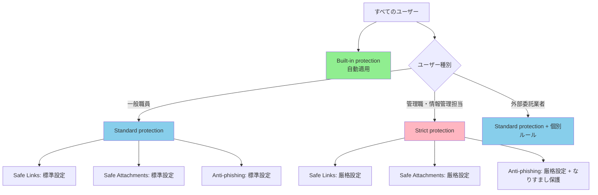
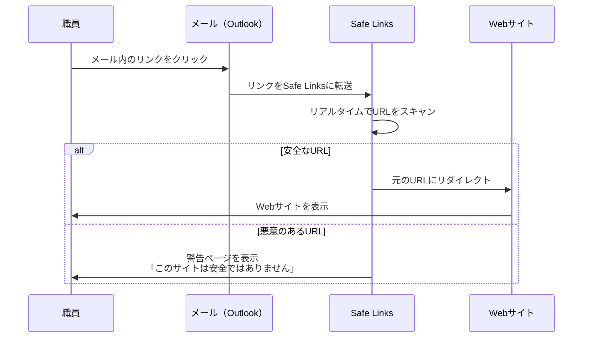
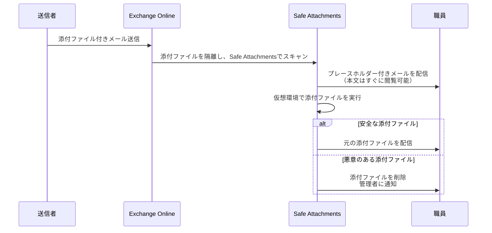
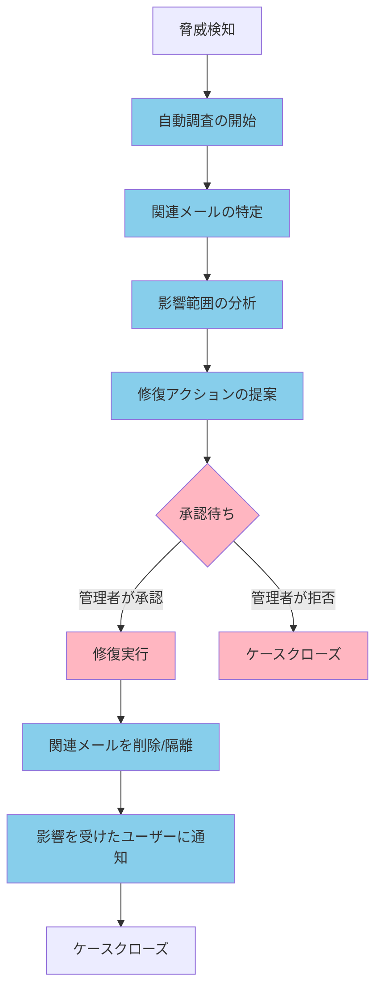

# 14.1 教育委員会向け Defender for Office 365 設計

## 14.1.1 Defender for Office 365とは

**Microsoft Defender for Office 365**は、メール、Teams、SharePoint、OneDrive などのコラボレーションツールを高度な脅威から保護するクラウドベースのセキュリティソリューションです。

**主な機能**:
- **Safe Links（安全なリンク）**: メール内の悪意のあるURLをクリック時にブロック
- **Safe Attachments（安全な添付ファイル）**: 添付ファイルを仮想環境で実行し、マルウェアを検知
- **Anti-phishing（フィッシング対策）**: なりすましメールや詐欺メールを検知・ブロック
- **Attack Simulation Training（攻撃シミュレーショントレーニング）**: 職員向けのフィッシング訓練
- **Threat Explorer（脅威エクスプローラー）**: 過去の脅威を詳細に調査
- **Automated Investigation and Response（自動調査と修復）**: 脅威を自動的に調査・修復

**ゼロトラストにおける役割**:
- **脅威の想定**: すべてのメールとリンクを疑う
- **最小権限**: 安全が確認されたリンク・添付ファイルのみ開封許可
- **継続的な検証**: クリック時にリアルタイムでURL検証

## 14.1.2 Microsoft 365 A5に含まれるDefender for Office 365のライセンス

**Microsoft 365 A5には、Defender for Office 365 Plan 2が含まれています**。

### Plan 1 と Plan 2 の違い

| 機能 | Plan 1 | Plan 2（A5に含まれる） |
|-----|--------|---------------------|
| **Safe Links** | ✅ | ✅ |
| **Safe Attachments** | ✅ | ✅ |
| **Anti-phishing protection** | ✅ | ✅ |
| **Real-time detections** | ✅ | ❌ （Plan 2では代わりにThreat Explorer） |
| **Threat Explorer** | ❌ | ✅ A5に含まれる |
| **Automated Investigation and Response（AIR）** | ❌ | ✅ A5に含まれる |
| **Attack Simulation Training** | ❌ | ✅ A5に含まれる |
| **Threat Trackers** | ❌ | ✅ A5に含まれる |

**教育委員会でのメリット**:
- ✅ **Attack Simulation Training**: IT管理者が職員向けにフィッシング訓練を実施可能
- ✅ **Threat Explorer**: 過去の攻撃を詳細に調査し、傾向を分析
- ✅ **AIR**: 自動調査・修復により、IT管理者の負担を軽減

## 14.1.3 保護ポリシーの設計方針

Defender for Office 365には、**事前構成済みセキュリティポリシー（Preset Security Policies）** があります。

### 3つの保護レベル

| レベル | 説明 | 推奨適用対象 |
|-------|------|------------|
| **Built-in protection** | Exchange Online Protection（EOP）の基本保護 | すべてのユーザー（自動適用） |
| **Standard protection** | 標準的な保護レベル | ほとんどのユーザー向け |
| **Strict protection** | 厳格な保護レベル（誤検知リスク増） | 機密性2B以上を扱う管理職・管理者向け |

**教育委員会での推奨設計**:



---

# 14.2 脅威保護ポリシーの構成

## 14.2.1 事前構成済みセキュリティポリシーの有効化

**推奨**: まずは事前構成済みポリシーを適用し、必要に応じてカスタムポリシーを追加します。

### Standard protectionの有効化手順

**1. Microsoft Defender ポータルにアクセス**

https://security.microsoft.com にサインインします。

**2. Preset security policiesを開く**

- **Email & collaboration** → **Policies & rules** → **Threat policies** → **Preset Security Policies**

**3. Standard protectionの構成**

- **Standard protection** セクションで **Manage** をクリック

**4. 適用範囲の設定**

```
【Exchange Online Protection（EOP）の適用範囲】
適用対象: All recipients
例外: Strict protection適用グループ

【Defender for Office 365 protectionの適用範囲】
適用対象: All recipients
例外: Strict protection適用グループ
```

**5. 保護機能の確認**

Standard protectionで有効化される機能:
- ✅ Safe Links（すべてのリンクをスキャン）
- ✅ Safe Attachments（仮想環境で添付ファイルを実行）
- ✅ Anti-phishing（なりすまし検知）
- ✅ Anti-spam（スパムフィルター）
- ✅ Anti-malware（マルウェアフィルター）

### Strict protectionの有効化手順

**1. 対象グループの作成**

Microsoft 365 管理センターまたはEntra ID管理センターで、Strict protection適用対象のセキュリティグループを作成します。

```
グループ名: 校務用PC-Strict-Protection-Users
メンバー: 管理職、情報管理担当者、個人情報を扱う職員
```

**2. Strict protectionの構成**

- **Strict protection** セクションで **Manage** をクリック
- 適用対象: `校務用PC-Strict-Protection-Users` グループ

**3. 保護機能の確認**

Strict protectionでは、Standard protectionよりも厳格な設定が適用されます:
- Safe Links: リンクの書き換えを強制、クリック追跡を有効化
- Safe Attachments: 添付ファイルが安全と確認されるまで配信をブロック
- Anti-phishing: なりすまし保護の閾値を厳格化

:::message alert
⚠️ **注意**: Strict protectionは誤検知のリスクが増加します。適用前に、対象ユーザーに事前通知し、業務への影響を確認してください。
:::

## 14.2.2 Safe Links（安全なリンク）の詳細設定

**Safe Links**は、メールやTeams内のURLをクリック時にリアルタイムでスキャンし、悪意のあるURLをブロックします。

### Safe Linksの仕組み



### Safe Linksの推奨設定（カスタムポリシー）

事前構成済みポリシーで不十分な場合、カスタムポリシーを作成します。

**1. Safe Linksポリシーの作成**

- **Email & collaboration** → **Policies & rules** → **Threat policies** → **Safe Links**
- **Create** をクリック

**2. 基本情報の入力**

```
名前: 校務用PC-Safe Links（教育委員会カスタム）
説明: 教育委員会の校務用PCに適用するSafe Linksポリシー
```

**3. URL & click protection設定**

| 設定項目 | 推奨値 | 説明 |
|---------|--------|------|
| **On: Safe Links checks a list of known, malicious links when users click links in email** | ✅ Enable | メール内のリンクをスキャン |
| **Apply Safe Links to email messages sent within the organization** | ✅ Enable | 内部メールにも適用 |
| **Apply real-time URL scanning for suspicious links and links that point to files** | ✅ Enable | クリック時にリアルタイムスキャン |
| **Wait for URL scanning to complete before delivering the message** | ❌ Disable（Standard）<br/>✅ Enable（Strict） | メッセージ配信を待機（業務への影響を考慮） |
| **Do not rewrite URLs, do checks via Safe Links API only** | ❌ Disable | URLを書き換えてSafe Linksを適用 |
| **Do not rewrite the following URLs in email** | 信頼するドメインを追加（オプション） | 例: `https://youreducation.jp/*` |

**4. Teams, Office apps への適用**

| 設定項目 | 推奨値 |
|---------|--------|
| **Microsoft Teams** | ✅ Enable |
| **Office 365 apps** | ✅ Enable |

**5. 通知設定**

| 設定項目 | 推奨値 | 説明 |
|---------|--------|------|
| **Display the organization branding on warning and notification pages** | ✅ Enable | 組織名を警告ページに表示 |
| **Use custom notification text** | オプション | カスタムメッセージを追加 |

**6. 割り当て**

すべての校務用ユーザーに適用します。

## 14.2.3 Safe Attachments（安全な添付ファイル）の詳細設定

**Safe Attachments**は、添付ファイルを仮想環境（サンドボックス）で実行し、マルウェアを検知します。

### Safe Attachmentsの仕組み（Dynamic Delivery）



### Safe Attachmentsの推奨設定

**1. Safe Attachmentsポリシーの作成**

- **Email & collaboration** → **Policies & rules** → **Threat policies** → **Safe Attachments**
- **Create** をクリック

**2. 基本情報の入力**

```
名前: 校務用PC-Safe Attachments（教育委員会カスタム）
説明: 教育委員会の校務用PCに適用するSafe Attachmentsポリシー
```

**3. Safe Attachments unknown malware response 設定**

| 設定項目 | 推奨値 | 説明 |
|---------|--------|------|
| **Safe Attachments unknown malware response** | **Dynamic Delivery** | ✅ 推奨：メール本文をすぐ配信、添付ファイルは安全確認後 |
|  | Monitor | スキャンのみ、ブロックしない（非推奨） |
|  | Block | 添付ファイル付きメールをすべてブロック（厳格すぎる） |
|  | Replace | 添付ファイルを削除し、警告メッセージに置き換え |

**推奨**: **Dynamic Delivery**（業務への影響を最小化しつつ、安全性を確保）

**4. Quarantine policy**

| 設定項目 | 推奨値 |
|---------|--------|
| **Quarantine policy** | **AdminOnlyAccessPolicy** |

**5. Redirect messages with detected attachments**

| 設定項目 | 推奨値 | 説明 |
|---------|--------|------|
| **Enable redirect** | ✅ Enable（オプション） | 検知された添付ファイルを管理者に転送 |
| **Send messages that contain blocked, monitored, or replaced attachments to the specified email address** | セキュリティ管理者のメールアドレス | 例: `security-team@youreducation.jp` |

**6. 割り当て**

すべての校務用ユーザーに適用します。

## 14.2.4 Anti-phishing（フィッシング対策）の詳細設定

**Anti-phishing**は、なりすましメールや詐欺メールを検知し、ブロックまたは隔離します。

### Anti-phishingの保護機能

| 保護機能 | 説明 |
|---------|------|
| **User impersonation protection** | 特定のユーザー（管理職、校長など）のなりすましを検知 |
| **Domain impersonation protection** | 組織ドメインのなりすましを検知 |
| **Mailbox intelligence** | AIが通常の送信者パターンを学習し、異常を検知 |
| **Spoof intelligence** | SPF/DKIM/DMARCに基づいてスプーフィングを検知 |

### Anti-phishingの推奨設定

**1. Anti-phishingポリシーの作成**

- **Email & collaboration** → **Policies & rules** → **Threat policies** → **Anti-phishing**
- **Create** をクリック

**2. 基本情報の入力**

```
名前: 校務用PC-Anti-phishing（教育委員会カスタム）
説明: 教育委員会の校務用PCに適用するAnti-phishingポリシー
```

**3. Phishing threshold & protection 設定**

| 設定項目 | 推奨値 | 説明 |
|---------|--------|------|
| **Phishing email threshold** | **2 - Aggressive**（Standard）<br/>**3 - More aggressive**（Strict） | フィッシング検知の感度 |
| **Enable users to protect** | ✅ Enable | 特定ユーザーのなりすまし保護 |
| **Users to protect** | 管理職、校長、教育長など | 例: `principal@youreducation.jp` |
| **Enable domains to protect** | ✅ Enable | ドメインのなりすまし保護 |
| **Include domains I own** | ✅ Enable | 組織ドメイン（例: `youreducation.jp`） |
| **Include custom domains** | オプション | 信頼するパートナードメイン |
| **Enable mailbox intelligence** | ✅ Enable | AIによる送信者パターン学習 |
| **Enable intelligence for impersonation protection** | ✅ Enable | AIベースのなりすまし検知 |

**4. Actions 設定**

| 検知タイプ | 推奨アクション（Standard） | 推奨アクション（Strict） |
|----------|------------------------|----------------------|
| **User impersonation** | Move message to Junk Email folder | Quarantine the message |
| **Domain impersonation** | Move message to Junk Email folder | Quarantine the message |
| **Mailbox intelligence impersonation** | Move message to Junk Email folder | Quarantine the message |
| **Spoof intelligence** | Move message to Junk Email folder | Quarantine the message |

**5. 通知設定**

| 設定項目 | 推奨値 |
|---------|--------|
| **Show first contact safety tip** | ✅ Enable |
| **Show user impersonation safety tip** | ✅ Enable |
| **Show domain impersonation safety tip** | ✅ Enable |
| **Show user impersonation unusual characters safety tip** | ✅ Enable |

**6. 割り当て**

すべての校務用ユーザーに適用します。

---

# 14.3 Attack Simulation Training（攻撃シミュレーション訓練）

## 14.3.1 Attack Simulation Trainingとは

**Attack Simulation Training**は、職員向けのフィッシング訓練を実施し、セキュリティ意識を向上させる機能です（Microsoft 365 A5に含まれる）。

**メリット**:
- ✅ **現実的なフィッシング攻撃をシミュレーション**: 実際の攻撃手法を模擬
- ✅ **職員のセキュリティ意識向上**: フィッシングメールの見分け方を学習
- ✅ **Predicted Compromise Rate（PCR）**: 組織全体のリスクを可視化
- ✅ **自動トレーニング**: フィッシングに引っかかった職員に自動的にトレーニングを割り当て

## 14.3.2 シミュレーションの種類

Attack Simulation Trainingでは、実際のフィッシング攻撃手法を模擬した複数のシミュレーションタイプが用意されています。認証情報の窃取、マルウェア添付、不正アプリへの許可要求など、多様な攻撃パターンを訓練に取り入れることで、職員のセキュリティ意識を総合的に向上させます。教育委員会では、業務実態に即した具体的なシナリオで訓練を実施します。

| シミュレーションタイプ | 説明 | 教育委員会での活用例 |
|-------------------|------|------------------|
| **Credential Harvest** | 偽のログインページで認証情報を盗む | 偽のMicrosoft 365ログインページ |
| **Malware Attachment** | マルウェア添付ファイル | 「年末調整のお知らせ.exe」 |
| **Link in Attachment** | 添付ファイル内に悪意のあるリンク | 偽の文部科学省通知PDF |
| **Link to Malware** | 悪意のあるファイルへのリンク | 「重要書類.zip」ダウンロードリンク |
| **Drive-by URL** | 悪意のあるWebサイトへのリンク | 「職員アンケート」の偽サイト |
| **OAuth Consent Grant** | 不正なアプリへのアクセス許可を要求 | 偽の「カレンダー連携アプリ」 |

## 14.3.3 フィッシングシミュレーションの実施手順

### フェーズ1: トライアルシミュレーション（小規模テスト）

**1. Microsoft Defender ポータルにアクセス**

- **Email & collaboration** → **Attack simulation training**

**2. Simulationsタブで新しいシミュレーションを作成**

- **Simulations** タブ → **Launch a simulation** をクリック

**3. シミュレーションタイプの選択**

まずは**Credential Harvest**（認証情報の窃取）から始めることを推奨します。

**4. シミュレーション名と説明**

```
名前: 【トライアル】Microsoft 365偽ログインページ訓練
説明: IT管理者向けトライアルシミュレーション。偽のMicrosoft 365ログインページで認証情報を入力しないかをテスト。
```

**5. ペイロード（攻撃内容）の選択**

- **Select payload** → **Global payloads**タブから選択
- 推奨: "Microsoft 365 password expiration" または類似のテンプレート

:::details ペイロードの例
```
件名: 【重要】Microsoft 365パスワードの有効期限が近づいています

本文:
あなたのMicrosoft 365パスワードは3日後に期限切れになります。
引き続きメールとファイルにアクセスするには、今すぐパスワードを更新してください。

[パスワードを更新する]

※このリンクをクリックすると、偽のログインページに誘導されます
```
:::

**6. ターゲットユーザーの選択**

トライアルでは、IT管理者とセキュリティ担当者のみを対象にします。

```
対象: IT管理者グループ（5-10名程度）
```

**7. トレーニングの割り当て**

| 設定項目 | 推奨値 |
|---------|--------|
| **Training assignment** | **Assign training for me** |
| **Training due date** | シミュレーション後7日以内 |

**8. スケジュールの設定**

```
開始日時: 平日の午前10時（業務時間中）
```

**9. ランディングページ（結果ページ）の設定**

- **Microsoft default landing page**（推奨）
- カスタムメッセージ: 「これはフィッシング訓練でした。実際の攻撃では、認証情報を入力しないでください。」

**10. シミュレーション開始**

**Launch** をクリックしてシミュレーションを開始します。

### フェーズ2: 結果の確認と改善

**1. シミュレーション結果の確認**

- **Attack simulation training** → **Simulations** タブ → シミュレーション名をクリック

**表示される指標**:
- **Compromised users**: フィッシングに引っかかったユーザー数
- **Compromised rate**: 引っかかった割合
- **Reported users**: フィッシングメールを報告したユーザー数

**2. 結果の分析**

| 指標 | 評価 |
|-----|------|
| Compromised rate < 10% | ✅ 優良：職員のセキュリティ意識が高い |
| Compromised rate 10-30% | ⚠️ 要注意：追加トレーニングが必要 |
| Compromised rate > 30% | ❌ 危険：緊急のセキュリティ意識向上施策が必要 |

**3. フィッシングに引っかかった職員への対応**

- 自動的にトレーニングが割り当てられます
- トレーニング完了を確認し、未完了者にはリマインダーを送信

### フェーズ3: 全職員向けシミュレーションの実施

トライアル結果を踏まえ、全職員向けにシミュレーションを実施します。

**推奨頻度**:
- 年4回（四半期ごと）
- 毎回異なるシミュレーションタイプを実施

**年間計画例**:

| 時期 | シミュレーションタイプ | テーマ |
|-----|-------------------|------|
| 4月 | Credential Harvest | 新年度のパスワード更新通知 |
| 7月 | Malware Attachment | 夏季休暇の連絡文書 |
| 10月 | Link in Attachment | 文部科学省からの通知（偽） |
| 1月 | Drive-by URL | 年末調整の確認サイト |

## 14.3.4 Predicted Compromise Rate（PCR）の活用

**PCR（予測侵害率）** は、組織全体がフィッシング攻撃にどれだけ脆弱かを示す指標です。

**確認方法**:
- **Attack simulation training** → **Overview** タブ → **Predicted Compromise Rate**

**PCRの評価**:
- PCR < 5%: ✅ 優良
- PCR 5-15%: ⚠️ 標準的
- PCR > 15%: ❌ 危険（追加施策が必要）

**PCR改善施策**:
1. シミュレーション頻度を増やす（年4回 → 月1回）
2. 引っかかった職員への個別トレーニング
3. セキュリティ意識向上キャンペーン（ポスター、メール配信）

---

# 14.4 脅威の調査と対応

## 14.4.1 Threat Explorer（脅威エクスプローラー）

**Threat Explorer**は、過去の脅威を詳細に調査できるツールです（Plan 2に含まれる、Real-time detectionsはPlan 1）。

**主な機能**:
- 過去30日間のメール脅威を可視化
- フィッシング、マルウェア、スパムの詳細調査
- 特定の送信者や件名でフィルタリング
- 脅威の傾向分析

### Threat Explorerの使い方

**1. Microsoft Defender ポータルにアクセス**

- **Email & collaboration** → **Explorer**

**2. ビューの選択**

| ビュー | 説明 |
|-------|------|
| **All email** | すべてのメールを表示 |
| **Malware** | マルウェアが検知されたメールのみ |
| **Phish** | フィッシングメールのみ |
| **User-reported** | ユーザーが報告したメールのみ |

**3. フィルタリング**

| フィルター | 用途 |
|----------|------|
| **Sender** | 特定の送信者からのメールを調査 |
| **Recipient** | 特定の受信者宛のメールを調査 |
| **Subject** | 件名でフィルタリング |
| **Detection technology** | 検知技術（Safe Links, Safe Attachments, etc.） |
| **Delivery action** | 配信アクション（Delivered, Blocked, Quarantined） |

**4. 脅威の詳細確認**

メールをクリックすると、以下の詳細情報が表示されます:
- 送信者、受信者、件名
- 検知された脅威の種類（マルウェア、フィッシング、etc.）
- 実行されたアクション（隔離、削除、etc.）
- メールヘッダー情報

### 脅威調査の実践例: 標的型攻撃の調査

**シナリオ**: ある職員が「文部科学省からの重要通知」という件名のメールを受信し、不審に思って報告しました。

**調査手順**:

1. **Threat Explorer** → **Phish** ビューを開く
2. **Subject** フィルターで「文部科学省」を検索
3. 該当メールをクリックし、詳細を確認:
   - 送信者: `notification@mext-gov.co.jp`（偽ドメイン）
   - 本物: `notification@mext.go.jp`
   - 検知技術: Anti-phishing (Domain impersonation)
   - アクション: Quarantined（隔離済み）
4. **同じ送信者からの他のメールを調査**:
   - **Sender** フィルターで `notification@mext-gov.co.jp` を検索
   - 結果: 他に15名の職員にも送信されていた
5. **対応**:
   - すべてのメールを削除
   - 受信者に注意喚起メールを送信
   - Transport Rule（メールフロールール）で該当ドメインをブロック

## 14.4.2 Automated Investigation and Response（AIR）

**AIR（自動調査と修復）** は、脅威を検知したときに自動的に調査・修復を行う機能です（Plan 2に含まれる）。

### AIRのワークフロー



### 承認待ちアクションの確認と承認

**1. Action Centerにアクセス**

- **Actions & submissions** → **Action center**

**2. Pending タブで承認待ちアクションを確認**

表示される情報:
- 調査ID
- 脅威の種類（Phishing, Malware, etc.）
- 推奨アクション（Soft delete email, Move to Junk, etc.）
- 影響を受けるメール数

**3. アクションの詳細を確認**

- 調査結果を確認
- 誤検知ではないことを確認
- 影響範囲を確認

**4. アクションを承認**

- **Approve** をクリックして修復を実行

:::message
💡 **Tip**: AIRは誤検知のリスクを最小化するため、修復アクションを自動実行せず、管理者の承認を待ちます。緊急度が高い場合は、すぐに承認してください。
:::

## 14.4.3 インシデント発生時の対応フロー

### フィッシングメール大量送信インシデントの対応例

**シナリオ**: 校務用メールアドレス宛に、「パスワード有効期限切れ」という件名のフィッシングメールが100通以上送信されました。

**対応フロー**:

**1. 初動対応（5分以内）**

- **Threat Explorer** で脅威の全体像を把握
- 影響を受けたユーザー数を確認
- 同じ送信者からの他のメールを検索

**2. 封じ込め（10分以内）**

- **AIRの承認待ちアクション**を即座に承認し、関連メールを削除
- **Transport Rule**で送信者ドメインをブロック

```
条件: Sender domain is 'malicious-domain.com'
アクション: Reject the message with the explanation "Blocked by security policy"
```

**3. 影響範囲の確認（30分以内）**

- **Threat Explorer**で、過去7日間に同じ送信者からのメールを調査
- フィッシングに引っかかったユーザーを特定:
  - リンクをクリックしたユーザー → **Safe Links**のログで確認
  - 認証情報を入力したユーザー → **パスワードリセット**を強制

**4. 事後対応（24時間以内）**

- 全職員に注意喚起メールを送信
- 影響を受けたユーザーに個別トレーニングを割り当て
- インシデントレポートの作成

**5. 再発防止策（1週間以内）**

- **Anti-phishing**ポリシーの設定を見直し
- **Attack Simulation Training**で類似のフィッシング訓練を実施
- **Threat Tracker**で同様の脅威を継続監視

---

# まとめ

本章では、Microsoft Defender for Office 365によるメール・コラボレーション保護について解説しました。

**本章で学んだこと**:

1. **Defender for Office 365設計**: Plan 2がA5に含まれる、Standard vs Strict protection
2. **脅威保護ポリシー**: Safe Links、Safe Attachments、Anti-phishing、Anti-spamの構成
3. **Attack Simulation Training**: 職員向けフィッシング訓練の実施、PCRの活用
4. **脅威の調査と対応**: Threat Explorerでの脅威調査、AIRによる自動修復

