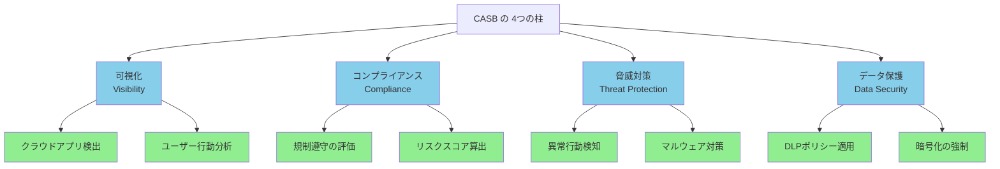
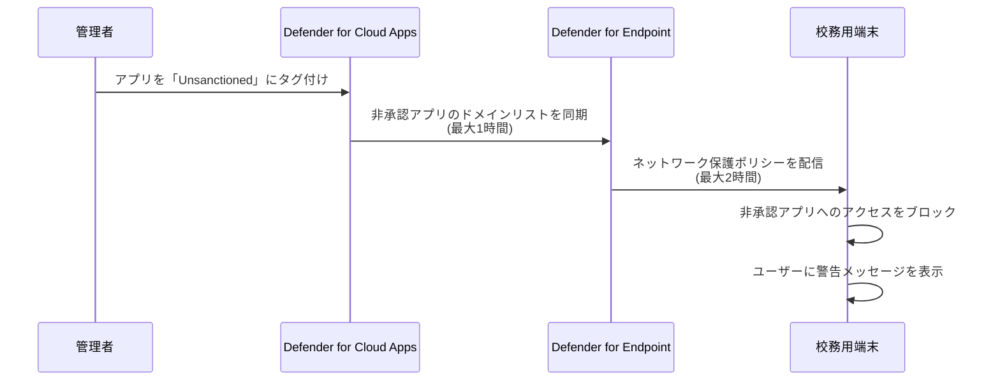
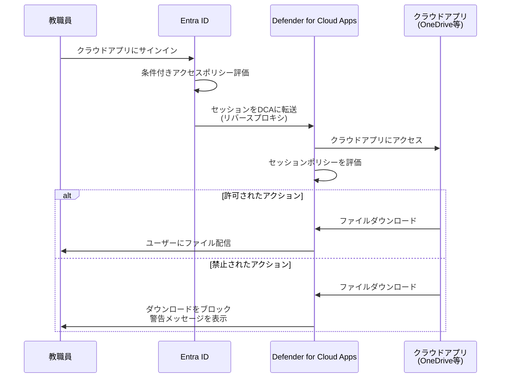

# 15.1 教育委員会における CASB の必要性

教育現場では、校務用PC以外にも、教職員が個人的に契約したクラウドストレージ(Dropbox、Google Drive等)を使用し、児童生徒の個人情報を含むファイルを持ち出すリスクがあります。Microsoft Defender for Cloud Appsは、CASB(Cloud Access Security Broker)として、組織内で使用されているすべてのクラウドアプリを可視化し、許可されていないアプリ(シャドーIT)の利用を検知・制御します。

:::message
**本章の前提条件**:
- Microsoft 365 A5ライセンスが必要(Defender for Cloud Appsが含まれる)
- 第9章でDefender for Endpointがオンボード済み
- 第6章で条件付きアクセスが構成済み
:::

---

## 15.1.1 シャドーITのリスク

### 教育現場でのシャドーIT利用の実態

**シャドーIT**とは、IT部門が把握・管理していないクラウドサービスやアプリの利用です。

**教育委員会での典型的なシャドーITシナリオ**:

| シナリオ | 使用されるアプリ | リスク |
|---------|--------------|-------|
| **成績情報の持ち帰り** | Dropbox, Google Drive | 個人契約アカウントに児童生徒情報を保存 |
| **資料共有** | WeTransfer, SendAnywhere | 大容量ファイル転送サービスで機密情報を送信 |
| **メモ・ノート** | Evernote, Notion | 児童生徒の相談記録を個人アカウントに保存 |
| **チャット** | LINE, Slack(個人契約) | 保護者とのやり取りで個人情報が流出 |

### シャドーITの3大リスク

**1. データ漏洩リスク**
- 個人契約のクラウドサービスにアップロードされたデータは組織の管理外
- サービス終了・アカウント削除でデータが消失
- 第三者によるアカウント侵害でデータが流出

**2. コンプライアンスリスク**
- GDPR、個人情報保護法違反
- 教育情報セキュリティポリシー違反
- 監査証跡が残らない

**3. セキュリティリスク**
- セキュリティ認証(SOC2、ISO27001等)が不明
- データの保存場所が不明(海外サーバー等)
- 暗号化の有無が不明

## 15.1.2 CASBの4つの柱

**Microsoft Defender for Cloud Appsは、CASBの4つの柱を提供します**:



### 1. 可視化(Visibility)

**Cloud Discovery**により、組織内のクラウドアプリ利用を可視化:
- どの教職員がどのクラウドアプリを使用しているか
- どれだけのデータがアップロード・ダウンロードされているか
- 31,000以上のアプリカタログと照合し、リスク評価

### 2. コンプライアンス(Compliance)

**アプリのコンプライアンス評価**:
- SOC2、ISO27001、HIPAA等の認証取得状況
- データ保存場所(国・リージョン)
- プライバシーポリシーの有無

### 3. 脅威対策(Threat Protection)

**異常な行動の検知**:
- 通常と異なる場所からのアクセス
- 大量ダウンロード
- 退職予定者の行動監視

### 4. データ保護(Data Security)

**機密情報の保護**:
- 秘密度ラベルの適用
- DLPポリシーによる情報流出防止
- ダウンロード制御

---

# 15.2 クラウドアプリの検出と管理

クラウドアプリの検出(Cloud Discovery)により、組織内で使用されているすべてのクラウドサービスを可視化します。Defender for Endpointとの統合により、エージェントレスで校務用端末のクラウドアプリ利用を自動的に検出できます。

## 15.2.1 Cloud Discoveryの構成

### Defender for Endpointとの統合

**推奨方法**: Defender for Endpointとの統合(エージェントレス)

**メリット**:
- ✅ 追加ソフトウェアのインストール不要
- ✅ Windows 10/11デバイスを自動監視
- ✅ 第9章でオンボード済みならすぐに利用可能

**設定手順**:

**1. Microsoft Defender for Cloud Appsポータルにアクセス**

https://security.microsoft.com にサインイン → **Settings** → **Cloud Apps**

**2. Defender for Endpoint統合を有効化**

- **Cloud Discovery** → **Microsoft Defender for Endpoint**
- **Enable Microsoft Defender for Endpoint integration** をオンに設定
- **Save** をクリック

**3. 検出開始の確認**

数時間後、**Cloud Discovery** → **Discovered apps** で検出されたアプリが表示されます。

### 検出されるアプリの例

**Defender for Cloud Appsのカタログには31,000以上のアプリが登録**:

| カテゴリ | アプリ例 |
|---------|---------|
| **クラウドストレージ** | Dropbox, Google Drive, Box, OneDrive(個人) |
| **コラボレーション** | Slack, Microsoft Teams, Zoom |
| **ファイル転送** | WeTransfer, SendAnywhere |
| **ノート・メモ** | Evernote, Notion, Google Keep |
| **AIツール** | ChatGPT, Google Gemini, Claude(第13章参照) |

## 15.2.2 シャドーITの特定

### 検出されたアプリの確認

**Microsoft Defender Portal → Cloud Apps → Cloud Discovery → Discovered apps**

**表示される情報**:

| 項目 | 説明 |
|-----|------|
| **App name** | アプリ名 |
| **Users** | 使用しているユーザー数 |
| **Transactions** | トランザクション数(アクセス回数) |
| **Traffic** | アップロード・ダウンロード量 |
| **Risk score** | リスクスコア(0-10、10が最も安全) |
| **Category** | カテゴリ(クラウドストレージ、コラボレーション等) |

### リスクスコアの評価

**リスクスコアの基準**:

| スコア | 評価 | 説明 |
|-------|------|------|
| **8-10** | 低リスク | SOC2取得、データ暗号化、MFA対応 |
| **5-7** | 中リスク | 一部の認証取得、暗号化あり |
| **0-4** | 高リスク | セキュリティ認証なし、暗号化不明 |

**リスクスコアの詳細確認**:

1. アプリ名をクリック
2. **Info** タブで詳細を確認:
   - セキュリティ対策(暗号化、MFA等)
   - コンプライアンス認証(SOC2、ISO27001等)
   - データ保存場所
   - プライバシーポリシー

## 15.2.3 アプリの承認・非承認管理

### 承認(Sanctioned)と非承認(Unsanctioned)のタグ付け

**承認アプリの例**:
- Microsoft OneDrive for Business
- Microsoft Teams
- Microsoft 365 Copilot

**非承認アプリの例**:
- Dropbox(個人契約)
- Google Drive(個人契約)
- WeTransfer

### アプリのタグ付け手順

**1. 非承認アプリのタグ付け**

- **Discovered apps** タブで非承認にするアプリの行末の「...」をクリック
- **Unsanctioned** を選択

**2. Defender for Endpointでのブロック**

非承認タグを付けたアプリは、自動的にDefender for Endpointに同期され、最大3時間以内に校務用端末からのアクセスがブロックされます。

**ブロックの仕組み**:



:::message alert
**ユーザーへの事前通知**:
非承認アプリのブロック前に、教職員に事前通知し、代替手段(OneDrive for Business等)を案内することを推奨します。
:::

## 15.2.4 アプリ検出ポリシーの作成

### 新規クラウドアプリ検出ポリシー

**目的**: 新しいクラウドアプリが使われ始めたら即座にアラート

**設定手順**:

**Microsoft Defender Portal → Cloud Apps → Policies → Policy management → Create policy → App discovery policy**

```
ポリシー名: 新規クラウドストレージアプリ検出
説明: 新しいクラウドストレージアプリが使われたら通知

フィルター:
- App category: Cloud Storage
- Risk score: < 7 (リスクスコア7未満)
- App tag: Untagged (タグ未設定)

トリガー条件:
- Number of users: 3 users/day以上

アクション:
- アラートをセキュリティ担当者にメール送信
- アプリを自動的に「Monitored」タグ付け
```

---

# 15.3 セッション制御(Conditional Access App Control)

Conditional Access App Controlは、条件付きアクセスと統合し、クラウドアプリのセッションをリアルタイムで制御します。非管理デバイスからのファイルダウンロードをブロックしたり、機密ファイルのアップロードを監視・制御できます。

## 15.3.1 Conditional Access App Controlとは

**Conditional Access App Control**は、クラウドアプリのセッションをリアルタイムで監視・制御する機能です。

### 主な機能

| 機能 | 説明 | 教育委員会での活用例 |
|-----|------|------------------|
| **ダウンロード制御** | 非管理デバイスからのダウンロードをブロック | 個人PCからの成績表ダウンロード防止 |
| **アップロード制御** | 機密ファイルのアップロードを監視 | 個人Dropboxへの児童生徒情報アップロード防止 |
| **コピー/貼り付け制御** | セッション内のコピー/貼り付けを制限 | 機密情報の外部への転記防止 |
| **マルウェアスキャン** | アップロードファイルのマルウェア検査 | ランサムウェア感染ファイルのブロック |
| **秘密度ラベル適用** | ダウンロード時に自動的にラベルを適用 | 機密情報保護の強制 |

### 動作の仕組み



## 15.3.2 セッションポリシーの作成

### 前提条件

**1. 条件付きアクセスポリシーの作成**

セッションポリシーを動作させるには、Entra IDの条件付きアクセスポリシーが必要です。

**Microsoft Entra管理センター → Protection → Conditional Access → Policies → New policy**

```
ポリシー名: Defender for Cloud Apps セッション制御

割り当て:
- Users: すべてのユーザー
- Target resources: Office 365 SharePoint Online, Office 365 Exchange Online
- Conditions:
  - Device platforms: iOS, Android, Windows(非準拠)

アクセス制御:
- Session: Use Conditional Access App Control
  → Use custom policy (カスタムポリシーを使用)
```

### ファイルダウンロード制御ポリシーの作成

**目的**: 非管理デバイスから機密ファイルのダウンロードをブロック

**設定手順**:

**Microsoft Defender Portal → Cloud Apps → Policies → Policy management → Create policy → Session policy**

**1. 基本情報**

```
ポリシー名: 非管理デバイスからの機密ファイルダウンロードブロック
説明: 機密性2B以上のファイルを非管理デバイスからダウンロード不可
Policy severity: High
Category: DLP
```

**2. Session control type**

```
Session control type: Control file download (with inspection)
```

**3. Activity source**

```
Activities matching all of the following:

- Device tag: Does not equal
  → Intune compliant
  → Hybrid Azure AD joined

- App: Equals
  → Office 365 SharePoint Online
  → Office 365 OneDrive for Business
```

**4. Files**

```
Files matching all of the following:

- Sensitivity label: Equals
  → 機密性2B（校務専用・教職員のみ）
  → 機密性3（秘密）
```

**5. Actions**

```
Action: Block

Customize block message:
「このファイルは校務用PCからのみダウンロード可能です。個人PCからはアクセスできません。」
```

### ファイルアップロード制御ポリシーの作成

**目的**: 機密ファイルのアップロードを監視・制御

**設定手順**:

**Microsoft Defender Portal → Cloud Apps → Policies → Policy management → Create policy → Session policy**

**1. 基本情報**

```
ポリシー名: 機密ファイルのアップロード監視
説明: 秘密度ラベル付きファイルのアップロードを監視
Policy severity: Medium
Category: DLP
```

**2. Session control type**

```
Session control type: Control file upload (with inspection)
```

**3. Activity source**

```
Activities matching all of the following:

- App: Equals
  → Office 365 SharePoint Online
  → Office 365 OneDrive for Business
```

**4. Files**

```
Files matching all of the following:

- Sensitivity label: Equals
  → 機密性2B（校務専用・教職員のみ）
  → 機密性3（秘密）
```

**5. Inspection method**

```
Inspection method: Data Classification Services
```

**6. Actions**

```
Action: Monitor

Alert:
- Create an alert for each matching file
- Send alert as email: security-team@youreducation.jp
```

## 15.3.3 実践例: 外部共有制御

### シナリオ

教職員が成績情報ファイルを外部ドメインと共有しようとした際にブロックします。

### セッションポリシーの設定

```
ポリシー名: 外部共有ブロック（機密ファイル）

Session control type: Control file download (with inspection)

Activity source:
- App: Office 365 SharePoint Online
- Activity type: Share

Files:
- Sensitivity label: 機密性2B, 機密性3
- Sharing: External

Action: Block
Customize block message: 「このファイルは外部との共有が禁止されています。」
```

---

# まとめ

本章では、Microsoft Defender for Cloud Appsによるクラウドアプリの監視と制御について解説しました。

**本章で学んだこと**:

1. **CASBの必要性**: シャドーITのリスクと4つの柱(可視化、コンプライアンス、脅威対策、データ保護)
2. **Cloud Discovery**: Defender for Endpointとの統合によるシャドーIT検出、リスクスコア評価、承認・非承認管理
3. **Conditional Access App Control**: セッションポリシーによるファイルダウンロード・アップロード制御

