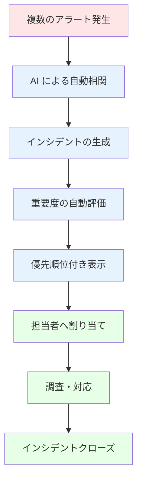
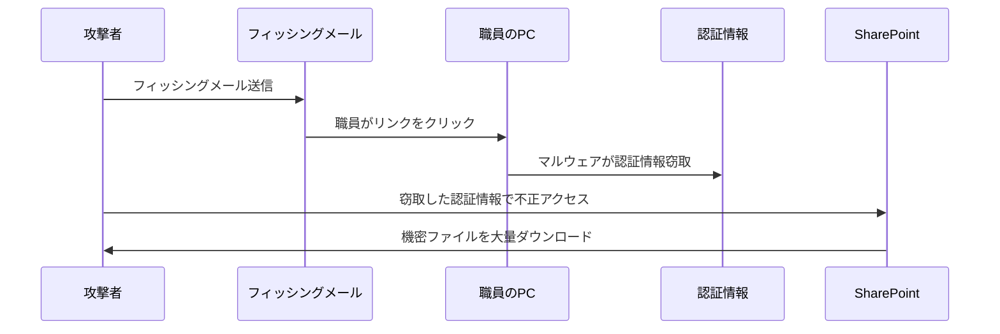

# Microsoft Defender ポータルと統合セキュリティ運用

本章では、これまでの章で設定してきた各種セキュリティ機能（Defender for Endpoint、Defender for Office 365、Defender for Cloud Apps、Insider Risk Management、Information Protection等）を、Microsoft Defender ポータル上で一元的に監視・運用する方法を解説します。セキュリティ担当者が日常的に確認すべきダッシュボード、インシデント対応の流れ、Microsoft Secure Scoreを活用した継続的改善の進め方を学びます。

# 16.1 Microsoft Defender ポータルの概要

Microsoft Defender ポータル（`https://security.microsoft.com`）は、Microsoft 365 A5 に含まれるすべてのセキュリティサービスを統合管理する**単一のコンソール**です。教育委員会のセキュリティ担当者は、このポータル一つで組織全体のセキュリティ状況を把握し、脅威に対応できます。

## 16.1.1 ポータルの構成要素

Microsoft Defender ポータルは、以下の主要エリアで構成されています。

### ホームページ（Home）

組織のセキュリティ状況を概観するダッシュボードです。

**表示される情報**:

- **アクティブな脅威**: 現在進行中のインシデント件数
- **リスクのある資産**: 侵害の可能性があるデバイス・ユーザー
- **セキュリティ態勢の概要**: Secure Scoreの現在値と推移
- **重要な通知**: 最新のセキュリティイベント

**教育委員会での活用例**:

毎朝、セキュリティ担当者がホームページを開き、前日からの変化を確認します。新規インシデントがあれば優先的に対応し、Secure Scoreの変動があれば原因を調査します。

### インシデントとアラート（Investigation & response）

複数のセキュリティサービスから発生したアラートを自動的に相関させ、**インシデント**として統合表示します。

**インシデント管理の流れ**:



**統合される主なアラートソース**:

| ソース | 検知内容 |
|--------|----------|
| **Defender for Endpoint** | エンドポイントへのマルウェア侵入、不審なプロセス実行 |
| **Defender for Office 365** | フィッシングメール、悪意のある添付ファイル |
| **Defender for Identity** | 不審なサインイン、権限昇格の試み |
| **Defender for Cloud Apps** | 異常なクラウドアプリ利用、大量ダウンロード |
| **Entra ID Protection** | リスクのあるサインイン、漏洩した認証情報の検出 |

### ハンティング（Hunting）

KQL（Kusto Query Language）を使用して、過去30日間のログデータを検索し、潜在的な脅威を能動的に探索します。

**Advanced Hunting の活用例**（教育委員会向け）:

**例1: 外部から機密性3ファイルをダウンロードした履歴を検索**

```kusto
CloudAppEvents
| where Timestamp > ago(7d)
| where Application == "Microsoft SharePoint Online"
| where ActionType == "FileDownloaded"
| where RawEventData.SensitivityLabel contains "機密性3"
| where IPAddress !startswith "10." and IPAddress !startswith "192.168."
| project Timestamp, AccountDisplayName, FileName, IPAddress, ISP
| order by Timestamp desc
```

**例2: 管理者アカウントで MFA なしサインインを検索**

```kusto
SigninLogs
| where TimeGenerated > ago(7d)
| where ResultType == 0  // 成功
| where AuthenticationRequirement == "singleFactorAuthentication"
| where UserPrincipalName contains "admin" or UserPrincipalName contains "管理"
| project TimeGenerated, UserPrincipalName, IPAddress, Location, DeviceDetail
```

### エクスポージャー管理（Exposure management）

組織の**攻撃面**を可視化し、脆弱性を評価します。

- **攻撃経路分析**: 攻撃者が侵入した場合、どの資産に到達可能かをマップ表示
- **重要資産の識別**: 校務システムサーバー、Active Directory等を「クリティカル資産」として保護優先度を設定

### エンドポイント（Endpoints）

Defender for Endpoint および Defender Vulnerability Management で検出されたデバイスの脆弱性を管理します。

**表示される情報**:

- ソフトウェアインベントリ（インストールされているアプリとバージョン）
- CVE（Common Vulnerabilities and Exposures）一覧
- セキュリティベースライン準拠状況

### ID（Identities）

Defender for Identity による ID 脅威の検出状況を表示します。

- 高特権アカウントの監視
- Kerberos攻撃の検出
- ドメイン構成の不備検出

## 16.1.2 ロールベースアクセス制御（RBAC）

Microsoft Defender ポータルでは、アクセス権限を細かく制御できます。教育委員会では、以下のような役割分担が推奨されます。

### 推奨ロール設計

| 役割 | 担当者 | 付与する権限 |
|------|--------|------------|
| **グローバル管理者** | 教育長・情報セキュリティ責任者 | すべての設定変更が可能（日常業務では使用しない） |
| **セキュリティ管理者** | 教育委員会ICT担当（セキュリティ専任） | ポリシー作成、インシデント対応、ユーザー管理 |
| **セキュリティオペレーター** | 教育委員会ICT担当（兼務） | インシデント調査・対応のみ（設定変更不可） |
| **セキュリティ閲覧者** | 校長・教頭 | ダッシュボード・レポート閲覧のみ |

### アクセス権限の設定手順

**1. Microsoft 365 管理センターにサインイン**

https://admin.microsoft.com → **ロールの割り当て** → **Entra ID roles**

**2. ロールを選択**

- セキュリティ管理者（Security Administrator）
- セキュリティオペレーター（Security Operator）
- セキュリティ閲覧者（Security Reader）

**3. ユーザーを追加**

**割り当て** → **メンバーの追加** → 該当ユーザーを選択 → **保存**

:::message alert
**重要**: 「グローバル管理者」は緊急時以外使用せず、PIM（Privileged Identity Management）で一時的に権限昇格する運用を推奨します。
:::

## 16.1.3 統合されたインシデント管理

従来は各サービス（Defender for Endpoint、Defender for Office 365等）ごとに個別のアラートを確認する必要がありましたが、Microsoft Defender ポータルでは**すべてのアラートが自動的に相関され、1つのインシデントにまとめられます**。

### インシデントの自動相関例

**シナリオ**: フィッシング攻撃から情報漏洩に至る複合攻撃

1. **Defender for Office 365** が不審なメールを検知（アラート1）
2. 職員がメールのリンクをクリック → **Defender for Endpoint** がマルウェアダウンロードを検知（アラート2）
3. マルウェアが認証情報を窃取 → **Defender for Identity** が不審なサインインを検知（アラート3）
4. 侵害アカウントで大量のファイルがダウンロードされる → **Defender for Cloud Apps** が異常行動を検知（アラート4）

**従来の運用**:
4つのアラートを個別に調査し、手動で関連性を判断する必要がありました。

**Microsoft Defender ポータルでの運用**:
4つのアラートが**自動的に1つのインシデントに統合**され、攻撃の全体像が視覚化されます。

### インシデントの詳細画面

インシデントを開くと、以下の情報が表示されます。

**攻撃ストーリー（Attack Story）**:



**タイムライン**:

| 時刻 | イベント | ソース |
|------|----------|--------|
| 9:05 | フィッシングメール受信 | Defender for Office 365 |
| 9:12 | リンククリック、マルウェアダウンロード | Defender for Endpoint |
| 9:15 | 認証情報窃取検知 | Defender for Identity |
| 9:20 | 大量ファイルダウンロード検知 | Defender for Cloud Apps |

**影響を受けた資産（Assets）**:

- **ユーザー**: 田中太郎（情報主任）
- **デバイス**: DESKTOP-ABC123（校務用PC）
- **メールアドレス**: tanaka@city-edu.jp
- **ファイル**: 生徒名簿2024.xlsx（機密性2B）

**推奨アクション**:

- ✅ ユーザーアカウントの無効化（既に自動実行済み）
- ✅ デバイスの隔離（既に自動実行済み）
- ⚠️ パスワードリセットの実施（要手動実行）
- ⚠️ アクセスされたファイルの確認（要手動実行）

---

# 16.2 日常的なセキュリティ監視

教育委員会のセキュリティ担当者が日々確認すべき項目と、その確認手順を解説します。

## 16.2.1 ダッシュボードの確認（毎朝の習慣）

**所要時間**: 5-10分

### 確認手順

**1. Microsoft Defender ポータルにアクセス**

https://security.microsoft.com → ホームページ

**2. 以下の項目を確認**

**①アクティブなインシデント件数**

- 前日比で増加していないか
- 重大度「高」「中」のインシデントがあるか

**②リスクのあるユーザー**

- リスクレベル「高」のユーザーが新規に発生していないか

**③デバイスの健全性**

- 非準拠デバイスの割合が閾値（5%）を超えていないか

**④最新のアラート**

- 過去24時間のアラート件数と傾向

### 正常時の目安（教育委員会200名規模）

| 指標 | 正常範囲 | 要注意 | 緊急対応 |
|------|----------|--------|----------|
| アクティブなインシデント | 0-2件 | 3-5件 | 6件以上 |
| リスクのあるユーザー | 0-1名 | 2-3名 | 4名以上 |
| 非準拠デバイス | 0-5% | 5-10% | 10%以上 |
| 高重要度アラート | 0件 | 1-2件 | 3件以上 |

### 異常検知時のアクション

**ケース1: 高重要度インシデントが発生している**

→ 16.2.2節「インシデントの調査」へ進む

**ケース2: リスクのあるユーザーが急増している**

→ 16.2.3節「アラートのトリアージ」で原因を特定

**ケース3: 非準拠デバイスが増加している**

→ Intune管理センターでコンプライアンスポリシー違反の原因を確認

## 16.2.2 アラートの確認とトリアージ

**所要時間**: 10-20分（件数により変動）

### アラートキューの開き方

https://security.microsoft.com/alerts → **Alerts** タブ

### 優先順位付け

**フィルターの設定**:

1. **重要度**: 高 → 中 → 低 の順
2. **状態**: 新規 → 進行中
3. **カテゴリ**: 以下を優先
   - 認証情報の侵害
   - データ流出
   - マルウェア実行

### トリアージの流れ

**Step 1: アラート概要を確認**

- アラート名から脅威の種類を理解（例: "Suspicious inbox forwarding rule"）
- 影響を受けた資産（ユーザー、デバイス）

**Step 2: 重要度を評価**

| アラートタイプ | 重要度判定 | 対応優先度 |
|---------------|-----------|-----------|
| 認証情報漏洩 | 高 | 即座に対応 |
| ランサムウェア検知 | 高 | 即座に対応 |
| フィッシング | 中 | 当日中に対応 |
| ポリシー違反（承認アプリの使用） | 低 | 週次レビューで対応 |

**Step 3: 対応アクション決定**

- **誤検知（False Positive）**: アラートを「誤検知」として分類 → 閉じる
- **真の脅威**: インシデントとして調査を開始
- **要監視**: 「進行中」に設定し、24時間後に再評価

### 教育委員会でよくあるアラートと対応

**アラート1: "Impossible travel"（物理的に不可能な移動）**

**シナリオ**:
山田先生が東京から10分後にロンドンでサインインしたと検知される。

**対応**:
1. ユーザーに確認 → ロンドンからのアクセスはしていない
2. パスワードリセットを実施
3. 該当セッションを強制終了
4. MFA再登録を依頼

**アラート2: "Mass download by user"（大量ダウンロード）**

**シナリオ**:
佐藤先生が1時間で100ファイルをダウンロード。

**対応**:
1. ユーザーに確認 → 年度末の資料整理のため正常な操作
2. アラートを「誤検知」として分類
3. 必要に応じて、教職員向けにアラートを発生させない操作方法を案内

**アラート3: "Malware detected on endpoint"**

**シナリオ**:
校務用PCでマルウェアを検知。

**対応**:
1. デバイスを自動隔離（Defender for Endpoint が自動実行）
2. マルウェアの種類と侵入経路を調査
3. 必要に応じてデバイスを初期化
4. 再発防止策を実施（Windows Update、ユーザー教育）

## 16.2.3 インシデントの調査

重要度が高いアラートや、複数のアラートが相関しているインシデントは、詳細調査が必要です。

### 調査手順

**1. インシデントページを開く**

https://security.microsoft.com/incidents → 該当インシデントをクリック

**2. 攻撃ストーリーを確認**

**Attack Story** タブで、攻撃の流れを時系列で把握します。

**確認ポイント**:

- 最初の侵入経路（フィッシングメール、VPN不正ログイン等）
- 攻撃者が侵害したアカウント・デバイス
- 攻撃者が実行したアクション（ファイルダウンロード、権限昇格等）
- 現在の攻撃ステータス（進行中、封じ込め済み）

**3. 影響範囲を特定**

**Assets** タブで、影響を受けた資産を確認します。

- **ユーザー**: アカウントが侵害されたか
- **デバイス**: マルウェアに感染したか
- **メールボックス**: 不正アクセスされたか
- **ファイル**: 機密ファイルが窃取されたか

**4. 証拠の収集**

**Evidence and Response** タブで、Defender が自動的に収集した証拠を確認します。

- **ファイル**: マルウェア実行ファイル、不審なスクリプト
- **プロセス**: 実行されたコマンド
- **レジストリ**: 変更されたレジストリキー
- **ネットワーク接続**: 攻撃者のC&Cサーバーへの通信

**5. 自動対応アクションの確認**

Microsoft Defender XDR は、以下のアクションを**自動的に実行**します（設定により異なる）。

- ✅ ユーザーアカウントの無効化
- ✅ デバイスの隔離
- ✅ メールの削除（ZAP: Zero-hour Auto Purge）
- ✅ ファイルの隔離

**Pending Action** と表示されているアクションがあれば、承認が必要です。

**6. 手動対応の実施**

自動対応で不十分な場合、手動でアクションを実行します。

| アクション | 実行方法 |
|-----------|----------|
| **パスワードリセット** | Entra ID 管理センター → ユーザー → パスワードのリセット |
| **MFA再登録** | Entra ID → ユーザー → 認証方法 → すべて削除 |
| **デバイス初期化** | Intune → デバイス → ワイプ |
| **ファイルアクセス権剥奪** | SharePoint → 該当ファイル → 共有設定 → 権限削除 |

**7. インシデントのクローズ**

対応が完了したら、インシデントを閉じます。

**分類**:

- **True Positive**: 真の脅威であり、対応完了
- **False Positive**: 誤検知
- **Benign Positive**: 承認された操作（異常ではない）

**コメント記入**:

対応内容、原因、再発防止策を記録します。

```
対応内容:
- 侵害されたアカウント（tanaka@city-edu.jp）のパスワードをリセット
- 該当デバイス（DESKTOP-ABC123）を隔離・初期化
- 窃取された可能性のあるファイル（生徒名簿2024.xlsx）のアクセスログを確認 → 外部流出なし

原因:
- フィッシングメールのリンクをクリックしたため

再発防止策:
- 全教職員にフィッシング訓練を実施（第14章の Attack Simulation Training）
- 機密性2B以上のファイルに対してDLPポリシーを強化
```

## 16.2.4 定期レポートの作成（教育長・校長向け）

教育委員会では、教育長や各学校の校長に対して、定期的にセキュリティ状況を報告する必要があります。

### 月次レポート作成手順

**1. Microsoft Defender ポータルにアクセス**

https://security.microsoft.com/securityreports

**2. レポートのエクスポート**

**Reports** → **General** → **Security report**

以下のレポートをエクスポート:

- Threat protection status（脅威対策状況）
- User reported messages（ユーザー報告メッセージ）
- Compromised users（侵害されたユーザー）

**3. レポート内容のまとめ**

**【セキュリティ月次レポート】**

**対象期間**: 2024年10月1日〜10月31日
**作成者**: 教育委員会ICT担当

**1. 概要**

| 指標 | 今月 | 先月 | 増減 |
|------|------|------|------|
| インシデント件数 | 3件 | 5件 | -2件（改善） |
| マルウェア検知 | 1件 | 2件 | -1件（改善） |
| フィッシング検知 | 120件 | 150件 | -30件（改善） |
| DLP違反 | 8件 | 10件 | -2件（改善） |
| Secure Score | 68% | 65% | +3%（改善） |

**2. 主なインシデント**

| 日付 | 概要 | 対応 | 状態 |
|------|------|------|------|
| 10/5 | フィッシングメール経由のマルウェア感染 | デバイス隔離・初期化 | 完了 |
| 10/12 | 機密ファイルの外部共有誤操作 | ファイル回収・教職員注意喚起 | 完了 |
| 10/25 | 不審なサインイン試行（ブロック済み） | パスワードリセット | 完了 |

**3. セキュリティ対策の進捗**

- ✅ 全教職員へのフィッシング訓練実施（クリック率: 15% → 8%に改善）
- ✅ Secure Score向上施策: レガシー認証ブロック実施
- 🔄 次月予定: デバイスコンプライアンスポリシー適用率100%達成

**4. 推奨事項**

- 機密ファイルの外部共有誤操作が継続発生 → DLPポリシー強化を推奨
- Secure Score 70%達成に向けて、MFA有効率100%を目指す

---

# 16.3 Microsoft Secure Score の活用

Microsoft Secure Score は、組織のセキュリティ態勢を0〜100%のスコアで可視化し、改善アクションを優先度付きで提示するツールです。教育委員会がA5を導入する最大の目的は、このスコアを向上させ、セキュリティリスクを継続的に低減することです。

## 16.3.1 Microsoft Secure Score とは

Secure Score は、Microsoft 365、Entra ID、Intune、Defender シリーズの設定状況を自動評価し、セキュリティレベルを数値化します。

### Secure Score の評価領域

| 領域 | 最大ポイント | 主な評価項目 |
|------|-------------|------------|
| **ID（Identity）** | 35% | MFA、条件付きアクセス、Identity Protection |
| **デバイス（Device）** | 25% | Intune登録、コンプライアンスポリシー、Defender for Endpoint |
| **データ（Data）** | 20% | Information Protection、DLP、暗号化 |
| **アプリ（Apps）** | 15% | Defender for Office 365、Defender for Cloud Apps |
| **インフラ（Infrastructure）** | 5% | 特権アクセス管理、PIM |

### Secure Score の確認方法

**Microsoft Defender ポータルにアクセス**

https://security.microsoft.com/securescore

**表示される情報**:

```
現在のスコア: 65% (325ポイント / 500ポイント)

├─ 達成済み: 325ポイント（実装済みの対策）
├─ 計画中: 100ポイント（計画済みだが未実装）
└─ 未対応: 75ポイント（対応していない項目）
```

**スコアの意味**:

- **70%以上**: 優良（多くの企業・教育機関の目標レベル）
- **50-70%**: 標準的（基本的な対策は実施済み）
- **30-50%**: 改善が必要（重要な対策が不足）
- **30%未満**: 危険（早急な対策が必要）

:::message
**教育機関の平均スコア**:
日本の教育機関の平均は約35-40%と一般企業より低い傾向にあります。A5導入後の目標は、6か月以内に60%以上、12か月以内に70%以上を目指しましょう。
:::

## 16.3.2 教育委員会が優先すべき改善アクション Top 10

Secure Score には100以上の改善アクションがありますが、教育委員会では以下の10項目を優先的に実施することで、短期間でスコアを大幅に向上できます。

### フェーズ1: 緊急対応（スコア +20%、1-3か月）

**1. MFAを全管理者に必須化（+15ポイント）**

**影響**: 大（アカウント侵害の99%を防止）
**実装難易度**: 低
**実装時間**: 1週間

**手順**:

条件付きアクセスポリシー作成 → 管理者グループに適用

詳細は第5章 5.2節を参照。

---

**2. レガシー認証をブロック（+12ポイント）**

**影響**: 大（レガシー認証経由の攻撃を防止）
**実装難易度**: 中（一部アプリが使えなくなる可能性）
**実装時間**: 2週間（事前テスト含む）

**手順**:

1. サインインログ確認 → レガシー認証利用アプリ特定
2. ブロックポリシー適用

詳細は第6章 6.3節を参照。

---

**3. Identity Protection（リスクベース認証）の有効化（+18ポイント）**

**影響**: 大（パスワードスプレー攻撃を自動検知・ブロック）
**実装難易度**: 中
**実装時間**: 1か月（段階的展開）

**手順**:

第5章 5.1節のパスワードスプレー対策を実施。

---

**4. セルフサービスパスワードリセット（SSPR）の有効化（+8ポイント）**

**影響**: 中（ヘルプデスク負荷削減、ユーザビリティ向上）
**実装難易度**: 低
**実装時間**: 1週間

**手順**:

Entra ID → **パスワードリセット** → **セルフサービス有効化**

---

**5. 全デバイスをIntuneに登録（+10ポイント）**

**影響**: 大（デバイス管理の基盤）
**実装難易度**: 中
**実装時間**: 2-3か月（段階的展開）

**手順**:

第8章のIntune登録手順を参照。

---

### フェーズ2: 標準対応（スコア +15%、3-6か月）

**6. デバイスコンプライアンスポリシーの適用（+12ポイント）**

**影響**: 大（非準拠デバイスからのアクセスをブロック）
**実装難易度**: 中
**実装時間**: 1か月

**手順**:

第8章のコンプライアンスポリシー設定を参照。

---

**7. Defender for Endpointの展開（+15ポイント）**

**影響**: 大（エンドポイント脅威検知）
**実装難易度**: 中
**実装時間**: 2か月

**手順**:

第9章を参照。

---

**8. 機密ラベルの作成と適用（+10ポイント）**

**影響**: 大（児童生徒の個人情報保護）
**実装難易度**: 中
**実装時間**: 1-2か月

**手順**:

第10章のInformation Protection設定を参照。

---

### フェーズ3: 高度な対応（スコア +10%、6-12か月）

**9. DLPポリシーの展開（+12ポイント）**

**影響**: 大（情報漏洩防止）
**実装難易度**: 高
**実装時間**: 2-3か月

**手順**:

第11章を参照。

---

**10. パスワードレス認証の導入（+8ポイント）**

**影響**: 大（パスワード攻撃の根絶）
**実装難易度**: 高
**実装時間**: 3-6か月

**手順**:

第5章 5.5節を参照。

---

## 16.3.3 スコア向上の実例（教育委員会の事例）

**Case Study: B市教育委員会（教職員200名）**

### 導入前（A5購入直後）

**スコア**: 32%（デフォルト設定のまま）

**主な問題**:

- 管理者もMFA未設定
- Identity Protection未有効化
- デバイス管理なし（野良PC多数）

### 3か月後（フェーズ1完了）

**スコア**: 52%（+20%）

**実施内容**:

- ✅ 管理者MFA必須化（全25名）
- ✅ レガシー認証ブロック
- ✅ Identity Protection有効化
- ✅ SSPR有効化
- ✅ Intune登録開始（50台/200台）

### 6か月後（フェーズ2完了）

**スコア**: 67%（+35%）

**実施内容**:

- ✅ 全デバイスIntune登録完了（200台）
- ✅ コンプライアンスポリシー適用
- ✅ Defender for Endpoint展開
- ✅ 機密ラベル作成・適用開始

### 12か月後（フェーズ3完了）

**スコア**: 74%（+42%）

**実施内容**:

- ✅ DLPポリシー全展開
- ✅ パスワードレス認証開始（管理者25名）
- ✅ Insider Risk Management試験運用

### 効果

- ✅ アカウント侵害インシデント: **0件**（導入前は年3-5件）
- ✅ マルウェア感染: **0件**（導入前は年10件以上）
- ✅ ヘルプデスク問い合わせ: **40%削減**（SSPRとパスワードレス効果）
- ✅ セキュリティ監査: 全項目で適合判定

## 16.3.4 Secure Score の運用プロセス

Secure Score は「確認して終わり」ではなく、継続的に改善を回すツールとして活用します。

### 月次レビュー（セキュリティ担当者）

**毎月第1営業日に実施**:

```
1. スコアの確認
   ├─ 現在のスコア
   ├─ 前月比（増減）
   └─ 改善アクションの完了状況

2. 新しい改善アクションの評価
   ├─ 影響度（ポイント）
   ├─ 実装難易度
   └─ 必要工数

3. 優先度の決定
   ├─ 影響度 × 実装難易度のマトリクス
   └─ 今月実施するアクション3-5個を選定

4. 実装計画の作成
   ├─ 担当者アサイン
   ├─ 期限設定
   └─ 進捗管理
```

### 四半期レビュー（教育長・管理職向け）

**【レポート項目】**

1. **スコアの推移**（過去12か月）
2. **目標達成状況**
3. **主な改善内容とセキュリティ効果**
4. **インシデント発生状況**
5. **次四半期の改善計画**
6. **予算・リソース要求**

## 16.3.5 スコア向上を妨げる要因と対策

### よくある課題と解決策

**課題1: スコアが上がらない**

**原因**: 改善アクション実施後に「完了」マークを付けていない

**対策**: 実装後、Secure Score画面で「実装済み」をクリック

**反映時間**: 24-48時間

---

**課題2: 実装できない改善アクションがある**

**原因**: 教育現場の運用と合わない（例: 全デバイスの暗号化必須等）

**対策**: 「リスク受容」として記録し、代替策を実施

**手順**: 改善アクション → ... → **リスクを受容**

---

**課題3: スコアは上がったがインシデントが減らない**

**原因**: ポイント稼ぎに走り、本質的な対策が抜けている

**対策**: インシデント発生箇所の改善アクションを優先

**例**: ID侵害が多い → ID関連アクション（MFA、Identity Protection）を最優先

---

**課題4: 改善アクションが多すぎて何から手を付けるべきか分からない**

**原因**: 100以上の改善アクションがリストされる

**対策**: 本セクションの「Top 10」を優先実施

**フィルター**: 「推奨アクション」タブを使用

## 16.3.6 Secure Score と他のセキュリティ指標の関連

Secure Score はセキュリティ対策の実施状況を示す「入力指標」です。これに加えて、セキュリティ効果を示す「出力指標」も併せて追跡することで、対策の有効性を検証できます。

### KPIダッシュボード例

| 指標 | 現在値 | 目標値 | 関連Secure Scoreアクション |
|------|--------|--------|---------------------------|
| **Secure Score** | 67% | 70% | 全般 |
| **MFA有効率** | 95% | 100% | MFA必須化（+15pt） |
| **デバイス登録率** | 100% | 100% | Intune登録（+10pt） |
| **コンプライアンス準拠率** | 98% | 100% | コンプライアンスポリシー（+12pt） |
| **アカウント侵害インシデント** | 0件/月 | 0件/月 | Identity Protection（+18pt） |
| **マルウェア検知件数** | 2件/月 | 0件/月 | Defender for Endpoint（+15pt） |
| **DLP違反件数** | 5件/月 | 3件/月 | DLPポリシー（+12pt） |

**改善の可視化**:

- **Secure Score**: 「入力」指標（対策の実装状況）
- **インシデント件数**: 「出力」指標（セキュリティ効果）
- 両方を追跡することで、対策の有効性を検証

## 16.3.7 まとめ: Secure Score を活用した継続的改善

### Secure Score活用の3つのポイント

**1. スコアそのものが目的ではない**

スコア向上は手段、目的は「セキュリティリスクの低減」です。インシデント件数、侵害検知時間、復旧時間も併せて追跡しましょう。

**2. 優先順位を明確にする**

影響度（ポイント）と実装難易度のバランスを考慮し、教育現場の実情に合わない対策は無理に実施しません。本セクションのTop 10を参考に段階的に実施しましょう。

**3. 組織全体で取り組む**

セキュリティ担当者だけでなく、管理職・教職員の理解と協力が必要です。四半期レポートで経営層に報告し、リソースを確保しましょう。スコア向上を組織目標（KPI）に設定することも有効です。

---

# 本章のまとめ

本章では、Microsoft Defender ポータルを活用した日常的なセキュリティ運用と、Microsoft Secure Score による継続的改善の方法を解説しました。

**重要ポイント**:

1. **統合されたポータル**: すべてのセキュリティサービスを1つのコンソールで管理
2. **インシデント自動相関**: 複数のアラートが自動的に1つのインシデントにまとめられる
3. **日常的な監視**: ダッシュボード確認、アラートトリアージ、インシデント調査を習慣化
4. **Secure Score 活用**: 改善アクションを優先順位付けし、段階的にスコア向上
5. **教育委員会の目標**: A5導入後、6か月で60%以上、12か月で70%以上のスコア達成

次章（第17章）では、これらのセキュリティ運用を組織全体で継続するための**ガバナンス体制**と**役割分担**について解説します。
