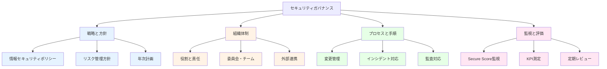
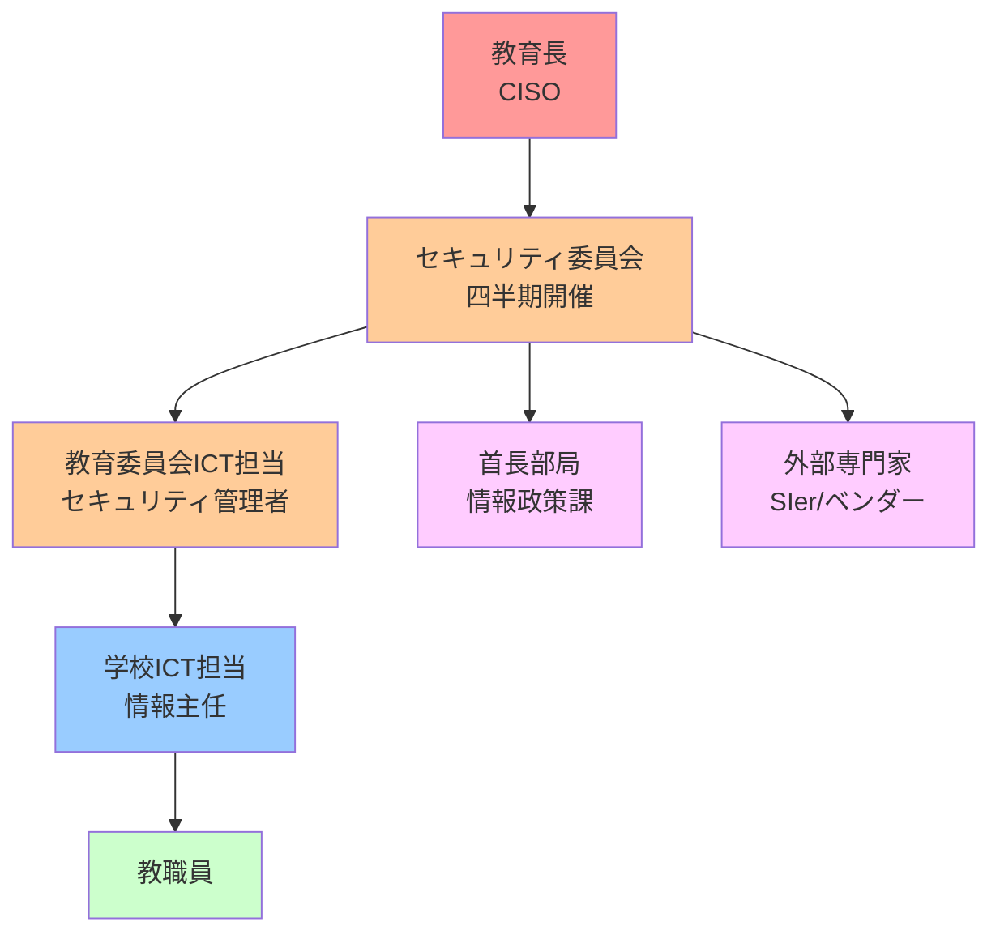
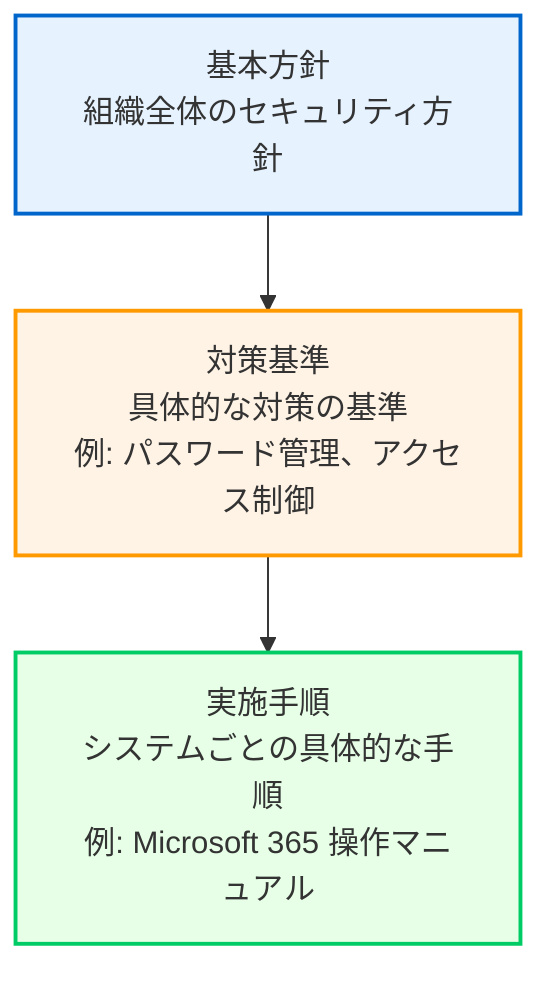
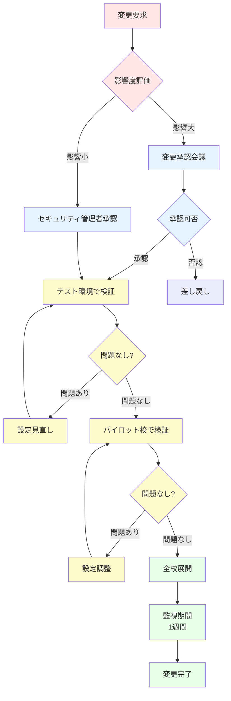

# 教育委員会におけるセキュリティガバナンスと組織体制

本章では、ゼロトラストセキュリティを組織全体で維持・改善するための**ガバナンス体制**と**組織体制**を解説します。技術的な設定だけでなく、人とプロセスによるガバナンスが、セキュリティの継続的な成功に不可欠です。教育委員会の実情に即した役割分担、変更管理プロセス、教職員研修、コンプライアンス対応の具体的な方法を学びます。

# 17.1 教育委員会のセキュリティガバナンス体制

セキュリティガバナンスとは、組織のセキュリティ目標を設定し、そのリスクを管理し、リソースを適切に配分するための体系的なアプローチです。教育委員会では、限られた人員と予算の中で効果的なガバナンスを実現する必要があります。

## 17.1.1 セキュリティガバナンスの全体像

セキュリティガバナンスは、以下の要素で構成されます。



### 教育委員会におけるガバナンスの特徴

**一般企業との違い**:

| 要素 | 一般企業 | 教育委員会 |
|------|----------|-----------|
| **意思決定** | 経営層が迅速に判断 | 教育長・首長・議会の承認が必要（時間がかかる） |
| **予算** | 柔軟な予算配分 | 年度予算制、補正予算も困難 |
| **人員** | 専任のセキュリティチーム | ICT担当が兼務（1-2名程度） |
| **リスク** | 金銭的損失 | 児童生徒の個人情報漏洩、教育活動への影響 |
| **対象範囲** | 自組織のみ | 教育委員会 + 域内全学校 |

**教育委員会ならではの課題**:

- 専任のセキュリティ担当者がいない（兼務が前提）
- 学校現場のICTリテラシーにばらつきがある
- 年度予算の制約で柔軟な対応が困難
- 教職員の異動により継続性の確保が難しい

## 17.1.2 教育委員会内のセキュリティ組織体制

教育委員会では、以下のような組織体制を推奨します。

### 基本的な組織構造



### 各層の役割

**1. 教育長（CISO: 最高情報セキュリティ責任者）**

**役割**:
- 組織全体のセキュリティ戦略の最終決定
- 重大インシデント発生時の対外発表
- 予算・人員配置の承認

**業務頻度**: 四半期に1回（セキュリティ委員会への出席）

---

**2. セキュリティ委員会**

**構成メンバー**:
- 教育長
- 教育部長
- 教育委員会ICT担当（事務局）
- 首長部局情報政策課
- 外部専門家（必要に応じて招聘）

**役割**:
- 情報セキュリティポリシーの策定・改定
- 年次計画の承認
- 重大インシデントの報告・対応方針決定
- Secure Score目標の設定と進捗確認

**開催頻度**: 四半期に1回（年4回）

---

**3. 教育委員会ICT担当（セキュリティ管理者）**

**役割**:
- 日常的なセキュリティ運用
- ポリシー設定・変更管理
- インシデント対応
- 学校への技術支援
- Secure Score向上施策の実施
- 教職員研修の企画・実施

**業務頻度**: 毎日

**推奨人数**: 2名以上（兼務可、ただし1名は専任が望ましい）

---

**4. 学校ICT担当（情報主任）**

**役割**:
- 校内のセキュリティ啓発
- 教職員からの問い合わせ対応
- インシデント発生時の初動対応
- 教育委員会への報告

**業務頻度**: 週1回程度（校務分掌の一部）

---

**5. 教職員**

**役割**:
- セキュリティポリシーの遵守
- 不審なメール・アクセスの報告
- セキュリティ研修の受講

**業務頻度**: 日常業務の一環

## 17.1.3 学校・教育委員会・首長部局の役割分担

教育委員会の情報システムは、首長部局（市役所・役場）のネットワークと接続している場合が多く、役割分担の明確化が重要です。

### RACI マトリクス

RACI とは、業務の役割を明確化するフレームワークです。

- **R (Responsible)**: 実行責任者（実際に作業を行う）
- **A (Accountable)**: 説明責任者（最終責任を負う、承認する）
- **C (Consulted)**: 相談先（意見を求められる）
- **I (Informed)**: 報告先（結果を知らされる）

### セキュリティ業務の RACI マトリクス（教育委員会）

| 業務 | 教育長 | 教育委員会ICT | 首長部局 | 学校 | 外部SIer |
|------|--------|--------------|---------|------|---------|
| **情報セキュリティポリシー策定** | A | R | C | I | C |
| **Conditional Access ポリシー設定** | I | A, R | C | I | C |
| **DLP ポリシー設定** | I | A, R | I | I | C |
| **MFA 設定** | I | A, R | I | I | C |
| **Intune デバイス管理** | I | A, R | C | I | R |
| **インシデント対応（レベル1）** | I | A, R | I | R | C |
| **インシデント対応（レベル3: 重大）** | A | R | C | I | R |
| **教職員研修** | I | A, R | I | C | I |
| **Secure Score 改善** | A | R | C | I | C |
| **監査対応** | A | R | C | I | C |
| **ネットワーク管理** | I | C | A, R | I | R |
| **校務支援システム管理** | I | A | C | R | R |

**具体例**:

**シナリオ: 新しい Conditional Access ポリシーを適用する**

1. **教育委員会ICT担当**（R）がポリシーを設計・設定
2. **首長部局**（C）にネットワーク影響を事前確認
3. **外部SIer**（C）に技術的な助言を求める
4. **教育委員会ICT担当**（A）がポリシーを承認・適用
5. **学校**（I）に適用結果を通知
6. **教育長**（I）に月次レポートで報告

## 17.1.4 情報セキュリティポリシーの策定・改定

### 情報セキュリティポリシーの階層構造

教育委員会の情報セキュリティポリシーは、以下の階層で構成されます。



### 教育情報セキュリティポリシーガイドライン準拠

文部科学省「**教育情報セキュリティポリシーに関するガイドライン**」（令和7年3月改訂）への準拠は必須です。

**ガイドラインの主な要求事項**:

| 項目 | 要求内容 | Microsoft 365 A5 での対応 |
|------|----------|-------------------------|
| **強固なアクセス制御** | 機密性2以上へのアクセス時に多要素認証+デバイス認証+通信制御を実施 | Entra ID MFA（第5章）+ Conditional Access（第6章）+ Intune（第8章） |
| **多要素認証（MFA）** | 知識認証・生体認証・所持認証の2つ以上を組み合わせ | Entra ID MFA、Windows Hello for Business（第5章） |
| **デバイス認証** | デバイスの正当性確認とコンプライアンス準拠 | Intune デバイス登録・コンプライアンスポリシー（第8章） |
| **ログ管理** | 操作ログの記録・保存・定期監査 | 統合監査ログ（本章 17.5節） |
| **情報分類** | 機密性0〜3の4段階分類による適切な管理 | 機密ラベル（第10章） |
| **データ保護** | 機密性2以上の情報の暗号化 | Information Protection、BitLocker（第10章） |
| **情報漏洩対策** | 外部共有・持ち出しの制御 | DLP（第11章） |
| **インシデント対応** | インシデント対応体制・手順の整備と訓練 | 第18章で解説 |

### ポリシー改定のプロセス

**年次レビューサイクル**:

```
毎年4月: 現行ポリシーの評価
    ↓
5月: 改定案の作成
    ↓
6月: パブリックコメント（教職員・学校からの意見聴取）
    ↓
7月: セキュリティ委員会での審議
    ↓
8月: 教育長決裁
    ↓
9月: 新ポリシー施行
```

**臨時改定が必要な場合**:

- 重大なインシデント発生時
- 法令・ガイドラインの改正時
- 新システム導入時

## 17.1.5 定期レビューサイクル（年次・四半期）

セキュリティガバナンスは、PDCA サイクルで継続的に改善します。

### 年次レビュー（毎年4月）

**レビュー内容**:

1. **前年度の振り返り**
   - インシデント発生状況（件数、種類、対応状況）
   - Secure Score の推移
   - セキュリティ予算の執行状況

2. **目標達成度評価**
   - 年間目標の達成率
   - KPI の達成状況

3. **次年度計画の策定**
   - Secure Score 目標値の設定
   - 重点施策の決定
   - 予算要求

### 四半期レビュー（3・6・9・12月）

**レビュー内容**:

1. **セキュリティ委員会への報告**
   - 当四半期のインシデント状況
   - Secure Score の変動
   - 改善アクションの進捗

2. **KPI 測定**

| KPI | 目標値 | 現在値 | 達成率 |
|-----|--------|--------|--------|
| Secure Score | 70% | 68% | 97% |
| MFA 有効率 | 100% | 98% | 98% |
| Intune 登録率 | 100% | 100% | 100% |
| コンプライアンス準拠率 | 100% | 97% | 97% |
| インシデント件数 | 3件/月以下 | 2件/月 | 達成 |

3. **課題の特定と対策**

---

# 17.2 役割と責任の明確化

セキュリティガバナンスを機能させるには、各役割の責任を明確にする必要があります。

## 17.2.1 最高情報セキュリティ責任者（CISO）

教育委員会では、**教育長または教育部長**が CISO を兼務します。

### CISO の主な責務

**1. セキュリティ戦略の策定**

組織全体のセキュリティ方針を決定し、リスクマネジメントの最終責任を負います。

**2. セキュリティ委員会の主宰**

四半期ごとにセキュリティ委員会を開催し、重要事項を決定します。

**3. 重大インシデント時の対外発表**

個人情報漏洩等の重大インシデント発生時、保護者・メディアへの対応を主導します。

**4. 予算・人員の確保**

セキュリティ対策に必要な予算と人員を確保します。

### CISO に求められるスキル

- セキュリティ全般の知識（技術的な詳細は不要）
- リスクマネジメントの理解
- 意思決定能力
- ステークホルダー調整能力

:::message
**CISO は技術専門家である必要はありません**。技術的な詳細は教育委員会ICT担当に任せ、CISO は組織全体のリスク管理と意思決定に専念します。
:::

## 17.2.2 セキュリティ管理者（教育委員会ICT担当）

教育委員会のICT担当が、セキュリティ管理者として日常的な運用を担います。

### セキュリティ管理者の主な業務

**1. ポリシー設定と変更管理**

- Conditional Access ポリシー設定
- DLP ポリシー設定
- 機密ラベル作成
- Intune デバイス管理

**2. 日常的な監視**

- Microsoft Defender ポータルの確認（毎朝5-10分）
- アラートのトリアージ
- Secure Score の監視

**3. インシデント対応**

- アラート調査
- 侵害デバイス・アカウントの隔離
- 根本原因分析
- 再発防止策の実施

**4. 教職員支援**

- 学校からの問い合わせ対応
- 技術的なトラブルシューティング
- セキュリティ研修の企画・実施

**5. 報告業務**

- 月次レポート作成
- セキュリティ委員会への報告資料作成
- 監査対応

### セキュリティ管理者に求められるスキル

- Microsoft 365 管理の基本知識
- セキュリティ基礎知識
- トラブルシューティング能力
- コミュニケーション能力（非技術者への説明）

### 推奨トレーニング

| コース | 内容 | 期間 |
|--------|------|------|
| **Microsoft 認定: Security Administrator Associate** | Entra ID、Defender 全般 | 5日間 |
| **Microsoft 365 Certified: Administrator Expert** | Microsoft 365 管理全般 | 5日間 |
| **教育情報セキュリティ対策推進事業研修** | 教育機関向けセキュリティ | 2日間 |

## 17.2.3 学校の情報セキュリティ責任者（校長）

各学校の校長が、学校内のセキュリティ責任者となります。

### 校長の主な責務

**1. 校内セキュリティポリシーの周知**

年度初めの職員会議で、セキュリティポリシーを全教職員に周知します。

**2. インシデント発生時の判断**

インシデント発生時、教育委員会への報告要否を判断します。

**3. 教職員の指導**

セキュリティポリシー違反があった場合、該当教職員を指導します。

## 17.2.4 学校の情報セキュリティ担当者（情報主任）

各学校の情報主任が、校内のセキュリティ担当者となります。

### 情報主任の主な業務

**1. 校内啓発**

- 職員会議でのセキュリティ情報共有
- フィッシングメール注意喚起
- セキュリティニュースの共有

**2. 初動対応**

- 不審なメール受信時の確認
- デバイス紛失時の初動対応
- 教育委員会への報告

**3. 問い合わせ窓口**

- 教職員からの質問対応
- 教育委員会へのエスカレーション

## 17.2.5 教職員の責任

すべての教職員は、以下の責任を負います。

### 日常的なセキュリティ対策

**1. アカウント管理**

- パスワードの適切な管理
- MFA の設定・利用
- アカウント共有の禁止

**2. デバイス管理**

- 校務用PCの適切な管理
- 私物デバイスの業務利用禁止
- 紛失時の即時報告

**3. 情報の取り扱い**

- 機密性ラベルの付与
- 外部共有時の確認
- 個人情報の持ち出し禁止

**4. インシデント報告**

- 不審なメールの報告
- デバイス紛失の即時報告
- セキュリティポリシー違反の報告

---

# 17.3 変更管理とテスト

セキュリティ設定の変更は、業務に影響を与える可能性があるため、慎重な変更管理が必要です。

## 17.3.1 変更管理プロセス

### 変更管理の基本フロー



### 影響度評価

変更の影響度を以下の基準で評価します。

| 影響度 | 定義 | 承認者 | 例 |
|--------|------|--------|-----|
| **高** | 全教職員に影響 | セキュリティ委員会 | Conditional Access ポリシー新規適用 |
| **中** | 一部教職員に影響 | セキュリティ管理者 | DLP ポリシー調整 |
| **低** | ほぼ影響なし | セキュリティ管理者 | 機密ラベル追加 |

## 17.3.2 テスト環境の活用

### テスト環境の構築

Microsoft 365 A5 では、本番環境とは別の **テスト用テナント** を用意することを推奨します。

**テスト用テナントの利用例**:

- 新しい Conditional Access ポリシーの動作確認
- DLP ポリシーのテスト
- 新機能の事前検証

:::message
**テスト用テナントの注意点**:
テスト用テナントは本番環境と完全に分離されているため、データ移行や設定の完全な再現は困難です。あくまで「動作確認」用として活用します。
:::

### パイロット校での検証

テスト環境で問題がなければ、**パイロット校**（1-2校）で実運用を試します。

**パイロット校の選定基準**:

- ICTリテラシーが比較的高い学校
- 教育委員会との連絡が密な学校
- 問題発生時に柔軟に対応できる学校

**検証期間**: 1-2週間

**検証項目**:

- 教職員の業務に支障がないか
- 想定外のエラーが発生しないか
- パフォーマンスに問題がないか

## 17.3.3 段階的展開（1校→数校→全校）

パイロット校で問題がなければ、以下の順序で全校に展開します。

### 展開フェーズ

**フェーズ1: パイロット校（1-2校）**
- 期間: 1-2週間
- 目的: 実運用での動作確認

**フェーズ2: 数校（5-10校）**
- 期間: 1-2週間
- 目的: スケールアウト時の問題確認

**フェーズ3: 全校**
- 期間: 1週間
- 目的: 全面展開

## 17.3.4 ロールバック計画

変更後に問題が発生した場合、迅速に元の状態に戻すための計画を事前に用意します。

### ロールバック手順（例: Conditional Access ポリシー）

**1. 問題発生の検知**

教職員からの問い合わせ急増、アラート増加

**2. 緊急判断**

セキュリティ管理者が、ロールバック要否を判断

**3. ポリシー無効化**

Conditional Access ポリシーを「オフ」に設定

**4. 状況確認**

問題が解消されたことを確認

**5. 原因分析**

なぜ問題が発生したかを分析

**6. 再設定**

問題を修正した上で、再度段階的に展開

## 17.3.5 変更の文書化

すべての変更は、記録として残します。

### 変更記録のテンプレート

```
【変更記録】

変更日: 2024年10月15日
変更者: 教育委員会ICT担当 山田太郎
変更内容: Conditional Access ポリシー「非管理デバイスからのアクセスブロック」を新規作成

変更理由:
非管理デバイス（私物PC・スマホ）からの校務データアクセスを防止するため

影響範囲:
全教職員（200名）

テスト結果:
- テスト環境での検証: 問題なし
- パイロット校（A小学校）: 問題なし
- 全校展開: 問題なし

監視結果:
展開後1週間、問い合わせ0件、アラート増加なし

備考:
教職員には事前に周知メールを送信
```

---

# 17.4 教職員向けセキュリティ研修

セキュリティガバナンスの成功は、教職員一人ひとりのセキュリティ意識にかかっています。定期的な研修を通じて、全員がセキュリティの重要性を理解します。

## 17.4.1 年次セキュリティ研修の実施

### 研修計画

**対象**: 全教職員（必須参加）

**時期**: 毎年4月（新年度開始時）

**時間**: 60分

**形式**: オンライン研修（Microsoft Teams ライブイベント）

**内容**:

| 時間 | テーマ | 内容 |
|------|--------|------|
| 0-10分 | イントロダクション | 昨年度のインシデント事例、セキュリティの重要性 |
| 10-25分 | フィッシング対策 | フィッシングメールの見分け方、報告方法 |
| 25-40分 | 個人情報保護 | 機密性ラベルの使い方、外部共有時の注意 |
| 40-50分 | インシデント対応 | デバイス紛失時の対応、アカウント侵害時の対応 |
| 50-60分 | 質疑応答 | 教職員からの質問に回答 |

### 研修資料の例

**スライド例**:

```
【スライド1】
タイトル: 2024年度 情報セキュリティ研修

【スライド2】
昨年度のインシデント状況
- フィッシングメール検知: 150件
- デバイス紛失: 3件
- アカウント侵害: 1件（パスワード使い回しが原因）

【スライド3】
フィッシングメールの見分け方
✅ 差出人のメールアドレスを確認
✅ リンクのURLを確認（マウスオーバーで表示）
✅ 不自然な日本語がないか
✅ 「緊急」「重要」などの文言に注意

【スライド4】
フィッシングメールを受信したら
1. リンクをクリックしない
2. 添付ファイルを開かない
3. 「フィッシングとして報告」ボタンをクリック
4. 情報主任に報告
```

## 17.4.2 新任教職員向けオリエンテーション

### オリエンテーション計画

**対象**: 新任教職員（着任時必須）

**時期**: 着任後1週間以内

**時間**: 30分

**形式**: 対面研修（教育委員会で実施）

**内容**:

- アカウント発行・MFA設定
- パスワード管理の基本
- 校務用PCの受け取りと初期設定
- セキュリティポリシーの説明
- 質疑応答

## 17.4.3 管理職向け研修

### 研修計画

**対象**: 校長・教頭

**時期**: 年1回（6月）

**時間**: 90分

**内容**:

| 時間 | テーマ | 内容 |
|------|--------|------|
| 0-15分 | セキュリティガバナンス | 管理職の責任、インシデント対応フロー |
| 15-45分 | 個人情報保護法 | 法的責任、保護者対応 |
| 45-75分 | インシデント事例研究 | 他自治体の事例、対応のポイント |
| 75-90分 | 質疑応答 | |

## 17.4.4 情報主任向け研修

### 研修計画

**対象**: 各学校の情報主任

**時期**: 年2回（5月、11月）

**時間**: 120分

**内容**:

- Microsoft Defender ポータルの使い方
- インシデント対応の実習
- 最新のセキュリティトレンド
- 情報交換会

## 17.4.5 フィッシングシミュレーション訓練

第14章で解説した **Attack Simulation Training** を活用し、定期的にフィッシング訓練を実施します。

### 訓練計画

**頻度**: 年4回（四半期ごと）

**対象**: 全教職員

**実施手順**:

1. **訓練メール送信**（教育委員会ICT担当）
2. **クリック率測定**（1週間）
3. **結果分析**
4. **フィードバック**（クリックした教職員に教材を自動送信）
5. **全体報告**（セキュリティ委員会）

**目標**:

- クリック率: 10%以下
- 報告率: 50%以上

## 17.4.6 eラーニング教材の活用

Microsoft が提供する無料のeラーニング教材を活用します。

### 推奨教材

| 教材 | 内容 | URL |
|------|------|-----|
| **Microsoft Learn** | Microsoft 365 セキュリティ全般 | https://learn.microsoft.com/ |
| **Security Awareness Training** | セキュリティ意識向上 | Microsoft Defender for Office 365 機能 |
| **Attack Simulation Training** | フィッシング訓練 | Microsoft Defender for Office 365 機能 |

---

# 17.5 コンプライアンスと監査

教育委員会は、個人情報保護法、教育情報セキュリティポリシーガイドライン、自治体の情報セキュリティ監査など、様々なコンプライアンス要求に対応する必要があります。

## 17.5.1 個人情報保護法への対応

### 個人情報保護法の主な要求事項

| 要求事項 | 内容 | Microsoft 365 A5 での対応 |
|---------|------|-------------------------|
| **安全管理措置** | 個人データの漏洩防止 | DLP、機密ラベル、暗号化 |
| **アクセス制御** | 不正アクセスの防止 | Conditional Access、MFA |
| **従業者の監督** | 従業員教育 | セキュリティ研修、Attack Simulation |
| **委託先の監督** | SIerの管理 | Microsoft との契約、監査証跡 |
| **漏洩時の報告** | 本人・委員会への報告 | インシデント対応計画（第18章） |

### 安全管理措置のチェックリスト

**組織的安全管理措置**:

- ✅ 情報セキュリティポリシーの策定
- ✅ 個人データ取扱規程の整備
- ✅ 責任者の明確化（CISO）
- ✅ 定期的な監査の実施

**人的安全管理措置**:

- ✅ 全教職員への研修実施
- ✅ 秘密保持契約の締結
- ✅ 退職時のアカウント削除

**物理的安全管理措置**:

- ✅ 校務用PCの管理台帳整備
- ✅ 施錠管理
- ✅ 紛失時の対応手順

**技術的安全管理措置**:

- ✅ アクセス制御（Conditional Access）
- ✅ アクセス者の識別と認証（MFA）
- ✅ 外部からの不正アクセス防止（Defender for Endpoint）
- ✅ 情報システムの使用に伴う漏洩防止（DLP）

## 17.5.2 教育情報セキュリティポリシーガイドライン遵守

文部科学省のガイドライン遵守状況を定期的に確認します。

### 自己点検チェックリスト（抜粋）

| 項目 | 対応状況 | 備考 |
|------|----------|------|
| 多要素認証の実施 | ✅ 実施済み | 全教職員にMFA適用 |
| アクセスログの記録 | ✅ 実施済み | 統合監査ログ（1年保存） |
| 端末の一元管理 | ✅ 実施済み | Intune で200台管理 |
| データ暗号化 | ✅ 実施済み | BitLocker 強制適用 |
| ネットワーク分離 | ✅ 実施済み | 校務系・学習系分離 |
| インシデント対応計画 | ✅ 策定済み | 年1回訓練実施 |

## 17.5.3 自治体の情報セキュリティ監査対応

多くの自治体では、年1回の情報セキュリティ監査が実施されます。

### 監査準備

**監査で求められる資料**:

1. **情報セキュリティポリシー**
2. **個人情報管理台帳**
3. **システム構成図**
4. **アクセスログ**（監査ログ）
5. **インシデント対応記録**
6. **研修実施記録**
7. **変更管理記録**

### 監査対応のポイント

**1. 証跡の整備**

すべての操作が監査ログに記録されていることを示します。

**例: 管理者操作ログの提出**

Microsoft Defender ポータル → **監査** → **検索**

```
フィルター:
- アクティビティ: Set-MsolUserPassword（パスワードリセット）
- 日付範囲: 2024年4月1日〜2025年3月31日
- ユーザー: 管理者アカウント
```

**2. ポリシー遵守の証明**

設定したポリシーが実際に機能していることを示します。

**例: DLP 違反ログの提出**

Microsoft Purview コンプライアンスポータル → **DLP** → **ポリシー** → **レポート**

**3. インシデント対応記録の提示**

過去のインシデント対応が適切に行われたことを示します。

## 17.5.4 Microsoft Purview Compliance Manager の活用

Microsoft Purview Compliance Manager は、コンプライアンス状況を自動評価し、改善アクションを提示するツールです。

### Compliance Manager の概要

**アクセス方法**:

https://compliance.microsoft.com → **Compliance Manager**

**評価対象**:

- 個人情報保護法
- GDPR
- ISO 27001
- NIST CSF

### 教育委員会での活用方法

**1. 評価の作成**

**Assessments** → **Add assessment** → **Japan - Act on the Protection of Personal Information**

**2. スコアの確認**

現在のコンプライアンススコアを確認します。

```
コンプライアンススコア: 75/100

達成済み: 60ポイント
未達成: 40ポイント
```

**3. 改善アクションの実施**

**Improvement actions** タブで、推奨アクションを確認します。

**例**:

- 多要素認証の有効化（+10ポイント）
- DLP ポリシーの適用（+15ポイント）
- 監査ログの長期保存（+8ポイント）

**4. 証跡のアップロード**

実施した対策の証跡（スクリーンショット、ポリシー文書等）をアップロードします。

## 17.5.5 監査ログの長期保存（証跡管理）

監査対応や法的証跡のため、監査ログを長期保存します。

### 監査ログの保存期間

**デフォルト保存期間**:

| ライセンス | 保存期間 |
|-----------|---------|
| Microsoft 365 E3/A3 | 180日 |
| Microsoft 365 E5/A5 | 1年 |
| E5 + 10年保存アドオン | 10年 |

### 監査ログ保持ポリシーの作成

**1. Microsoft Purview コンプライアンスポータルにアクセス**

https://compliance.microsoft.com

**2. 監査ログ保持ポリシーを作成**

**Audit** → **Retention policies** → **Create audit log retention policy**

**設定例**:

- **ポリシー名**: 教育委員会監査ログ保持ポリシー
- **保持期間**: 1年
- **対象**:
  - Entra ID（サインインログ）
  - Exchange Online（メール操作）
  - SharePoint Online（ファイル操作）
  - Microsoft 365 全般（管理者操作）

**3. 保存**

:::message alert
**重要**: 監査ログ保持ポリシーは、E5 ライセンスが必要です。E3 ライセンスでは180日間のデフォルト保存のみとなります。
:::

### 監査ログのエクスポート

監査ログは CSV 形式でエクスポートできます。

**エクスポート手順**:

1. Microsoft Purview コンプライアンスポータル → **Audit**
2. 検索条件を設定（日付範囲、アクティビティ等）
3. **Search** をクリック
4. **Export** → **Download all results**

エクスポートしたログは、外部ストレージ（Azure Storage 等）に長期保存します。

---

# 本章のまとめ

本章では、教育委員会におけるセキュリティガバナンスと組織体制について解説しました。

**重要ポイント**:

1. **組織体制**: 教育長（CISO）、セキュリティ委員会、教育委員会ICT担当、学校情報主任、教職員の役割を明確化
2. **RACI マトリクス**: 誰が何をするかを明確にし、責任の所在を明らかにする
3. **変更管理**: テスト → パイロット校 → 全校展開の段階的アプローチで安全に変更
4. **教職員研修**: 年次研修、フィッシング訓練、eラーニングでセキュリティ意識を向上
5. **コンプライアンス**: 個人情報保護法、教育情報セキュリティポリシーガイドライン、自治体監査への対応

