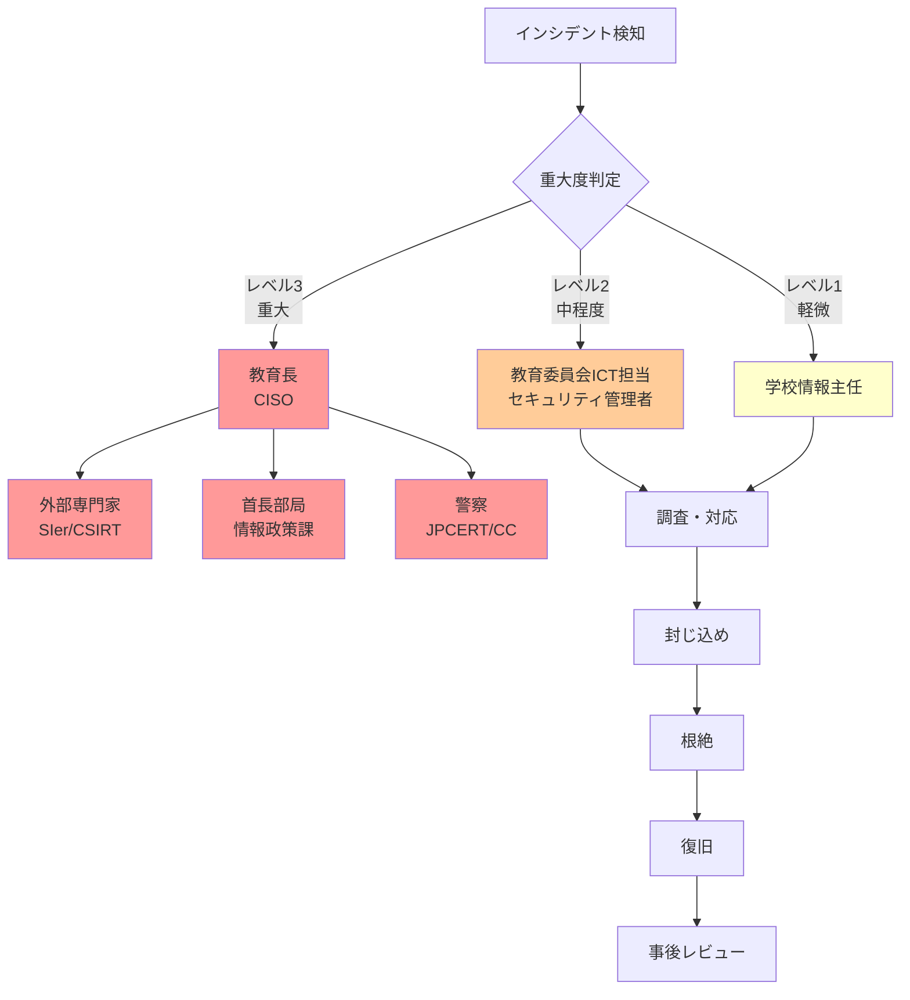

# 監視・ログ管理とインシデント対応

本章では、教育委員会における効果的なセキュリティ監視体制とインシデント対応プロセスを解説します。日常的な監視、ログ管理、インシデント発生時の対応手順を学び、セキュリティインシデントに迅速かつ適切に対応できる体制を構築します。

# 18.1 ログ管理戦略

セキュリティ監視とインシデント調査の基盤となるログ管理について解説します。

## 18.1.1 監査ログの種類

Microsoft 365 A5 では、複数のサービスからログが収集されます。

### 主な監査ログの種類

| ログの種類 | 記録内容 | 用途 | 保存場所 |
|-----------|---------|------|---------|
| **Entra ID サインインログ** | ユーザーのサインイン試行、MFA、条件付きアクセス | 不正アクセス検知、Identity Protection | Entra ID ポータル |
| **Entra ID 監査ログ** | ユーザー作成・削除、ロール変更、ポリシー変更 | 管理者操作の追跡 | Entra ID ポータル |
| **統合監査ログ** | Microsoft 365 全体の操作（メール、ファイル、Teams等） | 包括的な操作追跡 | Purview コンプライアンスポータル |
| **Defender for Endpoint ログ** | デバイスのセキュリティイベント、マルウェア検知 | エンドポイント脅威検知 | Defender ポータル |
| **Defender for Office 365 ログ** | フィッシングメール、悪意のある添付ファイル | メール脅威検知 | Defender ポータル |
| **DLP ログ** | DLP ポリシー違反 | 情報漏洩検知 | Purview コンプライアンスポータル |

### 統合監査ログで記録される主なアクティビティ

**Exchange Online（メール操作）**:
- メールの送受信
- メールボックスのアクセス
- メールの削除・復元
- フォルダーの作成・削除

**SharePoint Online / OneDrive（ファイル操作）**:
- ファイルのアップロード・ダウンロード
- ファイルの共有
- アクセス許可の変更
- ファイルの削除・復元

**Microsoft Teams**:
- チームの作成・削除
- メンバーの追加・削除
- 会議の開催
- ファイル共有

**Microsoft 365 管理センター**:
- ユーザーの作成・削除
- ライセンスの割り当て
- ポリシーの変更

## 18.1.2 ログ保持期間の設定

ログ保持期間は、ライセンスと設定により異なります。

### デフォルト保持期間

| サービス | ライセンス | デフォルト保持期間 |
|---------|-----------|------------------|
| **Entra ID サインインログ** | E3/A3 | 7日 |
| **Entra ID サインインログ** | E5/A5 | 30日 |
| **統合監査ログ** | E3/A3 | 180日 |
| **統合監査ログ** | E5/A5 | 1年（特定操作） |
| **Defender アラート** | すべて | 180日 |

### 教育委員会に推奨する保持期間

個人情報保護条例や自治体の情報セキュリティポリシーに基づき、以下を推奨します。

**最低保存期間**: 1年
**推奨保存期間**: 3年（重要ログ）

**重要ログの定義**:
- 管理者操作ログ
- 個人情報へのアクセスログ
- セキュリティポリシー変更ログ
- インシデント関連ログ

## 18.1.3 統合監査ログの有効化

### 有効化手順

**1. Microsoft Purview コンプライアンスポータルにアクセス**

https://compliance.microsoft.com

**2. 監査の有効化**

**Audit** → **Start recording user and admin activity**

:::message
デフォルトで有効になっている場合が多いですが、念のため確認します。
:::

**3. 監査ログ検索のテスト**

**Audit** → **Search** → 検索条件を設定して **Search**

**検索例: 過去7日間の全管理者操作**

```
- 日付範囲: 過去7日間
- アクティビティ: すべて
- ユーザー: （管理者アカウント名）
```

## 18.1.4 ログのエクスポートとアーカイブ

長期保存や外部分析のため、ログをエクスポートします。

### CSV エクスポート手順

**1. 統合監査ログを検索**

Purview コンプライアンスポータル → **Audit** → **Search**

**2. エクスポート**

検索結果表示後、**Export** → **Download all results**

**3. ファイル保存**

CSV ファイルがダウンロードされます。

### エクスポートの自動化（PowerShell）

定期的なエクスポートは、PowerShell スクリプトで自動化できます。

```powershell
# Microsoft 365 に接続
Connect-ExchangeOnline

# 監査ログのエクスポート（過去7日間）
$StartDate = (Get-Date).AddDays(-7)
$EndDate = Get-Date

Search-UnifiedAuditLog -StartDate $StartDate -EndDate $EndDate -ResultSize 5000 | Export-Csv -Path "C:\Logs\AuditLog_$(Get-Date -Format 'yyyyMMdd').csv" -NoTypeInformation
```

## 18.1.5 長期保存の実装（Azure Storage等）

エクスポートしたログを Azure Storage に長期保存します。

### Azure Storage への保存

**1. Azure Storage アカウント作成**

Azure ポータル → **ストレージアカウント** → **作成**

**2. コンテナー作成**

**コンテナー** → **+ コンテナー** → 名前: `auditlogs`

**3. PowerShell でアップロード**

```powershell
# Azure に接続
Connect-AzAccount

# ストレージコンテキスト取得
$StorageAccount = Get-AzStorageAccount -ResourceGroupName "RG-Education" -Name "eduauditlogs"
$Context = $StorageAccount.Context

# ファイルアップロード
Set-AzStorageBlobContent -File "C:\Logs\AuditLog_20250101.csv" -Container "auditlogs" -Blob "2025/01/AuditLog_20250101.csv" -Context $Context
```

---

# 18.2 セキュリティ監視の実装

日常的な監視体制を構築します。

## 18.2.1 監視対象の定義（重要アラートの特定）

すべてのアラートを監視するのは現実的ではないため、重要なアラートに絞り込みます。

### 教育委員会で優先監視すべきアラート

| 優先度 | アラート種類 | 内容 | 対応時間 |
|--------|------------|------|---------|
| **最高** | アカウント侵害 | 異常なサインイン、認証情報漏洩 | 即座（1時間以内） |
| **最高** | ランサムウェア検知 | マルウェア感染、暗号化活動 | 即座（1時間以内） |
| **高** | 個人情報漏洩 | DLP 違反、大量ダウンロード | 当日中 |
| **高** | 権限昇格 | 管理者権限の不正取得 | 当日中 |
| **中** | フィッシングメール | 不審なメール受信 | 週次レビュー |
| **低** | ポリシー違反 | 非承認アプリ利用 | 月次レビュー |

## 18.2.2 アラート通知の設定（セキュリティ担当者への通知）

重要なアラートをメールで通知します。

### インシデント通知ルールの作成

**1. Microsoft Defender ポータルにアクセス**

https://security.microsoft.com

**2. 通知ルール作成**

**Settings** → **Microsoft Defender XDR** → **Email notifications** → **Incidents** タブ

**Add incident notification rule**

**3. ルール設定**

**ルール名**: 重要インシデント通知（教育委員会ICT担当）

**Notification settings**:
- **Alert severity**: High, Medium
- **Device group scope**: All devices
- **Send only one notification per incident**: チェック

**Recipients**:
- セキュリティ担当者のメールアドレスを追加

**4. 保存**

**Create rule**

### アラート通知の例

```
件名: [Microsoft Defender] 重大度: 高 - 新規インシデント #12345

インシデント名: ユーザーアカウントが侵害された可能性

重大度: 高
影響を受けたユーザー: tanaka@city-edu.jp
影響を受けたデバイス: DESKTOP-ABC123

詳細を確認:
https://security.microsoft.com/incidents/12345
```

## 18.2.3 ダッシュボードの構築

Microsoft Defender ポータルのダッシュボードをカスタマイズします。

### ホームページのカスタマイズ

**1. ホームページにアクセス**

https://security.microsoft.com → **Home**

**2. カードの追加**

**+ Add cards** → 必要なカードを選択

**推奨カード**:
- アクティブなインシデント
- Secure Score
- リスクのあるユーザー
- デバイスの健全性
- 最新のアラート

## 18.2.4 定期レポート（週次・月次）

定期レポートを作成し、セキュリティ状況を可視化します。

### 週次レポート（セキュリティ担当者向け）

**レポート内容**:

1. **今週のインシデント**（件数、重大度、対応状況）
2. **新規アラート**（種類別）
3. **Secure Score 変動**
4. **来週の予定**（定期メンテナンス、研修等）

**作成方法**:

Microsoft Defender ポータル → **Reports** → **General** → **Security report**

### 月次レポート（管理職向け）

第16章 16.2.4節を参照。

---

# 18.3 教育委員会向けインシデント対応計画

インシデント発生時の対応手順を定義します。

## 18.3.1 インシデント対応体制（緊急連絡網）

### インシデント対応チーム



### 緊急連絡先リスト

| 役割 | 氏名 | 連絡先（平日） | 連絡先（夜間・休日） |
|------|------|--------------|-------------------|
| **CISO** | 教育長 山田太郎 | 内線: 1234 | 携帯: 090-XXXX-XXXX |
| **セキュリティ管理者** | ICT担当 佐藤花子 | 内線: 5678 | 携帯: 090-YYYY-YYYY |
| **外部SIer** | ○○システム社 | 03-XXXX-XXXX | 緊急: 0120-XXX-XXX |
| **警察** | サイバー犯罪相談窓口 | #9110 | 110 |
| **JPCERT/CC** | - | info@jpcert.or.jp | - |

## 18.3.2 インシデント分類（レベル1〜3の定義）

インシデントをレベル分類し、対応優先度を明確化します。

### インシデントレベル定義

**レベル3: 重大（クリティカル）**

**定義**: 組織全体に影響、個人情報漏洩、業務停止の可能性

**例**:
- 児童生徒の個人情報が外部流出
- ランサムウェア感染により校務システム停止
- 管理者アカウント侵害

**対応**:
- **即座に対応**（1時間以内）
- 教育長（CISO）への報告
- 外部専門家招聘
- 警察・JPCERT/CC への報告検討

---

**レベル2: 中程度（ハイ）**

**定義**: 一部業務に影響、情報漏洩の可能性あり

**例**:
- 教職員アカウント侵害
- マルウェア感染（1台のみ）
- DLP ポリシー違反（機密性2以上のファイル外部共有）

**対応**:
- **当日中に対応**
- セキュリティ管理者が調査・対応
- 必要に応じて教育長へ報告

---

**レベル1: 軽微（ロー）**

**定義**: 業務への影響なし、予防的対応で済む

**例**:
- フィッシングメール受信（クリック前に報告）
- 非承認アプリの利用検知
- パスワードポリシー違反

**対応**:
- **週次レビューで対応**
- 学校情報主任または教職員が初動対応
- 記録として残す

## 18.3.3 エスカレーションパス（教育長・首長への報告）

### 報告基準

**教育長への報告が必要なケース**:

- レベル3インシデント
- レベル2で個人情報が関係するもの
- メディア報道の可能性があるもの

**首長（市長・町長）への報告が必要なケース**:

- 個人情報漏洩が確定したケース
- システム停止が長期化するケース
- 損害賠償請求の可能性があるケース

### 報告フロー

```
インシデント検知
    ↓
セキュリティ管理者が調査
    ↓
レベル判定
    ↓
レベル2以上 → 教育長へ第一報（口頭、30分以内）
    ↓
詳細調査
    ↓
教育長へ詳細報告（文書、2時間以内）
    ↓
（必要に応じて）首長・議会へ報告
```

## 18.3.4 外部連絡先（警察・JPCERT/CC・ベンダー）

### 主な外部連絡先

**警察（サイバー犯罪）**:
- **相談窓口**: #9110
- **緊急**: 110
- **都道府県警察サイバー犯罪相談窓口**: https://www.npa.go.jp/cybersafety/

**JPCERT/CC（コンピュータ緊急対応センター）**:
- **Email**: info@jpcert.or.jp
- **Web**: https://www.jpcert.or.jp/
- **役割**: インシデント対応支援、情報提供

**IPA（情報処理推進機構）**:
- **情報セキュリティ安心相談窓口**: 03-5978-7509
- **Email**: anshin@ipa.go.jp

**Microsoft サポート**:
- **法人向けサポート**: Azure ポータル経由でチケット作成
- **緊急時**: 契約SIer経由で連絡

**契約SIer/ベンダー**:
- 自治体と契約している SIer の緊急連絡先を記載

## 18.3.5 保護者・メディアへの対応

個人情報漏洩等の重大インシデント発生時、保護者・メディアへの対応が必要です。

### 保護者への対応

**1. 事実確認の徹底**

憶測で情報提供せず、確定した事実のみを伝えます。

**2. 迅速な通知**

漏洩が確定した場合、**72時間以内**に影響を受ける保護者へ通知します（個人情報保護法）。

**3. 通知内容**

- 漏洩した個人情報の種類
- 漏洩の原因
- 二次被害防止策
- 問い合わせ窓口

**通知文例**:

```
保護者各位

【重要】個人情報漏洩に関するお詫びとお知らせ

このたび、○○市教育委員会において、児童生徒の個人情報が外部に漏洩する事案が発生いたしました。
保護者の皆様に多大なるご心配とご迷惑をおかけしますことを、深くお詫び申し上げます。

1. 漏洩した個人情報
   - 対象: ○○小学校 5年1組 児童35名
   - 内容: 氏名、生年月日、住所、保護者氏名

2. 漏洩の原因
   - 教職員のメール誤送信により、外部に送信されました。

3. 現在の状況
   - 送信先に削除を依頼し、削除を確認しました。
   - 外部への二次流出は確認されておりません。

4. 今後の対応
   - 再発防止策を講じます。
   - 不審な連絡等があった場合は、下記窓口までご連絡ください。

問い合わせ窓口: ○○市教育委員会 03-XXXX-XXXX（平日9:00-17:00）

令和7年○月○日
○○市教育委員会 教育長 山田太郎
```

### メディアへの対応

**1. 窓口の一本化**

教育長または広報担当者のみがメディア対応します。

**2. 情報の統制**

すべての教職員に、メディアからの問い合わせは広報担当へ転送するよう指示します。

**3. プレスリリース**

事実確認後、速やかにプレスリリースを発表します。

---

# 18.4 教育現場でよくあるインシデントへの対応

実際に発生しやすいインシデントへの具体的な対応手順を解説します。

## 18.4.1 【頻発】教職員アカウントの侵害対応

### インシデント概要

教職員のアカウントがフィッシングやパスワード漏洩により侵害されるケースです。

### 検知方法

- **Entra ID Protection**: リスクの高いサインイン検知
- **Defender for Cloud Apps**: 異常な活動（大量ファイルダウンロード等）

### 対応手順

**Step 1: アカウントの無効化（5分以内）**

Entra ID 管理センター → **ユーザー** → 該当ユーザー → **サインインのブロック**

**Step 2: 影響範囲の調査（30分以内）**

**調査項目**:
- 不審なサインイン履歴
- メール送信履歴（不正なメール送信がないか）
- ファイルアクセス履歴（機密ファイルへのアクセスがないか）

**調査方法**:

Purview コンプライアンスポータル → **Audit** → **Search**

```
- ユーザー: 侵害されたアカウント
- 日付範囲: 過去7日間
- アクティビティ: すべて
```

**Step 3: 侵害の封じ込め**

- パスワードリセット
- MFA 再登録
- すべてのセッションを強制終了

**Step 4: 二次被害の確認**

- メールの自動転送ルールが設定されていないか確認
- OneDrive/SharePoint の共有設定が変更されていないか確認

**Step 5: ユーザーへの通知**

侵害されたユーザーに事実を伝え、再発防止を指導します。

**Step 6: 事後レビュー**

- 侵害経路の特定（フィッシング、パスワード使い回し等）
- 再発防止策の実施（フィッシング訓練、パスワード変更指示）

## 18.4.2 【重大】ランサムウェア感染への対応

### インシデント概要

デバイスがランサムウェアに感染し、ファイルが暗号化されるケースです。

### 検知方法

- **Defender for Endpoint**: マルウェア検知、異常なファイル活動

### 対応手順

**Step 1: デバイスの即時隔離（即座）**

Microsoft Defender ポータル → **Devices** → 該当デバイス → **Isolate device**

**Step 2: 教育長への第一報（30分以内）**

レベル3インシデントとして報告。

**Step 3: 感染範囲の調査**

- 同じネットワーク内の他デバイスに感染が広がっていないか
- ファイルサーバー等の共有リソースが暗号化されていないか

**Step 4: バックアップからの復旧**

- 暗号化されたファイルをバックアップから復元
- OneDrive/SharePoint のバージョン履歴から復元

:::message alert
**身代金は支払わない**: 警察・JPCERT/CC も支払いを推奨していません。
:::

**Step 5: 根本原因の特定**

- フィッシングメール、脆弱性、USB メモリ等

**Step 6: 再発防止策**

- Windows Update の徹底
- Defender for Endpoint の設定見直し
- 教職員への注意喚起

## 18.4.3 【重大】児童生徒の個人情報漏洩への対応

### インシデント概要

児童生徒の個人情報が外部に漏洩するケースです。

### よくある漏洩経路

- メール誤送信
- 外部共有設定ミス
- USB メモリ紛失
- 不正アクセス

### 対応手順

**Step 1: 漏洩の事実確認（1時間以内）**

- 漏洩した情報の種類（氏名、住所、成績等）
- 漏洩した件数
- 漏洩先（特定の個人、不特定多数）

**Step 2: 漏洩の拡大防止（即座）**

- メール誤送信の場合: 受信者に削除依頼
- 外部共有の場合: 共有リンクの無効化
- 不正アクセスの場合: アカウント無効化

**Step 3: 教育長・首長への報告（2時間以内）**

**Step 4: 個人情報保護委員会への報告検討**

個人情報保護法により、以下の場合は報告義務があります。

- 1,000人以上の個人情報漏洩
- 要配慮個人情報の漏洩
- 財産的被害のおそれがある漏洩

**報告期限**: 事実を知ってから**72時間以内**

**Step 5: 保護者への通知（72時間以内）**

18.3.5節を参照。

**Step 6: 警察への相談**

不正アクセスの場合、警察に被害届を提出します。

## 18.4.4 【重大】なりすましメールへの対応

### インシデント概要

教育長や校長になりすましたメールが送信されるケースです。

### 対応手順

**Step 1: なりすましメールの特定**

- 差出人アドレスの確認（外部ドメインからの送信）
- メールヘッダーの確認

**Step 2: 全教職員への注意喚起（即座）**

```
件名: 【緊急】なりすましメールに注意してください

教職員各位

本日、教育長を騙る不審なメールが確認されました。
以下の特徴があるメールは開封せず、削除してください。

- 差出人: 教育長 山田太郎 <yamada@example.com>（外部ドメイン）
- 件名: 【至急】振込先変更のお願い
- 本文: 銀行口座への振込を依頼する内容

不審なメールを受信した場合は、情報主任または教育委員会まで報告してください。

教育委員会 ICT担当
```

**Step 3: 受信済みメールの削除**

Threat Explorer で、既に配信されたなりすましメールを検索し、削除します。

**Threat Explorer での検索と削除**:

1. Microsoft Defender ポータル → **Email & collaboration** → **Threat Explorer**
2. フィルター設定:
   - **Sender domain**: example.com（なりすましメールの送信元ドメイン）
   - **Subject**: なりすましメールの件名
   - **Detection technology**: Impersonation domain
3. 該当するメールを選択 → **Actions** → **Move to Deleted Items** または **Move to Junk**

:::message
**ZAP（Zero-hour Auto Purge）について**: ZAPは、配信後48時間以内にマルウェア、フィッシング、スパムと判定されたメールを自動的に削除・隔離する機能です。手動操作は不要で、バックグラウンドで自動実行されます。なりすましメールが後からフィッシングと判定された場合、ZAPが自動的に処理します。
:::

**Step 4: SPF/DKIM/DMARC 設定の見直し**

なりすましメールを防ぐため、SPF/DKIM/DMARC を設定します（第14章参照）。

## 18.4.5 USBメモリ紛失への対応

### インシデント概要

児童生徒の個人情報が保存されたUSBメモリを紛失するケースです。

### 対応手順

**Step 1: 紛失の事実確認**

- 紛失したUSBメモリの内容
- 暗号化の有無
- 紛失場所・時間

**Step 2: 捜索**

紛失場所を捜索します。

**Step 3: 警察への届け出**

拾得物として届けられる可能性があるため、警察に遺失物届を提出します。

**Step 4: 漏洩の可能性評価**

- **暗号化あり**: 漏洩リスク低
- **暗号化なし**: 漏洩リスク高 → 個人情報保護委員会への報告検討

**Step 5: 保護者への通知**

暗号化なしの場合、保護者へ通知します。

**Step 6: 再発防止策**

- USB メモリの使用禁止
- OneDrive/SharePoint の利用を徹底
- Intune でUSBメモリへの書き込み制限

---

# 18.5 インシデント後のレビューと改善

インシデント対応後、必ず振り返りを行い、組織の学びとします。

## 18.5.1 事後レビュー（振り返り会議）

### 実施タイミング

インシデント終息後、**1週間以内**に実施します。

### 参加者

- セキュリティ管理者
- インシデント対応に関わった教職員
- （必要に応じて）外部専門家

### レビュー内容

**1. インシデントの概要**
- 発生日時、検知方法、影響範囲

**2. 対応の振り返り**
- 良かった点
- 改善すべき点

**3. 教訓**
- 何を学んだか
- 他のインシデントにも活かせる知見

## 18.5.2 根本原因分析

### 5 Why 分析

「なぜ?」を5回繰り返し、根本原因を特定します。

**例: フィッシングメールによるアカウント侵害**

```
なぜアカウントが侵害されたか?
→ フィッシングメールのリンクをクリックしたから

なぜリンクをクリックしたか?
→ 不審なメールと気づかなかったから

なぜ気づかなかったか?
→ フィッシングメールの見分け方を知らなかったから

なぜ知らなかったか?
→ セキュリティ研修を受けていなかったから

なぜ研修を受けていなかったか?
→ 年次研修の対象外（異動してきたばかり）だったから

【根本原因】
新任教職員への即時研修体制が不十分
```

## 18.5.3 再発防止策の立案

根本原因に基づき、再発防止策を立案します。

**例: 上記の場合**

**短期対策（即座に実施）**:
- 新任教職員に着任時研修を実施（30分）

**中期対策（1か月以内）**:
- フィッシングシミュレーション訓練の頻度を年2回→年4回に増加

**長期対策（3か月以内）**:
- eラーニングシステムの導入検討

## 18.5.4 教訓の文書化と共有（他校・他自治体との共有）

### インシデント報告書の作成

**報告書テンプレート**:

```
【インシデント報告書】

報告日: 2025年○月○日
インシデントNo: INC-2025-001
レベル: レベル2（中程度）

1. インシデント概要
   - 発生日時: 2025年○月○日 10:30
   - 検知方法: Entra ID Protection アラート
   - 影響範囲: 教職員1名のアカウント侵害

2. 原因
   - フィッシングメールのリンクをクリックし、認証情報を入力

3. 対応内容
   - アカウント無効化、パスワードリセット
   - メール送信履歴調査 → 不正メール送信なし
   - ファイルアクセス履歴調査 → 機密ファイルへのアクセスなし

4. 影響
   - 個人情報漏洩: なし
   - 業務への影響: なし

5. 根本原因
   - 新任教職員へのセキュリティ研修が未実施

6. 再発防止策
   - 新任教職員への着任時研修を制度化
   - フィッシング訓練の頻度増加

7. 所感
   - 早期検知により被害を最小限に抑えられた
   - 新任教職員への研修体制に課題があることが判明
```

### 他自治体との情報共有

都道府県教育委員会の会議等で、インシデント事例を共有します（個人情報は匿名化）。

---

# 本章のまとめ

本章では、教育委員会における監視・ログ管理とインシデント対応について解説しました。

**重要ポイント**:

1. **ログ管理**: 統合監査ログの有効化、保持期間の設定、長期保存の実装
2. **セキュリティ監視**: 重要アラートの特定、通知設定、ダッシュボード活用
3. **インシデント対応計画**: レベル分類、緊急連絡網、エスカレーションパス
4. **頻発インシデント対応**: アカウント侵害、ランサムウェア、個人情報漏洩、なりすましメール、USB紛失
5. **事後レビュー**: 根本原因分析、再発防止策、教訓の文書化と共有

**次章への接続**:

次章（第19章）では、ゼロトラストの段階的導入ロードマップと予算計画について解説します。限られた予算と人員で、どのように段階的にゼロトラストを実装していくかを学びます。
