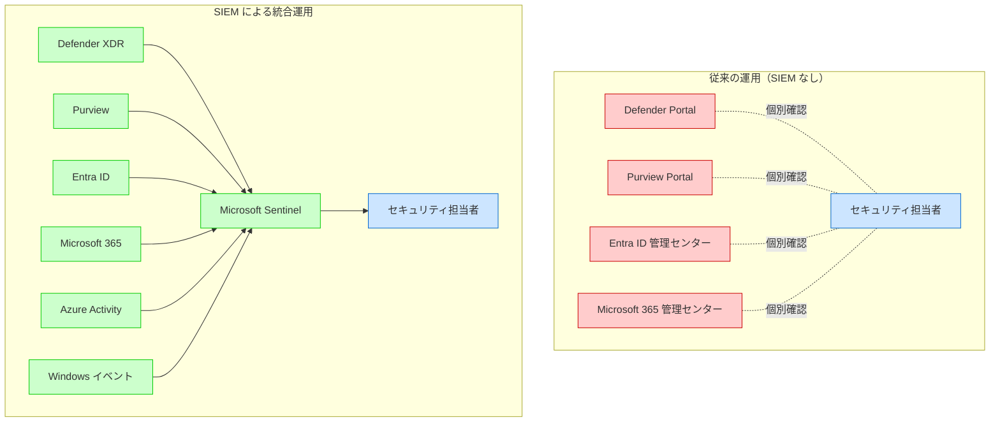
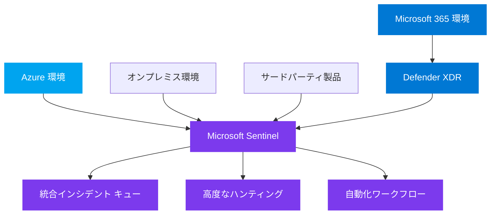
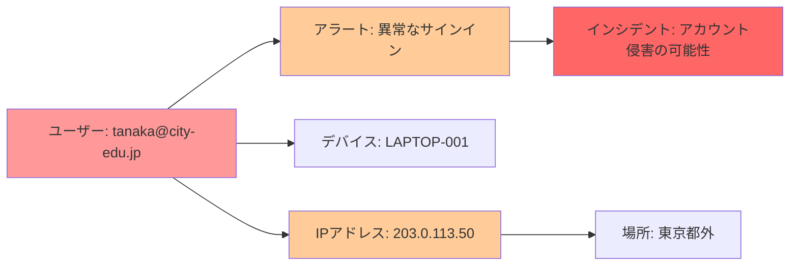

# Microsoft Sentinel による SIEM の構築

本章では、Microsoft Sentinel を活用した SIEM（Security Information and Event Management）の構築について解説します。教育委員会における包括的なセキュリティ監視と、複数のセキュリティソリューションを統合した運用を実現します。

# 19.1 なぜ教育委員会に SIEM が必要なのか

## 19.1.1 教育委員会が直面するセキュリティ課題

### セキュリティ製品の分散と可視性の欠如

教育委員会では、第5章から第18章で解説してきた複数のセキュリティ製品を導入しています。

**導入済みのセキュリティ製品**:
- **Entra ID**: ID管理、MFA、条件付きアクセス（第5章・第6章）
- **Intune**: デバイス管理、コンプライアンス（第8章）
- **Defender for Endpoint**: エンドポイント保護（第9章）
- **Information Protection**: 秘密度ラベル（第10章）
- **DLP**: データ漏洩防止（第11章）
- **Defender for Office 365**: メール・コラボレーション保護（第14章）
- **Defender for Cloud Apps**: クラウドアプリ保護（第15章）
- **Defender Portal**: 統合セキュリティ運用（第16章）

**課題**: これらの製品は個別のポータルやログを持ち、**全体像の把握が困難**です。

### 具体的な運用上の問題

**問題1: アラート疲労（Alert Fatigue）**

各製品から大量のアラートが発生し、本当に重要な脅威を見逃すリスクがあります。

```
Defender for Endpoint: 50件/日
Defender for Office 365: 30件/日
Entra ID Protection: 20件/日
DLP: 40件/日
---
合計: 140件/日
```

**セキュリティ担当者の負担**:
- 毎日140件のアラートを確認
- 誤検知（False Positive）が多い
- 真の脅威を見逃す可能性

**問題2: 相関分析の困難**

複数の製品にまたがる攻撃を検知できません。

**攻撃例: フィッシングメールからアカウント侵害へ**:
1. **Defender for Office 365**: フィッシングメール検知（警告のみ）
2. **Entra ID**: 異常な場所からのサインイン試行（アラート）
3. **Defender for Cloud Apps**: 大量ファイルダウンロード（アラート）

**課題**: これら3つのアラートが同一攻撃であることを手動で調査しなければならない

**問題3: コンプライアンス要件への対応**

**教育情報セキュリティポリシーガイドライン（文部科学省）の要求**:
- セキュリティ ログの保管（最低1年、推奨3年）
- インシデント発生時の迅速な調査
- 個人情報へのアクセス履歴の保存

**課題**: 各製品のログ保持期間がバラバラ
- Entra ID サインインログ: 30日（A5）
- Defender ログ: 180日
- Microsoft 365 監査ログ: 1年（A5）

長期保存には、各製品から個別にエクスポートが必要。

**問題4: 限られた人員での運用**

教育委員会のセキュリティ担当者は通常1〜3名です。

**現状の課題**:
- 複数のポータルを毎日確認（Defender Portal、Purview、Entra ID 管理センター等）
- インシデント対応に時間がかかる
- 校務も兼務しており、セキュリティ専任ではない

## 19.1.2 SIEM による課題解決

### SIEM がもたらす価値

**1. すべてのセキュリティ イベントを一元管理**



**メリット**:
- 単一のポータルで全体を監視
- 作業時間の大幅削減

**2. 高度な相関分析と自動インシデント作成**

複数のアラートを自動的に関連付け、単一のインシデントとして統合します。

**例: アカウント侵害の検知**

```
【従来】3つの個別アラート
- Defender for Office 365: フィッシングメール受信
- Entra ID: 異常なサインイン
- Defender for Cloud Apps: 大量ダウンロード

【SIEM 導入後】1つの統合インシデント
- インシデント: "ユーザー tanaka@city-edu.jp のアカウント侵害"
  - 関連アラート（3件）
  - 関連エンティティ: ユーザー、デバイス、IPアドレス、ファイル
  - タイムライン: 攻撃の時系列
  - 推奨対応: アカウント無効化、パスワードリセット
```

**3. 長期ログ保存とコンプライアンス対応**

すべてのセキュリティ ログを一元的に長期保存できます。

| ログの種類 | デフォルト保持期間 | SIEM での保持期間 |
|-----------|------------------|------------------|
| Entra ID サインインログ | 30日（A5） | 1年〜3年（設定可能） |
| Microsoft 365 監査ログ | 1年（A5） | 1年〜3年（設定可能） |
| Defender アラート | 180日 | 1年〜3年（設定可能） |
| Windows セキュリティ イベント | 保存されない | 1年〜3年（設定可能） |

**4. 自動化によるインシデント対応の効率化**

プレイブック（自動化ワークフロー）により、定型的な対応を自動化します。

**自動化の例**:
- **高重大度インシデント発生時**: Teams に自動通知、担当者アサイン
- **アカウント侵害検知時**: 自動的にサインインブロック、管理者に通知
- **マルウェア検知時**: デバイスを自動隔離

**効果**: 対応時間を数時間から数分に短縮

## 19.1.3 教育委員会における SIEM 導入の投資対効果

### コスト

**Microsoft Sentinel の月額コスト（想定）**:
- 30校、教職員 500人規模: 約30万円〜40万円/月

### 効果

**1. セキュリティ インシデント対応時間の削減**

- **従来**: インシデント調査に平均 4時間
- **SIEM 導入後**: インシデント調査に平均 1時間
- **効果**: 1インシデントあたり 3時間削減

**月間10インシデント発生の場合**:
- 削減時間: 30時間/月
- 人件費換算: 約10万円/月の削減

**2. 重大インシデントの早期検知による被害軽減**

個人情報漏洩などの重大インシデントを早期に検知し、被害を最小化します。

**想定被害コスト**:
- 個人情報漏洩（1件）: 数百万円〜数千万円
- SIEM による早期検知: 被害を 50%削減

**3. コンプライアンス違反の回避**

教育情報セキュリティポリシーガイドラインへの準拠により、監査対応が容易になります。

**4. セキュリティ担当者の負担軽減**

複数ポータルの確認作業が不要になり、他の業務に時間を割けるようになります。

:::message
**投資対効果**: SIEM 導入により、セキュリティ運用の効率化と重大インシデントの早期検知による被害軽減が期待できます。中長期的には、インシデント対応コストの削減とコンプライアンス対応の効率化により、投資を回収できます。
:::

---

# 19.2 Microsoft Sentinel の概要

Microsoft Sentinel は、クラウドネイティブな SIEM および SOAR（Security Orchestration, Automation and Response）ソリューションです。

## 19.2.1 Microsoft Sentinel とは

### SIEM と SOAR の機能

**SIEM（Security Information and Event Management）**:
- セキュリティ情報とイベントの集約
- リアルタイム分析と脅威検知
- コンプライアンス レポート

**SOAR（Security Orchestration, Automation and Response）**:
- インシデント対応の自動化
- プレイブックによるワークフロー実行
- 外部システムとの連携

### 教育委員会での活用メリット

**包括的な可視化**:
- Microsoft 365、Azure、オンプレミス環境の統合監視
- 複数学校のセキュリティ イベント集約
- ダッシュボードによる一元管理

**高度な脅威検知**:
- 機械学習による異常検知
- Microsoft 脅威インテリジェンスの活用
- カスタム分析ルールの作成

**運用効率化**:
- インシデント対応の自動化
- アラート疲労の軽減
- 少人数でのセキュリティ運用

## 19.1.2 Microsoft Defender XDR との統合

### 統合アーキテクチャ



### Defender XDR コネクタの設定

**1. Microsoft Sentinel ワークスペース作成**

Azure ポータル → **Microsoft Sentinel** → **作成**

**2. Defender XDR コネクタの有効化**

**Data connectors** → **Microsoft Defender XDR** → **Open connector page**

**3. インシデントとアラートの接続**

**Configuration** → **Connect incidents & alerts**

- **Turn off all Microsoft incident creation rules for these products**: チェック（重複防止）

**4. イベントの接続**

**Connect events** セクションで以下を選択:

**Microsoft Defender for Endpoint**:
- DeviceEvents
- DeviceFileEvents
- DeviceLogonEvents
- DeviceNetworkEvents
- DeviceProcessEvents

**Microsoft Defender for Office 365**:
- EmailEvents
- EmailUrlInfo
- EmailAttachmentInfo
- EmailPostDeliveryEvents

:::message
**無料データ取り込み**: Defender XDR からのインシデントとアラートは、Microsoft Sentinel への取り込みが無料です。Advanced Hunting テーブル（DeviceEvents、EmailEvents等）は有料です。
:::

---

# 19.2 Microsoft Sentinel ワークスペースの構築

教育委員会における Microsoft Sentinel の実装手順を解説します。

## 19.2.1 ワークスペースの設計

### ワークスペース構成の選択

**教育委員会向け推奨構成**:

| 構成 | メリット | デメリット | 推奨対象 |
|------|---------|-----------|---------|
| **単一ワークスペース** | - コスト効率が高い<br/>- クエリが簡単<br/>- 管理が容易 | - 大量データで性能低下の可能性 | 中小規模教育委員会（〜50校） |
| **地域別ワークスペース** | - 地域ごとの管理<br/>- パフォーマンス向上 | - コストが高い<br/>- クエリが複雑 | 大規模教育委員会（50校以上） |

**教育委員会での推奨**: 単一ワークスペース

理由:
- コスト効率が高い
- 教育委員会全体のセキュリティ状況を一元管理できる
- Commitment Tier（100 GB/日）に到達しやすい

### リージョンの選択

**日本国内のリージョン**: 東日本（Japan East）または 西日本（Japan West）

**選択基準**:
- データ所在地要件（自治体の情報セキュリティポリシー）
- Microsoft 365 テナント リージョンとの整合性
- ディザスタ リカバリーの要件

## 19.2.2 ワークスペースの作成と初期設定

### ワークスペースの作成

**1. Log Analytics ワークスペースの作成**

Azure ポータル → **Log Analytics workspaces** → **作成**

**基本設定**:
- **リソース グループ**: RG-Sentinel
- **名前**: LAW-EduBoard-Sentinel
- **リージョン**: Japan East

**2. Microsoft Sentinel の有効化**

Azure ポータル → **Microsoft Sentinel** → **追加**

作成した Log Analytics ワークスペースを選択 → **追加**

### 無料試用版の活用

**31日間無料試用**:
- 最初の 10 GB/日が無料（31日間）
- テナントあたり最大20ワークスペース

:::message
無料試用期間中に、データ量を測定し、適切な Commitment Tier を選択しましょう。
:::

### 価格設定の構成

**Settings** → **Workspace settings** → **Usage and estimated costs** → **Pricing tier**

**推奨 Commitment Tier**（教育委員会規模別）:

| 教育委員会規模 | 推奨 Tier | 想定データ量 |
|-------------|----------|------------|
| 小規模（〜10校） | Pay-As-You-Go | 〜50 GB/日 |
| 中規模（10〜30校） | 100 GB/日 | 50〜150 GB/日 |
| 大規模（30校以上） | 200 GB/日以上 | 150 GB/日以上 |

## 19.2.3 データ コネクタの設定

### 主要データソースの接続

#### 1. Microsoft Defender XDR（前述）

#### 2. Entra ID（Azure Active Directory）

**Data connectors** → **Microsoft Entra ID** → **Open connector page**

**接続するログ**:
- **Sign-in logs**: サインイン試行、MFA、条件付きアクセス
- **Audit logs**: ユーザー作成・削除、ロール変更、ポリシー変更

**Configuration** → **Connect**

#### 3. Microsoft 365（監査ログ）

**Data connectors** → **Office 365** → **Open connector page**

**接続するログ**:
- Exchange: メール操作
- SharePoint: ファイル操作
- Teams: チャット、会議

**Configuration** → **Connect**

#### 4. Azure Activity（Azure管理操作）

**Data connectors** → **Azure Activity** → **Open connector page**

**サブスクリプションの接続** → Azure ポリシーの割り当て

#### 5. セキュリティ イベント（Windows）

**Data connectors** → **Security Events via AMA** → **Open connector page**

**データ収集ルールの作成**:
- **All Events**: すべてのイベント（推奨しない、データ量大）
- **Common**: 一般的なセキュリティ イベント（推奨）
- **Minimal**: 最小限のイベント

**教育委員会向け推奨**: Common

### データ コネクタ接続後の確認

**Logs** → 以下のクエリで確認:

```kusto
// Entra ID サインインログ
SigninLogs
| take 10

// Defender for Office 365 メール イベント
EmailEvents
| take 10

// Azure Activity
AzureActivity
| take 10

// Windows セキュリティ イベント
SecurityEvent
| take 10
```

---

# 19.3 分析ルールとインシデント管理

Microsoft Sentinel での脅威検知とインシデント管理を解説します。

## 19.3.1 分析ルールの種類

### 分析ルールの分類

| 種類 | 説明 | 用途 |
|------|------|------|
| **スケジュール済みクエリ** | KQL クエリを定期実行 | カスタム脅威検知 |
| **Microsoft セキュリティ** | Defender XDR等からアラート取り込み | Microsoft 製品アラート |
| **機械学習** | 異常検知 | ユーザー行動分析 |
| **脅威インテリジェンス** | IOC（Indicators of Compromise）との一致 | 既知の脅威検知 |

## 19.3.2 教育委員会向け推奨分析ルール

### 1. 管理者アカウント侵害の検知

**Analytics** → **Rule templates** → **検索**: "Anomalous sign-in location"

**Create rule** → ルールのカスタマイズ

**KQL クエリ例**:

```kusto
SigninLogs
| where TimeGenerated > ago(1h)
| where RiskLevelDuringSignIn == "high" or RiskLevelAggregated == "high"
| where UserPrincipalName has "@city-edu.jp"
| where ResultType == "0" // 成功したサインイン
| project TimeGenerated, UserPrincipalName, IPAddress, Location, DeviceDetail
```

**設定**:
- **重大度**: High
- **実行頻度**: 1時間ごと
- **インシデント作成**: 有効

### 2. 大量ファイル ダウンロードの検知

```kusto
CloudAppEvents
| where TimeGenerated > ago(1h)
| where Application == "Microsoft SharePoint Online"
| where ActionType == "FileDownloaded"
| summarize DownloadCount = count() by AccountDisplayName, bin(TimeGenerated, 1h)
| where DownloadCount > 100 // 1時間に100ファイル以上
```

### 3. 個人情報ファイルの外部共有

```kusto
CloudAppEvents
| where TimeGenerated > ago(1h)
| where Application == "Microsoft SharePoint Online"
| where ActionType == "SharingSet"
| where RawEventData.SensitivityLabel contains "機密性3" // 個人情報ラベル
| where RawEventData.TargetUserOrGroupType == "Guest"
```

### 4. 管理者権限の変更

```kusto
AuditLogs
| where TimeGenerated > ago(1h)
| where OperationName contains "role" or OperationName contains "Role"
| where Result == "success"
| project TimeGenerated, Identity, OperationName, TargetResources
```

## 19.3.3 インシデントの調査

### インシデント キューの活用

**Incidents** → インシデント一覧

**フィルター条件**:
- **Severity**: High, Medium
- **Status**: New, Active
- **Owner**: 自分 / チーム

### インシデントの詳細調査

**1. インシデント選択**

インシデント クリック → **View full details**

**2. タイムライン確認**

**Timeline** タブで時系列を確認

**3. エンティティ確認**

**Entities** タブで関連するユーザー、デバイス、IPアドレスを確認

**4. 調査グラフ（Investigation Graph）**

**Investigate** ボタン → 視覚的な関連性の確認



### インシデント対応の記録

**Comments** タブで対応内容を記録:

```
【調査結果】
- ユーザー tanaka@city-edu.jp のアカウントに、海外IPアドレスからのサインイン試行を検知
- MFAにより認証は失敗
- ユーザーにパスワード変更を指示

【対応】
- ユーザーのパスワードをリセット
- MFA再登録を実施
- 不審なアクティビティなし

【ステータス】
- クローズ（False Positive）
```

---

# 19.4 自動化とプレイブック

Microsoft Sentinel のプレイブック（Azure Logic Apps）を活用した自動化を解説します。

## 19.4.1 プレイブックの概要

### プレイブックとは

**Azure Logic Apps** を使用した自動化ワークフローです。

**主な用途**:
- インシデント通知（メール、Teams）
- エンリッチメント（外部情報取得）
- 自動対応（アカウント無効化、デバイス隔離）

### 教育委員会向けプレイブックの例

**1. 高重大度インシデント通知（Teams）**:
- High または Medium のインシデント発生時
- Teams チャネルに通知
- 担当者アサイン

**2. ユーザー アカウント無効化**:
- アカウント侵害検知時
- 自動的にサインインをブロック
- セキュリティ管理者に通知

**3. デバイス隔離（Defender for Endpoint）**:
- マルウェア検知時
- デバイスをネットワークから隔離

## 19.4.2 プレイブックの作成例（Teams 通知）

### 手順

**1. プレイブックの作成**

**Automation** → **Playbook templates** → **検索**: "Post message to Microsoft Teams"

**Create playbook**

**2. 基本設定**

- **プレイブック名**: Playbook-IncidentNotification-Teams
- **リソース グループ**: RG-Sentinel
- **リージョン**: Japan East

**3. Logic Apps デザイナーでワークフロー作成**

**トリガー**:
- **When Microsoft Sentinel incident creation rule was triggered**

**アクション 1: Teams に投稿**:
- **Post message in a chat or channel**
- **Team**: セキュリティ運用チーム
- **Channel**: インシデント通知
- **Message**:

```
🚨 **新規インシデント発生**

**インシデント ID**: @{triggerBody()?['object']?['properties']?['incidentNumber']}
**タイトル**: @{triggerBody()?['object']?['properties']?['title']}
**重大度**: @{triggerBody()?['object']?['properties']?['severity']}

**詳細を確認**:
https://portal.azure.com/#asset/Microsoft_Azure_Security_Insights/Incident/@{triggerBody()?['object']?['id']}
```

**4. 保存とテスト**

**保存** → **Run Trigger** でテスト

## 19.4.3 オートメーション ルールの設定

### オートメーション ルールの作成

**Automation** → **Automation rules** → **Create** → **Automation rule**

**ルール名**: 高重大度インシデント自動通知

**トリガー**: When incident is created

**条件**:
- **Incident provider**: Microsoft Sentinel
- **Severity**: Equals High, Medium

**アクション**:
1. **Assign owner**: セキュリティ管理者
2. **Run playbook**: Playbook-IncidentNotification-Teams

**保存**

---

# 19.5 コストの最適化と運用

## 19.5.1 Microsoft Sentinel のコスト構造

### 課金モデル

**1. データ取り込み（Log Analytics）**:
- データ ボリューム（GB/日）に基づく課金
- Commitment Tier で割引（100 GB/日〜）

**2. データ分析（Microsoft Sentinel）**:
- データ ボリューム（GB/日）に基づく課金
- Commitment Tier で割引

**3. データ保持**:
- 90日間は無料
- 91日目以降は有料（GB/月）

:::message
**簡素化された価格設定**: 2023年7月以降、Log Analytics と Microsoft Sentinel の課金が統合され、単一の Commitment Tier になりました。
:::

### 教育委員会での想定コスト

**想定データ量**（30校、教職員 500人の場合）:

| データソース | 1日あたりデータ量 |
|------------|----------------|
| Defender XDR（無料） | 10 GB |
| Entra ID ログ | 5 GB |
| Microsoft 365 監査ログ | 15 GB |
| Windows セキュリティ イベント | 20 GB |
| Azure Activity | 5 GB |
| **合計** | **55 GB/日** |

**推奨価格設定**: 100 GB/日 Commitment Tier

**月額想定コスト**（2025年1月現在の参考価格）:
- 約 30万円〜40万円/月

:::message alert
**重要**: 上記は参考価格です。正確な見積もりは、Microsoft セールス担当者にお問い合わせください。
:::

## 19.5.2 コスト最適化のベストプラクティス

### 1. データ取り込みの最適化

**不要なデータの除外**:

**Settings** → **Workspace settings** → **Tables** → 各テーブルの設定

**Transformation（変換）** でフィルタリング:

```kusto
// 例: 情報イベント（4688）を除外
SecurityEvent
| where EventID != 4688 // プロセス作成イベントを除外
```

### 2. データ保持期間の最適化

**低頻度アクセス データの長期保存**:

**Settings** → **Workspace settings** → **Tables**

**Interactive retention**: 90日（無料）
**Total retention**: 1年（低コスト）

### 3. Basic Logs の活用

**頻度の低いクエリ対象テーブル**を Basic Logs に変更:

**Settings** → **Workspace settings** → **Tables** → **Table plan**: Basic

**メリット**:
- 取り込みコストが低い（約50%削減）
- クエリ時に課金（スキャンしたデータ量）

**デメリット**:
- アラートに使用不可
- 保持期間は8日間のみ

## 19.5.3 運用のベストプラクティス

### 定期レビュー（月次）

**1. インシデント統計**

**Incidents** → フィルター: **Last 30 days**

**確認項目**:
- 発生インシデント数
- 重大度別分布
- 平均解決時間（MTTR）

**2. 分析ルールの調整**

**Analytics** → **Active rules**

**確認項目**:
- False Positive が多いルールの調整
- 検知されていない脅威の追加

**3. コスト レビュー**

**Cost Management** → **Cost analysis**

**確認項目**:
- 月次コスト推移
- データソース別データ量
- Commitment Tier の最適化

### セキュリティ チームのトレーニング

**Microsoft Learn の活用**:
- [Microsoft Sentinel のトレーニング](https://learn.microsoft.com/en-us/training/paths/sc-200-configure-azure-sentinel/)
- KQL（Kusto Query Language）の学習

**定期的な演習**:
- インシデント対応訓練（四半期ごと）
- プレイブックのテスト

---

# 本章のまとめ

本章では、Microsoft Sentinel による SIEM の構築について解説しました。

**重要ポイント**:

1. **Microsoft Sentinel の概要**: クラウドネイティブ SIEM+SOAR として、教育委員会全体のセキュリティ監視を実現
2. **Defender XDR との統合**: Microsoft 365 のインシデントとアラートを自動的に統合
3. **ワークスペース構築**: 単一ワークスペースでコスト効率と管理効率を両立
4. **データ コネクタ**: Entra ID、Microsoft 365、Azure Activity、Windows イベント等を接続
5. **分析ルール**: 教育委員会特有の脅威検知ルールを作成
6. **インシデント管理**: 統合インシデント キューで効率的な調査と対応
7. **プレイブック**: Teams 通知、自動対応による運用効率化
8. **コスト最適化**: Commitment Tier、Basic Logs、データ保持期間の最適化

**次章への接続**:

次章（第20章）では、ゼロトラストの段階的導入ロードマップと予算計画について解説します。Microsoft Sentinel を含む全体的な導入計画を立てます。
