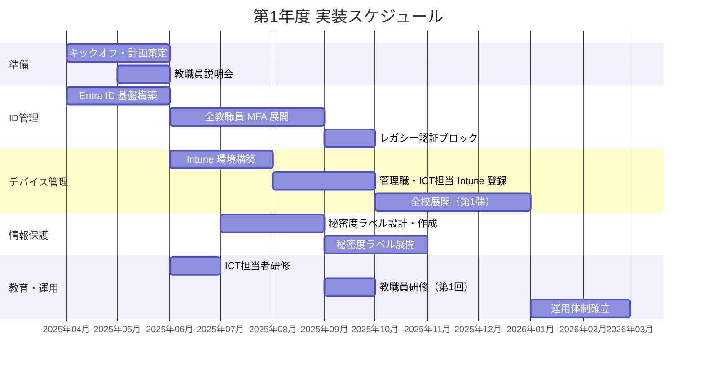
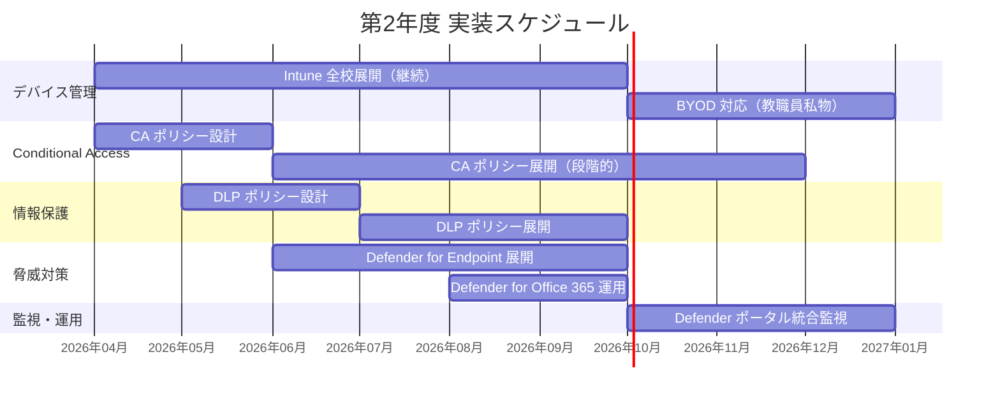
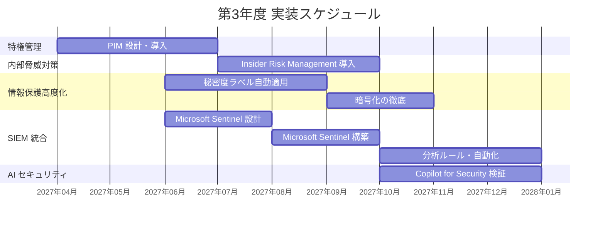

# この章で学ぶこと

この章では、限られた予算・人員で段階的にゼロトラストを実装する方法を解説します。

- ゼロトラスト成熟度モデル（レベル1～3）で現在地と目標を明確にする
- 3年間のフェーズごとの実装計画を立てる
- 必要な予算（ライセンス・導入支援・運用）を算出し、費用対効果を示す
- 他自治体・教育委員会との情報共有で先進事例から学ぶ

**対象読者**: 教育委員会のICT担当者、情報政策担当者、教育長、財政担当者

# 20.1 ゼロトラスト成熟度モデル（教育機関向け）

ゼロトラストの実装は、一度に完了するものではありません。段階的に成熟度を高めていく必要があります。

## 20.1.1 成熟度レベルの定義

### レベル1：基本対策（導入初年度）

ゼロトラスト導入の第一歩として、最も重要な基盤を整備します。MFA（多要素認証）によるID保護と、Intuneによるデバイス管理の基礎を確立し、すべての教職員が安全に Microsoft 365 を利用できる環境を構築します。この段階では「完璧」を目指すのではなく、「確実に基礎を固める」ことを優先します。

**目的**: セキュリティの基礎を固める

**実装内容**:
- **ID管理**: Entra ID への移行、全教職員の MFA 有効化
- **認証**: レガシー認証のブロック
- **デバイス**: Intune への Windows PC 登録（段階的）
- **情報保護**: Microsoft Purview Information Protection の基本設定

**達成基準**:
- MFA 有効化率 100%
- Intune 登録率 50%（管理職・ICT担当優先）
- Microsoft Secure Score 50% 以上

**想定期間**: 6～12ヶ月

**想定コスト**:
- ライセンス費用（M365 A5）: 500名規模で年間 約967万円（教職員のみ）
- 導入支援費用: 約500万円

---

### レベル2：標準対策（2年目）

レベル1で構築した基盤の上に、ゼロトラストの中核となる機能を展開します。Conditional Access によるリスクベースのアクセス制御、DLP による情報漏洩防止、Defender による脅威対策を実装し、「信頼しない、常に検証する」というゼロトラストの原則を実現します。この段階で、教育委員会のセキュリティは大きく向上します。

**目的**: ゼロトラストの主要機能を展開する

**実装内容**:
- **Conditional Access**: リスクベース・デバイスベースのポリシー展開
- **デバイス**: Intune 全校展開、BYOD 対応（教職員私物端末）
- **情報保護**: DLP ポリシー展開（メール・Teams・OneDrive）
- **脅威対策**: Defender for Endpoint 展開、Defender for Office 365 運用開始
- **統合ポータル**: Microsoft Defender ポータルでの統合監視

**達成基準**:
- Intune 登録率 100%（全校全端末）
- Conditional Access ポリシー適用率 100%
- DLP ポリシー適用（機密情報の外部共有防止）
- Microsoft Secure Score 70% 以上

**想定期間**: 12～18ヶ月

**想定コスト**:
- ライセンス費用: 継続
- 導入支援費用: 約300万円
- 運用支援費用（年間保守）: 約200万円

---

### レベル3：高度対策（3年目）

ゼロトラストの最終段階として、より高度なセキュリティ機能を実装します。PIM による特権アカウント管理、Insider Risk Management による内部脅威対策、Microsoft Sentinel による統合ログ管理により、包括的なセキュリティ体制を確立します。この段階に到達すれば、教育委員会は全国でも先進的なゼロトラスト実装事例となります。

**目的**: 包括的なゼロトラストを実現する

**実装内容**:
- **特権管理**: PIM（Privileged Identity Management）で管理者アカウント保護
- **内部脅威対策**: Insider Risk Management で内部不正検知
- **高度な情報保護**: 秘密度ラベルの自動適用、暗号化の徹底
- **SIEM 統合**: Microsoft Sentinel による統合ログ管理と自動対応
- **AI セキュリティ**: Copilot for Security による脅威分析

**達成基準**:
- PIM 有効化（全管理者）
- Insider Risk Management 運用開始
- Microsoft Sentinel 稼働（ログ統合）
- Microsoft Secure Score 80% 以上

**想定期間**: 12～18ヶ月

**想定コスト**:
- ライセンス費用: 継続
- Microsoft Sentinel 費用: 月間 30～40万円（規模により変動）
- 導入支援費用: 約200万円
- 運用支援費用（年間保守）: 約250万円

---

## 20.1.2 現状評価（アセスメント）の実施

導入計画を立てる前に、現在のセキュリティ状況を把握します。

### Microsoft Secure Score による評価

**手順**:

1. **Microsoft Defender ポータル** → **Secure Score** にアクセス
2. 現在のスコアを確認（例: 45%）
3. **Recommended actions** で推奨される改善アクション一覧を確認
4. 優先度の高いアクションを特定

**評価観点**:
- **ID 管理**: MFA 有効化率、レガシー認証ブロック
- **デバイス**: Intune 登録率、デバイス準拠性
- **データ保護**: 秘密度ラベル利用率、DLP ポリシー
- **脅威対策**: Defender for Endpoint 展開率

### 自己評価チェックリスト

以下のチェックリストで現状を評価します。

| 評価項目 | 実施状況 | レベル |
|---------|---------|--------|
| **ID 管理** |
| 全教職員に MFA を要求している | ☐ はい / ☐ 一部 / ☐ いいえ | L1 |
| レガシー認証をブロックしている | ☐ はい / ☐ いいえ | L1 |
| Conditional Access を運用している | ☐ はい / ☐ 一部 / ☐ いいえ | L2 |
| PIM で管理者を保護している | ☐ はい / ☐ いいえ | L3 |
| **デバイス管理** |
| Intune でデバイスを管理している | ☐ 全台 / ☐ 一部 / ☐ いいえ | L1 |
| デバイス準拠性ポリシーを適用している | ☐ はい / ☐ いいえ | L2 |
| **情報保護** |
| 秘密度ラベルを運用している | ☐ はい / ☐ 一部 / ☐ いいえ | L1 |
| DLP で機密情報外部共有を防止している | ☐ はい / ☐ 一部 / ☐ いいえ | L2 |
| 暗号化を徹底している | ☐ はい / ☐ 一部 / ☐ いいえ | L3 |
| **脅威対策** |
| Defender for Endpoint を展開している | ☐ 全台 / ☐ 一部 / ☐ いいえ | L2 |
| Defender for Office 365 を運用している | ☐ はい / ☐ いいえ | L2 |
| Microsoft Sentinel で統合監視している | ☐ はい / ☐ いいえ | L3 |

**評価結果の活用**:
- 「はい」「全台」が多い → 次のレベルへ進める
- 「一部」「いいえ」が多い → 現レベルの完成を優先

---

## 20.1.3 目標設定（3年後のゴール）

現状評価の結果をもとに、3年後の目標を設定します。

### 目標設定例（中規模教育委員会：教職員500名）

**現状**:
- MFA 有効化率: 20%（管理職のみ）
- Intune 登録率: 0%
- Microsoft Secure Score: 35%

**3年後の目標**:
- MFA 有効化率: 100%
- Intune 登録率: 100%
- Conditional Access 適用率: 100%
- DLP ポリシー適用: 完了
- Microsoft Secure Score: 80% 以上
- **レベル3 到達**

---

# 20.2 段階的導入ロードマップ

3年間でレベル3を目指す段階的ロードマップを示します。

## 20.2.1 第1年度：基盤整備フェーズ

**目的**: セキュリティの基礎を固める（レベル1 達成）

### 実装内容と時期



### 詳細スケジュール

#### 4月～5月：準備・計画策定

**実施内容**:
- プロジェクト計画書作成
- 導入支援ベンダー選定
- キックオフミーティング
- 現状評価（アセスメント）
- 教職員説明会（全体）

**成果物**:
- プロジェクト計画書
- 現状評価レポート
- 教職員向け説明資料

---

#### 6月～9月：ID管理・デバイス管理の基盤構築

**実施内容**:
- Entra ID テナント設計・構築
- 全教職員への MFA 展開
  - 段階的ロールアウト（学校単位）
  - ヘルプデスク体制整備
- Intune 環境構築
  - Compliance Policy 作成
  - Configuration Profile 作成
- 管理職・ICT担当者の Intune 登録（パイロット）

**成果物**:
- MFA 有効化率 100%
- Intune 登録率 30%（管理職・ICT担当）

**課題と対策**:
- 課題: MFA 登録で困る教職員がいる
- 対策: ヘルプデスク窓口設置、説明動画配信

---

#### 10月～3月：デバイス管理の全校展開

**実施内容**:
- レガシー認証のブロック（MFA 展開完了後）
- Intune 全校展開（学校単位で段階的）
- 秘密度ラベルの設計・展開
- 運用体制の確立（ヘルプデスク、インシデント対応）

**成果物**:
- Intune 登録率 50%
- 秘密度ラベル運用開始
- Microsoft Secure Score 50% 達成

---

## 20.2.2 第2年度：セキュリティ強化フェーズ

**目的**: ゼロトラストの主要機能を展開する（レベル2 達成）

### 実装内容と時期



### 詳細スケジュール

#### 4月～9月：Conditional Access と DLP の展開

**実施内容**:
- Intune 全校展開の完了（登録率 100%）
- Conditional Access ポリシー設計
  - リスクベース・デバイスベースのポリシー
  - 段階的ロールアウト（Report-only → 強制）
- DLP ポリシー設計・展開
  - メール・Teams・OneDrive の機密情報外部共有防止
- Defender for Endpoint の全校展開

**成果物**:
- Intune 登録率 100%
- Conditional Access 適用率 100%
- DLP ポリシー運用開始
- Defender for Endpoint 展開率 100%

---

#### 10月～3月：脅威対策の強化

**実施内容**:
- BYOD 対応（教職員私物端末）
  - MAM（Mobile Application Management）ポリシー
- Defender for Office 365 の本格運用
  - Safe Links、Safe Attachments の展開
  - Anti-phishing ポリシーの最適化
- Microsoft Defender ポータルでの統合監視
- インシデント対応プロセスの確立

**成果物**:
- BYOD 対応完了
- Defender ポータルでの統合運用開始
- Microsoft Secure Score 70% 達成

---

## 20.2.3 第3年度：最適化フェーズ

**目的**: 包括的なゼロトラストを実現する（レベル3 達成）

### 実装内容と時期



### 詳細スケジュール

#### 4月～9月：特権管理と情報保護の高度化

**実施内容**:
- PIM（Privileged Identity Management）の導入
  - 全管理者アカウントを Just-In-Time で保護
- 秘密度ラベルの自動適用
  - 機密情報を自動分類・ラベル付け
- 暗号化の徹底
  - 高機密ドキュメントの暗号化必須化

**成果物**:
- PIM 有効化率 100%（全管理者）
- 秘密度ラベル自動適用率 80%

---

#### 10月～3月：SIEM 統合と AI セキュリティ

**実施内容**:
- Microsoft Sentinel の構築
  - ログ統合（Defender XDR、Entra ID、Microsoft 365、Azure、Windows）
  - 教育委員会向け分析ルールの展開
  - プレイブックによる自動対応
- Insider Risk Management の運用開始
  - 内部不正の早期検知
- Copilot for Security の検証・導入
  - AI による脅威分析

**成果物**:
- Microsoft Sentinel 稼働
- Insider Risk Management 運用開始
- Microsoft Secure Score 80% 達成
- **レベル3 到達**

---

# 20.3 予算計画と費用対効果

段階的導入に必要な予算を算出し、費用対効果を示します。

## 20.3.1 ライセンス費用

### Microsoft 365 A5 for Education ライセンス

**価格**（2025年時点の参考価格）:
- **Microsoft 365 A5 for Faculty**（教職員用）: 19,332円 / ユーザー / 年
- **Microsoft 365 A5 for Students**（児童生徒用）: 0円 / ユーザー / 年（Student Use Benefit 適用）

:::message
Microsoft 365 A5 には、Entra ID P2、Intune、Defender for Endpoint、Defender for Office 365、Microsoft Purview Information Protection、DLP、Insider Risk Management、PIM などが含まれます。
:::

:::message
💡 **Student Use Benefit**: 教職員向けライセンスを購入すると、同数の児童生徒向けライセンスが無償で提供されます。児童生徒数が教職員数を上回る場合でも、追加費用は発生しません。
:::

### 規模別の年間ライセンス費用

#### 小規模教育委員会（教職員 200名、児童生徒 2,000名）

| ライセンス | 数量 | 単価 | 年間費用 |
|-----------|------|------|---------|
| Microsoft 365 A5 for Faculty | 200 | 19,332円 | 3,866,400円 |
| Microsoft 365 A5 for Students | 2,000 | 0円（Student Use Benefit） | 0円 |
| **合計** | | | **3,866,400円** |

#### 中規模教育委員会（教職員 500名、児童生徒 5,000名）

| ライセンス | 数量 | 単価 | 年間費用 |
|-----------|------|------|---------|
| Microsoft 365 A5 for Faculty | 500 | 19,332円 | 9,666,000円 |
| Microsoft 365 A5 for Students | 5,000 | 0円（Student Use Benefit） | 0円 |
| **合計** | | | **9,666,000円** |

#### 大規模教育委員会（教職員 1,200名、児童生徒 12,000名）

| ライセンス | 数量 | 単価 | 年間費用 |
|-----------|------|------|---------|
| Microsoft 365 A5 for Faculty | 1,200 | 19,332円 | 23,198,400円 |
| Microsoft 365 A5 for Students | 12,000 | 0円（Student Use Benefit） | 0円 |
| **合計** | | | **23,198,400円** |

:::message alert
⚠️ **注意**: 上記は参考価格です。実際の価格は、Microsoft または販売パートナーにお問い合わせください。ボリュームライセンス（EES: Enrollment for Education Solutions）を利用すると割引が適用される場合があります。
:::

---

## 20.3.2 Microsoft Sentinel 費用

### Sentinel の価格モデル（簡素化された価格設定）

Microsoft Sentinel は、**取り込んだログのデータ量**（GB/日）に応じて課金されます。

**価格**（2025年時点の参考価格）:
- **コミットメント ティア**: 事前にデータ量をコミットすることで割引が適用されます
  - **100 GB/日**: 約 30万円/月（約 3,000円/GB）
  - **200 GB/日**: 約 55万円/月（約 2,750円/GB）
  - **500 GB/日**: 約 130万円/月（約 2,600円/GB）
- **従量課金**: 約 4,000円/GB（コミットなし）

### 規模別の想定コスト

#### 小規模教育委員会（教職員 200名）

**想定ログ量**: 約 20 GB/日
- Defender XDR: 10 GB/日
- Entra ID: 5 GB/日
- Microsoft 365: 3 GB/日
- Windows イベント: 2 GB/日

**月間費用**: 約 80,000円（従量課金）

**年間費用**: 約 960,000円

---

#### 中規模教育委員会（教職員 500名）

**想定ログ量**: 約 50 GB/日
- Defender XDR: 25 GB/日
- Entra ID: 12 GB/日
- Microsoft 365: 8 GB/日
- Windows イベント: 5 GB/日

**月間費用**: 約 200,000円（従量課金）

**年間費用**: 約 2,400,000円

:::message
💡 **ヒント**: 100 GB/日のコミットメント ティアを契約し、実際の利用は 50 GB/日に抑えることで、予算の安定化が図れます（月間 30万円で固定）。
:::

---

#### 大規模教育委員会（教職員 1,200名）

**想定ログ量**: 約 120 GB/日
- Defender XDR: 60 GB/日
- Entra ID: 30 GB/日
- Microsoft 365: 20 GB/日
- Windows イベント: 10 GB/日

**月間費用**: 約 35万円（100 GB/日コミット + 従量課金）

**年間費用**: 約 4,200,000円

---

## 20.3.3 導入支援費用

### 導入支援の内容

**第1年度（基盤整備）**:
- 現状評価（アセスメント）
- 設計支援（Entra ID、Intune、秘密度ラベル）
- 構築支援（Entra ID、Intune 環境構築）
- 教職員研修（ICT担当者向け、一般教職員向け）
- ヘルプデスク支援（MFA 登録、Intune 登録）

**想定費用**: 約 5,000,000円（中規模教育委員会）

---

**第2年度（セキュリティ強化）**:
- Conditional Access ポリシー設計・展開支援
- DLP ポリシー設計・展開支援
- Defender for Endpoint 展開支援
- 運用支援（インシデント対応、ポリシー最適化）

**想定費用**: 約 3,000,000円

---

**第3年度（最適化）**:
- PIM 導入支援
- Microsoft Sentinel 設計・構築支援
- Insider Risk Management 導入支援
- 運用支援

**想定費用**: 約 2,000,000円

---

## 20.3.4 運用支援費用（年間保守）

### 運用支援の内容

- 月次セキュリティレポート作成
- Microsoft Secure Score 改善提案
- インシデント対応支援（重大インシデント時の緊急対応）
- ポリシー最適化支援（年4回のレビュー）
- 新機能の評価・導入支援

**想定費用**:
- 第2年度以降: 約 2,000,000円 / 年（中規模教育委員会）

---

## 20.3.5 研修費用

### 研修の内容と費用

#### ICT担当者向け研修

**内容**:
- ゼロトラストの基礎
- Entra ID・Intune 運用管理
- セキュリティポリシー設計
- インシデント対応

**費用**: 約 500,000円（年1回、10名参加）

---

#### 一般教職員向け研修

**内容**:
- MFA の使い方
- 秘密度ラベルの使い方
- フィッシング対策

**費用**: 約 300,000円（年1回、全教職員向けオンライン研修）

---

## 20.3.6 3年間の総コスト（中規模教育委員会の例）

### 中規模教育委員会（教職員 500名、児童生徒 5,000名）

| 費用項目 | 第1年度 | 第2年度 | 第3年度 | 3年間合計 |
|---------|---------|---------|---------|----------|
| **ライセンス費用** |
| Microsoft 365 A5 | 9,666,000円 | 9,666,000円 | 9,666,000円 | 28,998,000円 |
| **Microsoft Sentinel** |
| Sentinel 費用 | 0円 | 0円 | 2,400,000円 | 2,400,000円 |
| **導入支援費用** |
| 導入支援 | 5,000,000円 | 3,000,000円 | 2,000,000円 | 10,000,000円 |
| **運用支援費用** |
| 年間保守 | 0円 | 2,000,000円 | 2,500,000円 | 4,500,000円 |
| **研修費用** |
| ICT担当者研修 | 500,000円 | 500,000円 | 500,000円 | 1,500,000円 |
| 一般教職員研修 | 300,000円 | 300,000円 | 300,000円 | 900,000円 |
| **年間合計** | **15,466,000円** | **15,466,000円** | **17,366,000円** | **48,298,000円** |

:::message
💡 **ポイント**: ライセンス費用が全体の約60%を占めます。導入支援・運用支援費用は全体の約30%です。Student Use Benefit により、児童生徒向けライセンスは無償となるため、教職員向けライセンス費用のみとなります。
:::

---

## 20.3.7 費用対効果（ROI）の計算

ゼロトラスト実装による費用対効果を示します。

### セキュリティインシデントによる損失の削減

**インシデント発生時の想定損失**（1件あたり）:
- **情報漏洩**: 3,000万円～1億円
  - 調査費用、謝罪対応、損害賠償、信用失墜
- **ランサムウェア感染**: 1,000万円～5,000万円
  - 復旧費用、業務停止による損失、身代金（支払わない前提）
- **なりすましメール詐欺**: 500万円～3,000万円
  - 不正送金、情報詐取

**ゼロトラスト実装による削減効果**:
- 情報漏洩リスク: 90% 削減
- ランサムウェアリスク: 80% 削減
- なりすましメール詐欺リスク: 70% 削減

**想定削減額**（年間）:
- 情報漏洩回避: 2,700万円（3,000万円 × 90%）
- ランサムウェア回避: 800万円（1,000万円 × 80%）
- なりすましメール回避: 350万円（500万円 × 70%）

**年間削減効果合計**: 約 3,850万円

---

### 運用効率化による削減

**従来の運用コスト**:
- ICT担当者の手動作業時間: 月間 80時間
  - パスワードリセット対応: 30時間
  - デバイス設定・トラブル対応: 30時間
  - セキュリティ監視・対応: 20時間

**ゼロトラスト実装後の削減**:
- パスワードリセット: 80% 削減（MFA・パスワードレス化）
- デバイス管理: 50% 削減（Intune 自動化）
- セキュリティ監視: 40% 削減（自動検知・対応）

**削減時間**: 月間 50時間 → **年間 600時間**

**人件費削減額**（時間単価 5,000円と仮定）:
- 600時間 × 5,000円 = **3,000,000円 / 年**

---

### ROI 計算

**3年間の投資額**: 48,298,000円

**3年間の削減効果**:
- セキュリティインシデント回避: 3,850万円 × 3年 = 115,500,000円
- 運用効率化: 300万円 × 3年 = 9,000,000円
- **合計削減効果**: 124,500,000円

**ROI**:
```
ROI = (削減効果 - 投資額) / 投資額 × 100
    = (124,500,000円 - 48,298,000円) / 48,298,000円 × 100
    = +157.8%
```

:::message
💡 **解釈**: **3年間で投資額を大きく上回る削減効果**が得られます。Student Use Benefit により児童生徒向けライセンスが無償となるため、費用対効果は非常に高くなります。4年目以降も、年間 4,150万円の削減効果が継続し、ライセンス費用（967万円）を大きく上回ります。
:::

---

### 定性的な効果

ROI 計算では表せない重要な効果もあります。

- **児童生徒の個人情報保護**: 法令遵守、保護者の信頼獲得
- **教職員の働き方改革**: セキュアな BYOD 対応、リモートワーク実現
- **自治体全体のセキュリティ向上**: 教育委員会が先進事例となる
- **GIGAスクール構想の推進**: セキュアな ICT 環境でデジタル教育を加速

---

## 20.3.8 予算確保のための説明資料

議会や首長への予算説明で使える資料の構成を示します。

### 説明資料の構成（スライド形式）

#### スライド1: 背景と課題

**タイトル**: なぜ今、ゼロトラストが必要なのか

**内容**:
- GIGAスクール構想によるクラウド利用拡大
- サイバー攻撃の高度化（教育機関への攻撃増加）
- 個人情報保護法・教育情報セキュリティポリシーガイドラインへの対応
- 従来の境界型セキュリティの限界

**データ**:
- 教育機関への攻撃件数: 前年比 150% 増加
- 情報漏洩時の損失額: 平均 3,000万円

---

#### スライド2: ゼロトラストとは

**タイトル**: ゼロトラスト：「信頼しない、常に検証する」

**内容**:
- ゼロトラストの基本原則
- Microsoft 365 A5 によるゼロトラスト実装
- 4つの柱（ID、デバイス、情報、脅威）

**図解**:
- ゼロトラストのイメージ図

---

#### スライド3: 段階的導入計画

**タイトル**: 3年間で段階的に実装

**内容**:
- 第1年度: 基盤整備（MFA、Intune）
- 第2年度: セキュリティ強化（Conditional Access、DLP、Defender）
- 第3年度: 最適化（PIM、Insider Risk、Sentinel）

**図解**:
- 3年間のロードマップ（Ganttチャート）

---

#### スライド4: 必要な予算

**タイトル**: 3年間の予算計画

**内容**:
- 3年間の総額: 約4,830万円
- 内訳:
  - ライセンス費用: 2,900万円（60%）※児童生徒分は Student Use Benefit で無償
  - 導入支援費用: 1,000万円（21%）
  - 運用支援費用: 450万円（9%）
  - 研修費用: 240万円（5%）
  - Microsoft Sentinel: 240万円（5%）

**グラフ**:
- 円グラフでコスト内訳を視覚化

---

#### スライド5: 費用対効果

**タイトル**: 投資対効果（ROI）

**内容**:
- セキュリティインシデント回避: 年間 3,850万円
- 運用効率化: 年間 300万円
- **3年間で投資回収完了（ROI +157.8%）**
- Student Use Benefit により児童生徒向けライセンスが無償
- 定性的効果: 個人情報保護、保護者の信頼、教職員の働き方改革

**グラフ**:
- 累計コストと累計削減効果の折れ線グラフ

---

#### スライド6: 他自治体の事例

**タイトル**: 先進自治体の取り組み

**内容**:
- A市教育委員会: Microsoft 365 A5 導入で Secure Score 80% 達成
- B県教育委員会: ゼロトラスト実装で情報漏洩ゼロ継続中
- C市教育委員会: Intune 導入で ICT担当者の業務時間 30% 削減

---

#### スライド7: まとめと依頼事項

**タイトル**: 予算承認のお願い

**内容**:
- 児童生徒の個人情報を守るために必須の投資
- 法令遵守とセキュリティ向上を両立
- 段階的導入で無理なく実装
- **3年間で投資回収完了（ROI +157.8%）**
- Student Use Benefit により児童生徒向けライセンスが無償

**依頼事項**:
- 3年間の予算承認（総額 約4,830万円）

---

# 20.4 他自治体・教育委員会との情報共有

先進事例から学び、情報共有することで、効率的に導入を進められます。

## 20.4.1 都道府県教育委員会の支援活用

都道府県教育委員会は、域内の市町村教育委員会を支援する役割を担っています。

### 支援内容

- **情報提供**: セキュリティ対策の最新情報、先進事例の共有
- **研修**: ICT担当者向け研修、教職員向けセキュリティ研修
- **技術支援**: 構成相談、ポリシー設計支援
- **共同調達**: 複数市町村での共同調達によるコスト削減

### 活用方法

1. **都道府県教育委員会の ICT 担当に相談**
   - 「Microsoft 365 A5 導入を検討しているが、支援制度はあるか」
2. **域内の研修会・勉強会に参加**
   - 他市町村の事例を学ぶ
3. **共同調達への参加検討**
   - ボリュームディスカウントによるコスト削減

---

## 20.4.2 近隣市町村との情報交換

近隣市町村との情報交換は、実践的な知見を得る最良の方法です。

### 情報交換の内容

- **導入プロジェクトの進め方**: スケジュール、体制、課題
- **ベンダー選定**: どの SIer・ベンダーに依頼したか
- **教職員への展開方法**: 研修内容、ヘルプデスク体制
- **運用上の課題**: インシデント事例、ポリシー調整

### 情報交換の場

- **市町村教育委員会連絡協議会**
- **ICT 担当者勉強会**（都道府県や地域で開催）
- **オンラインコミュニティ**（Slack、Microsoft Teams など）

### 情報交換の進め方

1. **近隣市町村の ICT 担当者に連絡**
   - 「御市ではゼロトラストをどう進めていますか？」
2. **訪問・オンラインミーティング**
   - 具体的な設定内容、課題を共有
3. **定期的な情報交換会の開催**
   - 四半期ごとに近隣3～5市町村で開催

---

## 20.4.3 文部科学省・総務省の支援事業活用

国の支援事業を活用することで、予算負担を軽減できます。

### 文部科学省の支援事業

#### GIGAスクール運営支援センター整備事業

**内容**: ICT 運用支援体制の構築を支援

**補助対象**:
- ヘルプデスク構築
- ICT 支援員配置
- 研修実施

**補助率**: 1/2

**活用例**:
- MFA 展開時のヘルプデスク構築費用に活用
- 教職員研修費用に活用

---

### 総務省の支援事業

#### 地域ICT/IoT実装推進事業

**内容**: 地域の ICT 実装を支援

**補助対象**:
- ICT システム導入
- セキュリティ対策

**補助率**: 1/2

---

### 活用方法

1. **文部科学省・総務省のウェブサイトで公募情報を確認**
2. **都道府県教育委員会・総務部に相談**
   - 申請手続きの支援を依頼
3. **申請書類の作成**
   - 導入計画、予算計画、費用対効果を記載

---

## 20.4.4 ベンダー・SIer との連携

ベンダー・SIer は、技術支援だけでなく、情報提供も行ってくれます。

### ベンダー・SIer から得られる情報

- **他教育委員会の事例**: 同規模の教育委員会の導入事例
- **ベストプラクティス**: 推奨設定、運用方法
- **最新情報**: Microsoft 製品の新機能、アップデート情報
- **トラブルシューティング**: 導入時の典型的な課題と解決策

### 連携方法

1. **ベンダー・SIer の勉強会・セミナーに参加**
   - Microsoft 365、ゼロトラストに関するセミナー
2. **定期的な情報交換会を開催**
   - 四半期ごとにベンダーと情報交換
3. **Microsoft のパートナー企業に相談**
   - Microsoft 公式サイトからパートナー検索

---

# まとめ

この章では、段階的導入ロードマップと予算計画について解説しました。

## 重要ポイント

1. **成熟度モデル**: レベル1（基本）→ レベル2（標準）→ レベル3（高度）で段階的に実装
2. **3年間のロードマップ**:
   - 第1年度: 基盤整備（MFA、Intune）
   - 第2年度: セキュリティ強化（Conditional Access、DLP、Defender）
   - 第3年度: 最適化（PIM、Insider Risk、Sentinel）
3. **予算計画**: 3年間で約4,830万円（中規模教育委員会）、Student Use Benefit により児童生徒向けライセンスは無償
4. **ROI**: **3年間で投資回収完了（ROI +157.8%）**、費用対効果は非常に高い
5. **情報共有**: 都道府県教育委員会、近隣市町村、国の支援事業、ベンダーと連携

