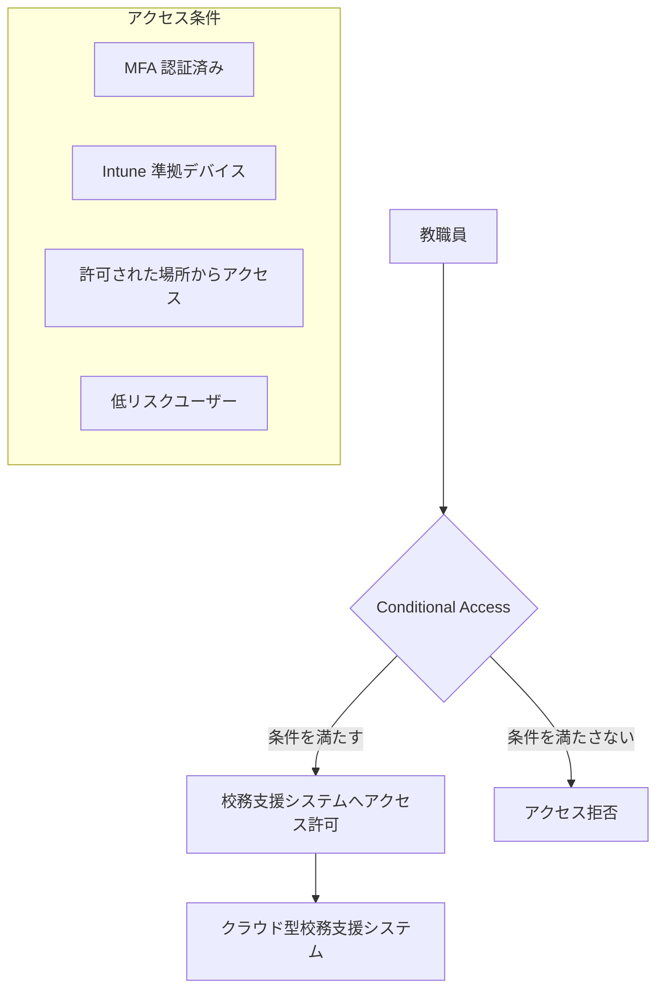
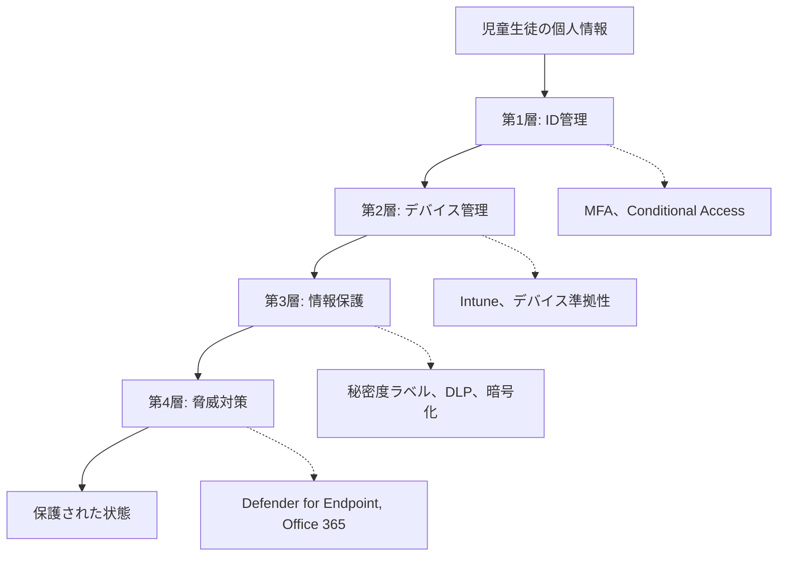

# この章で学ぶこと

この章では、児童生徒の個人情報を守り続けるための継続的改善と将来の展望について解説します。

:::message alert
⚠️ **重要**: ゼロトラストを導入することが目的ではありません。**児童生徒の個人情報漏洩を防ぎ、保護し続けることが真の目的**です。ゼロトラストは、その目的を達成するための手段に過ぎません。
:::

- GIGAスクール構想第2期と児童生徒の個人情報保護の関係を理解する
- 新しいテクノロジー（AI、ZTNA、パスワードレス認証）で個人情報保護を強化する
- 継続的改善計画（四半期レビュー、Secure Score 改善）で保護レベルを維持・向上する
- 個人情報保護は「導入して終わり」ではなく、継続的な取り組みであることを再認識する

**対象読者**: 教育委員会のICT担当者、情報政策担当者、教育長

# 21.1 教育DXとゼロトラストの進化

教育のデジタルトランスフォーメーション（DX）は、今後さらに加速していきます。DXの推進により、児童生徒の学習データ、成績データ、個人情報がますますデジタル化され、クラウド上で管理されるようになります。**これらの個人情報を漏洩から守りながら、教育DXを安全に推進することが私たちの使命です。**ゼロトラストは、そのための基盤となります。

## 21.1.1 GIGAスクール構想第2期とゼロトラスト

### GIGAスクール構想第2期の方向性

文部科学省は、GIGAスクール構想の第2期として、以下の方向性を示しています（2024年時点）。

**第2期の重点施策**:
- **1人1台端末の継続と更新**: 端末更新（リプレイス）の計画的実施
- **ネットワーク環境の高速化**: 校内無線LANの強化、インターネット回線の増強
- **デジタル教科書の本格導入**: 2024年度から段階的に導入
- **AI・データ活用の推進**: 学習データの活用、個別最適化された学習
- **教員のICT活用指導力向上**: 研修の充実、ICT支援員の配置

### ゼロトラストの役割

GIGAスクール構想第2期において、ゼロトラストは以下の役割を果たします。

**1. 端末更新時のセキュリティ確保**

端末更新（リプレイス）のタイミングで、ゼロトラストの原則を徹底します。

- **Intune による自動登録**: 新端末の初回起動時に自動的に Intune に登録
- **ゼロタッチ プロビジョニング**: ICT担当者の手動設定を最小化
- **セキュリティベースラインの適用**: 最新のセキュリティ設定を自動適用

**2. デジタル教科書のデータ保護**

デジタル教科書の普及に伴い、学習データの保護が重要になります。

- **秘密度ラベルの自動適用**: 学習データに「校務秘密」ラベルを自動付与
- **DLP による外部共有防止**: 学習データの外部流出を防止
- **暗号化の徹底**: 学習データの暗号化保存

**3. AI活用時のデータ保護**

生成AI（Copilot など）を活用する際、児童生徒の個人情報を保護します。

- **Microsoft 365 Copilot for Education**: 教育機関向けに最適化された生成AI
- **データ境界の設定**: 学習データが外部に送信されないように制御
- **監査ログの記録**: AI利用履歴をすべて記録

---

## 21.1.2 クラウド型校務支援システムの普及

### クラウド型校務支援システムとは

従来、校務支援システムはオンプレミス（学校内サーバー）で運用されていましたが、クラウド型校務支援システムへの移行が進んでいます。

**クラウド型のメリット**:
- **どこからでもアクセス**: 教職員が自宅からでも校務処理が可能
- **自動バックアップ**: データ消失リスクの低減
- **コスト削減**: サーバー保守費用の削減
- **最新機能の利用**: 常に最新版を利用可能

### ゼロトラストによる安全なクラウド移行

クラウド型校務支援システムへの移行時、ゼロトラストが安全性を担保します。

**1. Conditional Access によるアクセス制御**

**アクセス条件の例**:
- MFA 認証済みであること
- Intune に登録された準拠デバイスであること
- 勤務地または自宅からのアクセスであること（海外からのアクセスはブロック）
- サインインリスクが低いこと

**2. 秘密度ラベルによるデータ保護**

クラウド型校務支援システムで作成したファイルに、自動的に秘密度ラベルを適用します。

- **成績データ**: 「機密情報」ラベル → 暗号化、外部共有禁止
- **出席簿**: 「校務秘密」ラベル → 外部共有禁止
- **保護者連絡**: 「個人情報」ラベル → 閲覧制限

**3. DLP による外部流出防止**

クラウド型校務支援システムからダウンロードしたデータが、誤って外部に送信されることを防ぎます。

- メール添付: 成績データを外部メールアドレスに送信しようとすると警告
- Teams 共有: 成績データを外部ユーザーと共有しようとするとブロック
- OneDrive 共有: 成績データの外部共有リンク作成を禁止

---

## 21.1.3 AI活用とセキュリティ（生成AI利用時のデータ保護）

### Microsoft 365 Copilot for Education

Microsoft 365 Copilot for Education は、教育機関向けに最適化された生成AIです。

**主な機能**:
- **授業準備の支援**: 教材作成、テスト問題作成
- **事務作業の効率化**: 保護者向け文書作成、会議議事録要約
- **個別学習支援**: 児童生徒の質問に対する回答提案

### ゼロトラストによるAI利用時のデータ保護

生成AIを利用する際、児童生徒の個人情報が外部に漏洩しないように保護します。

**1. データ境界の設定**

Microsoft 365 Copilot for Education は、テナント内のデータのみを学習に使用し、外部に送信しません。

**設定項目**:
- **Microsoft 365 管理センター** → **設定** → **組織設定** → **サービス** → **Dynamics 365 Customer Voice**
- **オプション機能とテレメトリ** で、データ送信の範囲を制限

:::message
💡 **ヒント**: Microsoft 365 A5 for Education では、データが Microsoft のモデル学習に使用されることはありません。テナント内のデータのみを利用し、テナント外には送信されません。
:::

**2. 監査ログの記録**

Copilot の利用履歴をすべて記録し、不適切な利用がないか監視します。

**監査内容**:
- 誰が（教職員）
- いつ（日時）
- どのような質問をしたか（プロンプト）
- どのような回答を得たか（レスポンス）
- どのデータにアクセスしたか（参照ドキュメント）

**監査ログの確認手順**:

1. **Microsoft Purview コンプライアンス ポータル** → **監査**
2. フィルター設定:
   - **アクティビティ**: Copilot interaction
   - **ユーザー**: すべての教職員
   - **日付範囲**: 過去30日間
3. 不適切な利用（個人情報の大量取得など）がないか確認

**3. 秘密度ラベルとの連携**

Copilot が生成したドキュメントに、自動的に秘密度ラベルを適用します。

**例**:
- 成績データを含むドキュメント → 「機密情報」ラベル自動適用
- 保護者向け文書 → 「校務秘密」ラベル自動適用

---

## 21.1.4 デジタル教科書・EdTechとの連携

### デジタル教科書の本格導入

2024年度から、小学校5年生～中学校3年生を対象に、英語のデジタル教科書が本格導入されます。今後、他の教科にも拡大される見込みです。

### EdTech（教育テクノロジー）の普及

民間企業が提供する EdTech サービス（オンライン学習サービス、学習管理システムなど）の利用も増加しています。

### ゼロトラストによる安全なEdTech利用

EdTech サービスを安全に利用するための対策を実施します。

**1. Microsoft Defender for Cloud Apps による可視化**

教職員・児童生徒がどのクラウドサービスを利用しているか可視化します。

**確認手順**:

1. **Microsoft Defender ポータル** → **Cloud Apps** → **Cloud Discovery**
2. 利用されているクラウドサービスの一覧を確認
3. リスクの高いサービス（承認されていない EdTech サービス）を特定

**2. 承認済みアプリの管理**

教育委員会が承認した EdTech サービスのみ利用を許可します。

**設定手順**:

1. **Microsoft Defender ポータル** → **Cloud Apps** → **ポリシー** → **アプリの条件付きアクセス制御**
2. 承認済み EdTech サービスのリストを作成
3. 未承認サービスへのアクセスをブロック

**3. データ連携の制御**

EdTech サービスと Microsoft 365 のデータ連携を制御します。

- **Microsoft Entra ID** → **アプリの登録** で、EdTech サービスに付与する権限を最小限に制限
- 成績データ、個人情報へのアクセス権限は慎重に審査

---

# 21.2 新しいテクノロジーとトレンド

ゼロトラストを支える技術は、日々進化しています。今後注目すべきテクノロジーとトレンドを紹介します。

## 21.2.1 Microsoft Entra の進化

### Microsoft Entra とは

Microsoft Entra は、Microsoft の ID・アクセス管理製品群の総称です。従来の「Azure Active Directory (Azure AD)」から名称変更されました。

**Microsoft Entra ファミリー**:
- **Microsoft Entra ID**: ID管理・認証（旧 Azure AD）
- **Microsoft Entra ID Protection**: リスクベース認証
- **Microsoft Entra Permissions Management**: クラウドアクセス権限管理
- **Microsoft Entra Verified ID**: 分散型ID（ブロックチェーン技術）
- **Microsoft Entra Internet Access**: ゼロトラストネットワークアクセス（ZTNA）

### 注目の新機能

#### 1. Continuous Access Evaluation (CAE)

従来の Conditional Access は、サインイン時にのみアクセス条件を評価していましたが、**CAE（継続的アクセス評価）** は、セッション中も継続的に評価します。

**CAEの動作**:
- 教職員が自宅から MFA でサインイン → アクセス許可
- セッション中に、教職員のアカウントが侵害されたことを検知
- **即座にセッションを無効化**（再サインインを要求）

**メリット**:
- リアルタイムでのセキュリティ対応
- 侵害されたアカウントによる不正アクセスを最小化

**設定状況の確認**:

CAE は Microsoft 365 A5 に含まれており、主要なアプリケーション（Exchange Online、SharePoint Online、Teams）で自動的に有効化されています。

---

#### 2. Token Protection（トークン保護）

**Token Protection** は、認証トークンの盗難を防止する機能です。

**背景**:
- 攻撃者がマルウェアを使って、認証トークン（アクセストークン）を盗み出すことがあります
- 盗まれたトークンを使えば、MFA をバイパスしてアクセス可能

**Token Protection の動作**:
- 認証トークンを**ハードウェアにバインド**（デバイスに紐付け）
- トークンが別のデバイスで使用されることを防止

**設定手順**:

Token Protection は、Conditional Access ポリシーで有効化します。

1. **Microsoft Entra 管理センター** → **保護** → **条件付きアクセス**
2. ポリシーを選択 → **セッション** → **トークン保護を要求する**

:::message alert
⚠️ **注意**: Token Protection は、Windows 11 22H2 以降、および特定のブラウザ（Microsoft Edge）でのみサポートされています。
:::

---

## 21.2.2 AI/機械学習によるセキュリティ強化

### Microsoft Security Copilot

**Microsoft Security Copilot** は、AI を活用したセキュリティ分析・対応ツールです。

**主な機能**:
- **インシデント分析の自動化**: 複雑なインシデントを AI が分析し、要約を生成
- **対応手順の提案**: インシデントに対する推奨対応手順を提示
- **自然言語での調査**: 「過去30日間の高リスクサインインを表示」のような自然言語で調査可能

**教育委員会での活用例**:

セキュリティ担当者（ICT担当者）が、Security Copilot に質問します。

- **質問**: 「過去1週間で、管理者アカウントへの不審なアクセスはありますか？」
- **Security Copilot の回答**: 「3件の高リスクサインインが検出されました。すべて海外IPアドレスからのアクセスです。対象アカウント: admin@city-edu.jp」
- **質問**: 「このアカウントへの対応手順を教えてください」
- **Security Copilot の回答**: 「1. アカウントをブロック、2. パスワードをリセット、3. 全サインインセッションを無効化、4. 監査ログを確認」

**導入状況**:

Microsoft Security Copilot は、2024年時点で一般提供されており、Microsoft 365 A5 とは別ライセンスです。今後、教育機関向けプランが提供される可能性があります。

---

### Insider Risk Management の AI 強化

Insider Risk Management（内部不正検知）も、AI/機械学習により強化されています。

**AI による異常検知**:
- 通常の行動パターンを学習
- 異常な行動（大量ファイルダウンロード、勤務時間外のアクセス）を自動検知
- 誤検知（False Positive）を減らすため、継続的に学習

**教育委員会での活用例**:

ある教職員が、通常は1日に5ファイル程度をダウンロードしていますが、ある日突然500ファイルをダウンロードしました。

- **Insider Risk Management が検知**: 「教職員Aが異常な量のファイルをダウンロード」
- **アラート通知**: ICT担当者に通知
- **調査**: 教職員Aに確認 → 「転任準備のため、担当していた資料をまとめていた」→ 正当な理由と判明

---

## 21.2.3 ゼロトラストネットワークアクセス（ZTNA）

### ZTNA とは

**ZTNA（Zero Trust Network Access）** は、ゼロトラストの原則をネットワークアクセスに適用する技術です。

**従来のVPN との違い**:

| 比較項目 | 従来のVPN | ZTNA |
|---------|----------|------|
| アクセス範囲 | ネットワーク全体 | アプリケーション単位 |
| 認証タイミング | VPN接続時のみ | アプリアクセスごと |
| デバイス制御 | なし（VPN接続できればOK） | Intune 準拠デバイスのみ |
| ユーザー体験 | VPN接続操作が必要 | シームレス（意識不要） |

**ZTNAのメリット**:
- **最小特権アクセス**: 必要なアプリケーションのみアクセス許可
- **VPN不要**: 教職員がVPN接続操作をする必要がない
- **セキュリティ向上**: ネットワーク全体への侵入を防止

### Microsoft Entra Private Access（ZTNA）

Microsoft は、**Microsoft Entra Private Access** として ZTNA 機能を提供しています。

**主な機能**:
- オンプレミスアプリケーション（校務支援システムなど）への安全なアクセス
- VPN 不要でのリモートアクセス
- Conditional Access ポリシーとの統合

**教育委員会での活用例**:

オンプレミスの校務支援システムに、自宅からアクセスする場合：

**従来（VPN）**:
1. 教職員が自宅PCからVPN接続
2. ネットワーク全体にアクセス可能
3. セキュリティリスク: VPN接続後は、ネットワーク内のすべてのサーバーにアクセス可能

**ZTNA（Entra Private Access）**:
1. 教職員が自宅PCからブラウザで校務支援システムにアクセス
2. Entra Private Access が認証・認可（MFA、デバイス準拠性確認）
3. 校務支援システムのみアクセス許可（他のサーバーにはアクセス不可）

**導入状況**:

Microsoft Entra Private Access は、Microsoft 365 A5 とは別ライセンスです。今後の教育委員会での導入が期待されます。

---

## 21.2.4 パスワードレス認証のさらなる普及

### パスワードレス認証とは

**パスワードレス認証** は、パスワードを使わずに認証する方法です。

**パスワードレス認証の種類**:
- **Windows Hello for Business**: 顔認証、指紋認証、PIN
- **FIDO2 セキュリティキー**: USB キーなどの物理デバイス
- **Microsoft Authenticator アプリ**: スマートフォンアプリでの承認

### パスワードレス認証のメリット

**セキュリティ向上**:
- パスワード漏洩リスクがゼロ
- フィッシング攻撃に強い（パスワードを入力しないため）

**ユーザー体験向上**:
- パスワードを覚える必要がない
- パスワードリセット対応が不要

### 教育委員会でのパスワードレス認証導入

**第5章: Entra ID 基盤構築**で Windows Hello for Business の導入方法を解説しましたが、今後はさらに普及が進みます。

**段階的導入計画**:

**Phase 1: 管理職・ICT担当者（第1年度）**
- Windows Hello for Business（顔認証・指紋認証・PIN）を導入
- パイロットユーザーとしてフィードバック収集

**Phase 2: 全教職員（第2～3年度）**
- Windows Hello for Business を全教職員に展開
- Microsoft Authenticator アプリでのパスワードレスサインインも併用

**Phase 3: パスワード完全廃止（第4年度以降）**
- パスワードを完全に廃止
- すべての認証をパスワードレスに移行

:::message
💡 **ヒント**: パスワードレス認証は、教職員の利便性向上とセキュリティ強化を両立できる理想的な方法です。GIGAスクール構想第2期の端末更新時に、パスワードレス認証を標準設定として導入することを推奨します。
:::

---

# 21.3 継続的改善計画

**児童生徒の個人情報保護は「導入して終わり」ではありません。**サイバー攻撃の手法は日々進化し、新しい脅威が常に現れます。私たちは、継続的に保護レベルを改善し、児童生徒の個人情報を守り続ける必要があります。

## 21.3.1 四半期ごとのセキュリティレビュー

### レビューの目的

四半期（3ヶ月）ごとにセキュリティの状況をレビューし、**児童生徒の個人情報が適切に保護されているか**を確認します。保護レベルの低下や新しい脅威がないかを早期に発見し、改善点を特定します。

:::message
💡 **レビューの本質**: レビューの目的は、Secure Score を上げることではありません。**児童生徒の個人情報が実際に守られているか**を確認することです。スコアは、保護レベルを測る一つの指標に過ぎません。
:::

### レビュー項目

**1. Microsoft Secure Score の確認**

**手順**:

1. **Microsoft Defender ポータル** → **Secure Score**
2. 現在のスコアを確認（例: 78%）
3. 前回（3ヶ月前）のスコアと比較
4. スコアが低下している場合、原因を調査

**改善アクション**:
- Secure Score の **Recommended actions** で、優先度の高いアクションを確認
- 実施可能なアクションを選択し、次の四半期の目標に設定

---

**2. インシデント対応状況の確認**

**手順**:

1. **Microsoft Defender ポータル** → **インシデント**
2. 過去3ヶ月間のインシデント一覧を確認
3. 重大度ごとに集計（高・中・低）

**確認ポイント**:
- インシデント件数は増加していないか
- 対応時間（平均解決時間）は短縮されているか
- 再発防止策は機能しているか

**改善アクション**:
- 同種のインシデントが繰り返されている場合、ポリシーを見直し
- 対応時間が長い場合、自動対応（プレイブック）を検討

---

**3. Conditional Access ポリシーの見直し**

**手順**:

1. **Microsoft Entra 管理センター** → **保護** → **条件付きアクセス**
2. 各ポリシーのサインインログを確認
3. ブロック率が高すぎる場合、条件を緩和検討
4. ブロック率が低すぎる場合、条件を厳格化検討

**確認ポイント**:
- 正当なユーザーがブロックされていないか（False Positive）
- 不正なアクセスを見逃していないか（False Negative）

---

**4. DLP ポリシーの効果測定**

**手順**:

1. **Microsoft Purview コンプライアンス ポータル** → **データ損失防止** → **ポリシー**
2. 各ポリシーの一致件数を確認
3. 誤検知（False Positive）の件数を確認

**確認ポイント**:
- DLP ポリシーが機密情報の流出を防止しているか
- 誤検知により、教職員の業務が妨げられていないか

**改善アクション**:
- 誤検知が多い場合、DLP ルールを調整（除外条件の追加など）
- 検知漏れがある場合、DLP ルールを追加

---

### レビュー会議の運営

**参加者**:
- ICT担当者（主催）
- 情報政策担当者
- 教育委員会事務局

**頻度**: 四半期ごと（年4回）

**アジェンダ**:
1. Microsoft Secure Score の状況報告（10分）
2. インシデント対応状況の報告（15分）
3. Conditional Access・DLP の効果測定（15分）
4. 改善アクションの決定（10分）
5. 次回までのタスク確認（10分）

**議事録**:
- 改善アクションとその担当者を記録
- 次回レビュー時に進捗を確認

---

## 21.3.2 Microsoft Secure Score の定期確認と改善

### Secure Score の目標設定

**現状把握**:
- 導入直後（レベル1達成時）: 50%
- 1年後（レベル2達成時）: 70%
- 2年後（レベル3達成時）: 80%

**目標**:
- **3年後: 85% 以上**
- **5年後: 90% 以上**

### Secure Score 改善のロードマップ

**第1年度（レベル1）**:
- MFA 有効化: +15ポイント
- レガシー認証ブロック: +10ポイント
- Intune 登録（50%）: +10ポイント
- **合計: 50% 達成**

**第2年度（レベル2）**:
- Conditional Access 展開: +10ポイント
- DLP ポリシー展開: +5ポイント
- Defender for Endpoint 展開: +5ポイント
- **合計: 70% 達成**

**第3年度（レベル3）**:
- PIM 有効化: +5ポイント
- Insider Risk Management: +3ポイント
- Microsoft Sentinel: +2ポイント
- **合計: 80% 達成**

**第4年度以降（継続改善）**:
- パスワードレス認証: +3ポイント
- CAE（継続的アクセス評価）: +2ポイント
- **合計: 85% 以上達成**

---

## 21.3.3 新機能の評価と導入検討

Microsoft 365 は、毎月新機能がリリースされます。新機能を評価し、導入を検討するプロセスを確立します。

### 新機能情報の収集

**情報源**:
- **Microsoft 365 ロードマップ**: https://www.microsoft.com/microsoft-365/roadmap
- **Microsoft 365 管理センター** → **正常性** → **メッセージセンター**
- **Microsoft Tech Community**: https://techcommunity.microsoft.com/

**確認頻度**: 月1回

---

### 新機能の評価プロセス

**Step 1: 新機能の概要把握**

メッセージセンターで新機能の通知を受け取ったら、概要を把握します。

**確認項目**:
- 機能の内容
- 対象製品（Entra ID、Intune、Defender など）
- 提供開始時期
- 自動有効化 or 手動有効化

---

**Step 2: 教育委員会での有用性評価**

新機能が教育委員会で有用かどうか評価します。

**評価基準**:
- **セキュリティ向上**: セキュリティが向上するか
- **業務効率化**: 教職員の業務が効率化されるか
- **コスト**: 追加費用が発生するか
- **導入難易度**: 導入に必要な工数・スキル

**評価シート例**:

| 評価項目 | 評価（5段階） | コメント |
|---------|--------------|---------|
| セキュリティ向上 | ★★★★☆ | フィッシング対策が強化される |
| 業務効率化 | ★★☆☆☆ | 教職員の負担はあまり変わらない |
| コスト | ★★★★★ | 追加費用なし（A5 に含まれる） |
| 導入難易度 | ★★★☆☆ | ポリシー設定が必要だが、難しくない |
| **総合評価** | **導入推奨** | 次回の四半期レビューで導入を検討 |

---

**Step 3: パイロット導入**

評価結果が良好な場合、パイロット導入を実施します。

**パイロット対象**:
- ICT担当者（5名）
- 協力的な教職員（10名）

**パイロット期間**: 1～2ヶ月

**フィードバック収集**:
- 使いやすさ
- 問題点・課題
- 全校展開の可否

---

**Step 4: 全校展開**

パイロット結果が良好な場合、全校展開します。

**展開手順**:
1. 教職員向け説明資料の作成
2. 教職員研修の実施
3. ヘルプデスク体制の整備
4. 段階的ロールアウト（学校単位）

---

## 21.3.4 教職員フィードバックの収集と改善

ゼロトラストの導入・運用において、教職員の意見を聞くことが重要です。

### フィードバック収集方法

**1. アンケート調査（年2回）**

**実施時期**: 夏季休業前、年度末

**質問項目**:
- MFA は使いやすいですか？
- Intune に登録されたデバイスは正常に動作していますか？
- セキュリティ対策により、業務に支障が出ていますか？
- 改善してほしい点はありますか？（自由記述）

**回答方法**: Microsoft Forms

---

**2. ヘルプデスクへの問い合わせ分析**

ヘルプデスクへの問い合わせ内容を分析し、よくある課題を特定します。

**分析項目**:
- 問い合わせ件数（月別）
- 問い合わせ内容の分類（MFA、Intune、メール、その他）
- 解決までの時間

**改善例**:
- MFA に関する問い合わせが多い → 説明動画を作成し、ポータルサイトで公開
- Intune 登録に関する問い合わせが多い → 登録手順書を改善

---

**3. 教職員代表との意見交換会（年1回）**

**参加者**:
- 各校の教職員代表（10～15名）
- ICT担当者
- 情報政策担当者

**議題**:
- ゼロトラスト導入後の感想
- 困っていること、改善してほしいこと
- 新機能のニーズ

---

### フィードバックに基づく改善例

**フィードバック**: 「MFA の認証が面倒。毎回スマートフォンを取り出すのが大変」

**改善策**:
- Windows Hello for Business（顔認証・PIN）の導入を推進
- 信頼されたデバイスでは MFA の頻度を低減（CAE により、リスクが低い場合は認証頻度を減らす）

---

**フィードバック**: 「秘密度ラベルの使い分けがわからない」

**改善策**:
- 秘密度ラベルの自動適用を拡大
- わかりやすい利用ガイドを作成

---

## 21.3.5 セキュリティ投資計画（中長期）

ゼロトラスト導入後も、継続的な投資が必要です。

### 中長期投資計画（5年間）

**第1～3年度**: ゼロトラスト基盤の構築（第20章で解説済み）

**第4～5年度**: 継続的改善と新技術の導入

| 年度 | 投資項目 | 想定費用（中規模教育委員会） |
|------|---------|---------------------------|
| **第4年度** | | |
| | ライセンス費用（M365 A5） | 967万円 |
| | Microsoft Sentinel 運用 | 240万円 |
| | 運用支援費用 | 250万円 |
| | 端末更新（GIGAスクール第2期） | 5,000万円 |
| | パスワードレス認証展開 | 100万円 |
| | **年度合計** | **6,557万円** |
| **第5年度** | | |
| | ライセンス費用（M365 A5） | 967万円 |
| | Microsoft Sentinel 運用 | 240万円 |
| | 運用支援費用 | 250万円 |
| | ZTNA 導入検討 | 500万円 |
| | Security Copilot 導入検討 | 300万円 |
| | **年度合計** | **2,257万円** |

:::message
💡 **ヒント**: 第4年度の端末更新（GIGAスクール第2期）は、国の補助金を活用できる可能性があります。文部科学省の最新情報を確認してください。
:::

---

# 21.4 まとめ：児童生徒の個人情報保護は継続的な取り組み

## 21.4.1 ゼロトラスト実装の振り返り

この書籍では、**児童生徒の個人情報を守るため**に、教育委員会がゼロトラストを実装する具体的な方法を解説してきました。

:::message alert
⚠️ **再確認**: ゼロトラストの導入は、手段であって目的ではありません。私たちの真の目的は、**児童生徒の個人情報漏洩を防ぎ、保護し続けること**です。技術的な対策を導入することに満足せず、常に「児童生徒の個人情報は本当に守られているか？」を自問し続けることが重要です。
:::

**振り返り**:

**第1～4章**: ゼロトラストの基礎理解
- なぜゼロトラストが必要なのか
- ゼロトラストの基本原則
- Microsoft 365 A5 で実現できること

**第5～7章**: ID管理（第1の柱）
- Entra ID 基盤構築
- Conditional Access によるアクセス制御
- PIM による特権管理

**第8～9章**: デバイス管理（第2の柱）
- Intune によるデバイス管理
- Defender for Endpoint による脅威対策

**第10～12章**: 情報保護（第3の柱）
- 秘密度ラベルとDLP
- Insider Risk Management

**第13～16章**: 脅威対策（第4の柱）
- Copilot for Security
- Defender for Office 365
- Defender for Cloud Apps
- Microsoft Defender ポータル

**第17～19章**: ガバナンスと運用
- セキュリティガバナンス
- 監視とインシデント対応
- Microsoft Sentinel による SIEM

**第20～21章**: 導入計画と将来展望
- 段階的導入ロードマップ
- 予算計画とROI
- 将来の展望と継続的改善

---

## 21.4.2 技術だけでなく組織文化の変革

児童生徒の個人情報保護は、技術的な対策だけでは実現できません。**組織文化の変革**が必要です。

### 「児童生徒の個人情報を守る」という共通目的

**全教職員が共有すべき価値観**:
- 児童生徒の個人情報保護は、教育委員会の最優先事項である
- 個人情報漏洩は、児童生徒や保護者に取り返しのつかない被害を与える
- 個人情報保護は、ICT担当者だけでなく、全教職員の責任である

### 「信頼しない、常に検証する」という文化

従来の考え方:
- 「校内ネットワークは安全だから、校内からのアクセスは信頼する」
- 「教職員は信頼できるから、アクセス制限は不要」

ゼロトラストの考え方:
- 「校内ネットワークでも、常に検証する」
- 「教職員でも、リスクベースでアクセス制御する」

**なぜこの考え方が必要か**:
- 攻撃者が校内ネットワークに侵入した場合でも、個人情報を守るため
- 教職員のアカウントが侵害された場合でも、被害を最小限に抑えるため
- **最終目的は、どんな状況でも児童生徒の個人情報を守ること**

### 「セキュリティは全員の責任」という意識

セキュリティは、ICT担当者だけの責任ではありません。**教職員全員の責任**です。

**教職員に求められる行動**:
- MFA を適切に利用する
- 秘密度ラベルを正しく付与する
- 不審なメールを開かない
- フィッシングメールを報告する
- デバイスを安全に管理する

**組織文化の醸成方法**:
- 定期的なセキュリティ研修（年2回）
- セキュリティ通信の発行（月1回）
- フィッシングメール訓練（年2回）
- セキュリティ意識調査（年1回）

---

## 21.4.3 教育長・校長のリーダーシップ

児童生徒の個人情報保護には、**教育長・校長のリーダーシップ**が不可欠です。

### 教育長の役割

**1. 児童生徒の個人情報保護の重要性を発信**

教育長が、教育委員会全体に向けて児童生徒の個人情報保護の重要性を発信します。

**メッセージ例**:
> 「私たちは、児童生徒の成績、健康情報、家庭環境など、極めて機密性の高い個人情報を預かっています。これらの情報が漏洩すれば、児童生徒や保護者に取り返しのつかない被害を与えます。個人情報保護は、教育委員会の最優先事項です。全教職員が一丸となって取り組みましょう。」

**発信の場**:
- 教育委員会会議での説明
- 校長会での説明
- 教職員向けメッセージの発信

**2. 予算確保**

児童生徒の個人情報保護に必要な予算を確保します。

**議会・首長への説明のポイント**:
- **目的**: ゼロトラスト導入が目的ではなく、児童生徒の個人情報漏洩を防ぐことが目的
- **リスク**: 個人情報漏洩時の損失（3,000万円～1億円）と信用失墜
- **投資**: 第20章で解説した予算計画（3年間で約4,830万円）
- **ROI**: 3年間で投資回収完了（ROI +157.8%）

**3. 組織体制の整備**

ICT担当者の増員、ヘルプデスク体制の整備など、組織体制を整えます。

---

### 校長の役割

**1. 学校での個人情報保護推進**

各学校で、児童生徒の個人情報保護を推進します。

**職員会議でのメッセージ例**:
> 「本校では、○○名の児童生徒の個人情報を管理しています。これらの情報を守ることは、私たち全員の責任です。MFAの利用、秘密度ラベルの付与など、一つひとつの対策が、子どもたちを守ることにつながります。」

**具体的な取り組み**:
- 職員会議でのセキュリティ意識啓発（個人情報保護の重要性）
- 教職員へのMFA利用促進
- デバイス管理の徹底
- 個人情報の取り扱いルールの周知

**2. 教職員のサポート**

教職員がセキュリティ対策で困っている場合、サポートします。

**例**:
- MFA の使い方がわからない教職員への個別支援
- ヘルプデスクへの連絡支援
- 秘密度ラベルの使い方の説明

---

## 21.4.4 教職員全員の協力

児童生徒の個人情報保護は、**教職員全員の協力**があってこそ実現できます。

### 教職員に期待すること

**1. 「子どもたちの個人情報を守る」という意識**

一つひとつのセキュリティ対策は、児童生徒を守るためのものです。

- **MFA を必ず利用する** → 不正アクセスから個人情報を守る
- **秘密度ラベルを正しく付与する** → 機密情報の流出を防ぐ
- **不審なメールを開かない** → マルウェア感染から個人情報を守る

**2. セキュリティポリシーの遵守**

- MFA を必ず利用する
- 秘密度ラベルを正しく付与する
- 不審なメールを開かない
- パスワードを他人に教えない
- 個人情報を含むファイルを適切に管理する

**3. フィードバックの提供**

- 使いにくい点、改善してほしい点をICT担当者に伝える
- アンケートに協力する
- セキュリティ上の懸念があれば、すぐに報告する

**4. 継続的な学習**

- セキュリティ研修に参加する
- 新機能の使い方を学ぶ
- フィッシングメール訓練に真剣に取り組む

### ICT担当者の役割

**1. 教職員のサポート**

- わかりやすい説明資料の作成
- ヘルプデスク対応
- 研修の実施

**2. 継続的な改善**

- 教職員のフィードバックに基づく改善
- 新機能の評価と導入

---

## 21.4.5 児童生徒の個人情報を守り続けるために

ゼロトラストの最終目的は、**児童生徒の個人情報を守り続けること**です。

### 個人情報保護の重要性

児童生徒の個人情報には、以下のような極めて機密性の高い情報が含まれます。

- 氏名、住所、生年月日
- 成績、出席状況
- 健康情報（既往症、アレルギーなど）
- 家庭環境（保護者の職業、収入、家族構成など）
- いじめ・不登校に関する情報

これらの情報が漏洩すれば、児童生徒や保護者に取り返しのつかない被害を与えます。

### ゼロトラストによる保護

ゼロトラストは、児童生徒の個人情報を多層的に保護します。

**第1層: ID管理**
- MFA により、不正アクセスを防止

**第2層: デバイス管理**
- Intune により、安全なデバイスからのみアクセス許可

**第3層: 情報保護**
- 秘密度ラベル、DLP により、情報流出を防止

**第4層: 脅威対策**
- Defender により、マルウェア・フィッシングを防止

---

### 継続的な保護

ゼロトラストは「導入して終わり」ではありません。

- **四半期ごとのセキュリティレビュー**で、保護状態を確認
- **新しい脅威への対応**（フィッシング手法の進化など）
- **新技術の導入**（AI、ZTNA など）

**児童生徒の個人情報を守り続けるために、継続的な取り組みを続けましょう。**

