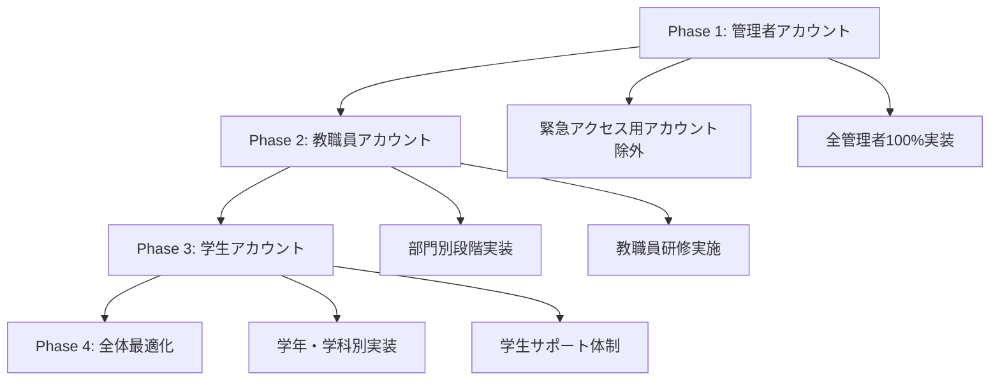
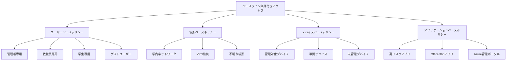
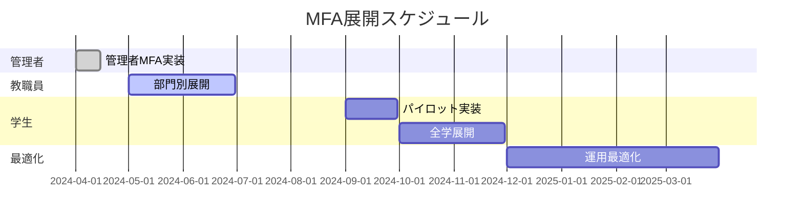
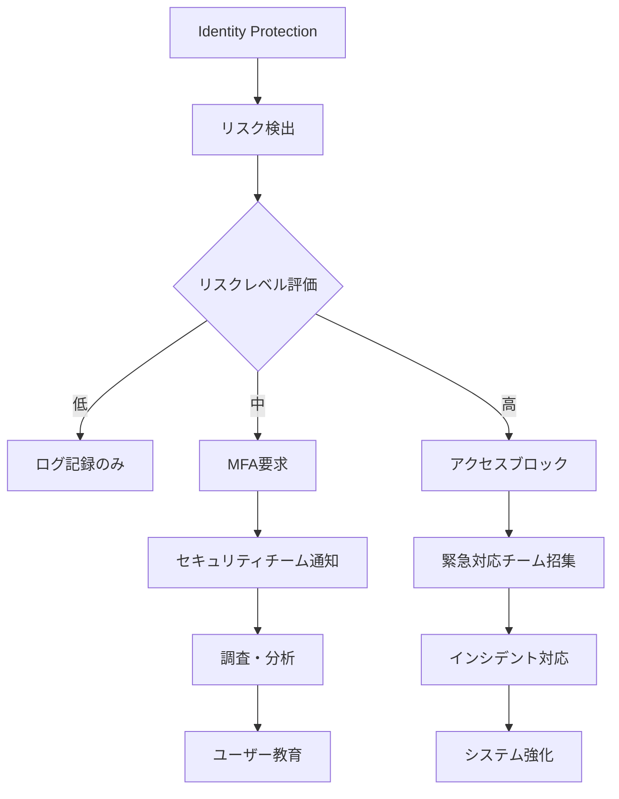
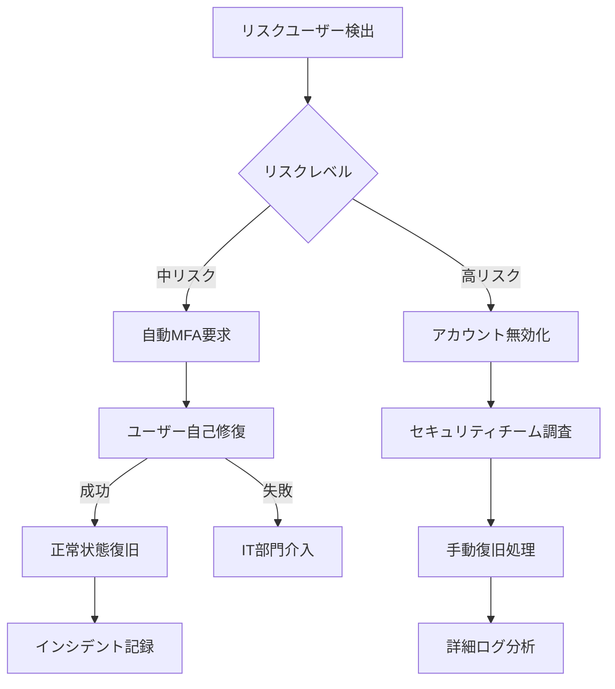
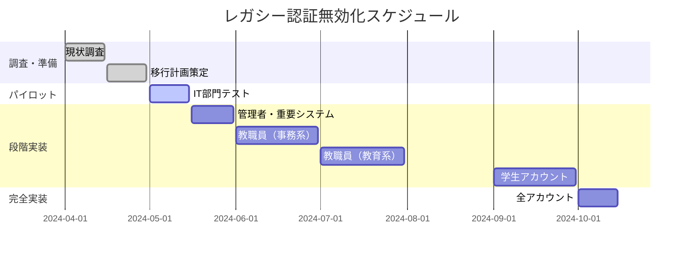
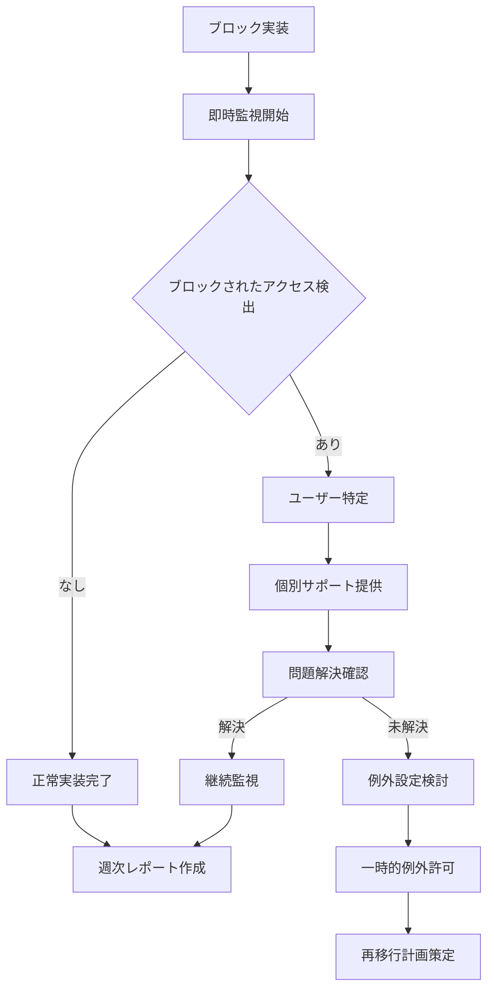

# 2.1 開始ポイントレベルアイデンティティポリシー実装

Zero Trust Architecture実装の最初のフェーズでは、アイデンティティセキュリティの基盤を構築します。この段階は「Starting Point」と位置づけられ、すべての教育機関で必須の基本的なセキュリティ機能を実装します。

## 2.1.1 基本的なMFA・条件付きアクセス設定

### 2.1.1.1 Multi-Factor Authentication（MFA）の段階的展開

教育機関でのMFA実装は、利用者への影響を最小限に抑えながら段階的に展開することが重要です。

**MFA展開の基本戦略**

Microsoft 365 A3環境でのMFA実装には、以下のアプローチを推奨します。



**Phase 1: 管理者アカウントのMFA実装**

最優先で管理者アカウントのMFA を100% 実装します。以下の手順で実施します。

1. **緊急アクセス用アカウントの準備**
   ```powershell
   # 緊急アクセス用アカウントの作成と設定
   # Microsoft Entra管理センターで実施
   # 強固なパスワード + 物理的に安全な場所での管理
   ```

2. **管理者向けMFA有効化**
   
   Microsoft Learn推奨手順に基づく実装：
   
   **ステップ1: Microsoft Entra管理センターにアクセス**
   - [Microsoft Entra管理センター](https://entra.microsoft.com) にGlobal Administrator権限でサインイン
   - **Entra ID** > **条件付きアクセス** > **ポリシー** に移動
   
   **ステップ2: 新しいポリシーの作成**
   - 「新しいポリシー」を選択
   - ポリシー名: 「CA001-管理者MFA必須ポリシー」
   
   **ステップ3: 対象ユーザーの設定**
   - **割り当て** > **ユーザーまたはワークロード ID**
   - **含める** > **ディレクトリ ロール**を選択
   - 以下の管理者ロールを最低限選択：
     - Global Administrator
     - Security Administrator
     - Conditional Access Administrator
     - Privileged Role Administrator
   - **除外** > **ユーザーとグループ** で緊急アクセス用アカウントを除外
   
   **ステップ4: アプリケーションの設定**
   - **対象リソース** > **リソース（旧称：クラウド アプリ）**
   - **含める** > **リソースを選択** > **Microsoft 管理ポータル** を選択
   
   **ステップ5: アクセス制御の設定**
   - **アクセス制御** > **許可**
   - **アクセス権の付与**を選択
   - **多要素認証を要求**にチェック
   - **選択**をクリック

   **ステップ6: ポリシーの有効化**
   - **ポリシーを有効にする**を**レポート専用**に設定
   - **作成**をクリックして保存
   - テスト完了後、**オン**に変更
   
   **Microsoft Learn準拠の管理者保護ポリシー設定例**
   ```json
   {
     "DisplayName": "CA001-管理者MFA必須ポリシー",
     "State": "enabledForReportingButNotEnforced",
     "Conditions": {
       "Users": {
         "IncludeRoles": [
           "62e90394-69f5-4237-9190-012177145e10", // Global Administrator
           "194ae4cb-b126-40b2-bd5b-6091b380977d", // Security Administrator
           "b1be1c3e-b65d-4f19-8427-f6fa0d97feb9", // Conditional Access Administrator
           "e8611ab8-c189-46e8-94e1-60213ab1f814"  // Privileged Role Administrator
         ],
         "ExcludeUsers": ["緊急アクセス用アカウントID"]
       },
       "Applications": {
         "IncludeApplications": ["0000000c-0000-0000-c000-000000000000"] // Microsoft Admin Portals
       }
     },
     "GrantControls": {
       "BuiltInControls": ["mfa"],
       "Operator": "OR"
     }
   }
   ```

**Phase 2: 教職員アカウントの段階的実装**

教職員に対しては、業務への影響を最小化しながら段階的に実装します。

1. **部門別展開計画**
   - Week 1-2: IT部門・情報システム管理担当者
   - Week 3-4: 事務系部門（総務、経理、学務等）
   - Week 5-6: 教育系部門（各学科・学年主任等）
   - Week 7-8: 全教職員

2. **教職員向けMFA設定**
   
   Microsoft Learn準拠のPowerShell実装手順：
   
   ```powershell
   # Microsoft Graph PowerShell モジュールの確認・インストール
   if (!(Get-Module -ListAvailable -Name Microsoft.Graph.Authentication)) {
       Install-Module Microsoft.Graph.Authentication -Force -AllowClobber
   }
   
   # Microsoft Graph接続（必要な権限スコープを指定）
   Connect-MgGraph -Scopes "Policy.ReadWrite.ConditionalAccess", "Group.Read.All", "Directory.Read.All"
   
   # 接続確認
   Get-MgContext
   
   # 教職員グループの確認（事前に作成されている前提）
   $facultyGroup = Get-MgGroup -Filter "displayName eq '教職員'"
   if (-not $facultyGroup) {
       Write-Error "教職員グループが見つかりません。事前にグループを作成してください。"
       return
   }
   
   Write-Host "対象グループ: $($facultyGroup.DisplayName) (ID: $($facultyGroup.Id))"
   
   # 条件付きアクセスポリシー作成（Microsoft Learn推奨形式）
   $policyParams = @{
       DisplayName = "CA002-教職員MFA必須ポリシー"
       State = "enabledForReportingButNotEnforced"  # 初期はレポート専用
       Conditions = @{
           Users = @{
               IncludeGroups = @($facultyGroup.Id)
               ExcludeUsers = @("緊急アクセス用アカウントID")
           }
           Applications = @{
               IncludeApplications = @("All")
               ExcludeApplications = @() # 必要に応じて除外アプリを指定
           }
           Locations = @{
               IncludeLocations = @("All")
               ExcludeLocations = @() # 必要に応じて信頼できる場所を除外
           }
       }
       GrantControls = @{
           BuiltInControls = @("mfa")
           Operator = "OR"
       }
   }
   
   # ポリシーの作成
   try {
       $newPolicy = New-MgIdentityConditionalAccessPolicy -BodyParameter $policyParams
       Write-Host "ポリシーが正常に作成されました" -ForegroundColor Green
       Write-Host "ポリシーID: $($newPolicy.Id)"
       Write-Host "ポリシー名: $($newPolicy.DisplayName)"
       Write-Host "状態: $($newPolicy.State)"
   }
   catch {
       Write-Error "ポリシー作成中にエラーが発生しました: $($_.Exception.Message)"
   }
   
   # 作成されたポリシーの確認
   Get-MgIdentityConditionalAccessPolicy -Filter "displayName eq 'CA002-教職員MFA必須ポリシー'"
   ```
   
   **実装後の確認手順**
   ```powershell
   # ポリシーの動作確認
   $createdPolicy = Get-MgIdentityConditionalAccessPolicy -Filter "displayName eq 'CA002-教職員MFA必須ポリシー'"
   
   if ($createdPolicy) {
       Write-Host "=== ポリシー確認結果 ===" -ForegroundColor Cyan
       Write-Host "名前: $($createdPolicy.DisplayName)"
       Write-Host "状態: $($createdPolicy.State)"
       Write-Host "対象グループ数: $($createdPolicy.Conditions.Users.IncludeGroups.Count)"
       Write-Host "作成日時: $($createdPolicy.CreatedDateTime)"
   }
   
   # 接続を切断
   Disconnect-MgGraph
   ```

**Phase 3: 学生アカウントの実装**

学生アカウントのMFA実装は、教育活動への影響を考慮して慎重に進めます。

1. **学生向け事前準備**
   - 学生用MFAガイド資料の作成
   - 情報リテラシー教育でのMFA説明
   - サポートデスクの体制強化

2. **段階的展開**
   - パイロット実装: 情報系学科の学生
   - 学年別展開: 新入生から上級生へ
   - 最終展開: 全学生アカウント

3. **学生サポート体制**
   ```mermaid
   graph LR
       A[学生] --> B[1次サポート: 学生サポート係]
       B --> C[2次サポート: IT部門]
       C --> D[3次サポート: Microsoft サポート]
       
       B1[FAQ・自習資料]
       B2[対面サポート]
       B --> B1
       B --> B2
   ```

**MFA認証方法の推奨順位**

教育機関での利用を考慮した認証方法の推奨順位：

| 順位 | 認証方法 | 教職員 | 学生 | 特記事項 |
|------|----------|--------|------|----------|
| 1 | Microsoft Authenticator | ◎ | ◎ | プッシュ通知とワンタイムパスワード対応 |
| 2 | SMS | △ | ◎ | 学生の主要認証方法、コスト考慮要 |
| 3 | 音声通話 | ◎ | △ | 教職員の緊急時利用 |
| 4 | FIDO2セキュリティキー | ◎ | × | 管理者・重要職員向け |

### 2.1.1.2 条件付きアクセスポリシーのベースライン設定

教育機関向けの条件付きアクセスポリシーベースラインを構築します。

**ベースラインポリシー体系**



**1. 管理者保護ポリシー**

```json
{
  "PolicyName": "CA001-管理者基本保護",
  "Description": "全管理者に対する基本保護",
  "State": "enabled",
  "Conditions": {
    "Users": {
      "IncludeRoles": [
        "Global Administrator",
        "Privileged Role Administrator", 
        "Security Administrator"
      ],
      "ExcludeUsers": ["緊急アクセス用アカウント"]
    },
    "Applications": {
      "IncludeApplications": ["All"]
    }
  },
  "Controls": {
    "Grant": ["RequireMFA", "RequireCompliantDevice"],
    "Session": {
      "SignInFrequency": "1",
      "SignInFrequencyType": "Hours"
    }
  }
}
```

**2. 場所ベースアクセス制御**

```json
{
  "PolicyName": "CA002-場所ベースアクセス制御",
  "Description": "不明な場所からのアクセスに追加認証要求",
  "State": "enabled", 
  "Conditions": {
    "Users": {
      "IncludeUsers": ["All"],
      "ExcludeUsers": ["緊急アクセス用アカウント"]
    },
    "Locations": {
      "Include": ["Any location"],
      "Exclude": ["信頼できる場所"]
    }
  },
  "Controls": {
    "Grant": ["RequireMFA"]
  }
}
```

**信頼できる場所の定義**

教育機関での信頼できる場所設定：

```powershell
# 信頼できる場所の設定
$trustedLocations = @(
    @{
        Name = "メインキャンパス"
        IPRanges = @("192.168.1.0/24", "192.168.2.0/24")
        CountriesAndRegions = @()
        IncludeUnknownCountriesAndRegions = $false
    },
    @{
        Name = "サテライトキャンパス"
        IPRanges = @("10.0.1.0/24")
        CountriesAndRegions = @()
        IncludeUnknownCountriesAndRegions = $false
    }
)

foreach ($location in $trustedLocations) {
    New-MgConditionalAccessNamedLocation -BodyParameter $location
}
```

**3. アプリケーション保護ポリシー**

```json
{
  "PolicyName": "CA003-高リスクアプリ保護",
  "Description": "Azure管理ポータル等への高リスクアクセス制御",
  "State": "enabled",
  "Conditions": {
    "Users": {
      "IncludeUsers": ["All"]
    },
    "Applications": {
      "IncludeApplications": [
        "Microsoft Azure Management",
        "Microsoft 365 Admin Center"
      ]
    }
  },
  "Controls": {
    "Grant": ["RequireMFA", "RequireCompliantDevice"],
    "Session": {
      "SignInFrequency": "4",
      "SignInFrequencyType": "Hours"
    }
  }
}
```

**ベースライン実装チェックリスト**

- [ ] 緊急アクセス用アカウントの作成・テスト完了
- [ ] 管理者MFAポリシー有効化・テスト完了
- [ ] 信頼できる場所の定義・設定完了
- [ ] 教職員向けMFAポリシー段階実装開始
- [ ] 学生向けMFA準備（資料・サポート体制）完了
- [ ] ベースラインポリシーのレポート・監視設定
- [ ] インシデント対応プロセスへの組み込み

### 2.1.1.3 教育機関特有の考慮事項

**学事スケジュールとの調整**



**BYOD対応とデバイス多様性**

教育機関特有のデバイス環境への対応：

1. **多様なデバイス種類**
   - 学生所有スマートフォン（iOS/Android）
   - GIGA スクール構想端末（Windows/Chrome OS）
   - 教職員用PC（Windows/macOS）
   - 共用端末（図書館・PC教室等）

2. **デバイス制約への対応**
   ```json
   {
     "PolicyName": "学生BYOD対応ポリシー",
     "Conditions": {
       "Users": {"IncludeGroups": ["学生"]},
       "Platforms": {
         "IncludePlatforms": ["iOS", "Android", "Windows", "macOS"]
       }
     },
     "Controls": {
       "Grant": ["RequireMFA"],
       "Session": {
         "ApplicationEnforcedRestrictions": true
       }
     }
   }
   ```

**コスト最適化**

A3ライセンスでのコスト効率的なMFA実装：

| 認証方法 | コスト | 対象ユーザー | 備考 |
|----------|--------|--------------|------|
| Microsoft Authenticator | 無料 | 全ユーザー | 推奨方法 |
| SMS | 有料（従量課金） | 学生中心 | 月間使用量監視要 |
| 音声通話 | 有料（従量課金） | 教職員のみ | 緊急時用途 |
| ハードウェアトークン | 初期費用 | 管理者のみ | 高セキュリティ要求 |

## 2.1.2 サインインリスクベース認証

Microsoft Entra ID Identity Protection を活用したリスクベース認証の実装を行います。A3ライセンスでは基本的なリスク検出機能が利用可能です。

### 2.1.2.1 リスクレベルの定義と対応アクション

**Identity Protection で検出可能なリスク（A3ライセンス）**

| リスクの種類 | リスクレベル | 検出内容 | 推奨アクション |
|--------------|--------------|----------|----------------|
| 匿名IPアドレス | 中 | Torネットワーク等からのアクセス | MFA要求 |
| 非定型な移動 | 中 | 地理的に不可能な移動パターン | MFA要求・調査 |
| マルウェアリンクIPアドレス | 高 | 既知の悪意あるIPからのアクセス | アクセスブロック |
| 漏洩資格情報 | 高 | パスワードスプレー攻撃の検出 | パスワード変更要求 |

**リスクベース条件付きアクセスポリシーの設定**

```json
{
  "PolicyName": "CA010-サインインリスクベース認証",
  "Description": "リスク検出時の自動対応",
  "State": "enabled",
  "Conditions": {
    "Users": {
      "IncludeUsers": ["All"],
      "ExcludeUsers": ["緊急アクセス用アカウント"]
    },
    "SignInRiskLevels": ["medium", "high"],
    "Applications": {
      "IncludeApplications": ["All"]
    }
  },
  "Controls": {
    "Grant": ["RequireMFA"]
  }
}
```

**教育機関特有のリスク評価調整**

1. **学生の移動パターン考慮**
   - 夏休み期間の帰省による地理的移動
   - 海外研修・留学プログラム
   - インターンシップ期間中のアクセス

2. **共用端末でのリスク軽減**
   ```json
   {
     "PolicyName": "CA011-共用端末リスク制御",
     "Conditions": {
       "Locations": {
         "Include": ["図書館IP範囲", "PC教室IP範囲"]
       }
     },
     "Controls": {
       "Grant": ["RequireMFA"],
       "Session": {
         "SignInFrequency": "1",
         "SignInFrequencyType": "Hours"
       }
     }
   }
   ```

### 2.1.2.2 異常検知とアラート設定

**リスクイベントの監視体制構築**



**自動アラート設定**

PowerShellを使用したアラート設定例：

```powershell
# Microsoft Graph接続
Connect-MgGraph -Scopes "IdentityRiskyUser.ReadWrite.All"

# 高リスクユーザーの自動検出・通知設定
$alertConfig = @{
    DisplayName = "高リスクユーザー検出アラート"
    Description = "Identity Protection高リスクユーザー検出時の自動通知"
    Severity = "High"
    Targets = @{
        AlertRecipients = @("security-team@school.edu")
    }
    Conditions = @{
        RiskLevel = "High"
        UserRiskLevel = "High"
    }
}

# Logic Apps経由での通知設定（例）
```

**教育機関向けリスク監視ダッシュボード**

Microsoft 365 Defenderポータルでの監視項目：

1. **日次監視項目**
   - [ ] 新規リスクユーザー数
   - [ ] 高リスクサインイン件数
   - [ ] MFA成功率
   - [ ] ブロックされたサインイン数

2. **週次レビュー項目**
   - [ ] リスクユーザーの傾向分析
   - [ ] 地理的アクセスパターンの変化
   - [ ] デバイス種別別リスク状況
   - [ ] 学科・部門別リスク分布

**リスクユーザー自動修復フロー**



## 2.1.3 レガシー認証のブロック

教育機関でのレガシー認証を安全に無効化し、モダン認証への移行を完了します。

### 2.1.3.1 レガシー認証の特定と段階的無効化

**レガシー認証の調査と影響範囲特定**

```powershell
# Microsoft Learn推奨手順によるレガシー認証使用状況の調査

# 必要なモジュールの確認・インストール
if (!(Get-Module -ListAvailable -Name Microsoft.Graph.Reports)) {
    Install-Module Microsoft.Graph.Reports -Force -AllowClobber
}

# Microsoft Graph接続（必要な権限スコープを指定）
Connect-MgGraph -Scopes "AuditLog.Read.All", "Reports.Read.All", "Directory.Read.All"

Write-Host "=== レガシー認証使用状況調査 ===" -ForegroundColor Cyan

# 過去30日間のレガシー認証使用状況取得
$startDate = (Get-Date).AddDays(-30).ToString("yyyy-MM-dd")
$endDate = (Get-Date).ToString("yyyy-MM-dd")

Write-Host "調査期間: $startDate ～ $endDate"

# Microsoft Learn推奨のフィルタ形式でレガシー認証を検索
$legacyAuthFilter = "createdDateTime ge $startDate and createdDateTime le $endDate and (clientAppUsed eq 'Exchange ActiveSync' or clientAppUsed eq 'Other clients' or clientAppUsed eq 'IMAP4' or clientAppUsed eq 'POP3' or clientAppUsed eq 'SMTP AUTH')"

try {
    $legacyAuth = Get-MgAuditLogSignIn -Filter $legacyAuthFilter -All
    
    if ($legacyAuth.Count -eq 0) {
        Write-Host "レガシー認証の使用は検出されませんでした" -ForegroundColor Green
    } else {
        Write-Host "レガシー認証の使用が検出されました: $($legacyAuth.Count) 件" -ForegroundColor Yellow
        
        # 結果の分析・集計
        $legacyUsers = $legacyAuth | Group-Object UserPrincipalName | Select-Object Name, Count | Sort-Object Count -Descending
        $legacyApps = $legacyAuth | Group-Object ClientAppUsed | Select-Object Name, Count | Sort-Object Count -Descending
        
        Write-Host "
=== ユーザー別レガシー認証使用状況 (Top 10) ===" -ForegroundColor Cyan
        $legacyUsers | Select-Object -First 10 | Format-Table
        
        Write-Host "=== プロトコル別使用状況 ===" -ForegroundColor Cyan
        $legacyApps | Format-Table
        
        # 詳細レポートの作成
        $reportDate = Get-Date -Format "yyyyMMdd"
        $reportPath = "LegacyAuth_Report_$reportDate.csv"
        
        $legacyAuth | Select-Object UserPrincipalName, ClientAppUsed, CreatedDateTime, IPAddress, ConditionalAccessStatus | Export-Csv -Path $reportPath -NoTypeInformation -Encoding UTF8
        
        Write-Host "詳細レポートを作成しました: $reportPath" -ForegroundColor Green
    }
}
catch {
    Write-Error "レガシー認証調査中にエラーが発生しました: $($_.Exception.Message)"
}

# Microsoft Learn推奨のワークブックを使用した追加分析
Write-Host "
=== 追加情報 ===" -ForegroundColor Cyan
Write-Host "レガシー認証の詳細分析には以下のワークブックをご利用ください:"
Write-Host "Microsoft Entra管理センター > ワークブック > 'レガシー認証を使用したサインイン'"
Write-Host "URL: https://entra.microsoft.com/#view/Microsoft_AAD_IAM/WorkbooksMenuBlade/~/LegacyAuth"

Disconnect-MgGraph
```

**教育機関でよく見られるレガシー認証使用例**

| アプリケーション/プロトコル | 使用者 | 代替方法 | 移行優先度 |
|----------------------------|--------|----------|------------|
| Exchange ActiveSync | 教職員（古いスマホ） | Outlook Mobile App | 高 |
| IMAP/POP3 | 学生（メールクライアント） | Outlook/Web版 | 中 |
| Basic Authentication | 外部システム連携 | OAuth 2.0 | 高 |
| Legacy Office clients | 教職員（古いOffice） | Microsoft 365 Apps | 高 |

**段階的無効化計画**



### 2.1.3.2 代替認証方法への移行支援

**1. Exchange ActiveSync からの移行**

教職員の古いモバイルデバイス対応：

```json
{
  "PolicyName": "CA020-ActiveSync段階的ブロック",
  "Description": "Exchange ActiveSyncの段階的制限",
  "State": "reportOnly",
  "Conditions": {
    "Users": {
      "IncludeUsers": ["All"]
    },
    "ClientAppTypes": ["exchangeActiveSync"]
  },
  "Controls": {
    "Grant": ["Block"]
  }
}
```

**移行支援の実施**

1. **ユーザー通知とサポート**
   ```plaintext
   件名: 【重要】メールアプリの更新が必要です
   
   ○○様
   
   セキュリティ強化のため、古いメール設定方法のサポートを段階的に終了いたします。
   
   【対象】
   - 古いメール設定を使用中の方
   - Exchange ActiveSyncを使用中の方
   
   【必要な対応】
   1. Microsoft Outlook アプリのインストール
   2. 新しい認証方法での再設定
   
   【サポート】
   - 設定手順書: [URLリンク]
   - サポートデスク: extension 1234
   - 対面サポート: 毎週火・木 13:00-17:00
   
   【期限】2024年6月30日
   ```

2. **デバイス別移行ガイド作成**

   **iOS デバイス向け設定手順**
   ```markdown
   # iOS Outlook アプリ設定手順
   
   ## 1. アプリのインストール
   - App Store から「Microsoft Outlook」をインストール
   
   ## 2. アカウントの追加
   - アプリ開始 → 「アカウントを追加」
   - 学校メールアドレス入力
   - Microsoft 365 を選択
   - 学校アカウントでサインイン
   
   ## 3. MFA設定の完了
   - Microsoft Authenticator での認証
   - または SMS認証の完了
   
   ## 4. 古い設定の削除
   - 設定 → メール → アカウント
   - 古いExchange設定を削除
   ```

**2. レガシーOfficeクライアントからの移行**

古いOfficeバージョン使用者への対応：

```powershell
# Office バージョン調査用スクリプト
$officeVersions = @()

# Intune経由でのデバイス情報収集
Connect-MSGraph
$devices = Get-IntuneManagedDevice | Where-Object {$_.operatingSystem -eq "Windows"}

foreach ($device in $devices) {
    $installedApps = Get-IntuneManagedDeviceDetectedApp -managedDeviceId $device.id
    $officeApps = $installedApps | Where-Object {$_.displayName -like "*Office*" -or $_.displayName -like "*Outlook*"}
    
    foreach ($app in $officeApps) {
        $officeVersions += [PSCustomObject]@{
            DeviceName = $device.deviceName
            UserName = $device.userPrincipalName
            AppName = $app.displayName
            Version = $app.version
        }
    }
}

# 古いバージョンの特定
$legacyOffice = $officeVersions | Where-Object {$_.Version -lt "16.0"}
```

**Office移行支援計画**

| 対象 | 現在バージョン | 移行先 | サポート方法 |
|------|----------------|--------|--------------|
| 教職員PC | Office 2013/2016 | Microsoft 365 Apps | IT部門による更新作業 |
| 学生PC | Office 2019 | Web版Office | 利用案内・研修実施 |
| 共用PC | 混在 | Microsoft 365 Apps | 一括更新・設定標準化 |

### 2.1.3.3 レガシー認証完全ブロックの実装

**最終実装前チェックリスト**

```markdown
## レガシー認証ブロック実装前チェック

### 技術的確認
- [ ] 全ユーザーのモダン認証対応確認完了
- [ ] 重要システム・アプリケーションの動作確認完了
- [ ] 緊急時のロールバック手順確認完了
- [ ] 監視・アラート体制の準備完了

### 利用者サポート
- [ ] 全利用者への事前通知完了（2週間前）
- [ ] 移行ガイド・FAQ配布完了
- [ ] サポート体制の強化完了
- [ ] 緊急時連絡体制の確立完了

### 組織的準備
- [ ] 関係部門との調整完了
- [ ] 経営層への報告・承認完了
- [ ] 実装日程の確定・通知完了
- [ ] インシデント対応計画の準備完了
```

**段階的ブロック実装**

```json
{
  "Stage1": {
    "PolicyName": "CA021-レガシー認証警告フェーズ",
    "State": "reportOnly",
    "Description": "レガシー認証使用の検出・警告",
    "Duration": "2週間"
  },
  "Stage2": {
    "PolicyName": "CA022-レガシー認証部分ブロック",
    "State": "enabled", 
    "Description": "重要でないアプリのレガシー認証ブロック",
    "Duration": "2週間"
  },
  "Stage3": {
    "PolicyName": "CA023-レガシー認証完全ブロック",
    "State": "enabled",
    "Description": "すべてのレガシー認証の完全ブロック",
    "Duration": "恒久運用"
  }
}
```

**Microsoft Learn準拠の実装コマンド**

```powershell
# Microsoft Graph PowerShell モジュールの確認
if (!(Get-Module -ListAvailable -Name Microsoft.Graph.Identity.SignIns)) {
    Install-Module Microsoft.Graph.Identity.SignIns -Force -AllowClobber
}

# Microsoft Graph接続（必要なスコープを指定）
Connect-MgGraph -Scopes "Policy.ReadWrite.ConditionalAccess", "Policy.Read.All"

# 現在のレガシー認証使用状況の最終確認
$legacyAuthCheck = Get-MgAuditLogSignIn -Filter "createdDateTime ge $(Get-Date -Date (Get-Date).AddDays(-7) -Format 'yyyy-MM-dd') and (clientAppUsed eq 'Exchange ActiveSync' or clientAppUsed eq 'Other clients')" -Top 10

if ($legacyAuthCheck.Count -gt 0) {
    Write-Warning "過去1週間でレガシー認証の使用が検出されました。実装前に再度確認してください。"
    $legacyAuthCheck | Select-Object UserPrincipalName, ClientAppUsed, CreatedDateTime | Format-Table
    
    $confirm = Read-Host "継続してブロックポリシーを作成しますか？ (y/N)"
    if ($confirm -ne 'y' -and $confirm -ne 'Y') {
        Write-Host "処理を中止しました。" -ForegroundColor Yellow
        return
    }
}

# 緊急アクセス用アカウントのIDを取得（事前に作成しておく必要あり）
$emergencyAccounts = Get-MgUser -Filter "displayName eq '緊急アクセス用アカウント' or userPrincipalName eq 'breakglass@yourdomain.edu'"
if (-not $emergencyAccounts) {
    Write-Error "緊急アクセス用アカウントが見つかりません。事前に作成してください。"
    return
}

# Microsoft Learn推奨形式のレガシー認証ブロックポリシー
$policyParams = @{
    DisplayName = "CA023-レガシー認証完全ブロック"
    State = "enabledForReportingButNotEnforced"  # 初期はレポート専用
    Conditions = @{
        Users = @{
            IncludeUsers = @("All")
            ExcludeUsers = $emergencyAccounts.Id
        }
        Applications = @{
            IncludeApplications = @("All")
        }
        ClientAppTypes = @(
            "exchangeActiveSync",
            "other"
        )
    }
    GrantControls = @{
        BuiltInControls = @("block")
        Operator = "OR"
    }
}

# ポリシーの作成
try {
    $newPolicy = New-MgIdentityConditionalAccessPolicy -BodyParameter $policyParams
    Write-Host "レガシー認証ブロックポリシーが正常に作成されました" -ForegroundColor Green
    Write-Host "ポリシーID: $($newPolicy.Id)"
    Write-Host "ポリシー名: $($newPolicy.DisplayName)"
    Write-Host "状態: $($newPolicy.State)" 
    Write-Host "注意: 初期状態はレポート専用です。テスト後に有効化してください。" -ForegroundColor Yellow
}
catch {
    Write-Error "ポリシー作成中にエラーが発生しました: $($_.Exception.Message)"
}

# ポリシーテスト結果の確認方法を表示
Write-Host "
=== ポリシーテスト手順 ===" -ForegroundColor Cyan
Write-Host "1. Microsoft Entra管理センター > 条件付きアクセス > ポリシーで確認"
Write-Host "2. レポート専用モードでの影響範囲を確認"
Write-Host "3. 1-2週間のテスト期間後、ポリシーを'オン'に変更"
Write-Host "4. 実装後の継続的な監視とユーザーサポート"

# 接続を切断
Disconnect-MgGraph
```

**ポリシー有効化の手順（テスト完了後）**

```powershell
# テスト完了後のポリシー有効化
Connect-MgGraph -Scopes "Policy.ReadWrite.ConditionalAccess"

# ポリシーIDを取得
$policy = Get-MgIdentityConditionalAccessPolicy -Filter "displayName eq 'CA023-レガシー認証完全ブロック'"

if ($policy) {
    # レポート専用から有効化へ変更
    Update-MgIdentityConditionalAccessPolicy -ConditionalAccessPolicyId $policy.Id -State "enabled"
    Write-Host "レガシー認証ブロックポリシーが有効化されました" -ForegroundColor Green
} else {
    Write-Error "ポリシーが見つかりません"
}

Disconnect-MgGraph
```

**実装後の監視・検証**



**成功指標と測定方法**

| 指標 | 目標値 | 測定方法 | 報告頻度 |
|------|--------|----------|----------|
| モダン認証率 | 100% | サインインログ分析 | 日次 |
| レガシー認証試行数 | 0件/日 | 条件付きアクセスレポート | 日次 |
| ユーザーサポート要求 | <10件/日 | サポートチケット数 | 日次 |
| 重要システム稼働率 | 99.9% | システム監視 | リアルタイム |

**継続的改善**

実装完了後の継続的な取り組み：

1. **四半期レビュー**
   - レガシー認証試行ログの詳細分析
   - 新規システム導入時のモダン認証対応確認
   - セキュリティポリシーの有効性評価

2. **年次評価**
   - ユーザー満足度調査
   - セキュリティ効果測定
   - 次年度の改善計画策定

---

第2章では、Zero Trust実装の出発点となるアイデンティティセキュリティの基盤構築について詳説しました。次章では、デバイス管理とデータ保護の実装（Phase 2）について説明します。