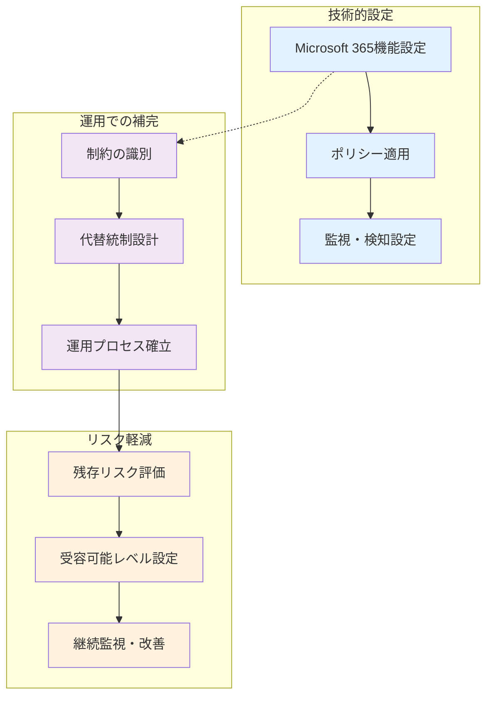
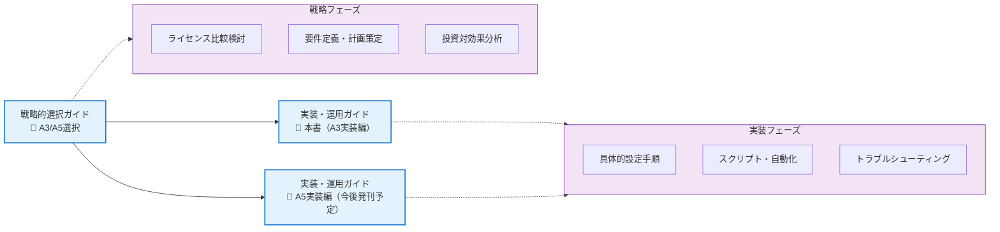
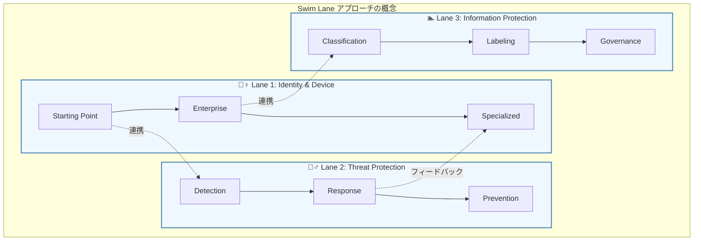
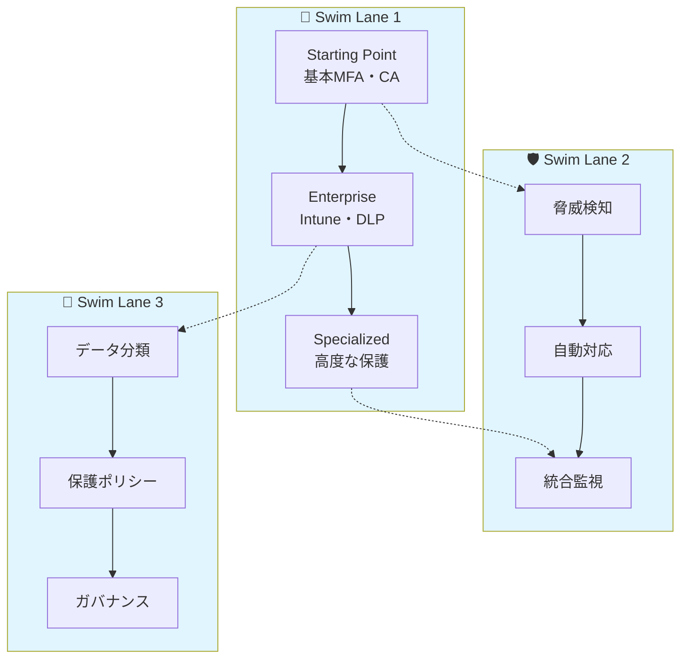
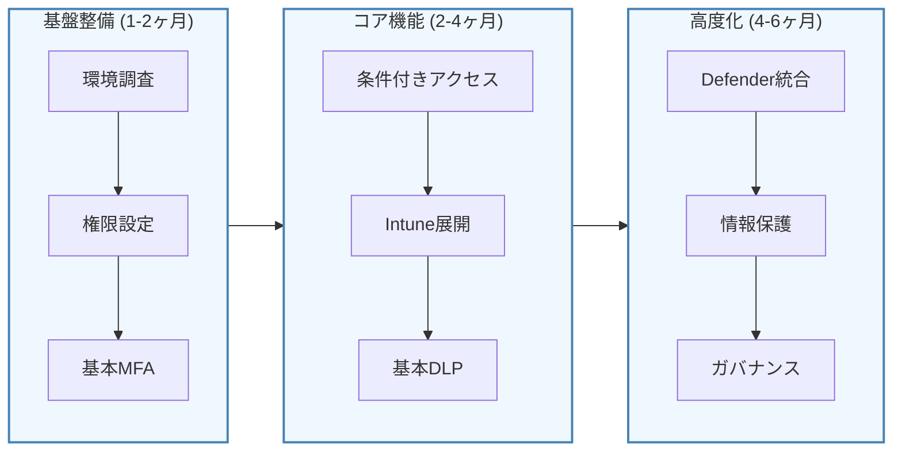
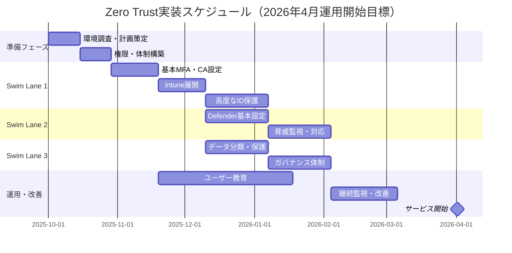

# 本書の目的と対象読者

## 教育機関を取り巻くセキュリティ環境の変化

教育機関におけるセキュリティ脅威は年々増加・高度化しており、特に以下の傾向が顕著になっています。

### 主要な脅威動向
- **ランサムウェア攻撃の増加**: 2022年以降、教育機関を標的としたランサムウェア攻撃が急増
- **フィッシング・ソーシャルエンジニアリングの巧妙化**: 児童・生徒・学生・教職員を狙った標的型攻撃
- **サプライチェーン攻撃**: 教育システムベンダー経由での侵入
- **内部脅威**: 意図的・非意図的な内部からの情報漏洩
- **クラウドサービスの設定ミス**: Microsoft 365等のクラウド環境での権限設定不備

### 初等・中等教育機関固有のリスク要因
- **多様なユーザー**: 児童・生徒・学生、教職員、非常勤講師、保護者、地域連携関係者等の混在
- **BYOD環境**: 教職員の個人デバイス利用と児童・生徒のタブレット・PC活用
- **クラウド型校務支援システム**: 出席管理、成績処理、保護者連絡システムとMicrosoft 365の併用
- **予算・人員の制約**: ICT専門人材の不足、限られたIT予算
- **教育DX推進**: GIGAスクール構想に伴う急速なデジタル化対応
- **個人情報の集約**: 児童・生徒の学習記録、健康情報、家庭環境情報の一元管理

## 本書の目的と対象ライセンス

**📋 重要：本書の対象と前提条件**

## 📚 本書の明確な対象範囲

本書は、以下の条件を満たす**初等・中等教育機関（小学校・中学校・高等学校）に完全特化**した実装ガイドです。

### 対象機関
- **小学校**、**中学校**、**高等学校**（公立・私立問わず）
- **教育委員会**および**学校組合**等の教育行政機関
- **特別支援学校**等の初等・中等教育段階の学校

### 必須前提条件
✅ **Microsoft 365 A3ライセンスを既に所有**している教育機関  
✅ **クラウド型校務支援システム**を導入済みまたは導入予定  
✅ **[戦略的選択ガイド](https://zenn.dev/nahisaho/books/a8af600f450d45)で基本方針を決定済み**  
✅ **GIGAスクール構想**に基づく1人1台端末環境の整備済み

### ❌ 対象外
- **大学・短期大学・高等専門学校**（高等教育機関）
- **企業内研修機関・専門学校**等の職業教育機関
- **Microsoft 365 A1のみ所有**の教育機関
- **戦略検討段階**の教育機関（まずは[**戦略的選択ガイド**](https://zenn.dev/nahisaho/books/a8af600f450d45)を読むこと）

### 本書が扱う範囲の特徴

**🔧 技術設定を超えた包括的なアプローチ**

本書は、Microsoft 365 の設定手順にとどまらず、A3 ライセンスの制約下で Zero Trust を完全に実現することが困難な領域について、**運用プロセスや補完的な対策によってリスクを軽減する方法**まで詳しく解説します。

### 実践的な課題解決アプローチ

#### A3制約下での課題と解決策の例

| 制約・課題 | A3での限界 | 運用による補完策 | リスク軽減効果 |
|-----------|------------|-----------------|---------------|
| **高度な条件付きアクセス** | Entra ID P1 の機能制限 | 定期的なサインインログ分析 異常パターンの手動検出 | Medium→Low |
| **高度な脅威検知** | Defender Plan 1 の制限 | Secure Score 監視 監査ログ分析による手動検知 | High→Medium |
| **データ分類の自動化** | AIP P1 の制限 | 手動分類ワークフロー ユーザー教育の徹底 | Medium→Low |
| **内部脅威対策** | 機能の不足 | アクセスログ監査 職責分離の徹底 | High→Medium |

#### 🛠️ 本書で提供する実装特化の内容

本書は **「考え方の解説」ではなく「実際の作業手順」** に完全特化しています。

1. **技術実装**：画面キャプチャ付きのステップバイステップ設定手順
2. **運用設計**：制約を補完する具体的なプロセス設計とチェックリスト
3. **リスク管理**：残存リスク評価の具体的手法と受容判断基準
4. **継続改善**：運用メトリクス収集と改善サイクルの実装方法
5. **将来計画**：A5移行時の具体的な移行手順とタイミング判断

### 💡 本書の実践的特徴

- **📸 画面キャプチャ多用**：すべての設定画面を実際のスクリーンショットで解説
- **📝 PowerShellスクリプト提供**：大規模展開用の自動化スクリプト集
- **✅ チェックリスト完備**：各段階の完了確認と品質保証手順
- **🔧 トラブルシューティング**：よくある問題と具体的な解決手順
- **📊 運用テンプレート**：日常運用で使用する帳票・レポートテンプレート

### ❌ 本書では扱わない内容

- Zero Trustの概念的説明（→[**戦略的選択ガイド**](https://zenn.dev/nahisaho/books/a8af600f450d45)を参照）
- ライセンス選択の判断基準（→[**戦略的選択ガイド**](https://zenn.dev/nahisaho/books/a8af600f450d45)を参照）
- 投資対効果の分析手法（→[**戦略的選択ガイド**](https://zenn.dev/nahisaho/books/a8af600f450d45)を参照）
- 経営層への提案方法（→[**戦略的選択ガイド**](https://zenn.dev/nahisaho/books/a8af600f450d45)を参照）

### ライセンス別ガイドの使い分け

| 所有ライセンス | 参照すべきガイド | 主な機能差異 |
|---------------|-----------------|-------------|
| **Microsoft 365 A3** | **📘 本書** 「教育機関のためのMicrosoft 365 A3 Zero Trust 実装・運用ガイド」 | ・Entra ID P1（基本CA） ・Defender for Office 365 Plan 1 ・基本DLP・監査機能 |
| **Microsoft 365 A5** | **📗 教育機関のためのMicrosoft 365 A5 Zero Trust 実装・運用ガイド** （別書籍・今後発刊予定） | ・Entra ID P2（高度CA・リスクベース） ・Defender for Office 365 Plan 2 ・Advanced eDiscovery・CAG |

⚠️ **ライセンス確認方法**
お使いのライセンスが不明な場合は、Microsoft 365管理センター > 課金 > ライセンス で確認してください。A3 と A5 では利用可能な機能が大きく異なるため、適切なガイドをご利用ください。

## 📖 本書の位置づけと前提条件

### 戦略的選択ガイドとの必須の関係性

本書は、「[教育機関 Zero Trust 実現のための Microsoft 365 A3/A5 戦略的選択ガイド](https://zenn.dev/nahisaho/books/a8af600f450d45)」の**完全な続編・実践編**として位置づけられます。

**⚠️ 重要な前提条件**：  
本書を効果的に活用するには、**必ず事前に戦略的選択ガイドを参照し、以下の基本方針を決定している必要があります**：

### 戦略的選択ガイドで決定すべき事項
- [ ] **A3ライセンス選択の妥当性確認**（A5移行の必要性評価を含む）
- [ ] **Zero Trustアーキテクチャの基本理解**（NIST SP800-207準拠）
- [ ] **校務支援システムとの統合戦略**
- [ ] **3-5年の中長期実装ロードマップ**
- [ ] **予算・調達計画の策定**
- [ ] **組織体制・責任分担の明確化**

### 🚫 本書だけでは不十分な理由

本書は **「どのように実装するか」** に特化しており、 **「なぜその選択をするのか」「何を目指すのか」** という根本的な戦略判断は扱いません。戦略なき実装は、高額な投資に対する期待効果が得られないリスクを抱えています。

### 2つのガイドの関係性

### 🔍 2つのガイドの明確な役割分担

| 項目 | 戦略的選択ガイド | 本書（実装・運用ガイド） |
|------|-----------------|----------------------|
| **目的** | ライセンス選択と戦略立案 **「何を・なぜ」の決定** | 具体的な実装手順の提供 **「どのように」の実行** |
| **対象読者** | 意思決定者・IT責任者 教育委員会・学校管理職 | システム管理者・実装担当者 ICT支援員・技術担当教員 |
| **内容** | 比較分析・要件定義・計画 **考え方と判断基準** | ステップバイステップ手順・スクリプト **具体的な操作手順** |
| **成果物** | 実装戦略・ロードマップ **方針決定書** | 設定完了済みのZero Trust環境 **実働システム** |
| **期間** | 1-2ヶ月（検討・計画） | 6-8ヶ月（実装・展開） |
| **アプローチ** | 抽象的・概念的 **Why & What** | 具体的・実践的 **How & When** |

英国政府の [**Microsoft 365 Collaboration Blueprint**](https://cdn-dynmedia-1.microsoft.com/is/content/microsoftcorp/microsoft/mcaps/documents/fy25/Microsoft-365-Collaboration-Blueprint-for-UK-Government-Technical-Guide.pdf) で実証された成熟したアプローチを、日本の教育機関の実情に合わせて適用し、実装から運用まで一貫したセキュリティガバナンスの確立を支援します。

## 本書の使い方

### Swim Lane方式とは

**Swim Lane 方式**は、複雑な Zero Trust セキュリティの実装を、3つの並行する「レーン（泳ぎのコース）」に分けて段階的に進める手法です。プール競技のように、各レーンは独立しているが全体として一つの目標（Zero Trust の完全実装）に向かって進みます。

#### Swim Lane方式の利点

| 利点 | 説明 | 従来手法との違い |
|------|------|----------------|
| **並行実装** | 3つのレーンを同時進行で実装可能 | 順次実装より大幅な時間短縮 |
| **リスク分散** | 1つのレーンで問題が発生しても他に影響しない | 全体停止のリスクを回避 |
| **段階的成熟** | 各レーン内で Starting Point → Specialized へ成長 | 一気に高度化せず無理のない進歩 |
| **相互補完** | レーン間での情報共有と連携効果 | 単独実装では得られない統合効果 |
| **柔軟性** | 組織の状況に応じてレーンの進捗を調整可能 | 画一的でない現実的なアプローチ |

#### 教育機関でのSwim Lane適用例

**🏫 クラウド型校務支援システムを利用する教育委員会での実装例**
- **Lane 1**: 教職員基本認証 → GIGAスクール端末管理 → 校務支援システム連携セキュリティ
- **Lane 2**: 基本メール保護 → 不審メール検知 → 校務データ漏洩防止
- **Lane 3**: 個人情報分類 → 学習記録保護 → 校務情報ガバナンス

本書は、このSwim Lane方式に基づき、以下の3つの段階的アプローチで構成されています。この方式は英国政府Blueprint でも採用されている実績のあるフレームワークです。

### Swim Lane 1: アイデンティティとデバイスアクセスの保護
**目標**: 正当なユーザーのみが適切なデバイスから安全にアクセスできる環境を構築

- **Phase 1 (Starting Point)**: 基本的なMFA・条件付きアクセス
- **Phase 2**: Intune デバイス管理・基本DLP
- **Phase 3**: 高度なアイデンティティ保護・監査

### Swim Lane 2: 侵害によるビジネスダメージの防止・軽減
**目標**: 侵入を前提として、被害の早期検知・封じ込め・復旧を実現

- Microsoft Defender XDR による統合脅威対策
- 自動調査・対応（AIR）の活用
- インシデント対応プロセスの確立

### Swim Lane 3: 機密ビジネスデータの識別・保護
**目標**: データの価値に応じた適切な保護レベルの実現

- データ分類・ラベリングの自動化
- 機密情報の暗号化・アクセス制御
- 情報ガバナンス体制の構築

### 本書の特徴的なアプローチ

各章では、以下の実践的な要素を提供します。
- **ステップバイステップの設定手順**: 画面キャプチャ付きの詳細手順
- **PowerShell自動化スクリプト**: 大規模展開対応のスクリプト集
- **トラブルシューティングガイド**: よくある問題と解決方法
- **リスクベースの優先順位付け**: 効果・難易度・影響度による実装順序
- **教育機関向けカスタマイズ**: 学術環境特有の要件への対応

## A3ライセンスでのZero Trust実装方針

### A3ライセンスに含まれる主要セキュリティ機能

| カテゴリ | 機能 | 用途 | 制約・注意点 |
|---------|------|------|-------------|
| **アイデンティティ** | Microsoft Entra ID P1 | 条件付きアクセス、MFA、Identity Protection（基本） | P2機能（Risk-based CA等）は含まれない |
| **デバイス管理** | Microsoft Intune | デバイス登録・コンプライアンス・アプリ管理 | フル機能、追加ライセンス不要 |
| **メール保護** | Defender for Office 365 Plan 1 | Safe Attachments, Safe Links, フィッシング対策 | Plan 2機能（AIR等）は別途必要 |
| **データ保護** | Azure Information Protection P1 | 機密ラベル、Rights Management、基本DLP | 高度な分類・自動ラベリングはP2 |
| **コンプライアンス** | 基本監査・eDiscovery | 監査ログ、基本検索、法的保持 | Advanced eDiscovery は別ライセンス |
| **クラウドアプリ** | Cloud App Security（基本） | アプリ検出、基本ガバナンス | フル機能はDefender for Cloud Apps |

### 段階的実装戦略

### A3制約下での最大効果を得るアプローチ

A3ライセンスは高等教育向けのA5と比較して機能制約がありますが、**戦略的な実装順序と運用の工夫により、限られたリソースで最大のセキュリティ効果を実現**できます。本書では、教育機関の現実的な制約（予算・人員・時間）を前提として、ROI（投資対効果）を最大化する実装アプローチを提示します。

#### 1. 優先度マトリックスに基づく実装
**High Impact × Low Effort**: 最優先実装項目（即座に開始すべき項目）
- 基本MFA（すべてのユーザー）
- レガシー認証ブロック
- 外部共有の制限
- 基本監査ログ有効化

**High Impact × High Effort**: 段階的実装項目（計画的に進める項目）
- 条件付きアクセスポリシー
- Intune デバイス管理
- 機密ラベルとDLP

#### 2. 補完的なソリューション活用
A3で不足する機能については、以下で補完：
- **Microsoft標準機能の最大活用**: 監査ログ、セキュリティスコア、レポート機能
- **Microsoft標準ツール**: セキュリティスコア、セキュリティベースライン、監査レポート
- **運用プロセスの強化**: 手動監視・分析による脅威検知の補完

#### 3. 将来的なA5移行を視野に入れた設計
- A5で利用可能になる高度機能を見据えた設計
- 移行時の作業量を最小化する構成
- ROI評価に基づく移行タイミングの検討

## 必要な前提知識・権限

### 前提知識

本書を活用するには、以下の基本的な知識が必要です。

- Microsoft 365 管理センターの基本操作
- Active Directory/Microsoft Entra ID の基本概念
- ネットワークセキュリティの基礎知識
- PowerShell の基本的な使用方法

### 必要な管理者権限

実装作業には以下の管理者権限が必要です。

- **グローバル管理者**または**セキュリティ管理者**
- **Intune管理者**（デバイス管理章）
- **コンプライアンス管理者**（コンプライアンス章）
- **Exchange管理者**（メール関連設定）

## 実装ロードマップとスケジュール

### 標準的な実装タイムライン（6ヶ月・2026年4月サービス開始）

### フェーズ別の成果目標（KPI）

#### Phase 1: 基盤構築（1-2ヶ月）
**目標**: セキュリティの基本的な防御レイヤーを確立

| 項目 | 開始時 | 目標値 | 測定方法 |
|------|-------|-------|----------|
| MFA有効化率 | < 30% | > 95% | Entra ID レポート |
| レガシー認証利用率 | > 40% | < 5% | サインインログ分析 |
| セキュリティスコア | < 40% | > 60% | Microsoft Secure Score |
| 管理者アカウント保護率 | < 50% | 100% | 条件付きアクセスレポート |

#### Phase 2: 統合防御（2-4ヶ月）
**目標**: デバイス・データ・脅威対策の統合的な保護を実現

| 項目 | 開始時 | 目標値 | 測定方法 |
|------|-------|-------|----------|
| デバイス管理対象率 | < 20% | > 80% | Intune管理コンソール |
| DLP適用範囲 | 0% | > 90% | コンプライアンスセンター |
| 脅威検知精度 | N/A | > 95% | Defender XDR レポート |
| インシデント対応時間 | > 24時間 | < 4時間 | SOCメトリクス |

#### Phase 3: 最適化・ガバナンス（4-6ヶ月）
**目標**: 継続的な改善とガバナンス体制を確立

| 項目 | 開始時 | 目標値 | 測定方法 |
|------|-------|-------|----------|
| セキュリティスコア | > 60% | > 80% | Microsoft Secure Score |
| ユーザー教育完了率 | 0% | > 95% | トレーニングプラットフォーム |
| コンプライアンススコア | < 50% | > 80% | Compliance Manager |
| セキュリティインシデント削減率 | 0% | > 70% | 前年同期比 |

## 本書の特徴

### 教育機関特化の内容

#### 初等・中等教育特有のユーザー環境
- **児童・生徒**: GIGAスクール端末利用、発達段階に応じたデジタルリテラシー、学年による利用制限
- **教職員**: 校務支援システムとMicrosoft 365の併用、授業準備・成績処理・保護者対応の業務
- **管理職・事務職員**: 学校運営情報の管理、予算管理、人事情報の取り扱い
- **非常勤講師・支援員**: 限定的なアクセス権限、短期間の利用パターン
- **保護者・地域関係者**: 学校行事・緊急時連絡での限定的なアクセス

#### 初等・中等教育環境特有の課題
- **クラウド型校務支援システムとの統合**: 出席・成績・健康管理システムとMicrosoft 365の安全な連携
- **学習データの保護**: 児童・生徒の学習履歴、行動記録、評価データの適切な管理
- **GIGAスクール環境**: 1人1台端末環境でのセキュリティポリシーと学習活動の両立
- **予算・人員制約**: 限られたICT予算と専門人材でのセキュリティ対策
- **地域連携**: 教育委員会、他校、地域コミュニティとの情報共有における安全性確保

#### 規制・コンプライアンス要件
- **個人情報保護法**: 児童・生徒・教職員の個人情報適正管理、保護者情報の取り扱い
- **文部科学省ガイドライン**: 教育情報セキュリティポリシーへの準拠、GIGAスクール運営指針
- **教育委員会規定**: 地方自治体のセキュリティポリシー、校務支援システム利用規程
- **学校保健安全法**: 健康情報の管理、緊急時対応システムの整備
- **情報公開条例**: 学校運営情報の透明性と個人情報保護のバランス

### 実践的なアプローチ

- ステップバイステップの設定手順
- トラブルシューティングガイド
- 実際のインシデント対応例
- PowerShellスクリプト集

### リスクベースの優先順位付け

各実装項目について、以下の観点から優先度を設定：

- **セキュリティ効果**: High/Medium/Low
- **実装難易度**: 簡単/標準/複雑
- **ユーザー影響**: 最小/中程度/大きい
- **コスト**: 追加費用なし/少額/要検討

## 関連リソース

本書と併せて参照すべきリソース：

- [Microsoft 365 を使用したゼロトラスト展開指針](https://learn.microsoft.com/ja-jp/security/zero-trust/microsoft-365-zero-trust)
- [教育機関向けMicrosoft 365ドキュメント](https://docs.microsoft.com/education)
- [文部科学省 教育情報セキュリティポリシーガイドライン](https://www.mext.go.jp/a_menu/shotou/zyouhou/detail/1397369.htm)

## サポートとフィードバック

本書に関する質問やフィードバックは、以下の方法でお寄せください。

- 著者へのメール連絡 <nahisaho@microsoft.com>
- Facebook の　[Microsoft Education 研究会](https://www.facebook.com/groups/835019790287412)

それでは、安全で効率的な Zero Trust 環境の構築を始めましょう。