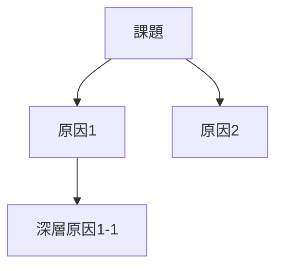

# SHIKIGAMI BCG Consulting Framework

| 起動条件 | アクション |
|---------|-----------|
| ポートフォリオ分析時 | BCG Growth-Share Matrix適用 |
| コスト分析時 | BCG Experience Curve適用 |
| 戦略立案時 | BCG Strategy Palette適用 |
| 問題解決時 | BCG Hypothesis-Driven/Issue Tree |
| 価値創造分析時 | BCG TSR Analysis適用 |

---

## BCGフレームワークカテゴリ

| カテゴリ | 代表例 |
|---------|--------|
| ポートフォリオ戦略 | BCG Growth-Share Matrix, Advantage Matrix |
| コスト・オペレーション | Experience Curve, Time-Based Competition |
| 戦略立案 | Strategy Palette, Deconstruction |
| 問題解決 | Hypothesis-Driven Approach, Issue Tree |
| 価値創造 | TSR Analysis, Value Creation Framework |
| デジタル変革 | Digital Acceleration Index, Bionic Company |

---

## Phase 1: BCGフレームワーク選択

### 自動推奨（v2.0.0）
キーワードから最適なBCGフレームワークを自動提案:

| トリガーキーワード | 推薦フレームワーク |
|-------------------|-------------------|
| ポートフォリオ/花形/金のなる木 | BCG Growth-Share Matrix |
| コスト/習熟/経験曲線 | BCG Experience Curve |
| 戦略/不確実性/環境 | BCG Strategy Palette |
| 仮説/イシュー/問題解決 | BCG Hypothesis-Driven Approach |
| TSR/株主価値/価値創造 | BCG TSR Analysis |

---

## Phase 2: BCGフレームワーク分析

### BCG Growth-Share Matrix（成長-シェアマトリクス）

```markdown
## BCG Growth-Share Matrix: [対象ポートフォリオ]

|                | 高市場成長率 | 低市場成長率 |
|----------------|-------------|-------------|
| **高相対シェア** | ⭐ Stars（花形） | 🐄 Cash Cows（金のなる木） |
| **低相対シェア** | ❓ Question Marks（問題児） | 🐕 Dogs（負け犬） |

### 事業別ポジション

| 事業名 | 市場成長率 | 相対シェア | 象限 | 推奨戦略 |
|--------|-----------|-----------|------|----------|
| 事業A | 15% | 1.5 | Star | 積極投資継続 |
| 事業B | 5% | 2.0 | Cash Cow | 効率化・キャッシュ創出 |
| 事業C | 20% | 0.6 | Question Mark | 選択投資/撤退判断 |
| 事業D | 3% | 0.4 | Dog | 撤退/縮小検討 |

### リソース配分方針
- Stars: 売上の○%を再投資
- Cash Cows: 利益の○%を他事業へ配分
- Question Marks: ○年以内にシェア○%達成、未達なら撤退
- Dogs: 段階的縮小、○年以内に売却/撤退
```

### BCG Experience Curve（経験曲線）

```markdown
## BCG Experience Curve: [対象事業/製品]

### コストポジション分析

| 項目 | 自社 | 競合A | 競合B |
|------|------|-------|-------|
| 累積生産量 | 100万台 | 150万台 | 50万台 |
| 単位コスト | ¥10,000 | ¥8,500 | ¥12,000 |
| 学習率 | 20% | 22% | 18% |

### 経験曲線グラフ
累積生産量が2倍になるごとにコストが20%低減

### 戦略示唆
- コストリーダーシップ確立に必要な累積生産量: ○万台
- 現在のギャップ: ○万台
- 達成までの推定期間: ○年
```

### BCG Strategy Palette（戦略パレット）

```markdown
## BCG Strategy Palette: [対象事業/市場]

### 環境評価

| 評価軸 | スコア | 判定 |
|--------|--------|------|
| 予測可能性 | 低/中/高 | ○ |
| 変化可能性（自社影響力） | 低/中/高 | ○ |

### 推奨戦略アプローチ

| 戦略タイプ | 環境条件 | 適用判定 |
|-----------|----------|----------|
| Classical（古典的） | 予測可能・変化不可能 | ○/× |
| Adaptive（適応型） | 予測不可能・変化不可能 | ○/× |
| Visionary（ビジョン型） | 予測可能・変化可能 | ○/× |
| Shaping（形成型） | 予測不可能・変化可能 | ○/× |
| Renewal（再生型） | 厳しい環境 | ○/× |

### 選択した戦略: [戦略タイプ]
- アプローチ: [具体的アクション]
- 成功指標: [KPI]
```

### BCG Hypothesis-Driven Approach（仮説駆動アプローチ）

```markdown
## BCG Hypothesis-Driven Approach: [プロジェクト名]

### Key Question（解くべき問い）
[中心となるビジネス課題]

### Day 1 Answer（初期仮説）
[現時点での最善の回答仮説]

### Issue Tree（イシュー分解）
[Key Question]
├── [Sub-Issue 1]
│   ├── [Analysis 1-1]
│   └── [Analysis 1-2]
├── [Sub-Issue 2]
│   ├── [Analysis 2-1]
│   └── [Analysis 2-2]
└── [Sub-Issue 3]

### MECE検証
| チェック | 状態 |
|---------|------|
| 相互排他性（ME） | ✅/❌ |
| 全体網羅性（CE） | ✅/❌ |

### 分析ワークプラン
| イシュー | 必要分析 | データソース | 担当 | 期限 |
|---------|---------|-------------|------|------|

### Findings & Recommendations
[検証結果と提言]
```

### BCG TSR Analysis（株主総利回り分析）

```markdown
## BCG TSR Analysis: [対象企業/事業]

### TSR分解

| 要素 | 寄与度 | 詳細 |
|------|--------|------|
| 売上成長 | +○% | 市場成長・シェア拡大 |
| マージン変化 | +○% | コスト削減・価格改定 |
| マルチプル変化 | +○% | 市場評価改善 |
| 配当利回り | +○% | 株主還元 |
| 株数変化 | +○% | 自社株買い |
| **合計TSR** | **○%** | |

### ベンチマーク比較

| | 自社 | 業界平均 | トップ企業 |
|---|------|---------|-----------|
| TSR | ○% | ○% | ○% |
| 売上成長寄与 | ○% | ○% | ○% |
| マージン寄与 | ○% | ○% | ○% |

### 価値創造アクション
1. [施策1]: TSR寄与 +○%
2. [施策2]: TSR寄与 +○%
```
| 全体網羅性（CE） | ✅/❌ |
| 同一粒度 | ✅/❌ |
```

### ロジックツリー



### マッチングマトリクス（v1.12.0）

```markdown
## マッチングマトリクス

| | ニーズA | ニーズB |
|---|:---:|:---:|
| **シーズ1** | ◎ | △ |
| **シーズ2** | ○ | ◎ |

凡例: ◎最適(5)/○高適合(4)/△中(3)/▲低(2)/×不適合(1)
```

---

## Phase 3: BCG品質検証

| チェック | 説明 |
|---------|------|
| MECE性 | イシュー分解の重複なし・漏れなし |
| 仮説検証 | Day 1 Answerとの整合性 |
| ファクトベース | データに基づく定量分析 |
| So What | 経営層への示唆が明確 |

---

## BCGワークフロー推奨順序（v2.0.0）

### 戦略レビュープロジェクト

| Step | フレームワーク | 目的 |
|------|---------------|------|
| 1 | Hypothesis-Driven | 初期仮説設定・イシュー特定 |
| 2 | Issue Tree | 問題のMECE分解 |
| 3 | Growth-Share Matrix | ポートフォリオ可視化 |
| 4 | Advantage Matrix | 業界特性把握 |
| 5 | Strategy Palette | 戦略アプローチ選択 |
| 6 | TSR Analysis | 価値創造定量化 |

### コスト変革プロジェクト

| Step | フレームワーク | 目的 |
|------|---------------|------|
| 1 | Experience Curve | コストポジション把握 |
| 2 | Deconstruction | バリューチェーン分析 |
| 3 | Time-Based Competition | 時間効率改善 |

---

## 成功条件タイプ別推奨（v2.0.0）

| 成功条件 | 必須BCGフレームワーク |
|---------|---------------------|
| PORTFOLIO_REVIEW | BCG Growth-Share Matrix, Advantage Matrix |
| COST_REDUCTION | Experience Curve, Deconstruction |
| STRATEGIC_PLANNING | Strategy Palette, Hypothesis-Driven |
| M&A_DUE_DILIGENCE | TSR Analysis, Value Creation Framework |
| DIGITAL_TRANSFORMATION | Digital Acceleration Index |

---

## 保存先
`projects/pjXXXXX_Name_YYYYMMDD/analysis/`

## 関連スキル
- **shikigami-planner**: BCGフレームワーク選択支援
- **shikigami-deep-research**: 分析に必要なデータ収集
- **shikigami-writing**: BCG分析結果のレポート化
