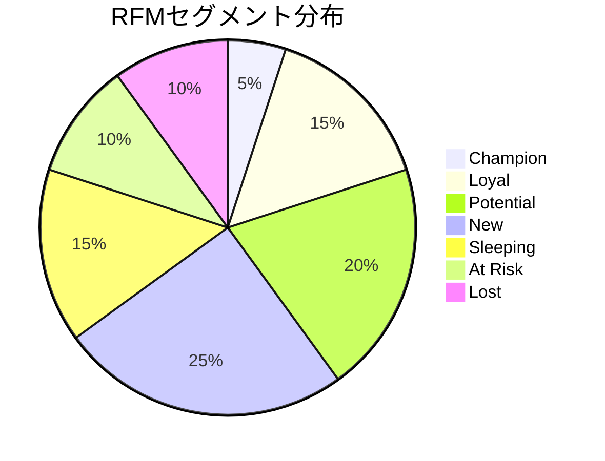

# RFM分析（RFM Analysis）

## 概要

**カテゴリ**: 顧客分析 (Customer Analysis)  
**難易度**: 初級〜中級

顧客を3つの指標（Recency, Frequency, Monetary）でスコアリングし、セグメント化するフレームワーク。
優良顧客の特定やターゲティングに活用。

## 3つの指標

| 指標 | 英語 | 意味 | 高スコアの意味 |
|------|------|------|--------------|
| **R** | Recency | 最終購入日からの経過日数 | 最近購入した |
| **F** | Frequency | 購入回数 | 頻繁に購入する |
| **M** | Monetary | 累計購入金額 | 多く購入する |

## スコアリング方法

### Step 1: データ準備

```markdown
### 必要データ
| 顧客ID | 最終購入日 | 購入回数 | 累計金額 |
|--------|-----------|---------|---------|
| C001 | 2024-01-15 | 5 | ¥50,000 |
| C002 | 2024-02-20 | 12 | ¥150,000 |
| C003 | 2023-06-01 | 2 | ¥20,000 |
```

### Step 2: 各指標の分布確認

```markdown
### R（Recency）分布
| 経過日数 | 顧客数 | 割合 |
|---------|--------|------|
| 0-30日 | | |
| 31-90日 | | |
| 91-180日 | | |
| 181-365日 | | |
| 366日以上 | | |

### F（Frequency）分布
| 購入回数 | 顧客数 | 割合 |
|---------|--------|------|
| 1回 | | |
| 2-3回 | | |
| 4-6回 | | |
| 7-10回 | | |
| 11回以上 | | |

### M（Monetary）分布
| 累計金額 | 顧客数 | 割合 |
|---------|--------|------|
| ~¥10,000 | | |
| ¥10,001-50,000 | | |
| ¥50,001-100,000 | | |
| ¥100,001以上 | | |
```

### Step 3: スコアリング基準設定（5段階例）

```markdown
### スコアリング基準
| スコア | R（経過日数） | F（購入回数） | M（累計金額） |
|--------|--------------|--------------|--------------|
| 5 | 0-30日 | 10回以上 | ¥100,000以上 |
| 4 | 31-60日 | 7-9回 | ¥50,000-99,999 |
| 3 | 61-90日 | 4-6回 | ¥30,000-49,999 |
| 2 | 91-180日 | 2-3回 | ¥10,000-29,999 |
| 1 | 181日以上 | 1回 | ~¥9,999 |
```

### Step 4: 顧客セグメント定義

```markdown
### RFMセグメント
| セグメント | RFMスコア | 特徴 | 顧客数 | 施策 |
|-----------|----------|------|--------|------|
| 💎 **Champion（最優良）** | R:5,F:5,M:5 | 最近・頻繁・高額 | | VIP優遇 |
| ⭐ **Loyal（ロイヤル）** | R:3-5,F:4-5,M:4-5 | 頻繁に購入 | | 関係維持 |
| 🌱 **Potential（有望）** | R:4-5,F:2-3,M:3-4 | 成長可能性高い | | 育成 |
| 📈 **New（新規）** | R:5,F:1,M:1-2 | 最近購入した新規 | | オンボーディング |
| 😴 **Sleeping（休眠）** | R:1-2,F:3-5,M:3-5 | 以前は優良だった | | 再活性化 |
| ⚠️ **At Risk（離脱危機）** | R:1-2,F:4-5,M:4-5 | 離脱リスク高い | | 緊急対応 |
| 👋 **Lost（離脱）** | R:1,F:1-2,M:1-2 | ほぼ離脱 | | 再獲得/放置 |
```

## 出力テンプレート

```markdown
# RFM分析レポート: [会社/サービス名]

## 分析概要
- **分析期間**: YYYY-MM-DD 〜 YYYY-MM-DD
- **分析対象顧客数**: N人
- **データソース**: [CRM, EC等]

## 全体サマリー

### RFMスコア分布


### セグメント別指標
| セグメント | 顧客数 | 割合 | 平均LTV | 推奨施策 |
|-----------|--------|------|---------|---------|
| 💎 Champion | | | ¥ | |
| ⭐ Loyal | | | ¥ | |
| 🌱 Potential | | | ¥ | |
| 📈 New | | | ¥ | |
| 😴 Sleeping | | | ¥ | |
| ⚠️ At Risk | | | ¥ | |
| 👋 Lost | | | ¥ | |

## セグメント別施策

### 💎 Champion（最優良顧客）
- **顧客数**: N人（X%）
- **特徴**: [行動パターン]
- **推奨施策**:
  - VIPプログラム招待
  - 限定商品先行案内
  - パーソナライズされた感謝

### ⚠️ At Risk（離脱危機）
- **顧客数**: N人（X%）
- **特徴**: [行動パターン]
- **推奨施策**:
  - 復帰キャンペーン
  - ヒアリング調査
  - 特別オファー

## アクションプラン

| 優先度 | セグメント | 施策 | 期待効果 | 担当 | 期限 |
|--------|-----------|------|---------|------|------|
| 1 | At Risk | 復帰キャンペーン | 離脱防止X% | | |
| 2 | Potential | 育成プログラム | LTV向上X% | | |
| 3 | New | オンボーディング | 2回目購入率X% | | |

## 次回分析予定
- **次回分析日**: YYYY-MM-DD
- **改善点**: [分析の改善点]
```

## 関連フレームワーク

- **顧客ピラミッド**: 階層別顧客分析
- **LTV分析**: 顧客生涯価値
- **コホート分析**: 時系列での顧客行動分析
