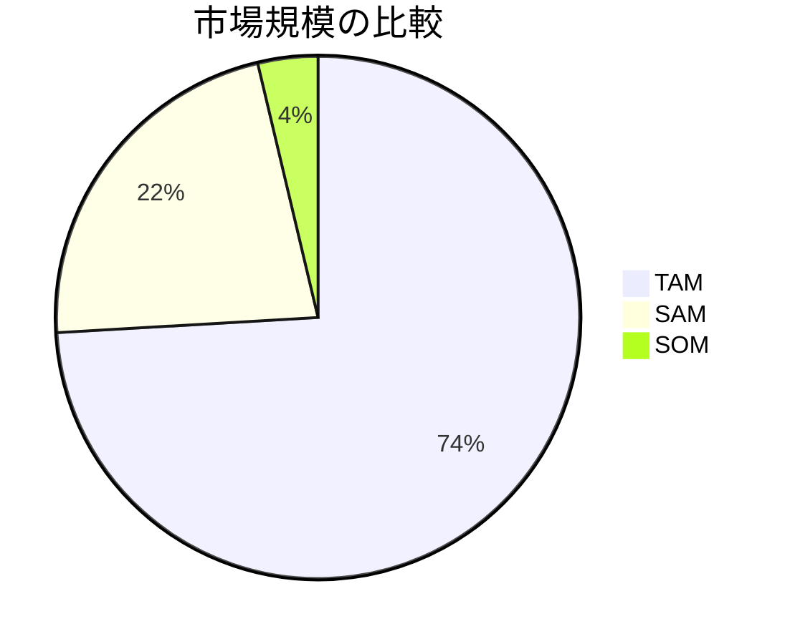

# TAM/SAM/SOM分析

## 概要

**カテゴリ**: 市場分析 / 新規事業  
**難易度**: 中級

市場規模を3つのレベル（TAM, SAM, SOM）で評価するフレームワーク。
事業計画や投資家向けピッチで市場機会を説明する際に使用。

## 3つの市場定義

```
                    ┌───────────────────┐
                    │       TAM         │
                    │  (獲得可能な全体  │
                    │   市場規模)       │
                    │                   │
                    │   ┌───────────┐   │
                    │   │    SAM    │   │
                    │   │(有効市場) │   │
                    │   │           │   │
                    │   │  ┌─────┐  │   │
                    │   │  │ SOM │  │   │
                    │   │  │(実際│  │   │
                    │   │  │獲得)│  │   │
                    │   │  └─────┘  │   │
                    │   └───────────┘   │
                    └───────────────────┘
```

| 指標 | 英語 | 意味 | 説明 |
|------|------|------|------|
| **TAM** | Total Addressable Market | 獲得可能な全体市場 | 製品が理論上到達可能な最大市場 |
| **SAM** | Serviceable Available Market | 有効市場規模 | 自社が実際にサービス提供可能な市場 |
| **SOM** | Serviceable Obtainable Market | 獲得可能市場規模 | 現実的に獲得可能な市場シェア |

## 算出方法

### トップダウンアプローチ

```markdown
### TAM算出（トップダウン）
**計算式**: 市場全体の規模 × 該当率

| 項目 | 値 | ソース |
|------|-----|-------|
| 業界全体市場規模 | ¥ | [レポート名] |
| 該当セグメント比率 | %  | |
| **TAM** | ¥ | |

### SAM算出
**計算式**: TAM × 地理的/セグメント絞り込み

| 項目 | 値 | 根拠 |
|------|-----|------|
| TAM | ¥ | |
| 対象地域比率 | % | |
| 対象セグメント比率 | % | |
| **SAM** | ¥ | |

### SOM算出
**計算式**: SAM × 想定シェア

| 項目 | 値 | 根拠 |
|------|-----|------|
| SAM | ¥ | |
| 1年目想定シェア | % | |
| **SOM（1年目）** | ¥ | |
```

### ボトムアップアプローチ

```markdown
### TAM算出（ボトムアップ）
**計算式**: 潜在顧客数 × 年間支出額

| 項目 | 値 | 根拠 |
|------|-----|------|
| 潜在顧客数（日本） | N | [統計データ] |
| 年間平均支出額 | ¥ | [調査データ] |
| **TAM** | ¥ | |

### SAM算出
**計算式**: ターゲット顧客数 × 年間支出額

| 項目 | 値 | 根拠 |
|------|-----|------|
| ターゲット顧客数 | N | [ターゲット定義] |
| 年間平均支出額 | ¥ | |
| **SAM** | ¥ | |

### SOM算出
**計算式**: 獲得可能顧客数 × 自社単価

| 項目 | 値 | 根拠 |
|------|-----|------|
| 獲得可能顧客数 | N | [営業計画] |
| 自社製品単価 | ¥ | |
| **SOM** | ¥ | |
```

## 適用手順

### Step 1: 市場定義

```markdown
### 市場定義
- **製品/サービス**: [何を売るか]
- **顧客**: [誰に売るか]
- **地域**: [どこで売るか]
- **業界**: [どの業界か]
```

### Step 2: データソース特定

```markdown
### データソース
| 指標 | ソース | 信頼度 | 日付 |
|------|--------|--------|------|
| 市場規模 | [レポート名] | 高/中/低 | YYYY |
| 顧客数 | [統計名] | 高/中/低 | YYYY |
| 支出額 | [調査名] | 高/中/低 | YYYY |
```

### Step 3: 前提条件の明示

```markdown
### 主要な前提条件
1. **TAMの前提**: [何を含む/含まない]
2. **SAMの絞り込み基準**: [地域、セグメント等]
3. **SOMのシェア根拠**: [競合状況、自社リソース]
```

### Step 4: 成長率の推定

```markdown
### 市場成長率予測
| 年 | TAM | SAM | SOM | 成長率 |
|-----|-----|-----|-----|--------|
| 2024 | ¥ | ¥ | ¥ | - |
| 2025 | ¥ | ¥ | ¥ | X% |
| 2026 | ¥ | ¥ | ¥ | X% |
| 2027 | ¥ | ¥ | ¥ | X% |
```

## 出力テンプレート

```markdown
# TAM/SAM/SOM分析: [製品/サービス名]

## エグゼクティブサマリー

| 指標 | 2024年 | 2027年 | CAGR |
|------|--------|--------|------|
| TAM | ¥[X]億 | ¥[Y]億 | Z% |
| SAM | ¥[X]億 | ¥[Y]億 | Z% |
| SOM | ¥[X]億 | ¥[Y]億 | Z% |

## 市場定義

### TAM（Total Addressable Market）
**定義**: [製品カテゴリ全体の市場]

**算出方法**:
```
[計算式と根拠]
```

**金額**: **¥[X]億円**

### SAM（Serviceable Available Market）
**定義**: [自社がサービス可能な市場範囲]

**絞り込み条件**:
- 地域: [対象地域]
- 顧客セグメント: [対象セグメント]
- 除外: [対象外とするもの]

**金額**: **¥[X]億円**（TAMの[X]%）

### SOM（Serviceable Obtainable Market）
**定義**: [現実的に獲得可能な市場シェア]

**根拠**:
- 競合状況: [主要競合と市場シェア]
- 自社リソース: [営業力、マーケティング予算]
- 差別化要因: [なぜ獲得できるか]

**金額**: **¥[X]億円**（SAMの[X]%）

## 市場ビジュアル



## 成長予測

| 年 | TAM | YoY | SAM | YoY | SOM | YoY |
|----|-----|-----|-----|-----|-----|-----|
| 2024 | ¥B | - | ¥B | - | ¥B | - |
| 2025 | ¥B | X% | ¥B | X% | ¥B | X% |
| 2026 | ¥B | X% | ¥B | X% | ¥B | X% |

## 前提条件・リスク

### 前提条件
1. [前提1]
2. [前提2]
3. [前提3]

### リスク要因
| リスク | 影響度 | 対策 |
|--------|--------|------|
| [リスク1] | 高/中/低 | [対策] |
| [リスク2] | | |

## 参考資料
- [ソース1](URL)
- [ソース2](URL)
```

## 関連フレームワーク

- **PEST分析**: マクロ環境と市場成長要因
- **5Forces分析**: 市場の競争構造
- **リーンキャンバス**: 市場仮説の検証
