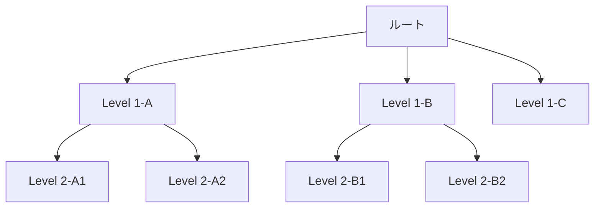

# ロジックツリー

## 概要
問題や課題を構造的に分解し、要素間の論理的な関係を可視化するフレームワーク。What（何が）、Why（なぜ）、How（どうやって）の3種類がある。

## 適用場面
- 複雑な問題の構造化
- 原因分析
- 解決策の立案
- 意思決定の整理

## 3種類のロジックツリー

### Whatツリー（要素分解）
**「何があるか」を分解**

用途: 全体像の把握、構成要素の洗い出し

例:
```
売上
├── 国内売上
│   ├── 直販
│   └── 代理店
└── 海外売上
    ├── アジア
    ├── 北米
    └── 欧州
```

### Whyツリー（原因分析）
**「なぜそうなるか」を掘り下げ**

用途: 問題の根本原因特定、因果関係の整理

例:
```
売上減少
├── 顧客数の減少
│   ├── 新規獲得の低下
│   └── 既存離反の増加
└── 客単価の低下
    ├── 購入点数の減少
    └── 商品単価の低下
```

### Howツリー（解決策立案）
**「どうやって実現するか」を展開**

用途: 目標達成の手段検討、アクションプラン作成

例:
```
売上20%増加
├── 新規顧客獲得
│   ├── 広告強化
│   └── 紹介制度導入
└── 既存顧客単価向上
    ├── アップセル
    └── クロスセル
```

## テンプレート

```markdown
## ロジックツリー: [テーマ]

### ツリータイプ
[What / Why / How]

### 目的
[このツリーで何を明らかにするか]

### ツリー構造

```
[ルート: 問題/目標]
├── [Level 1-A]
│   ├── [Level 2-A1]
│   │   ├── [Level 3-A1a]
│   │   └── [Level 3-A1b]
│   └── [Level 2-A2]
├── [Level 1-B]
│   ├── [Level 2-B1]
│   └── [Level 2-B2]
└── [Level 1-C]
    ├── [Level 2-C1]
    └── [Level 2-C2]
```

### Mermaid図



### MECEチェック
| レベル | ME（重複なし） | CE（漏れなし） | 状態 |
|--------|---------------|---------------|------|
| Level 1 | ✅/❌ | ✅/❌ | [コメント] |
| Level 2 | ✅/❌ | ✅/❌ | [コメント] |

### 優先順位
| 項目 | 重要度 | 実現性 | 優先度 |
|------|--------|--------|--------|
| [項目1] | [高/中/低] | [高/中/低] | [A/B/C] |
| [項目2] | [高/中/低] | [高/中/低] | [A/B/C] |
```

## 作成のコツ

### 1. MECE原則を守る
- 同じレベルの項目は重複なく、漏れなく
- 分解基準を統一する

### 2. 適切な粒度で止める
- 通常3〜4レベルまで
- アクション可能なレベルまで分解

### 3. 「So What」を意識
- 分解の目的を忘れない
- 意思決定に役立つ粒度で止める

## よくある間違い

```
❌ 悪い例（粒度がバラバラ）:
売上増加
├── マーケティング強化
├── テレビCM
└── 価格戦略

✅ 良い例:
売上増加
├── 顧客数増加
│   ├── 新規獲得
│   └── 離反防止
└── 客単価向上
    ├── 購入頻度向上
    └── 1回あたり購入額向上
```

## 関連フレームワーク
- MECE: ツリー作成の基本原則
- イシューツリー: 仮説検証型の派生形
- 5 Whys: Why分析の簡易版
- フィッシュボーン: 原因分析の可視化
