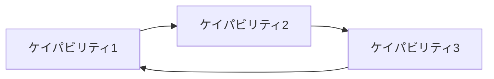

# Strategy& - PwC戦略コンサルティングフレームワーク

## 概要

**Strategy&** はPwCの戦略コンサルティング部門であり、「戦略からケイパビリティまで一気通貫で支援する」という独自のアプローチを提供します。
戦略と実行の間のギャップを埋め、持続的な競争優位を構築することを目指します。

## コア・コンセプト

### Capabilities-Driven Strategy（ケイパビリティ駆動型戦略）

```markdown
┌─────────────────────────────────────────────────────────┐
│              Capabilities-Driven Strategy              │
├─────────────────────────────────────────────────────────┤
│                                                         │
│    Way to Play    →    Capabilities    →    Products   │
│    (市場での戦い方)    (差別化能力)        (商品/サービス) │
│                                                         │
│    ↑_____________________________________________↓      │
│                 コヒーレンス(一貫性)                    │
│                                                         │
└─────────────────────────────────────────────────────────┘
```

## 分析テンプレート

### 1. Way to Play分析

```markdown
## 市場での戦い方（Way to Play）

### 選択された戦い方
| 要素 | 定義 |
|------|------|
| ターゲット顧客 | [具体的な顧客セグメント] |
| 価値提案 | [提供する独自価値] |
| 勝ち方 | [競合に勝つ方法] |

### 戦い方のタイプ
- [ ] カテゴリーリーダー（Category Leader）
- [ ] 差別化プレイヤー（Differentiator）
- [ ] バリューリーダー（Value Leader）
- [ ] プラットフォーム・オーケストレーター
- [ ] ソリューションプロバイダー
```

### 2. ケイパビリティシステム分析

```markdown
## ケイパビリティシステム

### 差別化ケイパビリティ（3-6個）

| # | ケイパビリティ | 現在の成熟度 | 目標成熟度 | ギャップ |
|---|--------------|------------|----------|---------|
| 1 | [能力名] | ★★☆☆☆ | ★★★★☆ | 要強化 |
| 2 | | | | |
| 3 | | | | |

### ケイパビリティ間の相互関係

```

### 3. 一貫性チェック

```markdown
## コヒーレンス診断

| チェック項目 | 状態 | 説明 |
|------------|------|------|
| 戦略⇔ケイパビリティ整合 | ✅/⚠️/❌ | [具体的な説明] |
| ケイパビリティ⇔製品整合 | ✅/⚠️/❌ | [具体的な説明] |
| リソース配分整合 | ✅/⚠️/❌ | [具体的な説明] |
| 組織構造整合 | ✅/⚠️/❌ | [具体的な説明] |

### 不整合のリスク
[特定された不整合とその影響]
```

### 4. Strategy-to-Execution Blueprint

```markdown
## 戦略から実行へのロードマップ

### Phase 1: 診断（Diagnosis）- [期間]
- [ ] 現状のケイパビリティ評価
- [ ] 競合ベンチマーク
- [ ] ギャップ分析

### Phase 2: 設計（Design）- [期間]
- [ ] ターゲット・ケイパビリティシステム設計
- [ ] 投資優先順位決定
- [ ] 組織・人材要件定義

### Phase 3: 構築（Build）- [期間]
- [ ] ケイパビリティ構築プログラム実行
- [ ] 人材・スキル開発
- [ ] プロセス・テクノロジー導入

### Phase 4: 定着（Embed）- [期間]
- [ ] パフォーマンス測定・モニタリング
- [ ] 継続的改善サイクル確立
```

## 適用場面

| シナリオ | 活用方法 |
|---------|---------|
| 経営戦略策定 | Way to Play + ケイパビリティシステムの定義 |
| 事業ポートフォリオ見直し | 戦略的一貫性の観点からの評価 |
| 組織変革 | ケイパビリティ構築に必要な組織設計 |
| M&A戦略 | ケイパビリティ獲得の観点からのターゲット評価 |

## キーワード

```yaml
trigger_keywords:
  ja:
    - "戦略策定"
    - "ケイパビリティ"
    - "競争戦略"
    - "戦略実行"
    - "差別化"
    - "持続的競争優位"
    - "事業戦略"
  en:
    - "strategy"
    - "capability"
    - "way to play"
    - "strategy execution"
    - "competitive advantage"
    - "coherence"
```

## 出力形式

```markdown
## Strategy& 分析結果

### エグゼクティブサマリー
[戦略的示唆の要約]

### 1. Way to Play
[選択された市場での戦い方]

### 2. 差別化ケイパビリティシステム
[3-6個のコアケイパビリティとその相互関係]

### 3. コヒーレンス評価
[戦略・ケイパビリティ・製品の一貫性]

### 4. 実行ブループリント
[戦略実現のためのロードマップ]
```

## 参考文献

- Paul Leinwand, Cesare Mainardi. "The Essential Advantage"
- Paul Leinwand, Cesare Mainardi. "Strategy That Works"
- PwC Strategy& Capabilities-Driven Strategy Methodology
