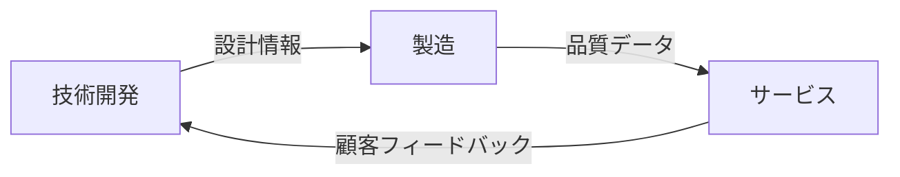

# バリューチェーン分析（Value Chain Analysis）

## 概要

**カテゴリ**: 戦略分析 (Strategic Analysis)  
**提唱者**: マイケル・ポーター  
**難易度**: 中級

企業活動を一連の価値創造プロセスとして捉え、各活動がどのように価値を生み出し、競争優位に貢献しているかを分析するフレームワーク。

## バリューチェーンの構造

```
┌─────────────────────────────────────────────────────────────────┐
│                      支援活動（Support Activities）              │
├────────────────────────────────────────────────────────────────┤
│  全般管理（インフラ）: 経営管理、財務、法務、品質管理          │
├────────────────────────────────────────────────────────────────┤
│  人事・労務管理: 採用、研修、報酬、組織開発                    │
├────────────────────────────────────────────────────────────────┤
│  技術開発: R&D、プロセス改善、製品設計                        │
├────────────────────────────────────────────────────────────────┤
│  調達活動: サプライヤー管理、購買、契約管理                    │
├──────────┬──────────┬──────────┬──────────┬──────────┬────────┤
│          │          │          │          │          │        │
│ 購買物流 │ 製造・    │ 出荷物流 │ マーケ   │ サービス │ マージン│
│          │ オペレー │          │ ティング │          │        │
│          │ ション   │          │ ・販売   │          │        │
│          │          │          │          │          │        │
└──────────┴──────────┴──────────┴──────────┴──────────┴────────┘
                    主活動（Primary Activities）
```

## 活動の定義

### 主活動（Primary Activities）

| 活動 | 内容 | 例 |
|------|------|-----|
| **購買物流** | 原材料の受入、保管、在庫管理 | 倉庫管理、配送スケジュール |
| **製造・オペレーション** | 原材料を製品に変換 | 加工、組立、検査、梱包 |
| **出荷物流** | 完成品の保管・配送 | 出荷、配送、受注処理 |
| **マーケティング・販売** | 顧客への製品訴求・販売 | 広告、販促、営業、価格設定 |
| **サービス** | 製品価値の維持・向上 | 修理、サポート、保証 |

### 支援活動（Support Activities）

| 活動 | 内容 | 例 |
|------|------|-----|
| **全般管理** | 組織全体の管理 | 経営企画、財務、法務 |
| **人事・労務管理** | 人材の獲得・育成・維持 | 採用、研修、評価 |
| **技術開発** | 製品・プロセスの改善 | R&D、IT、改善活動 |
| **調達活動** | 投入資源の購買 | サプライヤー選定、交渉 |

## 適用手順

### Step 1: 活動の特定と分解

```markdown
### 主活動
| 活動 | 自社での具体的内容 |
|------|-------------------|
| 購買物流 | |
| 製造・オペレーション | |
| 出荷物流 | |
| マーケティング・販売 | |
| サービス | |

### 支援活動
| 活動 | 自社での具体的内容 |
|------|-------------------|
| 全般管理 | |
| 人事・労務管理 | |
| 技術開発 | |
| 調達活動 | |
```

### Step 2: コスト分析

```markdown
### 活動別コスト配分
| 活動 | コスト(百万円) | 比率 | 業界平均比較 |
|------|---------------|------|-------------|
| 購買物流 | | | 高/同等/低 |
| 製造・オペレーション | | | |
| 出荷物流 | | | |
| マーケティング・販売 | | | |
| サービス | | | |
| 支援活動合計 | | | |
| **合計** | | 100% | |
```

### Step 3: 価値創造分析

```markdown
### 各活動の価値貢献度
| 活動 | 差別化への貢献 | 低コストへの貢献 | 競争優位 |
|------|---------------|-----------------|---------|
| | 高/中/低 | 高/中/低 | 強み/弱み/普通 |
| | | | |
```

### Step 4: 活動間のリンケージ分析

```markdown
### 重要なリンケージ（活動間の連携）
| リンケージ | 内容 | 効果 |
|-----------|------|------|
| [活動A] ↔ [活動B] | [連携内容] | [シナジー効果] |
| | | |
```

### Step 5: 競合比較

```markdown
### 競合とのバリューチェーン比較
| 活動 | 自社 | 競合A | 競合B | 差別化ポイント |
|------|------|-------|-------|---------------|
| | | | | |
```

## 出力テンプレート

```markdown
# バリューチェーン分析: [会社名]

## 分析目的
[競争優位の源泉特定 / コスト削減機会発見 / 差別化ポイント明確化]

## バリューチェーン概要

### 主活動
| 活動 | 内容 | コスト比率 | 競争力 |
|------|------|-----------|--------|
| 購買物流 | | | ⭐⭐⭐☆☆ |
| 製造 | | | ⭐⭐⭐⭐☆ |
| 出荷物流 | | | ⭐⭐⭐☆☆ |
| マーケ・販売 | | | ⭐⭐⭐⭐⭐ |
| サービス | | | ⭐⭐⭐⭐☆ |

### 支援活動
| 活動 | 内容 | コスト比率 | 競争力 |
|------|------|-----------|--------|
| 全般管理 | | | |
| 人事 | | | |
| 技術開発 | | | |
| 調達 | | | |

## 競争優位の源泉

### 強み（コア・コンピタンス）
1. **[活動名]**: [なぜ強みか]
2. **[活動名]**: [なぜ強みか]

### 弱み（改善必要領域）
1. **[活動名]**: [なぜ弱みか]
2. **[活動名]**: [なぜ弱みか]

## 重要なリンケージ



## 戦略的示唆

### 差別化戦略
- [どの活動を強化すべきか]

### コストリーダーシップ
- [どの活動でコスト削減可能か]

### アウトソーシング検討
| 活動 | 推奨 | 理由 |
|------|------|------|
| | 内製/外注 | |

## アクションプラン
| 優先度 | 施策 | 対象活動 | 期待効果 |
|--------|------|---------|---------|
| 1 | | | |
| 2 | | | |
```

## 関連フレームワーク

- **SWOT分析**: 強み・弱みの特定
- **5Forces分析**: 業界構造との関連
- **BCGマトリクス**: 事業ポートフォリオ
