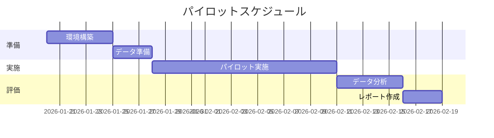
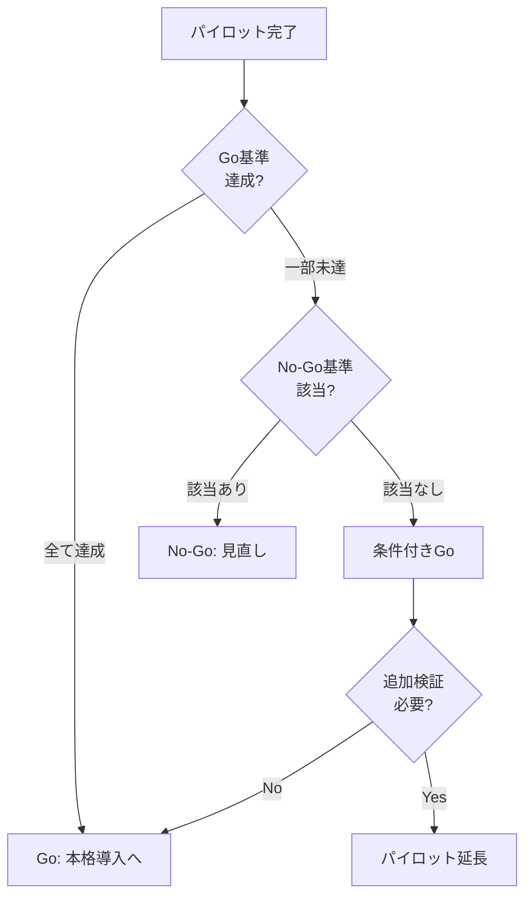

# PILOT_APPROVAL レポートテンプレート

**成功条件タイプ**: PoC/パイロット承認
**特徴**: PoC計画、Go/No-Go基準、スケールアップパス

---

# [レポートタイトル]

**作成日時**: [YYYY-MM-DD HH:MM] (JST)
**バージョン**: v[X.Y]
**成功条件**: PoC/パイロット承認（PILOT_APPROVAL）

## 変更履歴

| バージョン | 日時 | 変更内容 |
|-----------|------|----------|
| v1.0 | [YYYY-MM-DD HH:MM] (JST) | 初版作成 |

---

## 🧪 パイロット概要

### 一言で言うと

**[何を、どのくらいの規模で、いつまでに検証するか]**

### パイロット基本情報

| 項目 | 内容 |
|------|------|
| **検証対象** | [何を検証するか] |
| **期間** | [開始日] 〜 [終了日]（[X]週間） |
| **規模** | [対象ユーザー数、対象範囲] |
| **予算** | [金額] |
| **成功基準** | [主要KPI] |

### なぜパイロットが必要か

1. **[理由1]**: [説明]
2. **[理由2]**: [説明]
3. **[理由3]**: [説明]

---

## 🎯 検証仮説

### 主要仮説

| # | 仮説 | 検証方法 | 成功基準 |
|---|------|----------|----------|
| H1 | [仮説1] | [方法] | [基準] |
| H2 | [仮説2] | [方法] | [基準] |
| H3 | [仮説3] | [方法] | [基準] |

### 仮説が正しければ

[仮説が検証されたら、どんな価値が生まれるか]

### 仮説が間違っていれば

[仮説が否定されたら、何がわかるか・どう方向転換するか]

---

## 📋 パイロット計画

### スケジュール

### フェーズ詳細

| フェーズ | 期間 | 実施内容 | 成果物 |
|---------|------|----------|--------|
| **準備** | [期間] | [内容] | [成果物] |
| **実施** | [期間] | [内容] | [成果物] |
| **評価** | [期間] | [内容] | [成果物] |

### 対象範囲

| 項目 | パイロット | 本番（想定） |
|------|-----------|-------------|
| ユーザー数 | [X]名 | [Y]名 |
| 対象部署 | [部署名] | 全社 |
| 機能範囲 | [限定機能] | フル機能 |
| 期間 | [X]週間 | 継続 |

---

## ✅ Go/No-Go基準

### Go基準（本格導入へ進む条件）

| # | 基準 | 目標値 | 最低値 | 測定方法 |
|---|------|--------|--------|----------|
| 1 | [KPI1] | [目標] | [最低] | [方法] |
| 2 | [KPI2] | [目標] | [最低] | [方法] |
| 3 | [KPI3] | [目標] | [最低] | [方法] |

### No-Go基準（中止・見直しの条件）

| # | 基準 | 該当条件 |
|---|------|----------|
| 1 | 重大障害 | [条件] |
| 2 | ユーザー拒否 | [条件] |
| 3 | コスト超過 | [条件] |

### 判定フロー

---

## 📈 スケールアップパス

### パイロット後のロードマップ

| フェーズ | 期間 | 規模 | 予算 |
|---------|------|------|------|
| **パイロット** | [期間] | [規模] | [金額] |
| **Phase 1展開** | [期間] | [規模] | [金額] |
| **Phase 2展開** | [期間] | [規模] | [金額] |
| **全社展開** | [期間] | [規模] | [金額] |

### スケールアップの前提条件

1. **[条件1]**: [説明]
2. **[条件2]**: [説明]
3. **[条件3]**: [説明]

### 本格導入時の期待効果

| 指標 | パイロット | 本格導入 |
|------|-----------|----------|
| [指標1] | [値] | [値] |
| [指標2] | [値] | [値] |
| [指標3] | [値] | [値] |

---

## 💰 パイロット予算

### 予算内訳

| 項目 | 金額 | 備考 |
|------|------|------|
| [項目1] | [金額] | [備考] |
| [項目2] | [金額] | [備考] |
| [項目3] | [金額] | [備考] |
| **合計** | **[金額]** | - |

### 本格導入との比較

| | パイロット | 本格導入 |
|---|-----------|----------|
| 投資額 | [金額] | [金額] |
| リスク | 限定的 | [レベル] |
| 学習効果 | 高 | - |

---

## ⚠️ リスクと対策

### パイロット固有のリスク

| リスク | 影響度 | 対策 |
|--------|--------|------|
| [リスク1] | [高/中/低] | [対策] |
| [リスク2] | [影響度] | [対策] |
| [リスク3] | [影響度] | [対策] |

### 撤退計画

- **撤退判断時期**: [日付]
- **撤退時の対応**: [対応内容]
- **撤退時の損失**: [金額]

---

## ✅ 承認依頼事項

### 承認いただきたい事項

1. [ ] パイロット実施: [開始日] 〜 [終了日]
2. [ ] パイロット予算: **[金額]**
3. [ ] 対象範囲: [対象]
4. [ ] Go/No-Go判定日: [日付]

### 承認後のアクション

1. [アクション1]（[日付]まで）
2. [アクション2]（[日付]まで）
3. [アクション3]（[日付]まで）

### 次回報告

- **中間報告**: [日付]
- **最終報告**: [日付]

---

## 📎 付録

### A. 詳細計画書

[詳細な計画内容]

### B. 参考事例

[他社のPoC事例など]

### C. 参考文献

[参考文献リスト]

---

## 文書管理情報

| 項目 | 内容 |
|------|------|
| **文書ID** | REPORT-[YYYYMMDD]-[NNN] |
| **初版作成日時** | [YYYY-MM-DD HH:MM] (JST) |
| **最終更新日時** | [YYYY-MM-DD HH:MM] (JST) |
| **作成者** | [作成者名] |
| **ステータス** | Draft / Review / Final |
| **機密レベル** | Internal / Confidential / Restricted |

---

**📝 ペルソナ調整メモ**:
- innovation重視: スケールアップパスを詳細に
- risk重視: Go/No-Go基準、撤退計画を充実
- data_driven: KPIと測定方法を明確に
- beginner: 専門用語に注釈を追加すること
