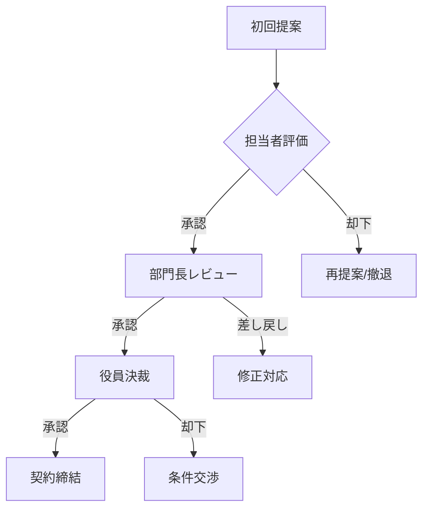

# {{company_name}} 向けセールスプレイブック

> **案件名**: {{opportunity_name}}  
> **ターゲット企業**: {{company_name}}  
> **提案内容**: {{proposal_summary}}  
> **作成日時**: {{created_datetime}} (JST)

---

## 変更履歴

| バージョン | 日時 | 変更内容 |
|-----------|------|----------|
| v1.0 | {{created_datetime}} (JST) | 初版作成 |

---

## 1. エグゼクティブサマリー

### 1.1 提案概要

| 項目 | 内容 |
|------|------|
| **提案内容** | {{proposal_summary}} |
| **想定効果** | {{expected_benefit}} |
| **投資規模** | {{investment_range}} |
| **実現期間** | {{timeline}} |

### 1.2 推奨アプローチ

{{#each recommended_approaches}}
- **{{this.phase}}**: {{this.action}}
{{/each}}

### 1.3 成功条件

- **タイプ**: {{success_condition_type}}
- **キーポイント**: {{success_key_points}}

---

## 2. ターゲットペルソナ分析

### 2.1 主要意思決定者

{{#each personas}}
#### {{this.role}} - {{this.name}}

| 項目 | 内容 |
|------|------|
| **決裁スタイル** | {{this.decision_style}} |
| **専門レベル** | {{this.domain_knowledge}} |
| **重視ポイント** | {{this.priorities}} |
| **想定される反論** | {{this.expected_objections}} |

**アプローチ戦略**:
{{this.approach_strategy}}

{{/each}}

### 2.2 意思決定フロー



---

## 3. 反論対応ガイド

### 3.1 想定される反論一覧

| # | 反論タイプ | 想定フレーズ | 対応戦略 | 難易度 |
|---|-----------|-------------|----------|--------|
{{#each objections}}
| {{@index}} | {{this.type}} | 「{{this.phrase}}」 | {{this.strategy}} | {{this.difficulty}} |
{{/each}}

### 3.2 反論対応詳細

{{#each objections}}
#### 反論{{@index}}: {{this.type}}

**想定フレーズ**: 「{{this.phrase}}」

**根本原因**: {{this.root_cause}}

**対応スクリプト**:

> **Step 1: 共感・受容**
> {{this.script.acknowledgment}}

> **Step 2: リフレーミング**
> {{this.script.reframing}}

> **Step 3: 次のステップ提案**
> {{this.script.next_step}}

**エビデンス**:
{{#each this.evidence}}
- {{this}}
{{/each}}

---
{{/each}}

---

## 4. 会話フローガイド

### 4.1 初回面談フロー

```
[オープニング] 5分
├── 自己紹介・アイスブレイク
├── 本日のアジェンダ確認
└── 相手の期待値確認

[ヒアリング] 15分
├── 現状の課題・ペイン
├── 検討の背景・きっかけ
├── 決裁プロセス確認
└── 競合状況確認

[提案] 20分
├── 課題の整理・共有
├── ソリューション概要
├── 導入効果（定量・定性）
└── 導入事例

[クロージング] 10分
├── 質疑応答
├── 次のステップ提案
└── 宿題事項の確認
```

### 4.2 フェーズ別会話ガイド

#### オープニング

**推奨スクリプト**:
```
本日はお時間をいただきありがとうございます。
{{opening_script}}
```

#### ヒアリング（質問リスト）

{{#each discovery_questions}}
- {{this}}
{{/each}}

#### 提案

**キーメッセージ**:
{{#each key_messages}}
1. {{this}}
{{/each}}

#### クロージング

**次のステップ提案**:
```
{{closing_script}}
```

---

## 5. ターゲット別シナリオ

### 5.1 {{persona_1_name}} 向けシナリオ

**重視ポイント**: {{persona_1_priorities}}

**カスタマイズ内容**:
{{#each persona_1_customization}}
- {{this}}
{{/each}}

**専用トークスクリプト**:
{{persona_1_script}}

### 5.2 {{persona_2_name}} 向けシナリオ

**重視ポイント**: {{persona_2_priorities}}

**カスタマイズ内容**:
{{#each persona_2_customization}}
- {{this}}
{{/each}}

**専用トークスクリプト**:
{{persona_2_script}}

### 5.3 {{persona_3_name}} 向けシナリオ

**重視ポイント**: {{persona_3_priorities}}

**カスタマイズ内容**:
{{#each persona_3_customization}}
- {{this}}
{{/each}}

**専用トークスクリプト**:
{{persona_3_script}}

---

## 6. 補足資料

### 6.1 競合比較表

| 項目 | 自社 | 競合A | 競合B |
|------|------|-------|-------|
{{#each competitive_comparison}}
| {{this.item}} | {{this.us}} | {{this.competitor_a}} | {{this.competitor_b}} |
{{/each}}

### 6.2 導入事例サマリー

{{#each case_studies}}
#### {{this.company_name}}（{{this.industry}}）

- **課題**: {{this.challenge}}
- **ソリューション**: {{this.solution}}
- **効果**: {{this.result}}
- **担当者コメント**: 「{{this.testimonial}}」

{{/each}}

### 6.3 FAQ

{{#each faq}}
**Q: {{this.question}}**

A: {{this.answer}}

{{/each}}

---

## 文書管理情報

| 項目 | 内容 |
|------|------|
| **文書ID** | PLAYBOOK-{{document_id}} |
| **初版作成日時** | {{created_datetime}} (JST) |
| **最終更新日時** | {{updated_datetime}} (JST) |
| **作成者** | {{author}} |
| **ステータス** | {{status}} |
| **機密レベル** | {{confidentiality}} |
