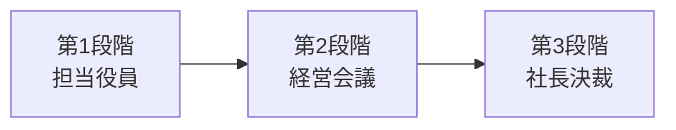

# STAGED_APPROVAL レポートテンプレート

**成功条件タイプ**: 段階的承認（役員→社長等）
**特徴**: 段階別サマリー、詳細付録

---

# [レポートタイトル]

**作成日時**: [YYYY-MM-DD HH:MM] (JST)
**バージョン**: v[X.Y]
**成功条件**: 段階的承認（STAGED_APPROVAL）

## 変更履歴

| バージョン | 日時 | 変更内容 |
|-----------|------|----------|
| v1.0 | [YYYY-MM-DD HH:MM] (JST) | 初版作成 |

---

## 📋 承認フロー

| 段階 | 決裁者 | 判断ポイント | 予定日 |
|------|--------|-------------|--------|
| 1 | [役職名] | [何を判断するか] | [日付] |
| 2 | [役職名] | [何を判断するか] | [日付] |
| 3 | [役職名] | [何を判断するか] | [日付] |

---

## 🔷 第1段階向けサマリー（[役職名]用）

### 結論

**[1文で結論]**

### 判断ポイント

1. **[ポイント1]**: [説明]
2. **[ポイント2]**: [説明]
3. **[ポイント3]**: [説明]

### 推奨判断

✅ **[推奨アクション]** → 次段階へ進めることを推奨

### この段階で確認すべきこと

- [ ] [確認事項1]
- [ ] [確認事項2]
- [ ] [確認事項3]

---

## 🔷 第2段階向けサマリー（[役職名]用）

### 前段階の承認状況

- **第1段階**: ✅ 承認済（[日付]）
- **承認者コメント**: [コメントがあれば]

### 結論

**[1文で結論]**

### 判断ポイント

1. **[ポイント1]**: [説明]
2. **[ポイント2]**: [説明]

### 推奨判断

✅ **[推奨アクション]** → 次段階へ進めることを推奨

---

## 🔷 第3段階向けサマリー（[役職名]用）

### 承認履歴

| 段階 | 承認者 | 判断 | 日付 |
|------|--------|------|------|
| 1 | [役職名] | ✅ 承認 | [日付] |
| 2 | [役職名] | ✅ 承認 | [日付] |

### エグゼクティブサマリー

**[3文以内で全体を要約]**

### 最終判断ポイント

1. **戦略的意義**: [説明]
2. **投資対効果**: [説明]
3. **リスクと対策**: [説明]

### 推奨判断

✅ **[最終推奨アクション]**

---

## 📊 詳細分析

### 1. 背景・目的

[背景と目的の詳細]

### 2. 提案内容

[提案の詳細]

### 3. 財務計画

| 項目 | 金額 | 備考 |
|------|------|------|
| 初期投資 | [金額] | [備考] |
| 年間コスト | [金額] | [備考] |
| 年間効果 | [金額] | [備考] |

### 4. リスク分析

[リスク分析の詳細]

### 5. スケジュール

[スケジュールの詳細]

---

## 📎 付録

### A. 詳細データ

[詳細データ]

### B. 参考文献

[参考文献リスト]

---

## 文書管理情報

| 項目 | 内容 |
|------|------|
| **文書ID** | REPORT-[YYYYMMDD]-[NNN] |
| **初版作成日時** | [YYYY-MM-DD HH:MM] (JST) |
| **最終更新日時** | [YYYY-MM-DD HH:MM] (JST) |
| **作成者** | [作成者名] |
| **ステータス** | Draft / Review / Final |
| **機密レベル** | Internal / Confidential / Restricted |

---

**📝 ペルソナ調整メモ**:
- 各段階のサマリーは、その決裁者のペルソナに合わせて調整すること
- 段階が進むほど、要約度を上げる
