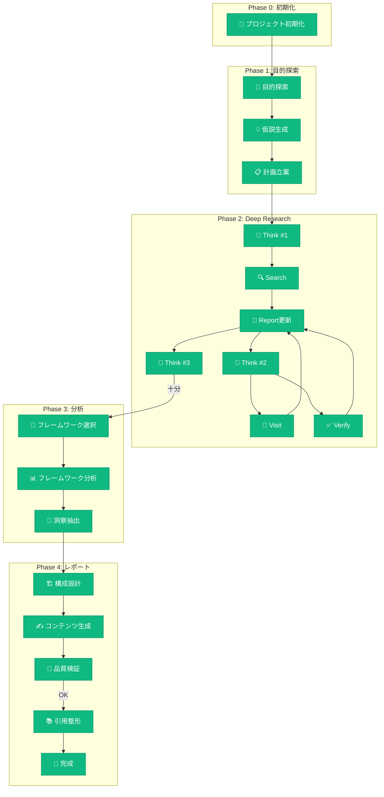

# [レポートタイトル] - 思考フロー付きレポート

**作成日時**: [YYYY-MM-DD HH:MM] (JST)
**バージョン**: v[X.Y]
**プロジェクトID**: pjXXXXX

## 変更履歴

| バージョン | 日時 | 変更内容 |
|-----------|------|----------|
| v1.0 | [YYYY-MM-DD HH:MM] (JST) | 初版作成 |

---

## 🎯 エグゼクティブサマリー

### 一言で言うと

> **[この報告の本質を1文で]**

### 主要な発見事項

| # | 発見 | 信頼度 | ソース |
|---|------|--------|--------|
| 1 | [発見1] | ⭐⭐⭐⭐⭐ | [[1]](#ref-1) |
| 2 | [発見2] | ⭐⭐⭐⭐ | [[2]](#ref-2), [[3]](#ref-3) |
| 3 | ⚠️ [単一ソースの発見] | ⭐⭐⭐ | [[4]](#ref-4) |

### 推奨アクション

1. **[アクション1]** - 優先度: 高
2. **[アクション2]** - 優先度: 中
3. **[アクション3]** - 優先度: 低

---

## 📋 背景・目的

### 調査背景

[なぜこの調査が必要になったか]

### 調査目的（JTBDで特定）

| Jobs to Be Done | 説明 |
|-----------------|------|
| 機能的ジョブ | [達成したいタスク] |
| 感情的ジョブ | [感じたい/避けたい感情] |
| 社会的ジョブ | [他者からの評価] |

### 調査スコープ

- **対象**: [調査対象]
- **期間**: [対象期間]
- **除外事項**: [調査対象外]

---

## 🔬 調査結果

### トピック1: [トピック名]

[調査結果の詳細]

| 項目 | 内容 | ソース |
|------|------|--------|
| [項目1] | [内容] | [[1]](#ref-1) |
| [項目2] | [内容] | [[2]](#ref-2) |

### トピック2: [トピック名]

[調査結果の詳細]

---

## 📊 分析・考察

### 適用フレームワーク

[フレームワーク分析結果]

### 重要な洞察

| 洞察 | 根拠 | 示唆 |
|------|------|------|
| [洞察1] | [根拠] | [アクション示唆] |
| [洞察2] | [根拠] | [アクション示唆] |

---

## ✅ 結論・提言

### 結論

[主要な結論]

### 提言

| 提言 | 期待効果 | 必要リソース | 優先度 |
|------|----------|--------------|--------|
| [提言1] | [効果] | [リソース] | P0 |
| [提言2] | [効果] | [リソース] | P1 |

### 次のステップ

1. [ステップ1]
2. [ステップ2]
3. [ステップ3]

---

## 📐 思考フロー・トレース（v1.20.0）🆕

> このレポートはどのような思考プロセスを経て作成されたかを示します。
> 読者はこのセクションで調査の透明性・信頼性を確認できます。

### 🗺️ フローマップ



### 📜 思考ログ

| # | 時刻 | ステップ | 判断内容 | 信頼度 |
|---|------|---------|---------|--------|
| 1 | [HH:MM] | 🚀 初期化 | プロジェクト作成、関連ナレッジ[X]件継承 | - |
| 2 | [HH:MM] | 🎯 目的探索 | [特定された真の目的] | ⭐⭐⭐⭐ |
| 3 | [HH:MM] | 💡 仮説生成 | [初期仮説の内容] | ⭐⭐⭐ |
| 4 | [HH:MM] | 📋 計画立案 | タスク[X]件、推定時間[Y]分 | - |
| 5 | [HH:MM] | 🧠 Think #1 | [現状分析の結果] | ⭐⭐⭐ |
| 6 | [HH:MM] | 🔍 検索 | クエリ: "[検索語]" → [X]件取得 | - |
| 7 | [HH:MM] | 📖 詳細調査 | [URL] から [抽出内容] | ⭐⭐⭐⭐ |
| 8 | [HH:MM] | 🧠 Think #2 | **仮説修正**: [修正内容] | ⭐⭐⭐⭐ |
| 9 | [HH:MM] | ✅ 検証 | [X]ソースで交差検証完了 | ⭐⭐⭐⭐⭐ |
| 10 | [HH:MM] | 🔧 FW選択 | [選択したフレームワーク]を適用 | - |
| 11 | [HH:MM] | 💎 洞察抽出 | [主要な洞察] | ⭐⭐⭐⭐ |
| 12 | [HH:MM] | 🔬 品質検証 | ハルシネーション検出: [X]件修正 | - |
| 13 | [HH:MM] | 🎉 完成 | スコア: [X]/10 | - |

### 🔀 重要な判断ポイント（ピボット記録）

| ポイント | 元の方向 | 変更後 | 変更理由 |
|---------|---------|--------|----------|
| **仮説修正** | [元の仮説] | [修正後の仮説] | [理由] |
| **スコープ変更** | [元のスコープ] | [修正後] | [理由] |
| **追加調査** | - | [追加内容] | [発見されたギャップ] |

### 🚧 デッドエンド（中止した調査）

| 調査内容 | 中止理由 | 得られた学び |
|---------|---------|-------------|
| [調査1] | [理由] | [学び] |

### 📈 思考メトリクス

| 指標 | 値 | 評価 | 説明 |
|------|-----|------|------|
| 調査ラウンド数 | [X] | ✅/⚠️/❌ | 3-7が目安 |
| 交差検証率 | [X]% | ✅/⚠️/❌ | 70%以上が目標 |
| ソース多様性 | [X]ドメイン | ✅/⚠️/❌ | 5+が目標 |
| 仮説修正回数 | [X] | - | 柔軟な思考の証 |
| デッドエンド数 | [X] | - | 探索の幅 |
| 総所要時間 | [X]分 | - | - |

### 🎯 思考の質スコア

```
[██████████░░░░░░░░░░] 総合: [X]/10

内訳:
├─ 情報収集の深さ:    [X]/10 ████████░░
├─ 検証の厳密さ:      [X]/10 █████████░
├─ 分析の論理性:      [X]/10 ███████░░░
├─ 洞察の独自性:      [X]/10 ██████░░░░
└─ 結論の実用性:      [X]/10 ████████░░
```

---

## 📚 参考文献

<a id="ref-1">[1]</a> [タイトル1](URL1) - YYYY-MM-DD, ドメイン種別: [公式/学術/メディア]

<a id="ref-2">[2]</a> [タイトル2](URL2) - YYYY-MM-DD, ドメイン種別: [公式/学術/メディア]

<a id="ref-3">[3]</a> [タイトル3](URL3) - YYYY-MM-DD, ドメイン種別: [公式/学術/メディア]

<a id="ref-4">[4]</a> [タイトル4](URL4) - YYYY-MM-DD, ドメイン種別: [公式/学術/メディア] ⚠️ 単一ソース

---

## 付録

### A. 検索クエリログ

| # | クエリ | 言語 | 結果数 | 使用数 |
|---|--------|------|--------|--------|
| 1 | [クエリ1] | 日本語 | [X] | [Y] |
| 2 | [クエリ2] | English | [X] | [Y] |

### B. 訪問ページログ

| # | URL | 抽出内容 | 信頼度 |
|---|-----|---------|--------|
| 1 | [URL1] | [内容サマリー] | ⭐⭐⭐⭐ |
| 2 | [URL2] | [内容サマリー] | ⭐⭐⭐⭐⭐ |

---

*このレポートはSHIKIGAMI v1.20.0で生成されました。思考フロー可視化機能により、調査プロセスの透明性を確保しています。*
