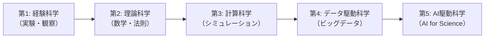
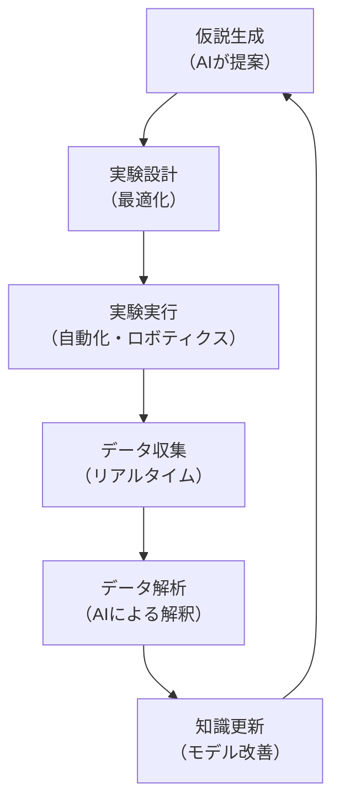
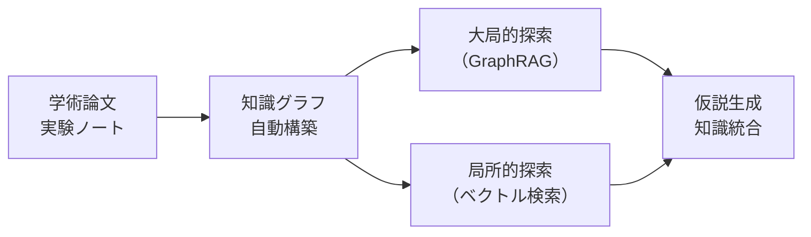

## はじめに

**AI for Science**とは、機械学習・深層学習をはじめとするAI技術を科学研究に適用し、新たな発見や理解の加速を目指すアプローチです。序論では日本の政策動向を概観しましたが、この概念はどのように生まれたのでしょうか。

本章では、AI for Scienceという言葉の起源である2020年の米国DOE報告書をもとに、その定義・背景・意義を詳しく解説します。

## 「AI for Science」という言葉の誕生

「AI for Science」という用語が公式な文書としてはじめて登場したのは、2020年2月に公開された米国エネルギー省（DOE: Department of Energy）の報告書です。

> **AI for Science: Report on the Department of Energy (DOE) Town Halls on Artificial Intelligence (AI) for Science**[^1]

[^1]: Stevens, R., Taylor, V., Nichols, J., Maccabe, A.B., Yelick, K., Brown, D. (2020). *AI for Science: Report on the Department of Energy (DOE) Town Halls on Artificial Intelligence (AI) for Science*. Argonne National Laboratory. DOI: 10.2172/1604756

この報告書の背景には、2019年7月から10月にかけて開催された**4回のタウンホールミーティング**があります。会場はアルゴンヌ国立研究所（Argonne National Laboratory）、オークリッジ国立研究所（Oak Ridge National Laboratory）、ローレンス・バークレー国立研究所（Lawrence Berkeley National Laboratory）、ワシントンDCの4拠点です。1,000人以上の科学者・エンジニアが参加し、今後10年間におけるAI・ビッグデータ・ハイパフォーマンスコンピューティング（HPC）の科学的機会を議論しました。

## AI for Scienceの定義

DOEの報告書では、**AI for Science**を以下のように定義しています。

> コンピューティングにおける次世代の手法と科学的機会を広く表す用語であり、AI手法（機械学習、深層学習、統計的手法、データ分析、自動制御など）の開発と応用を通じて、データからモデルを構築し、それらのモデルを単独で、あるいはシミュレーションやスケーラブルコンピューティングと組み合わせて、科学研究を推進すること。

つまり、AI for Scienceは単に「科学にAIを使うこと」にとどまりません。以下の要素を包括的に含む概念です。

| 要素 | 内容 |
| ---- | ---- |
| **機械学習・深層学習** | データからパターンを学習し、予測・分類・生成を行う |
| **統計的手法** | ベイズ推定、因果推論など、科学的データの解析 |
| **データ分析** | 大規模実験データ・シミュレーションデータの処理と知識抽出 |
| **自動制御** | 実験装置の自律的運用、ロボティックラボ |
| **シミュレーション連携** | AIモデルとシミュレーションの融合（サロゲートモデリングなど） |
| **HPC活用** | スーパーコンピューター上での大規模AI計算 |

## 従来の科学研究との違い

科学研究のパラダイムは歴史的に大きく変遷してきました。AI for Scienceは、この流れの中で**第5のパラダイム**とも呼ばれています。

### 各パラダイムの特徴

1. **経験科学（Empirical Science）**: 実験と観察に基づく自然現象の記述
2. **理論科学（Theoretical Science）**: 数学的法則による現象のモデル化（ニュートン力学、マクスウェル方程式など）
3. **計算科学（Computational Science）**: コンピューターシミュレーションによる複雑系の解析
4. **データ駆動科学（Data-Driven Science）**: 大量データの統計的処理による知識発見
5. **AI駆動科学（AI-Driven Science）**: AIが仮説生成・実験設計・データ解析を統合的に行う

:::message
AI for Scienceの本質は、AIを科学の「道具」としてだけ使うのではなく、**科学的発見のプロセスそのものを変革する**点にあります。
:::

## AI for Scienceの3つの柱

AI for Scienceのアプローチは、大きく3つの柱で構成されます。

### 1. AIによる科学的発見の加速

従来、人間の研究者が長い時間をかけて行っていたプロセスを、AIが大幅に加速します。

- **パターン発見**: 膨大な実験データの中から、人間の目では見落とすパターンを検出
- **仮説生成**: データに基づいて新しい科学的仮説を自動的に提案
- **実験最適化**: ベイズ最適化などの手法で、効率的な実験計画を設計

:::details 具体例：タンパク質構造予測
Google DeepMindのAlphaFoldは、アミノ酸配列からタンパク質の3次元構造を高精度に予測できるようになりました。これにより、従来X線結晶構造解析で数か月〜数年かかっていた構造決定が、数分で可能になりました。
:::

### 2. AIとシミュレーションの融合

AI for Scienceの重要な特徴は、AIモデルと物理シミュレーションを組み合わせる点です。

- **サロゲートモデル**: 計算コストの高いシミュレーションの代理モデルをAIで構築
- **物理制約付き学習（Physics-Informed Learning）**: 物理法則を学習に組み込むことで、少ないデータでも高精度な予測を実現
- **逆問題の解法**: 望ましい特性を実現する材料・分子の設計

$$
\mathcal{L} = \mathcal{L}_{\text{data}} + \lambda \mathcal{L}_{\text{physics}}
$$

上の式は、物理情報ニューラルネットワーク（PINN: Physics-Informed Neural Network）の損失関数の基本形です。データへの適合（$\mathcal{L}_{\text{data}}$）と物理法則への整合性（$\mathcal{L}_{\text{physics}}$）をバランスさせて学習を行います。

### 3. 自律的な科学研究システム

AI for Scienceの究極的な目標の1つは、**自律的な研究サイクル**の実現です。これには「実験の自律化」と「知識探索の自律化」の2つの側面があります。

#### 実験の自律化：Self-Driving Laboratory

この「仮説→実験→解析→知識更新」のサイクルをAIが自律的に回すことで、科学的発見の速度を飛躍的に高めることができます。これは**Self-Driving Laboratory（自律実験室）** とも呼ばれ、材料科学や化学の分野で実用化が進んでいます。

#### 知識探索の自律化：科学文献マイニング

自律的な研究システムにおいて、もう1つの重要な要素が**既存知識の探索と統合**です。科学研究では膨大な学術論文・実験ノート・プレプリントを横断的に読み解く必要がありますが、年間数百万本のペースで増え続ける論文をすべて把握することは人間には不可能です。

ここで注目されているのが、**GraphRAG**（Graph-based Retrieval Augmented Generation）のような知識グラフベースの探索技術です。MicrosoftのGraphRAGは大規模文書群から知識グラフを自動構築し、個々の論文に閉じない**分野横断的な問い**（「材料Xとタンパク質Yの相互作用に関する知見は何か」など）に答えることを可能にします。さらに軽量版の**Lazy GraphRAG**は、初期インデクシングコストを大幅に削減しながら、局所的・大局的の両方の問いに対応できます。

こうした技術により、**AIエージェントが文献調査から仮説生成までを自律的に行う**ことが現実味を帯びてきました。文部科学省の科学研究革新プログラムでも「AIエージェント開発」が事業内容として位置づけられている背景には、こうした知識探索の自動化への期待があります[^2]。

[^2]: 文部科学省「AI for Scienceに関する令和7年度補正予算および令和8年度当初予算案について」AI for Science推進委員会（第1回）資料、令和8年2月9日（https://www.mext.go.jp/content/20260209-mxt_jyohoka01-000047243_3.pdf）

## AI for Scienceの対象分野

DOEの報告書では、AI for Scienceがとくに大きなインパクトを持つ分野として、以下が挙げられています。

| 分野 | AIの活用例 |
| ---- | ---- |
| **材料科学** | 新規材料の探索・物性予測、結晶構造生成 |
| **素粒子物理学** | 加速器実験データの解析、新粒子の探索 |
| **化学・分子科学** | 分子シミュレーションの高速化、反応経路予測 |
| **地球科学・気候** | 気象予測、気候変動モデリング |
| **生命科学** | タンパク質構造予測、ゲノム解析、創薬 |
| **エネルギー** | 核融合プラズマ制御、バッテリー設計 |
| **ナノテクノロジー** | ナノ構造設計、機能性材料の探索 |
| **工学** | 設計最適化、故障予測、プロセス制御 |

:::message
本書では、この中からとくに**分子シミュレーション**（第6章）、**材料探索**（第7章）、**創薬**（第8章）、**気象・気候予測**（第9章）を取り上げて、具体的なAIの活用方法を解説します。
:::

## なぜ今AI for Scienceなのか

AI for Scienceが急速に発展している背景には、いくつかの技術的・社会的要因があります。

### 計算資源の飛躍的向上

GPU・TPUなどのアクセラレーターの進歩と、クラウドコンピューティングの普及により、大規模なAIモデルの訓練が現実的になりました。エクサスケール・スーパーコンピューター（例：米国のFrontier、Aurora）は、AIとHPCを統合した科学計算の基盤を提供しています。

### 科学データの爆発的増加

大型加速器、天文台、ゲノム解析装置など、現代の科学機器は膨大なデータを生成します。たとえば、欧州の大型ハドロン衝突型加速器（LHC）は年間約50ペタバイトのデータを生み出します。こうしたデータから知識を抽出するには、AIの力が不可欠です。

### 深層学習の革命

2012年のAlexNet以降、深層学習は画像認識・自然言語処理で驚異的な成果を上げてきました。これらの手法が科学分野に応用され始めたことで、従来不可能だった問題の解決が可能になりつつあります。

### 学際的コミュニティの形成

AI研究者と各分野の科学者が協力する学際的コミュニティが形成され、ドメイン知識とAI技術の融合が加速しています。DOEのタウンホールミーティング自体が、まさにこのコミュニティ形成の取り組みでした。

## AI for Scienceの課題

AI for Scienceには大きな可能性がありますが、同時にいくつかの重要な課題も存在します。

### 解釈可能性と信頼性

科学において、結果の「なぜ」を理解することは極めて重要です。ブラックボックスなAIモデルの予測は、科学的理解に直結しない場合があります。**説明可能AI（XAI: Explainable AI）**の研究が重要視されています。

### データの品質と偏り

AIモデルは訓練データの品質に大きく依存します。科学データには測定誤差、系統的バイアス、欠損値などが含まれることが多く、これらに適切に対処する必要があります。

### 再現性

科学研究の基本原則である再現性が、AIを用いた研究では課題になることがあります。モデルの初期値、ハイパーパラメータ、データの前処理など、結果に影響する要素が多いためです。

### ドメイン知識との統合

AI技術だけでは不十分で、対象分野の深い知識（ドメイン知識）と組み合わせることが不可欠です。物理法則や化学的制約をAIモデルにどのように組み込むかは、活発な研究テーマです。

## DOE報告書以降の発展

2020年のDOE報告書以降、AI for Scienceは急速に発展しました。AlphaFold2によるタンパク質構造予測の革命（2020年）、DOE後続報告書の公開（2023年）、そして2024年にはノーベル物理学賞（HopfieldとHintonによる機械学習の基礎研究）とノーベル化学賞（Bakerによる計算タンパク質設計およびHassabisとJumperによるタンパク質構造予測）のAI・計算科学研究者に授与されました。わずか数年で科学の歴史を塗り替える成果が次々と生まれています。

:::message
DOE報告書以降の発展の詳細については、次章（第2章）で年表とともに詳しく解説します。
:::

## まとめ

AI for Scienceは、AI技術を活用して科学的発見を加速し、科学研究のあり方そのものを変革する新しいパラダイムです。2020年のDOE報告書ではじめて体系的に定義されたこの概念は、わずか数年で世界中に広がり、物理学、化学、生命科学、材料科学、地球科学など、あらゆる科学分野でブレークスルーを生み出しています。

次章では、2020年のDOE報告書以降にAI for Scienceがどのように発展してきたか、主要なマイルストーンを詳しく辿ります。

:::message
**この章のポイント**
- AI for Scienceは、AI技術を科学研究に適用して発見を加速するパラダイム
- 用語の起源は2020年の米国DOE報告書（OSTI ID: 1604756）
- 機械学習、シミュレーション連携、自律実験の3つの柱で構成される
- 材料科学、創薬、気象予測など幅広い分野で応用が進んでいる
:::
