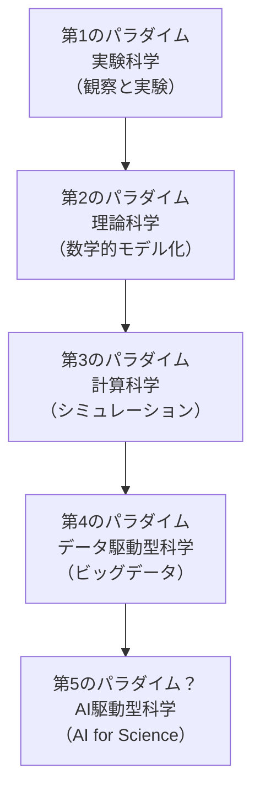
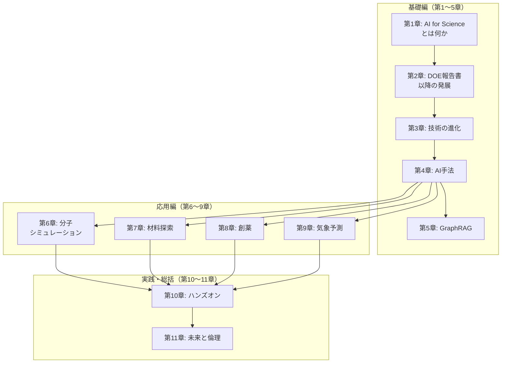

## はじめに

前章までの内容で、AI for Scienceの理論的基盤、主要な応用分野、そして実際のPython実装まで幅広く解説してきました。最終章となる本章では、AI for Scienceの**未来の方向性**と、そこで避けて通れない**倫理的課題**を考察します。

AI for Scienceは科学研究を加速する強力な手段ですが、その一方で、再現性、透明性、公平性、安全性に関する新たな問題を生じさせています。これらの課題に向き合うことは、AI for Scienceの健全な発展にとって不可欠です。

## AI for Scienceの未来

### 科学基盤モデルの発展

第3章と第4章で解説したように、大規模言語モデル（LLM）の成功に触発された**科学基盤モデル（Foundation Models for Science）** の開発が加速しています。各分野の基盤モデルの現状と今後の展望をまとめます。

| 分野 | 代表的モデル | 現状 | 今後の展開 |
| ---- | ---- | ---- | ---- |
| **タンパク質構造** | AlphaFold2/3 | 2億構造予測済み | 動的構造・相互作用予測へ |
| **分子シミュレーション** | MACE-MP-0, MatterSim | 汎用力場の実現 | マルチスケール統合 |
| **気象予測** | Aurora, GenCast | NWPを凌駕 | データ同化統合、気候予測 |
| **材料探索** | GNoME | 220万構造予測 | 合成可能性予測との統合 |
| **創薬** | RFdiffusion, Uni-Mol | タンパク質設計・VS | エンドツーエンドの創薬AI |
| **化学** | ChemBERTa, UniMol | 分子特性予測 | 反応予測・合成経路の統合 |

序論で紹介した日本のTRIP-AGISプログラムは、こうした科学基盤モデルの**国産化と共用化**を目指しています。分野を横断する汎用的な科学基盤モデルの開発は、AI for Scienceの次なるフロンティアです。

### 自律型研究の進展

第4章で触れた能動学習とベイズ最適化の発展形として、**自律型研究（Autonomous Research）** が現実のものとなりつつあります。

| 世代 | 特徴 | 人間の役割 | 事例 |
| ---- | ---- | ---- | ---- |
| **第1世代** | 実験の自動化 | 仮説設定と解釈 | ハイスループット実験 |
| **第2世代** | 実験設計のAI化 | 目標設定と評価 | ベイズ最適化による材料探索 |
| **第3世代** | 仮説生成のAI化 | 研究目標の設定のみ | LLMエージェント + 自律ラボ |
| **第4世代（将来）** | 完全自律的な発見 | 研究の方向性の監督 | AIサイエンティスト |

:::message
2024年には、LLMエージェントが既存の論文を分析し、仮説を生成し、実験計画を立案するシステム（Coscientist等）が報告されています。ただし、現状では人間の監督なしに信頼性の高い科学的発見を行うことはまだ困難であり、当面は**人間とAIの協働**が基本的なパラダイムとなります。
:::

### マルチモーダルAIと科学

科学データは本質的に**マルチモーダル**です。テキスト（論文、実験ノート）、数値データ（測定値、シミュレーション結果）、画像（顕微鏡像、スペクトル）、3D構造（分子、結晶）など、多様な形式のデータを統合的に扱うAIモデルの開発が進んでいます。

| モダリティー | データ例 | 関連するAI手法 |
| ---- | ---- | ---- |
| **テキスト** | 論文、特許、実験プロトコル | LLM、GraphRAG（第5章） |
| **3D構造** | 分子座標、結晶構造 | 等変GNN（第4章、第6章） |
| **画像** | 顕微鏡像、回折パターン | CNN、Vision Transformer |
| **時系列** | 気象データ、反応速度 | RNN、Transformer（第9章） |
| **グラフ** | 分子グラフ、反応ネットワーク | GNN（第4章） |

たとえば、論文のテキストから実験条件を抽出し、分子の3D構造と組み合わせて物性を予測するようなマルチモーダルモデルは、科学研究の生産性を飛躍的に向上させる可能性があります。

### 科学的発見のパラダイムシフト

AI for Scienceは、科学研究の方法論そのものを変革する可能性を秘めています。

| パラダイム | 主な手法 | 知識の源泉 |
| ---- | ---- | ---- |
| **実験科学** | 観察、実験 | 経験的事実 |
| **理論科学** | 数学的モデル | 法則の演繹 |
| **計算科学** | NWP、DFT、MD | シミュレーション |
| **データ駆動型** | 統計分析、データマイニング | データからのパターン |
| **AI駆動型** | 基盤モデル、PINN、生成AI | データ+物理法則+AI推論 |

AI for Scienceが従来のデータ駆動型科学と異なるのは、**物理法則との統合**（PINN、NeuralGCM等）と**生成能力**（AlphaFold、RFdiffusion、GenCast等）を備えている点です。AIは単にパターンを見つけるだけでなく、新しい分子・材料・構造を**設計・生成**できます。

## 責任あるAI

### 透明性と説明可能性

科学研究においてAIを活用する際、**なぜその予測になったのか**を説明できることが重要です。

| 課題 | 具体例 | 影響 |
| ---- | ---- | ---- |
| **ブラックボックス問題** | 深層学習モデルの予測根拠が不明瞭 | 科学的洞察が得られない |
| **物理的解釈の困難** | AlphaFold3が予測した構造の信頼性判断 | 実験検証の優先度が決められない |
| **査読での検証困難** | 再現に大規模計算資源が必要 | 科学的検証プロセスの形骸化 |

これに対して、以下のアプローチが研究されています。

| アプローチ | 手法 | 例 |
| ---- | ---- | ---- |
| **事後説明** | SHAP、Grad-CAM、アテンション可視化 | どの入力特徴が予測に寄与したかを可視化 |
| **物理制約の組み込み** | PINN、等変ニューラルネットワーク | 物理法則を満たすことで解釈性を向上 |
| **不確実性の定量化** | ベイズニューラルネットワーク、アンサンブル | 予測の信頼度を同時に出力 |

:::message
第9章で紹介したGenCastの確率的予測は、不確実性の定量化の好例です。「東京に台風が上陸する確率は30%」のように、予測の確信度を示すことで、意思決定者が適切にリスクを評価できます。
:::

### バイアスとデータの偏り

AIモデルは学習データのバイアスを反映します。科学研究におけるデータバイアスは深刻な問題を引き起こしえます。

| バイアスの種類 | 科学での具体例 | 影響 |
| ---- | ---- | ---- |
| **選択バイアス** | 成功した実験結果のみ論文化（出版バイアス） | AIモデルが失敗パターンを学習できない |
| **地理的バイアス** | 気象データが先進国に偏在 | 途上国での気象予測精度が低い |
| **化学空間の偏り** | 既知の薬剤に類似した分子のみ学習 | 新規骨格の薬剤候補を見逃す |
| **物質の偏り** | 有機物やFCC金属のデータが豊富 | 希土類や複雑な無機材料の予測精度が低い |

:::message alert
第7章で紹介したGNoMEが予測した220万の安定結晶構造のうち、実際に合成・検証されたものはごく一部です。AIの予測が正しいかどうかは、最終的には実験による検証が不可欠です。AIは仮説生成の効率を飛躍的に高めますが、科学的な検証プロセスを代替するものではありません。
:::

### 安全性と悪用リスク

AI for Scienceの能力は、悪用のリスクも伴います。

| リスク | 具体例 | 対策 |
| ---- | ---- | ---- |
| **化学兵器設計** | 分子生成AIが毒性化合物を設計 | 毒性フィルターの実装、モデル公開の制限 |
| **生物兵器** | タンパク質設計AIが病原性タンパク質を生成 | バイオセキュリティー審査、アクセス制御 |
| **偽データ生成** | 生成AIによる実験データの捏造 | データ来歴の追跡、電子実験ノート |

2022年、Collaborations Pharmaceuticals社の研究者らが分子生成AIを「逆方向」に使い、既知の化学兵器よりも致死性の高い可能性のある分子を数時間で4万件生成できたことを報告しました[^dual]。この事例は、AIの二面性（デュアルユース性）を象徴的に示しています。

[^dual]: Urbina, F. et al. (2022). Dual use of artificial-intelligence-powered drug discovery. *Nature Machine Intelligence*, 4, 189-191.

## 再現性とAI

### 科学における再現性の危機

科学研究における**再現性の危機（Replication Crisis）** は、2010年代から広く認識されるようになった問題です。2016年のNature誌のアンケートでは、回答した研究者の70%以上が他の研究者の結果を再現できなかった経験があると報告しています[^repro]。

[^repro]: Baker, M. (2016). 1,500 scientists lift the lid on reproducibility. *Nature*, 533, 452-454.

| 分野 | 再現性の問題 | AI導入の影響 |
| ---- | ---- | ---- |
| **生命科学** | 実験条件の不十分な記述 | AI予測の再現は計算環境に依存 |
| **材料科学** | 合成条件の微妙な差異 | 学習データの品質が再現性に直結 |
| **気象科学** | モデル間の差異 | ERA5への過度な依存リスク |
| **計算化学** | ソフトウェアバージョン差異 | モデルのランダム性と計算環境の差異 |

### AIは再現性に貢献するか

AIは再現性の問題に対して**両面的な影響**を持ちます。

| 貢献（プラス面） | リスク（マイナス面） |
| ---- | ---- |
| 実験プロトコルの標準化・自動化 | ランダムシード、GPU型番で結果が変動 |
| データの構造化・メタデータ付与 | 学習データの非公開による再現困難 |
| 電子実験ノートによる記録の完全化 | モデルのバージョン管理の複雑さ |
| 解析パイプラインのコード化 | 大規模計算資源が必要で再現コストが高い |

:::message
再現性を確保するための実践的なガイドラインとして、以下が推奨されます。
- **コードの公開**: GitHubなどでソースコードを公開
- **データの公開**: Zenodoなどで学習データとモデル重みを公開
- **環境の固定**: Dockerコンテナやconda環境ファイルで計算環境を固定
- **乱数シードの固定**: 乱数シードを論文に記載
- **実験条件の詳細な記述**: ハイパーパラメータ、学習率スケジュール等を完全に記載
:::

## AI for Scienceの課題

### 技術的課題

| 課題 | 詳細 | 関連する章 |
| ---- | ---- | ---- |
| **外挿の困難さ** | 学習データの分布外の予測が不安定 | 第6章（力場）、第9章（極端気象） |
| **物理法則の保証** | 保存則（質量、エネルギー）が満たされない場合がある | 第4章（PINN）、第9章（NeuralGCM） |
| **スケーラビリティー** | 大規模システム（100万原子以上）への適用が困難 | 第6章（分子シミュレーション） |
| **データ品質** | ノイズの多い実験データからの学習 | 第7章（材料探索） |
| **長期安定性** | 純粋なAIモデルの長時間積分での不安定化 | 第9章（気候予測） |
| **ハルシネーション** | もっともらしい結果を生成するが物理的に非合理 | 全章に共通 |

### 制度的・社会的課題

| 課題 | 現状 | 必要な対応 |
| ---- | ---- | ---- |
| **知的財産** | AI生成の発明・発見の権利帰属が不明確 | 法制度の整備 |
| **評価制度** | AIツール開発が研究業績として評価されにくい | 評価基準の見直し |
| **教育** | AI活用能力を持つ研究者が不足 | カリキュラム改革、リスキリング |
| **計算資源の格差** | 大規模モデルの学習にGPUクラスターが必要 | 共用計算基盤の整備（富岳NEXT等） |
| **エネルギー消費** | 大規模モデルの訓練に大量の電力を消費 | 効率的なモデル設計、グリーンAI |

### 日本の機会と課題

序論で紹介したとおり、日本は令和7年度補正予算で1,143億円を計上し、AI for Scienceに本格的に取り組み始めています。

| 強み | 課題 |
| ---- | ---- |
| 富岳および富岳NEXTの計算基盤 | AI人材の不足 |
| 材料科学・創薬分野の実験データ蓄積 | データ共有文化の未成熟 |
| TRIP-AGISによる国際連携（アルゴンヌ国立研究所） | スタートアップエコシステムの弱さ |
| AI法の施行による法的基盤 | 研究評価制度の硬直性 |
| 科学研究革新プログラム（370億円） | 分野間の縦割り構造 |

:::message
日本のAI for Science戦略における重要な方針は、**独自の科学基盤モデルの開発**と**共用化**です。米国のAlphaFoldやGenCastは特定企業の成果ですが、日本はTRIP-AGISを通じて、大学・研究機関が共用できるオープンな科学基盤モデルの構築を目指しています。
:::

## 本書のまとめ

本書では、AI for Scienceの基本概念から最新の応用事例まで、11章にわたって体系的に解説してきました。

| 章 | 主な学び |
| ---- | ---- |
| **第1章** | AI for Scienceの定義、DOE報告書の3つの柱、対象分野 |
| **第2章** | AlphaFold2のインパクト、ノーベル化学賞2024、科学基盤モデルの台頭 |
| **第3章** | GPU/TPUの進化、Transformerアーキテクチャー、データ基盤の充実 |
| **第4章** | PINN、等変GNN、拡散モデル、ベイズ最適化、基盤モデル |
| **第5章** | GraphRAGとLazy GraphRAGの仕組み、科学文献への応用 |
| **第6章** | 分子動力学、機械学習力場（NequIP、MACE、MatterSim） |
| **第7章** | GNoME、結晶構造予測、マテリアルズインフォマティクス |
| **第8章** | AlphaFold、バーチャルスクリーニング、分子生成、逆合成 |
| **第9章** | NWP、GraphCast、GenCast、Aurora、NeuralGCM |
| **第10章** | ASE、RDKit、ベイズ最適化、PINNのPython実装 |
| **第11章** | 倫理、再現性、将来展望、日本の戦略 |

## おわりに

AI for Scienceは、科学研究の方法論を根本から変革しつつあります。AlphaFold2がタンパク質構造予測を一変させ、GenCastが気象予測のパラダイムを転換し、GNoMEが材料探索を加速しているように、AIはすでに科学の最前線で不可欠なツールとなっています。

しかし、AIは万能ではありません。本章で議論したように、透明性、再現性、バイアス、安全性など、解決すべき課題は数多くあります。また、AIの予測は最終的に実験による検証が必要であり、科学の本質である「仮説と検証のサイクル」は変わりません。変わるのは、そのサイクルの**速度と規模**です。

日本は、科学研究革新プログラムやTRIP-AGISなどの大規模投資を通じて、AI for Scienceの国際的な競争に参入しています。本書が、この新しい科学のパラダイムに参画する研究者やエンジニアの一助となれば幸いです。

:::message
**この章のポイント**
- 科学基盤モデルの開発が各分野で加速しており、日本もTRIP-AGISで国産化を目指す
- 自律型研究は第1世代（自動化）から第3世代（仮説生成AI）へ進展中
- AIの透明性・説明可能性は科学研究において重要であり、PINN等の物理制約が解釈性向上に寄与
- データバイアスはAI予測の信頼性を損なう根本的なリスク
- AI生成分子の悪用リスク（デュアルユース）への対策が必要
- 再現性確保のため、コード・データ・環境の公開が推奨される
- 日本は計算基盤と実験データの蓄積に強みを持つが、AI人材とデータ共有文化が課題
:::
