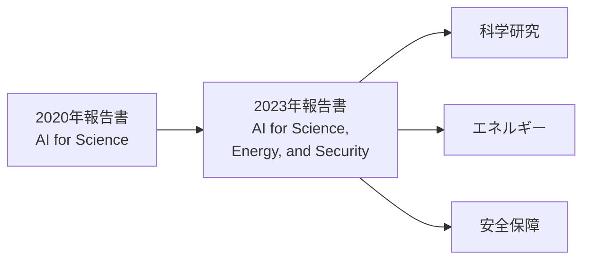

## はじめに

前章で紹介したとおり、「AI for Science」という概念は2020年のDOE報告書[^2]によって体系化されました。しかし、この報告書が公開された直後から、AI for Scienceの世界は驚異的なスピードで進化を遂げます。

本章では、2020年から2025年にかけてのAI for Scienceにおける主要なマイルストーンを年表形式で辿り、この分野がどのように科学の歴史を塗り替えてきたかを見ていきます。わずか5年の間に2つのノーベル賞、数百万種の新材料発見、気象予測の根本的変革が実現しました。この加速度的な進展を追うことで、AI for Scienceがなぜ「今」取り組むべきテーマなのかが明らかになるでしょう。

## AI for Scienceの年表（2020〜2025年）

| 年 | マイルストーン |
| ---- | ---- |
| **2020** | DOE報告書公開 / AlphaFold2がCASP14で優勝 |
| **2021** | AlphaFold2論文がNatureに掲載 / タンパク質構造データベース公開 |
| **2022** | 2億種のタンパク質構造を予測・公開 / Frontierがエクサスケール達成 / DOE後続ワークショップ開催 |
| **2023** | DOE後続報告書公開 / GNoMEで新規材料220万種発見 |
| **2024** | AlphaFold3発表 / ノーベル化学賞（Hassabis・Jumper・Baker） / ノーベル物理学賞（Hopfield・Hinton） / GenCastによる気象予測 / MatterSim（汎用原子シミュレーター） / Aurora（地球システム基盤モデル） |
| **2025** | 科学基盤モデルの普及 / 科学研究革新プログラム創設 / MatterGen（材料生成AI） |

## 2020年: AlphaFold2の衝撃

### CASP14での躍進

2020年11月、DOE報告書が公開されたその年に、AI for Scienceの可能性を世界に知らしめる出来事が起こりました。Google DeepMindの**AlphaFold2**が、タンパク質構造予測コンペティション**CASP14**（Critical Assessment of Techniques for Protein Structure Prediction）で圧倒的な成果を達成したのです[^1]。

[^1]: Jumper, J. et al. (2021). Highly accurate protein structure prediction with AlphaFold. *Nature*, 596, 583–589. DOI: 10.1038/s41586-021-03819-2

AlphaFold2は、CASP14の97のターゲットのうち88で最高精度の予測を達成しました。GDT（Global Distance Test）スコアの中央値は**92.4**に達し、これは実験的手法であるX線結晶構造解析に匹敵する精度です。

:::message
タンパク質の3次元構造を**アミノ酸配列だけから**予測するという問題は、構造生物学における50年来の未解決問題でした。AlphaFold2はこの問題を事実上解決し、「ゲームが変わった」と評されました。
:::

### なぜAlphaFold2は革命的だったのか

AlphaFold2の革新性は、以下の点にあります。

| 従来の手法 | AlphaFold2 |
| ---- | ---- |
| X線結晶構造解析で数か月〜数年 | 数分で予測可能 |
| 1構造あたり数百万円のコスト | 計算コストのみ |
| 約50年間で約17万構造を解明 | 2億以上の構造を一括予測 |

AlphaFold2は、Transformerアーキテクチャに基づく**Evoformer**モジュールと、反復的な構造予測モジュールを組み合わせた、エンドツーエンドの深層学習モデルです。多重配列アラインメント（Multiple Sequence Alignment, MSA）から抽出される共進化情報を効果的に活用し、物理的制約を学習に組み込むことで、従来の手法では到達できなかった精度を実現しました。

## 2021年: 科学コミュニティへの還元

### Nature論文とオープンソース化

2021年7月、AlphaFold2の詳細な手法が*Nature*に論文として発表され、同時にソースコードがオープンソースとして公開されました。この論文は2025年時点で**43,000回以上**引用されており、AI for Science分野でもっとも影響力のある論文の1つとなっています。

### AlphaFoldタンパク質構造データベースの誕生

同じく2021年7月、DeepMindと欧州バイオインフォマティクス研究所（EMBL-EBI）は、**AlphaFoldタンパク質構造データベース（AFDB）** を共同で公開しました。公開時点でヒトのプロテオーム全体と20の主要なモデル生物のタンパク質構造（36万5,000以上）が収録され、世界中の研究者が自由にアクセスできるようになりました。

:::details データベースの規模の変遷
- **2021年7月**: 約36万5,000構造（ヒトと20のモデル生物）
- **2022年7月**: 約2億構造（100万種以上の生物をカバー）
- **2024年**: 約2億1,400万構造（既知のタンパク質のほぼすべて）
:::

## 2022年: エクサスケール時代の幕開け

### Frontierスーパーコンピューター

2022年5月、米国オークリッジ国立研究所の**Frontier**が、世界ではじめてエクサスケール（$10^{18}$ FLOPS）を達成しました。Frontierは、AIワークロードとHPCを統合的に処理できるように設計されており、AI for Scienceの大規模計算基盤として重要な役割を果たしています。

### 2億構造の予測・公開

2022年7月、AlphaFoldチームは予測構造数を約2億に拡大し、データベースに収録しました。これは地球上で知られているほぼすべてのタンパク質構造をカバーする規模であり、構造生物学の研究を根本的に変えました。

### DOE後続ワークショップの開催

2022年には、2020年報告書のフォローアップとして、DOEの科学局（SC）と国家核安全保障局（NNSA）が共同でワークショップを開催しました。2020年以降のAIの急速な進展を踏まえ、AI for Scienceの範囲を**エネルギー**と**安全保障**にも拡大した議論が行われました。

## 2023年: フォローアップ報告書と新たな方向性

### DOE後続報告書の公開

2023年5月、ワークショップの成果をまとめた報告書が公開されました。

> **Advanced Research Directions on AI for Science, Energy, and Security: Report on Summer 2022 Workshops**[^3]

[^2]: Stevens, R., Taylor, V., Nichols, J., Maccabe, A. B., Yelick, K., Brown, D. (2020). *AI for Science: Report on the Department of Energy (DOE) Town Halls on Artificial Intelligence (AI) for Science*. Argonne National Laboratory. DOI: [10.2172/1604756](https://doi.org/10.2172/1604756)

[^3]: Carter, J., Feddema, J., Kothe, D., Neely, R., Pruet, J., Stevens, R. (2023). *Advanced Research Directions on AI for Science, Energy, and Security: Report on Summer 2022 Workshops*. Argonne National Laboratory. DOI: [10.2172/1999614](https://doi.org/10.2172/1999614)

この報告書は、2020年の報告書と比較して以下の重要な変化を反映しています。

#### 対象範囲の拡大

2020年報告書が「AI for Science」に焦点を当てていたのに対し、2023年報告書は**AI for Science, Energy, and Security**と対象を拡大しました。

| 領域 | 内容 |
| ---- | ---- |
| **Science** | 基礎科学研究におけるAI活用の深化 |
| **Energy** | クリーンエネルギー、核融合、送電網最適化 |
| **Security** | サイバーセキュリティ、核不拡散、災害予測 |

#### 責任あるAIの重視

2023年報告書では、**責任あるAI（Responsible AI）** が主要テーマとして強調されました。

- **説明可能性（Explainability）**: AIモデルの判断根拠を科学者が理解できること
- **検証可能性（Validation）**: AIの予測を独立した手法で検証できること
- **セキュリティ**: AIモデルの敵対的攻撃への耐性
- **公平性**: データのバイアスが結果に与える影響の管理

:::message
2020年報告書では「課題」として触れられていた責任あるAIの問題が、2023年には「AI for Scienceの前提条件」として位置づけられるようになりました。
:::

#### DOE固有の能力への着目

報告書はまた、DOEが持つ独自の強みを活かしたAI研究の方向性を示しました。

- **エクサスケール計算基盤**: Frontier、Auroraなどのスーパーコンピューター
- **大規模科学施設**: 放射光源、中性子源などのユーザー施設
- **高速ネットワーク**: ESnet（Energy Sciences Network）によるデータ転送基盤
- **学際的研究プログラム**: SciDAC、ECP（Exascale Computing Project）の実績

### GNoME: 材料科学の革新

2023年11月、Google DeepMindは**GNoME（Graph Networks for Materials Exploration）**を発表しました。GNoMEは、グラフニューラルネットワークを用いて、約**220万種**の新規安定結晶構造を予測しました。これは人類がそれまでに発見した安定結晶構造の約10倍にあたります。

この成果は、AI for Scienceが「予測」だけでなく「発見」のツールとしても機能することを示しました。

## 2024年: ノーベル賞と科学AIの飛躍

### AlphaFold3の発表

2024年5月、Google DeepMindとIsomorphic Labsは**AlphaFold3**を発表しました。AlphaFold2が単一タンパク質の構造予測に特化していたのに対し、AlphaFold3は以下を含む生体分子相互作用の予測が可能になりました。

- タンパク質とDNAの複合体
- タンパク質とRNAの複合体
- タンパク質と低分子リガンドの結合構造
- 翻訳後修飾を含む構造
- イオンとの相互作用

AlphaFold3では、Evoformerを簡略化した**Pairformer**と、新たに **拡散モデル（Diffusion Model）** が導入されました。AlphaFold2のターゲットがタンパク質のみだったのに対し、AlphaFold3は生体分子全般の構造予測へと一般化を果たしました。

### ノーベル化学賞の授与

2024年10月、スウェーデン王立科学アカデミーは**2024年ノーベル化学賞**を以下の3名に授与すると発表しました。

| 受賞者 | 所属 | 受賞理由 |
| ---- | ---- | ---- |
| **Demis Hassabis** | Google DeepMind | タンパク質構造予測 |
| **John Jumper** | Google DeepMind | タンパク質構造予測 |
| **David Baker** | ワシントン大学 | 計算的タンパク質設計 |

:::message alert
ノーベル化学賞がAI研究者に授与されたことは、AI for Scienceが科学の中心に位置づけられたことの象徴的な出来事です。AIが「ツール」から「科学的発見のパートナー」へと進化したことを、科学コミュニティ全体が認めたといえます。
:::

Hassabis氏とJumper氏は、2023年にもBreakthrough Prize in Life SciencesとAlbert Lasker Basic Medical Research Awardを受賞しており、AlphaFoldの科学的貢献は2024年のノーベル賞に先立って広く認められていました。

### 2024年ノーベル物理学賞

2024年のノーベル物理学賞は、**John Hopfield**と**Geoffrey Hinton**に授与されました。受賞理由は「人工ニューラルネットワークによる機械学習を可能にした基礎的発見と発明」です。物理学賞と化学賞の両方でAI関連の受賞が出たことは、AIが科学全体に与えるインパクトの大きさを示しています。

### GenCast: 気象予測AIの進化

2024年には、Google DeepMindの**GenCast**が、世界の主要な数値気象予測モデルを上回る精度で中期気象予測（最大15日）を達成しました。GenCastは拡散モデルに基づくアンサンブル予測システムで、従来の数値気象予測が数時間かかる計算を数分で完了します。

:::details 気象予測AIの進化
- **FourCastNet**（NVIDIA、2022年）: Transformerベースの気象予測モデル
- **Pangu-Weather**（ファーウェイ、2023年）: 3次元気象予測モデル
- **GraphCast**（Google DeepMind、2023年）: グラフニューラルネットワークベース
- **GenCast**（Google DeepMind、2024年）: 拡散モデルベースのアンサンブル予測
- **Aurora**（Microsoft、2024年）: 地球システム全般の基盤モデル
:::

### Microsoft Aurora: 地球システム基盤モデル

2024年、Microsoft Researchは地球システム全般の予測を目的とした基盤モデル**Aurora**を発表しました[^aurora]。Auroraは100万時間以上の多様な気象・大気化学データで学習された3次元Swin Transformerベースのモデルで、単一のGPUで10日間のグローバル気象予測を1分未満で生成できます。

[^aurora]: Bodnar, C. et al. (2024). Aurora: A Foundation Model of the Atmosphere. *arXiv:2405.13063*

Auroraの特徴は、気象予測だけでなく大気汚染予測やダウンスケーリングなど、地球システムに関する幅広いタスクに転移学習できる汎用性にあります。従来の数値気象予測モデルと比較して、計算コストを大幅に削減しながら同等以上の精度を実現しました。

:::message
Microsoft Auroraは、DOEのエクサスケールスーパーコンピューター「Aurora」（アルゴンヌ国立研究所）とは別のプロジェクトです。名称は同じですが、前者はAI基盤モデル、後者はHPC計算基盤を指します。
:::

### MatterSim: 汎用原子シミュレーター

同じく2024年、Microsoft Researchは汎用的な深層学習原子シミュレーター**MatterSim**を発表しました[^msim]。MatterSimは大規模な第一原理計算データで学習された機械学習力場であり、広範な元素・温度・圧力条件下での材料シミュレーションを高速かつ高精度に実行できます。

[^msim]: Yang, H. et al. (2024). MatterSim: A Deep Learning Atomistic Model Across Elements, Temperatures and Pressures. Microsoft Research.

従来の第一原理計算（DFT）が1つのシステムに対して数時間〜数日かかる計算を、MatterSimは数秒で実行できるため、材料探索のスループットを飛躍的に向上させます。MatterSimはMatterGenと組み合わせることで、材料の「生成→シミュレーション→評価」を一貫して高速に実行できるパイプラインを構成します。

## 2025年: 科学基盤モデルの時代へ

2025年現在、AI for Scienceは新たなフェーズに入りつつあります。

### 科学基盤モデル（Foundation Models for Science）

自然言語処理におけるGPTやBERTのような大規模言語モデル（LLM）のアプローチが、科学分野にも波及しています。

| モデル種別 | 対象 | 目的 |
| ---- | ---- | ---- |
| **タンパク質言語モデル** | アミノ酸配列 | 構造・機能予測、設計 |
| **分子基盤モデル** | 化学構造 | 物性予測、分子生成 |
| **気象基盤モデル** | 気象データ | 高速・高精度な予測 |
| **材料基盤モデル** | 結晶構造 | 安定性予測、材料設計 |

これらの科学基盤モデルは、特定のタスクに限定されない汎用的な表現を学習し、さまざまな下流タスクに転移学習できる点が特徴です。

### MatterGen: 材料を「生成」するAI

2025年1月、Microsoft Researchは材料生成AI**MatterGen**を*Nature*に発表しました[^mgen]。GNoMEが既存の候補材料をスクリーニングするアプローチだったのに対し、MatterGenは所望の特性（化学組成、結晶対称性、機械的・電子的・磁気的特性）を指定すると、その条件を満たす新規材料を直接生成できる点が革新的です。

[^mgen]: Zeni, C. et al. (2025). A generative model for inorganic materials design. *Nature*, 637, 624–632. DOI: 10.1038/s41586-025-08628-5

MatterGenは拡散モデルに基づいており、原子の種類・座標・格子パラメータを同時に生成します。生成された材料候補は第一原理計算による検証でも高い安定性を示し、材料設計のパラダイムを「既存材料の探索」から「目的指向の材料生成」へと転換する可能性を示しました。

:::message
MatterGen（材料生成）、MatterSim（材料シミュレーション）、Aurora（地球システム予測）は、MicrosoftのAI for Science戦略の中核をなす3つの基盤モデルです。Google DeepMindのAlphaFoldやGNoMEと合わせ、大手テクノロジー企業が科学研究の基盤ツールを競って開発する時代が到来しています。
:::

### 自律実験室の実用化

AI for Scienceの究極的な目標の1つである **Self-Driving Laboratory（自律実験室）** の実用化も進んでいます。ロボティクスとAIを組み合わせ、仮説生成から実験実行、データ解析までを自動化する取り組みが、材料科学や化学の分野で成果を上げています。

### マルチモーダルAIの科学応用

テキスト、画像、数値データ、3次元構造など、異なるモダリティのデータを統合的に処理する**マルチモーダルAI**の科学応用が広がっています。たとえば、顕微鏡画像と分光データを統合して材料特性を予測するモデルや、論文テキストと実験データを組み合わせて知識を抽出するシステムが開発されています。

## 2020年報告書と2023年報告書の比較

最後に、2つのDOE報告書の主な違いを整理します。

| 比較項目 | 2020年報告書 | 2023年報告書 |
| ---- | ---- | ---- |
| **タイトル** | AI for Science | AI for Science, Energy, and Security |
| **対象範囲** | 科学研究 | 科学・エネルギー・安全保障 |
| **AIの発展段階** | 深層学習の応用開始期 | 大規模モデルと基盤モデルの時代 |
| **計算基盤** | ペタスケール中心 | エクサスケール達成 |
| **責任あるAI** | 課題として言及 | 前提条件として強調 |
| **実績** | 可能性の提示 | AlphaFold等の実証済み成果 |
| **ワークフローへのAI統合** | 将来の目標 | 実現しつつある現実 |

## まとめ

2020年のDOE報告書から5年間で、AI for Scienceは「概念」から「実践」へと大きく変貌を遂げました。

- **AlphaFold2**はタンパク質構造予測の50年来の問題を事実上解決し、2024年にノーベル化学賞を受賞
- **DOE 2023年報告書**は対象をエネルギー・安全保障にも拡大し、責任あるAIを前提条件として位置づけ
- **エクサスケール計算基盤**の実現により、AIとHPCの統合的活用が本格化
- **科学基盤モデル**の登場で、さまざまな科学分野で汎用的なAI活用が可能に
- **GNoME**・**GenCast**・**MatterGen**・**Aurora**など、Google DeepMindとMicrosoftが科学AIの基盤ツールを競って開発

### なぜ今、AI for Scienceに取り組むべきか

本章で見てきた5年間の進展は、単なる歴史ではありません。読者が今この分野に注目すべき理由は3つあります。

1. **ツールの民主化**: AlphaFoldはオープンソースで公開され、AFDBは無料でアクセスできます。MatterGenやMatterSimもオープンソースとして利用可能です。かつては大規模な実験設備と数億円の予算が必要だった科学的発見が、計算機とAIの知識があれば個人でも挑戦できる時代になりました。

2. **産業へのインパクト**: AI for Scienceは学術研究にとどまりません。創薬では候補化合物の探索期間が年単位から週単位に短縮されつつあり、材料開発では数百万種の新材料候補がわずか数日で生成できるようになりました。気候変動対策やクリーンエネルギーの実現にも直結しており、社会的インパクトの大きさは計り知れません。

3. **参入の好機**: 大手テクノロジー企業が科学AIの基盤ツールを競って公開しているため、これらを活用した研究開発のハードルはかつてないほど低くなっています。一方で、AIと各科学分野の知識を橋渡しできる人材は圧倒的に不足しています。科学的知識とAI技術の両方を持つ人材にとって、今がまさに参入の好機です。

次章では、これらの発展を可能にした技術的基盤、すなわちハードウェア、アルゴリズム、データ基盤の進化について詳しく見ていきます。

:::message
**この章のポイント**
- 2020年のAlphaFold2がAI for Scienceの実力を世界に証明した
- 2023年のDOE後続報告書で「Science, Energy, and Security」に範囲を拡大
- 2024年にはノーベル化学賞・物理学賞の両方でAI関連の受賞
- MicrosoftがMatterGen・MatterSim・Auroraで科学AI基盤を構築し、Google DeepMindと競争が加速
- 主要ツールの多くがオープンソース化され、参入障壁が劇的に低下している
:::
