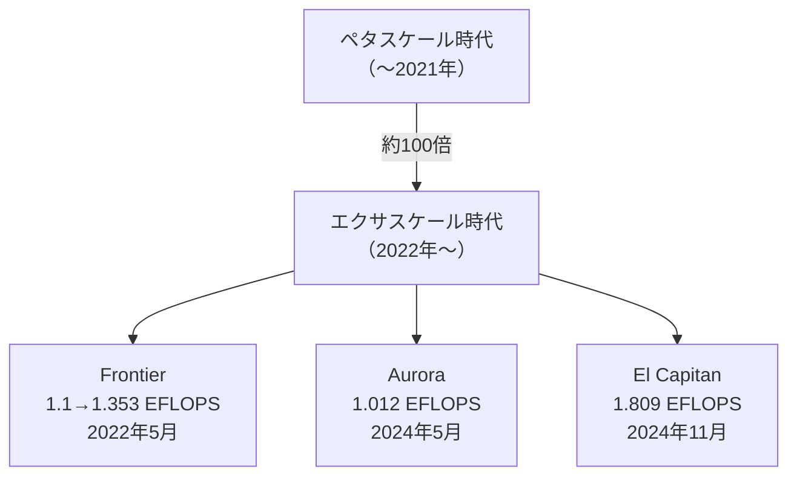
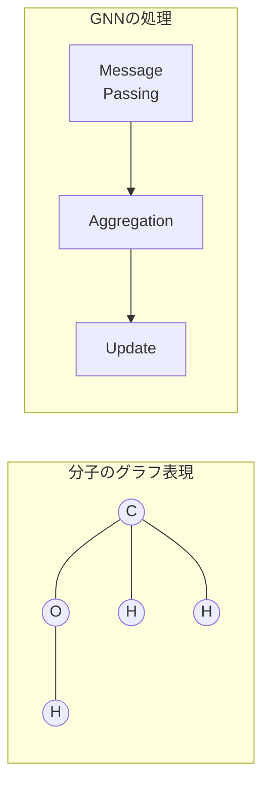
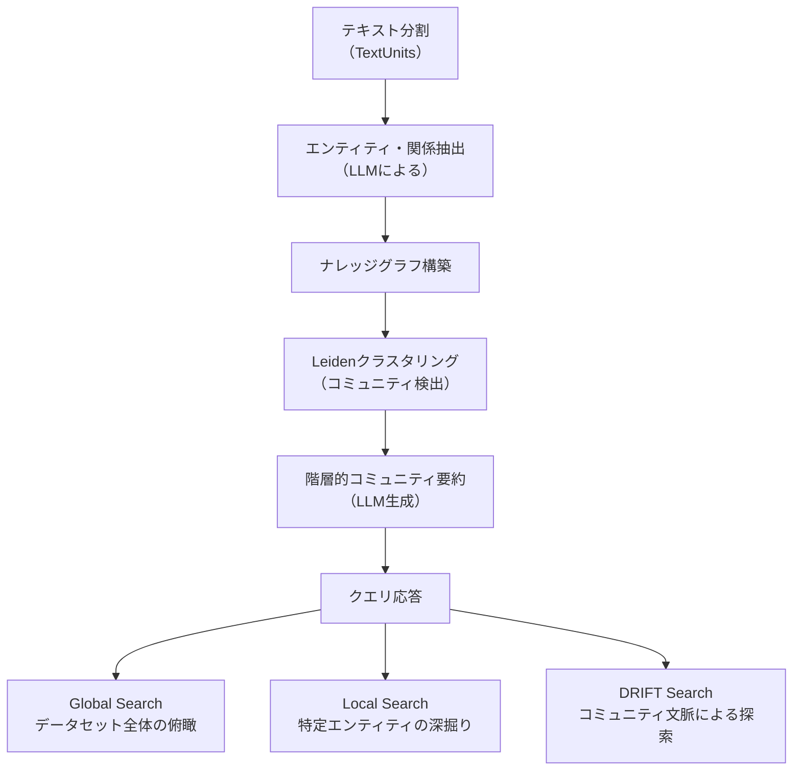
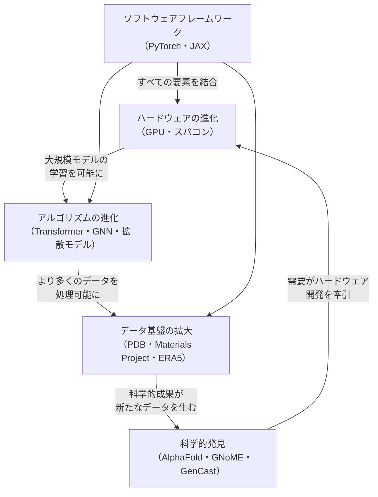

## はじめに

前章では、2020年以降のAI for Scienceにおける主要なマイルストーンを振り返りました。AlphaFold2によるタンパク質構造予測、GNoMEによる材料発見、GenCastによる気象予測など、これらの成果はいずれも、特定の技術的基盤の進化なしには実現しえませんでした。

本章では、AI for Scienceを支える技術を**ハードウェア**、**アルゴリズム**、**データ基盤**、**ソフトウェアフレームワーク**の4つの観点から解説します。これらの技術がどのように進化し、互いに連携することで科学AIの飛躍を可能にしたのかを理解することは、AI for Scienceに取り組むうえでの出発点となります。

## ハードウェアの進化

### GPU: 科学AIの計算エンジン

AI for Scienceの急速な発展を支えた最大の技術的要因は、**GPU（Graphics Processing Unit）** の進化です。もともとゲームのグラフィックス処理のために開発されたGPUは、大量の並列演算を高速に処理できるという特性から、2010年代以降AIの学習・推論の主要なハードウェアとなりました。

NVIDIAのデータセンター向けGPUの進化を見ると、科学計算の能力がいかに急速に向上してきたかがわかります。

| 世代 | 発表年 | アーキテクチャ | FP32性能 | HBMメモリ | 特徴 |
| ---- | ---- | ---- | ---- | ---- | ---- |
| **P100** | 2016 | Pascal | 10.6 TFLOPS | 16 GB HBM2 | NVIDIA初のHBM搭載 |
| **V100** | 2017 | Volta | 15.7 TFLOPS | 16/32 GB HBM2 | **Tensor Core**初搭載 |
| **A100** | 2020 | Ampere | 19.5 TFLOPS | 40 GB HBM2 / 80 GB HBM2e | TF32形式、構造化スパースネス |
| **H100** | 2022 | Hopper | 67 TFLOPS | 80 GB HBM3 | **Transformer Engine**、FP8対応 |
| **B200** | 2024 | Blackwell | 非公表 | 192 GB HBM3e | 2チップ構成、2080億トランジスター |

:::message
P100からH100までのわずか6年間で、FP32の演算性能は**約6倍**に向上しました。しかし、AI学習に重要な低精度演算（Tensor Core使用時のFP16/BF16）の性能向上はさらに劇的で、V100の125 TFLOPSからH100の990 TFLOPSへと**約8倍**に飛躍しています。
:::

#### Tensor CoreとTransformer Engine

2017年のV100で導入された**Tensor Core**は、AI for Scienceにとって決定的な技術革新でした。Tensor Coreは行列積和演算（$\mathbf{D} = \mathbf{A} \times \mathbf{B} + \mathbf{C}$）を専用回路で高速に実行するユニットであり、ニューラルネットワークの学習における行列演算を桁違いに加速します。

2022年のH100で導入された**Transformer Engine**は、さらに踏み込んだ最適化を提供します。FP16とFP8の間で動的に精度を切り替えることで、精度の損失を最小限に抑えながら演算速度を高速化します。その名が示すとおり、AlphaFold2やGenCastなどで使われるTransformerアーキテクチャの計算を直接的に支援する設計です。

#### メモリ帯域幅の重要性

科学AIにおいては、計算速度だけでなく**メモリ帯域幅**も極めて重要です。タンパク質構造予測や分子動力学シミュレーションでは、巨大な行列やグラフ構造をメモリに保持しながら計算する必要があるためです。

HBM（High Bandwidth Memory）は、GPUチップの上に3次元積層されたメモリで、従来のGDDRメモリと比べて帯域幅が大幅に広いのが特徴です。V100の900 GB/sからH100の3.35 TB/sへと帯域幅は約3.7倍に拡大し、大規模モデルの学習・推論を可能にしました。

### スーパーコンピューター: エクサスケールの時代

#### 世界で初めてのエクサスケールマシン

GPUの進化と並行して、スーパーコンピューターもAI for Scienceの発展を支える重要な計算基盤です。

2025年6月のTOP500リスト上位は、すべてDOE傘下の国立研究所に設置されたエクサスケールマシンが占めています[^1]。

[^1]: TOP500 June 2025. https://www.top500.org/lists/top500/2025/06/

| 順位 | 名称 | 設置場所 | 性能（Rmax） | GPU/アクセラレーター |
| ---- | ---- | ---- | ---- | ---- |
| **1位** | El Capitan | ローレンス・リバモア国立研究所 | 1.809 EFLOPS | AMD Instinct MI300A |
| **2位** | Frontier | オークリッジ国立研究所 | 1.353 EFLOPS | AMD Instinct MI250X |
| **3位** | Aurora | アルゴンヌ国立研究所 | 1.012 EFLOPS | Intel Data Center GPU Max |

これらのエクサスケールマシンは、単なる高速計算機ではありません。AIワークロードとHPC（High Performance Computing）ワークロードを統合的に処理できるように設計されており、AIモデルの学習と物理シミュレーションを同一システム上でシームレスに実行できます。

:::message
エクサスケールとは$10^{18}$回の浮動小数点演算を1秒間に実行できる性能を指します。これは地球上の約80億人が1秒間に約1億回の計算を行うのに相当する規模です。
:::

#### 日本の計算基盤

日本も独自の計算基盤でAI for Scienceを推進しています。理化学研究所の**富岳**はTOP500で7位（442 PFLOPS）にランクされ、2025年のTOP500リストでも日本最速です。後継となる**富岳NEXT**の開発が進められており、AI for Scienceを意識したアーキテクチャの設計が行われています。

### 専用チップとクラウド

GPU以外にも、科学AI向けのハードウェアは多様化しています。

| ハードウェア | 開発元 | 特徴 |
| ---- | ---- | ---- |
| **TPU（Tensor Processing Unit）** | Google | 行列演算に特化、AlphaFoldの学習に使用 |
| **Trainium / Inferentia** | AWS | クラウド環境でのAI学習・推論に特化 |
| **Maia 200** | Microsoft | Azure自社設計AIチップ（TSMC 3nm）、216 GB HBM3E、推論専用 |
| **Gaudi** | Intel (Habana Labs) | HPCとAIの統合処理 |
| **WSE（Wafer Scale Engine）** | Cerebras | ウェハー全体を1チップとして利用 |

Google DeepMindのAlphaFold2は**TPU v3**を128台使用して学習されました。クラウドコンピューティングの発展により、個々の研究者が大規模な計算リソースにオンデマンドでアクセスできるようになったことも、AI for Scienceの民主化に大きく貢献しています。

## アルゴリズム・アーキテクチャの進化

AI for Scienceの成果を支えるもう1つの柱は、深層学習アーキテクチャの進化です。ここでは、科学研究でとくに重要な役割を果たしている主要アーキテクチャを概観します（各手法の詳細は次章で解説します）。

### 畳み込みニューラルネットワーク（CNN）

**CNN（Convolutional Neural Network）** は画像認識の分野で発展したアーキテクチャですが、科学データの処理にも広く応用されています。

| 科学応用例 | 入力データ | 用途 |
| ---- | ---- | ---- |
| 電子顕微鏡画像解析 | 2D/3D画像 | 構造特定、粒子検出 |
| 結晶構造の分類 | 回折パターン画像 | 結晶相同定 |
| 天文画像解析 | 望遠鏡画像 | 天体分類、重力レンズ検出 |

CNNの特徴は、**局所的なパターン**を階層的に抽出できる点です。画像データだけでなく、3次元の電子密度マップや気象データのグリッドにも適用できるため、科学データとの親和性が高いアーキテクチャです。

### リカレントニューラルネットワーク（RNN）とLSTM

**RNN（Recurrent Neural Network）** は、時系列データや配列データの処理に適したアーキテクチャです。科学分野では、分子配列の解析や時系列シミュレーションデータの予測に使われてきました。

長期の依存関係を学習できる **LSTM（Long Short-Term Memory）**や**GRU（Gated Recurrent Unit）** の登場により、より長い配列データの処理が可能になりましたが、後述のTransformerの登場により、長大な配列の処理については主役の座を譲りつつあります。

### Transformer: AI for Scienceの中核

2017年にGoogleの研究チームが発表した**Transformer**[^2]は、AI for Scienceにおいてもっとも影響力のあるアーキテクチャの1つです。

[^2]: Vaswani, A. et al. (2017). Attention Is All You Need. *Advances in Neural Information Processing Systems*, 30.

Transformerの核となるメカニズムは **Self-Attention（自己注意機構）** です。入力配列中のすべての要素間の関係を並列に計算できるため、RNNの抱えていた長距離依存性の問題を解決しました。

#### 科学分野での応用

| モデル | 分野 | Transformerの役割 |
| ---- | ---- | ---- |
| **AlphaFold2** | 構造生物学 | Evoformer（MSAとペア表現の情報交換） |
| **AlphaFold3** | 構造生物学 | Pairformer（簡略化されたAttention） |
| **Aurora** | 気象予測 | 3D Swin Transformer（空間構造の処理） |
| **ESM-2** | タンパク質科学 | タンパク質配列の言語モデル |
| **大規模言語モデル** | 科学全般 | 論文解析、仮説生成 |

:::message
AlphaFold2の成功は、Transformerアーキテクチャが**科学データの構造的関係**を学習する能力を持つことの実証でした。アミノ酸配列中のすべてのペア間の相互作用をAttentionで捉えることで、3次元構造の予測を可能にしたのです。
:::

#### なぜTransformerが科学に適しているのか

Transformerが科学分野でとくに有効な理由は以下の3つです。

1. **長距離相互作用の捕捉**: 分子中の離れた原子間の相互作用や、大気中の遠隔結合（テレコネクション）など、科学現象に特有の長距離依存性を自然に扱える
2. **並列計算の効率性**: Self-Attentionは入力長に対して並列に計算できるため、GPU/TPUの性能を最大限に活用できる
3. **スケーラビリティ**: モデルサイズとデータ量を増やすほど性能が向上するスケーリング則が科学分野でも確認されている

### グラフニューラルネットワーク（GNN）

分子や結晶構造のように、**ノード（原子）とエッジ（結合）** で表現される科学データの処理に特化したアーキテクチャが **GNN（Graph Neural Network）** です。

GNNでは、各ノードが隣接ノードからメッセージを受け取り、自身の表現を更新する**Message Passing**という操作を繰り返すことで、分子全体の構造と特性を学習します。

| モデル | 年 | 応用分野 | 特徴 |
| ---- | ---- | ---- | ---- |
| **SchNet** | 2017 | 分子シミュレーション | 連続的なフィルターによる原子間相互作用 |
| **DimeNet** | 2020 | 分子特性予測 | 結合角情報の導入 |
| **GNoME** | 2023 | 材料発見 | 220万種の安定結晶構造の予測 |
| **MACE** | 2022 | 原子シミュレーション | 多体相互作用の効率的な学習 |
| **MatterSim** | 2024 | 材料シミュレーション | 汎用的な機械学習力場 |

GNoMEが220万種の新規材料を予測できたのは、結晶構造をグラフとして表現し、GNNで安定性を高速に判定できたからです。

### 拡散モデル（Diffusion Model）

2020年代に入り急速に発展した**拡散モデル**は、画像生成の分野で注目を集めましたが、科学分野でも革新的な応用が進んでいます。

拡散モデルの基本的なアイデアはシンプルです。

1. **フォワードプロセス（拡散）**: データに段階的にノイズを加え、最終的に純粋なノイズにする
2. **リバースプロセス（逆拡散）**: ノイズから段階的にデータを復元する方法を学習する

$$q(x_t | x_{t-1}) = \mathcal{N}(x_t; \sqrt{1-\beta_t} x_{t-1}, \beta_t \mathbf{I})$$

学習済みモデルはランダムノイズから開始して、科学的に妥当な構造を「生成」できます。

| モデル | 分野 | 生成対象 |
| ---- | ---- | ---- |
| **AlphaFold3** | 構造生物学 | 生体分子複合体の3次元構造 |
| **GenCast** | 気象予測 | アンサンブル気象予測 |
| **MatterGen** | 材料科学 | 所望の特性を持つ新規材料 |
| **RFdiffusion** | タンパク質設計 | 新規タンパク質構造 |

:::message
拡散モデルの科学応用が革新的なのは、**「条件付き生成」** が可能な点です。MatterGenは「磁性を持つ」「硬度が高い」といった条件を指定して、その条件を満たす材料を直接生成できます。これは従来の「候補をスクリーニングする」アプローチとは根本的に異なります。
:::

### アーキテクチャの収束と融合

注目すべきは、2024〜2025年のAI for Scienceモデルでは、これらのアーキテクチャが**融合**する傾向が見られることです。

| モデル | 使用アーキテクチャ |
| ---- | ---- |
| **AlphaFold3** | Transformer（Pairformer）+ 拡散モデル |
| **GenCast** | Transformer + 拡散モデル + GNN |
| **MatterGen** | GNN + 拡散モデル |
| **Aurora** | 3D Swin Transformer + エンコーダー/デコーダー |

単一のアーキテクチャで科学の問題を解くのではなく、問題の構造に合わせて最適なアーキテクチャを組み合わせるハイブリッドアプローチが主流になっています。

## データ基盤の進化

AI for Scienceにおけるもう1つの重要な基盤が**データ**です。「AI is only as good as its data（AIはデータの質で決まる）」という格言は、科学分野でとくに当てはまります。

### 科学データベースの発展

科学分野には、長年にわたって蓄積されたデータベースが多数存在します。AI for Scienceの発展は、これらのデータベースの規模と質の向上なしには実現しませんでした。

| データベース | 分野 | 規模 | 設立年 | AI活用例 |
| ---- | ---- | ---- | ---- | ---- |
| **PDB** | タンパク質構造 | 約24万構造（実験的に決定） | 1971 | AlphaFold2の学習データ |
| **UniProt** | タンパク質配列 | 約2.5億配列 | 2002 | MSAの構築、タンパク質言語モデル |
| **Materials Project** | 材料科学 | 約15万化合物 | 2011 | GNoMEの学習データ |
| **CSD** | 結晶構造 | 約120万構造 | 1965 | 結晶構造予測 |
| **ERA5** | 気象再解析 | 1940年〜現在のグローバル気象データ | 2017 | GenCast、Auroraの学習データ |
| **QM9** | 量子化学 | 約13.4万分子の量子化学計算 | 2014 | 分子特性予測ベンチマーク |

#### AlphaFold2とデータの関係

AlphaFold2の成功は、PDB（Protein Data Bank）に蓄積された約17万件の実験的に決定されたタンパク質構造なしには不可能でした。半世紀にわたって世界中の構造生物学者がX線結晶構造解析やクライオ電子顕微鏡で決定し、PDBに登録してきた構造データが、AIモデルの学習を支えたのです。

これは、**科学コミュニティのオープンデータ文化がAI for Scienceを可能にした**ことを示す好例です。

### 第一原理計算データの役割

実験データだけでなく、**第一原理計算（density functional theory; DFT）** から生成されたシミュレーションデータも、AI for Scienceの重要なデータソースです。

GNoMEやMatterSimの学習データの多くは、膨大なDFT計算から生成されています。DFT計算は1つの系に対して数時間〜数日を要しますが、計算結果はノイズのない「理想的な」データとなるため、AIモデルの学習に適しています。

:::details DFT計算とAIの補完関係
DFTは量子力学に基づく高精度な計算手法ですが、計算コストが系のサイズの3乗に比例するため大規模系の計算には不向きです。AIモデル（機械学習力場）はDFTに匹敵する精度を保ちながら計算を数桁高速化できるため、DFTで生成したデータでAIを学習し、AIの高速性でDFTの適用範囲を拡大するという補完関係が成立します。
:::

### FAIR原則とオープンサイエンス

AI for Scienceの推進にあたって、科学データの管理に関する**FAIR原則**（Findable, Accessible, Interoperable, Reusable）が重要な指針となっています。

| 原則 | 内容 | AI for Scienceにおける意義 |
| ---- | ---- | ---- |
| **Findable** | データが発見可能であること | 学習データの効率的な収集 |
| **Accessible** | データにアクセスできること | モデル学習のためのデータ取得 |
| **Interoperable** | データが相互運用可能であること | 異なるデータベース間のデータ統合 |
| **Reusable** | データが再利用可能であること | 多様なAIモデルでの活用 |

DOEの2020年報告書でも、FAIR原則に基づくデータインフラの構築がAI for Scienceの成功の前提条件として重視されています。日本でも文部科学省のマテリアルDXプラットフォームや、理研のTRIP-AGISにおいて、FAIR原則に基づくデータ基盤の整備が進められています。

## ソフトウェアフレームワーク

ハードウェア、アルゴリズム、データの進化を実際に研究で活用するためには、**ソフトウェアフレームワーク**が不可欠です。

### 深層学習フレームワーク

| フレームワーク | 開発元 | 特徴 | 科学AI活用例 |
| ---- | ---- | ---- | ---- |
| **PyTorch** | Meta | 動的計算グラフ、研究での支配的シェア | GNoME、MatterGen、MatterSim |
| **JAX** | Google | 関数型プログラミング、XLA最適化 | AlphaFold2/3、GenCast |
| **TensorFlow** | Google | 本番環境向け、大規模分散学習 | 気象予測モデル |

2025年現在、AI for Science分野の新規研究では**PyTorch**と**JAX**が主流です。PyTorchは柔軟でデバッグが容易なため実験的な研究に適しており、JAXはTPU上での高速実行と自動微分機能でGoogle DeepMindの大規模モデルに採用されています。

### 科学AIに特化したライブラリ

汎用フレームワークの上に構築された、科学分野に特化したライブラリも充実しています。

| ライブラリ | 対象分野 | 機能 |
| ---- | ---- | ---- |
| **PyTorch Geometric** | グラフ学習 | GNN実装、分子・結晶グラフ処理 |
| **DGL（Deep Graph Library）** | グラフ学習 | 大規模グラフの効率的な処理 |
| **ASE（Atomic Simulation Environment）** | 原子シミュレーション | 分子動力学、構造最適化のインターフェイス |
| **RDKit** | 化学情報学 | 分子の操作、記述子計算、フィンガープリント |
| **OpenMM** | 分子動力学 | GPU加速された分子動力学シミュレーション |
| **e3nn** | 等変ニューラルネットワーク | 3次元回転対称性を保つネットワーク |

これらのライブラリの多くはオープンソースとして公開されており、研究者が自分の問題に合わせてカスタマイズできます。

### 分散学習と大規模計算

科学AIモデルの大規模化に伴い、複数のGPU/TPUを効率的に利用する**分散学習**の技術も進化しています。

| 技術 | 概要 | 活用例 |
| ---- | ---- | ---- |
| **データ並列** | 同じモデルを複数GPUで分割バッチ学習 | 一般的な大規模学習 |
| **モデル並列** | 大規模モデルを複数GPUに分割して配置 | 巨大なTransformerモデル |
| **パイプライン並列** | モデルの各層を異なるGPUに割り当て | 超大規模モデルの学習 |
| **DeepSpeed / FSDP** | メモリ効率的な分散学習フレームワーク | 数十〜数千GPU規模の学習 |

AlphaFold2はTPU v3を128台使用して11日間の学習を行いました。このような大規模学習を効率的に実行するためには、分散学習技術が欠かせません。

### 科学知識の探索: GraphRAG

AI for Scienceの発展に伴い、科学文献や研究データの量は急速に増大しています。PubMedには3,600万件以上の論文が登録され、毎年100万件以上が新たに追加されています。この膨大な知識の中から、分野横断的な洞察を引き出したり、異なる研究間の隠れた関連性を発見したりする能力が、次の科学的ブレークスルーの鍵となります。

Microsoftが開発した**GraphRAG**[^3]は、この課題に対する革新的なアプローチです。従来のRAG（Retrieval-Augmented Generation）がベクトル類似度による断片的な検索に依存するのに対し、GraphRAGはLLMを用いて**テキストからナレッジグラフを自動構築**し、グラフ機械学習を組み合わせることで、データセット全体の構造的理解を可能にします。

[^3]: Edge, D. et al. (2024). From Local to Global: A Graph RAG Approach to Query-Focused Summarization. *arXiv:2404.16130*.

#### GraphRAGの仕組み

GraphRAGの処理は、**インデックス構築**と**クエリ応答**の2段階で構成されます。

1. **エンティティ・関係抽出**: LLMがテキストから人名、組織、概念、化合物などのエンティティと、それらの間の関係を自動抽出
2. **Leidenクラスタリング**: グラフのコミュニティ構造をボトムアップで階層的に検出
3. **コミュニティ要約**: 各コミュニティに対してLLMが事前要約を生成し、テーマや概念を構造化

#### 科学研究への応用可能性

GraphRAGが科学分野でとくに有望な理由は、従来のRAGでは困難だった**分野横断的な知識の統合**を実現できる点です。

| クエリタイプ | 従来のRAG | GraphRAG |
| ---- | ---- | ---- |
| 特定の事実の検索 | ○ 効果的 | ○ 効果的 |
| **「主要なテーマは何か？」** | ✕ 不得手 | **◎ コミュニティ要約で回答** |
| **分野間の関連性の発見** | ✕ 断片的 | **◎ グラフ構造で関係を可視化** |
| 複数情報源の統合 | △ 限定的 | **◎ 階層的な統合が可能** |

たとえば、材料科学と創薬の両分野にまたがる研究文献を対象に「タンパク質と無機材料の界面で共通する構造パターンは何か？」といったグローバルな問いに対して、GraphRAGは分野横断的な洞察を提供できます。

:::message
GraphRAGはオープンソース（MITライセンス）で公開されており、GitHubで31,000以上のスターを獲得しています。科学文献のナレッジグラフ構築だけでなく、実験ノートの構造化、研究プロジェクト間の知識共有など、AI for Scienceの研究プロセス全体を支援するツールとしての活用が期待されています。
:::

## 技術の相互作用がもたらす加速

ここまで見てきた4つの技術基盤（ハードウェア、アルゴリズム、データ、ソフトウェア）は、個々に進化しているのではなく、**互いに加速しあう好循環**を形成しています。

この好循環の一例が、AlphaFold2からMatterGenに至る流れです。

1. **ハードウェア**: TPU v3の128台並列がAlphaFold2の学習を可能にした
2. **アルゴリズム**: Transformerベースのアーキテクチャ（Evoformer）がタンパク質構造予測の精度を達成
3. **データ**: PDBの17万構造が学習データとなった
4. **成果**: AlphaFold2の成功がAI for Scienceへの投資と人材流入を加速
5. **次のサイクル**: より強力なハードウェア（H100/B200）、新しいアルゴリズム（拡散モデル）、より大きなデータベース（Materials Project、DFTデータ）が、GNoMEやMatterGenといった次世代の科学AIを可能にした

## まとめ

AI for Scienceの爆発的な発展は、単一の技術ブレークスルーによるものではなく、4つの技術基盤が互いに加速しあう好循環の結果です。

| 技術基盤 | 2020年時点 | 2025年時点 |
| ---- | ---- | ---- |
| **ハードウェア** | V100/A100、ペタスケールHPC | H100/B200、エクサスケールHPC（3機が稼働） |
| **アルゴリズム** | CNN、RNN、初期のTransformer | Transformer+GNN+拡散モデルの融合 |
| **データ** | PDB 17万構造、限定的な材料DB | AFDB 2億構造、大規模DFTデータセット |
| **ソフトウェア** | PyTorch/TensorFlow | PyTorch/JAX、科学特化ライブラリ、GraphRAG等の知識探索ツール |

この技術進化の全体像を理解することで、次章以降で解説するAI for Scienceの具体的な手法や応用事例が、どのような技術基盤の上に成り立っているかを把握できるでしょう。

次章では、これらの技術基盤を活用した**科学研究のための具体的なAI手法**（サロゲートモデリング、逆問題解法、生成モデル、等変ニューラルネットワークなど）について詳しく解説します。

:::message
**この章のポイント**
- GPU性能はP100からH100までの6年間でFP32が約6倍、Tensor Coreの低精度演算は約8倍に向上
- 2025年時点でエクサスケールスーパーコンピューターが3機稼働し、すべてDOE傘下
- Transformer・GNN・拡散モデルの3つのアーキテクチャが科学AIの中核
- 最新モデルではこれらのアーキテクチャの融合がトレンドに
- PDBやERA5などの科学データベースの蓄積がAIの学習を支える
- GraphRAGによる科学文献のナレッジグラフ構築が分野横断的な知識探索を実現
- ハードウェア・アルゴリズム・データ・ソフトウェアの好循環が科学AIを加速している
:::
