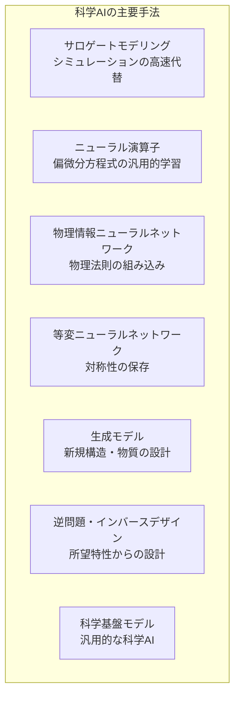
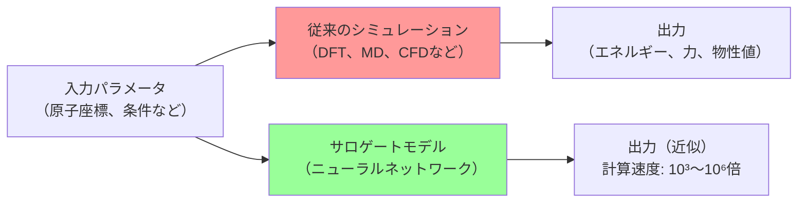
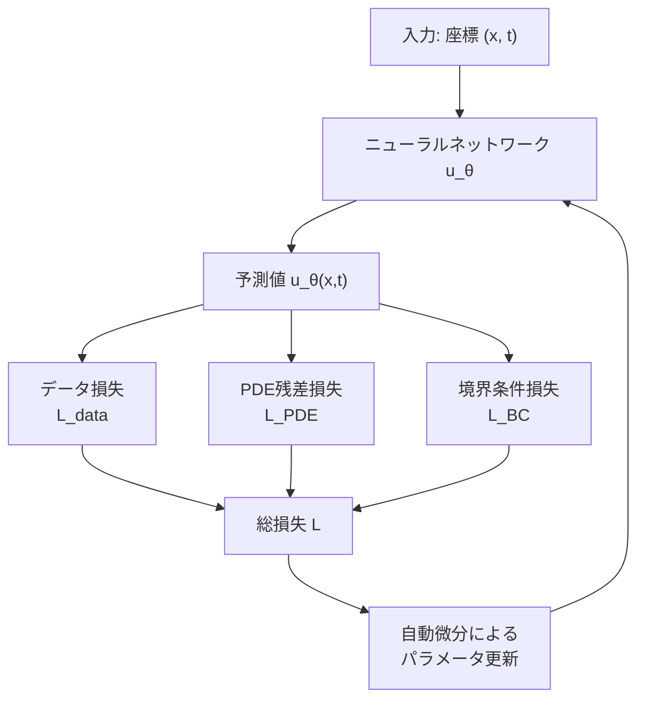
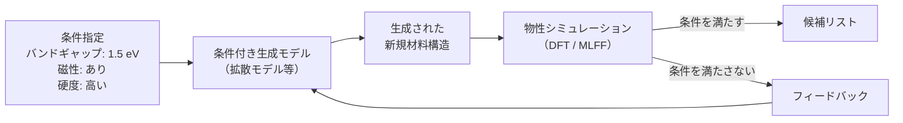
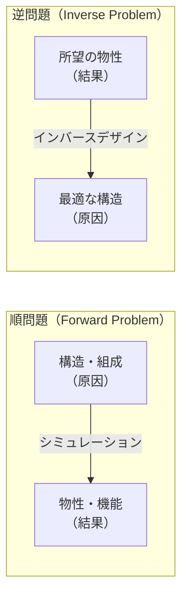
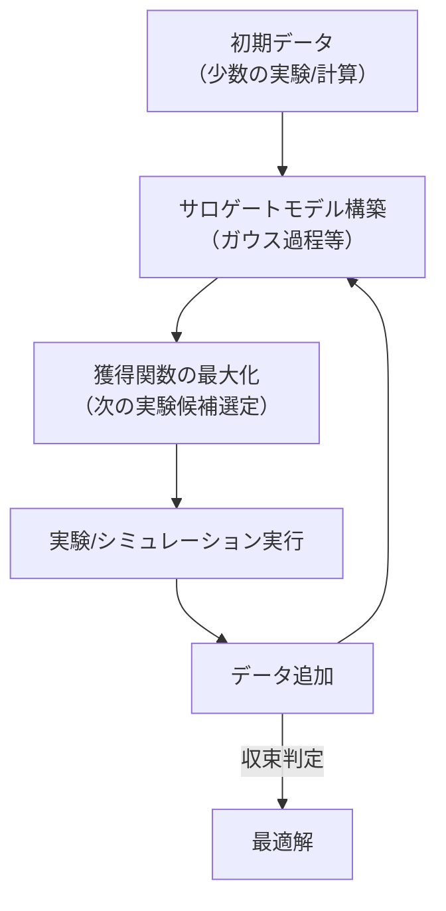
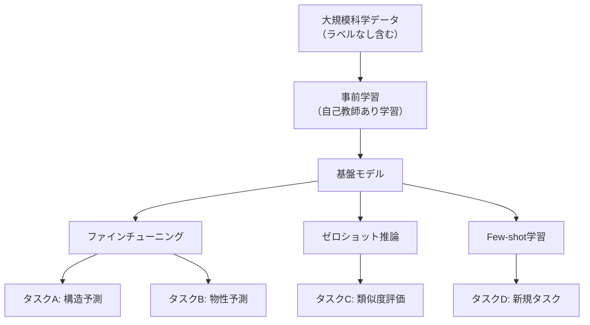
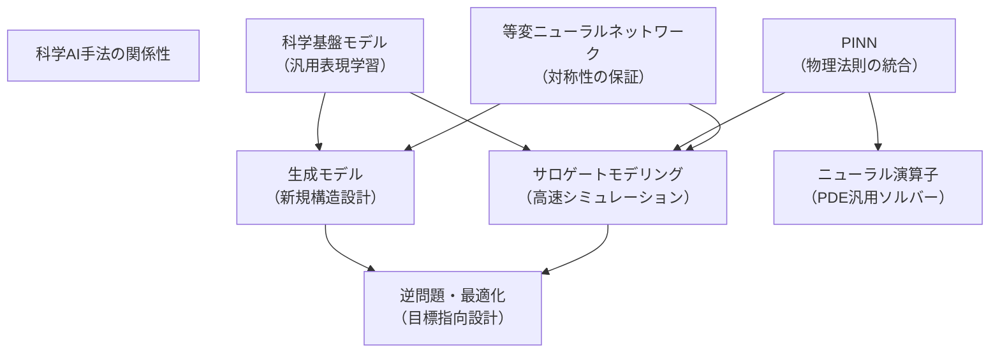

## はじめに

前章では、AI for Scienceを支える技術基盤（ハードウェア、アルゴリズム、データ、ソフトウェアフレームワーク）の進化を概観しました。本章では、これらの技術基盤の上に構築された **科学研究に特有のAI手法** を体系的に解説します。

AI for Scienceの手法は、従来の画像認識や自然言語処理とは異なる独自の要件を持ちます。物理法則の遵守・対称性の保存・不確実性の定量化といった科学固有の制約を満たしながら、シミュレーションの加速や新規物質の設計、複雑系の予測を実現する手法群を理解することが本章の目的です。

## サロゲートモデリング

### 計算コストの壁を越える

科学研究において、物理シミュレーションは不可欠なツールです。しかし、分子動力学シミュレーション、第一原理計算（DFT）、気候モデルなどの高精度シミュレーションには膨大な計算コストがかかります。

**サロゲートモデル（代理モデル）** は、この高コストなシミュレーションを高速に近似するAIモデルです。もとのシミュレーションの入出力関係を学習することで、計算を**数千〜数百万倍**高速化できます。

| 分野 | 従来手法 | 計算時間（1件） | サロゲートモデル | 高速化率 |
| ---- | ---- | ---- | ---- | ---- |
| 分子エネルギー計算 | DFT（密度汎関数法） | 数時間〜数日 | 機械学習力場（MLFF） | ~10⁶倍 |
| 気象予測 | 数値気象予報（NWP） | 数時間（スパコン） | GenCast等 | ~10³倍 |
| 流体シミュレーション | CFD（計算流体力学） | 数時間〜数週間 | ニューラル演算子 | ~10⁴倍 |
| タンパク質構造予測 | 分子動力学 | 数日〜数か月 | AlphaFold2 | ~10⁶倍 |

### 機械学習力場（MLFF）

サロゲートモデリングの代表的な成功例が **機械学習力場（Machine Learning Force Field; MLFF）** です。原子間の相互作用をニューラルネットワークで学習し、DFT計算に匹敵する精度を保ちながら分子動力学シミュレーションを大幅に高速化します。

MLFFの基本的なアイデアは以下のとおりです。

1. DFT計算で原子配置とエネルギー・力のデータセットを作成
2. ニューラルネットワーク $E = f_\theta(\{r_i, Z_i\})$ でポテンシャルエネルギー関数を学習
3. エネルギーの自動微分で原子に働く力 $\mathbf{F}_i = -\nabla_{r_i} E$ を算出
4. 学習済みモデルで高速な分子動力学シミュレーションを実行

$$E_{\text{total}} = \sum_i \varepsilon_i(\{r_j, Z_j\}_{j \in \mathcal{N}(i)})$$

ここで $\varepsilon_i$ は原子 $i$ の局所エネルギー寄与、$\mathcal{N}(i)$ は原子 $i$ の近傍原子集合を表します。

| モデル | 開発元 | アーキテクチャ | 特徴 |
| ---- | ---- | ---- | ---- |
| **NequIP** | MIT / Harvard | 等変GNN | E(3)等変性を持つメッセージパッシング |
| **MACE** | University of Cambridge | 等変GNN | 多体相互作用の効率的な表現 |
| **MatterSim** | Microsoft Research | GNN | 汎用的な材料シミュレーション |
| **CHGNet** | UC Berkeley | GNN | 電荷を考慮した力場 |
| **ANI** | University of Florida | ANN（MLP） | 汎用有機分子力場 |

:::message
機械学習力場の精度は、DFTのエネルギー誤差 ~1 meV/atom、力の誤差 ~50 meV/Åに迫る水準に達しています。これにより、DFTでは計算不可能だった数万〜数百万原子系のシミュレーションが可能になりました。
:::

## ニューラル演算子

### 偏微分方程式の汎用ソルバー

科学のさまざまな分野で現れる物理現象は、**偏微分方程式（PDE）** で記述されます。流体力学のナビエ・ストークス方程式、気象学の原始方程式、量子力学のシュレーディンガー方程式など、これらのPDEの数値解法は科学計算の中核です。

**ニューラル演算子（Neural Operator）** は、PDEの解を従来の数値手法（有限要素法、有限差分法など）よりも高速に近似する手法です。個々のPDEの解を学習するのではなく、**関数から関数への写像**（演算子）自体を学習する点が特徴です。

$$\mathcal{G}_\theta: \mathcal{A} \to \mathcal{U}, \quad a \mapsto u$$

ここで $a$ は入力関数（初期条件や境界条件）、$u$ は解の関数、$\mathcal{G}_\theta$ が学習される演算子です。

### 主要なニューラル演算子

#### Fourier Neural Operator（FNO）

2020年にZongyi Liらが提案した**FNO（Fourier Neural Operator）**[^1]は、ニューラル演算子の代表的なアーキテクチャです。

[^1]: Li, Z. et al. (2021). Fourier Neural Operator for Parametric Partial Differential Equations. *International Conference on Learning Representations (ICLR)*.

FNOの核心は、**フーリエ空間でのカーネル積分**にあります。入力信号をフーリエ変換し、周波数空間で重みを掛けてから逆変換することで、大域的な情報を効率的に捉えます。

$$v_{l+1}(x) = \sigma\left(W_l v_l(x) + \mathcal{F}^{-1}\left(R_l \cdot \mathcal{F}(v_l)\right)(x)\right)$$

ここで $\mathcal{F}$ はフーリエ変換、$R_l$ は学習可能な周波数フィルター、$\sigma$ は活性化関数です。

| 特性 | FNO | 従来の数値手法 |
| ---- | ---- | ---- |
| 解像度の変更 | ✅ そのまま適用可能 | ❌ 再計算が必要 |
| 新しいパラメータへの対応 | ✅ 学習済みモデルで推論 | ❌ 最初から計算 |
| 学習コスト | 高い（事前に学習が必要） | なし |
| 推論速度 | 非常に高速 | 低速 |

:::message
FNOの重要な特性は**解像度不変性**です。低解像度のデータで学習しても、高解像度のデータに対して推論できます。これは離散的なグリッドではなく連続的な演算子を学習しているためであり、科学計算において非常に実用的な利点です。
:::

#### DeepONet

Luらが2021年に提案した**DeepONet**[^2]は、**分岐ネットワーク（Branch Net）**と**幹ネットワーク（Trunk Net）**の2つのサブネットワークから構成されるアーキテクチャです。

[^2]: Lu, L. et al. (2021). Learning nonlinear operators via DeepONet based on the universal approximation theorem of operators. *Nature Machine Intelligence*, 3, 218-229.

- **Branch Net**: 入力関数の離散的なサンプル点を処理
- **Trunk Net**: 出力を評価する座標を処理

$$\mathcal{G}_\theta(a)(y) = \sum_{k=1}^{p} b_k(a(x_1), \ldots, a(x_m)) \cdot t_k(y)$$

DeepONetは演算子の普遍近似定理に基づいており、任意の非線形連続演算子を近似できることが理論的に保証されています。

| ニューラル演算子 | 得意な問題 | 制限事項 |
| ---- | ---- | ---- |
| **FNO** | 周期的境界条件、規則的なグリッド | 不規則メッシュへの対応が難しい |
| **DeepONet** | 不規則なドメイン、多様な境界条件 | 大規模問題でのスケーリング |
| **Geo-FNO** | 非直交幾何 | 複雑な3D形状 |
| **GNOT** | グラフ構造データ | 計算コスト |

## 物理情報ニューラルネットワーク（PINN）

### 物理法則を学習に組み込む

従来のニューラルネットワークはデータのみから学習しますが、科学分野では**既知の物理法則**（支配方程式、保存則、対称性など）を活用できるという大きな利点があります。**PINN（Physics-Informed Neural Network）**[^3]は、物理法則を損失関数に直接組み込むことで、少ないデータでも物理的に整合性のある予測を実現する手法です。

[^3]: Raissi, M. et al. (2019). Physics-informed neural networks: A deep learning framework for solving forward and inverse problems involving nonlinear partial differential equations. *Journal of Computational Physics*, 378, 686-707.

### PINNの基本構造

PINNでは、ニューラルネットワーク $u_\theta(x, t)$ がPDEの解を近似します。損失関数は以下の3つの成分から構成されます。

$$\mathcal{L} = \lambda_{\text{data}} \mathcal{L}_{\text{data}} + \lambda_{\text{PDE}} \mathcal{L}_{\text{PDE}} + \lambda_{\text{BC}} \mathcal{L}_{\text{BC}}$$

| 損失成分 | 内容 | 数式例 |
| ---- | ---- | ---- |
| $\mathcal{L}_{\text{data}}$ | 観測データとの一致 | $\frac{1}{N}\sum_i \|u_\theta(x_i, t_i) - u_i^{\text{obs}}\|^2$ |
| $\mathcal{L}_{\text{PDE}}$ | 支配方程式の残差 | $\frac{1}{M}\sum_j \|\mathcal{N}[u_\theta](x_j, t_j)\|^2$ |
| $\mathcal{L}_{\text{BC}}$ | 境界条件・初期条件 | $\frac{1}{K}\sum_k \|u_\theta(x_k, t_k) - g(x_k, t_k)\|^2$ |

ここで $\mathcal{N}[\cdot]$ は微分演算子を含むPDEの残差です。

### PINNの利点と課題

| 利点 | 課題 |
| ---- | ---- |
| 少ないデータでも学習可能 | 複雑な問題で収束が遅い |
| メッシュフリー（格子不要） | 損失関数のバランス調整が困難 |
| 順問題・逆問題の両方に対応 | マルチスケール問題の扱いが難しい |
| 微分方程式の未知パラメータ推定が可能 | 長時間積分で精度劣化 |

:::details PINNの応用例: バーガース方程式
バーガース方程式 $\frac{\partial u}{\partial t} + u \frac{\partial u}{\partial x} = \nu \frac{\partial^2 u}{\partial x^2}$ は、PINNの典型的なベンチマーク問題です。PINNでは、方程式の残差がゼロになるようにネットワークを訓練します。粘性係数 $\nu$ が未知の場合でも、わずかな観測データから $\nu$ と解 $u(x, t)$ を同時に推定できることがPINNの強みです。
:::

## 等変ニューラルネットワーク

### 物理的対称性の保存

科学においてもっとも重要な原理の1つに**対称性**があります。物質は空間の中でどこに置いても、どの向きに回転させても、同じ物理的性質を示します。この対称性を**ニューラルネットワークの構造自体に組み込む**のが、等変ニューラルネットワークです。

### 対称性の数学的定義

3次元空間における対称性は、数学的には**E(3)群**（3次元ユークリッド群）で記述されます。E(3)は以下の操作を含みます。

| 操作 | 記号 | 効果 |
| ---- | ---- | ---- |
| **平行移動** | $T$ | 座標の一様なシフト |
| **回転** | $R \in \text{SO}(3)$ | 3次元回転 |
| **鏡映** | $\sigma$ | 座標の反転（パリティ） |

ニューラルネットワーク $f$ が以下の性質を満たすとき、$f$ は**E(3)等変**であると言います。

$$f(Rg) = D(R) f(g) \quad \forall R \in E(3)$$

ここで $D(R)$ はRの表現行列です。

- **不変（invariant）**: エネルギーなどのスカラー量。回転しても値が変わらない → $f(Rx) = f(x)$
- **等変（equivariant）**: 力やトルクなどのベクトル量。入力が回転すると出力も同じように回転する → $f(Rx) = Rf(x)$

### 球面調和関数と既約表現

等変ニューラルネットワークは、3次元回転群SO(3)の**既約表現**を用いて対称性を組み込みます。既約表現の基底関数として**球面調和関数** $Y_l^m(\hat{r})$ が使われます。

$$Y_l^m(\theta, \phi), \quad l = 0, 1, 2, \ldots, \quad m = -l, \ldots, l$$

| 角運動量量子数 $l$ | 表現 | 物理量の例 |
| ---- | ---- | ---- |
| $l = 0$ | スカラー（1次元） | エネルギー、電荷 |
| $l = 1$ | ベクトル（3次元） | 力、双極子モーメント |
| $l = 2$ | テンソル（5次元） | 応力テンソル、四極子 |
| $l = 3$ | 八極子（7次元） | 高次の多極子 |

### 主要な等変アーキテクチャ

| モデル | 年 | 等変性 | 鍵となる技術 |
| ---- | ---- | ---- | ---- |
| **SchNet** | 2017 | 不変 | 連続フィルター（距離のみ） |
| **DimeNet** | 2020 | 不変 | 距離 + 角度情報 |
| **PaiNN** | 2021 | E(3)等変 | 等変メッセージパッシング |
| **NequIP** | 2022 | E(3)等変 | テンソル積によるメッセージ構築 |
| **MACE** | 2022 | E(3)等変 | ACE記述子 + 等変GNN |
| **Equiformer** | 2023 | SE(3)等変 | 等変Transformerアーキテクチャ |
| **eSCN** | 2023 | SO(3)等変 | 球面チャネルネットワーク |

#### テンソル積による等変演算

等変ニューラルネットワークの核心は**テンソル積**（Clebsch–Gordan積）です。2つの既約表現を結合して新しい表現を生成する演算であり、物理的に意味のある相互作用を表現できます。

$$(\mathbf{x}^{(l_1)} \otimes \mathbf{x}^{(l_2)})^{(L)}_M = \sum_{m_1, m_2} C^{LM}_{l_1 m_1, l_2 m_2} x^{(l_1)}_{m_1} x^{(l_2)}_{m_2}$$

ここで $C^{LM}_{l_1 m_1, l_2 m_2}$ はClebsch–Gordan係数です。この演算により、スカラー（$l=0$）とベクトル（$l=1$）を掛け合わせてベクトルを生成する、といった物理的に整合的な演算が保証されます。

:::message
等変ニューラルネットワークがAI for Scienceにとって重要なのは、**データ拡張なしで対称性を正確に保存できる**点です。従来のネットワークでは分子を回転させたデータを大量に学習させる必要がありましたが、等変ネットワークでは構造的にこの対称性が保証されるため、少ないデータで高精度な予測が可能になります。
:::

## 生成モデルの科学応用

### 生成モデルのパラダイム

第3章で紹介した拡散モデルに加え、科学分野ではさまざまな生成モデルが活用されています。ここでは科学応用に特化した生成手法とその設計思想を詳しく解説します。

| 生成モデル | 基本原理 | 科学応用での強み |
| ---- | ---- | ---- |
| **拡散モデル** | ノイズ除去プロセスの学習 | 高品質な3D構造生成 |
| **変分オートエンコーダー（VAE）** | 潜在空間からの生成 | 連続的な潜在空間の探索 |
| **フローベースモデル** | 可逆変換の連鎖 | 正確な尤度評価 |
| **GAN** | 生成器と識別器の敵対的学習 | 高速な生成 |
| **自己回帰モデル** | 逐次的な配列生成 | 配列データ（タンパク質、SMILES） |

### 条件付き生成: インバースデザインの実現

科学分野での生成モデルのもっとも革新的な応用は**条件付き生成（Conditional Generation）** です。「○○の性質を持つ材料/分子を生成せよ」という形で、所望の特性を条件として新規構造を設計できます。

| モデル | 条件の種類 | 生成対象 |
| ---- | ---- | ---- |
| **MatterGen** | 化学組成、対称性、物性値 | 結晶構造 |
| **RFdiffusion** | 結合ターゲット、機能部位 | タンパク質構造 |
| **CDVAE** | 組成・構造制約 | 結晶構造 |
| **DiffSBDD** | 標的タンパク質の結合サイト | 薬剤分子 |

### スコアマッチングと拡散モデル

拡散モデルを科学分野で使うために重要な数学的基盤が**スコアマッチング**です。スコア関数 $\nabla_x \log p(x)$ は確率分布の勾配を表し、これを学習することでデータ分布からのサンプリングが可能になります。

$$\text{Score}: s_\theta(x, t) \approx \nabla_x \log p_t(x)$$

科学データ（結晶構造、タンパク質配置など）は、ユークリッド空間だけでなく**リーマン多様体**（球面、トーラスなど）上に存在することが多く、これに対応した**リーマン拡散モデル**の研究が進んでいます。結晶構造の格子角度はトーラス上の変数、分子の配向は回転群SO(3)上の変数として自然に表現できます。

:::details リーマン多様体上の拡散モデル
結晶構造は、並進対称性を持つ格子ベクトル $\mathbf{a}, \mathbf{b}, \mathbf{c}$ と、単位胞内の原子座標で記述されます。MatterGenでは、原子の分率座標は3次元トーラス $\mathbb{T}^3 = [0,1)^3$ 上の変数、格子パラメータはユークリッド空間の変数として扱われ、それぞれに適切な拡散プロセスが定義されています。このように、データの幾何学的構造に応じた拡散プロセスの設計が、科学データの生成品質を大きく左右します。
:::

## 逆問題とインバースデザイン

### 順問題と逆問題

科学における問題は大きく**順問題**と**逆問題**に分類されます。

| 区分 | 定義 | 例 |
| ---- | ---- | ---- |
| **順問題** | 原因→結果を予測 | 分子構造→バンドギャップを計算 |
| **逆問題** | 結果→原因を推定 | バンドギャップ1.5 eV→最適な分子構造を設計 |

逆問題は一般に順問題よりもはるかに困難です。その理由は以下の3つです。

1. **非一意性**: 同じ特性を持つ構造が複数存在しうる
2. **不良設定性**: 問題が数学的に不良設定（ill-posed）になりやすい
3. **高次元性**: 探索空間が膨大

### AIによる逆問題へのアプローチ

AI for Scienceでは、逆問題に対して複数のアプローチが提案されています。

| アプローチ | 手法 | 利点 | 制限 |
| ---- | ---- | ---- | ---- |
| **条件付き生成** | 条件付き拡散モデル、cVAE | 直接的な構造生成 | 学習データに依存 |
| **勾配ベース最適化** | 微分可能シミュレーション + 逆伝播 | 連続空間の高効率な探索 | 離散構造には不向き |
| **ベイズ最適化** | ガウス過程 + 獲得関数 | 少ないサンプルで効率的 | 高次元問題はスケールしにくい |
| **強化学習** | 報酬関数を介した逐次的設計 | 複雑な設計ルールに対応 | 報酬設計が困難 |
| **進化的アルゴリズム** | 遺伝的アルゴリズム等 | 離散・連続の混合探索 | 計算コストが高い |

### ベイズ最適化と能動学習

とくに実験科学で広く活用されているのが**ベイズ最適化（Bayesian Optimization）** です。実験やシミュレーションの回数が限られている場合に、次にどの実験を行えばもっとも効率的に最適解に近づけるかを、統計的に判断します。

$$x_{\text{next}} = \arg\max_{x} \alpha(x | \mathcal{D})$$

ここで $\alpha$ は**獲得関数**（Expected Improvement、Upper Confidence Boundなど）、$\mathcal{D}$ はこれまでの観測データです。

:::message
**能動学習（Active Learning）** はベイズ最適化と密接に関連した概念です。モデルが「どのデータを追加すればもっとも学習効率が良いか」を自律的に判断し、実験やシミュレーションを提案します。自律実験ロボットとの組み合わせにより、実験設計→実験実行→データ取得→モデル更新のサイクルを24時間自動で回す**自律型研究（autonomous research）**が現実のものとなりつつあります。
:::

## 科学基盤モデル

### 基盤モデルの波が科学に到来

自然言語処理や画像生成の分野で大きな成功を収めた**基盤モデル（Foundation Model）** のパラダイムが、科学分野にも波及しています。大量の科学データで事前学習され、さまざまな下流タスクにファインチューニングまたはゼロショットで適用できるモデルが相次いで登場しています。

| モデル | 分野 | 事前学習データ | 下流タスク |
| ---- | ---- | ---- | ---- |
| **ESM-2** | タンパク質科学 | UniRef50の大規模タンパク質配列 | 構造予測、機能予測、変異効果予測 |
| **MatterSim** | 材料科学 | 大規模DFTデータ | エネルギー予測、力場、物性予測 |
| **Aurora** | 気象予測 | ERA5 + CMIP6 | 天気予報、大気化学、大気汚染 |
| **Galactica** | 科学文献 | 4,800万の論文・教科書 | 質問応答、要約、数式補完 |
| **MACE-MP-0** | 材料科学 | Materials Projectの全データ | 汎用機械学習力場 |

### 事前学習と転移学習の戦略

科学基盤モデルの事前学習には、分野に応じた複数の戦略が用いられています。

| 戦略 | 内容 | 適用例 |
| ---- | ---- | ---- |
| **マスク言語モデル** | 配列の一部をマスクし予測 | ESM-2（タンパク質配列） |
| **デノイジング** | ノイズを加えた入力から元の信号を復元 | 拡散モデルの事前学習 |
| **マルチタスク学習** | 複数の物性を同時に予測 | MatterSim |
| **対照学習** | 類似データ対を近く、異なるデータ対を遠くに配置 | 分子表現学習 |
| **自己教師あり学習** | ラベルなしデータから表現を学習 | 結晶グラフの事前学習 |

### スケーリング則と科学AI

自然言語処理で確認された**スケーリング則**（モデルサイズ・データ量・計算量を増やすと性能が予測可能な形で向上する）が、科学分野でも成立するかどうかは、現在活発に研究されているテーマです。

ESM-2では、モデルパラメータ数を800万から150億まで増やすと、タンパク質の構造予測精度が一貫して向上することが確認されています。Auroraでも、学習データと解像度の増加に伴い気象予測のスキルスコアが向上しています。

しかし、科学分野のスケーリングには自然言語処理にはない固有の課題もあります。

| 課題 | 内容 |
| ---- | ---- |
| **データの希少性** | 高精度な実験・計算データは限られている |
| **物理的整合性** | スケーリングしても物理法則を遵守する保証が必要 |
| **分布外汎化** | 学習データにない領域への外挿が求められる |
| **解釈可能性** | 科学的発見には「なぜそうなるか」の理解が必要 |

:::message
科学基盤モデルの最大の課題は**分布外汎化（out-of-distribution generalization）** です。自然言語処理では、学習データの分布内であれば高い性能を発揮しますが、科学では「まだ見たことのない」領域（新材料、新化合物、極端条件）での予測こそが求められます。物理法則をいかにモデルに組み込み、外挿能力を高めるかが、科学基盤モデルの発展の鍵となっています。
:::

## まとめ

本章では、AI for Scienceに特有の7つの主要手法を解説しました。これらの手法は個々に独立しているのではなく、互いに組み合わせて用いられることで、より強力な科学AIシステムを構成します。

| 手法 | 核心的アイデア | 代表例 |
| ---- | ---- | ---- |
| **サロゲートモデリング** | 高コストな計算を高速に近似 | 機械学習力場（NequIP、MACE、MatterSim） |
| **ニューラル演算子** | PDEの解を関数空間で学習 | FNO、DeepONet |
| **PINN** | 物理法則を損失関数に組み込む | Raissi et al.のPINNフレームワーク |
| **等変ニューラルネットワーク** | 物理的対称性をモデル構造で保証 | NequIP、MACE、Equiformer |
| **生成モデル** | 新規構造・物質を条件付き生成 | MatterGen、RFdiffusion |
| **逆問題・インバースデザイン** | 所望の特性から最適構造を設計 | ベイズ最適化、条件付き生成 |
| **科学基盤モデル** | 大量データで事前学習し汎用的に活用 | ESM-2、Aurora、MACE-MP-0 |

次章以降では、これらの手法が科学の各分野でどのように応用されているかを見ていきます。まず第5章では**GraphRAGによる科学知識探索**を取り上げます。続いて第6章では**分子シミュレーションとAI**、第7章では**材料探索・マテリアルズインフォマティクス**、第8章では**創薬とAI**、第9章では**気象・気候予測とAI**を分野別に解説します。

:::message
**この章のポイント**
- サロゲートモデルは高精度シミュレーションを10³〜10⁶倍高速化する
- FNOやDeepONetなどのニューラル演算子は、PDEの解を関数空間で学習し解像度不変性を持つ
- PINNは物理法則を損失関数に組み込み、少ないデータでも物理的に整合的な予測を実現
- 等変ニューラルネットワークは、E(3)対称性をモデル構造に組み込み、データ拡張なしで物理的に正しい予測を保証
- 条件付き生成モデルにより「所望の特性を持つ新規構造を直接生成する」インバースデザインが可能に
- ベイズ最適化と能動学習により、限られた実験・計算リソースを最大限に活用
- 科学基盤モデルは汎用的な科学AIへの道を切り開くが、分布外汎化が最大の課題
:::
