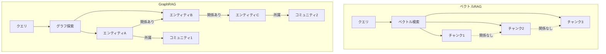
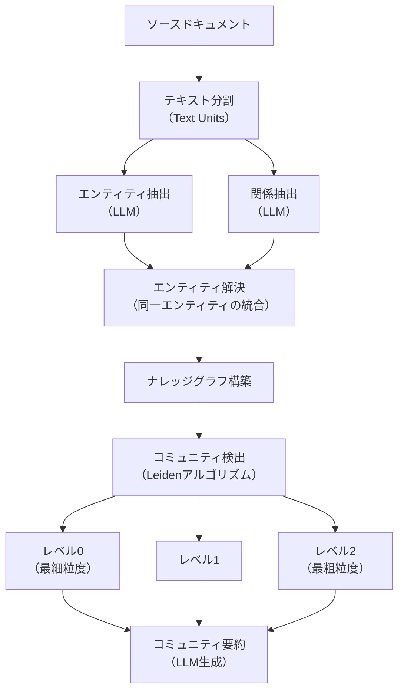
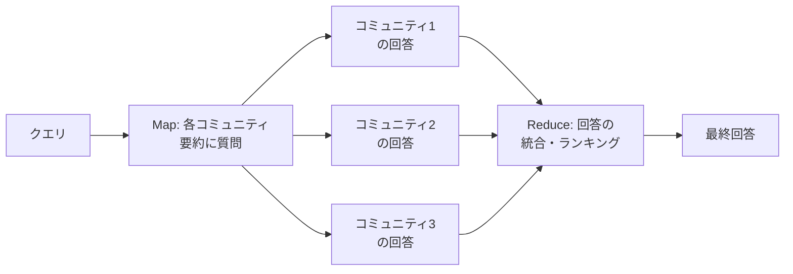
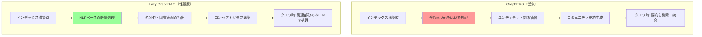
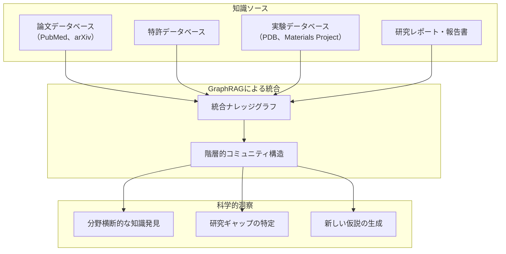
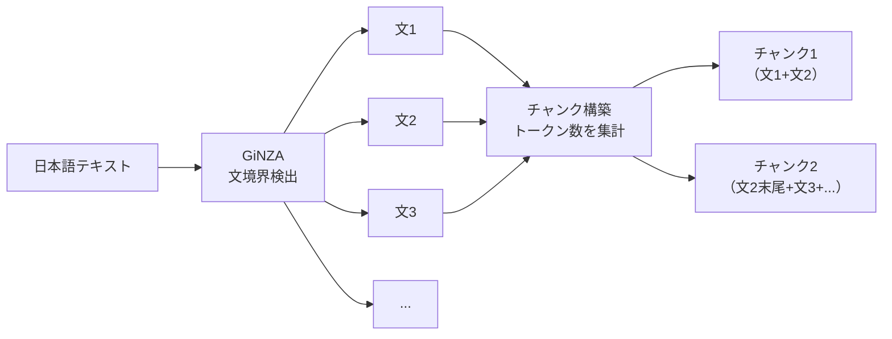

## はじめに

第3章では、AI for Scienceを支えるソフトウェア基盤の1つとして**GraphRAG**を紹介し、従来のRAGとの違いやナレッジグラフを活用した知識探索の基本概念を概観しました。本章では、GraphRAGのアーキテクチャをより詳細に解説するとともに、2024年末に発表された軽量版の**Lazy GraphRAG**を取り上げ、それぞれの特徴と科学研究への応用可能性を掘り下げます。

科学文献は指数関数的に増加し続けています。PubMedやarXivのような主要データベースには膨大な論文・プレプリントが蓄積され、日々新しい知見が追加されます。この膨大な知識の中から分野横断的な洞察を引き出すには、単純なキーワード検索やベクトル類似度検索だけでは不十分であり、**知識の構造的な理解**が不可欠です。GraphRAGとLazy GraphRAGは、この課題に対するMicrosoft Researchの2つのアプローチであり、それぞれ異なるトレードオフを持つ設計となっています[^1]。

[^1]: Edge, D. et al. (2024). From Local to Global: A Graph RAG Approach to Query-Focused Summarization. *arXiv:2404.16130*.

## 従来のRAGの限界

### ベクトルRAGの仕組みと弱点

従来の**RAG（Retrieval-Augmented Generation）** は、以下の手順で動作します。

1. ドキュメントをチャンク（断片）に分割し、各チャンクのベクトル埋め込みを生成
2. ユーザーのクエリをベクトル化し、コサイン類似度で近いチャンクを検索
3. 検索されたチャンクをLLMのコンテキストに挿入して回答を生成

このアプローチは**特定の事実に関する質問**（「AlphaFold2のパラメータ数は？」など）には効果的ですが、以下の種類の質問には根本的な限界があります。

| クエリの種類 | 例 | ベクトルRAGの対応 |
| ---- | ---- | ---- |
| **全体俯瞰型** | 「この研究領域の主要なテーマは何か？」 | ✕ 個別チャンクの検索では全体像を把握できない |
| **分野横断型** | 「材料科学と創薬に共通する手法は？」 | ✕ 異なる分野のチャンクを関連づけられない |
| **統合推論型** | 「GNNの進化が各応用分野にどう影響したか？」 | △ 断片的な情報しか得られない |
| **トレンド分析型** | 「過去5年間の研究動向の変化は？」 | ✕ 時系列的な構造を捉えられない |

### なぜ知識グラフが必要か

これらの限界の本質は、ベクトルRAGがドキュメントを**孤立したチャンクの集合**として扱い、チャンク間の**構造的な関係**を保持しないことにあります。



科学研究では、概念間の関係性こそが重要な知識です。「タンパク質Xは経路Yを制御し、疾患Zに関与する」という知識は、個々の事実の検索ではなく、エンティティ間の関係の連鎖としてはじめて意味を持ちます。GraphRAGは、この構造的な知識をナレッジグラフとして自動的に構築します。

## GraphRAGのアーキテクチャ詳解

第3章で概要を紹介したGraphRAGの処理パイプラインを、本節ではより詳細に解説します。

### インデックス構築パイプライン

GraphRAGのインデックス構築は、テキストからナレッジグラフを自動構築する多段階のパイプラインです。



#### ステップ1: テキスト分割（Text Units）

ソースドキュメントは固定サイズの**Text Units**に分割されます。各Text Unitはオーバーラップを持ち、エンティティや関係が分割境界で失われることを防ぎます。チャンクサイズはデフォルトで1,200トークン（初期の論文では300トークン）ですが、科学論文のように構造化されたドキュメントでは、セクション単位での分割も有効です。

#### ステップ2: エンティティ・関係抽出

GraphRAGの中核となるのが、LLMによる**エンティティと関係の抽出**です。各Text UnitはLLMに送られ、以下の情報が抽出されます。

| 抽出対象 | 属性 | 例（科学論文の場合） |
| ---- | ---- | ---- |
| **エンティティ** | 名前、型、説明 | 名前: "AlphaFold2"、型: MODEL、説明: "タンパク質構造予測モデル" |
| **関係** | ソース、ターゲット、説明、重み | ソース: "AlphaFold2"、ターゲット: "Evoformer"、説明: "AlphaFold2はEvoformerアーキテクチャを使用" |

同じエンティティが複数のText Unitsで抽出された場合、LLMが生成した説明文をマージすることで、より豊かなエンティティ記述が構築されます。

:::details エンティティ抽出のカスタマイズ
GraphRAGのエンティティ抽出では、ドメインに応じたプロンプトのカスタマイズが重要です。科学文献を対象とする場合、以下のようなエンティティ型を定義できます。

- **MOLECULE**: 化合物、タンパク質、分子名
- **METHOD**: アルゴリズム、実験手法、計算手法
- **PROPERTY**: 物性値、評価指標、実験結果
- **DATASET**: データベース、ベンチマーク
- **ORGANIZATION**: 研究機関、企業

エンティティ型をドメインに合わせて定義することで、抽出精度が向上します。
:::

#### ステップ3: Leidenコミュニティ検出

構築されたナレッジグラフに対して、**Leidenアルゴリズム**[^2]によるコミュニティ検出が行われます。Leidenアルゴリズムは、グラフ内の密に結合されたノード群（コミュニティ）を階層的に検出する手法です。

[^2]: Traag, V. A., Waltman, L., & van Eck, N. J. (2019). From Louvain to Leiden: guaranteeing well-connected communities. *Scientific Reports*, 9, 5233.

Leidenアルゴリズムは以下の3つのフェーズを繰り返すことで、最適なコミュニティ分割を探索します。

1. **ローカル移動**: 各ノードを隣接コミュニティに移動させ、モジュラリティの改善を評価
2. **リファインメント**: コミュニティの細分化により、不適切な割り当てを修正
3. **集約**: 発見されたコミュニティを1つのノードとして縮約し、上位レベルのグラフを構築

この処理を再帰的に適用することで、**階層的なコミュニティ構造**が得られます。レベル0はもっとも細粒度のコミュニティ（数個〜十数個のエンティティ）、上位レベルになるほど粗粒度のコミュニティ（多数のエンティティを包含）となります。

| レベル | 粒度 | 科学文献での例 |
| ---- | ---- | ---- |
| **レベル0** | 個別の研究トピックや手法 | 「NequIPとMACEによる等変力場」 |
| **レベル1** | 関連する研究分野 | 「機械学習力場全般」 |
| **レベル2** | 大きな研究領域 | 「原子スケールシミュレーション」 |

#### ステップ4: コミュニティ要約

各コミュニティに対して、LLMが**事前要約**を生成します。この要約には、コミュニティ内の主要エンティティと関係の説明、テーマの概要、重要な発見やトレンドの記述が含まれます。

この事前要約がGraphRAGの「記憶」として機能し、クエリ時に全テキストを再処理する必要をなくします。

### クエリエンジン

GraphRAGは3つのクエリモードを提供します。それぞれ異なる種類の質問に最適化されています。

#### Global Search（全体俯瞰型）

**Global Search**は、データセット全体に関する質問に回答するためのモードです。**Map-Reduceパターン**で動作します。



**Map段階**: 指定されたレベルのすべてのコミュニティ要約に対してクエリを投げ、各コミュニティが持つ関連情報を抽出します。各コミュニティからの回答には重要度スコアが付与されます。

**Reduce段階**: 各コミュニティからの回答をスコア順にソートし、LLMのコンテキストウィンドウに収まる量を統合して最終回答を生成します。

:::message
Global Searchは「この研究領域の主要な課題は何か？」「どのような手法が最近注目されているか？」のような俯瞰的な質問に適しています。コミュニティ要約を活用するため、個々のテキストチャンクでは得られない**全体的な構造**を捉えた回答が可能です。
:::

#### Local Search（特定エンティティ型）

**Local Search**は、特定のエンティティに関する詳細な質問に回答するためのモードです。

1. クエリからキーワードを抽出し、関連するエンティティを特定
2. 特定されたエンティティから関係をたどり、関連情報を収集
3. エンティティの説明、関係の記述、所属コミュニティの要約、関連Text Unitsを統合
4. 統合されたコンテキストをもとにLLMが回答を生成

Local Searchは「AlphaFold2の学習データは何を使っているか？」「GNoMEはどのような手法で材料を予測するか？」のような、特定対象に関する深い質問に適しています。

#### DRIFT Search（動的推論型）

**DRIFT（Dynamic Reasoning and Inference with Flexible Traversal）Search**は、Global SearchとLocal Searchの利点を組み合わせた探索モードです。

1. クエリに関連するコミュニティを特定し、初期コンテキストを構築
2. コミュニティの構造に基づいてフォローアップ質問を生成
3. 各フォローアップ質問に対してLocal Searchを実行
4. すべての結果を統合して最終回答を生成

DRIFT Searchは探索的な質問（「分子シミュレーションとAIの融合で今後どのような展開が考えられるか？」など）にとくに有効です。

| モード | 最適な質問タイプ | 処理の特徴 |
| ---- | ---- | ---- |
| **Global Search** | 全体俯瞰、テーマ分析 | Map-Reduceによるコミュニティ要約の統合 |
| **Local Search** | 特定エンティティの深掘り | エンティティ中心のグラフ探索 |
| **DRIFT Search** | 探索的、仮説生成的 | コミュニティ→フォローアップ→統合 |

## Lazy GraphRAG

### GraphRAGのコスト課題

GraphRAGは強力な知識探索を実現しますが、**インデックス構築のコスト**が大きな課題です。すべてのText UnitをLLMに送ってエンティティ・関係を抽出し、さらに各コミュニティの要約を生成するため、大規模なドキュメントコレクションではインデックス構築に膨大なLLM呼び出しが必要になります。

| 項目 | GraphRAG | ベクトルRAG |
| ---- | ---- | ---- |
| インデックス構築コスト | **高**（大量のLLM呼び出し） | **低**（埋め込みモデルのみ） |
| クエリ応答品質（ローカル） | 高 | 中〜高 |
| クエリ応答品質（グローバル） | **非常に高** | 低 |
| 構築時間 | 数時間〜数日 | 数分〜数時間 |

この高コストは、とくに大規模な科学文献コレクション（数万〜数十万件の論文）を対象とする場合に深刻な障壁となります。

### 設計思想: LLMコストの遅延実行

2024年11月、GraphRAGと同じMicrosoft Researchチームが**Lazy GraphRAG**を発表しました[^3]。Lazy GraphRAGの設計思想は明快です。

> 高コストなLLM処理を**インデックス構築時**ではなく**クエリ応答時**に遅延させる

[^3]: Edge, D. et al. (2024). LazyGraphRAG: Setting a new standard for quality and cost. *Microsoft Research Blog*, November 2024.

GraphRAGではインデックス構築時にすべてのText Unitのエンティティ抽出とコミュニティ要約を行うのに対し、Lazy GraphRAGでは構築時の処理を最小限にとどめ、クエリが来た時点で必要な部分のみをLLMで処理します。



### NLPベースの軽量インデックス

Lazy GraphRAGのインデックス構築では、LLMの代わりに**軽量なNLP技術**を使用します。

| 処理 | GraphRAG | Lazy GraphRAG |
| ---- | ---- | ---- |
| エンティティ抽出 | LLM（高精度・高コスト） | NER + 名詞句抽出（低コスト） |
| 関係抽出 | LLM（文脈理解型） | テキスト内の共起関係 |
| コミュニティ要約 | LLM（インデックス時に生成） | なし（クエリ時に動的生成） |
| 埋め込み生成 | なし | Text Unitのベクトル化 |

NLP技術による名詞句（noun phrase）の抽出と固有表現認識（NER）により、テキスト中の概念を自動的に特定します。これらの概念間の**共起関係**をもとに**コンセプトグラフ**が構築されます。同じText Unit内に出現する概念はエッジで結ばれ、共起頻度に応じたエッジ重みが付与されます。

### 科学論文に特化したNLP抽出器

Lazy GraphRAGのデフォルトNLP抽出器は汎用的な言語モデルを使用するため、科学論文の専門用語を十分に認識できないという弱点があります。

| 抽出器タイプ | 説明 | 科学用語の認識 |
| ---- | ---- | ---- |
| `regex_english` | NLTKベースの正規表現 | 低（英語のみ、パターンマッチ） |
| `syntactic_parser` | spaCy依存構文解析 + NER | 中（汎用モデルの限界） |
| `cfg` | spaCy CFG + NER | 中（汎用モデルの限界） |

汎用モデルでは、"attention mechanism" や "transformer architecture" のような**科学分野の複合名詞**、"DFT" や "PINN" のような**略語**が適切に認識されないことがあります。

この課題に対する解決策が、**scispaCy**[^6]の統合です。scispaCyは科学論文・生物医学文献に特化したspaCyモデルで、Allen Institute for AIが開発しています。科学用語の認識に最適化されており、Lazy GraphRAGの`syntactic_parser`のモデルとして指定できます。

[^6]: Neumann, M. et al. (2019). ScispaCy: Fast and Robust Models for Biomedical Natural Language Processing. *Proceedings of the 18th BioNLP Workshop*, pp. 319–327. https://allenai.github.io/scispacy/

```yaml
# settings.yaml
extract_graph_nlp:
  text_analyzer:
    extractor_type: syntactic_parser
    model_name: en_core_sci_lg    # scispaCyの科学論文用モデル
```

実際の比較実験では、scispaCyモデル（`en_core_sci_lg`）は汎用モデル（`en_core_web_sm`）と比べて、科学論文から抽出されるエンティティ数が**約80%増加**し、材料科学分野では用語カバレッジが**+16.7%**向上することが確認されています。

| 分野 | scispaCyカバレッジ | 汎用モデルカバレッジ | 改善幅 |
| ---- | ---- | ---- | ---- |
| 機械学習 | 85.7% | 78.6% | +7.1% |
| 材料科学 | 91.7% | 75.0% | **+16.7%** |
| 量子コンピューティング | 85.7% | 78.6% | +7.1% |
| 気候科学 | 66.7% | 83.3% | -16.6% |

:::message
scispaCyはすべてのエンティティを統一的な`ENTITY`タイプとして認識します。これにより、汎用モデルが`PERSON`、`ORG`、`CARDINAL`などに分散させてしまう科学用語が、一貫した概念ノードとしてグラフに組み込まれ、より密な知識構造が構築されます。ただし気候科学のように固有名詞（IPCC、Greenlandなど）が重要な分野では、汎用モデルが優位な場合もあります。
:::

#### 日英バイリンガル対応

日本語論文を対象とする場合は、**言語検出と適切なモデルの切り替え**が必要です。テキスト中の日本語文字（ひらがな・カタカナ・漢字）の割合を判定し、日本語テキストには`ja_core_news_lg`、英語テキストには`en_core_sci_lg`を自動的に適用するバイリンガル抽出器が有効です。

| 対象テキスト | 推奨モデル | エンティティカバレッジ |
| ---- | ---- | ---- |
| 英語科学論文 | `en_core_sci_lg`（scispaCy） | 82.4% |
| 日本語論文 | `ja_core_news_lg`（spaCy日本語） | 63.1% |
| 混合テキスト | 言語検出で自動切替 | 言語に応じた最適値 |

日本語論文を処理する場合、英語モデル（`en_core_sci_lg`）では日本語テキストをほとんど解析できないため、日本語モデル（`ja_core_news_lg`）の使用が必須です。「深層学習技術」「自然言語処理分野」のような日本語の複合名詞は、日本語モデルでのみ正確に抽出されます。

#### スケーラビリティ

scispaCy統合後のLazy GraphRAGは、モデルの初期ロード後は**約60論文/秒**の処理速度を維持します。10万件規模の論文コレクションでも約28分で処理が完了する見込みであり、メモリ使用量も約2.6GBで一定です。

| 論文数 | 処理時間 | 1論文あたり | メモリ |
| ---- | ---- | ---- | ---- |
| 10 | 7.8秒 | 776ms（初期ロード含む） | 2.6 GB |
| 50 | 0.8秒 | 16.8ms | 2.6 GB |
| 200 | 3.4秒 | 16.8ms | 2.6 GB |
| 100,000（推定） | 約28分 | 16.8ms | 2.6 GB |

### ベストファースト探索

Lazy GraphRAGのクエリ応答は、**ベストファースト探索**（best-first search）のアルゴリズムで動作します。

1. **初期検索**: クエリのベクトル埋め込みを用いて、もっとも関連性の高いText Unitsを検索
2. **概念展開**: 検索されたText Units内の概念をコンセプトグラフ上で追跡し、関連概念を発見
3. **動的コミュニティ形成**: 関連する概念群を動的にクラスタリングし、クエリ固有の「ローカルコミュニティ」を形成
4. **LLM処理**: 形成されたローカルコミュニティの関連Text UnitsをLLMで要約し、回答を生成
5. **反復的深化**: 回答の品質が十分でなければ、探索を拡張

この設計により、Lazy GraphRAGは**ベクトル検索のローカル精度**と**グラフベースのグローバル理解**を動的に組み合わせることができます。

### コスト比較

Lazy GraphRAGのもっとも大きな利点は、インデックス構築コストの大幅な削減です。

| 指標 | GraphRAG | Lazy GraphRAG | ベクトルRAG |
| ---- | ---- | ---- | ---- |
| インデックス構築のLLMコスト | **高** | **極めて低**（～GraphRAGの0.1%） | なし |
| クエリ応答のLLMコスト | 中 | 中〜高 | 低 |
| グローバルクエリの品質 | ◎ | ○〜◎ | ✕ |
| ローカルクエリの品質 | ○ | ◎ | ○ |
| インデックス更新の容易さ | △（再構築が必要） | ◎（差分追加が容易） | ◎ |

:::message
Lazy GraphRAGは、GraphRAGのインデックス構築コストを約**1,000分の1**に削減しながら、クエリ応答の品質を同等以上に維持することを目指しています。とくに大規模な科学文献コレクションを対象とする場合、このコスト削減は実用上きわめて重要です。
:::

## GraphRAGとLazy GraphRAGの使い分け

2つのアプローチはそれぞれ異なるユースケースに適しています。

| 条件 | 推奨アプローチ | 理由 |
| ---- | ---- | ---- |
| ドキュメントが頻繁に更新される | **Lazy GraphRAG** | インデックス再構築のコストが低い |
| コスト制約が厳しい | **Lazy GraphRAG** | インデックス構築コストが極めて低い |
| グローバルクエリが中心 | **GraphRAG** | 事前構築されたコミュニティ要約が高品質 |
| 探索的な質問が多い | **Lazy GraphRAG** | 動的なコミュニティ形成が柔軟 |
| 高い応答一貫性が必要 | **GraphRAG** | 事前構築された構造が安定的な回答を提供 |
| 大規模コレクション（10万件以上） | **Lazy GraphRAG** | インデックス構築の実現可能性 |

## 科学研究への応用

### 科学文献のシステマティックレビュー

GraphRAG/Lazy GraphRAGがもっとも直接的に価値を発揮するのは、**大規模な科学文献のレビュー**です。

従来のシステマティックレビューでは、研究者が数百〜数千件の論文を手動で読み、分類し、傾向を分析する必要がありました。GraphRAGを用いることで、このプロセスを大幅に効率化できます。

| 工程 | 従来の手法 | GraphRAGの活用 |
| ---- | ---- | ---- |
| 論文の分類 | 手動でキーワード・テーマ別に分類 | コミュニティが自動的にテーマ構造を発見 |
| トレンドの把握 | 年次ごとの発表数を手動で集計 | Global Searchで研究動向を自動分析 |
| 研究間の関連性 | 研究者の知識に依存 | ナレッジグラフのエッジで関連性を可視化 |
| 分野横断的な発見 | 偶然に依存 | コミュニティ間のブリッジエンティティを自動検出 |

:::details 科学文献レビューの具体例
たとえば「機械学習力場（MLFF）」に関する過去5年間の論文群をGraphRAGでインデックス化すると、以下のような洞察を自動的に得られます。

**Global Search**「MLFFの主要な研究動向は何か？」
→ コミュニティ構造から、等変ニューラルネットワーク、ユニバーサルポテンシャル、基盤モデルなどの研究クラスターが自動的に同定される

**Local Search**「MACEモデルの位置づけは？」
→ MACEエンティティからの関係をたどり、ACE（Atomic Cluster Expansion）理論との関係、NequIPとの比較、MACE-MP-0による汎用化の流れなどが構造的に提示される

**DRIFT Search**「MLFFの将来の課題は何か？」
→ 各コミュニティが指摘する課題（長距離相互作用、反応性、外挿可能性など）を統合した包括的な回答が得られる
:::

### 創薬・材料科学の知識統合

創薬や材料科学では、複数のデータソースからの知識統合が重要です。



GraphRAGのコミュニティ構造は、研究分野の「地図」として機能します。異なるコミュニティを橋渡しするエンティティ（**ブリッジエンティティ**）は、分野間をつなぐ重要な概念を示唆します。たとえば、「グラフニューラルネットワーク」というエンティティが材料科学コミュニティと創薬コミュニティの両方に属している場合、GNNを介した技術移転の可能性を示しています。

### 研究ナレッジマネジメント

研究機関やラボ内での**知識管理**にも、GraphRAG/Lazy GraphRAGは有効です。

- **実験ノートの構造化**: 研究者の実験ノート（テキスト）からエンティティ（試薬、条件、結果）と関係を抽出し、実験間の関連性を可視化
- **プロジェクト間の知識共有**: 異なるプロジェクトの成果物をGraphRAGでインデックス化し、プロジェクト間の隠れた関連性を発見
- **新メンバーのオンボーディング**: ラボの過去の研究成果をGraphRAGで構造化し、新メンバーが全体像を素早く把握

:::message
GraphRAGの科学研究への応用はまだ初期段階ですが、科学文献やデータが指数関数的に増加する中で、**構造的な知識探索**の必要性は今後ますます高まるでしょう。とくにLazy GraphRAGの低コストなインデックス構築は、個々の研究者やラボが独自のナレッジグラフを構築することを現実的にします。
:::

## 実装の概要

GraphRAGはPythonパッケージとして提供されており、`pip`でインストールできます[^4]。

[^4]: Microsoft. GraphRAG: A modular graph-based Retrieval-Augmented Generation (RAG) system. GitHub: https://github.com/microsoft/graphrag

```bash
pip install graphrag
```

基本的なワークフローは以下のとおりです。

1. **初期化**: `graphrag init` で設定ファイルを生成
2. **設定**: `settings.yaml` でLLMモデル、チャンクサイズ、エンティティ型等を設定
3. **インデックス構築**: `graphrag index` でドキュメントのインデックスを構築
4. **クエリ実行**: `graphrag query` でローカル/グローバル/DRIFT検索を実行

科学文献を対象とする場合、以下の設定がとくに重要です。

| 設定項目 | 推奨値（科学文献向け） | 理由 |
| ---- | ---- | ---- |
| エンティティ型 | MOLECULE, METHOD, PROPERTY, DATASET, ORGANIZATION | 科学ドメインの概念を適切に抽出 |
| チャンクサイズ | 500〜1,000トークン | 科学論文の段落構造に合わせる |
| コミュニティレベル | 3レベル | 論文→分野→大領域の階層 |
| 言語設定 | 対象論文の言語に合わせる | 日本語論文にも対応可能 |

## 日本語論文・研究ノートへの適用

GraphRAGはデフォルトで英語テキストを前提に設計されています。日本語の論文や研究ノートを対象とする場合、**チャンク分割（Chunking）** の最適化が不可欠です。ここでは、日本語テキスト特有の課題と解決策を解説します。

### 日本語テキストのチャンク分割における課題

英語テキストと日本語テキストでは、チャンク分割の前提が根本的に異なります。

#### 単語境界の不在

英語は単語間にスペースがあるため、トークン境界での分割が自然に機能します。しかし日本語にはスペースによる単語区切りがなく、`tiktoken`のトークン境界で分割すると意味のある単位での分割が保証されません。

```
英語: "Machine learning is powerful."
  → ["Machine", " learning", " is", " powerful", "."]

日本語: "機械学習は強力です。"
  → ["機械", "学", "習", "は", "強", "力", "です", "。"]
```

#### トークン効率の差異

`tiktoken`の`cl100k_base`エンコーディングでは、日本語1文字あたり約1〜3トークンを消費します。英語（1単語 ≈ 1〜2トークン）と比べてトークン効率が低いため、同じチャンクサイズ設定でも日本語のほうが含まれるテキスト量が大幅に少なくなります。

| 言語 | テキスト | 文字数 | トークン数 |
| ---- | ---- | ---- | ---- |
| 英語 | "This is a test." | 15 | 5 |
| 日本語 | "これはテストです。" | 9 | 11 |

この効率差を考慮し、日本語ではチャンクサイズを**800トークン程度**に設定することが推奨されます。

#### 文字化けのリスク

デフォルトのトークンベース分割では、マルチバイト文字の途中でバイト列が分断されることがあり、文字化けが発生する場合があります。

```
デフォルト分割の末尾:
  ...形態素解析ベースの□（文字化け）

カスタム分割の末尾:
  ...形態素解析ベースのチャンク分割（正常）
```

### 解決策: 形態素解析ベースのチャンク分割

これらの課題を解決するアプローチが、**形態素解析器による文境界検出**を用いたチャンク分割です。**GiNZA**[^5]（spaCyベースの日本語NLPライブラリ）を使用することで、日本語テキストを文単位で適切に分割できます。

[^5]: Megagon Labs. GiNZA - Japanese NLP Library. GitHub: https://github.com/megagonlabs/ginza

GiNZAは内部に**SudachiPy**（形態素解析器）を持ち、高精度なトークン化・品詞タグ付け・文境界検出を提供します。Universal Dependencies準拠であり、科学論文中の専門用語にも対応可能です。

:::details GiNZAベースの日本語チャンカーの動作原理

GiNZAを用いた日本語チャンカーは、以下の手順でテキストを分割します。

1. **文境界検出**: GiNZAの`doc.sents`で文単位に分割
2. **トークン集計**: 各文のトークン数を`tiktoken`で計算
3. **チャンク構築**: トークン数が上限に達するまで文を蓄積
4. **オーバーラップ**: 前チャンクの末尾の文を次チャンクの先頭に含めて文脈を維持



GiNZAが利用できない環境では、正規表現（`。`、`！`、`？`による分割）にフォールバックする設計が望ましいです。

:::

### 日本語対応の埋め込みモデル

チャンク分割と並んで重要なのが、**日本語に対応した埋め込みモデル**の選択です。GraphRAGのデフォルト設定では英語中心のモデルが使用されるため、日本語論文を対象とする場合は多言語対応モデルへの切り替えが必要です。

| モデル | 次元数 | 日本語対応 | 特徴 | 適した環境 |
| ---- | ---- | ---- | ---- | ---- |
| **bge-m3** | 1,024 | ◎ | BAAI製、100言語対応 | ローカル（Ollama） |
| **text-embedding-3-large** | 3,072 | ◎ | 高精度、次元数調整可能 | Azure AI Foundry |
| **Cohere-embed-v3-multilingual** | 1,024 | ◎ | 日本語含む多言語対応 | Azure AI Foundry |
| **qwen3-embedding** | 可変 | ◎ | 複数サイズ展開 | ローカル / クラウド |

ローカル環境で手軽に試す場合は**bge-m3**（Ollamaで利用可能）、エンタープライズ環境では**text-embedding-3-large**がMIRACLベンチマーク（多言語検索評価）で高いスコアを記録しており推奨されます。

:::message
日本語論文をGraphRAGで扱う際のポイントは3つです。（1）チャンクサイズを800トークン程度に抑える、（2）GiNZA等の形態素解析器で文境界を正しく検出する、（3）bge-m3やtext-embedding-3-largeなどの日本語対応埋め込みモデルを使用する。これらにより、英語論文と同等の検索・分析品質が得られます。
:::

## まとめ

本章では、Microsoftが開発したGraphRAGとLazy GraphRAGの2つの知識探索手法を詳解しました。

| 項目 | GraphRAG | Lazy GraphRAG |
| ---- | ---- | ---- |
| **設計思想** | 事前にナレッジグラフを完全構築 | 軽量インデックス＋クエリ時処理 |
| **インデックス構築** | LLMによるエンティティ・関係抽出 | NLPベースの概念抽出 |
| **構築コスト** | 高 | 極めて低（～0.1%） |
| **グローバルクエリ** | 事前要約による高品質回答 | 動的コミュニティ形成による回答 |
| **ローカルクエリ** | エンティティ中心の探索 | ベクトル検索＋グラフ探索の融合 |
| **適したユースケース** | 安定的な知識ベース | 頻繁に更新される大規模コレクション |

科学研究において、これらの手法はとくに次の場面で価値を発揮します。

- **大規模文献レビュー**: コミュニティ構造による研究テーマの自動分類と俯瞰
- **分野横断的な知識発見**: ブリッジエンティティを通じた分野間の関連性の発見
- **研究ナレッジマネジメント**: 実験ノートやプロジェクト成果の構造的な管理

次章以降では、AI for Scienceの具体的な応用分野を取り上げます。第6章では**分子シミュレーションとAI**、第7章では**材料探索・マテリアルズインフォマティクス**、第8章では**創薬とAI**、第9章では**気象・気候予測とAI**を詳しく解説します。

:::message
**この章のポイント**
- 従来のベクトルRAGは全体俯瞰型・分野横断型の質問に弱く、知識の構造的理解が欠如している
- GraphRAGはLLMでナレッジグラフを自動構築し、Leidenアルゴリズムで階層的コミュニティを検出
- Global Search（Map-Reduce）、Local Search（エンティティ中心）、DRIFT Search（動的推論）の3モードを提供
- Lazy GraphRAGはインデックス構築コストを約1,000分の1に削減し、クエリ時に動的にLLM処理を実行
- Lazy GraphRAGの科学論文適用にはscispaCy（科学特化spaCyモデル）の統合が有効で、エンティティ抽出数が約80%向上
- 科学文献のシステマティックレビュー、分野横断的知識発見、研究ナレッジマネジメントに応用可能
- 日本語論文では、形態素解析（GiNZA）による文境界検出と日本語対応埋め込みモデルの使用が不可欠
- GraphRAGはオープンソース（MITライセンス）で公開されており、Pythonから利用できる
:::
