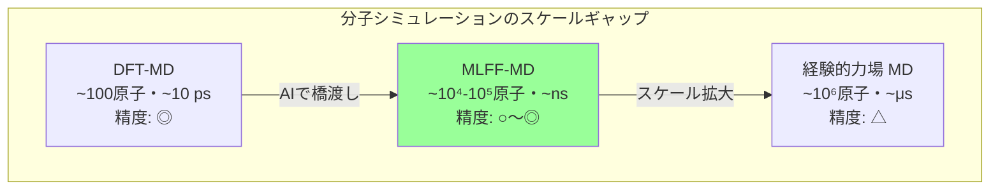
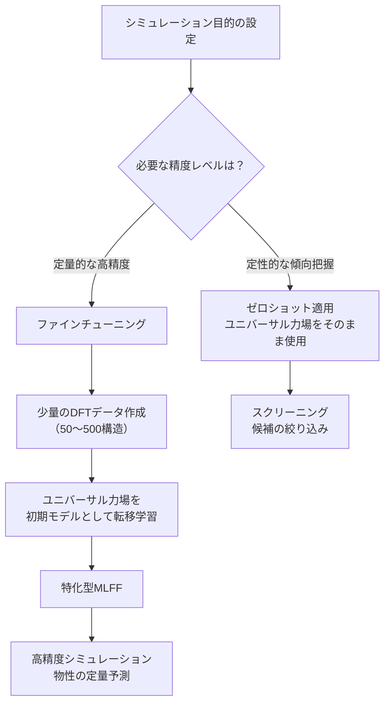
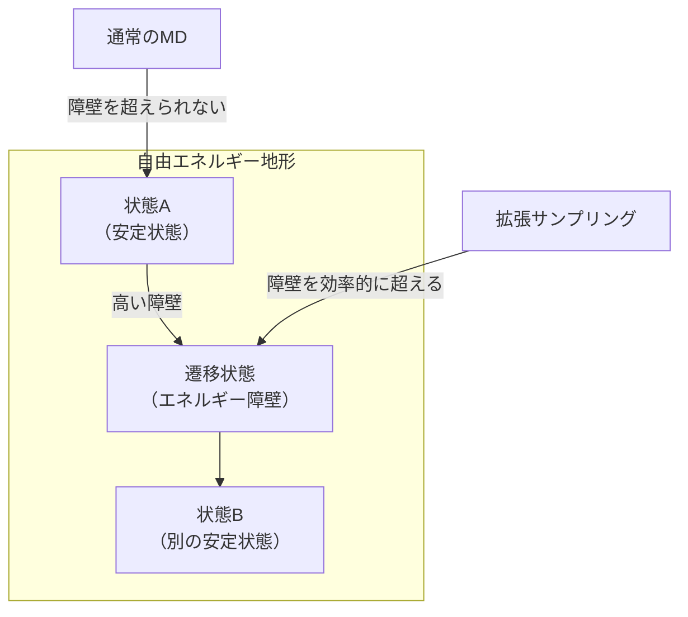
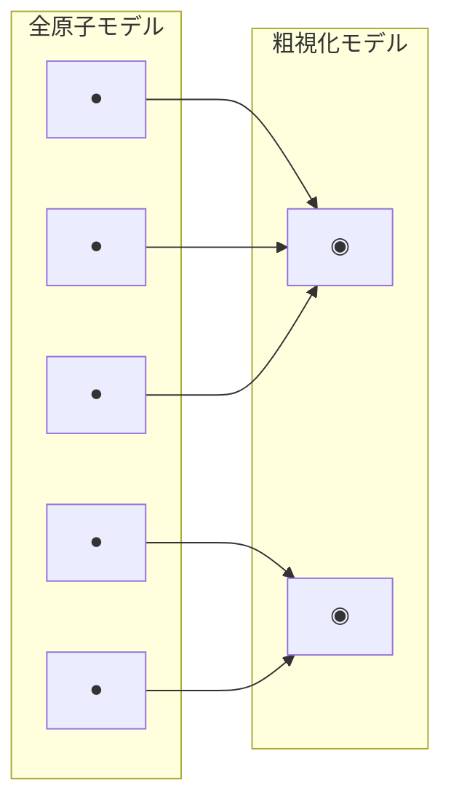

## はじめに

第4章では、機械学習力場（MLFF）や等変ニューラルネットワークなど、科学研究のためのAI手法を体系的に解説しました。本章では、これらの手法がもっとも直接的に応用される**分子シミュレーション**の領域に焦点を当て、AIがもたらす変革を具体的に見ていきます。

分子シミュレーションは、原子・分子レベルの物理現象を計算機上で再現する手法です。新材料の設計、薬剤候補の評価、化学反応メカニズムの解明など、現代の科学研究と産業応用の基盤となっています。しかし従来の手法は、**精度と計算コストのトレードオフ**という根本的な課題を抱えてきました。AIの導入は、このトレードオフを打破し、分子シミュレーションの到達可能な領域を飛躍的に拡大しつつあります。

## 分子シミュレーションの基礎

### 分子動力学シミュレーションとは

**分子動力学（Molecular Dynamics; MD）シミュレーション**は、原子の運動をニュートンの運動方程式にしたがって時間発展させる計算手法です。

$$m_i \frac{d^2 \mathbf{r}_i}{dt^2} = \mathbf{F}_i = -\nabla_{\mathbf{r}_i} V(\mathbf{r}_1, \mathbf{r}_2, \ldots, \mathbf{r}_N)$$

ここで $m_i$ は原子 $i$ の質量、$\mathbf{r}_i$ は位置、$V$ はポテンシャルエネルギー関数です。この方程式を数値的に積分することで、原子の軌道（トラジェクトリー）が得られます。

MDシミュレーションの精度と計算コストは、ポテンシャルエネルギー関数 $V$ の計算方法に大きく依存します。

### 力場の3つのレベル

分子シミュレーションで用いられるポテンシャルエネルギー関数（力場）は、大きく3つのレベルに分類されます。

| レベル | 手法 | 精度 | 計算コスト | 扱えるスケール |
| ---- | ---- | ---- | ---- | ---- |
| **経験的力場** | AMBER, CHARMM, OPLS | 低〜中 | 低 | 数百万原子・μs |
| **第一原理計算** | DFT（密度汎関数法） | 高 | 非常に高 | 数百原子・ps |
| **機械学習力場** | NequIP, MACE, MatterSim | 高（DFT級） | 中 | 数万〜数十万原子・ns |

#### 経験的力場の仕組みと限界

古典的な**経験的力場**は、原子間の相互作用を解析的な数式で表現します。

$$V = \underbrace{\sum_{\text{bonds}} k_r(r - r_0)^2}_{\text{結合伸縮}} + \underbrace{\sum_{\text{angles}} k_\theta(\theta - \theta_0)^2}_{\text{結合角変形}} + \underbrace{\sum_{\text{dihedrals}} V_n \cos(n\phi - \gamma)}_{\text{二面角回転}} + \underbrace{\sum_{i<j} \left[\frac{A_{ij}}{r_{ij}^{12}} - \frac{B_{ij}}{r_{ij}^6} + \frac{q_i q_j}{r_{ij}}\right]}_{\text{非結合相互作用（LJ + クーロン）}}$$

この経験的力場は計算が高速であり、タンパク質の折りたたみシミュレーション（数百万原子・マイクロ秒スケール）などに広く用いられています。しかし、以下の根本的な限界があります。

| 限界 | 説明 |
| ---- | ---- |
| **反応を扱えない** | 結合の生成・切断を記述できない |
| **電子状態の無視** | 電荷移動や分極効果を捉えられない |
| **転移性の低さ** | パラメータを調整した系以外では精度が保証されない |
| **パラメータ化の困難** | 新規材料ごとに手動でパラメータを決定する必要がある |

#### 第一原理計算（DFT）の壁

**DFT（密度汎関数法）** は量子力学に基づく高精度な計算手法であり、電子状態を陽に扱うため化学反応も記述できます。しかし計算コストは原子数 $N$ に対して $O(N^3)$ でスケールし、数百原子・数ピコ秒のシミュレーションが現実的な上限です。

:::message
この「DFTの精度で大規模・長時間のシミュレーションを行いたい」という要求こそが、機械学習力場の最大の動機です。第4章で解説したMLFFの基本概念を踏まえ、本章では具体的なモデルの設計思想と応用事例を詳しく見ていきます。
:::

## 機械学習力場の主要モデル

第4章では、MLFFの基本原理（DFTデータでの学習、エネルギーの自動微分による力の算出）と等変ニューラルネットワークの理論的基盤を解説しました。ここでは、分子シミュレーションで実際に使われている主要モデルの設計思想と性能を比較します。

### NequIP: 等変メッセージパッシングの先駆け

**NequIP（Neural Equivariant Interatomic Potentials）**[^1]は、2022年にMIT/Harvardのグループが発表した等変GNNベースの力場モデルです。

[^1]: Batzner, S. et al. (2022). E(3)-equivariant graph neural networks for data-efficient and accurate interatomic potentials. *Nature Communications*, 13, 2453.

NequIPの最大の特徴は、**E(3)等変なメッセージパッシング**により、物理的対称性を構造的に保証する点です。第4章で解説した球面調和関数とClebsch–Gordan積を用いたテンソル積演算により、スカラー（エネルギー）・ベクトル（力）・テンソル（応力）の物理量がすべて正しい変換則に従います。

| 特徴 | 詳細 |
| ---- | ---- |
| **等変性** | E(3)完全等変（平行移動・回転・鏡映） |
| **メッセージ構築** | テンソル積による等変畳み込み |
| **データ効率** | 従来モデルの**1/1000のデータ**でDFT精度を達成[^1] |
| **出力** | エネルギー（不変）→自動微分→力（等変）→応力（等変） |

NequIPは少量のDFTデータからでも高精度なモデルを構築でき、「1,000構造のDFTデータで、100万構造あたりのモデルと同等の精度」という結果が報告されています。

### MACE: 多体相互作用の効率的な表現

**MACE（Multi-ACE）**[^2]は、Cambridge大学のGábor Csányiらのグループが開発したモデルです。ACE（Atomic Cluster Expansion）記述子の理論とE(3)等変GNNを統合しています。

[^2]: Batatia, I. et al. (2022). MACE: Higher Order Equivariant Message Passing Neural Networks for Fast and Accurate Force Fields. *Advances in Neural Information Processing Systems (NeurIPS)*, 35.

NequIPが2体の相互作用を基本とするのに対し、MACEは**高次の多体相互作用**を1回のメッセージパッシングで効率的に捉えます。ACE記述子は原子環境を体系的に多体展開する枠組みであり、これをGNNに組み込むことで、少ないメッセージパッシング層数でも高い表現力を実現しています。

| 比較項目 | NequIP | MACE |
| ---- | ---- | ---- |
| **相互作用の次数** | 2体（テンソル積で拡張） | 多体（ACE記述子） |
| **必要な層数** | 4〜6層 | 2層で十分な場合が多い |
| **計算速度** | 中 | 高速（層数が少ないため） |
| **精度** | 高 | 高（とくに多体効果が重要な系で優位） |

### MACE-MP-0: ユニバーサル力場への一歩

2023年、MACEの開発チームはMaterials Projectの約15万構造を用いて学習した**MACE-MP-0**[^3]を公開しました。これは89元素をカバーする**ユニバーサル機械学習力場**であり、特定系向けの力場を個別に構築することなく、幅広い材料系のシミュレーションに利用できます。

[^3]: Batatia, I. et al. (2024). A foundation model for atomistic materials chemistry. *arXiv:2401.00096*.

| 特徴 | MACE-MP-0 |
| ---- | ---- |
| **学習データ** | Materials Projectの約15万構造（MPtrj） |
| **対応元素** | 89元素 |
| **モデルサイズ** | small / medium / large の3サイズ |
| **ライセンス** | MIT（オープンソース） |
| **用途** | ゼロショットでの構造最適化、フォノン計算、MD |

:::message
MACE-MP-0は「ファインチューニングなしで合理的な結果を得る」ことを目指したユニバーサル力場です。特定の系で高い精度が必要な場合は、MACE-MP-0を初期モデルとしてファインチューニングすることで、少量のDFTデータで高精度なモデルを効率的に構築できます。
:::

### MatterSim: Microsoftの汎用原子シミュレーター

第2章で紹介した**MatterSim**[^4]は、Microsoft Researchが開発した汎用的な深層学習原子シミュレーターです。大規模なDFTデータセット（約1,700万構造）で事前学習されており、広範な元素・温度・圧力条件下での材料シミュレーションを高精度に実行できます。

[^4]: Yang, H. et al. (2024). MatterSim: A Deep Learning Atomistic Model Across Elements, Temperatures and Pressures. *arXiv:2405.04967*.

MatterSimの際立った特徴は、**有限温度・有限圧力での物性予測**を重視している点です。多くのMLFFモデルが0 Kでの構造最適化を主な対象とするのに対し、MatterSimは温度・圧力依存の物性（自由エネルギー、熱膨張、相転移など）を精度よく予測することを設計目標としています。

| 項目 | MatterSim | MACE-MP-0 |
| ---- | ---- | ---- |
| **学習データ規模** | 約1,700万構造 | 約15万構造 |
| **温度・圧力の考慮** | ◎（アクティブラーニング生成データ含む） | △（0 K中心） |
| **対応元素** | 89元素 | 89元素 |
| **開発元** | Microsoft Research | University of Cambridge |
| **ライセンス** | MIT（オープンソース） | MIT（オープンソース） |

:::details MatterSimの学習データ生成戦略
MatterSimの学習データは、静的DFT計算だけでなく、さまざまな温度・圧力条件下でのab initio分子動力学（AIMD）シミュレーションから生成されています。さらに**アクティブラーニング**を活用し、モデルの予測不確実性が高い構造を優先的にDFT計算に回すことで、データの質と多様性を確保しています。

1. Materials Projectの既存データで初期モデルを構築
2. 有限温度でのAIMDでモデルの弱点を特定
3. 不確実性の高い構造を新たにDFT計算
4. データベースを拡張して再学習

このサイクルを繰り返すことで、約1,700万構造という大規模かつ多様な学習データセットが構築されました。
:::

### その他の注目モデル

| モデル | 開発元 | 特徴 | 主な対象 |
| ---- | ---- | ---- | ---- |
| **CHGNet** | UC Berkeley | 電荷（磁気モーメント）を陽に考慮 | 磁性材料、酸化還元反応 |
| **SevenNet** | Seoul National University | NequIPベースのスケーラブル並列MD[^7] | 大規模系のGPU並列シミュレーション |
| **ALIGNN** | NIST | 線グラフを用いた結合角情報の導入 | 材料物性の高速予測 |
| **ORB** | Orbital Materials | Transformer + GNNハイブリッド | 汎用力場、大規模系 |
| **ANI-2x** | University of Florida | 原子中心対称関数 + MLP | 有機分子、創薬 |

## ユニバーサル力場の活用ワークフロー

ユニバーサル力場（MACE-MP-0、MatterSimなど）の登場により、分子シミュレーションのワークフローは大きく変化しています。

### ゼロショット適用 vs ファインチューニング

| アプローチ | 必要なDFTデータ | 精度 | 用途 |
| ---- | ---- | ---- | ---- |
| **ゼロショット** | 0件 | 中（定性的に正しい） | 構造スクリーニング、安定性の大まかな評価 |
| **ファインチューニング** | 50〜500件 | 高（DFT級） | 物性の定量予測、相図の作成 |
| **スクラッチ学習** | 1,000件以上 | 高 | 特殊な系（既存データが少ない場合） |

:::message
ユニバーサル力場の使い方として推奨されるのは、まずゼロショットで広い候補空間をスクリーニングし、有望な候補に絞ったうえでファインチューニングにより高精度化するという**二段階戦略**です。これにより、DFT計算の回数を大幅に削減できます。
:::

### ファインチューニングの実践

ユニバーサル力場からのファインチューニングは、従来のスクラッチ学習と比べて以下のメリットがあります。

| 比較項目 | スクラッチ学習 | ファインチューニング |
| ---- | ---- | ---- |
| 必要データ量 | 1,000〜10,000構造 | **50〜500構造** |
| 学習時間 | 数時間〜数日 | 数十分〜数時間 |
| 汎化性能 | 学習データに強く依存 | ユニバーサル力場の知識を継承 |
| 外挿性能 | 低い | 比較的高い（事前学習データの多様性） |

ファインチューニングのポイントは以下の3点です。

1. **学習率の設定**: 事前学習済みの重みを壊さないよう、スクラッチ学習の1/10〜1/100の学習率を使用
2. **データの多様性**: 目的とする温度・圧力範囲を網羅する構造を含める
3. **検証セットの設計**: 学習データと異なる条件での予測精度を確認

## AIが拡げるMDシミュレーションの可能性

### レアイベントサンプリング

分子シミュレーションの大きな課題の1つが、**レアイベント（稀な事象）** のサンプリングです。タンパク質の折りたたみ、相転移、化学反応などの重要な現象は、通常のMDシミュレーションの時間スケール（ナノ秒〜マイクロ秒）よりもはるかに長い時間スケール（ミリ秒〜秒）で発生するため、直接観測が困難です。

従来の拡張サンプリング手法（メタダイナミクス、レプリカ交換法など）は、適切な**集団変数（Collective Variable; CV）** の選択に大きく依存します。CVは系の遷移を記述する低次元の反応座標ですが、複雑な系ではどのCVを使うべきか事前にはわかりません。

#### AIによる集団変数の自動発見

近年、機械学習を用いてCVを自動的に発見する手法が注目されています[^5]。

[^5]: Noé, F. et al. (2019). Boltzmann generators: Sampling equilibrium states of many-body systems with deep learning. *Science*, 365, eaaw1147.

| 手法 | アプローチ | 利点 |
| ---- | ---- | ---- |
| **オートエンコーダーCV** | MDトラジェクトリーのボトルネック表現 | 非線形CVの発見 |
| **時間遅れ独立成分分析（TICA）** | 遅い運動モードの抽出 | 物理的に解釈しやすい |
| **ディープTICA** | ニューラルネットワークによるTICA拡張 | 複雑な系にも適用可能 |
| **変分アプローチ** | 動的情報の変分原理に基づく | 理論的に最適なCVを保証 |

これらの手法をMLFFと組み合わせることで、「DFT精度の力場で長時間のレアイベントシミュレーション」が現実のものとなりつつあります。

### 粗視化モデルとAI

分子シミュレーションのスケールをさらに拡大するアプローチが、**粗視化（Coarse-Graining; CG）** です。複数の原子をまとめて1つの「ビーズ」として扱うことで、計算コストを大幅に削減し、より大きな系・長い時間スケールのシミュレーションを可能にします。

従来のCGモデルでは、粗視化ポテンシャルの決定が大きな課題でしたが、**機械学習によるCGポテンシャルの自動構築**が急速に進展しています[^6]。

[^6]: Wang, J. et al. (2019). Machine learning of coarse-grained molecular dynamics force fields. *ACS Central Science*, 5(5), 755-767.

| 手法 | 内容 | 特徴 |
| ---- | ---- | ---- |
| **ボトムアップCG** | 全原子シミュレーションのデータからCGポテンシャルを学習 | 熱力学的整合性が高い |
| **フォースマッチング** | 全原子の力をCG力に射影して学習 | 多体効果の捉えに限界 |
| **GNN-CG** | GNNでCGビーズ間の相互作用を学習 | 複雑な多体ポテンシャルを表現可能 |
| **フローベースCG** | フローモデルでCGとAA間のマッピングを学習 | 逆マッピング（CG→AA）も可能 |

:::message
機械学習CG力場の大きな利点は、全原子シミュレーションからCGポテンシャルを**自動的かつ系統的に**構築できる点です。従来は専門家が手作業で設計していたCGポテンシャルを、データ駆動的に決定できるため、新しい分子系への適用が格段に容易になります。
:::

### 化学反応の機械学習シミュレーション

経験的力場が扱えない**化学反応**のシミュレーションは、MLFFのもっとも期待される応用の1つです。結合の生成・切断を伴う過程をDFT精度で長時間追跡できるようになることで、反応メカニズムの解明が大きく進展します。

#### 反応性MLFF

化学反応を扱うMLFFには、通常の構造最適化用MLFFとは異なる工夫が必要です。

| 課題 | 説明 | 対応策 |
| ---- | ---- | ---- |
| **遷移状態の稀少性** | 学習データに遷移状態が含まれにくい | アクティブラーニングで遷移状態近傍を重点サンプリング |
| **エネルギー障壁の精度** | 反応障壁の小さな誤差が反応速度に大きく影響 | 遷移状態のデータを追加学習 |
| **結合トポロジーの変化** | 原子間の結合関係が変化する | カットオフ半径を十分に大きくとる |
| **多様な反応経路** | 1つの系で複数の反応が起こりうる | 反応経路探索とMLFF学習の反復 |

#### NEB法とMLFFの組み合わせ

**NEB（Nudged Elastic Band）法**は、反応経路と遷移状態を探索する代表的な手法です。2つの安定構造（反応物と生成物）の間にイメージ（中間構造）の連鎖を配置し、各イメージに対してエネルギーと力を計算することで、最小エネルギー経路を見つけます。

NEB法では各イメージのエネルギーと力を繰り返し計算する必要があるため、DFTベースのNEB計算は非常に高コストです。MLFFをエネルギー・力の計算に用いることで、NEB計算を**数百〜数千倍**高速化できます。

:::details NEB法の概要
NEB法では、$N$ 個のイメージ $\{\mathbf{R}_0, \mathbf{R}_1, \ldots, \mathbf{R}_N\}$ を弾性バンドで接続し、以下の力を各イメージに作用させます。

$$\mathbf{F}_i = \mathbf{F}_i^{\perp} + \mathbf{F}_i^{s\parallel}$$

- $\mathbf{F}_i^{\perp}$: ポテンシャルの力から経路接線方向の成分を除いたもの（スプリング力の垂直成分）
- $\mathbf{F}_i^{s\parallel}$: スプリング力の接線方向成分（イメージ間隔を均等に保つ）

遷移状態をより精密に求めるために、もっとも高エネルギーのイメージに**Climbing Image**法を適用し、エネルギー極大点に収束させます。

MLFFベースのNEB計算により、触媒表面上の反応経路探索や固体電解質中のイオン拡散経路の特定が、従来のDFT-NEBの数百倍の速度で実行可能になっています。
:::

## 科学的発見の事例

### リチウムイオン伝導体の設計

**固体電解質**は次世代の全固体電池のキー材料であり、リチウムイオンの高い伝導率を持つ新材料の探索が活発に行われています。MLFFを用いた分子動力学シミュレーションは、この分野で大きな成果を上げています。

Li₃YCl₆やLi₆PS₅Clなどの硫化物・ハロゲン化物系固体電解質において、MACEやMatterSimを用いたMDシミュレーションにより、以下の知見が得られています。

| 知見 | 手法 | 意義 |
| ---- | ---- | ---- |
| イオン拡散経路の可視化 | MLFF-MD + NEB | ボトルネック構造の特定 |
| 温度依存のイオン伝導率 | MLFF-MD + Green-Kubo | 実験値との定量的一致 |
| 格子欠陥の影響評価 | MLFF-MD | 欠陥がイオン伝導を促進/阻害する機構の解明 |
| 新組成の探索 | MLFF-MD + スクリーニング | 候補材料の高速評価 |

:::message
MLFFによるリチウムイオン伝導体の研究は、**DFTでは不可能だったスケール**（数万原子・数ナノ秒）でのシミュレーションを可能にしました。これにより、イオン伝導の統計的に信頼性の高い評価と、実験条件に近い温度でのシミュレーションが実現しています。
:::

### 相転移・相図の予測

物質の相転移（固体から液体への融解、結晶構造間の転移など）の予測は、材料設計にとって極めて重要です。相転移のシミュレーションには、以下が求められます。

1. **大規模な系**: 有限サイズ効果を抑えるため、数千〜数万原子が必要
2. **長時間のシミュレーション**: 相転移の核生成を観測するため、ナノ秒スケールが必要
3. **高い精度**: 相間の自由エネルギー差は小さいため、力場の精度が直接影響

これらの要件をすべて満たすには、MLFF-MDが現時点でもっとも適した手法です。

| 物質系 | 予測内容 | MLFFモデル | 成果 |
| ---- | ---- | ---- | ---- |
| シリコン | 融点の予測 | MACE | 実験値（1,687 K）に対して30 K以内の精度[^3] |
| 氷 | 多形間の相転移 | NequIP | 15種類以上の氷の多形の安定性を正しく再現 |
| ペロブスカイト | 構造相転移 | MatterSim | 温度誘起相転移の転移温度を予測 |

[^7]: Park, Y. et al. (2024). Scalable parallel algorithm for graph neural network interatomic potentials in molecular dynamics simulations. *J. Chem. Theory Comput.*, 20(11), 4857-4868.

### フォノン計算と熱特性

結晶材料の**フォノン分散関係**（格子振動のエネルギーと波数の関係）は、熱伝導率・比熱・熱膨張係数などの熱的性質を決定する根本的な情報です。フォノン計算には、原子を微小変位させた際のエネルギー変化（動力学行列）の精密な評価が必要であり、DFTでは大きなスーパーセルを用いた計算が必要です。

ユニバーサルMLFFはフォノン計算を大幅に効率化します。MACE-MP-0やMatterSimを用いることで、DFTの数百倍の速度でフォノン分散関係を計算でき、大規模なスクリーニングが可能になります。

| フォノン計算の比較 | DFT | MLFF |
| ---- | ---- | ---- |
| 1物質あたりの計算時間 | 数時間〜数日 | 数秒〜数分 |
| 必要な計算資源 | 数十〜数百GPU時間 | CPU数分 |
| スクリーニング | 困難（数十物質が限界） | 実現可能（数千物質） |
| 精度（フォノン周波数） | 基準 | DFTとの誤差 ~5%以内（MACE-MP-0） |

## 分子シミュレーションにおけるAIの課題

MLFFは飛躍的な進歩を遂げていますが、いくつかの重要な課題が残されています。

### 外挿性能の限界

もっとも根本的な課題は**外挿性能**です。MLFFは学習データの分布内では高い精度を示しますが、学習データにない条件（極端な温度・圧力、未知の化学組成など）での予測は信頼性が低下します。

| 状況 | リスク | 対策 |
| ---- | ---- | ---- |
| 学習範囲外の温度 | エネルギーが非物理的に発散 | 温度範囲を網羅するデータで学習 |
| 未知の元素組成 | 原子間相互作用の誤り | ユニバーサル力場のファインチューニング |
| 極端な圧力条件 | 構造が非物理的に崩壊 | 高圧条件のDFTデータを追加 |
| 化学反応の遷移状態 | 障壁の過大/過小評価 | アクティブラーニングで遷移状態を重点学習 |

### 不確実性の定量化

MLFFの予測には不確実性が伴いますが、その定量化は十分に確立されていません。シミュレーション結果の信頼性を判断するためには、モデルが「自分の予測にどれだけ自信があるか」を知る必要があります。

| 手法 | アプローチ | 計算コスト |
| ---- | ---- | ---- |
| **アンサンブル法** | 複数のモデルの予測のばらつきを評価 | 高（複数モデルの推論） |
| **MC Dropout** | ドロップアウトをテスト時にも適用 | 中（複数回の推論） |
| **学習済みの不確実性** | ガウシアン出力層でσを同時予測 | 低（1回の推論） |
| **距離ベース** | 学習データとの特徴空間距離 | 低 |

:::message
不確実性の定量化は、**アクティブラーニング**（不確実性の高い構造を優先的にDFT計算に回す）と組み合わせることで、MLFFの改善サイクルを効率的に回すためにも不可欠です。
:::

### 長距離相互作用

多くのMLFFモデルは、計算効率のためにカットオフ半径（通常5〜6 Å）内の原子間相互作用のみを考慮します。しかし、以下の系ではこのカットオフが問題となります。

- **イオン結晶**: 長距離のクーロン相互作用が支配的
- **金属表面**: 電子の非局在化による長距離効果
- **溶媒和構造**: 溶質と溶媒の長距離相関

この課題に対して、Ewald和法とMLFFを組み合わせた**長距離補正付きMLFF**や、Transformerのアテンション機構を活用した手法が研究されています。

## まとめ

本章では、AIが分子シミュレーションの領域にもたらす変革を解説しました。

| 変革の側面 | 従来のアプローチ | AI導入後 |
| ---- | ---- | ---- |
| **力場の精度** | 経験的パラメータ or 高コストDFT | DFT精度のMLFF（MACE, MatterSim等） |
| **スケール** | DFT: ~100原子 / 経験的: ~10⁶原子 | MLFF: 数万〜数十万原子をDFT精度で |
| **力場の構築** | ドメイン専門家が手動設計 | データ駆動で自動構築 |
| **汎用性** | 系ごとに個別の力場が必要 | ユニバーサル力場＋ファインチューニング |
| **レアイベント** | CVの手動設計が必要 | 機械学習によるCV自動発見 |
| **化学反応** | DFTベースのNEB（高コスト） | MLFFベースのNEB（数百倍高速） |

次章では、分子シミュレーションと密接に関連する**材料探索・マテリアルズインフォマティクス**の分野を取り上げ、GNoME・MatterGenなどのAIモデルが材料科学をどのように変革しているかを解説します。

:::message
**この章のポイント**
- 分子シミュレーションの精度と計算コストのトレードオフが、MLFFの導入により大幅に改善された
- NequIPは等変メッセージパッシングの先駆けであり、少量のデータで高精度を達成
- MACEはACE記述子と等変GNNの統合により、少ない層数で多体相互作用を効率的に表現
- MACE-MP-0やMatterSimなどのユニバーサル力場は、ゼロショット適用またはファインチューニングで広範な材料系をカバー
- MLFFとレアイベントサンプリング・粗視化モデルの組み合わせにより、従来不可能だったスケールのシミュレーションが実現
- リチウムイオン伝導体の設計、相転移予測、フォノン計算などの具体的な科学的発見がMLFFで加速
- 外挿性能・不確実性の定量化・長距離相互作用の扱いが、MLFFの主な残存課題
:::
