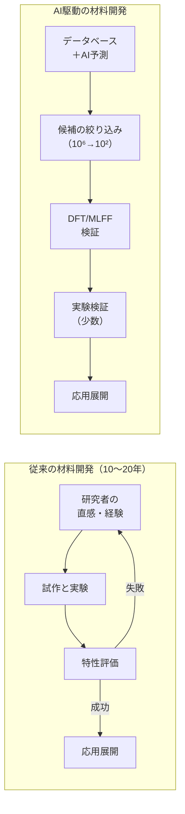
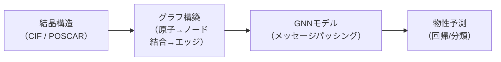
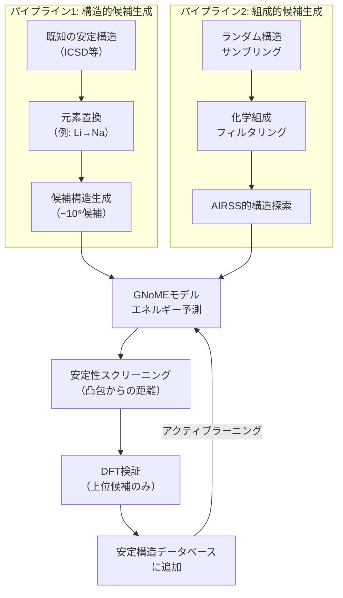
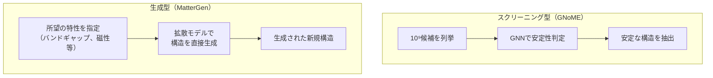
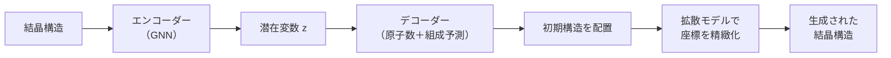
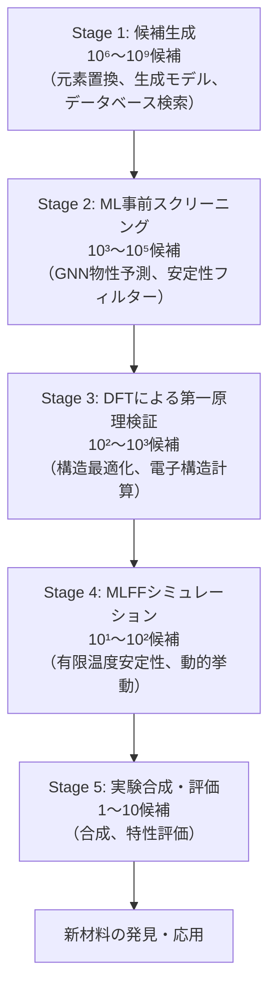
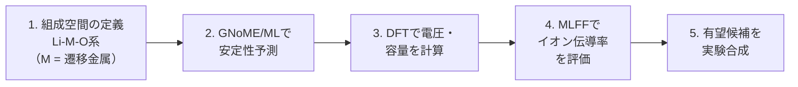
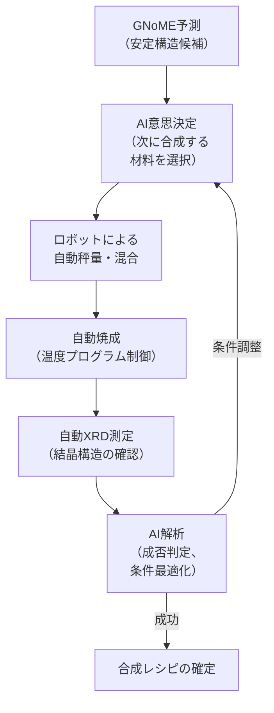
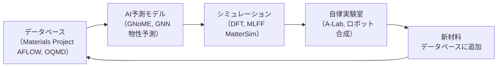
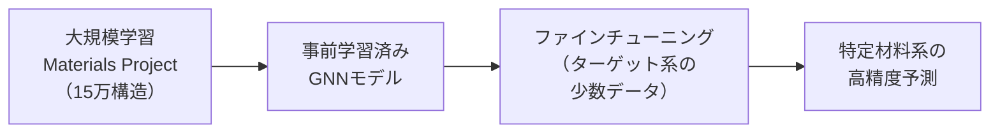

## はじめに

前章では、機械学習力場（MLFF）によって分子シミュレーションの速度と精度がどのように変革されたかを解説しました。本章では、MLFFとも密接に関連する**材料探索・マテリアルズインフォマティクス**の分野を取り上げます。

マテリアルズインフォマティクス（Materials Informatics、MI）とは、データ科学・機械学習を材料科学に体系的に適用し、新材料の発見・設計・最適化を加速する研究分野です。従来、新材料の開発には「合成→評価→改良」のサイクルを長期間繰り返す必要がありましたが、AIの導入によりこのサイクルが劇的に短縮されつつあります。

第2章ではGNoMEやMatterGenの登場を歴史的文脈の中で紹介しました。本章ではこれらのモデルのアーキテクチャや手法に踏み込み、材料探索の実践的なワークフローを解説します。

## 材料データベースとデータ基盤

### 計算材料データベースの発展

マテリアルズインフォマティクスの基盤は、大規模な材料データベースです。2000年代以降、第一原理計算（DFT）の結果を体系的に蓄積するプロジェクトが相次いで開始されました。

| データベース | 運営機関 | 開始年 | 収録数 | 主な特徴 |
| ---- | ---- | ---- | ---- | ---- |
| **Materials Project**[^mp] | ローレンス・バークレー国立研究所（LBNL） | 2011 | ~15万構造 | REST API、pymatgenライブラリ |
| **AFLOW**[^aflow] | デューク大学 | 2012 | ~370万構造 | 自動ワークフロー、合金データ |
| **OQMD**[^oqmd] | ノースウェスタン大学 | 2013 | ~100万構造 | 形成エネルギーに特化 |
| **ICSD** | FIZ Karlsruhe | 1978 | ~28万構造 | 実験構造の網羅的収録 |
| **NOMAD** | マックス・プランク協会 | 2014 | ~1億計算 | 計算の生データを保存 |

[^mp]: Jain, A. et al. (2013). Commentary: The Materials Project: A materials genome approach to accelerating materials innovation. *APL Materials*, 1(1), 011002.
[^aflow]: Curtarolo, S. et al. (2012). AFLOW: An automatic framework for high-throughput materials discovery. *Computational Materials Science*, 58, 218-226.
[^oqmd]: Saal, J. E. et al. (2013). Materials Design and Discovery with High-Throughput Density Functional Theory: The Open Quantum Materials Database (OQMD). *JOM*, 65, 1501-1509.

:::message
Materials Projectは、材料データへのプログラマティックアクセスを先駆的に実現したデータベースです。Pythonライブラリ**pymatgen**を通じて、結晶構造・バンド構造・状態密度・弾性定数などを一括取得でき、機械学習モデルの学習データとして広く利用されています。
:::

### データ表現: 結晶構造の記述

結晶構造をAIモデルで扱うには、適切なデータ表現が必要です。

| 表現方法 | 説明 | 利点 | 制限 |
| ---- | ---- | ---- | ---- |
| **組成ベース** | 化学式のみ（例: LiFePO₄） | 単純、高速 | 構造情報なし |
| **記述子ベース** | 手設計の特徴量（Coulomb Matrix等） | 物理的解釈が容易 | 設計にドメイン知識が必要 |
| **グラフ表現** | 原子＝ノード、結合＝エッジ | 構造情報を自然に表現 | グラフ構築の閾値に依存 |
| **3D格子表現** | ボクセルや点群 | 空間情報を完全に保持 | 計算コストが高い |
| **拡散表現** | ノイズ除去プロセスで学習 | 生成モデルに適合 | 学習が複雑 |

結晶構造は、格子ベクトル $\mathbf{a}, \mathbf{b}, \mathbf{c}$ と単位胞内の原子の分率座標 $\{(x_i, y_i, z_i, Z_i)\}$（$Z_i$は原子番号）で記述されます。結晶の周期境界条件を考慮すると、分率座標はトーラス $\mathbb{T}^3 = [0,1)^3$ 上の変数として扱うのが自然です（第4章参照）。

## 物性予測モデル

### グラフニューラルネットワークによる物性予測

材料の物性予測は、マテリアルズインフォマティクスのもっとも基本的なタスクです。与えられた結晶構造から、形成エネルギー・バンドギャップ・弾性定数などの物性を予測します。

| モデル | 開発元 | 特徴 | 代表的な成果 |
| ---- | ---- | ---- | ---- |
| **CGCNN**[^cgcnn] | MIT | 結晶グラフ畳み込み | 結晶物性予測のGNN先駆け |
| **MEGNet**[^megnet] | UCSD | グローバル状態ベクトル | 分子・結晶の両方に適用可能 |
| **ALIGNN**[^alignn] | NIST | 原子グラフ＋結合角グラフ | 角度情報による精度向上 |
| **DimeNet++** | TU München | 方向情報を明示的に利用 | 分子特性予測の高精度化 |
| **PaiNN** | TU Berlin | 等変メッセージパッシング | スカラー・ベクトル特徴の統合 |

[^cgcnn]: Xie, T. & Grossman, J. C. (2018). Crystal Graph Convolutional Neural Networks for an Accurate and Interpretable Prediction of Material Properties. *Physical Review Letters*, 120(14), 145301.
[^megnet]: Chen, C. et al. (2019). Graph Networks as a Universal Machine Learning Framework for Molecules and Crystals. *Chemistry of Materials*, 31(9), 3564-3572.
[^alignn]: Choudhary, K. & DeCost, B. (2021). Atomistic Line Graph Neural Network for improved materials property predictions. *npj Computational Materials*, 7, 185.

:::details CGCNN—結晶グラフ畳み込みネットワークの仕組み
CGCNNは結晶構造をグラフとして表現する先駆的なモデルです。各原子をノード、近接原子間の相互作用をエッジとして結晶グラフを構築し、畳み込み操作でノード特徴量を更新します。

結晶グラフの構築:
1. 各原子 $i$ にノード特徴量 $v_i$（元素の属性: 原子番号、電気陰性度など）を付与
2. カットオフ半径 $r_c$ 以内の原子ペア $(i, j)$ にエッジ特徴量 $u_{ij}$（原子間距離をガウシアン基底で展開）を付与
3. 周期境界条件を考慮し、隣接セルの原子も含めてエッジを構築

畳み込み更新:

$$v_i^{(t+1)} = v_i^{(t)} + \sum_{j \in \mathcal{N}(i)} \sigma\left(z_{ij}^{(t)} W_f + b_f\right) \odot g\left(z_{ij}^{(t)} W_s + b_s\right)$$

ここで $z_{ij}^{(t)} = v_i^{(t)} \oplus v_j^{(t)} \oplus u_{ij}$、$\sigma$ はシグモイド関数、$g$ はソフトプラス関数です。
:::

### ベンチマーク: Matbench

物性予測モデルの公正な比較のために、ローレンス・バークレー国立研究所（LBNL）が中心となって**Matbench**[^matbench]ベンチマークスイートが整備されています。

[^matbench]: Dunn, A. et al. (2020). Benchmarking materials property prediction methods: the Matbench test suite and Automatminer reference algorithm. *npj Computational Materials*, 6, 138.

| タスク | データ数 | 性質 | 評価指標 |
| ---- | ---- | ---- | ---- |
| 形成エネルギー | ~132,000 | 回帰 | MAE (eV/atom) |
| バンドギャップ | ~106,000 | 回帰 | MAE (eV) |
| 屈折率 | ~4,700 | 回帰 | MAE |
| 弾性定数 (log K, log G) | ~10,000 | 回帰 | MAE (log GPa) |
| ガラス形成能 | ~7,000 | 分類 | AUC-ROC |
| 金属/非金属分類 | ~4,900 | 分類 | AUC-ROC |

Matbenchにおいて、ALIGNNやMODNet（組成＋構造ベース）が多くのタスクで上位に位置していますが、**学習データの質と量がモデルアーキテクチャ以上に予測精度を左右する**ことも明らかになっています。

:::message
物性予測モデルは、第6章で解説したMLFFとは目的が異なります。MLFFが原子間のポテンシャルエネルギー面（PES）を学習するのに対し、物性予測モデルは結晶構造から巨視的物性（バンドギャップ、形成エネルギー等）を直接予測します。ただし、GNNのアーキテクチャは両者で共通する要素が多く、第6章で紹介したNequIPやMACEの設計思想は物性予測にも応用されています。
:::

## 結晶構造予測

### 結晶構造予測問題とは

結晶構造予測（Crystal Structure Prediction、CSP）は、与えられた化学組成に対して安定な結晶構造を見つける問題です。これは材料科学における中心的な未解決課題の1つであり、ポテンシャルエネルギー面上の大域的最小値を探索する組合せ最適化問題に帰着します。

$$\text{CSP}: \quad \min_{\{\mathbf{r}_i\}, \mathbf{L}} E(\{\mathbf{r}_i\}, \mathbf{L}) \quad \text{subject to} \quad \text{物理的制約}$$

ここで $\{\mathbf{r}_i\}$ は原子座標、$\mathbf{L}$ は格子行列です。

| アプローチ | 代表的手法 | 探索戦略 |
| ---- | ---- | ---- |
| **ランダムサーチ** | AIRSS[^airss] | ランダム構造生成＋局所最適化 |
| **進化的アルゴリズム** | USPEX | 遺伝的操作による構造進化 |
| **粒子群最適化** | CALYPSO[^calypso] | 群知能による探索 |
| **メタダイナミクス** | — | エネルギー面の効率的探索 |
| **機械学習ベース** | GNoME, CDVAE | GNN＋大規模スクリーニング/生成 |

[^airss]: Pickard, C. J. & Needs, R. J. (2011). Ab initio random structure searching. *Journal of Physics: Condensed Matter*, 23(5), 053201.
[^calypso]: Wang, Y. et al. (2012). CALYPSO: A method for crystal structure prediction. *Computer Physics Communications*, 183(10), 2063-2070.

従来のCSP手法では、DFTによるエネルギー評価を数万〜数十万回繰り返す必要があり、計算コストが膨大でした。AIの導入は、この計算コストの壁を2つの方向から打破しています。

1. **MLFFによる高速エネルギー評価**: DFTの代わりにMLFFでエネルギーを評価（第6章参照）
2. **GNNによる直接スクリーニング**: 安定性を直接予測し、不安定な候補を事前に除外

### GNoME: 材料探索のスケール革命

第2章で紹介したGNoME（Graph Networks for Materials Exploration）[^gnome]は、2023年にGoogle DeepMindが発表した材料探索モデルです。ここではそのアーキテクチャと探索手法の詳細に踏み込みます。

[^gnome]: Merchant, A. et al. (2023). Scaling deep learning for materials discovery. *Nature*, 624, 80-85. DOI: 10.1038/s41586-023-06735-9

#### 探索パイプラインの2段構成

GNoMEの核心は、2つの相補的な探索パイプラインを組み合わせた点にあります。

**パイプライン1（構造的候補生成）**は、既知の安定結晶を出発点とし、元素を系統的に置換して新規候補を生成します。たとえば、ペロブスカイト構造$\text{SrTiO}_3$のSrをBaやCaに置き換えることで、類似構造の候補を大量に生成します。

**パイプライン2（組成的候補生成）**は、ランダムに構造をサンプリングし、DFTで局所安定構造に緩和します。これにより、既知構造に似ていないまったく新しい構造タイプの発見が可能になります。

#### GNoMEモデルのアーキテクチャ

GNoMEでは、2種類のGNNアーキテクチャを使い分けています。

| モデル | アーキテクチャ | 入力 | 目的 |
| ---- | ---- | ---- | ---- |
| **GNoME-T** | GNN（変換不変） | 原子間距離のみ | 構造が未緩和な候補の高速スクリーニング |
| **GNoME-S** | GNN（球面調和関数） | 距離＋角度情報 | 緩和済み構造の高精度エネルギー予測 |

両モデルとも、Materials ProjectのDFTデータで学習されています。GNoME-Sは第6章で紹介したNequIPやMACEに類似した等変GNNの設計を採用しており、角度情報を球面調和関数で表現します。

#### 発見のスケール

GNoMEは、アクティブラーニングのサイクルを繰り返すことで、以下の成果を達成しました。

| 指標 | 数値 |
| ---- | ---- |
| 予測された新規安定構造数 | **~220万**（凸包以下） |
| GNoME以前に知られていた安定構造数 | ~4.8万（DFT検証済み） |
| 倍率 | **約45倍**（論文では「1桁の拡大」と表現） |
| DFT検証の精度（エネルギー誤差） | <0.1 eV/atom |
| 外部実験での検証成功率 | 71%（LBNL自律ラボA-Labでの検証）[^alab] |

[^alab]: Szymanski, N. J. et al. (2023). An autonomous laboratory for the accelerated synthesis of novel materials. *Nature*, 624, 86-91.

:::message alert
GNoMEの発見した~220万構造は、すべて熱力学的安定性（凸包からの距離が閾値以下）をDFTで検証済みですが、**合成可能性**（実際に作れるかどうか）は別問題です。理論的に安定でも、合成経路が存在しない、あるいは準安定相との競合で生成が困難な場合があります。LBNLのA-Lab実験では、GNoME候補の71%が実際に合成に成功しましたが、残りの29%は合成条件の制約で失敗しています。
:::

### 安定性予測の数学的基盤

結晶の熱力学的安定性は、**凸包（Convex Hull）** からの距離で定量化されます。

ある組成 $A_xB_y$ の化合物の形成エネルギー $\Delta H_f$ が、同じ元素系における他の安定相の凸包の上（正側）にあれば不安定、凸包上またはその下にあれば安定と判定されます。

$$E_{\text{hull}} = \Delta H_f - \Delta H_f^{\text{hull}} \geq 0 \quad \text{（不安定）}$$

GNoMEでは$E_{\text{hull}} < 0.1$ eV/atomを安定性の閾値として採用しています。

## 材料生成モデル

### 「探索」から「生成」へ

第4章で条件付き生成モデルの概念とMatterGenのコンセプトを紹介しました。ここでは、結晶構造の生成モデルのアーキテクチャと技術的な詳細を解説します。

材料探索のパラダイムは、GNoMEに代表される「スクリーニング型」から、MatterGenに代表される「生成型」へと進化しています。

| パラダイム | 代表モデル | アプローチ | 制限 |
| ---- | ---- | ---- | ---- |
| **スクリーニング型** | GNoME | 候補を列挙し安定性を判定 | 探索空間が組合せ的に制限される |
| **生成型** | MatterGen, CDVAE | 所望の特性を条件に構造を直接生成 | 生成品質がモデルに依存 |

### MatterGen: 結晶構造の条件付き拡散モデル

第2章で紹介したとおり、MatterGen[^mattergen]はMicrosoft Researchが2025年に*Nature*に発表した材料生成モデルです。ここではそのアーキテクチャの詳細を解説します。

[^mattergen]: Zeni, C. et al. (2025). A generative model for inorganic materials design. *Nature*, 637, 624-632. DOI: 10.1038/s41586-025-08628-5

#### 結晶構造の拡散プロセス

MatterGenは、結晶構造を構成する3つの要素を**同時に**拡散・生成します。

| 要素 | 数学的空間 | 拡散プロセス |
| ---- | ---- | ---- |
| **原子の種類** $A$ | 離散空間（元素の集合） | マスク/アンマスク拡散 |
| **原子の座標** $\mathbf{F}$ | 3次元トーラス $\mathbb{T}^3$ | ラップドガウシアンノイズ |
| **格子行列** $\mathbf{L}$ | $\mathbb{R}^{3 \times 3}$（正定値行列） | ガウシアンノイズ |

原子座標が通常のユークリッド空間ではなくトーラス $\mathbb{T}^3$ 上で定義される理由は、結晶の周期境界条件を満たすためです。分率座標 $(0.0, 0.5, 0.3)$ と $(1.0, 0.5, 0.3)$ は物理的に同じ位置を表すため、座標空間を $[0,1)$ の周期的な空間として扱います。

#### デノイジングネットワーク

MatterGenのデノイジングネットワークは、等変GNNに基づいています。ノイズの入った結晶構造 $(\tilde{A}, \tilde{\mathbf{F}}, \tilde{\mathbf{L}})$ を受け取り、ノイズ除去の方向（スコア関数）を予測します。

$$\epsilon_\theta(\tilde{A}, \tilde{\mathbf{F}}, \tilde{\mathbf{L}}, t) \rightarrow (\hat{\epsilon}_A, \hat{\epsilon}_F, \hat{\epsilon}_L)$$

ここで $t$ は拡散の時刻ステップ、$\theta$ はモデルパラメータです。ネットワークは結晶の対称性（並進・回転・鏡映）を保存するよう等変に設計されています。

#### 条件付き生成の実現

MatterGenの条件付き生成は、以下の特性を条件として指定可能です。

| 条件の種類 | 例 | 応用シナリオ |
| ---- | ---- | ---- |
| **化学組成** | Li, Fe, O を含む | 元素制約のある材料設計 |
| **結晶対称性** | 空間群 Fm$\bar{3}$m | 特定の結晶系を持つ材料設計 |
| **機械的特性** | 体積弾性率 > 200 GPa | 超硬材料の設計 |
| **電子的特性** | バンドギャップ 1.0-2.0 eV | 太陽電池材料の設計 |
| **磁気的特性** | 強磁性 | 磁性材料の設計 |

条件付き生成は、拡散プロセスのスコア関数に条件情報を注入する**Classifier-free guidance**で実現されています。

$$\tilde{\epsilon}_\theta = (1 + w) \epsilon_\theta(x_t, t, c) - w \epsilon_\theta(x_t, t)$$

ここで $c$ は条件ベクトル、$w$ はガイダンス強度です。

:::details MatterGenの学習データと検証結果
MatterGenは、Materials ProjectとAlexandria[^alexandria]のDFTデータ（約60万構造）で学習されています。生成された構造の評価では、以下の指標が報告されています。

| 評価指標 | 説明 | MatterGenの性能 |
| ---- | ---- | ---- |
| **安定性** | $E_{\text{hull}} < 0.1$ eV/atomの割合 | 従来手法を大幅に上回る |
| **新規性** | 学習データに存在しない構造の割合 | ~89% |
| **多様性** | 生成構造のカバーする空間群数 | ~120 |
| **妥当性** | 物理的に合理的な構造の割合 | ~98% |

DFTによる事後検証では、MatterGenが生成した構造の約80%がエネルギー的に安定であると確認されました。これはGNoMEのスクリーニング的アプローチとは質的に異なる結果であり、「所望の特性を持つ材料を直接設計する」というインバースデザインの実現可能性を示しています。

[^alexandria]: Schmidt, J. et al. (2022). Machine-learning-assisted determination of the global zero-temperature phase diagram of materials. *Advanced Materials*, 35(22), 2210788.
:::

### CDVAE: 結晶の変分拡散生成

MatterGen以前に提案された結晶生成モデルとして、**CDVAE（Crystal Diffusion Variational Autoencoder）**[^cdvae]があります。

[^cdvae]: Xie, T. et al. (2022). Crystal Diffusion Variational Autoencoder for Periodic Material Generation. *ICLR 2022*.

CDVAEは、VAE（変分オートエンコーダー）と拡散モデルを組み合わせたアーキテクチャです。

| 比較項目 | CDVAE | MatterGen |
| ---- | ---- | ---- |
| **生成アプローチ** | VAE ＋ 拡散モデル | 純粋な拡散モデル |
| **原子数の決定** | VAEのデコーダーで予測 | 拡散プロセスに含む |
| **条件付き生成** | 限定的（組成・構造制約） | 多様な物性条件に対応 |
| **学習データ** | Materials Project（~4万構造） | Materials Project + Alexandria（~60万構造） |
| **発表** | ICLR 2022 | Nature 2025 |

### DiffCSP: 結晶構造予測のための拡散モデル

**DiffCSP（Diffusion for Crystal Structure Prediction）**[^diffcsp]は、組成を入力として安定な結晶構造を予測する拡散モデルです。MatterGenが「条件付き材料生成」を目指すのに対し、DiffCSPは伝統的なCSP問題（組成→構造）に拡散モデルを適用したアプローチです。

[^diffcsp]: Jiao, R. et al. (2023). Crystal Structure Prediction by Joint Equivariant Diffusion. *NeurIPS 2023*.

## ハイスループット仮想スクリーニング

### ワークフローの全体像

材料探索の実践的なワークフローは、複数のステージから構成されます。各ステージで候補を絞り込む「ファネル」型のアプローチが一般的です。

各ステージの計算コストと精度のトレードオフを示します。

| ステージ | 手法 | ～1候補あたりの時間 | 精度 |
| ---- | ---- | ---- | ---- |
| ML事前スクリーニング | GNN推論 | ~0.01秒 | 中（~0.1 eV誤差） |
| DFT構造最適化 | VASP / Quantum ESPRESSO | ~数時間 | 高（化学精度） |
| MLFFシミュレーション | MACE / MatterSim | ~数分 | 高（DFT近似） |
| 実験合成 | ロボット/手動 | ~数日 | 確定 |

### 応用事例: リチウムイオン電池材料

ハイスループット仮想スクリーニングの代表的な成功事例として、リチウムイオン電池材料の探索があります。

リチウムイオン電池の電極材料に求められる特性:

| 特性 | 要求値 | 予測手法 |
| ---- | ---- | ---- |
| **電圧** | 2.5-5.0 V | DFTエネルギー差 |
| **理論容量** | >150 mAh/g | 組成から直接計算 |
| **イオン伝導率** | >10⁻⁴ S/cm | MLFF + MD |
| **構造安定性** | サイクル劣化が小さい | DFT + MLFFで体積変化評価 |
| **電子伝導性** | 適度（半導体-金属） | バンド構造計算 |

:::message
第6章で解説したMLFFベースの分子動力学は、ハイスループットスクリーニングのStage 4で重要な役割を果たします。GNoMEやGNNで候補を絞り込んだ後、MatterSimやMACE-MP-0で有限温度下でのイオン拡散や相安定性を評価するという、**ML予測→DFT検証→MLFFシミュレーション→実験**の多段階パイプラインが標準的なワークフローになりつつあります。
:::

### 応用事例: 熱電材料

熱電材料（温度差から電力を生成する材料）の探索も、MIの重要な応用分野です。

熱電性能は無次元性能指数 $ZT$ で評価されます。

$$ZT = \frac{S^2 \sigma T}{\kappa}$$

ここで $S$ はゼーベック係数、$\sigma$ は電気伝導率、$T$ は温度、$\kappa$ は熱伝導率です。$ZT > 1$ が実用的な熱電材料の目安ですが、これらの物性は相互にトレードオフの関係にあり、同時最適化が困難です。

| 物性 | GNN予測 | DFT計算 | MLFF活用 |
| ---- | ---- | ---- | ---- |
| ゼーベック係数 $S$ | バンドギャップから間接推定 | ボルツマン輸送方程式 | — |
| 電気伝導率 $\sigma$ | 限定的 | ボルツマン輸送方程式 | — |
| 格子熱伝導率 $\kappa_L$ | GNNで直接予測可能 | フォノン計算（高コスト） | MLFFフォノン（高速） |

第6章で紹介したMLFFベースのフォノン計算により、格子熱伝導率の高速スクリーニングが可能になり、熱電材料探索のスループットが向上しています。

## 自律材料探索

### ベイズ最適化の材料科学への適用

第4章でベイズ最適化の数学的枠組みを解説しましたが、ここでは材料科学における具体的な適用例を紹介します。

ベイズ最適化が材料科学でとくに有効な理由:

1. **実験が高コスト**: 1回の合成実験に数日〜数週間を要する
2. **探索空間が広大**: 組成×構造×プロセス条件の組合せ
3. **データが少ない**: 初期段階では数十〜数百点のデータしかない
4. **ノイズが大きい**: 実験のばらつきが避けられない

| 応用例 | 最適化対象 | 条件パラメータ | 成果 |
| ---- | ---- | ---- | ---- |
| 合金組成最適化[^bo-alloy] | 機械的強度 | 元素比率（5〜8元素） | 実験回数を従来の1/10に削減 |
| 薄膜合成条件 | 膜質（結晶性、面粗さ） | 基板温度、圧力、流量 | 最適条件を50回以内で発見 |
| 触媒設計 | 変換効率 | 組成、焼成温度、担体 | 手動探索の5倍の効率 |

[^bo-alloy]: Wen, C. et al. (2019). Machine learning assisted design of high entropy alloys with desired property. *Acta Materialia*, 170, 109-117.

### 自律実験室: A-Lab

ベイズ最適化と能動学習の究極的な形態が、**自律実験室（Self-Driving Laboratory）** です。ローレンス・バークレー国立研究所（LBNL）のA-Lab（Autonomous Lab）は、GNoMEと連携した世界初の材料合成自律実験室として注目を集めました[^alab]。

A-Labの特徴:

| 要素 | 詳細 |
| ---- | ---- |
| **運用形態** | 24時間365日の無人運転 |
| **合成手法** | 固相合成（粉末混合→焼成） |
| **評価手法** | 粉末X線回折（XRD） |
| **AI** | GNoMEの安定性予測 + ベイズ最適化 |
| **実績** | 17日間で58種の化合物合成を試行、41種（71%）で成功 |
| **処理速度** | 従来の手動実験に比べ約10倍の速度 |

:::message
A-Labの71%成功率は、合成の失敗原因の多くが「目的のフェーズが得られない」（=異なる結晶相が生成される）ことに起因しています。AIによる合成条件の最適化（焼成温度・時間のベイズ最適化）によって、失敗した材料の一部についても後続の試行で合成に成功しています。
:::

### 材料探索のデジタルツイン

より広い視点では、材料探索のワークフロー全体をデジタルツインとして構築する取り組みが進んでいます。

このサイクルは、人間の介在を最小限にしたまま、材料の発見→検証→応用のループを加速します。

## 最前線の研究動向

### マルチフィデリティー学習

材料データは精度（フィデリティー）の異なる複数のソースから得られます。

| フィデリティー | 手法 | 計算コスト | 精度 | データ量 |
| ---- | ---- | ---- | ---- | ---- |
| 低 | 半経験的手法、DFTB | 秒 | 低 | 大量 |
| 中 | GGA-DFT（PBE） | 数時間 | 中 | 中程度 |
| 高 | ハイブリッド汎関数（HSE06） | 数日 | 高 | 少量 |
| 最高 | GW計算、CCSD(T) | 数週間 | 最高 | 極少量 |

**マルチフィデリティー学習**は、安価な低精度データで大まかなモデルを学習し、高コストの高精度データでファインチューニングするアプローチです。これにより、限られた計算予算で高精度な予測モデルを構築できます。

### 合成可能性予測

理論的に安定な構造であっても、実際に合成できるとは限りません。**合成可能性（synthesizability）** の予測は、材料探索における重要な未解決課題です。

| アプローチ | 手法 | 限界 |
| ---- | ---- | ---- |
| **テキストマイニング** | 論文から合成レシピを抽出 | 未報告の手法は対象外 |
| **準安定相のエネルギー評価** | 分解経路の解析 | 速度論的安定性の評価が困難 |
| **機械学習分類器** | ICSD登録材料 vs 仮想材料 | 学習データのバイアス |
| **反応ネットワーク解析** | 可能な合成経路の列挙 | 計算コストが高い |

A-Labでの29%の合成失敗は、この合成可能性予測の困難さを如実に示しています。

### 転移学習と Few-Shot学習

特定の材料系に対するデータが限られている場合、関連する材料系で学習済みのモデルを**転移学習**で活用するアプローチが有効です。

とくに、第6章で紹介したMACE-MP-0やMatterSimのようなユニバーサル力場の概念は、物性予測モデルにも波及しています。汎用的な材料表現を大規模データで学習し、特定のタスクやターゲット物性への適応を少数データで行う「基盤モデル＋ファインチューニング」パラダイムが材料科学でも主流になりつつあります。

## まとめ

本章では、AIが材料探索のあり方をどのように変革しているかを解説しました。

| 変革の側面 | 従来のアプローチ | AI導入後 |
| ---- | ---- | ---- |
| **候補探索** | 研究者の直感、試行錯誤 | GNoMEで~220万構造を体系的探索 |
| **材料設計** | 既知材料の改良が中心 | MatterGenで目的指向の材料生成 |
| **物性予測** | DFTで1構造ずつ計算 | GNN（CGCNN, ALIGNN等）で高速予測 |
| **安定性評価** | DFT構造最適化（数時間/構造） | GNNで事前スクリーニング（~0.01秒/構造） |
| **実験検証** | 手動合成（数日/サンプル） | A-Lab自律実験（24時間無人運転） |
| **データ活用** | 個別研究グループ内に閉じる | Materials Projectで公開・共有 |

材料探索のワークフローは、「データベース→ML予測→DFT検証→MLFFシミュレーション→自律実験」の多段階パイプラインとして統合されつつあり、各ステージをAIが加速しています。

次章では、材料科学と同じくAIが大きなインパクトを与えている**創薬（Drug Discovery）** の分野を取り上げ、AlphaFoldをはじめとするタンパク質構造予測やAI創薬パイプラインを解説します。

:::message
**この章のポイント**
- マテリアルズインフォマティクスは、データ科学を材料科学に適用し、新材料の発見・設計を加速する分野
- Materials Project、AFLOW、OQMDなどの計算材料データベースがMIの基盤を支えている
- CGCNN、MEGNet、ALIGNNなどのGNNモデルにより、結晶構造から物性を高速に予測可能
- GNoMEは~220万の新規安定結晶構造を予測し、A-Lab実験で71%の合成成功率を達成
- MatterGenは拡散モデルで「目的指向の材料生成」を実現し、材料設計のパラダイムを転換
- ハイスループット仮想スクリーニングにより、電池材料・熱電材料などの探索が加速
- 自律実験室（A-Lab）により、AI予測→ロボット合成→自動評価のサイクルが24時間運転で実現
- 合成可能性予測やマルチフィデリティー学習など、未解決課題への取り組みも進行中
:::
