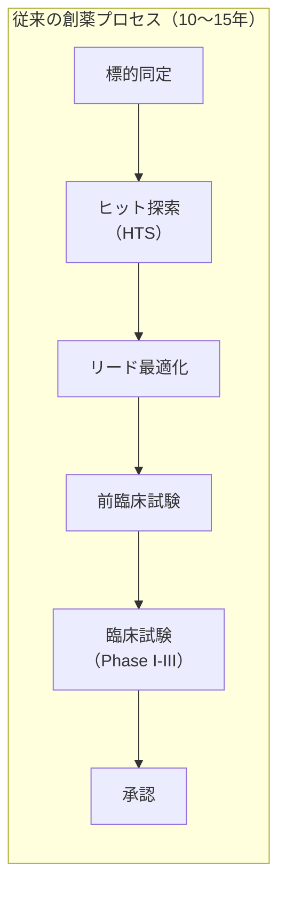
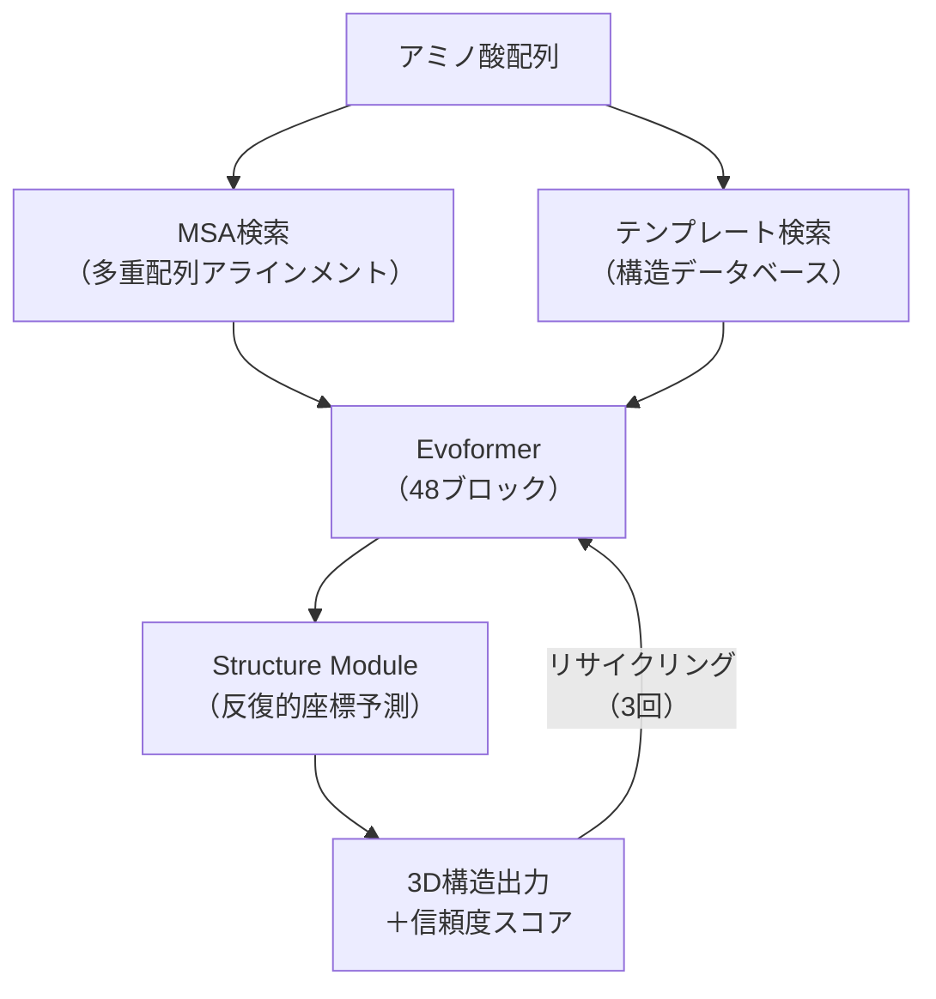
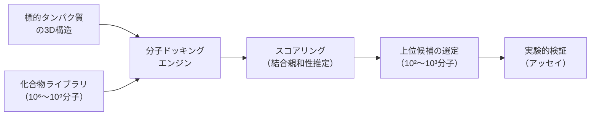
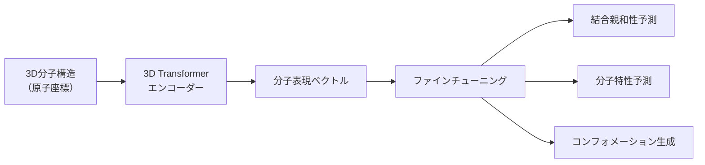
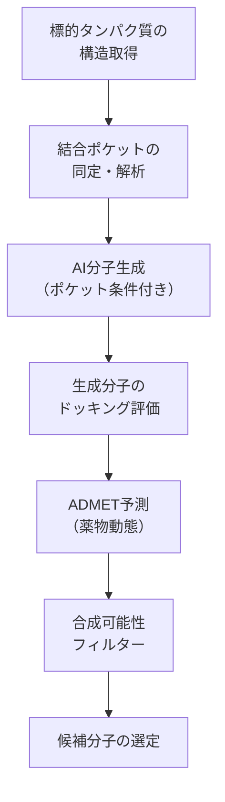
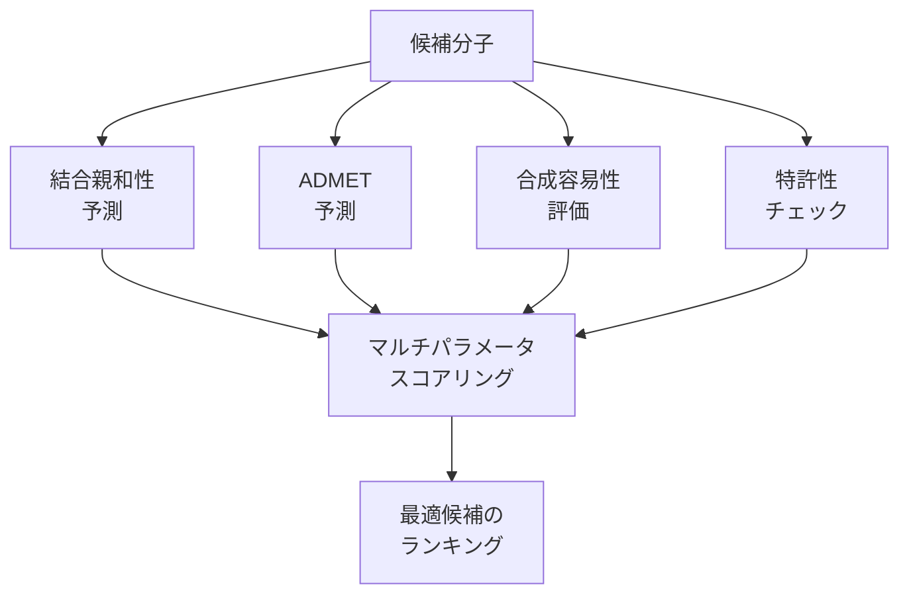
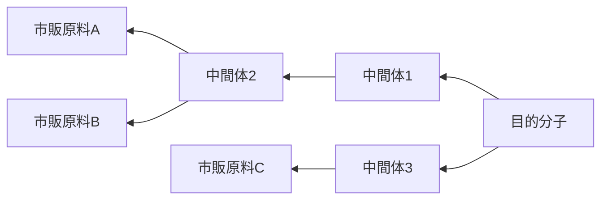
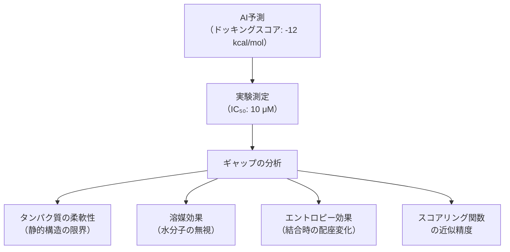

## はじめに

前章では、AIが材料探索・マテリアルズインフォマティクスの分野をどのように変革しているかを解説しました。本章では、AIがもっとも大きなインパクトを与えている応用分野の1つである**創薬（Drug Discovery）** を取り上げます。

創薬は、新たな薬を見つけ出し開発するプロセスです。従来の創薬は、候補化合物の発見から上市までに**平均10〜15年**、**20〜30億ドル**のコストがかかるとされてきました[^drugcost]。さらに、臨床試験に到達した化合物の約90%が最終的に承認されないという厳しい現実があります。

[^drugcost]: DiMasi, J. A. et al. (2016). Innovation in the pharmaceutical industry: New estimates of R&D costs. *Journal of Health Economics*, 47, 20-33.

AIは、このプロセスの各段階を加速する可能性を持っています。とくに**標的タンパク質の構造予測**（AlphaFold）、**バーチャルスクリーニング**（分子ドッキング）、**分子生成**（拡散モデル）の3つの領域で革新が起きています。

第2章ではAlphaFold2/3の登場を歴史的文脈の中で紹介し、第4章では条件付き生成モデルやRFdiffusion、DiffSBDDなどの理論的枠組みを解説しました。本章ではこれらを創薬の実践的パイプラインの中に位置づけ、AI創薬の現在地と課題を深掘りします。

## タンパク質構造予測とAlphaFold

### タンパク質の構造と機能

タンパク質は、20種類のアミノ酸が直列に連なったポリペプチド鎖が、特有の3次元構造に折りたたまれることで機能を発揮します。この「配列が構造を決定する」という原理は、1972年にノーベル化学賞を受賞したChristian Anfinsenが提唱した**Anfinsenのドグマ**（熱力学仮説）として知られています。

| 構造レベル | 定義 | 決定手法 |
| ---- | ---- | ---- |
| **一次構造** | アミノ酸配列 | DNA配列決定（高速、安価） |
| **二次構造** | αヘリックス、βシート | CD、NMR |
| **三次構造** | ポリペプチド鎖全体の折りたたみ | X線結晶構造解析、Cryo-EM |
| **四次構造** | 複数のサブユニットの会合 | Cryo-EM、X線結晶構造解析 |

創薬において標的タンパク質の3次元構造が重要な理由は、薬の多くが「鍵と鍵穴」の原理でタンパク質の特定の部位（結合ポケット）に結合して作用するためです。構造がわかれば、コンピューター上でその結合ポケットに適合する分子を設計できます。

### AlphaFold2のアーキテクチャ

第2章で紹介したとおり、AlphaFold2[^af2]はタンパク質構造予測の50年来の課題を事実上解決しました。ここではそのアーキテクチャを技術的に掘り下げます。

[^af2]: Jumper, J. et al. (2021). Highly accurate protein structure prediction with AlphaFold. *Nature*, 596, 583-589. DOI: 10.1038/s41586-021-03819-2

#### Evoformerモジュール

AlphaFold2の核心は**Evoformer**と呼ばれるモジュールです。2つの表現を交互に更新します。

| 表現 | 次元 | 意味 |
| ---- | ---- | ---- |
| **MSA表現** | $N_{\text{seq}} \times N_{\text{res}} \times c$ | 配列アラインメントの各残基の特徴 |
| **ペア表現** | $N_{\text{res}} \times N_{\text{res}} \times c$ | 残基ペア間の関係性 |

Evoformerでは、MSA表現の行方向と列方向にアテンションを適用し、ペア表現との相互作用を介して情報を伝搬させます。これにより、MSAに含まれる**共進化情報**（進化的に共変する残基ペアは空間的に近接する傾向がある）を効率的に抽出します。

:::details 共進化情報とは
タンパク質のアミノ酸残基対が進化の過程で共変動する現象を**共進化（coevolution）** と呼びます。たとえば、残基Aが変異すると残基Bも変異する傾向が見られる場合、これら2つの残基はタンパク質の折りたたみ構造において空間的に近接していることが多いです。AlphaFold2は、数千〜数万のホモログ配列から得られるMSAを入力とし、このような共進化パターンを学習して3次元構造を推論します。
:::

#### Structure Module

Evoformerの出力は**Structure Module**に渡され、各残基の3次元座標が推定されます。AlphaFold2では、各残基をリジッドボディー（剛体）フレームとして表現し、**Invariant Point Attention（IPA）** と呼ばれる機構で座標を更新します。

IPAは、3次元空間の回転・並進に対して不変（結果が座標系の選び方に依存しない）であることが保証されており、物理的に一貫した構造を出力するために重要です。

#### pLDDTスコア: 予測信頼度

AlphaFold2は、予測構造に対して残基ごとの信頼度スコア**pLDDT**（predicted Local Distance Difference Test）を出力します。

| pLDDTスコア | 解釈 | 創薬での利用 |
| ---- | ---- | ---- |
| >90 | 非常に高い信頼度 | ドッキング計算に直接利用可能 |
| 70-90 | 高い信頼度 | 骨格構造は信頼できる |
| 50-70 | 低い信頼度 | ループ領域、柔軟な部位 |
| <50 | 非常に低い信頼度 | 天然変性領域（IDP）の可能性 |

:::message
pLDDTスコアが低い領域は予測が不正確なのではなく、**本質的に構造が定まっていない**（天然変性タンパク質、ループ領域）場合が多いです。創薬では、結合ポケット周辺のpLDDTが高いことを確認したうえでドッキング計算を行うことが重要です。
:::

### AlphaFold3: 生体分子複合体の予測

第2章で紹介したAlphaFold3[^af3]は、AlphaFold2の範囲を単一タンパク質からより広い生体分子複合体へと拡張しました。

[^af3]: Abramson, J. et al. (2024). Accurate structure prediction of biomolecular interactions with AlphaFold 3. *Nature*, 630, 493-500. DOI: 10.1038/s41586-024-07487-w

| 比較項目 | AlphaFold2 | AlphaFold3 |
| ---- | ---- | ---- |
| **予測対象** | 単一タンパク質 | タンパク質、核酸、低分子、イオン |
| **MSA処理** | Evoformer（48ブロック） | Pairformer（簡略化） |
| **構造生成** | 反復的座標回帰 | 拡散モデル |
| **出力** | 単一構造 | 構造のサンプリング（アンサンブル） |
| **学習データ** | PDB | PDB + CSD + AFDB |

AlphaFold3における最大の技術的革新は、Structure Moduleを**拡散モデル**で置き換えた点です。AlphaFold2が構造を直接回帰で予測したのに対し、AlphaFold3はノイズから構造を段階的にデノイズすることで生成します。これにより以下のメリットが得られます。

1. **マルチモーダル分布**: 複数の安定構造（コンフォメーション）を生成可能
2. **低分子リガンドの扱い**: タンパク質だけでなく薬剤分子の結合ポーズも予測
3. **柔軟性の表現**: 構造のばらつきとして結合部位の柔軟性を表現

:::message alert
AlphaFold3はタンパク質−低分子リガンド結合の予測にも対応していますが、その精度は専用のドッキングソフトウェアに必ずしも勝るわけではありません。とくに結合**親和性**（結合の強さ）の定量的予測においては、AlphaFold3の予測構造をそのまま使うのではなく、物理ベースの精密化やフリーエネルギー計算と組み合わせることが推奨されています。
:::

### タンパク質言語モデル: ESMシリーズ

AlphaFoldがMSAベースのアプローチであるのに対し、Meta AI Research（旧Facebook AI Research）が開発した**ESM（Evolutionary Scale Modeling）** シリーズは、タンパク質配列を自然言語のように扱う**言語モデル**アプローチです。

| モデル | パラメータ数 | 学習データ | 主な能力 |
| ---- | ---- | ---- | ---- |
| **ESM-1b**[^esm1b] | 6.5億 | UniRef50 | 配列表現学習 |
| **ESM-2**[^esm2] | 150億 | UniRef50 | 構造予測、機能予測 |
| **ESMFold** | — | ESM-2ベース | MSA不要の構造予測 |

[^esm1b]: Rives, A. et al. (2021). Biological structure and function emerge from scaling unsupervised learning to 250 million protein sequences. *PNAS*, 118(15), e2016239118.
[^esm2]: Lin, Z. et al. (2023). Evolutionary-scale prediction of atomic-level protein structure with a language model. *Science*, 379(6637), 1123-1130.

ESM-2は、アミノ酸配列をトークンとして扱い、マスク言語モデル（BERTと同様のアプローチ）で事前学習されています。第4章で紹介した科学基盤モデルの代表例です。

ESMFoldの最大の利点は**MSA検索が不要**である点です。AlphaFold2はMSA検索に数分〜数十分を要しますが、ESMFoldは配列を入力するだけで数秒で構造を予測できます。精度はAlphaFold2にやや劣りますが、大量の配列を高速にスクリーニングする用途に適しています。

## バーチャルスクリーニング

### 分子ドッキングの原理

**バーチャルスクリーニング（Virtual Screening、VS）** は、コンピューター上で大量の化合物ライブラリから標的タンパク質に結合しうる候補を絞り込む手法です。その中核技術が**分子ドッキング**です。

分子ドッキングでは、リガンド（薬剤候補）をタンパク質の結合ポケット内に配置し、その相互作用エネルギーをスコアリング関数で評価します。

| ドッキングソフトウェア | 開発元 | 特徴 |
| ---- | ---- | ---- |
| **AutoDock Vina**[^vina] | Scripps研究所 | オープンソース、広く使用 |
| **Glide** | Schrödinger社 | 高精度スコアリング |
| **GOLD** | CCDC | 遺伝的アルゴリズムベース |
| **rDock** | Vernalis / オープンソース | 高速、大規模スクリーニング向け |
| **Uni-Dock**[^unidock] | DP Technology / 北京大学 | GPU加速、超大規模スクリーニング |

[^vina]: Eberhardt, J. et al. (2021). AutoDock Vina 1.2.0: New Docking Methods, Expanded Force Field, and Python Bindings. *Journal of Chemical Information and Modeling*, 61(8), 3891-3898.
[^unidock]: Yu, Y. et al. (2023). Uni-Dock: GPU-Accelerated Docking Enables Ultralarge Virtual Screening. *Journal of Chemical Theory and Computation*, 19(11), 3336-3345.

#### スコアリング関数

ドッキングスコアは、タンパク質とリガンドの相互作用を近似的にエネルギーとして評価します。

$$\Delta G_{\text{bind}} \approx \Delta G_{\text{vdW}} + \Delta G_{\text{elec}} + \Delta G_{\text{hbond}} + \Delta G_{\text{desolv}} + \Delta G_{\text{entropy}}$$

| 項 | 物理的意味 | 計算手法 |
| ---- | ---- | ---- |
| $\Delta G_{\text{vdW}}$ | ファンデルワールス相互作用 | Lennard-Jonesポテンシャル |
| $\Delta G_{\text{elec}}$ | 静電相互作用 | クーロン則 |
| $\Delta G_{\text{hbond}}$ | 水素結合 | 距離・角度依存関数 |
| $\Delta G_{\text{desolv}}$ | 脱溶媒和エネルギー | 表面積ベース |
| $\Delta G_{\text{entropy}}$ | エントロピーペナルティー | 回転可能結合数 |

:::message
従来のドッキングスコアリング関数は、結合親和性の**ランキング**（どれがより強く結合するか）にはある程度有効ですが、結合自由エネルギーの**絶対値**の予測は困難です。この限界を克服するため、機械学習ベースのスコアリング関数や、より厳密なフリーエネルギー摂動（FEP）計算との組み合わせが進んでいます。
:::

### AIベースのバーチャルスクリーニング

近年、深層学習を用いた新しいバーチャルスクリーニング手法が急速に発展しています。

| 手法 | アプローチ | 利点 | 代表的モデル |
| ---- | ---- | ---- | ---- |
| **3D-CNN** | タンパク質−リガンド複合体を3Dグリッドで表現 | 空間情報を直接利用 | Pafnucy, OnionNet |
| **GNN** | タンパク質・リガンドをグラフで表現 | 原子レベルの相互作用 | PotentialNet, IGN |
| **SE(3)-等変GNN** | 3D座標の回転・並進に等変 | 物理的一貫性 | EGNN, GVP |
| **事前学習モデル** | 大規模分子データで事前学習 | 少数データでの転移学習 | Uni-Mol[^unimol] |

[^unimol]: Zhou, G. et al. (2023). Uni-Mol: A Universal 3D Molecular Representation Learning Framework. *ICLR 2023*.

#### Uni-Mol: 分子の基盤モデル

Uni-Molは、3D分子表現の基盤モデルとして設計されています。約2億の分子コンフォメーションで事前学習されており、結合親和性予測や分子特性予測など幅広いタスクにファインチューニングで適用できます。

### 超大規模バーチャルスクリーニング

化合物ライブラリの規模は急速に拡大しています。

| ライブラリ | 規模 | 特徴 |
| ---- | ---- | ---- |
| **ZINC** | ~10億 | 市販化合物 |
| **Enamine REAL** | ~60億 | オンデマンド合成可能 |
| **GDB-17** | ~1660億 | 理論的に可能な小分子 |
| **仮想ライブラリ** | >10¹² | 生成モデルによる無限生成 |

これらの超大規模ライブラリに対するドッキングは、GPUの並列化が不可欠です。Uni-DockなどのGPU対応ドッキングエンジンにより、**1日あたり10億分子以上**のスクリーニングが可能になっています。

## AI分子生成

### SMILES表現と分子グラフ

AIで分子を扱うには、化学構造をコンピューターが処理できる形式に変換する必要があります。

| 表現方法 | 形式 | 例（アスピリン） | 利点 |
| ---- | ---- | ---- | ---- |
| **SMILES** | 文字列 | CC(=O)Oc1ccccc1C(=O)O | テキストモデルに直接利用 |
| **SELFIES** | 文字列 | [C][C](=[O])[O][c]... | 常に化学的に妥当 |
| **分子グラフ** | グラフ | 原子=ノード、結合=エッジ | GNNに直接入力 |
| **3D座標** | 点群 | 各原子の(x, y, z) | 立体構造を表現 |
| **フィンガープリント** | ビットベクトル | 1024ビット | 類似性検索に高速 |

:::details SMILES記法の基礎
**SMILES（Simplified Molecular-Input Line-Entry System）** は分子を1次元の文字列で表現する記法です。

- 原子: C, N, O, S, ... （大文字は脂肪族、小文字は芳香族）
- 結合: -（単結合、省略可）、=（二重結合）、#（三重結合）
- 分岐: ()で括る
- 環: 数字で開環・閉環を指定

例:
- エタノール: CCO
- ベンゼン: c1ccccc1
- カフェイン: Cn1c(=O)c2c(ncn2C)n(C)c1=O

SMILESは1文字列で分子を表現できるため、**自然言語処理のテクニック（RNN、Transformer等）**をそのまま分子生成に転用できるのが大きな利点です。
:::

### 構造ベース薬剤設計: SBDD

**SBDD（Structure-Based Drug Design）** は、標的タンパク質の3次元構造情報を利用して薬剤分子を設計するアプローチです。AlphaFoldによる構造予測の革新は、SBDDに利用できるタンパク質構造を飛躍的に増加させました。

#### 拡散モデルによるSBDD

第4章で紹介した条件付き拡散モデルのDiffSBDD[^diffsbdd]は、標的タンパク質の結合ポケットを条件として、そこに適合するリガンド分子を3Dで直接生成します。

[^diffsbdd]: Schneuing, A. et al. (2023). Structure-based Drug Design with Equivariant Diffusion Models. *arXiv:2210.13695*.

| モデル | 生成方式 | 入力条件 | 生成対象 |
| ---- | ---- | ---- | ---- |
| **DiffSBDD** | 3D等変拡散 | 結合ポケットの3D構造 | 原子の種類と3D座標 |
| **Pocket2Mol**[^p2m] | 自己回帰 | 結合ポケットの3D構造 | 原子を逐次配置 |
| **TargetDiff**[^targetdiff] | SE(3)拡散 | 結合ポケットの3D構造 | 原子の種類と3D座標 |
| **DrugGPT** | 自己回帰（SMILES） | タンパク質配列/構造 | SMILES文字列 |

[^p2m]: Peng, X. et al. (2022). Pocket2Mol: Efficient Molecular Sampling Based on 3D Protein Pockets. *ICML 2022*.
[^targetdiff]: Guan, J. et al. (2023). 3D Equivariant Diffusion for Target-Aware Molecule Generation and Affinity Prediction. *ICLR 2023*.

#### 生成分子の評価指標

AI生成分子の品質は、複数の観点から評価されます。

| 指標 | 説明 | 目標 |
| ---- | ---- | ---- |
| **結合親和性** | ドッキングスコア（Vina score等） | 低いほど良い（負の値） |
| **薬物適性（QED）** | 薬らしさの定量的指標 | 0-1、高いほど良い |
| **合成容易性（SA）** | 合成の難易度スコア | 1-10、低いほど容易 |
| **新規性** | 既知薬剤との類似度 | 高い新規性が望ましい |
| **多様性** | 生成分子間の構造多様性 | 高いほど良い |
| **妥当性** | 化学的に有効な構造の割合 | 100%が理想 |

### RFdiffusion: タンパク質設計

RFdiffusion[^rfdiff]は、David Baker研究室（ワシントン大学）が開発したタンパク質設計ツールで、RoseTTAFoldの構造予測能力を拡散モデルの枠組みに組み込んだモデルです。

[^rfdiff]: Watson, J. L. et al. (2023). De novo design of protein structure and function with RFdiffusion. *Nature*, 620, 1089-1100. DOI: 10.1038/s41586-023-06415-8

RFdiffusionが生成するのは**タンパク質のバックボーン構造**（Cα原子の3次元座標）であり、アミノ酸配列は**ProteinMPNN**[^mpnn]で別途設計されます。このバックボーン→配列の2段階設計パイプラインは、タンパク質設計の標準的なワークフローとなっています。

[^mpnn]: Dauparas, J. et al. (2022). Robust deep learning-based protein sequence design using ProteinMPNN. *Science*, 378(6615), 49-56.

| 設計タスク | 入力条件 | 成功率 |
| ---- | ---- | ---- |
| **結合タンパク質設計** | 標的タンパク質の表面 | 実験的検証で結合確認 |
| **酵素設計** | 活性部位の幾何学 | 触媒活性を持つ設計に成功 |
| **対称ホモオリゴマー** | 対称性制約（C2, C3等） | 高い成功率 |
| **ウイルス中和抗体様タンパク質** | エピトープ構造 | ナノモル親和性を達成 |

:::message
RFdiffusionの成果は、2024年のノーベル化学賞でDavid Baker氏の受賞理由の1つとなった「計算的タンパク質設計」の最前線です。従来のRosettaベースの設計と比較して、RFdiffusionは設計の成功率を大幅に向上させ、これまで到達できなかった複雑な設計タスクを可能にしました。
:::

## ADMET予測とマルチパラメータ最適化

### ADMETとは

薬剤候補が臨床試験で失敗する主な原因の1つは、**薬物動態特性（ADMET）** の問題です。

| パラメータ | 意味 | 重要性 |
| ---- | ---- | ---- |
| **A**bsorption（吸収） | 体内への取り込み効率 | 経口投与の場合にとくに重要 |
| **D**istribution（分布） | 体内での分布パターン | 標的組織への到達性 |
| **M**etabolism（代謝） | 肝臓等での代謝速度 | 薬効の持続時間に影響 |
| **E**xcretion（排泄） | 体外への排出経路・速度 | 蓄積毒性のリスク |
| **T**oxicity（毒性） | 副作用・毒性 | 安全性の決定因子 |

### AIによるADMET予測

従来、ADMET特性の評価には動物実験や細胞アッセイが必要でしたが、機械学習モデルにより計算的な予測が可能になっています。

| 予測タスク | 代表的手法 | 精度（AUC-ROC） |
| ---- | ---- | ---- |
| BBB浸透性（血液脳関門通過） | GNN、Transformer | ~0.90 |
| hERG阻害（心毒性リスク） | GNN、ランダムフォレスト | ~0.85 |
| CYP450阻害（薬物相互作用） | GNN、指紋ベースML | ~0.88 |
| 溶解性 | GNN、分子記述子 | R² ~0.85 |
| 経口バイオアベイラビリティー | GNN、Transformer | ~0.75 |

:::details Lipinski's Rule of Five
薬物適性の古典的なガイドラインとして**Lipinski's Rule of Five**（リピンスキーの法則）があります。以下の4条件のうち2つ以上を違反する化合物は経口吸収が悪い傾向があるとされます。

| ルール | 閾値 |
| ---- | ---- |
| 分子量 | ≤500 Da |
| LogP（脂溶性） | ≤5 |
| 水素結合供与体数 | ≤5 |
| 水素結合受容体数 | ≤10 |

ただし、近年の創薬では抗体医薬やPROTAC（タンパク質分解誘導化合物）など、この法則の範囲外の分子も重要な薬剤候補となっており、AI予測はRule of Five以上の多次元的な評価を可能にしています。
:::

### マルチパラメータ最適化

創薬における真の困難さは、**複数の特性を同時に最適化**しなければならない点にあります。結合親和性が高くても、毒性があったり、体内で分解されてしまっては薬にはなりません。

第4章で解説したベイズ最適化と第7章で紹介した能動学習のアプローチは、創薬のマルチパラメータ最適化にも応用されています。とくに、実験コストの高い合成・アッセイサイクルの回数を最小限に抑えつつ、最適な化合物プロファイルを持つ分子を効率的に探索するために、ベイズ最適化は大きな強みを発揮します。

## AI創薬の実践事例

### Insilico Medicine: AI発見薬の臨床試験

AI創薬の実用化でもっとも進んだ事例の1つが、Insilico Medicineの**INS018\_055**です。

| マイルストーン | 時期 | 内容 |
| ---- | ---- | ---- |
| 標的の同定 | 2020年 | AIで新規標的TNIK（TRAF2 and NCK-interacting kinase）を同定 |
| ヒット化合物の発見 | 2021年 | 生成モデルで化合物を設計 |
| 前臨床候補の決定 | 2021年 | 18か月で前臨床候補を決定（従来は4〜5年） |
| Phase I試験開始 | 2023年 | 安全性・忍容性を確認 |
| Phase II試験開始 | 2023年 | 特発性肺線維症（IPF）を対象 |

:::message
INS018\_055は、**標的同定と分子設計の両方にAIを使用した世界初の臨床段階の候補薬**として注目されています。従来4〜5年かかる標的同定から前臨床候補決定までのプロセスを18か月に短縮した点が画期的です。
:::

### Recursion Pharmaceuticals: 大規模表現型スクリーニング

Recursion Pharmaceuticalsは、**高コンテント画像解析**とAIを組み合わせた独自のアプローチで創薬パイプラインを構築しています。

このアプローチは、標的タンパク質を事前に決める必要がないため、既知の標的に限定されない新しい薬の発見が期待できます。

### Isomorphic Labs: AlphaFold創薬

Google DeepMindのスピンアウトである**Isomorphic Labs**は、AlphaFold技術を創薬に直接応用する企業として2021年に設立されました。2024年にはEli Lilly（最大約17億ドル）およびNovartis（最大約12億ドル）と大型の創薬提携を発表しており、AI構造予測を核とした創薬プラットフォームの商業化を進めています。

## レトロ合成予測

### AIによる合成経路設計

AI創薬で優れた分子を発見しても、それを実際に合成できなければ意味がありません。**レトロ合成**（逆合成解析）は、目的分子から出発して、利用可能な原料に至るまでの合成経路を逆向きにたどる問題です。

| レトロ合成AIモデル | 開発元 | アプローチ |
| ---- | ---- | ---- |
| **ASKCOS** | MIT | テンプレートベース + ニューラルネット |
| **AiZynthFinder** | AstraZeneca | モンテカルロ木探索 |
| **LocalRetro**[^localretro] | KAIST | 局所反応テンプレート + GNN |
| **IBM RXN for Chemistry** | IBM Research | Transformer（翻訳モデル） |

[^localretro]: Chen, S. & Jung, Y. (2021). Deep Retrosynthetic Reaction Prediction using Local Reactivity and Global Attention. *JACS Au*, 1(10), 1612-1620.

Transformer型のアプローチでは、レトロ合成を「生成物SMILESから反応物SMILESへの翻訳問題」として定式化します。これにより、反応テンプレートに依存しない柔軟な経路予測が可能になります。

## AI創薬の課題と限界

### 分布外汎化の問題

AI創薬モデルの根本的な課題は、**学習データの分布外（Out-of-Distribution、OOD）** での性能低下です。

| 課題 | 説明 | 影響 |
| ---- | ---- | ---- |
| **活性崖（Activity Cliff）** | 構造のわずかな違いで活性が大きく変化 | 類似構造からの活性予測が不正確に |
| **タンパク質ファミリー偏り** | キナーゼ等の特定ファミリーにデータ偏重 | 未知の標的への汎化困難 |
| **陽性データの偏り** | 「効いた」データが多く「効かなかった」データが少ない | 偽陽性率の上昇 |
| **アッセイ条件の差異** | 研究室ごとに実験条件が異なる | データ統合時のノイズ |

### 実験とのギャップ

AI予測と実験結果の間には、しばしば大きなギャップが存在します。

### フリーエネルギー摂動法: 精度の追求

ドッキングスコアの精度不足を克服するために、より厳密な**フリーエネルギー摂動（FEP）** 法が用いられます。FEPは分子動力学シミュレーションに基づく熱力学的計算で、結合自由エネルギーの変化を精密に予測します。

| 手法 | 精度 | 計算コスト | スループット |
| ---- | ---- | ---- | ---- |
| ドッキング | 低（~2-3 kcal/mol誤差） | 秒/分子 | 10⁹分子/日 |
| MM-GBSA/PBSA | 中（~1-2 kcal/mol誤差） | 分/分子 | 10⁴分子/日 |
| FEP | 高（~0.5-1 kcal/mol誤差） | 時間/分子 | 10²分子/日 |

第6章で解説したMLFF（MACE、MatterSim等）は、FEP計算の加速にも活用が研究されています。従来のFEPはDFTや古典力場に基づく分子動力学シミュレーションを必要としますが、MLFFベースのFEPにより計算コストの大幅な削減が期待されています。

## まとめ

本章では、AIが創薬プロセスをどのように変革しているかを解説しました。

| 変革の側面 | 従来のアプローチ | AI導入後 |
| ---- | ---- | ---- |
| **構造予測** | X線結晶構造解析（数か月〜数年） | AlphaFold2/3で数分〜数秒 |
| **バーチャルスクリーニング** | 物理ベースのドッキング（10⁶分子） | GPU加速＋AI（10⁹分子以上） |
| **分子設計** | メディシナルケミストの経験と試行錯誤 | 条件付き拡散モデルで3D構造を直接生成 |
| **タンパク質設計** | Rosettaベースの計算設計 | RFdiffusionで設計成功率を大幅向上 |
| **ADMET予測** | 動物実験、細胞アッセイ | GNN/Transformerで計算予測 |
| **合成経路計画** | 有機化学者の経験知 | Transformer/GNNによるレトロ合成予測 |
| **全体の期間** | 標的同定→候補決定に4〜5年 | AI活用で18か月に短縮（Insilico事例） |

AI創薬はまだ初期段階にあり、AI発見薬で上市に至ったものはまだありません。しかし、複数の候補が臨床試験に進んでおり、今後数年で実用化の成否が明らかになるでしょう。

次章では、AI for Scienceの別の重要な応用分野である**気象予測・気候科学**を取り上げ、GenCastやAuroraなどの気象基盤モデルが数値気象予測をどのように変革しているかを解説します。

:::message
**この章のポイント**
- 従来の創薬は10〜15年、20〜30億ドルを要するプロセスだが、AIが各段階を加速
- AlphaFold2/3はタンパク質構造予測を革命的に変え、創薬の標的構造情報を飛躍的に拡充
- ESMシリーズ（タンパク質言語モデル）はMSA不要の高速構造予測を実現
- バーチャルスクリーニングではGPU加速のドッキング（Uni-Dock等）で10⁹分子/日が可能
- DiffSBDD、Pocket2Mol等の拡散モデルが結合ポケット条件付きの3D分子生成を実現
- RFdiffusionはタンパク質設計の最前線であり、ノーベル化学賞Baker氏の成果と直結
- ADMET予測のAI化により、薬物動態の計算的事前評価が可能に
- Insilico Medicineは標的同定から前臨床候補決定まで18か月のAI創薬を実現
- 分布外汎化やスコアリング精度など、実用化に向けた課題が残る
:::
