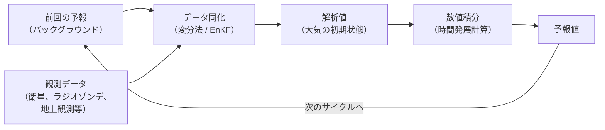
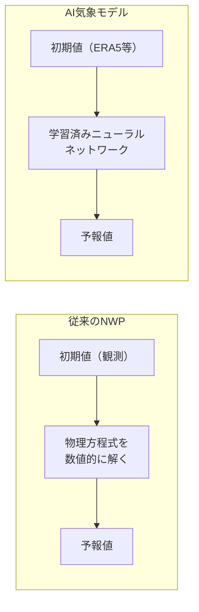
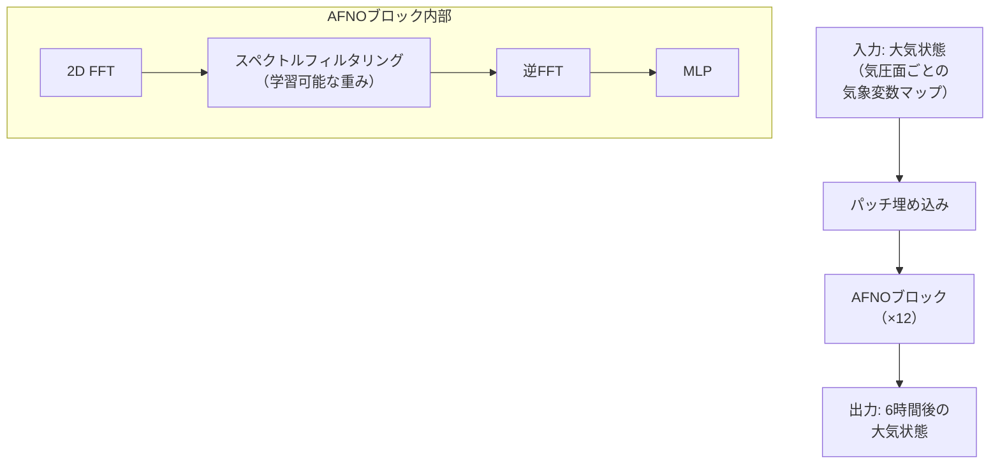
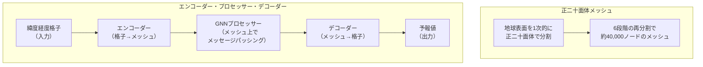
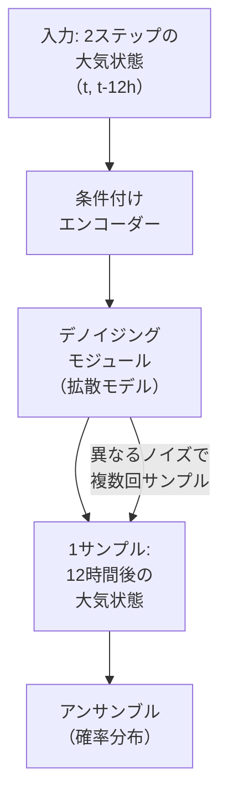
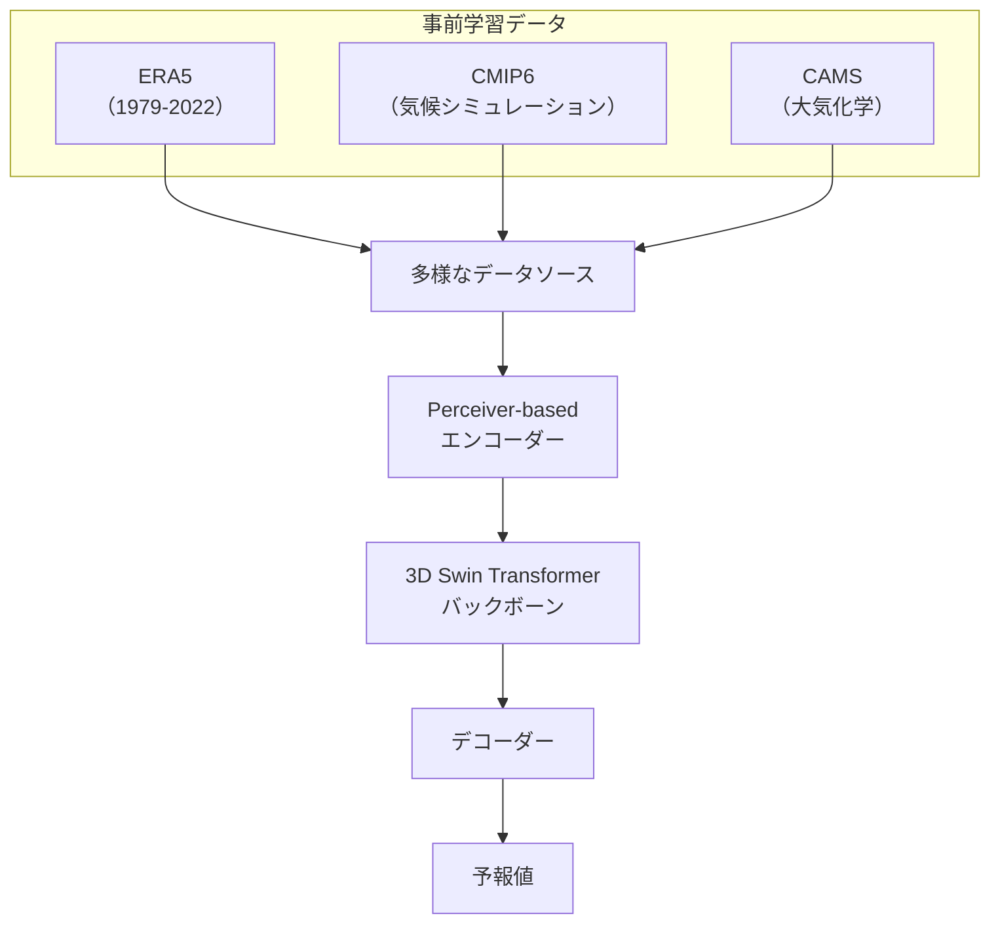
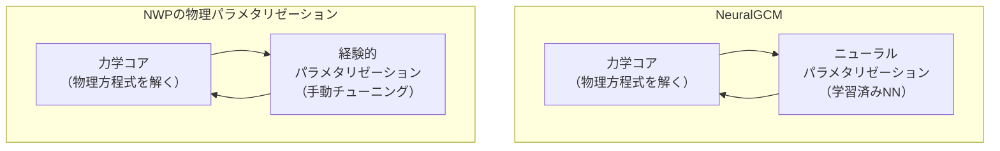
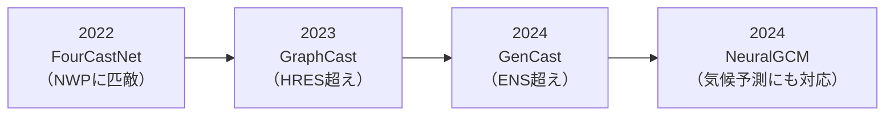
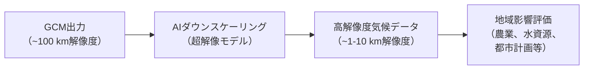
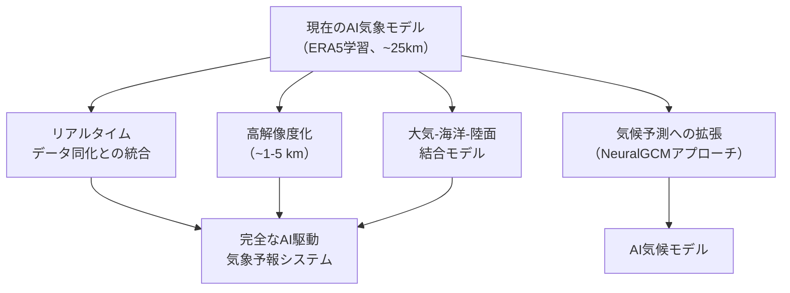

## はじめに

前章では、AIが創薬プロセスの各段階（標的構造予測、バーチャルスクリーニング、分子設計）を加速している状況を解説しました。本章では、AI for Scienceのもう1つの革命的な応用分野である**気象予測・気候科学**を取り上げます。

天気予報は、私たちの日常生活にもっとも身近な科学予測の1つです。その背後には、大気の物理方程式を数値的に解くという、70年以上にわたる**数値気象予測（Numerical Weather Prediction, NWP）** の歴史があります。しかし2022年以降、深層学習モデルが数値気象予測と同等以上の精度を達成する事例が相次ぎ、気象科学は根本的な転換点を迎えています。

第2章ではGenCastやAuroraの登場を歴史的文脈の中で紹介し、第3章ではそれらのアーキテクチャ構成要素（GNN、3D Swin Transformer、拡散モデル等）を技術進化の観点から概観しました。本章ではこれらを気象科学の文脈に位置づけ、NWPの基礎から各AI気象モデルのアーキテクチャ、評価手法、気候科学への応用まで体系的に解説します。

## 数値気象予測の基礎

### 原始方程式

数値気象予測は、大気の状態を記述する**原始方程式（Primitive Equations）** を数値的に解くことで将来の天気を予測します。第4章で紹介した偏微分方程式（PDE）の数値解法の代表的な応用です。

原始方程式は、以下の物理法則を連立した方程式系です。

| 方程式 | 物理法則 | 記述する現象 |
| ---- | ---- | ---- |
| **運動方程式** | ニュートンの第2法則 | 風速の変化 |
| **連続の式** | 質量保存則 | 空気密度の変化 |
| **熱力学の式** | エネルギー保存則 | 気温の変化 |
| **水蒸気の式** | 水の保存則 | 湿度・降水 |
| **状態方程式** | 理想気体の法則 | 気圧と密度の関係 |
| **静力学平衡** | 鉛直方向の力の釣り合い | 気圧の鉛直分布 |

運動方程式の水平成分は次のように記述されます。

$$\frac{D\mathbf{v}}{Dt} = -\frac{1}{\rho}\nabla p - f\mathbf{k} \times \mathbf{v} + \mathbf{F}$$

ここで $\mathbf{v}$ は風速ベクトル、$\rho$ は空気密度、$p$ は気圧、$f$ はコリオリパラメータ、$\mathbf{F}$ は摩擦力です。

:::message
NWPでは、この方程式系を地球全体にわたる3次元格子上で離散化し、時間発展を計算します。たとえば、ECMWFのIFS（Integrated Forecasting System）は水平解像度約9 km、鉛直137層、12時間ごとのデータ同化サイクル（4D-Var）で運用されており、1回の10日間予測に数千CPUコアで数時間を要します。
:::

### カオスと予測可能性の限界

気象予測が困難な根本的理由は、**大気がカオス系である**ことに起因します。1963年、気象学者のEdward Lorenzは、簡略化された大気対流モデルにおいて、初期値のわずかな差異が時間とともに指数関数的に増幅されることを発見しました[^lorenz]。これが「バタフライ効果」として知られる現象です。

[^lorenz]: Lorenz, E. N. (1963). Deterministic nonperiodic flow. *Journal of the Atmospheric Sciences*, 20(2), 130-141.

| 予測期間 | 初期値誤差の増幅 | 予測のスキル |
| ---- | ---- | ---- |
| 1〜3日 | 小さい | 高精度（決定的予測が有効） |
| 3〜7日 | 中程度 | アンサンブル予測が効果的 |
| 7〜15日 | 大きい | 確率的予測が必須 |
| >15日 | 初期値情報が消失 | 個別の天気予測は不可能 |

この限界から、中期予測（7〜15日）では**アンサンブル予測**が不可欠です。これは初期値をわずかに変えた複数の予報を走らせ、その統計的分布から確率的な予測を行う手法です。

### データ同化

NWPのもう1つの核心技術が**データ同化（Data Assimilation）** です。これは、モデルによる予測値と実際の観測値を統計的に融合して、現在の大気状態の最良推定値（**解析値**）を得るプロセスです。

| データ同化手法 | 原理 | 採用機関 |
| ---- | ---- | ---- |
| **4D-Var** | 時間ウィンドウ内の変分最小化 | ECMWF、気象庁 |
| **EnKF** | アンサンブルカルマンフィルター | NOAA、カナダ気象局 |
| **ハイブリッド** | 4D-VarとEnKFの組み合わせ | 多くの主要機関 |

### ERA5再解析データ

第3章で紹介したERA5は、ECMWFが提供する全球大気**再解析データ**です。1940年から現在まで、一貫した手法でデータ同化を行い、全球の大気状態を格子点データとして再構成しています。

| 項目 | 仕様 |
| ---- | ---- |
| **水平解像度** | 0.25° × 0.25°（約31 km） |
| **鉛直層数** | 137層（モデルレベル） |
| **時間解像度** | 1時間 |
| **期間** | 1940年〜現在 |
| **変数** | 気温、風速、湿度、地表面気圧ほか200以上 |
| **データ量** | 約5 PB（ペタバイト） |
| **提供元** | ECMWF / Copernicus Climate Data Store |

ERA5は、AI気象モデルのほぼすべてにおいて学習・検証データとして使用されており、AI気象予測の基盤データセットです。

:::details 再解析データとは
**再解析（Reanalysis）** とは、過去の気象観測データを最新のNWPモデルとデータ同化技術で再処理し、一貫した品質の格子点データを生成する手法です。リアルタイムの気象予測ではモデルやデータ同化手法が年々改良されるため、異なる時期のデータは直接比較しにくくなります。再解析は、一貫したシステムで過去全体を再計算することでこの問題を解決し、長期的な気候解析やAIモデルの学習に不可欠な均質なデータセットを提供します。
:::

## AI気象予測モデルの進化

### AI気象予測の基本パラダイム

AI気象モデルは、NWPの物理方程式を直接解く代わりに、ERA5などの再解析データから**大気状態の時間発展パターン**を学習するデータ駆動型アプローチです。

| 比較項目 | NWP | AI気象モデル |
| ---- | ---- | ---- |
| **原理** | 物理方程式の数値解法 | データからパターンを学習 |
| **計算コスト（推論時）** | 数千CPUコア × 数時間 | 1GPU × 数分 |
| **物理法則の保証** | 方程式に内在 | 学習データに暗黙的に含有 |
| **新規の極端現象への対応** | 物理法則に基づき外挿可能 | 学習データの範囲外に弱い |
| **学習データの必要性** | なし（物理法則のみで動作） | 数十年分の再解析データが必須 |
| **空間解像度** | ~9 km（IFS） | ~25 km（0.25°） |

### FourCastNet: 最初の衝撃

2022年、NVIDIAが発表した**FourCastNet**[^fcn]は、NWPに匹敵する精度を示した最初のAI気象モデルの1つです。

[^fcn]: Pathak, J. et al. (2022). FourCastNet: A Global Data-driven High-resolution Weather Forecasting Model. *arXiv:2202.11214*.

FourCastNetの核心は**AFNO（Adaptive Fourier Neural Operator）** というアーキテクチャです。これは第4章で紹介したニューラルオペレーターの流れを汲み、Vision Transformerのアテンション機構を**フーリエ空間で効率的に実現**したものです。

| 特徴 | 詳細 |
| ---- | ---- |
| **解像度** | 0.25° × 0.25°（720 × 1440格子） |
| **入力変数** | 20変数（気温、風速、湿度等）× 複数気圧面 |
| **時間ステップ** | 6時間 |
| **推論速度** | 1GPUで1週間予報を約2秒 |
| **計算量** | NWPの約10,000分の1 |

AFNOのアイデアは、グローバルな大気パターン（ロスビー波、ジェット気流など）が周波数空間で効率的に表現できるという物理的直観に基づいています。通常のTransformerのアテンションは入力長の2乗に比例するメモリを必要としますが、FFTベースのAFNOは線形のコストで全球的な相互作用を捉えることができます。

### Pangu-Weather: 3次元処理

ファーウェイが2023年に発表した**Pangu-Weather**[^pangu]は、**3D Earth-Specific Transformer**という独自のアーキテクチャを採用しました。

[^pangu]: Bi, K. et al. (2023). Accurate medium-range global weather forecasting with 3D neural networks. *Nature*, 619, 533-538. DOI: 10.1038/s41586-023-06185-3

| 革新点 | 従来のアプローチ | Pangu-Weather |
| ---- | ---- | ---- |
| **鉛直方向の処理** | 各気圧面を独立に処理 | 3Dアテンションで気圧面間の相互作用を直接捉える |
| **予測ステップ** | 固定(6時間) | 1h / 3h / 6h / 24hの4モデルを階層的に組み合わせ |
| **位置エンコーディング** | 標準的な正弦波 | 地球の幾何学（緯度・経度・高度）を反映 |

とくに注目すべきは、24時間ステップの専用モデルを用意した点です。6時間ステップを4回繰り返して24時間予報を生成する場合、誤差が累積（ロールアウト誤差）しますが、24時間モデルは1回の推論で直接24時間後を予測するため、誤差累積を抑制できます。

### GraphCast: グラフニューラルネットワーク

Google DeepMindが2023年にNature誌で発表した**GraphCast**[^graphcast]は、地球の大気をグラフ構造で表現するアプローチです。

[^graphcast]: Lam, R. et al. (2023). Learning skillful medium-range global weather forecasting. *Science*, 382(6677), 1416-1421. DOI: 10.1126/science.adi2336

GraphCastの重要な設計判断は、**正二十面体メッシュ（icosahedral mesh）** の採用です。通常の緯度経度格子では極域（北極・南極）付近で格子が過密になる問題があります。正二十面体メッシュはこの問題を回避し、ほぼ均一な解像度で地球表面をカバーします。

| 構成要素 | 詳細 |
| ---- | ---- |
| **エンコーダー** | 緯度経度格子の各点を最寄りのメッシュノードにマッピング |
| **プロセッサー** | 16層のGNN。マルチスケールエッジで局所・広域の相互作用を同時に処理 |
| **デコーダー** | メッシュノードの情報を緯度経度格子に戻す |
| **学習** | 自己回帰。入力: $t$, $t-6\text{h}$ → 出力: $\Delta(t+6\text{h})$ の残差予測 |

:::message
GraphCastは、ECMWFのHRES（高解像度予報）を**90.3%の検証指標**（1,380の変数×予測時間の組合せ）で上回り、AI気象モデルが従来型NWPをはじめて体系的に凌駕したモデルとして大きなインパクトを与えました。
:::

### GenCast: 確率的気象予測

第2章で紹介したGenCast[^gencast]は、GraphCastの決定的予測を**拡散モデルベースの確率的予測**に発展させたモデルです。

[^gencast]: Price, I. et al. (2024). GenCast: Diffusion-based ensemble forecasting for medium-range weather. *Nature*, 637, 1038-1044. DOI: 10.1038/s41586-024-08252-9

| 比較項目 | GraphCast | GenCast |
| ---- | ---- | ---- |
| **予測方式** | 決定的（1つの予報値） | 確率的（アンサンブル分布） |
| **時間ステップ** | 6時間 | 12時間 |
| **生成モデル** | なし（回帰） | 拡散モデル |
| **グラフ構造** | 正二十面体メッシュ | 正二十面体メッシュ |
| **台風進路予測** | ECMWF HRESと同等 | ECMWFアンサンブルを上回る |

GenCastの最大の革新は、気象予測に拡散モデルを導入し、**アンサンブル予測を自然に実現**した点です。従来のNWPアンサンブルは、初期値を摂動させた50本程度の決定的予報を走らせる必要がありましたが、GenCastは拡散モデルのノイズを変えるだけで任意の数のサンプルを生成でき、計算コストを大幅に削減します。

#### CRPS: 確率的予測の評価指標

確率的予測の品質は、**CRPS（Continuous Ranked Probability Score）** で評価されます。

$$\text{CRPS}(F, y) = \int_{-\infty}^{\infty} \left[ F(x) - \mathbf{1}(x \geq y) \right]^2 dx$$

ここで $F(x)$ は予測の累積分布関数、$y$ は実際の観測値です。CRPSは小さいほど良い予測を示し、決定的予測（単一値）のCRPSは平均絶対誤差に一致します。CRPSの利点は、**予測の正確さとシャープネス（分布の広さ）を同時に評価**できる点です。

:::details 気象予測の主要評価指標
| 指標 | 種類 | 意味 |
| ---- | ---- | ---- |
| **RMSE** | 決定的 | 二乗平均平方根誤差。値が小さいほど良い |
| **ACC** | 決定的 | 異常相関係数。気候値からの偏差の相関。0.6以上で有用な予測 |
| **CRPS** | 確率的 | 予測分布と観測の一致度。小さいほど良い |
| **Spread-Skill** | 確率的 | アンサンブルの広がりと実際の誤差の一致度 |
| **Brier Score** | 確率的 | 二値事象（降水の有無等）の確率予測精度 |
:::

### Aurora: 地球システム基盤モデル

第2章で紹介したAurora[^aurora]は、気象予測だけでなく大気汚染予測やダウンスケーリングなど、地球システム全般に転移学習可能な**基盤モデル**として設計されています。

[^aurora]: Bodnar, C. et al. (2024). Aurora: A Foundation Model of the Atmosphere. *arXiv:2405.13063*.

| 特徴 | 詳細 |
| ---- | ---- |
| **アーキテクチャ** | 3D Swin Transformer（Perceiverベースのエンコーダー/デコーダー） |
| **パラメータ数** | 13億 |
| **事前学習データ** | ERA5（100万時間以上）+ CMIP6 + CAMS |
| **解像度** | 0.25°（ファインチューニングで0.1°も可能） |
| **推論速度** | 1GPUで10日間予報を約1分 |

Auroraの設計思想は、大規模言語モデル（LLM）の成功に触発されたものです。多様な地球科学データで事前学習し、下流タスクごとにファインチューニングすることで、タスク専用モデルを個別に構築するよりも高い性能と効率を実現します。

| 下流タスク | ファインチューニング内容 | 結果 |
| ---- | ---- | ---- |
| **天気予報（0.25°）** | ERA5で6時間ステップ予測 | GraphCastと同等以上 |
| **高解像度予報（0.1°）** | HRES解析値で学習 | IFS HRESと同等 |
| **大気汚染予測** | CAMSデータで学習 | NO₂、PM2.5等の予測 |
| **ダウンスケーリング** | 低解像度→高解像度のマッピング | 局所的詳細の復元 |

### NeuralGCM: 物理とAIのハイブリッド

2024年、Google Researchが発表した**NeuralGCM**[^neuralgcm]は、NWPとAIの**ハイブリッドアプローチ**を提案し、気象と気候両方の予測に適用可能なモデルとして注目を集めました。

[^neuralgcm]: Kochkov, D. et al. (2024). Neural general circulation models for weather and climate. *Nature*, 632, 1060-1066. DOI: 10.1038/s41586-024-07744-y

| 比較項目 | 純粋なAIモデル | NWP | NeuralGCM |
| ---- | ---- | ---- | ---- |
| **力学（大規模運動）** | データから学習 | 物理方程式で解く | 物理方程式で解く |
| **パラメタリゼーション** | データから学習 | 経験的近似式 | ニューラルネットワーク |
| **物理的整合性** | 保証なし | 保証あり | 力学コア部分は保証 |
| **気候予測** | 困難（長期安定性） | 可能 | 可能（40年安定） |
| **学習データ外の対応** | 弱い | 強い | 中間（力学部分は外挿可能） |

:::message
NeuralGCMの最大の意義は、**気象予測と気候予測を1つのフレームワークで扱える**点です。純粋なAIモデル（GraphCast、GenCast等）は短〜中期の気象予測では優れていますが、数十年単位の気候シミュレーションでは数値的に不安定になる傾向があります。NeuralGCMは物理方程式の力学コアを保持することで長期安定性を確保しつつ、パラメタリゼーションにニューラルネットを使うことで精度を向上させています。
:::

:::details パラメタリゼーションとは
NWPの格子解像度（例: 9 km）で直接表現できない小さなスケールの物理現象（積雲対流、乱流、雲微物理、放射過程など）を、格子スケールの変数を使って近似的に表現する手法を**パラメタリゼーション（Parameterization）** と呼びます。たとえば、個々の積乱雲（数km〜数十km）は格子内に収まるため直接解像できませんが、その集合的効果（加熱、水蒸気の輸送等）をパラメタリゼーションで表現します。NWPの不確実性の大きな原因はこのパラメタリゼーションにあり、NeuralGCMはここをニューラルネットワークで置き換えることで改善を図っています。
:::

## AI気象モデルの比較

### 技術的比較

| モデル | 開発元 | 年 | アーキテクチャ | 予測方式 | 時間ステップ |
| ---- | ---- | ---- | ---- | ---- | ---- |
| **FourCastNet** | NVIDIA | 2022 | AFNO（フーリエ） | 決定的 | 6h |
| **Pangu-Weather** | ファーウェイ | 2023 | 3D Earth-Specific Transformer | 決定的 | 1h/3h/6h/24h |
| **GraphCast** | Google DeepMind | 2023 | GNN（正二十面体メッシュ） | 決定的 | 6h |
| **FengWu** | 上海人工知能実験室 | 2023 | ViT + リプレイバッファー | 決定的 | 6h |
| **GenCast** | Google DeepMind | 2024 | 拡散モデル + GNN | 確率的 | 12h |
| **Aurora** | Microsoft | 2024 | 3D Swin Transformer | 決定的 | 6h |
| **NeuralGCM** | Google Research | 2024 | 力学コア + NN | ハイブリッド | 可変 |

### 精度の推移

AI気象モデルの精度は、わずか2年で劇的に向上しました。

500 hPa高度場の10日間予報RMSE（北半球中緯度）で比較すると、以下のような精度向上が見られます。

| モデル | 500 hPa高度場 10日予報RMSE（m）| ECMWFとの比較 |
| ---- | ---- | ---- |
| IFS HRES（2023年） | ~120 | 基準 |
| FourCastNet | ~140 | やや劣る |
| Pangu-Weather | ~125 | 同等 |
| GraphCast | ~115 | 上回る |
| GenCast（アンサンブル平均） | ~110 | 大幅に上回る |

## 台風・極端気象への応用

### 台風進路予測

台風（ハリケーン・サイクロン）の進路予測は、AI気象モデルの重要な応用分野です。

| モデル | 台風進路予測の精度 | 備考 |
| ---- | ---- | ---- |
| **GraphCast** | ECMWF HRESと同等 | 24-120時間予報 |
| **Pangu-Weather** | ECMWF HRESを上回る | 72-120時間でとくに優位 |
| **GenCast** | ECMWFアンサンブルを上回る | 確率的な進路予測 |

GenCastの確率的予測は台風進路の不確実性を定量化でき、防災計画の立案において大きな利点があります。「台風が特定の地域を通過する確率は何%か」という形で情報を提供できます。

:::message alert
AI気象モデルの台風強度予測は、進路予測に比べてまだ課題が残ります。台風の急速強化（Rapid Intensification）のような極端な現象は学習データに十分含まれておらず、予測が困難です。現状では、進路はAIモデル、強度はNWPまたは専門モデルを組み合わせるアプローチが推奨されています。
:::

### 極端気象イベントの予測

気候変動に伴い、熱波、豪雨、干ばつなどの極端気象イベントの頻度と強度が増加しています。これらの予測はAI気象モデルの重要な課題です。

| 極端気象 | AI予測の現状 | 課題 |
| ---- | ---- | ---- |
| **熱波** | 5〜10日前に高精度検出 | 継続期間の予測に改善の余地 |
| **豪雨** | 降水量の空間分布は改善途上 | 局地的集中豪雨の解像が困難 |
| **暴風** | 総観規模の低気圧に伴う暴風は良好 | 竜巻等のメソスケール現象は範囲外 |

## 気候科学への展開

### 気候モデルとAI

気象予測（数日〜2週間）と気候予測（数十年〜数百年）では、予測の性質が根本的に異なります。

| 区分 | 気象予測 | 気候予測 |
| ---- | ---- | ---- |
| **予測対象** | 特定の日の天気 | 統計的な気候の傾向 |
| **時間スケール** | 数日〜2週間 | 数十年〜数百年 |
| **初期値依存性** | 高い | 低い（強制力に依存） |
| **主な強制力** | 初期の大気状態 | 温室効果ガス濃度、太陽活動 |
| **評価方法** | 予報と観測の直接比較 | 気候統計量の再現性 |

### CMIP6と気候シミュレーション

**CMIP6（Coupled Model Intercomparison Project Phase 6）** は、世界中の気候モデリンググループが共通のプロトコルで気候シミュレーションを実行し、結果を比較するプロジェクトです。IPCC（気候変動に関する政府間パネル）の報告書の科学的基盤を提供しています。

| シナリオ | CO₂濃度の想定 | 2100年の気温上昇（産業革命前比） |
| ---- | ---- | ---- |
| **SSP1-2.6** | ピーク後減少 | ~1.8°C |
| **SSP2-4.5** | 緩やかに増加 | ~2.7°C |
| **SSP3-7.0** | 急増 | ~3.6°C |
| **SSP5-8.5** | 急増（最悪） | ~4.4°C |

AIの気候科学への応用は、主に以下の領域で進んでいます。

### ダウンスケーリング

**ダウンスケーリング**は、粗い解像度の気候モデル出力（~100 km）から局所的な高解像度の気候情報（~1-10 km）を推定する手法です。

| 手法 | アプローチ | 利点 |
| ---- | ---- | ---- |
| **統計的ダウンスケーリング** | 観測と大規模場の統計的関係 | 計算コストが低い |
| **力学的ダウンスケーリング** | 領域気候モデル（RCM）で再計算 | 物理的整合性が高い |
| **AIダウンスケーリング** | CNN/拡散モデルによる超解像 | 高速かつ高品質 |

Auroraは事前学習済みモデルをダウンスケーリングタスクにファインチューニングすることで、このアプローチの有効性を実証しています。

### 気候変動の帰属解析

**帰属解析（Attribution Analysis）** は、「特定の極端気象イベントが気候変動によってどの程度影響を受けたか」を定量的に評価する科学です。AIは大量の気候シミュレーションデータから、人間活動の影響と自然変動を分離するパターン認識に活用されています。

## 日本における取り組み

### 気象庁の数値予報

日本の**気象庁**は、独自のNWPシステムを運用しています。

| モデル | 用途 | 水平解像度 | 予報期間 |
| ---- | ---- | ---- | ---- |
| **GSM** | 全球モデル | 約20 km | 11日 |
| **MSM** | メソモデル | 約5 km | 78時間 |
| **LFM** | 局地モデル | 約2 km | 10時間 |
| **1か月アンサンブル** | 延長予報 | 約40 km | 34日 |

気象庁も機械学習の研究を進めており、降水ナウキャスト（0〜6時間の超短時間予測）へのAI適用や、NWPの後処理（予報値の統計的補正）への機械学習手法の導入が進んでいます。

### 富岳と気象・気候研究

理化学研究所・計算科学研究センター（R-CCS）のスーパーコンピューター**富岳**は、高解像度の気候シミュレーションの実行基盤として重要な役割を果たしています。

| 項目 | 詳細 |
| ---- | ---- |
| **計測性能** | 442 PFLOPS（Rmax）/ 537 PFLOPS（Rpeak） |
| **気候研究での活用** | 全球雲解像モデル NICAM（3.5 km解像度） |
| **AI研究** | 大規模モデル学習基盤 |

全球雲解像モデル**NICAM（Nonhydrostatic Icosahedral Atmospheric Model）**[^nicam]は、従来のNWPではパラメタリゼーションに頼っていた積雲対流を直接解像できる解像度（3.5 km）で全球シミュレーションを実行します。富岳の計算能力はこうした高解像度シミュレーションを可能にしています。

[^nicam]: Satoh, M. et al. (2014). The Non-hydrostatic Icosahedral Atmospheric Model: description and development. *Progress in Earth and Planetary Science*, 1, 18.

## AI気象予測の課題と展望

### 現在の限界

| 課題 | 詳細 | 影響 |
| ---- | ---- | ---- |
| **降水予測の精度** | 降水は本質的に確率的で非線形。AI予測はスムージング傾向 | 豪雨警報等の実運用への適用が困難 |
| **ERA5の解像度制約** | 学習データが0.25°（~31 km）。局地的現象を解像できない | メソスケール以下の予測に限界 |
| **極端値の過小評価** | 学習データの分布の端にある現象は予測困難 | 記録的な極端気象の強度を過小評価 |
| **データ同化の未統合** | 多くのAIモデルはERA5解析値を初期値として使用 | リアルタイム運用にはNWPのデータ同化が依然必要 |
| **物理的整合性** | 質量保存、エネルギー保存等が保証されない | 長期積分での安定性に懸念 |

### 今後の方向性

1. **データ同化の統合**: AI気象モデルがNWPのデータ同化パイプラインに組み込まれ、観測データから直接予報を生成するシステムへの移行
2. **高解像度化**: 現在の0.25°（~25 km）から、降水予測に有用な0.05°（~5 km）以下への解像度向上
3. **結合モデル**: 大気だけでなく海洋、陸面、海氷など地球システム全体を統合したAIモデルの開発
4. **気候予測への拡張**: NeuralGCMのハイブリッドアプローチにより、数十年スケールの気候予測にAIを適用

:::message alert
2024年時点で、世界の主要気象機関（ECMWF、NOAA、気象庁等）は、AI気象モデルを**補助的なガイダンス**として運用に取り入れ始めていますが、公式予報の主力としてはまだNWPが使用されています。AI気象モデルがNWPを完全に置き換えるのではなく、**両者が補完的に活用される**パラダイムが現在のコンセンサスです。
:::

## まとめ

本章では、数値気象予測の基礎からAI気象モデルの最前線まで、気象予測・気候科学におけるAIの革命的な変化を解説しました。

| 変革の側面 | 従来のNWP | AI気象モデル |
| ---- | ---- | ---- |
| **計算パラダイム** | 物理方程式の数値解法 | データ駆動型パターン学習 |
| **計算コスト** | 数千CPUコア × 数時間 | 1GPU × 数分 |
| **アンサンブル予測** | 50本の決定的予報を並列実行 | 拡散モデルでサンプリング |
| **精度（中期予報）** | ECMWF IFS/ENS | GenCast/GraphCastが上回る |
| **転移学習** | タスクごとに専用モデル | Auroraで複数タスクに対応 |
| **気候予測** | GCM（数十年の実績） | NeuralGCM（物理とAIのハイブリッド） |

わずか2年で、FourCastNet（NWPに匹敵）→ GraphCast（NWPを超越）→ GenCast（確率的予測でENSを超越）→ NeuralGCM（気候予測まで対応）と、驚異的な速度で進歩が続いています。

次章では、これまで解説してきたAI for Scienceの概念を実際にコードで体験する**ハンズオン**を行い、Pythonで分子シミュレーションや物性予測を実践します。

:::message
**この章のポイント**
- 数値気象予測（NWP）は原始方程式の数値解法であり、70年以上の歴史を持つ
- 大気はカオス系であり、中期以降の予報にはアンサンブル（確率的）予測が不可欠
- ERA5再解析データ（5 PB、1940年〜現在）がAI気象モデルの基盤データセット
- FourCastNet（AFNO）、Pangu-Weather（3D Transformer）、GraphCast（GNN）がNWPに匹敵・超越
- GenCastは拡散モデルでアンサンブル予測を実現し、ECMWFのENSを上回った
- Auroraは地球システムの基盤モデルとして、天気予報から大気汚染予測まで転移学習で対応
- NeuralGCMは物理とAIのハイブリッドで、気象予測と気候予測の両方に対応可能
- 降水予測の精度やデータ同化の統合など、実運用に向けた課題が残る
- 主要気象機関はAIモデルを補助的ガイダンスとして導入を開始している
:::
