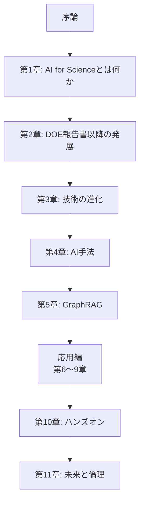
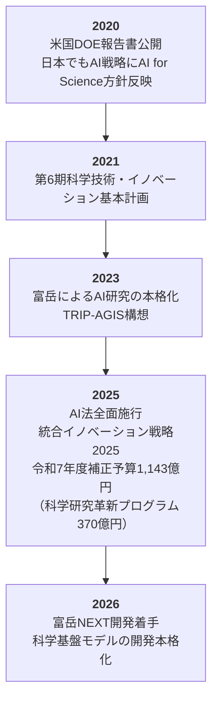

## 本書の背景

2025年（令和7年）、日本政府は「科学の再興」を掲げ、AI技術を科学研究に本格的に組み込む政策を加速させています。文部科学省は **「AI for Science」による科学研究の革新** を重点施策として位置づけ、令和7年度補正予算で1,143億円（関連経費を含めると1,527億円）を計上しました。令和8年度当初予算案でも193億円を確保しています[^1]。なかでも、**AI for Scienceによる科学研究革新プログラム**（令和7年度補正予算370億円）は、令和10年度までの基金事業として創設されました。プロジェクト型（320億円）とチャレンジ型（50億円）の2本柱で、科学基盤モデル・AIエージェント開発や次世代AI駆動ラボシステム開発を推進します。

この施策は、以下の**4つの柱**で構成されています。

| 柱 | 内容 | 主な事業（令和7年度補正予算額） |
| ---- | ---- | ---- |
| **AI駆動型研究開発の強化** | 科学基盤モデル・AIエージェント開発、マテリアルデータ基盤の充実 | 科学研究革新プログラム（370億円）、TRIP-AGIS（28億円）、マテリアルDX、ライフ分野研究拠点 |
| **研究データ創出・活用の高効率化** | 先端研究設備の整備・共用・高度化、大規模集積研究拠点の形成 | EPOCH（530億円）、大規模集積研究システム（42億円） |
| **次世代情報基盤の構築** | 富岳NEXT・HPCI、SINET、研究データエコシステム | 計算基盤の環境整備（76億円）、富岳NEXT開発・整備 |
| **戦略的な産学・国際連携** | 米国アルゴンヌ国立研究所との連携、国際プレゼンスの向上 | TRIP-AGISにおける国際共同研究 |

科学研究革新プログラムのプロジェクト型では、ライフサイエンス・マテリアルなどの重点領域において、実験データの取得・活用によるAI基盤モデル・AIエージェント開発と次世代AI駆動ラボシステム開発を一体的に推進します。チャレンジ型では、あらゆる分野の研究者がAIを活用して科学研究の高度化・加速化を図るための計算資源確保や研究環境整備を支援します。

また、理化学研究所を中心とした**TRIP-AGIS**（Transformative Research Innovation Platform - Artificial General Intelligence for Science）は、米国DOEのAI for Scienceの中核機関であるアルゴンヌ国立研究所と連携しながら、**科学基盤モデル**を開発・共用するプログラムです。さらに、2025年9月に全面施行された**AI法**（人工知能関連技術の研究開発および活用の推進に関する法律）により、大学・研究機関におけるAI活用が国の責務として法的に位置づけられました。

## 本書の目的

本書は、こうした政策動向を踏まえ、**AI for Scienceの基本概念と最新動向を体系的に理解する**ための入門書として執筆しました。

とくに以下のような方々を対象としています。

- 文部科学省の**AI for Scienceによる科学研究革新プログラム**（プロジェクト型・チャレンジ型）やTRIP-AGIS、マテリアルDX等への応募を検討している**大学・研究機関の研究者**
- AI for Scienceの潮流を理解し、自らの研究にAI技術を取り入れたいと考えている**理工系・生命科学系の研究者**
- 競争的資金の申請書において「AI for Science」の文脈を適切に記述したい**研究代表者・研究分担者**
- AI for Scienceに関する政策動向を把握したい**大学の研究推進部門（URA）や事務担当者**
- 科学研究へのAI活用に関心を持つ**大学院生・ポスドク研究員**

## 本書の構成

本書は全11章と付録で構成されています。

| 章 | タイトル | 内容 |
| ---- | ---- | ---- |
| 序論 | 本書の目的と対象読者 | 背景、対象読者、構成 |
| 第1章 | AI for Scienceとは何か | 定義、DOE報告書、3つの柱、対象分野 |
| 第2章 | DOE報告書以降の発展 | AlphaFold2、ノーベル化学賞、科学基盤モデル |
| 第3章 | AI for Scienceを支える技術の進化 | ハードウェア、アルゴリズム、データ基盤 |
| 第4章 | 科学研究のためのAI手法 | 機械学習、深層学習、物理情報ネットワーク |
| 第5章 | Microsoft GraphRAGとLazy GraphRAG | GraphRAGの仕組み、Lazy GraphRAG、科学研究への応用 |
| 第6章 | 分子シミュレーションとAI | 分子動力学、力場の機械学習 |
| 第7章 | 材料探索・マテリアルズインフォマティクス | GNoME、結晶構造予測、物性予測 |
| 第8章 | 創薬とAI | AlphaFold、バーチャルスクリーニング |
| 第9章 | 気象予測・気候科学とAI | GenCast、気象基盤モデル |
| 第10章 | ハンズオン | Pythonで試すAI for Science |
| 第11章 | AI for Scienceの未来と倫理 | 責任あるAI、再現性、課題 |
| 付録 | 参考文献・リソース集 | 主要論文、データセット、ツール |

:::message
各章は独立して読むこともできますが、第1〜4章で基礎を固めたうえで、関心のある応用分野（第5〜9章）に進むことを推奨します。
:::

## 表記について

本書では、AI for Scienceに関する技術用語について、以下の方針で表記しています。

- **英語の専門用語**: はじめて登場する際に日本語訳と英語表記を併記し、以降は文脈に応じて使い分けます
- **数式**: KaTeX記法で記述しています
- **コード**: Python 3.xを前提としています（第10章ハンズオン）
- **参考文献**: 脚注と巻末付録の両方で示しています

## 日本におけるAI for Scienceの位置づけ

日本のAI for Science政策は、米国DOEの取り組みに呼応する形で進展してきました。

「統合イノベーション戦略2025」（令和7年6月閣議決定）では、以下が明記されています。

> ライフサイエンス・マテリアル等の分野を含む研究データを活用した科学研究向けAI基盤モデルの開発・共用等のAI for Scienceを加速させ、科学研究の革新につなげていく。

また「経済財政運営と改革の基本方針2025」（令和7年6月閣議決定）[^2]でも、次のように位置づけられています。

> 研究データの活用を支える情報基盤の強化やAI for Scienceを通じ、科学研究を革新する。

このように、AI for Scienceは日本の科学技術政策の中核に位置づけられており、今後ますます多くの研究者がこの分野に参画することが期待されています。本書が、その第一歩を踏み出すための一助となれば幸いです。

[^1]: 文部科学省「AI for Scienceに関する令和7年度補正予算および令和8年度当初予算案について」AI for Science推進委員会（第1回）資料、令和8年2月9日（https://www.mext.go.jp/content/20260209-mxt_jyohoka01-000047243_3.pdf）
[^2]: 内閣府「経済財政運営と改革の基本方針2025」令和7年6月3日閣議決定（https://www5.cao.go.jp/keizai-shimon/kaigi/cabinet/honebuto/2025/decision0603.html）
