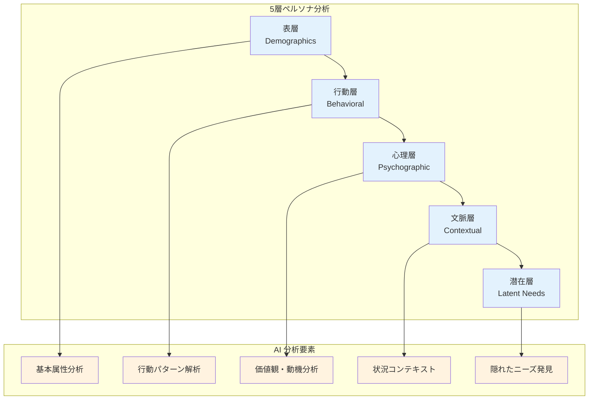

## 3.1 ペルソナ分析の重要性

**「なぜ、あれほど準備したプレゼンが響かなかったのだろう？」**—このような経験はありませんか？実は、効果的なプレゼンテーションの成功は90%が**聴衆理解**にかかっています。しかし、多くの人が聴衆分析で失敗する理由があります。

:::message
**従来のペルソナ分析の課題**
- 時間をかけても表面的な分析に留まる
- 個人の主観や偏見が入りやすい
- 複数のペルソナを同時分析するのが困難
- データに基づかない推測中心のアプローチ
:::

**インターネットに公開されているプレゼン資料や動画を分析した結果**、PrezenX の AI ペルソナ分析はこれらの課題を根本的に解決することが判明しました。従来の手法では見えなかった聴衆の深層心理まで、わずか5分で解き明かします。

## 3.2 AI ペルソナ分析の仕組み

### 3.2.1 多層分析アプローチ

想像してください。**相手の心の中が透けて見える**ような分析力を持てたら？PrezenX は、聴衆を5つの層で解剖し、まるで X 線写真のように包括的なペルソナを構築します。



### 3.2.2 表層分析（Demographics）

**基本属性の自動推定**

ペルソナ分析の最初の層は、聴衆の基本的な属性を把握することです。PrezenX は、提供された情報から聴衆の役職、経験レベル、所属組織の特性を自動的に推定します。

**分析される要素：**

**役職と責任範囲**  
聴衆の職位（管理職、専門職、新人など）、部門、意思決定権の有無を判定します。これにより、プレゼンテーションで使用すべき言葉のレベルや、訴求すべきポイントが明確になります。

**組織の特性**  
業界、企業規模（スタートアップ、中小企業、大企業）、組織文化（伝統的、革新的、進歩的）を分析します。これらの要素は、聴衆が受け入れやすいコミュニケーションスタイルに大きく影響します。

**専門性と経験**  
各分野での専門知識レベル、技術への親和性、プレゼンテーション経験の豊富さを1-10のスケールで評価します。この情報により、内容の深さや説明の詳細度を調整できます。

**推定プロセス**  
AI は、プレゼンテーションのトピックから業界キーワードを抽出し、目的から役職を推定し、設定から組織文脈を検出して、包括的な基本プロファイルを構築します。

### 3.2.3 行動層分析（Behavioral）

**コミュニケーション行動パターンの解析**

表層分析の次は、聴衆がどのように情報を受け取り、処理し、反応するかという行動パターンの分析です。同じ内容でも、聴衆の行動特性に合わせて伝え方を変えることで、理解度と満足度が大幅に向上します。

**コミュニケーションスタイルの特定**

**情報受容の好み**  
聴衆が視覚的、聴覚的、体感的、読解的のいずれの方法で情報を最も効率的に処理するかを判定します。視覚優位の人には図表を多用し、聴覚優位の人には言葉による説明を重視します。

**情報処理パターン**  
段階的に情報を積み上げる人、全体像から詳細に入る人、論理的分析を好む人、直感的理解を重視する人など、思考の進め方の違いを把握します。

**参加スタイル**  
静かに聞くことを好む受動的なタイプ、適度に質問する中程度の参加型、活発に議論したい高参加型など、関わり方の違いを分析します。

**注意力パターンの予測**

**集中持続時間**  
役職や業界経験から、どの程度の時間集中できるかを予測します。経営陣は短時間で核心を求める傾向があり、技術者はより長時間の詳細説明を好む傾向があります。

**エンゲージメントのピーク**  
プレゼンテーションの開始時、中盤、終盤のいずれで最も集中するかを予測し、重要な情報をそのタイミングに配置します。

**注意散漫の要因**  
関連性の低い詳細、進行の遅さ、明確な成果の欠如など、聴衆が興味を失いやすい要因を特定し、これらを避けるよう設計します。

### 3.2.4 心理層分析（Psychographic）

**価値観と動機の深層分析**

最も重要でありながら見えにくいのが、聴衆の心理層です。表面的な属性や行動の背後にある価値観、動機、懸念を理解することで、真に響くメッセージを構築できます。

**核心価値観の特定**

**主要価値観**  
聴衆が最も重視する価値（効率性、革新性、安定性、収益性など）を特定します。これらは業界や役職によって大きく異なり、メッセージの方向性を決定する重要な要素です。

**副次的価値観**  
主要価値観を補完する二次的な価値観も把握します。これらは細かな表現や例示の選択に影響します。

**価値観の対立**  
時として聴衆内で相反する価値観が存在します（コスト削減 vs 品質向上など）。これらの対立を認識し、バランスの取れた提案を行います。

**動機構造の解明**

**内発的動機**  
自己実現、専門性の向上、創造性の発揮など、内から湧き出る動機を把握します。これらに訴えかけることで、深い共感と行動変容を促せます。

**外発的動機**  
昇進、報酬、評価、競争優位など、外部からの刺激による動機も重要です。具体的なメリットを示すことで、即座の関心を引くことができます。

**懸念と不安**  
リスク回避、変化への抵抗、失敗への恐れなど、聴衆が抱く懸念を理解します。これらに適切に対処することで、提案への信頼を高めます。

**認知バイアスの考慮**  
確証バイアス、利用可能性ヒューリスティック、アンカリング効果、現状維持バイアスなど、人間が持つ認知の偏りを考慮し、これらに配慮したプレゼンテーション構成を行います。

### 3.2.5 文脈層分析（Contextual）

**状況とタイミングの最適化**

同じ聴衆でも、置かれた状況や環境によって受け取り方は大きく変わります。文脈層分析では、プレゼンテーションが行われる具体的な状況を総合的に分析し、最適なアプローチを決定します。

**会議の性質と目的**

**会議タイプの特定**  
キックオフ、レビュー、意思決定、研修、営業提案など、会議の性質によって聴衆の期待と態度が異なります。意思決定会議では結論の明確さが重視され、研修では理解のしやすさが優先されます。

**緊急度レベル**  
1-10のスケールで緊急度を評価し、プレゼンテーションのペースと詳細度を調整します。緊急度が高い場合は要点を絞り、低い場合は包括的な説明が可能です。

**ステークホルダー関係**  
参加者間の権力関係、利害関係、過去の協力・対立関係を分析します。これらの関係性を理解することで、政治的に配慮した内容構成が可能になります。

**タイミング要因**

**時間的条件**  
曜日、時間帯、季節、事業サイクルの段階など、タイミングが聴衆の集中力や関心に与える影響を考慮します。月曜朝は概要重視、金曜午後は簡潔さ重視といった調整を行います。

**事業環境**  
繁忙期、閑散期、決算期など、聴衆の置かれた事業環境に応じて、提案のタイミングや内容の重点を調整します。

**物理的・技術的環境**

**会場設定**  
役員会議室、大会議場、バーチャル会議、非公式な場所など、環境の格式や親密さに応じて、プレゼンテーションのトーンを調整します。

**参加者規模**  
少人数での密な議論から大規模な講演まで、規模に応じてインタラクションの頻度や内容を最適化します。

**技術的制約**  
利用可能な技術レベルや機器に応じて、視覚的要素やインタラクティブ要素の活用度を調整します。

### 3.2.6 潜在層分析（Latent Needs）

**隠されたニーズの発見**

ペルソナ分析の最も高度な層が、聴衆自身も明確に認識していない潜在的なニーズの発見です。表層では表現されない真の課題や願望を理解することで、競合他社では提供できない価値を創造できます。

**未表明の懸念の察知**

**キャリアへの影響**  
提案や決定が個人のキャリアに与える潜在的影響への不安を読み取ります。昇進への道筋、専門性の評価、将来の選択肢への影響など、声には出さない個人的な懸念を理解します。

**リスク認識**  
表面的には前向きでも、内心では失敗への恐れ、責任の重さ、不確実性への不安を抱いている場合があります。これらの潜在的な抵抗要因を事前に察知し、適切に対処します。

**リソース制約**  
予算、人員、時間、技術的制約について、公式には認めにくい制約を推定します。現実的で実行可能な提案を行うために重要な情報です。

**深層の願望と野心**

**個人的目標**  
職業的成功、スキル向上、認知欲求など、個人レベルでの達成したい目標を読み取ります。提案がこれらの目標に貢献することを示すことで、強い動機付けが可能になります。

**組織的ビジョン**  
組織の理想的な未来像、達成したい地位、実現したい価値について、公式な戦略を超えた深層の願望を理解します。

**業界での地位**  
業界内での競争優位、革新的地位、リーダーシップなど、組織が業界内で実現したい立ち位置への願望を把握します。

**知識ギャップの特定**

**知識不足領域**  
聴衆が認識していない知識不足や、学習が必要な分野を特定します。教育的価値を提供することで、プレゼンテーションの価値を高めます。

**誤解と思い込み**  
業界常識、技術理解、市場認識などで持っている誤解や偏見を察知します。これらを適切に修正することで、より正確な判断を支援します。

**前提の誤り**  
意思決定の基盤となっている前提や仮定の中で、実際には間違っているものを特定します。これらの修正は、提案の説得力を大幅に向上させます。

**潜在ニーズの統合分析**  
複数のペルソナから共通パターンを発見し、業界トレンドとのギャップ分析、認知バイアスからの推論を組み合わせて、包括的な潜在ニーズプロファイルを構築します。この分析により、聴衆が真に求めている価値を提供できるプレゼンテーションが可能になります。

## 3.3 ペルソナ生成プロセス

### 3.3.1 基礎データ収集

**情報の体系的収集プロセス**

ペルソナ分析の精度は、最初に収集する基礎データの質によって決まります。PrezenX は、ユーザーから必要最小限の情報を収集し、そこから包括的な聴衆理解を構築します。

**収集する4つの核心データ領域：**

**1. プレゼンテーション基本情報**  
トピック（主題）とプレゼンテーションの目的を明確化します。「新システム導入提案」「四半期業績報告」「研修実施」など、プレゼンテーションの性質によって聴衆の期待や関心が大きく変わるため、この情報が分析の出発点となります。

**2. 聴衆基本属性**  
参加者の役職、所属部門、会社情報、会議の文脈を収集します。同じ内容でも、経営陣向けと現場担当者向けでは全く異なるアプローチが必要になります。また、社内会議か外部向けプレゼンテーションかによっても戦略が変わります。

**3. 制約条件の整理**  
時間制限、フォーマット要件、聴衆の技術レベルなど、プレゼンテーションを取り巻く制約を把握します。15分のピッチと90分の研修では、同じ内容でも全く異なる構成が必要になります。

**4. 補足情報の活用**  
任意で提供される追加情報（過去の反応、特別な配慮事項、期待される成果など）も重要な分析材料として活用します。この情報により、より精密で実用的なペルソナを生成できます。

### 3.3.2 AI 分析エンジン

**高度な並列分析システム**

PrezenX の AI 分析エンジンは、収集した基礎データを5つの専門分析器で同時並行処理し、わずか数分で深層的なペルソナを生成します。

**5つの専門分析エンジンの連携：**

**1. 表層分析エンジン（Demographics Analyzer）**  
基本属性データから聴衆の職業的背景、組織特性、経験レベルを推定します。業界データベースと照合し、類似組織での一般的な特性パターンを特定。役職から推定される意思決定権限や関心領域も分析します。

**2. 行動分析エンジン（Behavioral Analyzer）**  
コミュニケーションスタイル、情報処理パターン、注意力特性を予測します。職種や業界の一般的な行動パターンを基に、聴衆がどのように情報を受け取り、処理し、反応するかを分析します。

**3. 心理分析エンジン（Psychographic Analyzer）**  
価値観、動機、懸念事項を深層分析します。業界文化、組織規模、市場環境から推定される心理的傾向を分析し、聴衆の内面的な動機構造を理解します。

**4. 文脈分析エンジン（Contextual Analyzer）**  
プレゼンテーション実施環境、タイミング、目的から状況的要因を分析します。同じ聴衆でも、置かれた状況によって受け取り方が変わるため、文脈に応じた最適化を行います。

**5. 潜在ニーズ分析エンジン（Latent Needs Analyzer）**  
表面的には現れない隠れたニーズや懸念を発見します。他の4つの分析結果を統合し、業界トレンド、組織課題、個人的キャリア目標などから潜在的な関心事を推論します。

**統合処理プロセス：**

各分析エンジンは並列で動作し、分析結果を統合してベースペルソナを生成します。その後、潜在ニーズ分析の結果を組み込んで最終的なペルソナプロファイルを完成させます。この過程で、分析結果の一貫性チェックと相互検証も自動的に実行されます。

### 3.3.3 ペルソナ検証と最適化

**品質保証と継続改善システム**

生成されたペルソナは、実用性と信頼性を確保するために4つの観点から自動検証され、必要に応じて最適化が行われます。

**4つの検証指標による品質管理：**

**1. 多様性スコア（Diversity Assessment）**  
生成されたペルソナ群が聴衆の多様性を適切に反映しているかを評価します。年齢、経験、価値観、行動パターンなどの分布を分析し、偏りがないか確認。単一的なペルソナではなく、実際の聴衆の幅広さを捉えているかを数値化して評価します。

**2. 代表性評価（Representativeness Check）**  
各ペルソナが実際の聴衆セグメントを適切に代表しているかを検証します。業界標準データや統計情報と照合し、現実的で説得力のあるペルソナかどうかを判定。極端すぎる特性や非現実的な組み合わせがないかをチェックします。

**3. 内的一貫性監査（Internal Coherence Validation）**  
ペルソナ内の各要素が論理的に整合しているかを確認します。例えば、「技術に詳しい」とされる人物が「デジタルツールを避ける」という矛盾した特性を持っていないか。価値観、行動、動機の間に論理的な関連性があるかを検証します。

**4. 実用性判定（Actionability Evaluation）**  
生成されたペルソナが実際のプレゼンテーション作成に役立つ具体的な指針を提供できるかを評価します。抽象的すぎる特性ではなく、明確なコミュニケーション戦略や内容調整に直結する実用的な情報が含まれているかを確認します。

**自動最適化プロセス：**

検証で課題が発見された場合、システムは自動的に最適化提案を生成します。多様性不足の場合は追加ペルソナの生成、一貫性の問題がある場合は特性の調整、実用性が低い場合はより具体的な行動指針の追加などを行います。

この検証・最適化プロセスにより、理論的に正しいだけでなく、実際のプレゼンテーション作成に直接活用できる高品質なペルソナが保証されます。

## 3.4 生成されるペルソナの例

これまで説明してきた5層分析アプローチと検証・最適化プロセスを経て、PrezenX が実際に生成するペルソナの具体例をご紹介します。以下の例は、**製造業でのシステム導入提案**という実際のプレゼンテーション場面を想定したものです。

同じプレゼンテーションでも、聴衆の立場や関心によって受け取り方は全く異なります。PrezenX は、こうした違いを細かく分析し、**それぞれの視点に最適化されたアプローチ**を可能にするペルソナを生成します。

### 3.4.1 ペルソナ1: IT 部門マネージャー

```yaml
name: "田中 IT 部長"
demographics:
  role: "IT 部門管理職"
  experience: 15年
  organization: "製造業・大企業"
behavioral:
  communication_style: "データ重視・論理的"
  attention_span: 20分
  interaction_preference: "質疑応答重視"
psychographic:
  core_values: ["効率性", "セキュリティ", "コスト最適化"]
  motivations: ["部門成果向上", "業務効率化", "技術革新"]
  fears: ["セキュリティリスク", "予算超過", "導入失敗"]
contextual:
  situation: "新システム導入検討会議"
  urgency: 8/10
  decision_authority: true
latent_needs:
  unspoken_concerns: ["経営陣への説明責任", "現場の抵抗"]
  aspirations: ["DX 推進リーダーとしての評価", "業界最先端の技術導入"]
  information_gaps: ["最新技術動向", "同業他社の成功事例"]
```

### 3.4.2 ペルソナ2: 現場担当者

```yaml
name: "佐藤 現場リーダー"
demographics:
  role: "現場主任"
  experience: 8年
  organization: "製造業・大企業"
behavioral:
  communication_style: "実例重視・体験的"
  attention_span: 30分
  interaction_preference: "対話型・質問歓迎"
psychographic:
  core_values: ["実用性", "安定性", "チームワーク"]
  motivations: ["作業効率向上", "チーム成果", "スキルアップ"]
  fears: ["業務複雑化", "学習負担", "雇用不安"]
contextual:
  situation: "新システム説明会"
  urgency: 5/10
  decision_authority: false
latent_needs:
  unspoken_concerns: ["変化への適応", "追加作業負担"]
  aspirations: ["専門スキル向上", "安定した職場環境"]
  information_gaps: ["システム操作方法", "トラブル対応"]
```

## 3.5 ペルソナベースのコンテンツ最適化

### 3.5.1 動的コンテンツ調整

**ペルソナに基づく自動コンテンツ最適化システム**

生成されたペルソナ情報を活用して、PrezenX は基本となるプレゼンテーション内容を各聴衆に最適化します。このプロセスでは、**一つのベースコンテンツから複数の聴衆向けバリエーションを自動生成**し、最終的にすべての聴衆に響く統合版を作成します。

**5つの調整軸による包括的最適化：**

**1. 語彙レベルの調整（Vocabulary Adaptation）**  
聴衆の経験年数や専門性に応じて、使用する言葉のレベルを調整します。新人向けには専門用語を平易な表現に置き換え、ベテラン向けには業界特有の正確な用語を使用。同じ概念でも「DX（デジタルトランスフォーメーション）」「デジタル化」「IT 活用」など、聴衆の理解度に合わせた表現を選択します。

**2. 事例選択の最適化（Example Selection）**  
各ペルソナの価値観に響く具体例を選択します。効率性を重視する管理職には ROI 向上事例を、安定性を重視する現場担当者には運用安定化事例を提示。業界や職種に関連性の高い成功事例を優先的に採用し、聴衆が「自分事」として受け取れる内容を構成します。

**3. 強調ポイントの調整（Emphasis Optimization）**  
各ペルソナの動機に合わせて、重点的に訴求するポイントを調整します。昇進を目指す中間管理職には「リーダーシップ発揮の機会」を、技術革新に関心の高い技術者には「最新技術への貢献」を強調。同じ提案内容でも、聴衆ごとに最も魅力的な側面を前面に出します。

**4. 懸念事項への対処（Concern Addressing）**  
各ペルソナが抱く不安や懸念に対して、事前に解決策や軽減策を提示します。コスト増を心配する経営陣には詳細な費用対効果分析を、変化を恐れる現場担当者には段階的導入計画と充実したサポート体制を説明。聴衆の心理的障壁を取り除く内容を組み込みます。

**5. インタラクション設計（Interaction Design）**  
各ペルソナの参加スタイルに合わせて、質問やディスカッションの機会を設計します。積極的な参加を好む聴衆には多くの対話機会を、静かに聞くことを好む聴衆には適度な確認ポイントを設置。プレゼンテーション全体の流れを聴衆の特性に合わせて調整します。

**統合プロセスによる最終調整：**

各ペルソナ向けの個別最適化を行った後、これらを統合して一つのプレゼンテーションに仕上げます。相反する要求がある場合は優先順位をつけ、すべての聴衆が満足できるバランスの取れた内容を自動生成。結果として、多様な背景を持つ聴衆全員に響く、高度に最適化されたプレゼンテーションが完成します。

### 3.5.2 実装効果の測定

| 指標 | 従来手法 | AI ペルソナ分析 | 改善率 |
|------|----------|----------------|--------|
| **分析時間** | 4-8時間 | 5分 | **95%短縮** |
| **ペルソナ数** | 1-2個 | 5-10個 | **400%増加** |
| **分析深度** | 表面的 | 5層深層分析 | **定性的大幅向上** |
| **客観性** | 主観的 | データドリブン | **バイアス除去** |
| **一貫性** | 人により変動 | AI により一定 | **品質安定化** |

---

次章では、ペルソナ分析を基にした**ストーリーテリング自動化**について詳しく解説します。8つの手法を使い分けて、聴衆の心に響く物語を自動生成する技術を学びましょう。

:::message alert
**重要なポイント**
AI ペルソナ分析は単なる属性分類ではありません。聴衆の深層心理まで理解し、真に響くプレゼンテーションを作り出すための科学的アプローチです。
:::