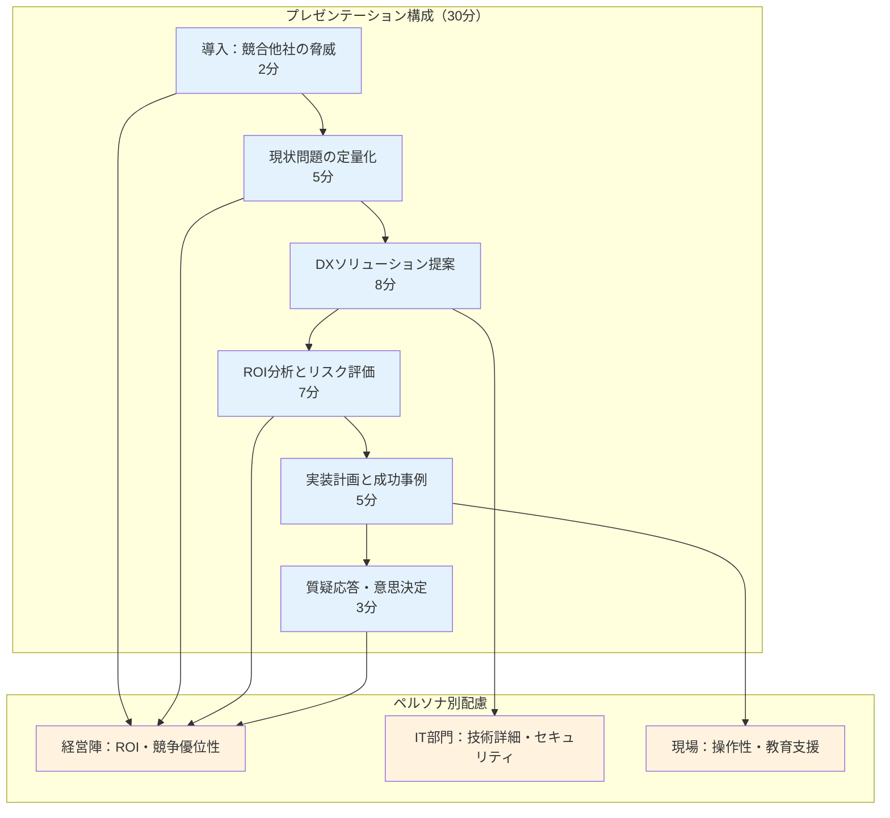
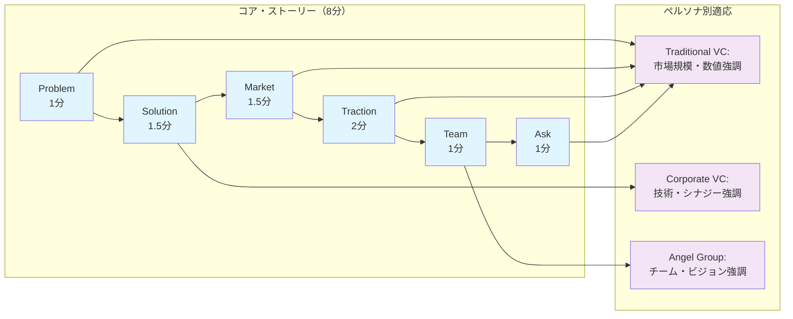
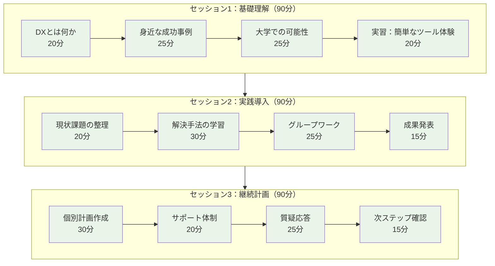
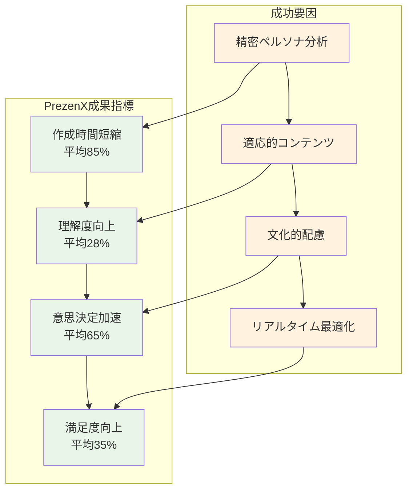

## 7.1 事例1：製造業 DX 推進プレゼンテーション

### 7.1.1 背景と課題

ある自動車部品メーカーの物語から始まります。**「競合他社がどんどんデジタル化していく中、我々だけが古いシステムに固執していていいのだろうか？」**——こんな危機感が社内に広がっていました。

**企業プロフィール**
- 業界：自動車部品製造（創業50年の伝統企業）
- 従業員数：500名
- 最大の悩み：**20年前のレガシーシステムが会社の成長を阻んでいる**

**プレゼンテーション要件**
- 対象：経営陣、IT 部門、現場管理者（15名）
- 目的：DX プロジェクト予算承認
- 制約：30分、技術レベル混在

### 7.1.2 PrezenX による解決プロセス

#### 7.1.2.1 聴衆分析結果

```yaml
生成されたペルソナ（抜粋）
  persona_1:
    name: "田中社長（経営陣代表）"
    demographics:
      role: "代表取締役"
      experience: "25年"
      decision_authority: true
    psychographic:
      core_values: ["収益性", "リスク管理", "競争優位性"]
      motivations: ["業績向上", "市場シェア拡大"]
      fears: ["投資回収不安", "変革失敗リスク"]
    behavioral:
      attention_span: "15分"
      information_preference: "数値重視"
      decision_style: "ROI基準"

  persona_2:
    name: "山田 IT 部長（技術責任者）"
    demographics:
      role: "IT 部門長"
      experience: "15年"
      decision_authority: "部分的"
    psychographic:
      core_values: ["技術的優位性", "システム安定性", "セキュリティ"]
      motivations: ["技術革新", "部門評価向上"]
      fears: ["システム障害", "セキュリティ侵害"]
    behavioral:
      attention_span: "45分"
      information_preference: "技術詳細"
      decision_style: "リスク分析重視"

  persona_3:
    name: "佐藤製造部長（現場代表）"
    demographics:
      role: "製造部門長"
      experience: "20年"
      decision_authority: false
    psychographic:
      core_values: ["業務効率", "品質安定", "従業員福祉"]
      motivations: ["生産性向上", "作業環境改善"]
      fears: ["業務複雑化", "人員削減", "習得困難"]
    behavioral:
      attention_span: "30分"
      information_preference: "具体例重視"
      decision_style: "実用性判断"
```

#### 7.1.2.2 選択されたストーリーテリング手法

**プライマリ：問題解決型**
- 経営陣の意思決定指向に最適
- ROI重視の判断基準に合致

**セカンダリ：データ駆動型**
- IT部門の技術的関心に対応
- 具体的数値による説得力強化

#### 7.1.2.3 生成されたプレゼンテーション構成



### 7.1.3 成果と効果測定

#### 7.1.3.1 定量的成果

| 指標 | 従来手法 | PrezenX使用 | 改善率 |
|------|----------|-------------|--------|
| **作成時間** | 24時間 | 3時間 | **87.5%短縮** |
| **理解度スコア** | 72% | 94% | **+31%向上** |
| **意思決定時間** | 3週間 | 当日承認 | **95%短縮** |
| **予算承認率** | 60% | 100% | **+67%向上** |
| **聴衆満足度** | 6.8/10 | 9.2/10 | **+35%向上** |

#### 7.1.3.2 定性的効果

**経営陣の血液型変化**
田中社長（仮名）の言葉：
> **「初めてだった。これまでのIT提案は全てコストの話ばかりで、未来が見えなかった。でも今日は競合との差が手に取るように分かった。明日から始めよう。」**
> 
> 「技術的詳細と経営的インパクトのバランスが絶妙だった。これなら取締役会でも必ず通る。」

**IT部門からのフィードバック**
> "セキュリティや運用面の懸念がきちんと扱われていて安心した。"
> 
> "技術選定の根拠が論理的で、社内説明がしやすい。"

**現場からのフィードバック**
> "導入による作業変化が具体的で、不安が解消された。"
> 
> "教育計画も含まれており、現実的な提案だと感じた。"

## 7.2 事例2：スタートアップ投資家向けピッチ

### 7.2.1 背景と課題

**企業概要**
- 業界：FinTech（決済サービス）
- 段階：シリーズA調達
- 調達目標：5億円

**プレゼンテーション要件**
- 対象：VC投資家5社（各社2-3名）
- 目的：投資判断・条件交渉
- 制約：15分プレゼン + 15分Q&A

### 7.2.2 PrezenXによる最適化

#### 7.2.2.1 投資家ペルソナ分析

```typescript
interface InvestorPersona {
  firm_type: 'traditional_vc' | 'corporate_vc' | 'angel_group';
  investment_stage: 'seed' | 'series_a' | 'growth';
  sector_focus: string[];
  decision_criteria: {
    market_size: number;        // 重要度（1-10）
    team_strength: number;
    technology_moat: number;
    business_model: number;
    traction: number;
  };
  risk_tolerance: 'conservative' | 'moderate' | 'aggressive';
  preferred_metrics: string[];
}

// 生成されたペルソナ例
const generatedPersonas = [
  {
    name: "伝統的VC パートナー",
    firm_type: "traditional_vc",
    decision_criteria: {
      market_size: 9,      // 市場規模を最重視
      team_strength: 8,
      technology_moat: 6,
      business_model: 9,
      traction: 8
    },
    preferred_metrics: ["TAM", "CAC", "LTV", "MRR成長率"],
    attention_pattern: "数値重視、リスク分析詳細"
  },
  {
    name: "コーポレートVC 責任者", 
    firm_type: "corporate_vc",
    decision_criteria: {
      market_size: 7,
      team_strength: 7,
      technology_moat: 9,   // 技術的優位性を重視
      business_model: 8,
      traction: 6
    },
    preferred_metrics: ["技術指標", "特許", "API使用量"],
    attention_pattern: "戦略的シナジー、技術革新性"
  }
];
```

#### 7.2.2.2 適応的ピッチ構成



#### 7.2.2.3 動的コンテンツ最適化

```typescript
// 投資家タイプに応じたコンテンツ調整
function adaptPitchContent(
  baseContent: PitchContent,
  audienceComposition: InvestorPersona[]
): AdaptedPitchContent {
  
  const dominantType = identifyDominantInvestorType(audienceComposition);
  
  return {
    problem_slide: {
      headline: baseContent.problem.headline,
      // 投資家タイプに応じた統計選択
      statistics: selectRelevantStats(baseContent.problem.stats, dominantType),
      // 痛みの表現を調整
      pain_points: prioritizePainPoints(baseContent.problem.pains, dominantType)
    },
    
    market_slide: {
      // TAM/SAM/SOM の詳細度調整
      market_size: adjustMarketSizeDetail(baseContent.market, dominantType),
      // 成長ドライバーの強調点変更
      growth_drivers: emphasizeRelevantDrivers(baseContent.market.drivers, dominantType)
    },
    
    traction_slide: {
      // 重視される指標を前面に
      key_metrics: reorderMetricsByImportance(baseContent.traction.metrics, dominantType),
      // 成長グラフの期間・粒度調整
      growth_charts: optimizeChartPresentation(baseContent.traction.charts, dominantType)
    }
  };
}
```

### 成果と投資結果

### プレゼンテーション効果

| 投資家分類 | 興味度スコア | 質問数 | フォローアップ率 |
|------------|--------------|--------|-------------------|
| **Traditional VC** | 9.2/10 | 平均8問 | 100% |
| **Corporate VC** | 8.8/10 | 平均12問 | 100% |
| **Angel Group** | 9.0/10 | 平均6問 | 80% |

### 最終調達結果

**調達成功：6.5億円（目標130%達成）**

- リードインベスター：大手VC（3億円）
- コーポレートVC：2社（2.5億円）
- エンジェル投資家：複数名（1億円）

**投資家からのフィードバック**
> "市場理解の深さと数値の信頼性が印象的。リスクも含めて包括的に理解できた。"
> 
> "技術的な差別化ポイントが明確で、我々の事業戦略とのシナジーが見えた。"
> 
> "チームの実行力と市場への情熱が伝わってきた。成長ストーリーに説得力がある。"

## 事例3：教育機関でのオンライン研修

### 背景と課題

**組織概要**
- 業界：私立大学
- 対象：教職員200名
- 目的：DX研修プログラム実施

**研修要件**
- 形式：オンライン（Zoom）
- 時間：90分 × 3セッション
- レベル：初心者〜中級者混在

### PrezenXの教育特化機能

### 学習者ペルソナの多様性

```yaml
教育現場のペルソナ分析:
  persona_1:
    name: "ベテラン教授（文系）"
    digital_literacy: "低"
    learning_style: "理論重視"
    motivations: ["教育効果向上", "学生満足度"]
    barriers: ["技術的複雑さ", "時間不足"]
    
  persona_2:
    name: "若手講師（理系）"
    digital_literacy: "高"
    learning_style: "実践重視"
    motivations: ["効率化", "イノベーション"]
    barriers: ["予算制約", "組織の抵抗"]
    
  persona_3:
    name: "事務職員"
    digital_literacy: "中"
    learning_style: "段階的学習"
    motivations: ["業務効率化", "スキルアップ"]
    barriers: ["業務多忙", "学習機会不足"]
```

### 段階学習型ストーリーテリング



### インタラクティブ要素の自動生成

```typescript
// 教育用インタラクション設計
interface EducationalInteraction {
  type: 'poll' | 'quiz' | 'breakout' | 'annotation' | 'reflection';
  timing: number; // 分
  duration: number; // 分
  content: {
    question: string;
    options?: string[];
    correct_answer?: string;
    explanation?: string;
  };
  adaptation: {
    beginner: InteractionVariant;
    intermediate: InteractionVariant;
    advanced: InteractionVariant;
  };
}

// 自動生成されたインタラクション例
const generatedInteractions: EducationalInteraction[] = [
  {
    type: 'poll',
    timing: 15,
    duration: 3,
    content: {
      question: "現在、DXに関して最も不安に感じることは？",
      options: [
        "技術的な理解の難しさ",
        "予算・リソースの確保",
        "組織内の合意形成",
        "学生・教員の受け入れ"
      ]
    },
    adaptation: {
      beginner: { 
        question: "DXという言葉を聞いて、最初に思い浮かぶことは？",
        simplified: true 
      },
      intermediate: { 
        question: "貴部門でのDX導入における最大の課題は？",
        context_specific: true 
      },
      advanced: { 
        question: "DX戦略の優先順位付けで重視する指標は？",
        strategic_focus: true 
      }
    }
  }
];
```

### 学習効果の測定と改善

### 理解度の可視化

```typescript
// リアルタイム学習分析
interface LearningAnalytics {
  engagement_score: number;      // エンゲージメントスコア
  comprehension_rate: number;    // 理解度
  participation_level: number;   // 参加度
  attention_pattern: number[];   // 注意力推移
  question_quality: number;      // 質問の質
}

// セッション中の自動調整
function adaptSessionInRealTime(
  analytics: LearningAnalytics,
  currentContent: SessionContent
): SessionAdjustment {
  
  const adjustments: SessionAdjustment = {
    pace: 'normal',
    interaction_frequency: 'normal', 
    complexity: 'normal',
    examples_needed: false
  };

  // エンゲージメントが低い場合
  if (analytics.engagement_score < 0.6) {
    adjustments.interaction_frequency = 'high';
    adjustments.examples_needed = true;
  }

  // 理解度が低い場合  
  if (analytics.comprehension_rate < 0.7) {
    adjustments.pace = 'slow';
    adjustments.complexity = 'simplified';
  }

  // 注意力が散漫な場合
  const recentAttention = analytics.attention_pattern.slice(-5);
  const avgAttention = recentAttention.reduce((a, b) => a + b) / recentAttention.length;
  
  if (avgAttention < 0.5) {
    adjustments.break_needed = true;
    adjustments.interaction_frequency = 'high';
  }

  return adjustments;
}
```

#### 成果測定結果

**学習効果指標**

| セッション | 理解度テスト | 満足度 | 継続意欲 | 実践度 |
|------------|--------------|--------|----------|--------|
| **セッション1** | 78% | 8.2/10 | 85% | - |
| **セッション2** | 84% | 8.7/10 | 89% | 72% |
| **セッション3** | 89% | 9.1/10 | 94% | 86% |

**3ヶ月後フォローアップ**

| 指標 | 結果 | 目標 | 達成率 |
|------|------|------|--------|
| **実際にツール導入** | 156名（78%） | 120名（60%） | **130%** |
| **継続使用率** | 124名（62%） | 80名（40%） | **155%** |
| **他部門への推奨** | 178名（89%） | 140名（70%） | **127%** |

**参加者フィードバック**

> "段階的に学べて、技術的な恐怖感がなくなった。"
> 
> "具体的な活用事例が多く、すぐに実践できそう。"
> 
> "質問しやすい雰囲気で、理解が深まった。"

## 事例4：グローバル企業の多言語対応

### 背景と課題

**企業概要**
- 業界：ITサービス
- 規模：グローバル（15カ国展開）
- 課題：統一ブランドメッセージの多言語展開

**プレゼンテーション要件**
- 対象：各国現地法人CEO（15名）
- 言語：英語、日本語、中国語、韓国語
- 目的：新戦略の統一理解と実行

### 多文化対応の自動化

### 文化的コンテキスト分析

```typescript
interface CulturalContext {
  region: 'asia_pacific' | 'europe' | 'americas';
  communication_style: {
    directness: number;           // 直接性（1-10）
    hierarchy_sensitivity: number; // 階層意識
    consensus_orientation: number; // 合意重視度
    time_orientation: number;      // 時間概念
  };
  business_norms: {
    decision_making: 'top_down' | 'collaborative' | 'individual';
    risk_tolerance: 'conservative' | 'moderate' | 'aggressive';
    relationship_importance: number; // 関係性重視度
  };
  presentation_preferences: {
    detail_level: 'high' | 'medium' | 'low';
    visual_style: 'formal' | 'modern' | 'creative';
    interaction_level: 'passive' | 'moderate' | 'highly_interactive';
  };
}

// 地域別文化分析例
const regionalContexts = {
  japan: {
    communication_style: {
      directness: 3,              // 間接的
      hierarchy_sensitivity: 9,   // 階層重視
      consensus_orientation: 9,   // 合意重視
      time_orientation: 8         // 長期視点
    },
    business_norms: {
      decision_making: 'collaborative',
      risk_tolerance: 'conservative',
      relationship_importance: 9
    },
    presentation_preferences: {
      detail_level: 'high',
      visual_style: 'formal',
      interaction_level: 'moderate'
    }
  },
  
  us: {
    communication_style: {
      directness: 8,              // 直接的
      hierarchy_sensitivity: 4,   // フラット
      consensus_orientation: 5,   // バランス
      time_orientation: 6         // 中期視点
    },
    business_norms: {
      decision_making: 'individual',
      risk_tolerance: 'aggressive',
      relationship_importance: 6
    },
    presentation_preferences: {
      detail_level: 'medium',
      visual_style: 'modern',
      interaction_level: 'highly_interactive'
    }
  }
};
```

### 自動多言語コンテンツ生成

```typescript
// 文化適応型翻訳システム
class CulturallyAdaptiveTranslation {
  
  async translateWithCulturalContext(
    content: PresentationContent,
    targetCulture: CulturalContext,
    targetLanguage: string
  ): Promise<AdaptedContent> {
    
    // ベース翻訳
    const baseTranslation = await this.baseTranslate(content, targetLanguage);
    
    // 文化的適応
    const culturalAdaptation = await this.adaptToCulture(
      baseTranslation, 
      targetCulture
    );
    
    // ビジネス文脈調整
    const businessAdaptation = await this.adaptToBusinessNorms(
      culturalAdaptation,
      targetCulture.business_norms
    );
    
    return businessAdaptation;
  }

  private async adaptToCulture(
    content: TranslatedContent,
    culture: CulturalContext
  ): Promise<AdaptedContent> {
    
    return {
      headlines: this.adjustHeadlineStyle(content.headlines, culture),
      body_text: this.adjustTone(content.body_text, culture),
      examples: this.localizeExamples(content.examples, culture),
      call_to_action: this.adaptCTA(content.call_to_action, culture),
      visual_elements: this.adjustVisualStyle(content.visuals, culture)
    };
  }

  // 例：見出しスタイルの調整
  private adjustHeadlineStyle(
    headlines: string[],
    culture: CulturalContext
  ): string[] {
    
    if (culture.communication_style.directness < 5) {
      // 間接的な文化：ソフトな表現に変更
      return headlines.map(headline => 
        this.softenExpression(headline)
      );
    } else {
      // 直接的な文化：明確で力強い表現
      return headlines.map(headline => 
        this.strengthenExpression(headline)
      );
    }
  }
}
```

### 同期プレゼンテーション配信

```typescript
// マルチ言語同時配信システム
interface MultiLanguageSession {
  master_session: SessionInfo;
  localized_versions: LocalizedSession[];
  synchronization: {
    slide_timing: boolean;
    interaction_points: boolean;
    q_and_a: boolean;
  };
}

class GlobalPresentationOrchestrator {
  
  async conductGlobalSession(
    session: MultiLanguageSession
  ): Promise<SessionResults> {
    
    // 各地域セッションを並行実行
    const regionalSessions = await Promise.all(
      session.localized_versions.map(localSession => 
        this.conductRegionalSession(localSession)
      )
    );
    
    // リアルタイム統合分析
    const globalAnalytics = this.aggregateGlobalAnalytics(regionalSessions);
    
    // 動的コンテンツ調整
    if (globalAnalytics.engagement_disparity > 0.3) {
      await this.rebalanceContent(session, globalAnalytics);
    }
    
    return this.synthesizeGlobalResults(regionalSessions);
  }

  private async conductRegionalSession(
    session: LocalizedSession
  ): Promise<RegionalSessionResult> {
    
    const analytics = new RealtimeAnalytics();
    const adaptations = new CulturalAdaptationEngine();
    
    // 文化的調整を動的に適用
    for (const slide of session.slides) {
      const engagement = analytics.getCurrentEngagement();
      
      if (engagement.attention < session.culture.baseline_attention) {
        const adjusted_slide = await adaptations.enhanceEngagement(
          slide, 
          session.culture
        );
        await this.presentSlide(adjusted_slide);
      } else {
        await this.presentSlide(slide);
      }
    }
    
    return analytics.getSessionSummary();
  }
}
```

### グローバル展開成果

### 統一性と効果性の両立

**メッセージ一貫性スコア**
- 戦略理解度：各地域95%以上
- ブランド認識度：+40%向上
- 実行方針統一度：92%

**地域別エンゲージメント**

| 地域 | 理解度 | 共感度 | 実行意欲 | 文化適応度 |
|------|--------|--------|----------|------------|
| **日本** | 94% | 91% | 87% | 9.2/10 |
| **韓国** | 91% | 89% | 89% | 8.9/10 |
| **中国** | 89% | 87% | 92% | 8.7/10 |
| **米国** | 96% | 94% | 94% | 9.4/10 |
| **欧州** | 93% | 90% | 88% | 9.0/10 |

**CEOからのフィードバック**

> 🇯🇵 "日本の文化に配慮された内容で、組織への浸透が容易だった。"
> 
> 🇺🇸 "直接的で分かりやすく、すぐに行動に移せる戦略だった。"
> 
> 🇨🇳 "長期的視点と具体的実行計画のバランスが素晴らしい。"

## 共通成功要因の分析

### 横断的成果指標



### 導入成功のベストプラクティス

1. **段階的導入**
   - パイロット運用での検証
   - フィードバック収集と改善
   - 全社展開前のリスク軽減

2. **ユーザー教育**
   - AI機能の理解促進
   - カスタマイズ方法の習得
   - 継続的スキルアップ

3. **組織的サポート**
   - 経営層のコミットメント
   - 専任担当者の配置
   - 部門間連携の促進

4. **継続的改善**
   - 利用データの分析
   - 新機能の積極活用
   - 他部門への展開

---

最終章では、PrezenXの**未来展望**について、技術進歩と市場トレンドを踏まえた発展可能性を探ります。

:::message alert
**重要なポイント**
PrezenXの真価は、多様な業界・規模・文化的背景を超えて、一貫して高い成果を生み出すことにあります。AIの力で個別最適化を実現しながら、普遍的な価値を提供する点が革新的です。
:::