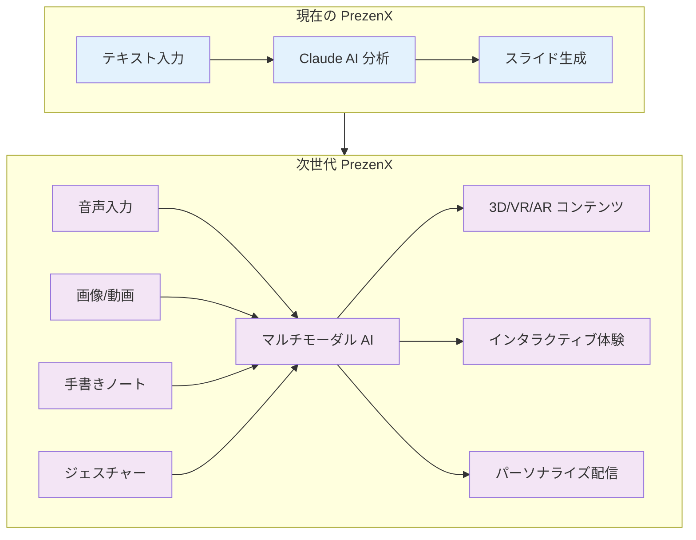
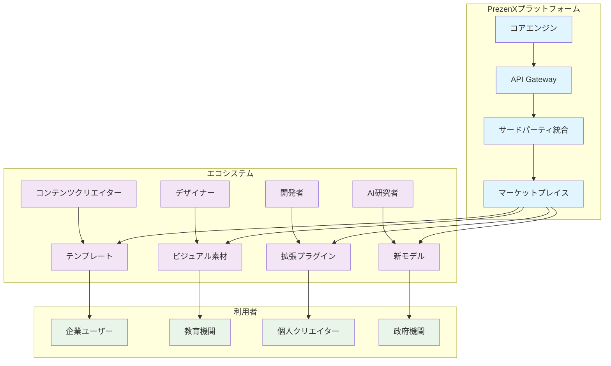

## 8.1 技術トレンドと PrezenX の進化

### 8.1.1 次世代 AI 技術の統合

#### 8.1.1.1 マルチモーダル AI の活用



**実装予定技術**

```typescript
// 次世代入力システム
interface MultimodalInput {
  voice: {
    naturalLanguage: string;
    emotion: EmotionProfile;
    intention: IntentionAnalysis;
  };
  visual: {
    sketches: SketchData[];
    images: ImageContent[];
    gestures: GestureSequence[];
  };
  textual: {
    notes: string;
    keywords: string[];
    structure: DocumentStructure;
  };
  contextual: {
    environment: EnvironmentData;
    audience_realtime: AudienceState;
    device_capabilities: DeviceProfile;
  };
}

// 統合分析エンジン
class NextGenAnalysisEngine {
  async processMultimodalInput(
    input: MultimodalInput
  ): Promise<EnhancedPresentationPlan> {
    
    // 各モダリティの並列分析
    const [voiceInsights, visualInsights, textualInsights, contextInsights] = 
      await Promise.all([
        this.analyzeVoiceInput(input.voice),
        this.analyzeVisualInput(input.visual),
        this.analyzeTextualInput(input.textual),
        this.analyzeContextualInput(input.contextual)
      ]);

    // クロスモーダル融合
    const fusedInsights = this.fuseModalityInsights([
      voiceInsights, 
      visualInsights, 
      textualInsights, 
      contextInsights
    ]);

    // 強化されたプレゼンテーション計画生成
    return this.generateEnhancedPlan(fusedInsights);
  }

  private async analyzeVoiceInput(voice: VoiceInput): Promise<VoiceInsights> {
    return {
      content_intentions: await this.extractIntentions(voice.naturalLanguage),
      emotional_context: this.analyzeEmotionalUndertone(voice.emotion),
      presentation_style: this.inferPresentationStyle(voice.naturalLanguage),
      audience_consideration: this.extractAudienceClues(voice.naturalLanguage)
    };
  }

  private async analyzeVisualInput(visual: VisualInput): Promise<VisualInsights> {
    return {
      concept_sketches: await this.interpretSketches(visual.sketches),
      visual_preferences: this.analyzeImageChoices(visual.images),
      interaction_patterns: this.analyzeGestures(visual.gestures),
      spatial_thinking: this.extractSpatialConcepts(visual.sketches)
    };
  }
}
```

#### 8.1.1.2 脳波・生体信号との統合

```typescript
// バイオメトリクス統合システム
interface BiometricFeedback {
  brainwaves: {
    attention_level: number;
    cognitive_load: number;
    emotional_valence: number;
    arousal_level: number;
  };
  physiological: {
    heart_rate: number;
    skin_conductance: number;
    eye_tracking: GazePattern[];
    facial_expression: EmotionVector;
  };
  behavioral: {
    typing_rhythm: TypingPattern;
    mouse_movement: MouseBehavior;
    posture_changes: PostureData[];
  };
}

class BiometricPresentationOptimizer {
  
  async optimizeInRealTime(
    presentation: LivePresentation,
    biometrics: BiometricFeedback[]
  ): Promise<OptimizationCommands> {
    
    // 聴衆の集中度分析
    const attentionAnalysis = this.analyzeCollectiveAttention(biometrics);
    
    // 認知負荷評価
    const cognitiveLoadAnalysis = this.assessCognitiveLoad(biometrics);
    
    // 感情的エンゲージメント測定
    const emotionalEngagement = this.measureEmotionalEngagement(biometrics);
    
    return {
      pace_adjustment: this.recommendPaceAdjustment(attentionAnalysis),
      content_simplification: this.recommendSimplification(cognitiveLoadAnalysis),
      interaction_triggers: this.recommendInteractions(emotionalEngagement),
      break_suggestions: this.suggestBreaks(attentionAnalysis, cognitiveLoadAnalysis)
    };
  }

  // プライバシー保護機能
  private ensurePrivacyCompliance(biometrics: BiometricFeedback[]): BiometricFeedback[] {
    return biometrics.map(data => ({
      ...data,
      // 個人識別情報の匿名化
      anonymized: true,
      // 集約データのみ使用
      aggregated_metrics_only: this.aggregateMetrics(data),
      // 同意確認
      consent_verified: this.verifyConsent(data.user_id)
    }));
  }
}
```

### 8.1.2 拡張現実（AR/VR）との融合

#### 8.1.2.1 イマーシブプレゼンテーション環境

```typescript
// 3D/VR/AR プレゼンテーション
interface ImmersivePresentation {
  environment: {
    type: '3d_space' | 'vr_world' | 'ar_overlay';
    setting: 'conference_room' | 'auditorium' | 'virtual_space' | 'outdoor';
    atmosphere: AtmosphereSettings;
  };
  content: {
    spatial_elements: SpatialContent[];
    interactive_objects: InteractiveObject[];
    holographic_displays: HologramData[];
    ambient_effects: AmbientEffect[];
  };
  interaction: {
    gesture_controls: GestureCommand[];
    voice_commands: VoiceCommand[];
    eye_tracking: EyeInteraction[];
    haptic_feedback: HapticResponse[];
  };
}

class ImmersivePrezenX {
  
  async createImmersiveExperience(
    traditional_presentation: PresentationData,
    audience_profile: AudienceProfile,
    device_capabilities: DeviceCapabilities
  ): Promise<ImmersivePresentation> {
    
    // 空間設計の最適化
    const optimal_environment = await this.designOptimalEnvironment(
      audience_profile,
      device_capabilities
    );
    
    // コンテンツの3D変換
    const spatial_content = await this.convertTo3D(
      traditional_presentation,
      optimal_environment
    );
    
    // インタラクション設計
    const interaction_design = await this.designInteractions(
      spatial_content,
      audience_profile
    );
    
    return {
      environment: optimal_environment,
      content: spatial_content,
      interaction: interaction_design
    };
  }

  // リアルタイム空間最適化
  async optimizeSpatialExperience(
    session: ImmersiveSession,
    real_time_feedback: SpatialFeedback[]
  ): Promise<SpatialAdjustments> {
    
    const comfort_analysis = this.analyzeSpatialComfort(real_time_feedback);
    const engagement_analysis = this.analyzeSpatialEngagement(real_time_feedback);
    
    return {
      environment_adjustments: this.adjustEnvironment(comfort_analysis),
      content_repositioning: this.repositionContent(engagement_analysis),
      interaction_modifications: this.modifyInteractions(comfort_analysis)
    };
  }
}
```

## 8.2 市場トレンドと拡張可能性

### 8.2.1 業界特化版の展開

#### 8.2.1.1 医療分野：MedPrezenX

```typescript
// 医療特化型PrezenX
interface MedicalPresentationFeatures {
  content_validation: {
    medical_accuracy: EvidenceValidation;
    clinical_guidelines: GuidelineCompliance;
    peer_review: PeerReviewProcess;
  };
  specialized_visuals: {
    anatomical_models: AnatomicalVisualization[];
    clinical_data: ClinicalDataVisualization[];
    treatment_pathways: TreatmentFlowChart[];
  };
  audience_adaptation: {
    medical_professionals: MedicalPersona[];
    patients_families: PatientPersona[];
    regulatory_bodies: RegulatoryPersona[];
  };
  compliance: {
    hipaa_compliance: boolean;
    gdpr_compliance: boolean;
    fda_guidelines: boolean;
  };
}

class MedPrezenX extends PrezenX {
  
  async generateMedicalPresentation(
    clinical_data: ClinicalData,
    target_audience: MedicalAudience,
    presentation_context: MedicalContext
  ): Promise<MedicalPresentation> {
    
    // 医療エビデンスの検証
    const validated_content = await this.validateMedicalEvidence(clinical_data);
    
    // 専門用語の聴衆適応
    const adapted_terminology = await this.adaptMedicalTerminology(
      validated_content,
      target_audience
    );
    
    // 倫理的配慮の適用
    const ethically_compliant = await this.applyEthicalGuidelines(
      adapted_terminology,
      presentation_context
    );
    
    return this.generatePresentation(ethically_compliant);
  }
}
```

#### 8.2.1.2 教育分野：EduPrezenX

```typescript
// 教育特化型PrezenX
interface EducationalPresentationFeatures {
  pedagogical_framework: {
    learning_theories: LearningTheory[];
    cognitive_development: CognitiveDevelopmentStage;
    multiple_intelligences: IntelligenceProfile[];
  };
  adaptive_content: {
    difficulty_scaling: DifficultyAdaptation;
    learning_pace: PaceAdaptation;
    style_preferences: LearningStyleAdaptation;
  };
  assessment_integration: {
    formative_assessment: FormativeAssessment[];
    summative_assessment: SummativeAssessment[];
    competency_tracking: CompetencyProgress;
  };
  gamification: {
    achievement_systems: AchievementFramework;
    progression_mechanics: ProgressionSystem;
    social_learning: SocialLearningFeatures;
  };
}

class EduPrezenX extends PrezenX {
  
  async createLearningExperience(
    educational_objectives: LearningObjectives,
    learner_profiles: LearnerProfile[],
    curriculum_context: CurriculumContext
  ): Promise<EducationalPresentation> {
    
    // 学習理論の適用
    const theory_aligned_content = await this.alignWithLearningTheories(
      educational_objectives,
      learner_profiles
    );
    
    // 個別適応学習パスの生成
    const adaptive_paths = await this.generateAdaptiveLearningPaths(
      theory_aligned_content,
      learner_profiles
    );
    
    // ゲーミフィケーション要素の統合
    const gamified_experience = await this.integrateGamification(
      adaptive_paths,
      learner_profiles
    );
    
    return gamified_experience;
  }
}
```

### 8.2.2 グローバル市場への拡張

#### 8.2.2.1 多言語・多文化対応の深化

```typescript
// 高度な文化適応システム
interface CulturalIntelligenceEngine {
  cultural_dimensions: {
    hofstede_dimensions: HofstedeDimensions;
    trompenaars_model: TrompenaarsDimensions;
    globe_study: GlobeStudyMetrics;
  };
  communication_patterns: {
    high_low_context: ContextualCommunication;
    direct_indirect: CommunicationDirectness;
    formal_informal: FormalityLevel;
  };
  business_practices: {
    decision_making: DecisionMakingStyle;
    hierarchy_respect: HierarchyOrientation;
    time_orientation: TimeOrientation;
  };
  visual_preferences: {
    color_symbolism: ColorCulturalMeaning[];
    imagery_preferences: ImageryPreferences;
    layout_conventions: LayoutConventions;
  };
}

class GlobalPrezenX extends PrezenX {
  
  async createCulturallyAdaptedPresentation(
    base_content: PresentationContent,
    target_cultures: CulturalProfile[],
    business_context: GlobalBusinessContext
  ): Promise<MultiCulturalPresentation> {
    
    const cultural_adaptations = await Promise.all(
      target_cultures.map(culture => 
        this.adaptToCulture(base_content, culture, business_context)
      )
    );
    
    // 文化間の共通要素を特定
    const universal_elements = this.identifyUniversalElements(cultural_adaptations);
    
    // 文化固有の要素を最適化
    const culture_specific_elements = this.optimizeCultureSpecificElements(
      cultural_adaptations
    );
    
    return {
      universal_foundation: universal_elements,
      cultural_variations: culture_specific_elements,
      switching_mechanisms: this.createCulturalSwitchingMechanisms(
        cultural_adaptations
      )
    };
  }
}
```

## 8.3 エコシステムの構築

### 8.3.1 PrezenXプラットフォーム経済



#### 8.3.1.1 プラットフォーム戦略

```typescript
// PrezenXプラットフォームAPI
interface PrezenXPlatformAPI {
  core_services: {
    persona_analysis: PersonaAnalysisAPI;
    storytelling_engine: StorytellingAPI;
    content_generation: ContentGenerationAPI;
    export_services: ExportAPI;
  };
  
  extensibility: {
    plugin_framework: PluginFramework;
    custom_models: CustomModelAPI;
    third_party_integrations: IntegrationAPI;
    webhook_system: WebhookAPI;
  };
  
  marketplace: {
    template_store: TemplateMarketplace;
    plugin_store: PluginMarketplace;
    asset_library: AssetLibrary;
    ai_model_hub: AIModelHub;
  };
  
  developer_tools: {
    sdk: DeveloperSDK[];
    documentation: APIDocumentation;
    testing_tools: TestingFramework;
    analytics: DeveloperAnalytics;
  };
}

// プラットフォーム収益モデル
interface PlatformRevenueModel {
  subscription_tiers: {
    basic: SubscriptionPlan;
    professional: SubscriptionPlan;
    enterprise: SubscriptionPlan;
    white_label: SubscriptionPlan;
  };
  
  marketplace_commissions: {
    template_sales: number;    // 30%
    plugin_sales: number;      // 30%
    ai_model_usage: number;    // 20%
    asset_licensing: number;   // 25%
  };
  
  enterprise_services: {
    custom_development: ServicePricing;
    dedicated_support: ServicePricing;
    on_premise_deployment: ServicePricing;
    training_consulting: ServicePricing;
  };
}
```

### 8.3.2 オープンソースコミュニティ

#### 8.3.2.1 コミュニティ駆動開発

```typescript
// オープンソース戦略
interface OpenSourceStrategy {
  core_components: {
    presentation_engine: OpenSourceComponent;
    template_system: OpenSourceComponent;
    export_modules: OpenSourceComponent;
  };
  
  proprietary_components: {
    ai_models: ProprietaryComponent;
    advanced_analytics: ProprietaryComponent;
    enterprise_features: ProprietaryComponent;
  };
  
  community_governance: {
    technical_steering_committee: GovernanceStructure;
    contributor_guidelines: ContributionGuidelines;
    code_review_process: ReviewProcess;
    release_management: ReleaseProcess;
  };
  
  ecosystem_support: {
    documentation: DocumentationFramework;
    tutorials: TutorialProgram;
    hackathons: HackathonProgram;
    grants: GrantProgram;
  };
}

class CommunityEngagement {
  
  async launchCommunityInitiatives(): Promise<CommunityProgram[]> {
    return [
      {
        name: "PrezenX Creators Guild",
        purpose: "コンテンツクリエイターのコミュニティ",
        activities: [
          "月次コンテンツチャレンジ",
          "ベストプラクティス共有",
          "新機能のベータテスト"
        ]
      },
      {
        name: "PrezenX Developers Circle", 
        purpose: "開発者向けコミュニティ",
        activities: [
          "技術ワークショップ",
          "オープンソース貢献",
          "プラグイン開発コンテスト"
        ]
      },
      {
        name: "PrezenX Education Network",
        purpose: "教育機関向けネットワーク",
        activities: [
          "教育ケーススタディ共有",
          "研究協力プロジェクト",
          "学生向けコンペティション"
        ]
      }
    ];
  }
}
```

## 8.4 社会的インパクトと責任

### AI倫理とバイアス対策

```typescript
// AI倫理フレームワーク
interface AIEthicsFramework {
  bias_detection: {
    cultural_bias: BiasDetectionSystem;
    gender_bias: BiasDetectionSystem;
    age_bias: BiasDetectionSystem;
    socioeconomic_bias: BiasDetectionSystem;
  };
  
  fairness_measures: {
    demographic_parity: FairnessMetric;
    equal_opportunity: FairnessMetric;
    calibration: FairnessMetric;
    individual_fairness: FairnessMetric;
  };
  
  transparency_tools: {
    decision_explanation: ExplanationSystem;
    algorithm_auditing: AuditingFramework;
    data_provenance: ProvenanceTracking;
    model_interpretability: InterpretabilityTools;
  };
  
  accountability_measures: {
    human_oversight: OversightMechanism;
    appeal_process: AppealFramework;
    impact_assessment: ImpactAssessmentTool;
    continuous_monitoring: MonitoringSystem;
  };
}

class EthicalAIGovernance {
  
  async implementEthicsFramework(): Promise<EthicsImplementation> {
    
    // バイアス検出システムの導入
    const bias_detection = await this.deployBiasDetection();
    
    // 公平性監視の設置
    const fairness_monitoring = await this.setupFairnessMonitoring();
    
    // 透明性ツールの実装
    const transparency_tools = await this.implementTransparencyTools();
    
    // 人間監視システムの構築
    const human_oversight = await this.establishHumanOversight();
    
    return {
      bias_detection,
      fairness_monitoring,
      transparency_tools,
      human_oversight,
      continuous_improvement: this.createImprovementLoop()
    };
  }
  
  // 継続的改善ループ
  private createImprovementLoop(): ImprovementLoop {
    return {
      monitoring: this.monitorSystemPerformance,
      assessment: this.assessEthicalImpact,
      feedback: this.collectStakeholderFeedback,
      improvement: this.implementImprovements,
      validation: this.validateImprovements
    };
  }
}
```

### デジタルデバイド対策

```typescript
// アクセシビリティ拡張戦略
interface DigitalInclusionStrategy {
  low_resource_optimization: {
    lightweight_models: ModelOptimization;
    offline_capabilities: OfflineFeatures;
    bandwidth_optimization: BandwidthOptimization;
  };
  
  accessibility_features: {
    visual_impairment: VisualAccessibility;
    hearing_impairment: AudioAccessibility;
    motor_impairment: MotorAccessibility;
    cognitive_accessibility: CognitiveAccessibility;
  };
  
  language_support: {
    endangered_languages: LanguagePreservation;
    low_resource_languages: LanguageSupport;
    dialect_variations: DialectHandling;
  };
  
  economic_accessibility: {
    freemium_model: FreemiumStrategy;
    educational_discounts: EducationalPricing;
    nonprofit_support: NonprofitProgram;
    developing_countries: DevelopingCountryProgram;
  };
}

class DigitalInclusionInitiative {
  
  async launchInclusionPrograms(): Promise<InclusionProgram[]> {
    return [
      {
        name: "PrezenX for Education",
        target: "教育機関・学生",
        features: [
          "無料教育ライセンス",
          "多言語サポート",
          "低スペック端末対応"
        ],
        impact_metrics: [
          "利用学校数",
          "学生リーチ数",
          "学習成果向上"
        ]
      },
      {
        name: "Accessible PrezenX",
        target: "障害を持つユーザー",
        features: [
          "スクリーンリーダー対応",
          "音声入力拡張",
          "高コントラストモード"
        ],
        impact_metrics: [
          "アクセシビリティスコア",
          "ユーザー満足度",
          "利用継続率"
        ]
      }
    ];
  }
}
```

## 8.5 技術的チャレンジと解決策

### スケーラビリティの課題

```typescript
// 大規模システム設計
interface ScalabilityArchitecture {
  microservices: {
    service_mesh: ServiceMeshConfiguration;
    load_balancing: LoadBalancingStrategy;
    auto_scaling: AutoScalingPolicy;
    circuit_breakers: CircuitBreakerConfiguration;
  };
  
  data_management: {
    distributed_databases: DatabaseShardingStrategy;
    caching_layers: CachingHierarchy;
    data_consistency: ConsistencyModel;
    backup_recovery: BackupStrategy;
  };
  
  ai_model_serving: {
    model_versioning: ModelVersioningStrategy;
    model_caching: ModelCachingStrategy;
    batch_processing: BatchProcessingOptimization;
    real_time_inference: RealTimeInferenceOptimization;
  };
  
  global_deployment: {
    edge_computing: EdgeComputingStrategy;
    cdn_optimization: CDNStrategy;
    regional_compliance: ComplianceStrategy;
    disaster_recovery: DisasterRecoveryPlan;
  };
}

class ScalabilityEngineer {
  
  async designForScale(target_users: number): Promise<ScalabilityPlan> {
    
    const user_projections = this.projectUserGrowth(target_users);
    const resource_requirements = this.calculateResourceRequirements(user_projections);
    const architecture_design = this.designScalableArchitecture(resource_requirements);
    
    return {
      target_capacity: target_users,
      growth_projections: user_projections,
      infrastructure_plan: architecture_design,
      scaling_triggers: this.defineScalingTriggers(user_projections),
      cost_optimization: this.optimizeCosts(architecture_design)
    };
  }
}
```

### セキュリティとプライバシー

```typescript
// 包括的セキュリティフレームワーク
interface SecurityFramework {
  data_protection: {
    encryption_at_rest: EncryptionStrategy;
    encryption_in_transit: TransitEncryption;
    key_management: KeyManagementSystem;
    data_classification: DataClassificationSystem;
  };
  
  access_control: {
    zero_trust_architecture: ZeroTrustImplementation;
    multi_factor_authentication: MFAStrategy;
    role_based_access: RBACSystem;
    attribute_based_access: ABACSystem;
  };
  
  privacy_protection: {
    data_minimization: DataMinimizationStrategy;
    purpose_limitation: PurposeLimitationFramework;
    consent_management: ConsentManagementSystem;
    right_to_erasure: ErasureImplementation;
  };
  
  compliance_monitoring: {
    gdpr_compliance: GDPRComplianceFramework;
    ccpa_compliance: CCPAComplianceFramework;
    sox_compliance: SOXComplianceFramework;
    iso27001_compliance: ISO27001Framework;
  };
}
```

## 8.6 10年後のビジョン

### PrezenX 2034：完全統合AIアシスタント

```typescript
// 2034年のPrezenX構想
interface PrezenX2034Vision {
  ai_capabilities: {
    agi_integration: ArtificialGeneralIntelligence;
    quantum_enhanced: QuantumComputingIntegration;
    consciousness_simulation: ConsciousnessModelingSystem;
    predictive_intelligence: PredictiveAIFramework;
  };
  
  interaction_modalities: {
    brain_computer_interface: BCIIntegration;
    holographic_projection: HolographicSystem;
    telepathic_simulation: TelepathicCommunication;
    emotional_synchronization: EmotionalSyncSystem;
  };
  
  global_impact: {
    universal_translation: UniversalTranslationSystem;
    cultural_bridge: CulturalBridgingAI;
    education_revolution: EducationTransformation;
    creativity_amplification: CreativityAmplificationEngine;
  };
  
  societal_integration: {
    augmented_cognition: CognitionAugmentationSystem;
    collective_intelligence: CollectiveIntelligenceNetwork;
    wisdom_preservation: WisdomPreservationSystem;
    future_scenario_modeling: FutureModelingFramework;
  };
}

// PrezenX 2034のミッション
const mission2034 = {
  vision: "人類の表現力と理解力を無限に拡張し、真の相互理解を実現する",
  
  goals: [
    "言語・文化・認知の壁を完全に除去",
    "個人の創造性を最大限に引き出す",
    "集合知の形成を促進する",
    "未来世代への知識継承を最適化"
  ],
  
  impact_metrics: {
    global_understanding_index: "世界理解度指数 +300%",
    creativity_amplification: "創造性拡張率 +500%", 
    knowledge_accessibility: "知識アクセシビリティ 100%",
    cultural_preservation: "文化保存率 95%"
  }
};
```

---

## 8.7 まとめ：変革の波に乗る

PrezenXは、単なるプレゼンテーション作成ツールを超えて、**人間の表現力と理解力を拡張するプラットフォーム**として進化し続けます。

### 読者への行動指針

1. **今すぐ始める**
   - PrezenXの基本機能を実際に試す
   - 小さなプロジェクトから導入を開始
   - チーム内での知識共有を促進

2. **継続的学習**
   - AI技術の動向をフォロー
   - ユーザーコミュニティに参加
   - フィードバックを積極的に提供

3. **創造的活用**
   - 既存の枠を超えた活用方法を探索
   - 他分野との組み合わせを実験
   - イノベーションの源泉として活用

4. **社会的責任**
   - AI倫理を意識した利用
   - デジタルデバイド解消への貢献
   - 建設的なコミュニティ構築

### 最終メッセージ

> **AIの時代において、技術は手段に過ぎません。真に重要なのは、その技術を使って何を表現し、誰と繋がり、どんな未来を創造するかです。**
> 
> **PrezenXは、あなたの想いを世界に届ける翼となることを願っています。**

:::message alert
**重要なポイント**
未来は予測するものではなく、創造するものです。PrezenXとともに、プレゼンテーション・コミュニケーションの新しい可能性を切り拓いていきましょう。
:::

---

**本書の完了にあたり、読者の皆様のプレゼンテーション革命への参加を心よりお待ちしております。**