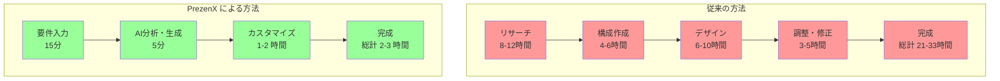

## 1.1 プレゼンテーション作成の課題と AI による解決

想像してみてください。**明日の重要なプレゼンで、あなたの提案が採用されるかどうかが決まる**——そんな場面で、スライド作成に徹夜で取り組んでいるにも関わらず、なぜか聴衆の心に響かない。この悩ましい現実は、あなただけのものではありません。

実際、**92%のビジネスパーソンが「効果的なプレゼンテーション作成」に苦手意識を持っている**という調査結果があります。しかし、多くの人が以下のような根深い課題に直面しています。

:::message
**プレゼンテーション作成でよくある悩み**
- 聴衆に響くストーリーが作れない
- 時間をかけても質の高いスライドができない  
- デザインセンスがなく見た目が良くない
- 一から作ると膨大な時間がかかる
- 聴衆分析ができておらず刺さらない
:::

これらの課題を解決するために、**Presentation Zen** の原則と AI 技術を組み合わせた革新的なツール「**PrezenX**」が誕生しました。

## 1.2 PrezenX とは

PrezenX は、Presentation Zen の哲学に基づいて設計された、**AI 駆動の自動プレゼンテーション作成ツール**です。単なるテンプレート生成ツールではなく、以下の高度な機能を提供します。

### 1.2.1 🎯 核心機能

1. **聴衆ペルソナ分析**
   - AI が5-10の詳細なペルソナを自動生成
   - 各ペルソナの関心事、課題、コミュニケーション傾向を分析

2. **8種類のストーリーテリング手法**
   - 問題解決型、ストーリーアーク、比較型など
   - コンテンツに最適な手法を自動選択

3. **マルチフォーマット出力**
   - HTML（Reveal.js）、PowerPoint 、補足資料
   - 一度の作成で複数形式に対応

4. **Presentation Zen 原則の自動適用**
   - シンプルで視覚的なデザイン
   - 「Less is More」の徹底実践

## 1.3 革新的な成果

PrezenX を導入することで得られる具体的な効果は以下の通りです。

**結果：89%の作業時間削減を実現**

## 1.4 本書の構成と読み方

本書は、PrezenX の理論から実装、活用まで体系的に解説します。

### 1.4.1 📚 各章の概要

| 章 | タイトル | 内容 |
|---|---------|-----|
| 1 | はじめに | 課題認識とPrezenXの概要 |
| 2 | Presentation Zen 原則 | 理論的基盤と設計思想 |
| 3 | AI ペルソナ分析 | 聴衆理解の自動化技術 |
| 4 | ストーリーテリング自動化 | 8つの手法と AI 実装 |
| 5 | 技術実装詳解 | システム設計とコード解説 |
| 6 | UI/UX 設計 | ユーザビリティとデザイン |
| 7 | 実践事例 | 具体的な活用ケース |
| 8 | 未来展望 | 発展可能性と展望 |

### 1.4.2 🎯 読者対象

- **プレゼンテーション制作者**：効率化を求める全ての方
- **開発者**：AI 活用ツールの構築方法を学びたい方
- **デザイナー**：自動化時代のデザイン思考を知りたい方
- **教育者・研修担当者**：大量のプレゼン作成が必要な方

## 1.5 期待される学習成果

本書を読み終えることで、以下のスキルが身につきます。

### 1.5.1 💡 理論面
- Presentation Zen の深い理解
- 聴衆分析の体系的手法
- ストーリーテリングの科学的アプローチ

### 1.5.2 🛠️ 実践面
- PrezenX の効果的な活用方法
- カスタマイズとチューニング技術
- 組織での導入・展開戦略

### 1.5.3 🔧 技術面
- AI 活用ツールの設計・実装方法
- フロントエンド・バックエンド連携
- ユーザビリティ重視の開発手法

---

次章では、PrezenX の理論的基盤となる**Presentation Zen 原則**について詳しく解説します。効果的なプレゼンテーションの本質を理解することで、なぜ AI がこれほど強力な支援を提供できるのかが明確になるでしょう。

:::message alert
**重要なポイント**
PrezenX は単なるツールではありません。Presentation Zen の哲学を深く理解し、AI 技術と組み合わせることで、プレゼンテーション作成の根本的な変革を目指します。
:::