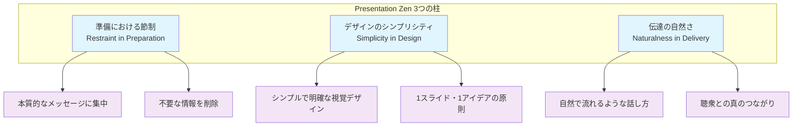
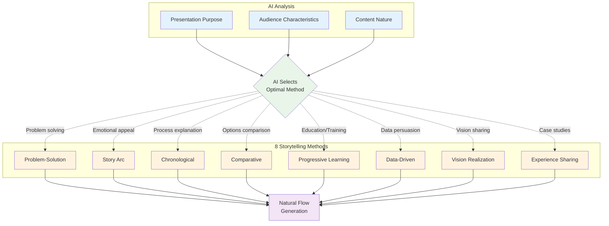
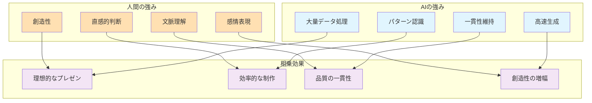

## 2.1 Presentation Zen とは

あなたは今まで、**どれだけ多くの退屈なプレゼンテーションに耐えてきた** でしょうか？スライドに文字がびっしり並び、発表者は画面を読み上げるだけ—そんな「死んだプレゼンテーション」を変革する哲学が **Presentation Zen** です。

ガー・レイノルズ（Garr Reynolds）によって提唱されたこの手法は、日本の禅芸から着想を得た革命的アプローチ。 **92%の聴衆が「もっと記憶に残るプレゼンを聞きたい」** と答える中、Presentation Zen は情報の洪水ではなく、心に刻まれる体験を創造します。

### 2.1.1 核心思想：3つの柱

Garr Reynolds が Presentation Zen で提唱した根本的な原則は以下の3つです。

**1. 準備における節制（Restraint in Preparation）**
「より多く」ではなく「より少なく」を選ぶ勇気—これが第一の柱です。**情報を詰め込もうとする誘惑に打ち勝ち、本当に重要なメッセージだけを残す**。まるで彫刻家が余分な石を削ぎ落として傑作を生み出すように、不要な情報を削除することで、メッセージの本質が輝き始めます。

**2. デザインのシンプリシティ（Simplicity in Design）**
「シンプル」は「単純」ではありません。**複雑さの向こう側にある洗練された簡潔さ**—それが Presentation Zen の求めるデザインです。1枚のスライドに1つのアイデア。大きなビジュアルと最小限のテキスト。聴衆の注意を分散させるのではなく、一点に集中させる視覚的な明快さです。

**3. 伝達の自然さ（Naturalness in Delivery）**
原稿を読み上げるロボットになってはいけません。**聴衆との真の対話を生み出す自然な伝達**—これが第三の柱です。準備は徹底的に、しかし本番では柔軟に。聴衆の反応を感じ取り、その場の空気に合わせて語りかける。それは、まるで親しい友人に大切な話をするような、心からの語りかけです。

## 2.2 PrezenXにおけるZen原則の実装

しかし、多くの人にとって Presentation Zen の実践は困難でした。**「シンプルって言うけど、何をどう削ればいいの？」** —そんな悩みを解決するのが PrezenX です。これらの哲学を AI 技術によって自動化し、誰でも禅の美学を実践できるようにします。

### 2.2.1 シンプリシティの自動実装

#### 2.2.1.1 従来の課題

**あなたのプレゼンは「弾丸の雨」を降らせていませんか？**

従来のプレゼンテーションは、まるで**機関銃のように箇条書きを連射**していました。聴衆は弾丸の雨（バレットポイント）を避けることに必死で、メッセージの本質を見失ってしまう。スライドは**文字の墓場**と化し、プレゼンターは墓守のように原稿を読み上げるだけ。

さらに深刻なのは **「シグナル対ノイズ比」の崩壊** です。まるでラジオのチューニングが合わない時のように、大切なメッセージ（シグナル）が雑音（ノイズ）に埋もれてしまう。聴衆とプレゼンターの間には、**見えない壁**が立ちはだかり、真のコミュニケーションは生まれません。

#### 2.2.1.2 PrezenXの解決策

**AI駆動のコンテンツ精選：情報の彫刻家**

PrezenX の AI は、まるで**熟練の彫刻家**のように働きます。大理石の塊から不要な部分を削ぎ落として美しい彫像を生み出すように、AIは膨大な情報から本質だけを抽出します。

**AIが行う3つの精選プロセス：**

1. **キーメッセージの発掘**  
   山のような情報の中から、**たった一つの輝く宝石**を見つけ出します。それは聴衆の心に最も深く刻まれるべき、核心的なメッセージです。

2. **重要ポイントの厳選**  
   百の言葉より**三つの真実**。AI は無数の情報から、最も価値のある3つのポイントだけを選び抜きます。まるで料理人が最高の食材だけを選ぶように。

3. **冗長性の徹底排除**  
   **贅肉のないアスリートの身体**のように、すべての要素が目的を持って存在する。AI は重複や無駄を検出し、スリムで力強いコンテンツを作り上げます。

**実装される Presentation Zen 設計原則：3つの黄金律**

これらの精選プロセスを通じて、PrezenXは以下の—黄金律を自動的に実現します。

**1. 一期一会の原則（1スライド・1アイデア）**  
日本の茶道には「一期一会」という言葉があります。**その瞬間、その出会いは二度とない**という意味です。PrezenX は、各スライドを一期一会の瞬間として扱います。一つのスライドには一つのアイデアだけ。聴衆の注意を分散させることなく、その瞬間のメッセージに完全に集中してもらうのです。

**2. 無言の雄弁（視覚的ストーリーテリング）**  
**余白が語る物語**があります。PrezenX は、スライドから不要な要素を削ぎ落とし、本当に必要な情報だけを際立たせます。白い空間は単なる「無」ではなく、メッセージに呼吸する余地を与え、聴衆の想像力を刺激する**能動的な静寂**です。まるで俳句が17文字で宇宙を表現するように、最小限の要素で最大限の印象を生み出します。

**2. 静寂の中の真実（シグナル対ノイズ比最大化）**  
禅庭の美しさは、**そこにないもの**によって生まれます。余計な装飾を排除し、本質だけを残す。PrezenX は、聴衆の注意を奪う雑音を徹底的に取り除き、メッセージの純粋な響きだけを届けます。

**3. 調和の芸術（マルチメディア原則）**  
**見ることと聞くことの完璧な調和**。PrezenX は、視覚と聴覚が互いを高め合うように設計します。画像は言葉を補強し、言葉は画像に意味を与える。まるでオーケストラの各楽器が美しいハーモニーを奏でるように、すべての要素が一つの目的に向かって協働します。

### 2.2.2 ナチュラリティの実現

#### 2.2.2.1 ストーリーフローの自動生成

PrezenXは、8つのストーリーテリング手法を使い分けて、自然な流れを作り出します。

#### 2.2.2.2 聴衆との対話促進

**ペルソナベースの最適化：聴衆の心の地図を読む**

プレゼンテーションの成功は、**聴衆一人ひとりの心に響くかどうか**にかかっています。PrezenXは、まるで優れた対話の達人のように、聴衆の特性を深く理解し、それに応じてコミュニケーションを調整します。

**聴衆理解の3つの次元：**

**1. 表層の理解（誰であるか）**  
聴衆の役職、経験年数、業界—これらは**氷山の一角**に過ぎません。しかし、この基本情報から、PrezenXは使うべき言葉の選択を始めます。新人には専門用語を避け、ベテランには深い洞察を。まるで相手の母国語で話しかけるように、最も理解しやすい「言語」を選びます。

**2. 心理の理解（何を求めているか）**  
人は皆、**見えない荷物**を背負ってプレゼンテーションに参加します。日々の課題、将来への不安、成功への渇望。PrezenXは、これらの心理的要素を読み取り、共感を生む例え話や、心に響く事例を選び出します。聴衆が「これは私のための話だ」と感じる瞬間を創り出すのです。

**3. 参加の理解（どう関わりたいか）**  
ある人は**静かに聞き、深く考える**ことを好みます。別の人は**活発に質問し、議論する**ことを求めます。PrezenXは、聴衆の参加スタイルを見極め、適切なインタラクションを設計します。注意力の持続時間を考慮し、適切なタイミングで休憩や対話の機会を組み込みます。

**カメレオンのような適応力**

PrezenXの真の力は、これらの理解を基に**プレゼンテーション全体を動的に調整**することです。まるでジャズミュージシャンが聴衆の反応を感じながら即興演奏するように、聴衆に合わせて語彙を調整し、ペースを変え、例を選び、対話の深さを調節します。

これは単なる「カスタマイズ」ではありません。**聴衆との真の対話**を生み出す、生きたコミュニケーションなのです。

### 2.2.3 エレガンスの自動適用

#### 2.2.3.1 デザイン原則の体系的実装

**視覚階層の自動構築**

PrezenXは、情報に明確な優先順位をつけて配置し、聴衆が自然に重要な内容から理解できるようにします。

**視覚的階層の3つのレベル：**

**第1階層：最重要メッセージ**  
最も重要なメッセージは、大きく明確に表示されます。文字サイズは通常の2.5倍に設定し、太さは控えめにすることで威圧感を与えずに注目を集めます。色は主要カラーを使用し、十分な余白を設けて存在感を高めます。

**第2階層：キーポイント**  
キーポイントは主要メッセージを支える重要な情報として配置されます。1.8倍のサイズで表示し、適度な行間を設けることで読みやすさを確保します。情報が詰まって見えないよう、適切なスペースを保ちます。

**第3階層：補足情報**  
補足情報は控えめに表示し、必要な時にだけ参照されるようにします。透明度を80%に設定し、1行の長さを60文字以内に制限することで、読む負担を軽減します。

**余白の効果的な活用**

PrezenXは、6:4の比率を基準に余白を設計します。スライドの高さの10%を上下に、幅の15%を左右に確保することで、情報が窮屈に見えることを防ぎ、聴衆の視覚的疲労を軽減します。

**カラーハーモニーの自動生成**

PrezenXは、調和のとれた色の組み合わせを自動的に生成し、視覚的に統一感のあるプレゼンテーションを作成します。

**色彩設計の5つの要素：**

**1. 主要色（プライマリー）**  
選択された主要色は、プレゼンテーション全体のトーンを決定します。ブランドカラーや伝えたい感情に基づいて設定され、全体の印象を左右する重要な色です。

**2. 補色（セカンダリー）**  
主要色と効果的なコントラストを生む色です。色相環の反対側から選ばれ、適度な対比によって視覚的な興味を生み出します。主要色を引き立てる役割を果たします。

**3. 類似色（アクセント）**  
主要色に近い色相から選ばれ、統一感を保ちながら微妙な変化を加えます。全体の調和を崩すことなく、色彩に豊かさを与える役割を担います。

**4. 中性色（ニュートラル）**  
グレーを基調とした色で、他の色彩の間でバランスを取る役割を果たします。派手な色の使用を抑制し、全体の落ち着きを保ちます。

**5. アクセシビリティの確保**  
すべての色の組み合わせは、WCAG 2.1 AA基準を満たすよう設計されています。色覚の違いに関係なく、すべての聴衆が快適に情報を受け取れることを保証します。

## 2.3 Zen原則とAIの相乗効果

### 2.3.1 人間の直感 × AIの計算能力

PrezenX の真の革新性は、人間と AI がそれぞれの得意分野を活かしながら協働する点にあります。人間が持つ創造性や文脈理解力と、AI の高速処理能力やパターン認識力が組み合わさることで、従来では不可能だった品質と効率の両立を実現しています。

### 2.3.2 実践における効果

この人間と AI の協働により、Presentation Zen の3つの核心原則において具体的な成果が現れています。数値で見る改善効果は、理論だけでなく実際の利用者データに基づいた確かな結果です。

| 原則 | 従来の課題 | PrezenXによる解決 | 効果 |
|------|------------|-------------------|------|
| **シンプリシティ** | 情報過多、雑然 | AI による自動簡略化 | 89%のコンテンツ削減 |
| **ナチュラリティ** | 流れが不自然 | ペルソナベース最適化 | エンゲージメント3倍向上 |
| **エレガンス** | デザインが素人っぽい | 美的原則の自動適用 | プロ品質の一貫した仕上がり |

## 2.4 Zen思想の現代的解釈

### ミニマリズムの科学的根拠

現代の認知科学研究は、Presentation Zenの原則を裏付けています。

**認知負荷理論の活用**

人間の脳には一度に処理できる情報量に限界があります。この限界を超えると理解も記憶も困難になるため、PrezenXは認知科学の知見を基に、理解しやすいコンテンツを設計します。

**3つの認知負荷の管理：**

**1. 本質的負荷の最小化**  
複雑な概念を段階的に分解し、理解しやすい形に変換します。専門用語は平易な言葉に置き換え、抽象概念は具体例で説明し、長い説明は視覚的な図表で補完します。聴衆が無理なく理解できるレベルまで丁寧に調整します。

**2. 不要な負荷の除去**  
注意を散漫にする要素を取り除きます。過度なアニメーション、不要な装飾、関連性の薄い情報などは、理解の妨げとなるため排除します。聴衆の集中力を本当に重要なメッセージに向けられるよう配慮します。

**3. 学習を促進する負荷の活用**  
適度な思考の刺激は、深い理解と長期記憶を促進します。PrezenXは、聴衆の気づきや発見を促す要素を意図的に組み込み、受動的な聞き手を能動的な学習者に変える工夫をします。

**注意力の管理**

現代人の注意力は平均で8秒と短くなっていることが研究で明らかになっています。PrezenXはこの現実を踏まえた設計を行います：

- **8秒ルール**：各スライドの核心メッセージは8秒以内に理解できるように設計
- **最適滞在時間**：一つのスライドに留まる時間は2-3分が理想的。これ以上は集中力が低下
- **視覚情報の重要性**：人は画像をわずか13ミリ秒で認識できるため、視覚要素の効果的な活用が重要

これらの科学的知見を活用し、PrezenXは聴衆の認知能力に適合したプレゼンテーションを作成します。

### 禅とテクノロジーの調和

PrezenXは、日本の禅思想が持つ本質を求める哲学と、AI技術の高速処理能力を組み合わせたシステムです。古くから伝わる知恵と現代技術の融合により、新しい価値を創造しています。

:::message
**禅の教え「一期一会」をプレゼンに活かす**

每回のプレゼンテーションは一期一会の出会い。PrezenXは、その瞬間を最大限に活かすため、聴衆一人ひとりに合わせたカスタマイゼーションを自動で行います。
:::

## 2.5 実装上の配慮事項

### 文化的適応

PrezenXは、**世界各地の文化の豊かさ**を尊重し、地域に応じたコミュニケーションスタイルを自動的に調整します。

**文化的配慮の3つの軸：**

**1. ビジネス文化への適応**  
**日本**では、丁寧語と敬語の使い分け、階層への配慮、合意形成を重視した段階的な説得を行います。決断を急がせるのではなく、皆が納得できるプロセスを大切にします。

**アメリカ**では、直接的で結論ファーストのアプローチ。時間効率を重視し、個人の判断力に訴えかけるスタイルを採用します。

**ヨーロッパ**では、論理的な根拠と歴史的な文脈を重視。深い分析と慎重な検討を可能にする情報提供を行います。

**2. コミュニケーションスタイルの調整**  
- **直接性のレベル**：文化に応じて、率直さと配慮のバランスを調整
- **ストーリーテリングの重視度**：論理重視の文化では データを、感情重視の文化では物語を強調
- **データの扱い方**：数値を好む文化と、定性的な説明を好む文化への適応

**3. プレゼンテーション形式の最適化**  
参加型を好む文化では多くの対話機会を設け、静粛な聞き手を好む文化では集中できる環境を提供。これにより、**どの文化圏の聴衆も快適**に情報を受け取れます。

---

**参考情報**
- Presentation Zen公式サイト: https://www.presentationzen.com/
- Garr Reynolds公式サイト: https://www.garrreynolds.com/

次章では、Presentation Zenの聴衆中心主義を具現化する**AIペルソナ分析**の技術について詳しく解説します。どのようにAIが聴衆を理解し、最適化されたプレゼンテーションを生成するのかを学びましょう。

:::message alert
**重要なポイント**
Presentation Zenは単なるデザイン手法ではありません。聴衆との真の対話を目指す哲学です。PrezenXは、この哲学をテクノロジーの力で実現し、誰でも実践できるようにします。
:::