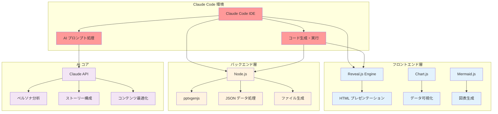

## 5.1 アーキテクチャ概要

PrezenX は、Claude Code (claude.ai/code) を中核とした軽量でありながら強力なアーキテクチャを採用し、開発効率と実用性を両立させています。

### 5.1.1 システム全体図



## 5.2 Claude Code ベースの実装

### 5.2.1 開発環境と前提条件

**重要な制約と要件：**

```bash
# 必須環境
- Claude Code (claude.ai/code) 専用設計
- Node.js v18以上
- 他のLLMサービスでは動作保証なし
```

**セットアップ手順：**

```bash
# GitHubからクローン
git clone https://github.com/nahisaho/PrezenX2.git
cd PrezenX2

# 依存関係のインストール
npm install

# 開発サーバー起動
npm run dev
```

**Claude Code 統合の核心部分：**

```javascript
// claude-integration.js - Claude Code専用の処理
class ClaudeCodeIntegration {
  constructor() {
    this.isClaudeCodeEnvironment = this.detectClaudeCode();
    if (!this.isClaudeCodeEnvironment) {
      throw new Error('PrezenX2 は Claude Code 環境でのみ動作します');
    }
  }

  detectClaudeCode() {
    // Claude Code環境の検出ロジック
    return typeof window !== 'undefined' && 
           window.navigator.userAgent.includes('Claude');
  }

  async processWithClaude(prompt, context) {
    // Claude Code特有のプロンプト処理
    return await this.claudeAPI.process({
      prompt: this.optimizeForClaudeCode(prompt),
      context: context,
      mode: 'presentation_generation'
    });
  }
}
```

### 5.2.2 プロジェクト構造と中間ファイル活用

```
PrezenX2/
├── src/
│   ├── templates/           # 基本テンプレート
│   │   ├── storytelling/    # 8種類のストーリー手法
│   │   └── layouts/         # レイアウト定義
│   ├── generators/          # コンテンツ生成器
│   │   ├── persona-analyzer.js
│   │   ├── story-selector.js
│   │   └── content-generator.js
│   ├── outputs/            # 生成されたファイル
│   │   ├── data/           # 中間JSONデータ
│   │   ├── html/           # HTML出力
│   │   └── pptx/           # PowerPoint出力
│   └── utils/              # ユーティリティ
├── package.json
└── README.md
```

**人間の専門知識と中間ファイルの重要性：**

PrezenX2の特徴は、完全自動化ではなく**人間の専門知識を活かした半自動化**アプローチです：

```javascript
// ワークフロー例
async function generatePresentation(userInput) {
  // 1. Claude による初期分析
  const personas = await analyzeAudience(userInput);
  
  // 2. 中間JSONファイル生成（手動編集可能）
  await saveIntermediateData('personas.json', personas);
  
  // 3. ユーザーによる手動調整の機会
  console.log('personas.json を確認・編集してください');
  await waitForUserConfirmation();
  
  // 4. 調整されたデータでストーリー生成
  const adjustedPersonas = await loadIntermediateData('personas.json');
  const storyStructure = await generateStoryStructure(adjustedPersonas);
  
  // 5. 最終コンテンツ生成
  return await generateFinalPresentation(storyStructure);
}
```

### 5.2.3 Reveal.js とデータ可視化の統合

```javascript
// reveal-generator.js - Reveal.js プレゼンテーション生成
const Reveal = require('reveal.js');
const Chart = require('chart.js');
const mermaid = require('mermaid');

class RevealGenerator {
  constructor(slideData) {
    this.slides = slideData;
    this.mermaidConfig = {
      theme: 'default',
      themeVariables: {
        primaryColor: '#2563EB',
        primaryTextColor: '#1F2937'
      }
    };
  }

  generateHTML() {
    return `
<!DOCTYPE html>
<html>
<head>
  <link rel="stylesheet" href="reveal.js/dist/reveal.css">
  <link rel="stylesheet" href="reveal.js/dist/theme/white.css">
  <script src="chart.js/dist/chart.min.js"></script>
  <script src="mermaid/dist/mermaid.min.js"></script>
</head>
<body>
  <div class="reveal">
    <div class="slides">
      ${this.generateSlides()}
    </div>
  </div>
  
  <script src="reveal.js/dist/reveal.js"></script>
  <script>
    // Reveal.js 初期化
    Reveal.initialize({
      hash: true,
      controls: true,
      progress: true,
      center: true,
      transition: 'slide'
    });
    
    // Mermaid 初期化
    mermaid.initialize(${JSON.stringify(this.mermaidConfig)});
    
    // Chart.js グラフの動的生成
    ${this.generateChartScripts()}
  </script>
</body>
</html>
    `;
  }

  generateSlides() {
    return this.slides.map(slide => {
      switch (slide.type) {
        case 'mermaid':
          return this.generateMermaidSlide(slide);
        case 'chart':
          return this.generateChartSlide(slide);
        case 'content':
          return this.generateContentSlide(slide);
        default:
          return this.generateDefaultSlide(slide);
      }
    }).join('\n');
  }

  generateMermaidSlide(slide) {
    return `
      <section>
        <h2>${slide.title}</h2>
        <div class="mermaid">
          ${slide.mermaidCode}
        </div>
      </section>
    `;
  }

  generateChartSlide(slide) {
    return `
      <section>
        <h2>${slide.title}</h2>
        <div style="width: 80%; margin: 0 auto;">
          <canvas id="chart-${slide.id}"></canvas>
        </div>
      </section>
    `;
  }
}

module.exports = RevealGenerator;
```

## 5.3 Node.js バックエンドとエクスポート機能

### 5.3.1 pptxgenjs を使用した PowerPoint 生成

```javascript
// powerpoint-generator.js - PowerPoint ファイル生成
const PptxGenJS = require('pptxgenjs');
const fs = require('fs');
const path = require('path');

class PowerPointGenerator {
  constructor(slideData) {
    this.pptx = new PptxGenJS();
    this.slides = slideData;
    this.setupDefaults();
  }

  setupDefaults() {
    // デフォルトスタイル設定
    this.pptx.defineLayout({ name: 'PREZENX_LAYOUT', width: 10, height: 7.5 });
    this.pptx.layout = 'PREZENX_LAYOUT';
    
    // マスタースライド設定
    this.pptx.defineSlideMaster({
      title: 'PREZENX_MASTER',
      background: { color: 'FFFFFF' },
      objects: [
        {
          placeholder: {
            options: { name: 'title', type: 'title' },
            text: 'タイトル'
          }
        }
      ]
    });
  }

  async generatePresentation() {
    for (const slideData of this.slides) {
      await this.createSlide(slideData);
    }
    
    return this.exportFile();
  }

  async createSlide(slideData) {
    const slide = this.pptx.addSlide({ masterName: 'PREZENX_MASTER' });
    
    switch (slideData.type) {
      case 'title':
        this.createTitleSlide(slide, slideData);
        break;
      case 'content':
        this.createContentSlide(slide, slideData);
        break;
      case 'chart':
        await this.createChartSlide(slide, slideData);
        break;
      case 'mermaid':
        await this.createDiagramSlide(slide, slideData);
        break;
      default:
        this.createDefaultSlide(slide, slideData);
    }
  }

  createTitleSlide(slide, data) {
    slide.addText(data.title, {
      x: 1, y: 2.5, w: 8, h: 1.5,
      fontSize: 44,
      bold: true,
      align: 'center',
      color: '2563EB'
    });
    
    if (data.subtitle) {
      slide.addText(data.subtitle, {
        x: 1, y: 4, w: 8, h: 1,
        fontSize: 24,
        align: 'center',
        color: '6B7280'
      });
    }
  }

  createContentSlide(slide, data) {
    // タイトル
    slide.addText(data.title, {
      x: 1, y: 0.5, w: 8, h: 1,
      fontSize: 32,
      bold: true,
      color: '1F2937'
    });
    
    // コンテンツ
    const bulletPoints = data.content.map(item => ({
      text: item,
      options: { bullet: true, fontSize: 18 }
    }));
    
    slide.addText(bulletPoints, {
      x: 1, y: 2, w: 8, h: 4.5
    });
  }

  async exportFile() {
    const outputPath = path.join(__dirname, '../outputs/pptx/');
    const fileName = `presentation_${Date.now()}.pptx`;
    const fullPath = path.join(outputPath, fileName);
    
    // ディレクトリが存在しない場合は作成
    if (!fs.existsSync(outputPath)) {
      fs.mkdirSync(outputPath, { recursive: true });
    }
    
    await this.pptx.writeFile({ fileName: fullPath });
    return fullPath;
  }
}

module.exports = PowerPointGenerator;
```

### 5.3.2 コンテンツ処理とデータ管理

```javascript
// data-manager.js - 中間データ管理
const fs = require('fs').promises;
const path = require('path');

class DataManager {
  constructor() {
    this.dataDir = path.join(__dirname, '../outputs/data');
    this.ensureDataDirectory();
  }

  async ensureDataDirectory() {
    try {
      await fs.access(this.dataDir);
    } catch {
      await fs.mkdir(this.dataDir, { recursive: true });
    }
  }

  // 中間JSONデータの保存
  async saveIntermediateData(filename, data) {
    const filePath = path.join(this.dataDir, filename);
    const jsonData = JSON.stringify(data, null, 2);
    await fs.writeFile(filePath, jsonData, 'utf-8');
    console.log(`中間データを保存しました: ${filename}`);
    return filePath;
  }

  // 中間JSONデータの読み込み
  async loadIntermediateData(filename) {
    const filePath = path.join(this.dataDir, filename);
    try {
      const rawData = await fs.readFile(filePath, 'utf-8');
      return JSON.parse(rawData);
    } catch (error) {
      console.error(`データ読み込みエラー: ${filename}`, error.message);
      return null;
    }
  }

  // データ骍証
  validatePersonaData(personas) {
    if (!Array.isArray(personas)) {
      throw new Error('ペルソナデータは配列である必要があります');
    }

    personas.forEach((persona, index) => {
      if (!persona.name || !persona.demographics) {
        throw new Error(`ペルソナ${index + 1}に必要なフィールドが不足しています`);
      }
    });

    return true;
  }

  // ストーリーデータ骍証
  validateStoryData(story) {
    const requiredFields = ['method', 'structure', 'slides'];
    
    requiredFields.forEach(field => {
      if (!story[field]) {
        throw new Error(`ストーリーデータに${field}フィールドがありません`);
      }
    });

    if (!Array.isArray(story.slides) || story.slides.length === 0) {
      throw new Error('スライドデータが無効です');
    }

    return true;
  }

  // ファイル一覧取得
  async listDataFiles() {
    try {
      const files = await fs.readdir(this.dataDir);
      return files.filter(file => file.endsWith('.json'));
    } catch {
      return [];
    }
  }

  // バックアップ作成
  async createBackup(filename) {
    const originalPath = path.join(this.dataDir, filename);
    const backupPath = path.join(this.dataDir, `${filename}.backup_${Date.now()}`);
    
    try {
      await fs.copyFile(originalPath, backupPath);
      console.log(`バックアップ作成: ${backupPath}`);
      return backupPath;
    } catch (error) {
      console.error('バックアップ作成エラー:', error.message);
      return null;
    }
  }
}

module.exports = DataManager;
```

### 5.3.3 ストーリーテリング生成エンジン

```typescript
// src/server/services/StorytellingEngine.ts
export class StorytellingEngine {
  private claude: Claude;
  private methodSelectors: Map<string, MethodSelector>;

  constructor() {
    this.claude = new Claude({ apiKey: process.env.CLAUDE_API_KEY });
    this.initializeMethodSelectors();
  }

  async generateStory(
    content: PresentationContent,
    personas: PersonaProfile[],
    preferredMethod?: StorytellingMethod
  ): Promise<StoryStructure> {
    
    // 最適手法の選択
    const selectedMethod = preferredMethod || 
      await this.selectOptimalMethod(content, personas);

    // 手法固有のプロンプト生成
    const prompt = this.buildStorytellingPrompt(content, personas, selectedMethod);

    // AI生成実行
    const response = await this.claude.messages.create({
      model: 'claude-3-sonnet-20240229',
      max_tokens: 6000,
      temperature: 0.7, // 創造性を重視
      messages: [{ role: 'user', content: prompt }]
    });

    // 構造化された物語に変換
    return this.parseAndStructureStory(response.content[0].text, selectedMethod);
  }

  private async selectOptimalMethod(
    content: PresentationContent,
    personas: PersonaProfile[]
  ): Promise<StorytellingMethod> {
    
    const factors = {
      audienceAnalytical: this.calculateAnalyticalOrientation(personas),
      audienceEmotional: this.calculateEmotionalNeeds(personas),
      contentComplexity: this.analyzeContentComplexity(content),
      urgencyLevel: this.assessUrgency(content, personas)
    };

    // 各手法のスコア計算
    const methodScores = new Map<StorytellingMethod, number>();
    
    methodScores.set('problem-solution', 
      factors.audienceAnalytical * 0.4 + factors.urgencyLevel * 0.6
    );
    
    methodScores.set('narrative-arc', 
      factors.audienceEmotional * 0.7 + (1 - factors.contentComplexity) * 0.3
    );
    
    methodScores.set('data-driven', 
      factors.audienceAnalytical * 0.6 + factors.contentComplexity * 0.4
    );

    // 他の手法のスコア計算...

    // 最高スコアの手法を選択
    return Array.from(methodScores.entries())
      .reduce((best, [method, score]) => 
        score > best.score ? { method, score } : best,
        { method: 'problem-solution', score: 0 }
      ).method;
  }

  private buildStorytellingPrompt(
    content: PresentationContent,
    personas: PersonaProfile[],
    method: StorytellingMethod
  ): string {
    const basePrompt = `
あなたは世界トップクラスのストーリーテリング専門家です。
${method}手法を使用して、効果的なプレゼンテーション構成を作成してください。

## コンテンツ情報
${JSON.stringify(content, null, 2)}

## 聴衆ペルソナ
${personas.map(p => `
### ${p.name}
- 役割: ${p.demographics.role}
- 価値観: ${p.psychographic.coreValues.join(', ')}
- 動機: ${p.psychographic.motivations.join(', ')}
- 懸念: ${p.psychographic.fears.join(', ')}
`).join('\n')}
    `;

    return basePrompt + this.getMethodSpecificInstructions(method);
  }

  private getMethodSpecificInstructions(method: StorytellingMethod): string {
    const instructions = {
      'problem-solution': `
## 問題解決型ストーリー構成要件
1. 導入: 聴衆が共感する問題提示
2. 問題深掘り: 根本原因と現状の限界
3. 解決策: 具体的で実現可能な提案
4. 効果実証: 数値的根拠と成功事例
5. 行動喚起: 明確な次のステップ

出力形式: JSON
{
  "structure": "problem-solution",
  "sections": [
    {
      "type": "opening",
      "title": "セクションタイトル",
      "content": "内容",
      "slides": [{ "type": "...", "content": "..." }]
    }
  ]
}
      `,
      
      'narrative-arc': `
## ナラティブアーク構成要件
1. 設定: 主人公（聴衆の代理）と状況
2. 発端: 変化を促す出来事
3. 上昇: 困難と挑戦の積み重ね
4. 頂点: 転換点と重要な発見
5. 結末: 新しい世界と教訓

感情的エンゲージメントを最重視してください。
      `,
      
      'data-driven': `
## データ駆動型構成要件
1. データ概要: 分析の文脈と重要性
2. 主要発見: 3-5の重要な洞察
3. パターン分析: トレンドと相関関係
4. 示唆: データが示す行動指針
5. 予測: 将来の展望

各セクションに適切な可視化を含めてください。
      `
      // 他の手法の指示...
    };

    return instructions[method] || '';
  }
}
```

## 5.4 Claude 統合とプロンプト最適化

### 5.4.1 Claude Code 専用プロンプト戦略

```javascript
// claude-prompts.js - Claude Code 専用プロンプト管理
class ClaudePromptManager {
  constructor() {
    this.promptTemplates = new Map();
    this.loadPromptTemplates();
  }

  loadPromptTemplates() {
    // ペルソナ分析用プロンプト
    this.promptTemplates.set('persona_analysis', {
      systemRole: 'あなたは経験豊富なプレゼンテーションコンサルタントです。',
      template: `
以下の情報を基に、教育機関の聴衆を分析し、具体的なペルソナを作成してください。

## 入力情報
テーマ: {{topic}}
目的: {{objectives}}
聴衆: {{audience_info}}
制約: {{constraints}}

## 教育機関特有の考慮事項
- 学術的厳密さと実用性のバランス
- 伝統的な教育手法と新技術の融合
- 研究・教育・管理の異なる立場
- 長期的な学習成果と知識継承

## 出力形式
JSON形式で以下の構造で出力してください：
{
  "personas": [
    {
      "name": "具体的な名前",
      "role": "役職・立場",
      "demographics": {
        "experience_years": 数値,
        "specialization": "専門分野",
        "institution_type": "機関タイプ"
      },
      "motivations": ["..."],
      "concerns": ["..."],
      "communication_preferences": ["..."]
    }
  ]
}
      `
    });

    // ストーリー選択用プロンプト
    this.promptTemplates.set('story_selection', {
      systemRole: 'あなたはストーリーテリングの専門家です。',
      template: `
以下のペルソナ情報とプレゼンテーション情報を基に、
8つのストーリーテリング手法から最適なものを選択し、理由を説明してください。

## 8つのストーリーテリング手法
1. 問題解決型 (Problem-Solution)
2. ナラティブアーク (Narrative Arc)
3. 時系列型 (Chronological)
4. 比較型 (Comparative)
5. 段階学習型 (Progressive Learning)
6. データ駆動型 (Data-Driven)
7. ビジョン実現型 (Vision Realization)
8. 経験共有型 (Experience Sharing)

## ペルソナ情報
{{personas}}

## プレゼンテーション情報
テーマ: {{topic}}
目的: {{objectives}}
時間: {{duration}}

## 出力要求
最適な手法を選択し、以下の情報を提供してください：
- 選択した手法名
- 選択理由（3点以上）
- 期待される効果
- 実装時の注意点
      `
    });
  }

  // プロンプト生成
  generatePrompt(templateName, variables) {
    const template = this.promptTemplates.get(templateName);
    if (!template) {
      throw new Error(`テンプレートが見つかりません: ${templateName}`);
    }

    let prompt = template.template;
    
    // 変数置換
    Object.entries(variables).forEach(([key, value]) => {
      const placeholder = `{{${key}}}`;
      const replacement = typeof value === 'object' ? JSON.stringify(value, null, 2) : String(value);
      prompt = prompt.replace(new RegExp(placeholder, 'g'), replacement);
    });

    return {
      systemRole: template.systemRole,
      userPrompt: prompt
    };
  }

  // Claude Code 環境用の最適化
  optimizeForClaudeCode(prompt) {
    return {
      ...prompt,
      // Claude Code 特有の最適化
      instructions: [
        'Claude Code 環境での処理です',
        '中間ファイルへの出力を前提としています',
        'JSON形式での出力を必ず行ってください'
      ]
    };
  }
}

module.exports = ClaudePromptManager;
```

## 5.5 パフォーマンス最適化

### 5.5.1 キャッシングとメモ化戦略

```typescript
// src/server/cache/CacheManager.ts
import Redis from 'ioredis';

export class CacheManager {
  private redis: Redis;
  private localCache: Map<string, CacheEntry>;

  constructor() {
    this.redis = new Redis(process.env.REDIS_URL);
    this.localCache = new Map();
  }

  // 階層化キャッシュ戦略
  async get<T>(key: string): Promise<T | null> {
    // L1: メモリキャッシュ
    const localEntry = this.localCache.get(key);
    if (localEntry && !this.isExpired(localEntry)) {
      return localEntry.value as T;
    }

    // L2: Redisキャッシュ  
    const redisValue = await this.redis.get(key);
    if (redisValue) {
      const value = JSON.parse(redisValue) as T;
      this.setLocal(key, value, 300); // 5分のローカルキャッシュ
      return value;
    }

    return null;
  }

  async set<T>(key: string, value: T, ttlSeconds: number = 3600): Promise<void> {
    // 両方のキャッシュに保存
    this.setLocal(key, value, Math.min(ttlSeconds, 300));
    await this.redis.setex(key, ttlSeconds, JSON.stringify(value));
  }

  // ペルソナ分析結果のキャッシング
  async cachePersonaAnalysis(
    inputHash: string, 
    personas: PersonaProfile[]
  ): Promise<void> {
    const key = `personas:${inputHash}`;
    await this.set(key, personas, 86400); // 24時間キャッシュ
  }

  // ストーリー構造のキャッシング
  async cacheStoryStructure(
    contentHash: string,
    personaHash: string,
    method: string,
    story: StoryStructure
  ): Promise<void> {
    const key = `story:${contentHash}:${personaHash}:${method}`;
    await this.set(key, story, 43200); // 12時間キャッシュ
  }
}

// レスポンス時間の最適化
export class ResponseOptimizer {
  
  // 並列処理によるレスポンス最適化
  static async parallelizeAIRequests<T>(
    requests: Array<() => Promise<T>>
  ): Promise<T[]> {
    const MAX_CONCURRENT = 3; // API制限を考慮
    const results: T[] = [];
    
    for (let i = 0; i < requests.length; i += MAX_CONCURRENT) {
      const batch = requests.slice(i, i + MAX_CONCURRENT);
      const batchResults = await Promise.all(
        batch.map(request => request())
      );
      results.push(...batchResults);
    }
    
    return results;
  }

  // ストリーミングレスポンス
  static streamResponse(
    res: Response,
    generator: AsyncGenerator<string>
  ): void {
    res.writeHead(200, {
      'Content-Type': 'text/event-stream',
      'Cache-Control': 'no-cache',
      'Connection': 'keep-alive'
    });

    (async () => {
      for await (const chunk of generator) {
        res.write(`data: ${JSON.stringify({ chunk })}\n\n`);
      }
      res.write('data: {"done": true}\n\n');
      res.end();
    })();
  }
}
```

## 5.6 運用時の注意点と制限事項

### 5.6.1 Claude Code 環境の制約

```typescript
// src/server/errors/ErrorHandler.ts
export class PrezenXError extends Error {
  constructor(
    message: string,
    public code: string,
    public statusCode: number = 500,
    public isOperational: boolean = true
  ) {
    super(message);
    this.name = 'PrezenXError';
  }
}

export class ErrorHandler {
  static handle(error: Error, req: Request, res: Response, next: NextFunction): void {
    if (error instanceof PrezenXError) {
      this.handleOperationalError(error, res);
    } else {
      this.handleProgrammerError(error, res);
    }
  }

  private static handleOperationalError(error: PrezenXError, res: Response): void {
    res.status(error.statusCode).json({
      success: false,
      error: {
        code: error.code,
        message: error.message,
        timestamp: new Date().toISOString()
      }
    });
  }

  private static handleProgrammerError(error: Error, res: Response): void {
    console.error('Programmer Error:', error);
    res.status(500).json({
      success: false,
      error: {
        code: 'INTERNAL_SERVER_ERROR',
        message: 'An unexpected error occurred',
        timestamp: new Date().toISOString()
      }
    });
  }
}

// リトライとサーキットブレーカー
export class ResilienceManager {
  private circuitBreakers: Map<string, CircuitBreaker>;

  constructor() {
    this.circuitBreakers = new Map();
  }

  async executeWithResilience<T>(
    operation: () => Promise<T>,
    options: ResilienceOptions
  ): Promise<T> {
    const breaker = this.getCircuitBreaker(options.serviceId);
    
    return breaker.execute(async () => {
      return this.retryWithExponentialBackoff(operation, options.retryOptions);
    });
  }

  private async retryWithExponentialBackoff<T>(
    operation: () => Promise<T>,
    options: RetryOptions
  ): Promise<T> {
    let lastError: Error;
    
    for (let attempt = 1; attempt <= options.maxAttempts; attempt++) {
      try {
        return await operation();
      } catch (error) {
        lastError = error as Error;
        
        if (attempt === options.maxAttempts) {
          throw lastError;
        }
        
        const delay = Math.min(
          options.baseDelay * Math.pow(2, attempt - 1),
          options.maxDelay
        );
        
        await new Promise(resolve => setTimeout(resolve, delay));
      }
    }
    
    throw lastError!;
  }
}
```

---

## 5.5 まとめ：Claude Code エコシステムの活用

PrezenX2 は Claude Code の特性を最大限に活用した設計になっています：

**Claude Code の利点を活かした設計**
- **リアルタイム AI 処理**: コード実行環境内での直接的な AI 連携
- **中間ファイル活用**: 人間の専門知識と AI の組み合わせ
- **軽量アーキテクチャ**: 複雑なインフラ不要
- **迅速な開発サイクル**: プロトタイプから本格運用まで

**従来の Web アプリケーションとの違い**
```javascript
// 従来のアプローチ
API Gateway → マイクロサービス → データベース → AI API

// PrezenX2 のアプローチ  
Claude Code → Node.js → 中間JSON → 直接出力
```

この軽量でありながら強力なアーキテクチャにより、開発効率と実用性の両立を実現しています。

次章では、PrezenXの**UI/UX設計**について詳しく解説します。ユーザビリティとアクセシビリティを重視した設計思想と実装方法を学びましょう。

:::message alert
**重要なポイント**
PrezenX2 は Claude Code 専用設計です。他の LLM サービスでの動作は保証されません。Claude Code の制約内で最大の価値を提供することを重視しています。
:::