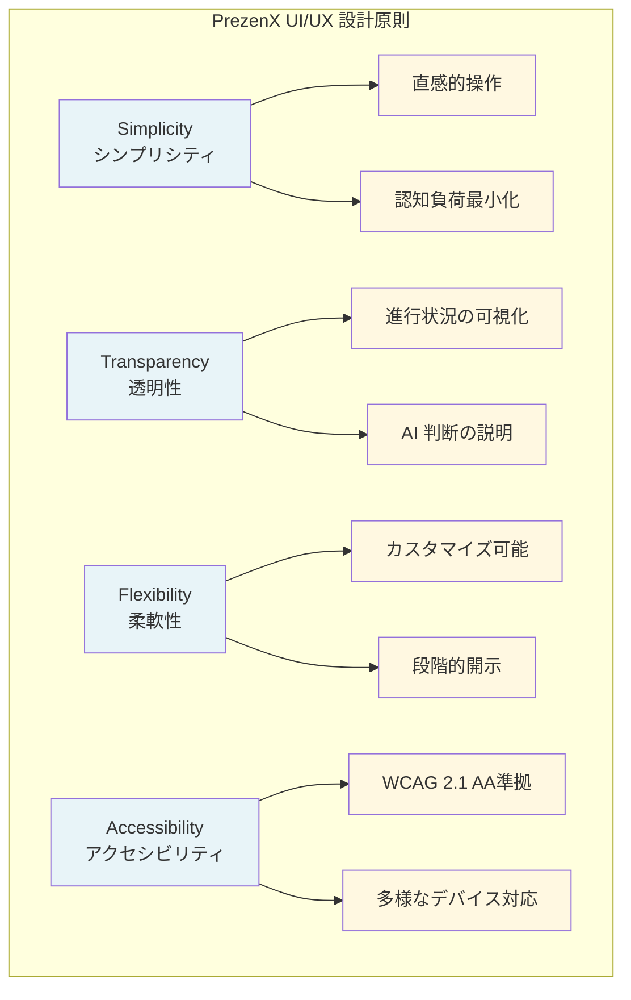

## 6.1 デザイン哲学：Invisible Technology

PrezenX の UI/UX 設計は、「**技術を意識させない**」ことを最優先にしています。高度な AI 技術は背景に隠し、ユーザーは創造的な作業に集中できる環境を提供します。

### 6.1.1 設計原則



## 6.2 情報アーキテクチャ

### 6.2.1 ユーザージャーニーマップ

```typescript
interface UserJourney {
  phases: {
    discovery: {
      touchpoints: ['landing-page', 'demo-video', 'trial-signup'];
      emotions: ['curiosity', 'skepticism', 'interest'];
      painPoints: ['learning-curve-concern', 'quality-doubt'];
      opportunities: ['immediate-value-demo', 'risk-free-trial'];
    };
    onboarding: {
      touchpoints: ['welcome-wizard', 'sample-creation', 'tutorial'];
      emotions: ['anticipation', 'confusion', 'achievement'];
      painPoints: ['information-overload', 'technical-complexity'];
      opportunities: ['progressive-disclosure', 'contextual-help'];
    };
    creation: {
      touchpoints: ['input-form', 'ai-analysis', 'customization'];
      emotions: ['excitement', 'anxiety', 'satisfaction'];
      painPoints: ['wait-time', 'limited-control'];
      opportunities: ['real-time-feedback', 'incremental-preview'];
    };
    refinement: {
      touchpoints: ['editor', 'preview', 'collaboration'];
      emotions: ['focus', 'frustration', 'pride'];
      painPoints: ['complex-editing', 'version-management'];
      opportunities: ['smart-suggestions', 'auto-save'];
    };
    delivery: {
      touchpoints: ['export', 'presentation', 'feedback'];
      emotions: ['nervousness', 'confidence', 'accomplishment'];
      painPoints: ['format-compatibility', 'performance-anxiety'];
      opportunities: ['practice-mode', 'analytics-insights'];
    };
  };
}
```

### 6.2.2 画面構成とワイヤーフレーム

```typescript
// src/components/layout/AppLayout.tsx
interface AppLayoutProps {
  children: React.ReactNode;
  sidebar?: boolean;
  header?: boolean;
  footer?: boolean;
}

export const AppLayout: React.FC<AppLayoutProps> = ({
  children,
  sidebar = true,
  header = true,
  footer = true
}) => {
  return (
    <div className="app-layout">
      {header && <AppHeader />}
      <div className="main-content">
        {sidebar && <Sidebar />}
        <main className="content-area">
          {children}
        </main>
      </div>
      {footer && <AppFooter />}
    </div>
  );
};

// レスポンシブ・グリッドシステム
const layoutStyles = {
  appLayout: {
    display: 'grid',
    gridTemplateRows: 'auto 1fr auto',
    gridTemplateColumns: 'auto 1fr',
    gridTemplateAreas: `
      "header header"
      "sidebar content"  
      "footer footer"
    `,
    minHeight: '100vh',
    
    // モバイル対応
    '@media (max-width: 768px)': {
      gridTemplateColumns: '1fr',
      gridTemplateAreas: `
        "header"
        "content"
        "footer"
      `
    }
  }
};
```

## 6.3 コンポーネント設計

### 6.3.1 デザインシステム

```typescript
// src/theme/designSystem.ts
export const prezenTheme = {
  palette: {
    primary: {
      main: '#2563EB',      // 信頼感のある青
      light: '#60A5FA',
      dark: '#1D4ED8',
      contrastText: '#FFFFFF'
    },
    secondary: {
      main: '#059669',      // 成功を表す緑
      light: '#10B981',
      dark: '#047857'
    },
    accent: {
      main: '#F59E0B',      // 注意を引くオレンジ
      light: '#FBBF24',
      dark: '#D97706'
    },
    neutral: {
      50: '#F9FAFB',
      100: '#F3F4F6',
      200: '#E5E7EB',
      300: '#D1D5DB',
      400: '#9CA3AF',
      500: '#6B7280',
      600: '#4B5563',
      700: '#374151',
      800: '#1F2937',
      900: '#111827'
    }
  },
  
  typography: {
    fontFamily: '"Noto Sans JP", "Helvetica Neue", Arial, sans-serif',
    h1: {
      fontSize: '2.5rem',
      fontWeight: 300,
      lineHeight: 1.2,
      letterSpacing: '-0.01562em'
    },
    h2: {
      fontSize: '2rem',
      fontWeight: 400,
      lineHeight: 1.3
    },
    body1: {
      fontSize: '1rem',
      fontWeight: 400,
      lineHeight: 1.6
    },
    caption: {
      fontSize: '0.875rem',
      fontWeight: 400,
      lineHeight: 1.4,
      color: '#6B7280'
    }
  },
  
  spacing: {
    xs: '0.25rem',   // 4px
    sm: '0.5rem',    // 8px
    md: '1rem',      // 16px
    lg: '1.5rem',    // 24px
    xl: '2rem',      // 32px
    xxl: '3rem'      // 48px
  },
  
  breakpoints: {
    xs: '0px',
    sm: '600px',
    md: '900px',
    lg: '1200px',
    xl: '1536px'
  }
};

// 再利用可能なコンポーネント
export const Button: React.FC<ButtonProps> = ({
  variant = 'primary',
  size = 'medium',
  loading = false,
  disabled = false,
  children,
  onClick,
  ...props
}) => {
  const buttonClasses = clsx(
    'button-base',
    `button-${variant}`,
    `button-${size}`,
    {
      'button-loading': loading,
      'button-disabled': disabled
    }
  );

  return (
    <button
      className={buttonClasses}
      disabled={disabled || loading}
      onClick={onClick}
      {...props}
    >
      {loading && <LoadingSpinner size="small" />}
      <span className={loading ? 'button-text-hidden' : 'button-text'}>
        {children}
      </span>
    </button>
  );
};
```

### 6.3.2 インタラクション設計

```typescript
// src/components/interactions/ProgressiveDisclosure.tsx
interface ProgressiveDisclosureProps {
  title: string;
  level: 'beginner' | 'intermediate' | 'advanced';
  children: React.ReactNode;
}

export const ProgressiveDisclosure: React.FC<ProgressiveDisclosureProps> = ({
  title,
  level,
  children
}) => {
  const [isExpanded, setIsExpanded] = useState(false);
  const [userLevel, setUserLevel] = useState<'beginner' | 'intermediate' | 'advanced'>('beginner');

  // ユーザーレベルに基づく初期表示制御
  useEffect(() => {
    const shouldShow = shouldShowByDefault(level, userLevel);
    setIsExpanded(shouldShow);
  }, [level, userLevel]);

  return (
    <div className="progressive-disclosure">
      <button
        className="disclosure-trigger"
        onClick={() => setIsExpanded(!isExpanded)}
        aria-expanded={isExpanded}
      >
        <span>{title}</span>
        <Icon name={isExpanded ? 'chevron-up' : 'chevron-down'} />
        <Badge variant="info">{level}</Badge>
      </button>
      
      <AnimatePresence>
        {isExpanded && (
          <motion.div
            initial={{ height: 0, opacity: 0 }}
            animate={{ height: 'auto', opacity: 1 }}
            exit={{ height: 0, opacity: 0 }}
            transition={{ duration: 0.3, ease: 'easeInOut' }}
            className="disclosure-content"
          >
            {children}
          </motion.div>
        )}
      </AnimatePresence>
    </div>
  );
};

// マイクロインタラクション設計
export const useHoverEffect = (ref: RefObject<HTMLElement>) => {
  useEffect(() => {
    const element = ref.current;
    if (!element) return;

    const handleMouseEnter = () => {
      element.style.transform = 'translateY(-2px)';
      element.style.boxShadow = '0 8px 25px rgba(0,0,0,0.15)';
    };

    const handleMouseLeave = () => {
      element.style.transform = 'translateY(0)';
      element.style.boxShadow = '0 2px 8px rgba(0,0,0,0.1)';
    };

    element.addEventListener('mouseenter', handleMouseEnter);
    element.addEventListener('mouseleave', handleMouseLeave);

    return () => {
      element.removeEventListener('mouseenter', handleMouseEnter);
      element.removeEventListener('mouseleave', handleMouseLeave);
    };
  }, [ref]);
};
```

## 6.4 AIとのインターフェース設計

### 6.4.1 リアルタイム・フィードバック

```typescript
// src/components/ai/AIStatusIndicator.tsx
interface AIStatusIndicatorProps {
  stage: 'idle' | 'analyzing' | 'generating' | 'completed' | 'error';
  progress?: number;
  message?: string;
}

export const AIStatusIndicator: React.FC<AIStatusIndicatorProps> = ({
  stage,
  progress = 0,
  message
}) => {
  const getStageIcon = (stage: string) => {
    switch (stage) {
      case 'analyzing': return <AIBrainIcon className="animate-pulse" />;
      case 'generating': return <PencilIcon className="animate-spin" />;
      case 'completed': return <CheckCircleIcon className="text-green-500" />;
      case 'error': return <ExclamationTriangleIcon className="text-red-500" />;
      default: return <WaitingIcon />;
    }
  };

  const getStageMessage = (stage: string) => {
    const messages = {
      analyzing: 'AIが聴衆を分析しています...',
      generating: 'プレゼンテーションを生成中...',
      completed: '生成完了！',
      error: 'エラーが発生しました'
    };
    return message || messages[stage] || '';
  };

  return (
    <div className="ai-status-indicator">
      <div className="status-header">
        {getStageIcon(stage)}
        <span className="status-message">{getStageMessage(stage)}</span>
      </div>
      
      {stage !== 'idle' && stage !== 'completed' && stage !== 'error' && (
        <div className="progress-container">
          <div className="progress-bar">
            <motion.div
              className="progress-fill"
              initial={{ width: 0 }}
              animate={{ width: `${progress}%` }}
              transition={{ duration: 0.5, ease: 'easeOut' }}
            />
          </div>
          <span className="progress-text">{Math.round(progress)}%</span>
        </div>
      )}
      
      <AIInsightPanel stage={stage} />
    </div>
  );
};

// AI判断過程の可視化
export const AIInsightPanel: React.FC<{ stage: string }> = ({ stage }) => {
  const [insights, setInsights] = useState<AIInsight[]>([]);

  useEffect(() => {
    // ステージに応じたインサイトを表示
    const stageInsights = getInsightsForStage(stage);
    setInsights(stageInsights);
  }, [stage]);

  return (
    <div className="ai-insight-panel">
      <h4>AI分析プロセス</h4>
      <ul className="insight-list">
        {insights.map((insight, index) => (
          <motion.li
            key={insight.id}
            initial={{ opacity: 0, x: -20 }}
            animate={{ opacity: 1, x: 0 }}
            transition={{ delay: index * 0.1 }}
            className="insight-item"
          >
            <Icon name="lightbulb" className="insight-icon" />
            <span>{insight.message}</span>
          </motion.li>
        ))}
      </ul>
    </div>
  );
};
```

### 6.4.2 説明可能なAI (XAI) インターフェース

```typescript
// src/components/ai/AIExplanation.tsx
interface AIDecisionExplanationProps {
  decision: AIDecision;
  personas: PersonaProfile[];
  alternatives?: AIDecision[];
}

export const AIDecisionExplanation: React.FC<AIDecisionExplanationProps> = ({
  decision,
  personas,
  alternatives = []
}) => {
  const [showDetails, setShowDetails] = useState(false);

  return (
    <div className="ai-explanation">
      <div className="decision-summary">
        <h3>AIの判断：{decision.name}</h3>
        <p className="decision-rationale">{decision.shortRationale}</p>
        <div className="confidence-score">
          信頼度: <ConfidenceBar score={decision.confidence} />
        </div>
      </div>

      <button
        className="show-details-btn"
        onClick={() => setShowDetails(!showDetails)}
      >
        詳細な理由を見る
        <Icon name={showDetails ? 'chevron-up' : 'chevron-down'} />
      </button>

      <AnimatePresence>
        {showDetails && (
          <motion.div
            initial={{ height: 0, opacity: 0 }}
            animate={{ height: 'auto', opacity: 1 }}
            exit={{ height: 0, opacity: 0 }}
            className="detailed-explanation"
          >
            <div className="factors-analysis">
              <h4>考慮要因</h4>
              {decision.factors.map((factor, index) => (
                <div key={index} className="factor-item">
                  <span className="factor-name">{factor.name}</span>
                  <div className="factor-weight">
                    <div 
                      className="weight-bar"
                      style={{ width: `${factor.weight * 100}%` }}
                    />
                    <span>{Math.round(factor.weight * 100)}%</span>
                  </div>
                  <p className="factor-description">{factor.description}</p>
                </div>
              ))}
            </div>

            {alternatives.length > 0 && (
              <div className="alternatives-comparison">
                <h4>他の選択肢との比較</h4>
                <ComparisonTable 
                  selected={decision}
                  alternatives={alternatives}
                />
              </div>
            )}

            <div className="persona-alignment">
              <h4>ペルソナとの適合性</h4>
              {personas.map(persona => (
                <PersonaAlignmentCard 
                  key={persona.id}
                  persona={persona}
                  decision={decision}
                />
              ))}
            </div>
          </motion.div>
        )}
      </AnimatePresence>
    </div>
  );
};

// 信頼度可視化コンポーネント
const ConfidenceBar: React.FC<{ score: number }> = ({ score }) => {
  const getConfidenceColor = (score: number) => {
    if (score >= 0.8) return '#10B981'; // 高信頼度 - 緑
    if (score >= 0.6) return '#F59E0B'; // 中信頼度 - オレンジ
    return '#EF4444'; // 低信頼度 - 赤
  };

  return (
    <div className="confidence-bar">
      <div 
        className="confidence-fill"
        style={{ 
          width: `${score * 100}%`,
          backgroundColor: getConfidenceColor(score)
        }}
      />
      <span className="confidence-text">
        {Math.round(score * 100)}%
      </span>
    </div>
  );
};
```

## 6.5 アクセシビリティ設計

### 6.5.1 WCAG 2.1 AA準拠の実装

```typescript
// src/hooks/useAccessibility.ts
export const useAccessibility = () => {
  const [highContrast, setHighContrast] = useState(false);
  const [fontSize, setFontSize] = useState('normal');
  const [reducedMotion, setReducedMotion] = useState(false);

  useEffect(() => {
    // システム設定の自動検出
    const prefersDark = window.matchMedia('(prefers-color-scheme: dark)');
    const prefersHighContrast = window.matchMedia('(prefers-contrast: high)');
    const prefersReducedMotion = window.matchMedia('(prefers-reduced-motion: reduce)');

    setHighContrast(prefersHighContrast.matches);
    setReducedMotion(prefersReducedMotion.matches);
  }, []);

  const applyAccessibilitySettings = useCallback(() => {
    const root = document.documentElement;
    
    if (highContrast) {
      root.classList.add('high-contrast');
    } else {
      root.classList.remove('high-contrast');
    }

    if (reducedMotion) {
      root.classList.add('reduced-motion');
    } else {
      root.classList.remove('reduced-motion');
    }

    root.style.fontSize = fontSize === 'large' ? '1.2em' : '1em';
  }, [highContrast, fontSize, reducedMotion]);

  useEffect(() => {
    applyAccessibilitySettings();
  }, [applyAccessibilitySettings]);

  return {
    highContrast,
    setHighContrast,
    fontSize,
    setFontSize,
    reducedMotion,
    setReducedMotion
  };
};

// スクリーンリーダー対応
export const ScreenReaderAnnouncer: React.FC = () => {
  const [announcement, setAnnouncement] = useState('');

  useEffect(() => {
    const announceHandler = (event: CustomEvent) => {
      setAnnouncement(event.detail.message);
      
      // 短時間でリセットして次の発表に備える
      setTimeout(() => setAnnouncement(''), 100);
    };

    window.addEventListener('screen-reader-announce', announceHandler);
    
    return () => {
      window.removeEventListener('screen-reader-announce', announceHandler);
    };
  }, []);

  return (
    <div 
      aria-live="polite"
      aria-atomic="true"
      className="sr-only"
    >
      {announcement}
    </div>
  );
};

// キーボードナビゲーション
export const useKeyboardNavigation = (
  items: RefObject<HTMLElement>[],
  onSelect?: (index: number) => void
) => {
  const [currentIndex, setCurrentIndex] = useState(0);

  useEffect(() => {
    const handleKeyDown = (event: KeyboardEvent) => {
      switch (event.key) {
        case 'ArrowDown':
        case 'ArrowRight':
          event.preventDefault();
          setCurrentIndex(prev => 
            prev < items.length - 1 ? prev + 1 : 0
          );
          break;
          
        case 'ArrowUp':
        case 'ArrowLeft':
          event.preventDefault();
          setCurrentIndex(prev => 
            prev > 0 ? prev - 1 : items.length - 1
          );
          break;
          
        case 'Enter':
        case ' ':
          event.preventDefault();
          onSelect?.(currentIndex);
          break;
      }
    };

    window.addEventListener('keydown', handleKeyDown);
    
    return () => {
      window.removeEventListener('keydown', handleKeyDown);
    };
  }, [items.length, currentIndex, onSelect]);

  // フォーカス管理
  useEffect(() => {
    const currentItem = items[currentIndex]?.current;
    if (currentItem) {
      currentItem.focus();
    }
  }, [currentIndex, items]);

  return { currentIndex, setCurrentIndex };
};
```

## 6.6 パフォーマンス最適化

### 6.6.1 レンダリング最適化

```typescript
// src/components/optimization/VirtualizedList.tsx
interface VirtualizedListProps<T> {
  items: T[];
  itemHeight: number;
  containerHeight: number;
  renderItem: (item: T, index: number) => React.ReactNode;
}

export function VirtualizedList<T>({
  items,
  itemHeight,
  containerHeight,
  renderItem
}: VirtualizedListProps<T>) {
  const [scrollTop, setScrollTop] = useState(0);
  
  const visibleStart = Math.floor(scrollTop / itemHeight);
  const visibleEnd = Math.min(
    visibleStart + Math.ceil(containerHeight / itemHeight) + 1,
    items.length
  );
  
  const visibleItems = items.slice(visibleStart, visibleEnd);
  
  return (
    <div 
      className="virtualized-container"
      style={{ height: containerHeight, overflow: 'auto' }}
      onScroll={(e) => setScrollTop(e.currentTarget.scrollTop)}
    >
      <div style={{ height: items.length * itemHeight, position: 'relative' }}>
        {visibleItems.map((item, index) => (
          <div
            key={visibleStart + index}
            style={{
              position: 'absolute',
              top: (visibleStart + index) * itemHeight,
              height: itemHeight,
              width: '100%'
            }}
          >
            {renderItem(item, visibleStart + index)}
          </div>
        ))}
      </div>
    </div>
  );
}

// 遅延読み込み
export const LazyImage: React.FC<LazyImageProps> = ({
  src,
  alt,
  placeholder,
  ...props
}) => {
  const [isLoaded, setIsLoaded] = useState(false);
  const [isInView, setIsInView] = useState(false);
  const imgRef = useRef<HTMLImageElement>(null);

  useEffect(() => {
    const observer = new IntersectionObserver(
      ([entry]) => {
        if (entry.isIntersecting) {
          setIsInView(true);
          observer.disconnect();
        }
      },
      { threshold: 0.1 }
    );

    if (imgRef.current) {
      observer.observe(imgRef.current);
    }

    return () => observer.disconnect();
  }, []);

  return (
    <div ref={imgRef} className="lazy-image-container">
      {!isLoaded && placeholder && (
        <div className="image-placeholder">{placeholder}</div>
      )}
      {isInView && (
         setIsLoaded(true)}
          style={{ opacity: isLoaded ? 1 : 0 }}
          {...props}
        />
      )}
    </div>
  );
};
```

## 6.7 レスポンシブデザイン

### 6.7.1 マルチデバイス対応戦略

```typescript
// src/hooks/useResponsive.ts
export const useResponsive = () => {
  const [screenSize, setScreenSize] = useState<ScreenSize>('desktop');
  const [orientation, setOrientation] = useState<'portrait' | 'landscape'>('landscape');

  useEffect(() => {
    const updateScreenInfo = () => {
      const width = window.innerWidth;
      const height = window.innerHeight;
      
      if (width < 768) {
        setScreenSize('mobile');
      } else if (width < 1024) {
        setScreenSize('tablet');
      } else {
        setScreenSize('desktop');
      }
      
      setOrientation(width > height ? 'landscape' : 'portrait');
    };

    updateScreenInfo();
    window.addEventListener('resize', updateScreenInfo);
    
    return () => window.removeEventListener('resize', updateScreenInfo);
  }, []);

  return { screenSize, orientation };
};

// アダプティブ・コンポーネント
export const AdaptiveLayout: React.FC<AdaptiveLayoutProps> = ({
  children,
  desktopLayout,
  tabletLayout,
  mobileLayout
}) => {
  const { screenSize } = useResponsive();
  
  const getLayout = () => {
    switch (screenSize) {
      case 'mobile': return mobileLayout || 'stack';
      case 'tablet': return tabletLayout || 'grid';
      case 'desktop': return desktopLayout || 'sidebar';
      default: return 'sidebar';
    }
  };

  return (
    <div className={`adaptive-layout layout-${getLayout()}`}>
      {children}
    </div>
  );
};
```

---

次章では、PrezenXの**実践事例**を通じて、実際の業務での活用方法と成果を詳しく見ていきます。

:::message alert
**重要なポイント**
優れたUI/UXは、ユーザーが「技術を使っている」ことを意識させません。PrezenXは高度なAI技術を駆使していますが、ユーザーにとっては「自然で直感的なツール」として機能することを目指しています。
:::