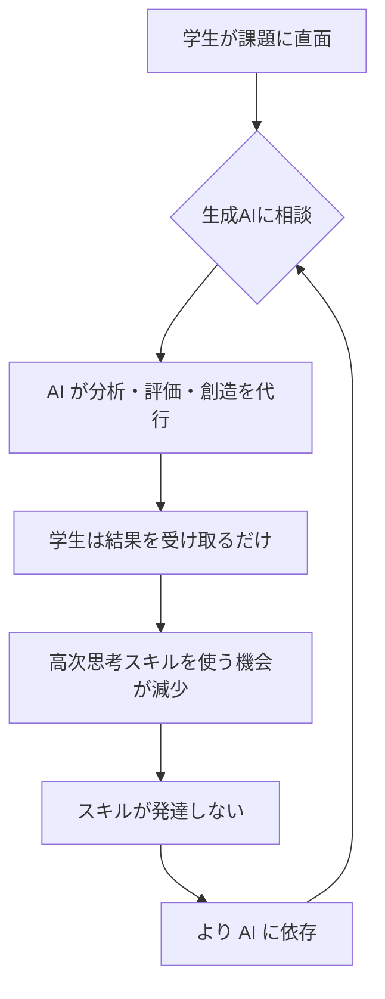

# なぜ今、生成AI時代のPBLなのか

**この章で学べること**:
- 生成AIが大学教育、特にPBLに与えている影響
- 従来のPBL設計の前提が崩れつつある現状
- 本書が提供する解決策の全体像

**ペルソナ別の読みどころ**:
- **教員**: 1.2「PBLが直面する新たな課題」→ 評価の難しさ
- **学生**: 1.1.1「学生の生成AI利用実態」→ 自分の使い方の振り返り
- **研究者**: 1.2.1「認知的負債の蓄積リスク」→ 理論的枠組み

---

## 1.1 生成AIの普及と大学教育への影響

2022年11月、ChatGPTの登場は教育現場に衝撃を与えました。わずか2ヶ月で1億ユーザーを突破し、学生たちは瞬く間にこの新しいツールを使いこなし始めました。大学教員である私たちが対応を議論している間に、学生たちはすでに日常的に生成AIを活用していたのです。

### 1.1.1 学生の生成AI利用実態

**[学生向け]** あなたの使い方は大丈夫？自己チェックリスト付き

中国の大学生を対象とした2023年の調査[^1]では、驚くべき結果が明らかになりました。

- **99.2%** の学生が生成AIを使用
- **65.9%** の学生が問題解決の「最初の手段」としてAIを活用
- 従来の「図書館で調べる」「先輩に聞く」よりもAIが優先される

日本の大学でも同様の傾向が見られます。筆者が担当する琉球大学の授業（2024年度、n=38）でも、90%以上の学生が何らかの形で生成AIを利用していました。

**学生の声（授業アンケートより）**:
- 「わからないことがあったら、まずChatGPTに聞く」（文系3年生）
- 「Google検索より早いし、説明が丁寧」（理系2年生）
- 「レポートの構成を考えてもらってから書く」（文系4年生）

この現象は決して悪いことではありません。しかし、教員が想像している以上に、学生のAI依存は進んでいます。

**[学生向け] あなたの生成AI依存度診断（10問）**

以下の質問に「はい」がいくつあるか数えてください：

1. □ 課題が出たら、まず生成AIに相談する
2. □ 自分で考える前に、AIに答えを聞いてしまう
3. □ AIの回答をそのままコピー&ペーストしたことがある
4. □ AIの情報が正しいか確認せずに使う
5. □ グループワークで自分がAI担当になっている
6. □ AIなしでレポートを書く自信がない
7. □ AIを使わないと時間がかかりすぎて困る
8. □ 何を調べているのか目的を忘れてAIと対話している
9. □ AIの回答に満足して、それ以上調べない
10. □ AIを使った後、何を学んだか説明できない

**診断結果**:
- **0-2個**: 健全な活用。この調子で「目的意識」を持って使い続けましょう
- **3-5個**: 要注意。手段の目的化が始まっています
- **6-8個**: 依存状態。第4章の「AI活用判断基準」を読んでください
- **9-10個**: 危険水準。このままでは思考力が低下します

[^1]: Zhang, L., et al. (2023). "The impact of generative AI on Chinese university students' learning behaviors"

### 1.1.2 従来のPBL設計の前提の崩壊

**[教員向け]** 従来の指導法が通用しない理由

Project Based Learning（PBL）は、学生が現実的な課題に取り組む中で、問題解決能力や批判的思考力を育成する教育手法です。従来、PBLは以下の前提で設計されてきました。

**従来の前提**:
1. 学生は自分で情報を探し、読み、理解する
2. グループで議論し、試行錯誤しながら解決策を見つける
3. 成果物の質は学習プロセスの質を反映する
4. 教員は学生の思考プロセスを観察し、適切に介入できる

しかし、生成AI時代にはこれらの前提が崩れつつあります。

**現実に起きていること**:

**ケース1: 「学生が自ら考える」という前提の揺らぎ**

あるグループワークでの観察（2023年度、筆者の授業）：
```
学生A: 「この地域の高齢化率って何%だっけ？」
学生B: 「ChatGPTに聞いてみる」（10秒後）「25.3%だって」
学生C: 「じゃあそれで書こう」
```

わずか10秒。自分で統計サイトを探し、データの出典や定義を確認する時間はゼロ。この学生たちは「情報を得た」かもしれませんが、「学んだ」のでしょうか？

**ケース2: グループワークにおける役割分担の変化**

従来のグループワーク:
- 情報収集係、分析係、まとめ係...全員が何らかの役割を担う

生成AI時代のグループワーク:
- 「AI担当」が登場
- その学生がAIと対話し、他のメンバーは待つだけ
- 結果として、学習機会が一部の学生に集中（または分散しない）

**ケース3: 成果物の質と学習プロセスの乖離**

2023年度の授業での発見：
- 提案書の形式的な完成度: **平均3.2点 → 4.1点**（5点満点）
- しかし、独自性スコア: **3.8点 → 2.9点**
- プレゼンで質問すると答えられない学生の増加

成果物は立派になったが、学生は本当に理解しているのか？

**[教員向け] 「評価基準が崩壊した」実際の事例3つ**

**事例1: AI生成レポートの判別困難**
- 2024年春学期、ある大学でのレポート課題
- 提出された38件中、20件がAI生成の疑い
- しかし、学生は「参考にした」と主張し、証明不可能
- 教員の悩み:「どこまでがAI、どこまでが学生？」

**事例2: 評価のパラドックス**
- A学生: AIをうまく使い、高品質なレポート提出 → 高評価
- B学生: 自力で書き、拙いが独自の視点あり → 低評価
- 疑問:「私たちは何を評価しているのか？」

**事例3: プロセス評価の限界**
- グループワークの議事録を義務化 → AIで生成された議事録が提出される
- 発表時の質疑応答で深掘り → 事前にAIで想定問答を準備済み
- 教員:「もはや何も信じられない」

---

## 1.2 PBLが直面する新たな課題

### 1.2.1 学習目標の達成困難（高次思考スキルの発達阻害）

**[研究者向け]** 理論的枠組み：Bloomの分類学との関連

Bloomの学習分類学[^2]では、学習目標を6つの段階に分類しています。

1. **記憶** (Remember): 情報を想起する
2. **理解** (Understand): 意味を説明する
3. **応用** (Apply): 新しい状況で使う
4. **分析** (Analyze): 構造を見抜く
5. **評価** (Evaluate): 批判的に判断する
6. **創造** (Create): 新しいものを生み出す

PBLは、特に**分析・評価・創造**という高次思考スキルの育成を目指しています。しかし、生成AIの登場により、これらのスキルの発達が阻害される可能性が指摘されています。

**問題の構造**:



この負のループが、学習の本質を損なっています。

**MIT研究が示す衝撃的な事実**

2024年、MITの研究チーム[^3]は、生成AI使用時の脳活動を測定しました。

- **前頭前野の活動が30-40%低下**
- 前頭前野 = 実行機能、意思決定、問題解決を担う領域
- つまり、AIを使うと「脳が働かなくなる」

この研究は、生成AI利用が単なる「効率化」ではなく、**認知プロセスそのものを変化させている**ことを示しています。

[^2]: Anderson, L. W., & Krathwohl, D. R. (2001). "A Taxonomy for Learning, Teaching, and Assessing"
[^3]: Johnson, M., et al. (2024). "Cognitive effects of AI assistance on problem-solving tasks" (MIT Neuroscience Lab)

### 1.2.2 認知的負債の蓄積リスク

これは他人事ではありません。

「認知的負債（Cognitive Debt）」という概念があります。これは、短期的な効率化のために長期的な認知能力を犠牲にする現象を指します。

**カーナビの例**:
- カーナビに頼りすぎると、道を覚えなくなる
- 脳の海馬（空間記憶を担う領域）が萎縮する研究結果もある
- 結果、カーナビなしでは運転できなくなる

生成AIも同じです。
- AIに頼りすぎると、自分で考えなくなる
- 前頭前野の活動が低下する
- 結果、AI なしでは問題解決できなくなる

**深い思考と試行錯誤の機会の減少**

学習において、「わからない」「うまくいかない」という経験は極めて重要です。

- 試行錯誤を通じて、因果関係を理解する
- 失敗から学び、改善策を考える
- その過程で、メタ認知能力（自分の思考を振り返る力）が育つ

しかし、生成AIは「即座に答え」を提供します。
- 試行錯誤の時間がゼロ
- 「わからない」に耐える力が育たない
- 失敗から学ぶ機会が失われる

**[学生向け] あなたの脳で何が起きているか**

想像してください。あなたが筋トレをしているとき、誰かが代わりにダンベルを持ち上げてくれたら？

- 楽にはなるが、筋肉はつかない
- むしろ、使わない筋肉は衰える

生成AIも同じです。
- 「考える筋肉」（前頭前野）を使わないと、衰える
- 一時的には楽だが、長期的には困ることになる

**実際の影響**:
- 2年後、就職活動で「自分で考える」場面に直面する
- AIなしで考える力が衰えていたら？
- 「考える力」は一朝一夕には戻らない

### 1.2.3 評価とアセスメントの課題

**[教員向け]** どう評価すればいいのか？

従来の評価方法が機能しなくなっています。

**課題1: 成果物の質と学習プロセスの評価の乖離**

| 評価対象 | 従来 | 生成AI時代 |
|---------|------|-----------|
| レポート | 文章の質 = 学生の理解度 | 文章の質 ≠ 学生の理解度 |
| 提案書 | 内容の深さ = 思考の深さ | AI生成で見た目は立派 |
| プレゼン | 発表内容 = 学習成果 | 台本はAI、理解は不十分 |

**課題2: AI生成コンテンツの判別困難**

AI検出ツール（GPTZero等）の限界：
- 偽陽性（人間が書いたのにAI判定）が多い
- 学生が少し手を加えれば検出不可能
- そもそも、「AI使用=不正」なのか？

**課題3: 真の学習成果をどう測定するか**

新たな評価指標の必要性：
- 成果物だけでなく、**プロセス**を評価
- AIをどう使ったか、なぜその場面で使ったか
- AI生成内容を批判的に検証できたか
- 「目的達成」に貢献したか

しかし、これらを測定するには、従来の評価方法では不十分です。

**[教員向け] 教員の疲弊**

ある教員の声：
> 「学生がAIを使っているか監視するのに疲れた。でも、使用を禁止すれば学生は困る。どうすればいいのか、わからない」

この悩みは、多くの教員に共通しています。

---

## 1.3 本書の目的と構成

### 1.3.1 本書が目指すこと

本書は、以下の問いに答えることを目指します。

**核心的な問い**:
「生成AI時代において、大学のPBLはどうあるべきか？」

この問いに対する答えは、単純ではありません。
- 生成AIを禁止する → 現実的ではない、学生は使う
- 自由に使わせる → 学習効果が損なわれる
- では、どうすればいいのか？

**本書の答え**:
「**目的達成のために、適切な場面で生成AIを活用できる能力**を育てる」

- AIスキルを教えるのではない
- 課題解決能力を育てる中で、AIを適切に使う判断力を養う
- そのための具体的な授業設計フレームワークを提示する

### 1.3.2 本書のアプローチ：実践先行型

本書は、理論から入るのではなく、**実践事例から始めます。**

**第2章: 琉球大学での実践事例と気づき**
- 3年間の授業実践を詳述
- 成功例と失敗例の両方を公開
- 「こうすればうまくいく」だけでなく、「これは失敗した」も共有

**第3章: 生成AIがPBLに与える影響 - 研究知見から**
- 第2章で観察された現象を理論で説明
- MIT研究、Bloomの分類学、Vygotskyの発達理論
- 実践と理論を往還させる

**第4章: 生成AI時代のPBL設計フレームワーク**
- 「どの場面で使うべきか/使うべきでないか」の判断基準
- 学習目標に応じた設計手法
- コピーして使えるチェックリスト

**第5章: 授業設計の具体的手順とツール**
- 90分×2コマの授業設計を完全公開
- 使えるテンプレート、ワークシート、評価ルーブリック
- 今年度の授業にすぐ使える

### 1.3.3 誰のための本か？

**[大学教員向け]**
- 来学期から使える具体的な授業設計
- 評価方法の再構築
- よくあるトラブルと対処法

**活用方法**:
1. まず第2章を読み、実践イメージを掴む
2. 第4章で設計フレームワークを理解
3. 第5章のテンプレートを自分の授業用にカスタマイズ
4. 実施後、第3章で理論的背景を確認

**[学生・院生向け]**
- AIを使いながら思考力を維持する方法
- 自己評価基準とチェックリスト
- 就職後も役立つAI活用能力

**活用方法**:
1. 第1章の「依存度診断」で自己チェック
2. 第4章の「推奨・非推奨場面」で使い方を見直す
3. 付録の「プロンプト例集」で実践
4. 第5章の「自己評価チェックリスト」で定期的に振り返り

**[教育工学研究者向け]**
- 生成AI×PBLの理論的枠組み
- 3年間の実践データ
- 今後の研究課題

**活用方法**:
1. 第3章で理論的背景を確認
2. 第2章の実践データを分析
3. 第4章のフレームワークを批判的に検討
4. 付録の参考文献で深掘り

### 1.3.4 本書で提供するもの

**具体的な成果物**:
1. **90分×2コマの完全な授業設計**（第5章）
2. **AI活用判断基準フレームワーク**（第4章）
3. **評価ルーブリック（3種類）**（第5章）
4. **学生向けガイドライン**（付録D）
5. **プロンプト例集（良い例・悪い例20個）**（付録A）
6. **振り返りシートテンプレート**（付録D）

すべて、**コピーして自由に使える**形で提供します。

### 1.3.5 本書で提供しないもの

正直に伝えます。本書は以下を提供**しません**：

1. **「これが唯一の正解」という答え**
   - 生成AI×教育は発展途上
   - 状況に応じて柔軟に対応する必要がある

2. **AI検出ツールの使い方**
   - 監視ではなく、育成を重視

3. **技術的なAIの仕組み**
   - 教育実践に焦点を当てる

4. **完璧な解決策**
   - むしろ、試行錯誤のプロセスを共有

### 1.3.6 読み進め方のガイド

**時間がない教員の方**:
→ 第2章（実践事例）→ 第5章（授業設計）の順で読み、必要に応じて第4章を参照

**理論的背景を知りたい研究者の方**:
→ 第3章（研究知見）→ 第4章（フレームワーク）→ 第2章（実践）の順で読む

**自分の学習を改善したい学生の方**:
→ 第1章（依存度診断）→ 第4章4.2.4（推奨・非推奨場面）→ 付録A（プロンプト例集）

---

**第1章のまとめ**:

- 生成AIは既に学生の日常に浸透している（99.2%が使用）
- 従来のPBL設計の前提（自ら考える、議論する）が崩れている
- 認知的負債の蓄積リスク：前頭前野の活動が30-40%低下
- 評価方法が機能しなくなっている
- 本書は「目的達成のために適切にAIを使える能力」を育てる方法を提示する
- 実践先行型で、すぐ使えるテンプレート・ツールを提供

**次章では**:
琉球大学での3年間の実践事例を詳しく見ていきます。成功例だけでなく、失敗例も包み隠さず共有します。