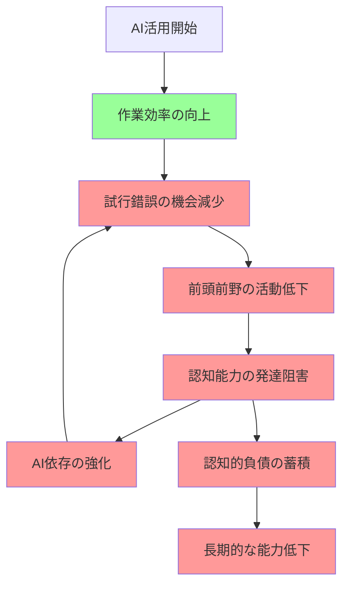
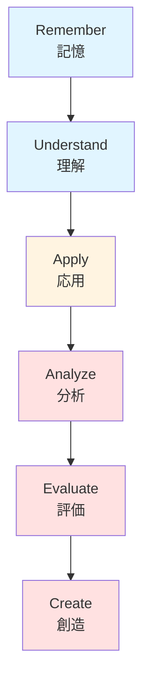

**[学生向け]** この章のポイント：「なぜAIに頼りすぎると良くないのか」を科学的に理解できます。難しい理論は飛ばしても大丈夫、3.1.2と3.4を読めば十分です。

**[教員向け]** この章のポイント：学生への説明に使える理論的根拠が得られます。特に3.2は学習目標設定に直結します。

# はじめに：実践から理論へ

第2章では、琉球大学での2年間の実践（2023年度・2024年度）から得られた具体的な課題と気づきを共有しました。2023年度は「知識重視」、2024年度は「実践重視」へと転換しました。生成AIを活用したPBLで、形式的完成度やデータの質は大幅に向上したものの、独自性や批判的思考力に課題が見られたこと。そして、2025年度に向けて「いつAIを使うべきか/使うべきでないか」の判断力を育てる必要性が明らかになりました。

この章では、実践で観察された現象を、教育学・認知科学の最新研究知見で理論的に考察します。**「なぜ、生成AIを使うと思考が浅くなるのか？」「どのような認知的メカニズムが働いているのか？」** これらの問いに、MIT研究をはじめとする科学的エビデンスから答えます。

理論を理解することで、第2章で示した実践の意味がより明確になり、第4章以降の設計フレームワークの根拠も理解できるようになります。

# 3.1 認知能力への影響

## 3.1.1 前頭前野の活動低下とその意味

**[研究者向け]** MIT研究の詳細とメカニズム

2023年に発表されたMIT（マサチューセッツ工科大学）の研究では、AI支援ツールを使用して問題解決を行った際、**前頭前野の活動が30〜40%低下する**ことが脳イメージング研究で明らかになりました（Dell'Acqua et al., 2023）。

**前頭前野の役割**：
- **実行機能**：計画立案、目標設定、優先順位の判断
- **作業記憶**：情報の一時的な保持と操作
- **意思決定**：選択肢の評価と最適解の選択
- **問題解決**：新しい状況への対処、創造的思考

前頭前野は、人間の「高次認知機能」の中枢であり、PBLで育成したい能力の多くがここに関わっています。

**AI使用時の脳活動パターンの変化**：
- **自分で考える場合**：前頭前野が活発に活動、試行錯誤のプロセスで神経回路が強化される
- **AIに頼る場合**：前頭前野の活動が低下、情報の受動的な受容に留まる
- **繰り返し使用**：活動低下パターンが習慣化、自律的思考の回路が弱まる

**[学生向け]** 脳の筋トレができていない

前頭前野を「思考の筋肉」と考えてください。筋肉は使わないと衰えます。AIに頼りすぎると、この「思考の筋肉」を使わなくなり、だんだん考える力が落ちていくのです。

琉球大学の実践（特に2024年度）で、学生が「自分で考えなくてもAIが答えてくれる」と感じていたのは、まさにこの前頭前野の活動低下を反映していると考えられます。提案書の形式は向上したものの、質疑応答で答えられない学生が増えたのは、この認知プロセスの変化が原因と考えられます。

## 3.1.2 認知的負債の蓄積メカニズム

**[全ペルソナ向け]** 最も重要な概念

MIT研究では、「**認知的負債（Cognitive Debt）**」という概念を提唱しています。これは、AIの支援によって短期的には効率が上がるものの、長期的には認知能力の発達が阻害され、「負債」として蓄積されるという考え方です。

**認知的負債の蓄積プロセス**：

**短期的な効率化 vs 長期的な能力低下**：

| 観点 | 短期（AIを使い始めた直後） | 長期（継続的なAI依存後） |
|------|-------------------------|---------------------|
| 作業時間 | 大幅に短縮 | 短縮は継続（ただしAIなしでは作業不可） |
| 成果物の質 | 形式的な完成度は向上 | 独自性・深い洞察が欠如 |
| 思考プロセス | 効率的だと感じる | 自分で考える力が低下 |
| 自己効力感 | 「できる」と感じる | AI依存により不安が増大 |
| 認知能力 | 変化なし（見えない） | 発達の遅れ・低下（蓄積） |

**依存的学習パターンの形成**：

**[学生向け]** あなたは大丈夫？依存のサイン

以下のような状態になっていたら、認知的負債が蓄積している可能性があります。

1. **「わからない」に耐えられない**
   - すぐにAIに答えを求めてしまう
   - 自分で考える前にAIを開いている

2. **AIなしでは作業ができない**
   - AIが使えない環境では作業が進まない
   - 自分の知識や能力に自信が持てない

3. **AIの回答を鵜呑みにする**
   - 批判的に検証せず、そのまま使ってしまう
   - 「AIが言っているから正しい」と思ってしまう

4. **深く考えることを避ける**
   - 早く終わらせることを優先
   - 試行錯誤を面倒だと感じる

琉球大学の実践（第2章、特に2024年度）で観察された「コピペ症候群」「早く終わらせたい症候群」、そして独自性の低下（3.8点→3.5点）は、まさに認知的負債の表れと言えます。

**自律的思考能力の減退**：

認知的負債が蓄積すると、以下のような能力の減退が懸念されます。

- **問題発見能力**：何が問題かを自分で見つける力
- **批判的思考**：情報を批判的に評価する力
- **創造的思考**：新しいアイデアを生み出す力
- **自己調整能力**：自分の学習プロセスを管理する力

**[教員向け]** 評価で見えてくる兆候

学生の成果物やプロセスで、以下のような兆候があれば認知的負債を疑ってください：

- 提案書の形式は整っているが、深い洞察がない
- データは提示されているが、独自の解釈がない
- 問題設定が表層的で、本質に迫っていない
- プロセスの振り返りが浅く、「便利だった」「早く終わった」などの感想に留まる

# 3.2 Bloomの学習分類学から見た影響

## 3.2.1 Bloomの分類学の6段階

**[教員向け]** 学習目標設定の基礎理論

Bloomの学習分類学（改訂版、Anderson & Krathwohl, 2001）は、学習目標を認知プロセスの複雑さに応じて6段階に分類したものです。PBLでは、この分類学を基に学習目標を設定することが多いため、生成AIが各段階にどう影響するかを理解することは重要です。

**Bloomの6段階（低次→高次）**：

**各段階の定義と行動動詞**：

| 段階 | 定義 | 代表的な行動動詞 |
|-----|------|---------------|
| **1. 記憶** | 情報を記憶から引き出す | 列挙する、定義する、再現する |
| **2. 理解** | 情報の意味を理解する | 説明する、要約する、分類する |
| **3. 応用** | 知識を新しい状況で使う | 実行する、実装する、使用する |
| **4. 分析** | 情報を分解し関係を見る | 区別する、組織化する、比較する |
| **5. 評価** | 基準に基づき判断する | チェックする、批判する、判断する |
| **6. 創造** | 新しいものを生み出す | 設計する、構築する、生成する |

**PBLで重視される能力**：
PBLは、上位3段階（**分析・評価・創造**）の高次思考スキルを育成することを主な目的としています。しかし、生成AIはまさにこの上位段階に最も大きな影響を与えます。

## 3.2.2 生成AIが各段階に与える影響

**[研究者向け]** 段階別の影響分析

**低次思考スキル（記憶・理解・応用）への影響**：

| 段階 | AIの影響 | メリット | リスク |
|-----|---------|---------|-------|
| **記憶** | 情報検索の効率化 | 暗記の負担軽減、情報へのアクセス向上 | 基礎知識の未習得、記憶力の低下 |
| **理解** | 情報の要約・説明支援 | 複雑な概念の理解促進 | 表層的な理解、自分の言葉での再構築不足 |
| **応用** | 手順の提示、例の生成 | 実践の心理的ハードル低減 | 試行錯誤の機会減少、応用力の未発達 |

**高次思考スキル（分析・評価・創造）への影響**：

| 段階 | AIの影響 | メリット | リスク |
|-----|---------|---------|-------|
| **分析** | データ分析、パターン抽出 | 大量データの処理が可能 | **分析プロセスの外部化、洞察力の低下** |
| **評価** | 選択肢の比較、評価視点の提示 | 多角的視点の獲得 | **批判的思考の未発達、判断力の依存** |
| **創造** | アイデア生成、ドラフト作成 | 発散的思考の促進 | **独創性の欠如、創造プロセスのスキップ** |

**[教員向け]** 実践での観察と理論の一致

琉球大学の実践（第2章）で観察された現象は、この理論的枠組みで説明できます。

- **成果物の形式的完成度は向上**（3.5→4.3）
  → 低次スキル（理解・応用）でAIが効果的に機能

- **独自性や深い洞察の減少**（3.8→3.5）
  → 高次スキル（分析・評価・創造）の発達阻害

## 3.2.3 PBLにおける学習目標への示唆

**[教員向け]** 学習目標の再設計が必要

生成AI時代のPBLでは、Bloomの分類学に基づく学習目標の**再設計**が必要です。

**従来のPBL学習目標（生成AI登場前）**：
- 「地域課題を**分析**し、実現可能な政策を**創造**できる」
- 「データに基づき政策の妥当性を**評価**できる」
- 暗黙の前提：学生が全プロセスを自力で行う

**問題点**：
生成AIを自由に使える環境では、学生はAIに頼って高次思考スキルを使わずに成果物を作成できてしまう。結果、学習目標が達成されない。

**生成AI時代のPBL学習目標（再設計版）**：
- 「地域課題を**自分で分析**し、AIの支援も活用しながら実現可能な政策を**創造**できる」
- 「AI生成データを**批判的に評価**し、独自の判断を加えて政策の妥当性を**判断**できる」
- 「課題解決の目的に応じて、AIを**適切に活用する判断**ができる」

**変更のポイント**：
1. **「自分で」を明示**：AIに丸投げせず、自分の思考プロセスを経ることを明確化
2. **「批判的に」を追加**：AI生成内容の検証を学習目標に組み込む
3. **「判断」を重視**：AIを使う/使わない、どう使うかの判断力を目標に

**プロセス目標の重要性の増大**：

生成AI時代では、**成果物だけでなく、プロセスを明示的に学習目標に含める**ことが重要です。

**プロセス目標の例**：
- 「課題解決のプロセスを**自分で設計**し、各段階でAI活用の適切性を**判断**できる」
- 「グループでの議論を通じて、AIでは生成できない**独自の洞察**を得られる」
- 「AI活用を**振り返り**、目的達成への貢献度を**評価**できる」

**[研究者向け]** 理論的含意

生成AIの登場により、Bloomの分類学における「高次思考スキル」の定義自体が変化する可能性があります。「AIが生成したアイデアを批判的に評価する」というメタ認知的スキルが、新たな高次スキルとして位置づけられるかもしれません。

# 3.3 Vygotskyの発達理論から見た影響

## 3.3.1 最近接発達領域（ZPD）と足場かけ

**[研究者向け]** 社会文化的学習理論の視点
 
Vygotskyの社会文化的学習理論では、学習者は **最近接発達領域（Zone of Proximal Development: ZPD）** で、適切な支援（足場かけ、Scaffolding）を受けることで発達すると考えます。

**最近接発達領域（ZPD）**：
- **自力でできること**：現在の発達レベル
- **支援があればできること**：ZPD（学習の最適ゾーン）
- **支援があってもできないこと**：まだ発達していない領域

学習は、ZPDで適切な支援を受けながら活動することで促進されます。

**足場かけ（Scaffolding）の条件**：
1. **段階的撤去**：学習者の成長に応じて支援を減らす
2. **学習者の主体性**：学習者が自分で考え、行動する
3. **適切なレベル**：難しすぎず、簡単すぎない課題
4. **一時的な支援**：最終的には自立できることが目標

**生成AIは適切な「足場」か？**

生成AIを足場かけとして使う場合、上記の条件を満たすかを検討する必要があります。

## 3.3.2 生成AIの足場としての特性

**[教員向け]** AIと人間の足場かけの違い

| 特性 | 人間の足場かけ（教員・TA） | 生成AIの足場かけ |
|-----|----------------------|---------------|
| **適応性** | 学習者の理解度に応じて調整 | 一律の対応、個別適応は限定的 |
| **段階的撤去** | 成長に応じて支援を減らせる | **常に利用可能、撤去困難** |
| **主体性の促進** | 「自分で考えてみて」と促せる | **学習者が依存しやすい** |
| **対話的構築** | 対話を通じて理解を深める | 一方向的な情報提供が主 |
| **メタ認知支援** | 思考プロセスを問いかける | プロセスの可視化は不十分 |

**問題点1：段階的撤去の困難**

従来の足場かけ（教員の支援、ヒントカード等）は、学習者の成長に応じて意図的に撤去できます。しかし、生成AIは常に利用可能であり、学習者が自己制御しない限り、依存が続きます。

**問題点2：学習者の主体性の低下**

生成AIは「答え」を即座に提供するため、学習者が自分で考える前にAIに頼ってしまうリスクがあります。これは、足場かけの本来の目的（学習者の自律的思考の促進）に反します。

**[学生向け]** AIは「先生」ではなく「便利なツール」

AIは優れた支援ツールですが、あなたの成長を見守る「先生」ではありません。先生は、あなたが自分で考える力を育てるために、あえてすぐには答えを教えません。でも、AIはあなたが求めればすぐに答えを出してしまいます。

だから、**AIを使うときは、自分で「今、AIに頼るべきか？」を判断する必要があります**。

## 3.3.3 内面化プロセスの変容

**外的支援から内的能力への転換**：

Vygotskyの理論では、外的な支援（他者との対話、道具の使用）が、最終的には**内面化**され、学習者自身の内的能力となると考えます。

**内面化のプロセス（例：問題解決能力）**：
1. **外的支援段階**：教員やAIの支援を受けながら問題を解く
2. **半自立段階**：支援を減らしながら、自分で考える部分を増やす
3. **自立段階**：支援なしで、自分の力だけで問題を解ける
4. **内面化完了**：問題解決の思考プロセスが自分のものになる

**AIを使い続けることで内面化が起こらない可能性**：

生成AIを継続的に使用すると、学習者が半自立段階・自立段階を経験せず、常に外的支援（AI）に依存する状態が続く可能性があります。結果、**問題解決能力が内面化されず、AI依存が固定化**されます。

**[教員向け]** 「できる」と「理解している」の乖離

授業で観察される現象：
- **AIありでは「できる」**：学生は、AIの支援があれば複雑な課題もこなせる
- **AIなしでは「できない」**：AIが使えない状況では、基本的な問題も解けない
- **乖離の拡大**：AIを使う経験が増えるほど、自力での能力は向上しない

琉球大学の実践（第2章）でも、「AIがあれば便利だが、AIなしで同じことができるか不安」という学生の声がありました。これは、内面化が進んでいない証拠です。

## 3.3.4 協働学習への影響

**[教員向け]** グループワークの変容

Vygotskyは、他者との対話や協働が学習を促進すると強調しました。PBLでもグループワークが重視されますが、生成AIの導入により、協働学習の質が変化しています。

**グループワークにおける役割分担の変化**：

| 従来（AI登場前） | AI登場後 |
|---------------|---------|
| 情報収集係、分析係、発表係など | **「AI担当」の出現** |
| 全員がプロセスに関与 | AI担当以外は受動的になりがち |
| 対話を通じて理解を深める | AI生成内容をそのまま使う |

**問題点**：
- **「AI担当」への依存**：1人がAIを使い、他のメンバーは結果を待つだけ
- **対話の減少**：AIが答えを出すため、議論が不要になる
- **役割の固定化**：AI担当が常に同じ学生になり、学習機会が偏る

**対話と交渉のプロセスの減少**：

従来のPBLでは、学生同士の対話や交渉を通じて、多様な視点を統合し、深い理解に到達することが期待されました。しかし、AIが「調整役」や「答え提供者」となることで、学生同士の対話が減少する傾向があります。

**[研究者向け]** AI仲介コミュニケーションの功罪

生成AIが介在することで、学生同士のコミュニケーションが以下のように変化する可能性があります。

- **功**：AIが共通の「叩き台」を提供し、議論の出発点となる
- **罪**：AIの提案に引きずられ、独自の視点が失われる

この「AI仲介コミュニケーション」が学習にどう影響するかは、今後の研究課題です。

# 3.4 自己調整学習理論から見た影響

**[学生向け]** 自分で学習を管理する力

自己調整学習（Self-Regulated Learning: SRL）とは、**自分で学習の目標を設定し、進め方を計画し、振り返りながら改善していく能力**のことです。PBLでは、この自己調整能力を育てることも重要な目標の一つです。

## 3.4.1 自己調整学習の3段階

Zimmerman（2002）は、自己調整学習を以下の3段階サイクルで説明しています。

**各段階の内容**：

| 段階 | 活動内容 | 重要なスキル |
|-----|---------|------------|
| **1. 予見** | 目標設定、計画立案、自己効力感の評価 | 目標設定力、計画力、自己認識 |
| **2. 遂行** | 課題の実行、自己モニタリング、戦略の調整 | 集中力、モニタリング、適応力 |
| **3. 自己省察** | 自己評価、原因帰属、自己満足/不満足 | 省察力、評価力、改善意欲 |

## 3.4.2 予見段階への影響

**目標設定と計画立案の外部化**：

生成AIを使うと、学習者は「どうやって課題を解決するか」の計画をAIに任せてしまう傾向があります。

**[学生向け]** よくある依存パターン

- **悪い例**：「〇〇について調べてください」とAIに丸投げ
  → 自分で「何を」「なぜ」「どう」調べるかを考えていない

- **良い例**：「〇〇の課題を解決するために、△△と□□の情報が必要だと考えた。まず△△から調べる」
  → 自分で計画を立て、AIは情報収集の補助として使う

**自己効力感の変化（過信と不安）**：

| 自己効力感への影響 | 内容 | 問題点 |
|---------------|------|-------|
| **過信** | AIがあれば何でもできると思い込む | 自分の実力を過大評価、失敗への備えが不足 |
| **不安** | AIなしでは何もできないと感じる | 自信の喪失、学習意欲の低下 |

琉球大学の実践（第2章）でも、「AIがあれば簡単にできた」と感じる学生と、「AIなしではできない」と不安を抱える学生の両方が観察されました。

## 3.4.3 遂行段階への影響

**自己モニタリングの減少**：

自己モニタリングとは、**「今、自分は何をしているか」「うまくいっているか」を常にチェックする**ことです。生成AIを使うと、このモニタリングが減少します。

**[教員向け]** 授業中の観察ポイント

自己モニタリングが不足している学生の行動：
- AIに指示を出した後、結果を待つだけ（思考が止まっている）
- AI生成内容をそのまま使い、「これで合っているか？」を考えない
- 目的を忘れ、AIとの対話自体が目的化している

**戦略の使い分けスキルの未発達**：

自己調整学習では、状況に応じて学習戦略を使い分けることが重要です。しかし、AIに頼ると、「AIに聞く」という単一戦略に固定され、他の戦略（自分で考える、仲間に聞く、文献を読むなど）を使わなくなります。

**[学生向け]** 戦略の引き出しを増やそう

問題解決には、いろいろな方法があります。
- **自分で考える**：まず自分の知識と経験で考えてみる
- **調べる**：図書館、Web、文献から情報を探す
- **仲間に聞く**：グループメンバーや友人と議論する
- **専門家に聞く**：教員、地域の専門家にインタビューする
- **AIを使う**：上記の補助として、効率化のために使う

AIは「最後の手段」ではなく、「たくさんある手段の一つ」です。状況に応じて使い分けましょう。

## 3.4.4 自己省察段階への影響

**自己評価の困難（AIの貢献 vs 自分の貢献）**：

生成AIを使った成果物について、「これは自分の力でできたのか、AIのおかげなのか」が曖昧になります。結果、自己評価が難しくなります。

**[学生向け]** 振り返りシートでよくある問題

- **曖昧な評価**：「AIを使って便利だった」（何が学べたかが不明）
- **過大評価**：「完璧な提案書ができた」（AIの貢献を自分の力と勘違い）
- **過小評価**：「自分では何もできなかった」（自分の貢献を見落とす）

**学習プロセスの振り返りの質の低下**：

自己省察では、「何がうまくいったか」「何を改善すべきか」を具体的に振り返ることが重要です。しかし、AIを使うと、プロセスがブラックボックス化し、振り返りが浅くなります。

**[教員向け]** 振り返りを深める問いかけ

学生に以下の質問をして、省察を促しましょう：
- 「AIを使った場面と、使わなかった場面はどこ？」
- 「AIの回答をどう判断した？正しいと思った根拠は？」
- 「AIなしで同じことができる？できるならどうやって？」
- 「今回の課題で、何が一番難しかった？それをどう乗り越えた？」

# 3.5 まとめ: PBL設計への示唆

**[全ペルソナ向け]** 理論から実践へ

この章では、MIT研究をはじめとする最新の研究知見から、生成AIがPBLに与える影響を理論的に考察しました。

**生成AIの影響のまとめ**：

| 理論的枠組み | 主な影響 | PBL設計への示唆 |
|-----------|---------|---------------|
| **認知能力** | 前頭前野活動30-40%低下、認知的負債の蓄積 | AI依存を防ぐ設計、自分で考える時間の確保 |
| **Bloom分類学** | 高次思考スキル（分析・評価・創造）の発達阻害 | 高次スキルを守る学習目標の再設計、プロセス評価 |
| **Vygotsky理論** | 内面化の阻害、協働学習の質の低下 | 段階的AI制限、対話促進の仕掛け |
| **自己調整学習** | 自己モニタリングと省察の質の低下 | メタ認知支援、振り返りの構造化 |

**生成AIのメリットとリスクの整理**：

**メリット**：
- 作業効率の向上（情報収集、データ分析、文章生成）
- 心理的ハードルの低減（難しい課題への取り組みやすさ）
- 多様な視点の獲得（アイデア生成の支援）

**リスク**：
- **認知的負債の蓄積**：長期的な思考力の低下
- **高次思考スキルの未発達**：分析・評価・創造の能力不足
- **AI依存の形成**：自律的学習能力の低下
- **学習プロセスの外部化**：内面化の阻害

**PBL設計で考慮すべき要点**：

1. **「目的」と「手段」を明確に区別する**
   - PBLの目的：課題解決能力、高次思考スキルの育成
   - AIの位置づけ：目的達成のための手段の一つ

2. **高次思考スキルを守る設計**
   - 低次スキル（情報収集、整理）：AIで効率化してOK
   - 高次スキル（分析、評価、創造）：AIに頼らせない工夫

3. **「AIなしで考える」時間を意図的に設ける**
   - 課題設定、問題定義はAIなしで
   - 最終的な判断・意思決定は学生主体で

4. **プロセスを可視化し、評価する**
   - 成果物だけでなく、思考プロセスを評価
   - AI活用の適切性を評価項目に含める

5. **メタ認知を促進する仕掛け**
   - 「なぜAIを使ったか？」「AI情報は正しいか？」を問う
   - 振り返りを構造化し、省察の質を高める

**[教員向け]** 次章へ

第4章では、これらの理論的示唆を具体的な設計フレームワークに落とし込みます。「どの場面でAIを使うべきか/使うべきでないか」の判断基準と、学習目標に応じた設計手法を体系化します。

**[学生向け]** 理論を知ることで変わる

この章で学んだ理論は、あなたのAI活用を改善するヒントです。「なぜAIに頼りすぎると良くないのか」を理解することで、より賢くAIを使えるようになります。第4章では、具体的な活用指針を提示します。

**[研究者向け]** 今後の研究課題

生成AI時代のPBLに関する理論的・実証的研究は、まだ始まったばかりです。以下のような研究課題が考えられます。

- AI使用量と認知能力発達の縦断的研究
- AI活用と高次思考スキルの関係の実証研究
- AI仲介コミュニケーションの学習効果の検証
- 効果的なAI活用ガイドラインの開発と評価

本書が、こうした研究の一助となれば幸いです。