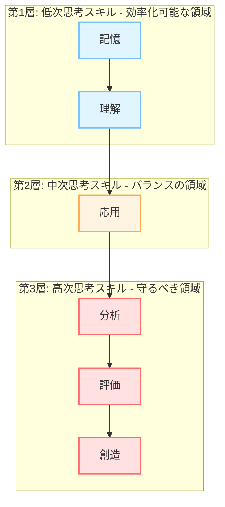
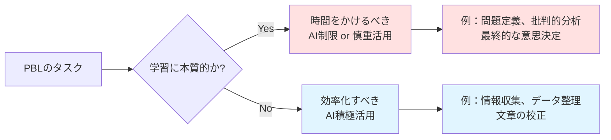
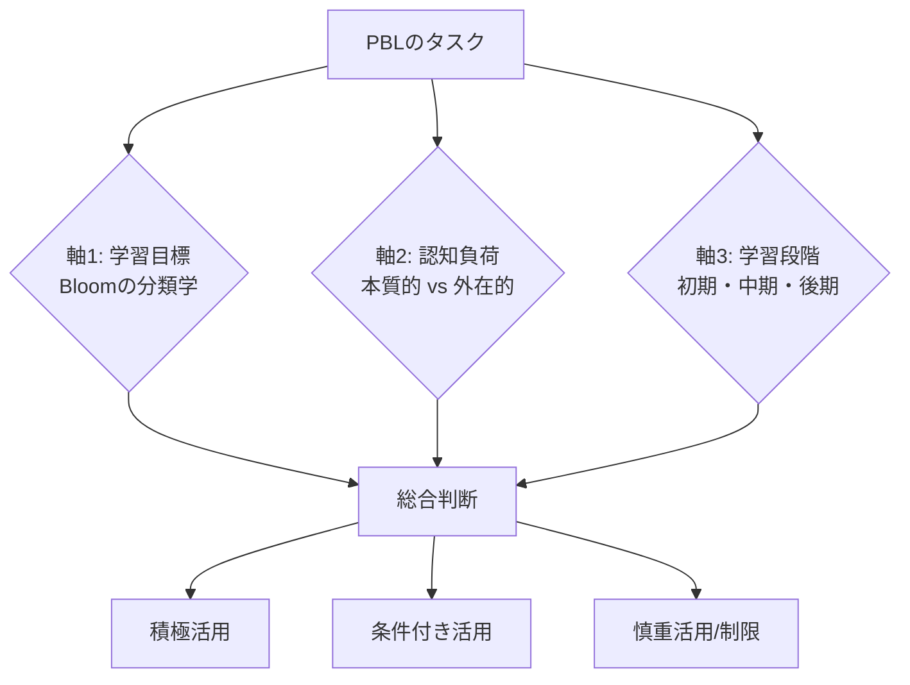
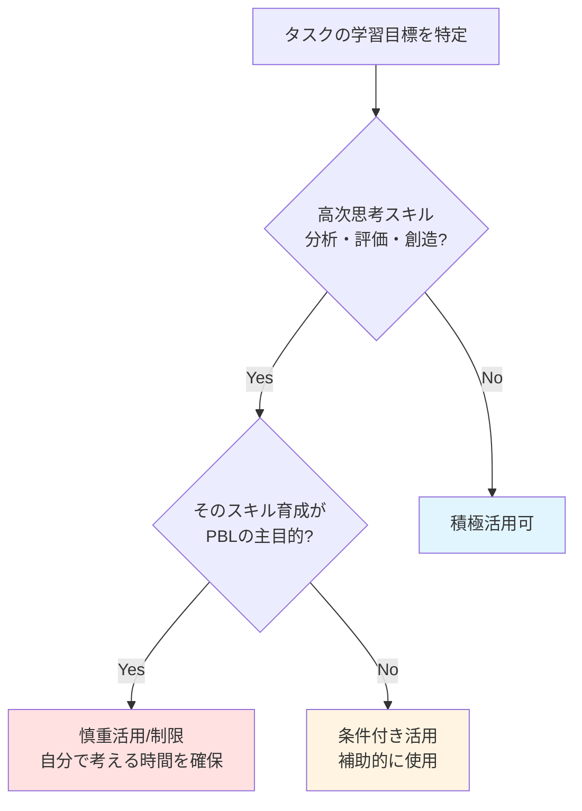
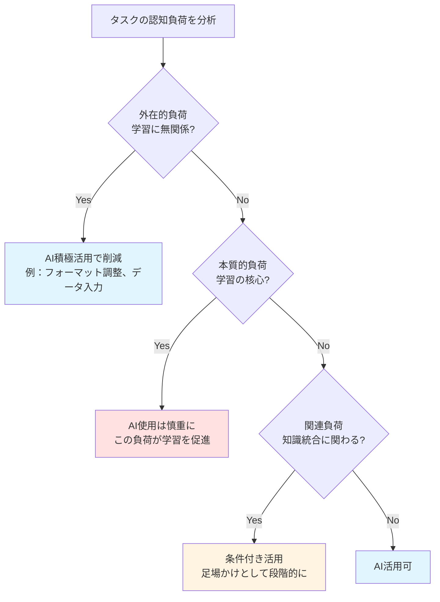
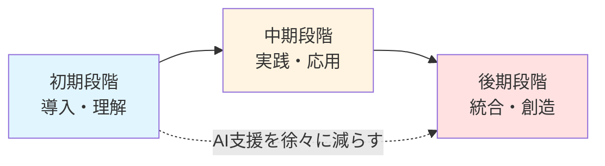
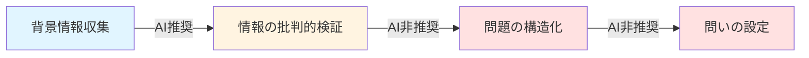
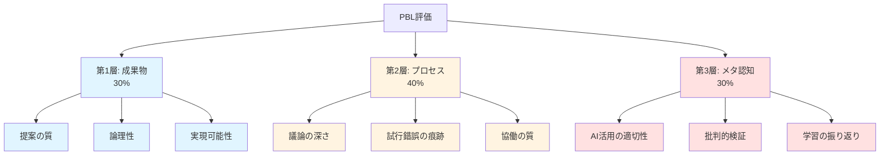

**[教員向け]** この章のポイント：来学期の授業設計に直接使える判断基準とフレームワークを提供します。特に4.2はコピーして使えるチェックリスト付きです。

**[学生向け]** この章のポイント：4.2.4の「推奨・非推奨の具体的場面」を読めば、今日から実践できる改善策が見つかります。

# はじめに：理論と実践を統合する

第2章では琉球大学での2年間の実践（2023年度・2024年度）を、第3章ではその現象を説明する教育理論を見てきました。この章では、それらを統合し、**具体的に使える設計フレームワーク**を提示します。

**この章で答える3つの問い**：

1. **生成AIをどの場面で使うべきか/使うべきでないか？**
   → 4.2で3軸の判断基準を提示

2. **PBLの各段階（問題発見→解決策創出→実装計画）でどう設計すべきか？**
   → 4.3で段階別の具体的指針を提示

3. **どう評価すべきか？教員の役割は何か？**
   → 4.4と4.5で評価設計と教員の役割を提示

# 4.1 PBL設計の基本原則（再定義）

**[研究者向け]** 生成AI時代のPBL理論的枠組み

生成AI時代において、PBL設計の基本原則を再定義する必要があります。従来のPBLの理念（学習者中心、真正な課題、協働学習など）は維持しつつ、生成AIという新しい要素をどう位置づけるかが鍵となります。

## 4.1.1 学習目標の階層化と優先順位

**[教員向け]** 学習目標を3層で考える

生成AI時代のPBLでは、学習目標を**明確に階層化**し、どこを守りどこを効率化するかを判断することが重要です。

**Bloomの分類学に基づく3層構造**：



**各層の設計方針**：

| 層 | 思考スキル | AI活用方針 | 理由 |
|---|----------|----------|------|
| **第3層** | 分析・評価・創造 | **慎重活用 or 制限** | PBLの核心的目標、認知的負債のリスクが高い |
| **第2層** | 応用 | **条件付き活用** | 文脈に応じて判断、足場かけとして機能しうる |
| **第1層** | 記憶・理解 | **積極活用可** | 効率化によって高次思考に時間を使える |

**学習目標設定の実践ステップ**：

**Step 1: 従来の学習目標をBloomの分類学で分類する**

例：地域課題解決PBLの場合
- 「地域課題を分析できる」 → 第3層（分析）
- 「データに基づき提案できる」 → 第3層（創造）＋第2層（応用）
- 「先行事例を理解できる」 → 第1層（理解）

**Step 2: 第3層（高次思考）の目標を具体化し、AI使用時の条件を明記する**

- **曖昧な目標**：「地域課題を分析できる」
- **具体化した目標**：「地域課題を**自分で分析**し、AI生成情報を**批判的に検証**しながら、独自の洞察を導ける」

**Step 3: プロセス目標を追加する**

生成AI時代では、成果物だけでなく**プロセス自体**を学習目標に含めることが重要です。

**プロセス目標の例**：
- 「課題解決のプロセスを自分で設計し、AI活用の適切性を判断できる」
- 「グループでの議論を通じて、AIでは生成できない独自の洞察を得られる」
- 「AI活用を振り返り、自己の学習プロセスを言語化できる」

**[学生向け]** 学習目標を意識しよう

授業の学習目標を読むとき、以下を確認しましょう：
- 何ができるようになることが期待されているか？
- その目標は「AIに任せてもいいこと」か「自分でやるべきこと」か？
- 成果物だけでなく、学習プロセスも評価されるか？

この確認が、AI活用の判断基準になります。

## 4.1.2 「効率化」と「学びの深さ」のバランス

**[全ペルソナ向け]** トレードオフを直視する

第2章で見たように、生成AI活用には**明確なトレードオフ**があります。このトレードオフを認識し、意図的に設計することが重要です。

**トレードオフの構造**：

| 軸 | AI活用で向上するもの | AI活用で低下するリスク |
|---|------------------|---------------------|
| **効率性** | 作業時間の短縮、形式的完成度 | 試行錯誤の機会、深い思考時間 |
| **心理面** | 自己効力感、課題への取り組みやすさ | 「わからない」への耐性、内発的動機 |
| **成果物** | データの質、論理的整合性、見た目 | 独自性、深い洞察、批判的視点 |
| **スキル** | 情報収集力、プロンプト力 | 分析力、問題発見力、創造的思考 |

**設計原則：タスクの性質で判断する**

すべてのタスクを同じように扱うのではなく、**タスクの性質**で判断します。



**効率化すべきタスク（AI積極活用）**：
- **外在的認知負荷**：学習に直接関係ない作業（フォーマット調整、データ入力）
- **情報検索**：背景情報、先行事例、統計データの収集
- **定型作業**：文章の校正、グラフ作成、レポート構造化

**時間をかけるべきタスク（AI制限 or 慎重活用）**：
- **本質的認知負荷**：学習目標達成に必要な思考（問題分析、評価、創造）
- **問題発見**：「何が問題か」を自分で見つける
- **批判的思考**：情報の妥当性を検証する、多角的に評価する
- **意思決定**：複数の選択肢から最適解を選ぶ

**[教員向け]** 設計ワークシート

あなたのPBLで学生が行うタスクを、以下の2×2マトリクスで分類してみましょう：

|  | **高次思考スキル** | **低次思考スキル** |
|---|---------------|---------------|
| **学習に本質的** | AI制限 or 慎重活用<br/>例：問題定義、批判的分析 | 条件付き活用<br/>例：情報の要約、分類 |
| **学習に非本質的** | AI積極活用<br/>例：文章の推敲、校正 | AI積極活用<br/>例：データ入力、フォーマット調整 |

このマトリクスで「AI制限 or 慎重活用」に分類されたタスクが、あなたのPBLで**守るべき学習領域**です。

## 4.1.3 メタ認知支援の重要性

**[研究者向け]** メタ認知的知識とメタ認知的調整

生成AI時代において、学習者の**メタ認知能力**（自分の学習プロセスを意識し、調整する能力）の育成が、これまで以上に重要になります。なぜなら、AIの使用判断は学習者自身のメタ認知的判断に委ねられるからです。

**メタ認知の2側面**：

1. **メタ認知的知識**：「何を知っているか/知らないか」の認識
   - AI使用前：「この問題について自分は何を知っているか？」
   - AI使用後：「AIの回答は正しいか？自分は理解したか？」

2. **メタ認知的調整**：学習プロセスの計画・モニタリング・評価
   - 計画：「どの段階でAIを使うべきか？」
   - モニタリング：「今、自分は考えているか、AIに依存しているか？」
   - 評価：「この学習方法は効果的だったか？」

**PBL設計でのメタ認知支援の組み込み**：

**1. メタ認知プロンプトの埋め込み**

各段階で学生に以下のような問いを投げかけます。

| PBL段階 | メタ認知プロンプト（問いかけ） |
|--------|---------------------------|
| **課題理解** | 「この課題の本質は何だと思いますか？」「自分の既有知識で何がわかりますか？」 |
| **AI使用前** | 「なぜ今、AIを使おうと思いましたか？」「AI なしで考える時間を取りましたか？」 |
| **AI使用後** | 「AIの回答は正しいですか？どうやって確認しましたか？」「この情報源は信頼できますか？」 |
| **振り返り** | 「AIを使った場面と使わなかった場面はどこですか？」「その判断は適切でしたか？」 |

**2. 学習プロセスの可視化**

学生に以下を記録させ、可視化します。
- どの段階でAIを使ったか（タイムスタンプ付きログ）
- なぜその場面でAIを使ったか（理由の記述）
- AIの回答をどう検証したか（検証プロセスの記録）
- 最終的な判断は誰が/どう行ったか

この記録自体が**メタ認知的活動**であり、自己調整学習を促進します。

**3. 振り返りの構造化**

自由記述だけでなく、構造化された振り返りフォーマットを提供します。

**振り返りフォーマット例**：

```markdown
## AI活用の振り返りシート

### 1. AI使用状況
- AI使用した場面：
- AI使用しなかった場面：
- 使用/不使用の判断基準：

### 2. 効果と課題
- AIが役立った点：
- AI依存してしまった点：
- 自分で考える時間は十分取れたか：

### 3. 学習プロセスの評価
- この課題で何を学びましたか？（AIスキル以外）
- AIなしで同じことができますか？
- 次回改善したい点：
```

**[学生向け]** 自分に問いかけよう

AI を使う前に、以下を自問自答してみましょう：

- **使う前**：「自分でまず考えた？」「なぜ今AIを使う？」
- **使った後**：「この回答は本当に正しい？」「自分は理解した？」
- **作業終了後**：「今日、自分の頭で考えた時間はどれくらいあった？」

この問いかけが、AI依存を防ぎ、学びを深めます。

# 4.2 生成AI活用の判断基準フレームワーク

**[全ペルソナ向け]** 本章の核心

「生成AIをどの場面で使うべきか/使うべきでないか」を判断するフレームワークを提示します。これは**3軸モデル**です。

## 4.2.1 3軸判断モデルの全体像

**3つの判断軸**：



**判断の優先順位**：

1. **軸1（学習目標）が最優先**：高次思考スキルを目標とする場合は慎重に
2. **軸2（認知負荷）で調整**：外在的負荷の削減は積極的に
3. **軸3（学習段階）で微調整**：初期は支援、後期は自律を促す

それぞれの軸を詳しく見ていきます。

## 4.2.2 軸1：学習目標軸での判断

**Bloomの分類学による判断基準**：

| 段階 | 思考スキル | AI活用方針 | 具体例 | 理由 |
|-----|----------|----------|--------|------|
| **6. 創造** | 新しいものを生み出す | **慎重活用/制限** | 政策提案の最終形成、独自アイデアの創出 | 創造プロセス自体が学習目標、AI依存で独自性が失われる |
| **5. 評価** | 批判的に判断する | **慎重活用/制限** | 提案の妥当性評価、選択肢の比較判断 | 判断力の育成が目標、AIに任せると未発達 |
| **4. 分析** | 分解し関係を見る | **慎重活用** | 課題の構造分析、因果関係の特定 | 分析プロセスが学習の核心、ただし補助的に活用可 |
| **3. 応用** | 知識を使う | **条件付き活用** | 先行事例の自地域への適用 | 足場かけとして機能しうる、段階的に減らす |
| **2. 理解** | 意味を理解する | **積極活用可** | 専門用語の説明、概念の要約 | 効率化で高次思考に時間を使える |
| **1. 記憶** | 情報を引き出す | **積極活用可** | 統計データの検索、過去事例の収集 | 暗記負担を減らし思考に集中できる |

**判断フローチャート**：



**[教員向け]** 判断の実践例

**例1：地域課題解決PBL**

タスク：「沖縄の路線バス減少問題を分析しなさい」

- 学習目標：**分析**（Bloom第4段階）
- 判断：高次思考スキルであり、PBLの主目的 → **慎重活用**
- 設計：
  - ✅ 背景情報の収集にはAI活用OK（理解レベル）
  - ⚠️ 問題の構造化は学生自身で行う（分析レベル）
  - ❌ 「この問題を分析して」とAIに丸投げは禁止

**例2：提案書作成**

タスク：「政策提案書を作成しなさい」

- 学習目標：**創造**（Bloom第6段階）
- 判断：最高次思考スキル → **慎重活用/制限**
- 設計：
  - ✅ ドラフトの文章校正にAI活用OK（形式的完成度）
  - ⚠️ 提案のアイデア出しはグループ議論優先、AI は補助
  - ❌ 提案書全体をAIに生成させない

## 4.2.3 軸2：認知負荷軸での判断

**[研究者向け]** 認知負荷理論の適用

認知負荷理論（Cognitive Load Theory, Sweller, 1988）では、学習時の認知負荷を3種類に分類します。生成AIは、この3種類の負荷に異なる影響を与えます。

**3種類の認知負荷**：

| 認知負荷の種類 | 定義 | AI活用方針 | 理由 |
|-----------|------|----------|------|
| **本質的負荷**<br/>(Intrinsic Load) | 課題内容そのものの複雑さ、学習に必要な認知負荷 | **削減しない**<br/>適度に保持 | この負荷が学習を促進する。AI で削減すると学習が起こらない |
| **外在的負荷**<br/>(Extraneous Load) | 課題提示方法や環境による不要な負荷 | **AI活用で削減** | 学習に無関係な負荷、削減して本質的負荷に集中させる |
| **関連負荷**<br/>(Germane Load) | スキーマ構築・知識統合に使われる負荷 | **適度に保持**<br/>AI支援は慎重に | この負荷が深い学習を促進する |

**判断基準**：



**具体例で見る認知負荷の分類**：

**PBLタスク：地域の高齢者移動支援策を提案する**

| タスク | 認知負荷の種類 | AI活用判断 |
|--------|-------------|----------|
| 問題の本質を理解する | 本質的負荷 | AI慎重：自分で考える |
| 統計データを収集する | 外在的負荷 | AI積極活用：効率化OK |
| データから傾向を分析する | 本質的負荷 | AI慎重：自分で分析 |
| 他地域の事例を調べる | 外在的負荷 | AI積極活用：情報収集 |
| 自地域への適用を考える | 関連負荷 | AI条件付き：ヒント程度 |
| 提案書のフォーマットを整える | 外在的負荷 | AI積極活用：校正OK |

**[教員向け]** 認知負荷で授業を見直す

あなたの授業で学生が苦労している作業を思い出してください。それは以下のどれですか？

- **本質的負荷**（学習目標に直結）：そのまま残す、AI制限
- **外在的負荷**（学習に無関係な苦労）：AI活用で削減し、本質に集中させる
- **関連負荷**（知識統合）：足場かけとしてAI活用を検討

外在的負荷を減らすことで、学生は本質的な学習に時間を使えるようになります。

## 4.2.4 軸3：学習段階軸での判断

**[全ペルソナ向け]** 段階的にAI依存を減らす

PBLは通常、複数回の授業にわたって進みます。学習の進行に応じて、AI活用方針を**段階的に変化**させることが重要です。

**3段階モデル**：



| 段階 | 学習の焦点 | AI活用方針 | 理由 |
|-----|----------|----------|------|
| **初期段階**<br/>（1〜2週目） | 課題の理解、基礎知識の習得、心理的ハードルの低減 | **積極活用で支援**<br/>心理的ハードル低減 | 学生がPBLに入りやすくする。「できる」感覚が動機を高める |
| **中期段階**<br/>（3〜5週目） | 実践・応用、試行錯誤、グループ議論 | **足場かけとして活用**<br/>徐々に減らす | 自分で考える時間を増やす。AIは補助的に |
| **後期段階**<br/>（6週目以降） | 統合・創造、最終判断、自律的問題解決 | **制限 or 慎重活用**<br/>自律性を促進 | 最終段階では自分の力で判断させる |

**各段階の具体的設計**：

### 初期段階（導入・理解）：AI積極活用

**目的**：
- 課題への心理的ハードルを下げる
- 基礎情報を効率的に収集する
- 「できる」という自己効力感を高める

**AI活用例**：
- ✅ 課題の背景情報をAIで調査
- ✅ 専門用語の説明をAIに尋ねる
- ✅ 先行事例の概要をAIで収集

**教員の役割**：
- AI活用を推奨し、使い方を教える
- 効果的なプロンプトの書き方を指導
- ただし、「AIの回答を鵜呑みにしない」ことも同時に伝える

**[学生向け]** 初期段階の学習戦略

最初は積極的にAIを使ってOKです。ただし：
- AIで調べた情報は、必ず**別の情報源でも確認**する
- AIの説明を読んだら、**自分の言葉で要約**してみる
- グループメンバーとAIで調べた内容を**共有し議論**する

### 中期段階（実践・応用）：足場かけとして活用

**目的**：
- 試行錯誤の機会を確保する
- グループ議論を深める
- AI依存から脱却し始める

**AI活用の変化**：
- ⚠️ いきなりAIに聞かない：まず自分/グループで考える時間（15分程度）を設ける
- ⚠️ AIはヒント程度に：答えを求めるのではなく、視点や方向性を得る
- ⚠️ 複数の情報源を比較：AI + 文献 + 専門家インタビュー

**教員の介入**：
- 「まず自分たちで考えてみて」と促す
- AIに頼る前に、グループ内で議論させる
- AI生成内容の批判的検証を求める

**[学生向け]** 中期段階の学習戦略

この段階では、AIは「最初の選択肢」ではなく「いくつかある手段の一つ」です。
1. **まず自分/グループで考える**（15分）
2. 詰まったらAIを使う（ヒントとして）
3. AIの回答を**批判的に検証**する
4. 最終判断は**自分たち**で行う

### 後期段階（統合・創造）：AI制限 or 慎重活用

**目的**：
- 自律的な問題解決能力を発揮させる
- 独自性のある成果物を創出する
- AI なしでも考えられる自信をつける

**AI活用の制限**：
- ❌ 最終的な政策提案はAI生成禁止
- ❌ 提案の評価・判断はグループで議論
- ✅ 文章の校正・推敲のみAI使用可

**教員の役割**：
- 「AIなしで考えてみて」と明示的に指示する場面を作る
- 独自性・独創性を評価項目に含める
- 学生の自律的判断を尊重する

**[教員向け]** 段階的制限の設計例

| 週 | 段階 | AI活用ルール |
|----|------|-------------|
| 1-2 | 初期 | 自由に活用、効果的な使い方を学ぶ |
| 3-4 | 中期前半 | 「まず15分自分で考える」時間を設定 |
| 5-6 | 中期後半 | グループ議論優先、AIは補助的に |
| 7-8 | 後期 | 最終提案はAI生成禁止、校正のみ可 |

この段階的なアプローチにより、学生は**AI依存から自律**へと移行できます。

## 4.2.5 推奨・非推奨の具体的場面

**[全ペルソナ向け]** 実践で使える判断リスト

3軸モデルを統合し、具体的な場面ごとに「推奨/条件付き/非推奨」を整理します。

### 推奨場面：積極活用してよい

| 場面 | 具体例 | 理由 |
|------|--------|------|
| **情報収集・リサーチ** | 統計データ検索、先行事例の概要調査、背景情報の収集 | 外在的負荷の削減、効率化で本質的思考に時間を使える |
| **データ整理・可視化** | 表の作成、グラフ化、データの分類・整理 | 低次思考スキル、作業効率向上 |
| **アイデア出しの初期段階** | ブレインストーミングの補助、視点の多様化 | 発散的思考の促進、心理的ハードル低減 |
| **文章の校正・推敲** | 誤字脱字チェック、文法チェック、表現の改善提案 | 形式的完成度向上、外在的負荷削減 |
| **専門用語の理解** | 概念の説明、用語の定義確認 | 理解レベル、学習の入り口としての支援 |

**推奨場面でのポイント**：
- ✅ AIで得た情報は必ず別の情報源でも確認
- ✅ AI生成データの正確性を検証
- ✅ AI活用で節約した時間を、高次思考に使う

### 条件付き場面：使い方次第

| 場面 | 条件 | 良い使い方 | 悪い使い方 |
|------|------|----------|----------|
| **先行事例の分析** | まず自分で分析してからAI活用 | 自分の分析後、AIで視点を追加 | いきなりAIに「分析して」と依頼 |
| **解決策のアイデア創出** | グループ議論を優先、AI は補助 | 議論で出たアイデアをAIで拡張 | AIが生成したアイデアをそのまま採用 |
| **データの解釈** | 自分で仮説を立ててから確認 | 自分の解釈をAIで検証 | AI に解釈を丸投げ |
| **提案の評価** | 評価基準を自分で設定してから | 自分の評価にAIの視点を追加 | AI に評価を任せる |

**条件付き場面での鉄則**：
- ⚠️ **「まず自分で」の原則**：AIを使う前に、必ず自分/グループで考える時間（最低15分）を取る
- ⚠️ **AIは補助**：主役は自分の思考、AIは脇役
- ⚠️ **批判的検証**：AI の回答を鵜呑みにせず、必ず検証する

### 非推奨場面：制限または禁止すべき

| 場面 | 理由 | 代替案 |
|------|------|--------|
| **問題定義・課題設定** | PBLの核心、問題発見力の育成が目標 | グループ議論、教員との対話、フィールドワーク |
| **批判的分析** | 批判的思考力の育成が目標、AIは批判力を持たない | 複数の情報源を比較、多角的視点からの議論 |
| **最終的な意思決定** | 判断力の育成が目標、責任の所在が曖昧になる | グループでの合意形成、根拠に基づく議論 |
| **独創的なアイデア創出** | 創造性の育成が目標、AI は既存の組み合わせしか作れない | ブレインストーミング、アナロジー思考、フィールドからの着想 |
| **学習の振り返り** | メタ認知能力の育成が目標 | 自己省察、ピアフィードバック、教員との対話 |

**非推奨場面でのルール**：
- ❌ この場面ではAI使用を明示的に制限する
- ✅ なぜAI使用を制限するかを学生に説明する
- ✅ AI以外の方法（議論、調査、専門家相談など）を提示する

**[学生向け]** 簡単チェックリスト

AI を使う前に、このチェックリストで確認しましょう：

```markdown
□ まず自分/グループで考えた？（最低15分）
□ この場面でAIを使うことは学習目標に合っている？
□ AI に「答え」を求めるのではなく「ヒント」として使う？
□ AI の回答を批判的に検証する予定がある？
□ AI活用を振り返りで説明できる？

→ 全部チェックできたらAI使用OK
→ 1つでもNoがあったら、AI使用は待って！
```

**[教員向け]** 授業でのルール提示例

学生に以下のようなルールを提示すると効果的です。

**「AI活用の信号ルール」**

- 🟢 **緑信号（推奨）**: 情報収集、データ整理、文章校正 → 自由に使ってOK
- 🟡 **黄信号（条件付き）**: 分析、評価、アイデア創出 → まず自分で考えてから
- 🔴 **赤信号（非推奨）**: 問題定義、最終判断、振り返り → AI使用制限

このルールを授業資料に明記し、各タスクで「これは何色の信号？」と問いかけることで、学生の判断力を育てられます。

# 4.3 PBLの段階別設計指針

**[教員向け]** 各段階での具体的設計

PBLは通常、「問題発見 → 解決策創出 → 実装計画」という段階を経ます。各段階で何を学ばせるか、AIをどう活用するかを具体的に設計します。

## 4.3.1 問題発見段階

**学習目標**：
- 課題の本質を見抜く力
- 問いを立てる力
- 情報を批判的に読み解く力

### AI活用方針



| サブ段階 | AI活用 | 具体的な活動 |
|---------|--------|-------------|
| **背景情報収集** | 🟢 推奨 | AIで統計データ、先行研究、地域の現状を調査 |
| **情報の批判的検証** | 🟡 条件付き | AI情報の信頼性を複数情報源で確認 |
| **問題の構造化** | 🔴 非推奨 | グループ議論で「何が本当の問題か」を特定 |
| **問いの設定** | 🔴 非推奨 | 自分たちで「解くべき問い」を言語化 |

### 教員の介入ポイント

**介入1：問いの質を問う**

学生が立てた問いに対して、以下を問いかけます。

- 「なぜその問題が重要なのですか？」
- 「その問いは、課題の本質を捉えていますか？」
- 「AI に問題定義を任せていませんか？自分たちの言葉で語れますか？」

**介入2：批判的検証を促す**

AI で調べた情報に対して：

- 「その統計データの出典は信頼できますか？」
- 「AIの回答は一面的ではありませんか？他の視点は？」
- 「現場の人（ステークホルダー）はどう思っているでしょうか？」

**介入3：深掘りの対話**

学生の浅い問題設定に対して：

- 「それは『表面的な現象』ですね。『根本的な原因』は何だと思いますか？」
- 「なぜ？を3回繰り返してみましょう」（トヨタ式5Why分析）

### 具体的な授業設計例

**90分授業の構成**：

| 時間 | 活動 | AI活用 |
|------|------|--------|
| 0-15分 | 課題提示、背景説明（教員） | なし |
| 15-45分 | 【個人 + AI】背景情報収集 | 🟢 推奨 |
| 45-75分 | 【グループ議論】問題の特定と構造化 | 🔴 AI不使用 |
| 75-90分 | 【全体共有】各グループの問い設定発表 + 教員コメント | なし |

**ポイント**：
- AI使用は情報収集のみに限定
- 最も重要な「問題の特定」はグループ議論で行う
- 教員が各グループを巡回し、問いの質を高める対話を行う

**[学生向け]** この段階で大切なこと

**❌ 悪い例**：
```
学生：「AIさん、沖縄の路線バス問題について教えて」
AI：「高齢化、運転手不足、収益悪化が問題です」
学生：「じゃあこれが問題だね」（そのまま採用）
```

**✅ 良い例**：
```
学生：まず自分たちで「なぜバスが減っているか」を考えてみよう
→ グループ議論（30分）
→ 「運転手不足が一番の問題では？」という仮説
→ AIで情報収集して確認
→ 「AIは収益悪化と言っているけど、現場の声も聞いてみよう」
→ 地域のバス会社にインタビュー依頼
→ 最終的な問い：「なぜ沖縄でバス運転手が不足しているのか？」
```

良い例では、**AI は情報源の一つ**であり、**最終的な問い設定は学生自身**が行っています。

## 4.3.2 解決策創出段階

**学習目標**：
- 創造的思考
- 実現可能性の評価
- 多角的視点の獲得

### AI活用方針

| サブ段階 | AI活用 | 具体的な活動 |
|---------|--------|-------------|
| **アイデア発散** | 🟡 条件付き | まずグループでブレスト、その後AIで視点追加 |
| **先行事例調査** | 🟢 推奨 | 他地域・他国の事例をAIで効率的に収集 |
| **実現可能性評価** | 🟡 条件付き | 評価基準は自分で設定、AIでリスク分析補助 |
| **解決策の選択** | 🔴 非推奨 | グループ議論で合意形成、最終判断は学生 |

### 教員の介入ポイント

**介入1：独自性を問う**

- 「このアイデアは、AIが生成したものをそのまま使っていませんか？」
- 「あなたたちの地域ならではの工夫は何ですか？」
- 「AIが提案しない、あなたたちだけのアイデアは？」

**介入2：実現可能性の検証プロセスを支援**

- 「誰に聞けば実現可能性がわかりますか？」（ステークホルダーの特定）
- 「必要な資源（予算、人、時間）をリストアップしましたか？」
- 「実現を阻む障壁は何ですか？どう乗り越えますか？」

**介入3：グループ内の対話を促進**

- 意見が対立している場合：「両方の視点の良い点は何ですか？統合できませんか？」
- 全員が沈黙している場合：「それぞれ1つずつアイデアを出してみましょう」
- 1人が主導している場合：「他のメンバーはどう思いますか？」

### 具体的な授業設計例

**90分×2コマの構成**：

**1コマ目：アイデア創出**

| 時間 | 活動 | AI活用 |
|------|------|--------|
| 0-30分 | 【グループ】ブレインストーミング（AI なし） | 🔴 不使用 |
| 30-60分 | 【グループ + AI】AI で視点追加、先行事例調査 | 🟡 補助的に |
| 60-75分 | 【グループ】アイデアの絞り込み（5つ→3つ） | 🔴 不使用 |
| 75-90分 | 【全体共有】各グループのアイデア発表 | なし |

**2コマ目：実現可能性評価**

| 時間 | 活動 | AI活用 |
|------|------|--------|
| 0-15分 | 教員から評価視点の提示（費用、効果、実現性） | なし |
| 15-60分 | 【グループ + AI】各アイデアの評価、リスク分析 | 🟡 補助的に |
| 60-80分 | 【グループ】最終的な解決策の選択と根拠の議論 | 🔴 不使用 |
| 80-90分 | 【全体共有】選択した解決策とその理由発表 | なし |

**[学生向け]** アイデア創出の戦略

**ステップ1：まず自分たちで発散（30分）**
- 思いついたアイデアを全部出す（批判禁止）
- 「できるかどうか」は後で考える
- 最低20個は出してみよう

**ステップ2：AIで視点追加**
- 自分たちのアイデアをAIに見せて「他に考えられる視点は？」と聞く
- AI の提案を**そのまま採用しない**、自分たちの文脈に合うようアレンジする

**ステップ3：評価して絞り込む（AI不使用）**
- 評価基準を自分たちで設定（例：効果、実現性、独自性）
- グループで議論して3つに絞る

## 4.3.3 実装計画段階

**学習目標**：
- 論理的思考
- 計画立案能力
- ステークホルダーの視点理解

### AI活用方針

| サブ段階 | AI活用 | 具体的な活動 |
|---------|--------|-------------|
| **計画書ドラフト作成** | 🟢 推奨 | AIで構造化、論理チェック、文章推敲 |
| **リスク分析** | 🟡 条件付き | AI でリスク候補を列挙、優先順位は自分で判断 |
| **ステークホルダー分析** | 🟡 条件付き | AIで視点を得る、実際のインタビューも実施 |
| **最終判断と優先順位** | 🔴 非推奨 | グループ議論で決定、根拠を明確化 |

### 教員の介入ポイント

**介入1：論理性と整合性を問う**

- 「この計画は、あなたたちが設定した問いに答えていますか？」
- 「提案の根拠（エビデンス）は十分ですか？」
- 「計画に矛盾や飛躍はありませんか？」

**介入2：見落としている視点を指摘**

- 「〇〇のステークホルダーはどう思うでしょうか？」
- 「長期的な影響も考えましたか？」
- 「失敗した場合のプランBは？」

**介入3：プレゼンテーション準備の支援**

- 「誰に向けて発表しますか？その人が知りたいことは何ですか？」
- 「最も伝えたいメッセージを1文で言うと？」
- 「データやグラフは効果的に使えていますか？」

### 具体的な授業設計例

**90分×2コマの構成**：

**1コマ目：計画書作成**

| 時間 | 活動 | AI活用 |
|------|------|--------|
| 0-15分 | 教員から計画書の構成要素を提示 | なし |
| 15-75分 | 【グループ + AI】計画書ドラフト作成、AI で推敲 | 🟢 積極活用 |
| 75-90分 | 【ピアレビュー】他グループの計画書を読み、フィードバック | なし |

**2コマ目：最終調整とプレゼン準備**

| 時間 | 活動 | AI活用 |
|------|------|--------|
| 0-30分 | 【グループ】ピアレビューを基に修正 | 🟡 補助的に |
| 30-60分 | 【グループ + AI】プレゼン資料作成 | 🟢 積極活用（デザイン、グラフ作成） |
| 60-90分 | 【グループ】プレゼン練習 | なし |

**[教員向け]** この段階での評価ポイント

計画書とプレゼンで以下を評価します。

- **論理性**：問い→分析→提案の一貫性
- **実現可能性**：具体的なステップ、必要資源の特定
- **独自性**：AI生成では出てこない地域固有の視点
- **批判的思考**：リスクや反論への対応
- **プロセスの説明**：どのようにこの提案に至ったか（AI活用含む）

**[学生向け]** 提案書の質を高めるチェックリスト

```markdown
□ 問い設定から提案まで、論理的につながっているか？
□ 提案の根拠（データ、事例）は十分か？
□ 実現に必要な資源（予算、人、期間）を明記しているか？
□ リスクと対策を考えているか？
□ ステークホルダー（関係者）の視点を含んでいるか？
□ AI生成内容をそのまま使っていないか？独自性はあるか？
□ 他の人が読んでも理解できる文章か？
```

# 4.4 評価とアセスメントの設計

**[全ペルソナ向け]** 何を、どう評価するか

生成AI時代のPBL評価では、**成果物だけでなくプロセスを重視**し、**AI活用自体も評価の対象**とすることが重要です。

## 4.4.1 評価の多層化

**3層の評価モデル**：



**配点の考え方**：

| 評価層 | 配点 | 評価内容 | 評価方法 |
|--------|------|---------|---------|
| **成果物**<br/>（30%） | 30点 | 提案書の質、論理性、実現可能性、独自性 | ルーブリック評価 |
| **プロセス**<br/>（40%） | 40点 | 議論の深さ、試行錯誤、情報収集の幅、協働の質 | 議事録、学習ログ、観察 |
| **メタ認知**<br/>（30%） | 30点 | AI活用の適切性、批判的検証、学習の振り返り | 振り返りシート、ポートフォリオ |

**なぜプロセスを最も重視するか**：

第2章で見たように、生成AI活用で**成果物の質と学習の質が乖離**します。成果物だけを評価すると、AI依存の学生が高得点になってしまう可能性があります。プロセス評価を重視することで、**本当に学習した学生**を正当に評価できます。

## 4.4.2 ルーブリックの設計

**[教員向け]** AI時代のルーブリック

従来のルーブリックに、**AI活用に関する評価項目**を明示的に追加します。

### 成果物評価ルーブリック（30点）

| 評価項目 | 優秀（8-10点） | 良好（5-7点） | 要改善（0-4点） |
|---------|--------------|-------------|--------------|
| **独自性・独創性** | AI生成では出てこない独自の視点や提案がある。地域固有の文脈を深く理解している | 一部に独自の視点があるが、AI生成内容に依存している部分も多い | AI生成内容をほぼそのまま使用、独自性がほとんどない |
| **論理性・整合性** | 問い設定から提案まで一貫性があり、論理的飛躍がない。根拠が明確 | 概ね論理的だが、一部に飛躍や矛盾がある | 論理的整合性が欠如、根拠が不十分 |
| **実現可能性** | 具体的なステップ、必要資源、リスク対策が明確。ステークホルダーの視点を含む | 実現に向けた検討はあるが、具体性に欠ける部分がある | 実現可能性の検討が不十分、現実的でない |

### プロセス評価ルーブリック（40点）

| 評価項目 | 優秀（13-15点） | 良好（8-12点） | 要改善（0-7点） |
|---------|---------------|--------------|---------------|
| **議論の深さ** | グループで深い議論を重ね、多様な視点を統合している。対立を建設的に解決している | 議論はあるが表層的、または一部メンバーのみが主導している | 議論が不十分、AIに依存して議論を省略している |
| **試行錯誤の痕跡** | 複数の案を検討し、失敗から学び、改善を重ねている。プロセスが可視化されている | 試行錯誤はあるが限定的、または記録が不十分 | 最初のアイデアをそのまま採用、試行錯誤がほとんどない |
| **情報収集の幅** | AI以外の情報源（文献、インタビュー、フィールドワーク）も活用している | AIが主な情報源だが、一部他の方法も使用 | AIのみに依存、他の情報収集方法を使っていない |

### メタ認知評価ルーブリック（30点）

| 評価項目 | 優秀（8-10点） | 良好（5-7点） | 要改善（0-4点） |
|---------|--------------|-------------|--------------|
| **AI活用の適切性** | 場面に応じてAI使用を判断し、高次思考では自分で考えている。使用理由を説明できる | AI活用はあるが、判断が不適切な場面も見られる | AIに過度に依存、または盲目的に使用している |
| **批判的検証** | AI生成情報を複数の情報源で検証し、批判的に評価している | 検証はあるが表層的、または一部のみ検証 | AI情報を鵜呑みにしている、検証をしていない |
| **学習の振り返り** | 具体的で深い振り返り。AI活用の効果と課題を分析し、改善策を提示している | 振り返りはあるが表層的、「便利だった」などの感想レベル | 振り返りが不十分、またはAI活用に言及していない |

**[教員向け]** ルーブリック使用のポイント

- ✅ 授業開始時にルーブリックを学生に提示する（評価基準の透明化）
- ✅ 中間評価でルーブリックを使い、フィードバックを行う
- ✅ 学生にも自己評価・ピア評価でルーブリックを使わせる

## 4.4.3 形成的評価の重要性

**[全ペルソナ向け]** 途中でのフィードバックが鍵

PBLは長期にわたるため、**最終評価だけでなく、途中でのフィードバック（形成的評価）**が学習を大きく左右します。

**形成的評価の3つの手法**：

### 1. 中間フィードバック（教員から）

**タイミング**：PBL中間地点（問題発見段階終了後、解決策創出段階終了後）

**フィードバック内容**：
- 問いの質：「問いは課題の本質を捉えていますか？」
- プロセスの観察：「グループ議論は深まっていますか？」
- AI活用状況：「AI依存が見られる場合は警告」

**フィードバック形式**：
- 各グループ5分程度の面談
- または、書面でのコメント返却
- ルーブリックを使った暫定評価

### 2. ピアレビュー（学生同士）

**タイミング**：計画書ドラフト完成後

**レビュー観点**：
- 論理性：「提案の流れは分かりやすいか？」
- 独自性：「このグループならではの視点があるか？」
- 実現可能性：「実現できそうか？足りない情報は？」

**レビュー形式**：
- 他グループの計画書を読み、Google Formなどでフィードバック
- または、グループ間で直接議論（15分程度）

**効果**：
- 他者の視点を得ることで、自グループの弱点に気づく
- 批判的思考力の育成
- 学生同士の学び合い

### 3. 自己評価とメタ認知プロンプト

**タイミング**：各段階終了後、最終発表後

**自己評価項目**：
- 学習目標の達成度
- AI活用の適切性
- グループでの貢献度
- 次回への改善点

**メタ認知プロンプトの例**：

```markdown
## 自己評価シート（各段階終了後に記入）

### 1. 今日の学習活動
- 何をしましたか？
- どのような判断をしましたか？

### 2. AI活用の振り返り
- どの場面でAIを使いましたか？
- なぜその場面で使いましたか？
- AI情報をどう検証しましたか？

### 3. 学びと気づき
- 今日の活動で何を学びましたか？
- うまくいった点、うまくいかなかった点は？
- 次回改善したいことは？

### 4. 自己評価（5段階）
- 自分で考える時間は十分取れた： 1 - 2 - 3 - 4 - 5
- AI依存せず、批判的に活用できた： 1 - 2 - 3 - 4 - 5
- グループに貢献できた： 1 - 2 - 3 - 4 - 5
```

**[学生向け]** 自己評価で成長する

自己評価シートは「めんどくさい」と思うかもしれませんが、実は**あなたの学びを最も促進するツール**です。

書くことで：
- 自分の学習プロセスを客観的に見られる
- AI依存に気づける
- 次回の改善点が明確になる

丁寧に書くほど、あなたの学びは深まります。

# 4.5 教員の役割とファシリテーション

**[教員向け]** 生成AI時代の教員は何をすべきか

生成AIの登場により、教員の役割は**知識提供者**から**メタ認知支援者**へとシフトしています。

## 4.5.1 メタ認知支援者としての教員

**従来の教員の役割**：
- 知識を教える
- 正解を示す
- 作業の進め方を指示する

**生成AI時代の教員の役割**：
- 学生の思考プロセスを可視化させる
- 批判的思考を促す問いかけをする
- AI活用の適切性を振り返らせる

### 「どう使ったか」「なぜそう使ったか」を問う

**場面1：授業中の巡回時**

❌ 従来の問いかけ：「進んでいますか？」「困っていることは？」

✅ AI時代の問いかけ：
- 「今、AIを使っていましたね。なぜこの場面で使おうと思いましたか？」
- 「AIを使う前に、自分たちで考える時間は取りましたか？」
- 「AIの回答を見て、どう思いましたか？信頼できますか？」

**場面2：中間フィードバック時**

❌ 従来の問いかけ：「良い提案ですね」「もっとデータを集めて」

✅ AI時代の問いかけ：
- 「この提案は、AIが生成したものですか？それともあなたたちのオリジナルですか？」
- 「AIを使った部分と、使わなかった部分を説明してください」
- 「AIに頼らずにこの提案ができますか？」

### AI生成内容の妥当性を検証させる

学生がAI生成情報を提示したとき、教員が以下を問いかけます。

**批判的検証の問いかけ**：
- 「その情報の出典は何ですか？信頼できる情報源ですか？」
- 「AIは常に正しいとは限りません。他の情報源でも確認しましたか？」
- 「このデータは最新ですか？いつのデータですか？」
- 「AIの回答には、どんなバイアスや限界があると思いますか？」

この問いかけにより、学生は**AIを鵜呑みにしない態度**を身につけます。

### 学習プロセスの言語化を促す

学生に以下を言語化させます。

- **意思決定のプロセス**：「なぜこの解決策を選んだのですか？」
- **AI活用の判断**：「なぜここでAIを使ったのですか？使わない選択肢もありましたよね？」
- **失敗と学び**：「うまくいかなかったことは何ですか？そこから何を学びましたか？」

言語化することで、学生のメタ認知能力が向上し、自己調整学習が促進されます。

## 4.5.2 プロンプトエンジニアリングの指導

**[教員向け]** 効果的なAI活用スキルも教える

生成AIを適切に活用するには、**効果的なプロンプト**を書く技術が必要です。教員は、このスキルも指導します。

### 効果的なプロンプトの3要素

| 要素 | 悪い例 | 良い例 |
|------|--------|--------|
| **1. 具体性** | 「沖縄のバスについて教えて」 | 「沖縄県の路線バス事業者の経営状況について、2020年以降の収支データと運転手数の推移を教えてください」 |
| **2. 文脈提供** | 「高齢者の移動支援策を提案して」 | 「沖縄県の過疎地域で、路線バスが廃止された地区の高齢者（車を運転できない）の移動支援策を、予算500万円以内で提案してください」 |
| **3. 反復的精緻化** | （1回で終わる） | AI回答を見て：「その中でも、特に費用対効果が高い施策はどれですか？その根拠も教えてください」 |

### 授業でのプロンプト指導

**導入授業（90分）で以下を教える**：

| 時間 | 内容 | 活動 |
|------|------|------|
| 0-15分 | 良いプロンプトの3要素を説明 | 教員による講義 |
| 15-30分 | 悪い例 vs 良い例を比較 | 実際にAIに質問して結果を比較 |
| 30-60分 | 実践：課題に対して効果的プロンプトを書く | 個人ワーク + ピア確認 |
| 60-90分 | 共有：効果的だったプロンプトを発表 | 全体共有 + 教員コメント |

### 反復的対話による精緻化

学生に以下を教えます。

**❌ 悪い使い方**：
```
学生：「沖縄の路線バス問題について教えて」
AI：（一般的な回答）
学生：「わかった」（そのまま使う）
```

**✅ 良い使い方**：
```
学生：「沖縄県の路線バス利用者数の推移を教えて」
AI：（回答）
学生：「その減少の原因として考えられることは？」
AI：（回答）
学生：「その中で、特に過疎地域に特有の原因は？」
AI：（より具体的な回答）
学生：「なるほど、この情報の出典は？」
AI：（出典提示）
学生：「その出典を確認してみよう」（批判的検証）
```

良い使い方では、**反復的な対話**で情報を精緻化し、最後に**批判的に検証**しています。

## 4.5.3 批判的思考の促進

**[全ペルソナ向け]** AI時代に最も重要なスキル

生成AIが普及した今、**批判的思考**（情報を鵜呑みにせず、多角的に評価する能力）がこれまで以上に重要です。

### AIの限界を理解させる

教員は、授業の中でAIの限界を明示的に教えます。

**AIができないこと**：
- ✗ 最新情報（学習データの時点まで）
- ✗ 出典の正確性（時々間違える、ハルシネーション）
- ✗ 地域固有の文脈理解（一般的な回答に偏る）
- ✗ 価値判断（倫理的・政治的な判断はできない）
- ✗ 創造性（既存情報の組み合わせのみ）

### 情報源の確認と検証

学生にAI情報の検証方法を教えます。

**3つの検証方法**：

1. **出典確認**：
   - AIが提示した情報の出典を尋ねる
   - その出典が信頼できるかを確認（政府統計、学術論文、信頼できるメディア等）

2. **クロスチェック**：
   - 同じ情報を他の情報源でも確認
   - AI + 文献 + 専門家インタビュー

3. **現場確認**：
   - 可能であれば、現場（フィールドワーク）で確認
   - ステークホルダーへのインタビュー

### 複数の視点からの検討

教員は、学生に多角的思考を促します。

**問いかけ例**：
- 「AIはこう言っていますが、反対の立場の人はどう考えるでしょうか？」
- 「この提案で不利益を受ける人はいませんか？」
- 「短期的にはメリットがありますが、長期的にはどうでしょうか？」
- 「他の地域ではうまくいっても、あなたたちの地域ではどうですか？」

**[学生向け]** 批判的思考のチェックリスト

AI情報を使う前に、以下を確認しましょう：

```markdown
□ この情報の出典は信頼できるか？
□ 最新の情報か？古くないか？
□ 他の情報源でも確認したか？
□ 反対の視点も検討したか？
□ 自分の地域の文脈に合っているか？
□ 誰の利益になり、誰が不利益を受けるか考えたか？
```

# まとめ：フレームワークを実践に活かす

**[全ペルソナ向け]** この章の要点

この章では、生成AI時代のPBL設計フレームワークを提示しました。

**4つの柱**：

1. **基本原則（4.1）**：
   - 学習目標の階層化（高次思考スキルを守る）
   - 効率化と学びの深さのバランス
   - メタ認知支援の組み込み

2. **判断基準（4.2）**：
   - 3軸モデル（学習目標・認知負荷・学習段階）
   - 推奨/条件付き/非推奨の具体的場面
   - 段階的にAI依存を減らす設計

3. **段階別設計（4.3）**：
   - 問題発見：AIは情報収集のみ、問い設定は学生
   - 解決策創出：グループ議論優先、AIは補助
   - 実装計画：計画書はAI活用、最終判断は学生

4. **評価と教員の役割（4.4, 4.5）**：
   - プロセス重視の多層評価
   - AI活用を評価項目に含める
   - 教員はメタ認知支援者へ

**次章へ**：

第5章では、このフレームワークを実際の授業に落とし込むための**具体的な手順とツール**（テンプレート、ワークシート、チェックリスト）を提供します。

**[教員向け]** すぐに使えるアクションステップ

今日からできること：

1. ✅ あなたの授業の学習目標をBloomの分類学で整理する（4.1.1参照）
2. ✅ 学生に「AI活用の信号ルール」（🟢🟡🔴）を提示する（4.2.5参照）
3. ✅ ルーブリックに「AI活用の適切性」を評価項目として追加する（4.4.2参照）
4. ✅ 授業中に「なぜそこでAIを使ったのか？」と問いかける（4.5.1参照）

来学期に向けて準備すること：

1. ✅ PBLの各段階でのAI活用方針を明文化する（4.3参照）
2. ✅ 振り返りシートを準備する（4.1.3, 4.4.3参照）
3. ✅ 中間フィードバックのタイミングと内容を計画する（4.4.3参照）

**[学生向け]** あなたの学習を改善する3つのヒント

1. ✅ **「まず自分で」の原則**：AIを使う前に、必ず15分は自分で考える
2. ✅ **批判的検証**：AI情報は必ず他の情報源でも確認する
3. ✅ **振り返りの習慣**：毎回、「今日、自分の頭で考えた時間はどれくらいか？」を自問する

この3つを実践するだけで、あなたの学びは大きく変わります。

**[研究者向け]** 今後の研究課題

このフレームワークは、琉球大学での実践と既存理論を基に構築しましたが、さらなる検証と発展が必要です。

**今後の研究課題**：
- 3軸判断モデルの妥当性検証（実証研究）
- 段階的AI制限の効果測定（長期的な認知能力への影響）
- プロセス評価の信頼性と妥当性（評価者間一致度）
- 多様なPBL文脈への適用可能性（理系、医療系、ビジネス系等）

第5章では、このフレームワークを使った具体的な授業設計手順を示します。