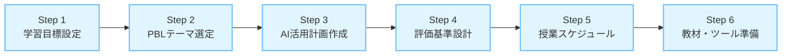

**[教員向け]** この章のポイント：第4章のフレームワークを実践に落とし込むための具体的な手順、テンプレート、チェックリストを提供します。そのまま使えるツール集です。

**[学生向け]** この章のポイント：5.3の「良い活用例 vs 悪い活用例」と自己評価チェックリストを使って、今日から学習方法を改善できます。

# はじめに：フレームワークから実践へ

第4章では、生成AI時代のPBL設計フレームワークを提示しました。この章では、そのフレームワークを**実際の授業に落とし込むための具体的な手順とツール**を提供します。

**この章で提供するもの**：

1. **授業設計のステップバイステップガイド**（5.1）
   - 6つのステップで授業を設計する方法

2. **推奨ツールと活用方法**（5.2）
   - Edge Copilot、Microsoft Loop、ChatGPT/Claudeの使い方

3. **学生向けガイドライン**（5.3）
   - AI活用のルール、良い例・悪い例、自己評価チェックリスト

4. **評価ルーブリック**（5.4）
   - すぐ使える成果物・プロセス・メタ認知の評価基準

5. **90分×2コマの授業設計実例**（5.5）
   - 琉球大学での今年度授業設計の全プロセス公開

# 5.1 授業設計のステップバイステップガイド

**[教員向け]** 6つのステップで授業を設計する

第4章のフレームワークを実際の授業設計に適用するための6ステップを示します。



## 5.1.1 Step 1: 学習目標の設定

**Bloomの分類学に基づく学習目標ワークシート**

### テンプレート

```markdown
## PBL授業の学習目標設定ワークシート

### 1. 授業の基本情報
- 授業名：
- 対象：
- 期間・コマ数：
- PBLのテーマ：

### 2. 学習目標（Bloomの分類学で階層化）

#### 第3層：高次思考スキル（守るべき領域）

**分析**：
- [ ] （例）地域課題を自分で分析し、因果関係を特定できる

**評価**：
- [ ] （例）提案の妥当性を批判的に評価できる

**創造**：
- [ ] （例）独自の視点で実現可能な政策を創造できる

#### 第2層：中次思考スキル（バランスの領域）

**応用**：
- [ ] （例）先行事例を自地域の文脈に応用できる

#### 第1層：低次思考スキル（効率化可能な領域）

**理解**：
- [ ] （例）地域課題の背景を理解できる

**記憶**：
- [ ] （例）関連する統計データを収集できる

### 3. AI使用条件の明記（高次思考目標に対して）

各高次思考目標に対して、AI使用の条件を明記：

- 分析目標に対して：
  → AI活用方針：慎重活用（情報収集は可、分析は自分で）

- 評価目標に対して：
  → AI活用方針：制限（評価基準設定と最終判断は学生）

- 創造目標に対して：
  → AI活用方針：制限（アイデア発散は可、最終形成は学生）

### 4. プロセス目標の追加

- [ ] 課題解決のプロセスを自分で設計し、AI活用の適切性を判断できる
- [ ] AI活用を振り返り、自己の学習プロセスを言葉にできる
- [ ] グループ議論を通じて、AIでは生成できない独自の洞察を得られる
```

### 記入例：地域課題解決PBL

```markdown
### 1. 授業の基本情報
- 授業名：DXによる地域課題解決
- 対象：大学3-4年生、40名
- 期間・コマ数：90分×8コマ
- PBLのテーマ：沖縄県の地域課題（交通、観光、高齢化等）

### 2. 学習目標

#### 第3層：高次思考スキル
**分析**：
- ✓ 地域課題を自分で分析し、表層的な現象と根本的な原因を区別できる

**評価**：
- ✓ AI生成情報を批判的に検証し、信頼性を評価できる
- ✓ 複数の解決策を比較し、実現可能性の観点から評価できる

**創造**：
- ✓ 地域固有の文脈を踏まえた、独自の政策提案を創造できる

#### 第2層：中次思考スキル
**応用**：
- ✓ 他地域の成功事例を自地域の状況に応用できる

#### 第1層：低次思考スキル
**理解**：
- ✓ 地域課題の背景（歴史、経済、社会構造）を理解できる

**記憶**：
- ✓ 関連する統計データ、先行事例を収集できる

### 3. AI使用条件
- 分析目標：背景情報収集はAI可、問題の整理は自分で行う
- 評価目標：AI情報の妥当性評価、最終判断は学生主体
- 創造目標：アイデア発散にAI使用可、最終提案は独自視点で

### 4. プロセス目標
- ✓ 「どの場面でAIを使うべきか」を判断し、理由を説明できる
- ✓ 学習プロセスを振り返り、AI活用の効果と課題を言葉にできる
- ✓ グループ議論で、AIでは得られない地域の生の声を反映できる
```

## 5.1.2 Step 2: PBLテーマの選定

**テーマ選定の4つの基準**：

| 基準 | 定義 | チェック項目 |
|------|------|------------|
| **真正性**<br/>(Authenticity) | 現実社会の課題か | □ 実際に存在する課題か<br/>□ ステークホルダーが明確か<br/>□ 解決策が実装可能か |
| **複雑性**<br/>(Complexity) | 高次思考を促すか | □ 単純な正解がないか<br/>□ 複数の要因が絡むか<br/>□ 分析・評価が必要か |
| **開放性**<br/>(Open-endedness) | 多様な解が存在するか | □ 唯一の正解がないか<br/>□ 創造的アプローチが可能か<br/>□ 学生の独自性が出せるか |
| **関連性**<br/>(Relevance) | 学生にとって意味があるか | □ 学生の生活に関連するか<br/>□ 学習動機を高められるか<br/>□ キャリアに役立つか |

### テーマ選定ワークシート

```markdown
## PBLテーマ候補の評価

### 候補1: [テーマ名]

| 基準 | 評価 | コメント |
|------|------|---------|
| 真正性 | ⭐⭐⭐⭐☆ | （例）実際の地域課題、ステークホルダー多数 |
| 複雑性 | ⭐⭐⭐⭐⭐ | （例）経済・社会・環境が複雑に絡む |
| 開放性 | ⭐⭐⭐⭐☆ | （例）多様なアプローチが可能 |
| 関連性 | ⭐⭐⭐☆☆ | （例）学生の日常にはやや遠い |

**総合評価**: 16/20点
**選定判断**: 候補として検討

### 生成AI時代の追加基準

| 追加基準 | 評価 | 理由 |
|---------|------|------|
| AI だけでは解決できないか | ⭐⭐⭐⭐⭐ | （例）地域固有の文脈理解が必須 |
| 現場調査が必要か | ⭐⭐⭐⭐☆ | （例）インタビューやフィールドワークが有効 |
| 価値判断が含まれるか | ⭐⭐⭐⭐⭐ | （例）ステークホルダー間の利害調整が必要 |
```

**[教員向け]** 良いテーマの例

✅ **良い例**：「沖縄県の路線バス減少問題と高齢者移動支援」
- 真正性：実際の課題、明確なステークホルダー
- 複雑性：経済・地理・高齢化が複雑に絡む
- 開放性：デマンドバス、MaaS、ボランティア等多様な解
- 関連性：学生も利用する交通問題
- **AI制約**: 地域固有の事情、現場の声、価値判断が必要

❌ **避けるべき例**：「日本の少子化問題の解決策を提案せよ」
- 複雑性：あるが、範囲が広すぎる
- 開放性：あるが、抽象的すぎる
- 真正性：学生にとって実感が薄い
- **AI問題**: AIで一般論を集めて終わる可能性が高い

## 5.1.3 Step 3: 生成AI活用計画の作成

**AI活用計画テンプレート**

```markdown
## 生成AI活用計画書

### 1. 基本方針

**PBLの目的**: （例）地域課題解決能力の育成
**AIの位置づけ**: （例）課題解決を支援する道具の一つ

**AI活用の3原則**:
1. 目的と手段を混同しない（課題解決が目的、AIは手段）
2. 高次思考スキルは学生主体（分析・評価・創造）
3. AI活用を振り返る（メタ認知を促す）

### 2. PBL段階別AI活用方針

| PBL段階 | 学習目標 | AI活用方針 | 具体的な活用場面 | 制限事項 |
|---------|---------|----------|---------------|---------|
| **問題発見** | 問いを立てる力 | 🟢 情報収集<br/>🔴 問題定義 | 背景情報の収集、統計データの検索 | 問題の整理・問い設定はAI不使用 |
| **解決策創出** | 創造的思考 | 🟡 アイデア発散<br/>🔴 最終決定 | ブレスト補助、先行事例調査 | 最終的な解決策選択はグループ議論 |
| **実装計画** | 計画立案能力 | 🟢 ドラフト作成<br/>🔴 優先順位 | 計画書の整理、リスク分析補助 | 優先順位と最終判断は学生 |

🟢 = 推奨、🟡 = 条件付き、🔴 = 非推奨/制限

### 3. 推奨ツールと使用条件

| ツール | 推奨場面 | 使用条件 | 注意事項 |
|--------|---------|---------|---------|
| **Edge Copilot** | リサーチ、データ分析 | 全学生利用可 | 出典確認必須 |
| **Microsoft Loop** | グループ協働作業 | 必須使用 | 全プロセス記録 |
| **ChatGPT/Claude** | （各自判断） | 個人契約者のみ | プライバシー注意 |

### 4. 学生への説明事項

**第1回授業で伝えること**:
- [ ] PBLの目的（課題解決能力の育成）
- [ ] AIの位置づけ（手段の一つ）
- [ ] AI活用の信号ルール（🟢🟡🔴）
- [ ] 評価基準（AI活用の適切性を評価）
- [ ] 倫理とルール（透明性、責任、プライバシー）

**配布資料**:
- [ ] AI活用ガイドライン（PDF）
- [ ] 良い例・悪い例集
- [ ] 自己評価チェックリスト
```

## 5.1.4 Step 4: 評価基準の設計

**評価の3層構造**（第4章4.4参照）：

| 評価層 | 配点 | 評価対象 |
|--------|------|---------|
| 成果物 | 30% | 提案の質、論理性、実現可能性、独自性 |
| プロセス | 40% | 議論の深さ、試行錯誤、AI活用の適切性 |
| メタ認知 | 30% | AI活用の振り返り、学習プロセスを言葉にする |

詳細なルーブリックは5.4で提供します。

## 5.1.5 Step 5: 授業スケジュールの作成

### 90分×2コマでのAI活用入門（集中講義形式）

**対象**：PBL全体の中でAI活用を学ぶ導入パート

| コマ | テーマ | 時間配分 | 学習活動 | AI活用方針 |
|------|--------|---------|---------|----------|
| **第1コマ**<br/>(90分) | 情報収集とAI活用 | 導入15分<br/>講義20分<br/>実習45分<br/>まとめ10分 | ・AI活用ガイドライン<br/>・地域課題のリサーチ<br/>・批判的検証 | 🟢 情報収集<br/>🔴 問題定義はAI不使用 |
| **第2コマ**<br/>(90分) | データ分析と協働作業 | 復習10分<br/>講義20分<br/>実習35分<br/>検証演習15分<br/>まとめ10分 | ・アンケート設計<br/>・グループ協働<br/>・批判的検証演習 | 🟢 データ整理<br/>🟡 分析は自分で |

**この2コマの位置づけ**：
- PBL全体（8-15コマ）の中で、AI活用の基礎を学ぶ導入パート
- 第3コマ以降は、学んだ判断基準を使いながらPBLを進める

**評価**：
- 第2コマ終了後：振り返りシート提出（メタ認知評価）
- PBL全体の中で：AI活用の適切性を継続評価

## 5.1.6 Step 6: 教材とツールの準備

**準備チェックリスト**

### 必須教材（Must）

- [ ] **AI活用ガイドライン**
  - 琉球大学では以下の既存ガイドラインを使用
  - URL: https://www.u-ryukyu.ac.jp/wp-content/uploads/2023/09/24d2480c1e7aa390d164d4efb33f3df9.pdf
  - 独自ガイドラインを作成する場合は、以下の要素を含める
    - AI活用の信号ルール
    - 良い例・悪い例（各10個）
    - 倫理とプライバシー
    - 自己評価チェックリスト

- [ ] **ワークシート**
  - 問題発見シート
  - 解決策評価シート
  - 振り返りシート

- [ ] **評価ルーブリック**
  - 成果物評価
  - プロセス評価
  - メタ認知評価

### 推奨教材（Should）

- [ ] **プロンプト例集**（良い例・悪い例各10個）
- [ ] **サンプルデータ**（練習用）
- [ ] **批判的検証演習教材**
- [ ] **過去の優秀作品例**（参考用）

### あると便利（Could）

- [ ] **デモ動画**（ツールの使い方）
- [ ] **FAQ集**（よくある質問）
- [ ] **トラブルシューティングガイド**

**[教員向け]** 教材作成の優先順位

1. **最優先**：AI活用ガイドライン、ワークシート、ルーブリック
2. **次に**：プロンプト例集、サンプルデータ
3. **余裕があれば**：デモ動画、FAQ

時間がない場合は、最優先の3つだけでも授業は回ります。

# 5.2 推奨ツールとその活用方法

**[全ペルソナ向け]** 具体的なツールの使い方

第2章で紹介したツールの活用方法を詳しく解説します。

## 5.2.1 Edge Copilotの活用

**Edge Copilotの特徴**：
- ✅ 無料で利用可能（Microsoft アカウント）
- ✅ 最新情報にアクセス可能（Web検索機能）
- ✅ 出典を示してくれる
- ✅ 学生のプライバシーに配慮

**リサーチ機能の使い方**：

### 効果的なプロンプト例

**❌ 悪い例**：
```
沖縄の路線バスについて教えて
```
→ 一般的すぎる、出典不明、検証困難

**✅ 良い例**：
```
沖縄県の路線バス事業者の経営状況について、
以下の情報を出典付きで教えてください：
1. 2020年以降の利用者数の推移
2. 主要事業者の収支状況
3. 運転手不足の現状
```
→ 具体的、検証可能、目的が明確

### プロンプトの3要素

| 要素 | 説明 | 例 |
|------|------|-----|
| **1. 具体性** | 何を知りたいか明確に | 「2020年以降の利用者数の推移」 |
| **2. 文脈** | なぜ知りたいか背景を説明 | 「沖縄県の過疎地域の高齢者移動支援策を検討するため」 |
| **3. 出力形式** | どの形式で欲しいか指定 | 「箇条書きで、出典URLを明記」 |

### データ分析での活用

**活用場面**：
- 統計データの要約
- グラフの解釈
- トレンドの分析

**注意点**：
- ⚠️ データの正確性を必ず確認
- ⚠️ 出典元の信頼性を評価
- ⚠️ 最新性を確認（いつのデータか）

**[学生向け]** Edge Copilot活用のコツ

1. **質問を具体的に**：「〇〇について」ではなく「〇〇の△△を教えて」
2. **出典を必ず確認**：回答の下部に表示されるリンクをクリック
3. **複数回対話する**：最初の回答が不十分なら、追加質問で深掘り
4. **自分の言葉で要約**：AIの回答をそのまま使わず、理解して書き直す

## 5.2.2 Microsoft Loopでの協働作業

**Microsoft Loopの特徴**：
- ✅ リアルタイム共同編集
- ✅ コメント・フィードバック機能
- ✅ タスク管理機能
- ✅ 編集履歴の記録

**PBLでの活用方法**：

### プロジェクト管理テンプレート

```markdown
# [グループ名] 地域課題解決プロジェクト

## プロジェクト概要
- **課題**: （ここに課題を記入）
- **問い**: （ここに設定した問いを記入）
- **メンバー**: A, B, C, D
- **期限**: 2024年XX月XX日

## タスク管理
| タスク | 担当 | 期限 | 状態 | メモ |
|--------|------|------|------|------|
| 背景情報収集 | A | 10/15 | 完了 | Edge Copilot使用 |
| インタビュー準備 | B | 10/20 | 進行中 | 質問項目作成中 |
| データ分析 | C | 10/25 | 未着手 | Aの調査結果待ち |

## 議事録
### 2024/10/10 第1回ミーティング
- 決定事項：課題を「高齢者移動支援」に絞る
- AI使用：背景情報収集にEdge Copilot使用（担当A）
- 次回：インタビュー結果共有

## リサーチノート
### 沖縄県の路線バス利用者数推移
- 出典：[URL]
- データ：2020年XX人 → 2023年XX人（XX%減）
- 検証：✓ 出典確認済み、✓ 最新データ

## アイデアボード
- アイデア1：デマンドバスの導入
  - メリット：...
  - デメリット：...
  - AI生成：部分的（先行事例調査）

- アイデア2：ボランティア送迎
  - メリット：...
  - デメリット：...
  - AI生成：なし（グループ議論から）
```

**[教員向け]** Microsoft Loopの教育的メリット

1. **プロセスを見えるようにする**：誰が何をしたか記録される
2. **教員の適時介入**：進捗を確認し、必要なタイミングでコメント
3. **AI活用の透明化**：どこでAIを使ったか明示させる
4. **評価の根拠**：プロセス評価の証拠として活用

## 5.2.3 ChatGPT / Claudeの活用

**個人契約している学生向けの活用指針**

### 推奨活用場面

| 場面 | ChatGPT | Claude | 注意点 |
|------|---------|--------|--------|
| **長文生成** | ◎ | ◎ | そのまま使わない、参考程度に |
| **対話で詳しくする** | ◎ | ◎ | 繰り返し対話で深掘り |
| **コード生成** | ◎ | ○ | 理解して使う |
| **文章の見直し** | ○ | ◎ | 最終判断は自分 |

### プロンプトエンジニアリングの実例

**例：政策提案の壁打ち相手として使う**

```
【良いプロンプト例】

私は大学生で、沖縄県の過疎地域における高齢者移動支援策を
提案するプロジェクトに取り組んでいます。

現状：
- 路線バスが廃止され、車を運転できない高齢者が困っている
- 人口約1000人の集落、高齢化率45%
- 最寄りの診療所まで10km

私たちは「ボランティア送迎システム」を提案しようと考えています。

【質問】
この提案の実現可能性を高めるために、
どのような点を検討すべきですか？
特に、見落としがちなリスクや課題を指摘してください。
```

**AIの回答を受けて**：

1. **批判的に検証**：AIの指摘は妥当か？
2. **追加質問**：「ボランティアの持続性について、他地域の成功事例は？」
3. **自分の判断**：AIの提案を採用するか、独自の視点を加えるか

### 倫理的配慮とガイドライン

**やってはいけないこと**：

❌ **個人情報の入力**：
- インタビューで得た実名、住所などをAIに入力しない
- 機密情報をAIに入力しない

❌ **丸ごとコピペ**：
- AI生成文章をそのまま提出しない
- 必ず自分の言葉で書き直す

❌ **出典の偽装**：
- AI生成内容を「自分で調べた」と偽らない
- AI使用箇所を明示する

✅ **推奨される使い方**：
- アイデアの壁打ち相手
- 文章の見直し補助
- 視点の多様化
- **必ず「AI支援あり」と明記**

# 5.3 学生向けガイドラインの作成

**[教員向け]** 学生に配布するガイドライン

第1回授業で配布する「AI活用ガイドライン」のテンプレートを提供します。

## 5.3.1 AI活用のルールとガイドライン

### テンプレート（そのまま使えます）

```markdown
# 生成AI活用ガイドライン

## この授業での生成AIの位置づけ

**この授業の目的**：地域課題解決能力を育てること
**生成AIの役割**：課題解決を支援する道具の一つ

> **重要**：AIは手段です。目的ではありません。
> 評価されるのは「AIをどう使ったか」ではなく、
> 「課題解決にどう近づいたか」です。

## AI活用の4原則

### 1. 透明性（Transparency）

**ルール**：
- AI使用箇所を明示する義務があります
- ワークシート・レポートに「AI支援あり」と記載
- 振り返りで「どこで」「なぜ」使ったかを説明

**理由**：
- 学習プロセスを見えるようにする
- メタ認知を促す
- 評価の公平性

### 2. 責任（Responsibility）

**ルール**：
- 最終的な判断と責任は学生自身にあります
- AI生成内容の正確性を検証する義務
- AIのせいにしない（「AIがそう言った」は通用しません）

**理由**：
- 自律的思考力を育てる
- 批判的思考力を育てる

### 3. 倫理（Ethics）

**ルール**：
- 剽窃・不正使用の禁止
- AI生成文章の丸ごとコピペ禁止
- 他人の成果をAIに入力して自分の成果とすることの禁止

**理由**：
- 学問的誠実性
- 創造性を育てる

### 4. プライバシー（Privacy）

**ルール**：
- 個人情報をAIに入力しない
- インタビュー内容（実名、住所等）の入力禁止
- 機密情報の入力禁止

**理由**：
- 個人情報保護
- 研究倫理

## AI活用の信号ルール

### 🟢 緑信号（推奨）：自由に使ってOK

- 背景情報の収集
- 統計データの検索
- 先行事例の調査
- 文章の校正・見直し
- グラフの作成

**ポイント**：効率化してOK、ただし検証は必須

### 🟡 黄信号（条件付き）：まず自分で考えてから

- データの分析
- 先行事例の評価
- アイデアの発散
- 解決策の比較

**条件**：
1. まず自分/グループで考える（最低15分）
2. AIは補助として使う
3. AIの回答を批判的に検証する
4. 最終判断は自分たちで行う

### 🔴 赤信号（非推奨）：AI使用制限

- 問題定義
- 問いの設定
- 解決策の最終選択
- 提案の評価・判断
- 学習の振り返り

**理由**：これらは学習目標の核心、AI に任せると学びがない

## 評価基準

あなたの成績は以下で評価されます：

| 評価項目 | 配点 | 内容 |
|---------|------|------|
| **成果物** | 30% | 提案の質、論理性、独自性 |
| **プロセス** | 40% | 議論の深さ、試行錯誤、**AI活用の適切性** |
| **メタ認知** | 30% | AI活用の振り返り、学習プロセスを言葉にする |

**重要**：
- AI を使ったこと自体は減点になりません
- 不適切な使い方（丸投げ、鵜呑み）が減点対象です
- 適切な使い方は加点されます

## よくある質問（FAQ）

**Q1: AIを使わない方が評価が高いですか？**
A: いいえ。適切に使えば加点されます。使わないことが目的ではありません。

**Q2: どこまでAIを使っていいですか？**
A: 信号ルール（🟢🟡🔴）を参考に、自分で判断してください。
判断そのものが学習です。

**Q3: AI使用箇所を明示し忘れたらどうなりますか？**
A: 透明性の原則違反として減点対象です。必ず明示してください。

**Q4: グループメンバーがAIに丸投げしています。どうすれば？**
A: グループで話し合ってください。それでも解決しない場合は教員に相談を。

**Q5: AIが間違った情報を教えました。私の責任ですか？**
A: はい。AI情報の検証は学生の責任です。必ず複数の情報源で確認してください。
```

## 5.3.2 良い活用例 vs 悪い活用例

**学生に配布する「活用例集」**

### 場面1：背景情報の収集

**❌ 悪い例**：
```
学生：「沖縄の路線バス問題について教えて」
AI：（一般的な回答）
学生：「ありがとう」（そのままワークシートにコピペ）
```

**問題点**：
- 質問が曖昧
- 批判的検証なし
- 丸ごとコピペ

**✅ 良い例**：
```
学生：「沖縄県の路線バス利用者数について、
2020年以降の推移を出典付きで教えてください」
AI：（具体的な回答と出典）
学生：出典URLをクリック→元データを確認→自分の言葉で要約
ワークシートに：「〇〇によると、XX年にXX人からXX人へ減少（AI支援で出典発見）」
```

**良い点**：
- 質問が具体的
- 出典を確認
- 自分の言葉で要約
- AI使用を明記

### 場面2：問題の分析

**❌ 悪い例**：
```
学生：「沖縄の路線バス減少の原因を分析して」
AI：（原因のリスト）
学生：「これが原因だね」（AIの分析をそのまま採用）
```

**問題点**：
- 自分で考えていない
- AI の分析を鵜呑み
- 黄信号の場面で自分で考えていない

**✅ 良い例**：
```
【まず自分で考える（15分）】
学生：グループで議論
「運転手不足が一番の原因じゃない？」
「いや、利用者減少で収益悪化が根本では？」

【AIで視点を追加】
学生：「私たちは運転手不足と収益悪化が原因と考えましたが、
他に見落としている視点はありますか？」
AI：「地理的要因、人口分散なども...」

【批判的検証】
学生：「確かに地理的要因もありそう。データで確認しよう」
→ 統計データで検証
→ 最終的に自分たちで原因を特定
```

**良い点**：
- まず自分で考えた
- AIは視点追加に使用
- 批判的に検証
- 最終判断は自分

### 場面3：解決策を作り出す

**❌ 悪い例**：
```
学生：「高齢者移動支援の解決策を提案して」
AI：（5つの解決策）
学生：「じゃあこの中から選ぼう」（AIのアイデアから選ぶだけ）
```

**問題点**：
- 自分のアイデアがない
- AIに依存
- 独自性ゼロ

**✅ 良い例**：
```
【まずグループでブレスト（30分）】
学生：ホワイトボードにアイデアを列挙
- デマンドバス
- ボランティア送迎
- 相乗りマッチングアプリ
- 移動販売車を活用
...（20個のアイデア）

【AIで視点を追加】
学生：「私たちは〇〇、△△、□□を考えました。
他地域で成功している事例で、私たちが見落としているものは？」
AI：「○○市では××という取り組みが...」

【独自の視点を加える】
学生：「この地域は観光地だから、観光客の移動手段と
統合できないかな？」（地域固有の視点）
→ これはAIでは出てこない発想

【最終提案】
グループ議論で独自性のある提案にまとめる
```

**良い点**：
- まず自分たちで発散
- AIは補助的に使用
- 地域固有の視点を追加
- 独自性あり

## 5.3.3 自己評価チェックリスト

**毎回の授業後に記入するチェックリスト**

```markdown
# AI活用 自己評価チェックリスト

**日付**：____年____月____日
**授業回**：第____回
**今日の課題**：_________________________________

## 1. AI使用状況

### 使用した場面
- [ ] 背景情報収集
- [ ] データ分析
- [ ] アイデア発散
- [ ] 文章の見直し
- [ ] その他：_______________

### 使用したツール
- [ ] Edge Copilot
- [ ] ChatGPT
- [ ] Claude
- [ ] その他：_______________

## 2. 適切性の自己評価

| 質問 | はい | いいえ |
|------|------|--------|
| AIを使う前に、まず自分で考えましたか？（最低10分） | □ | □ |
| 「なぜここでAIを使うのか」を説明できますか？ | □ | □ |
| AI生成情報を批判的に検証しましたか？ | □ | □ |
| 他の情報源でも確認しましたか？ | □ | □ |
| 最終判断は自分で行いましたか？ | □ | □ |
| AI使用箇所を明示しましたか？ | □ | □ |

**「いいえ」が1つでもあった項目**：
- 該当項目：_______________
- 次回の改善策：_______________

## 3. 課題解決への貢献度

**今日の目標**：（例）路線バス問題の原因を特定する

**AI活用の効果**：
- ✅ 役立った点：_______________
- ⚠️ 問題点：_______________

**課題解決に近づきましたか？**
□ 大いに近づいた（5点）
□ やや近づいた（4点）
□ どちらとも言えない（3点）
□ あまり近づかなかった（2点）
□ 全く近づかなかった（1点）

**理由**：_______________

## 4. AI依存度チェック

| 依存の兆候 | 当てはまる |
|-----------|----------|
| すぐにAIに頼ってしまった | □ |
| AI なしでは作業できないと感じた | □ |
| AI の回答を鵜呑みにしてしまった | □ |
| 「わからない」に耐えられなかった | □ |
| 自分で考える時間が10分未満だった | □ |

**チェックが3つ以上**：AI依存の危険信号です。次回は「AIなしで考える時間」を意識的に増やしましょう。

## 5. 次回への改善

**今日の反省点**：
___________________________________

**次回の目標**：
___________________________________

**具体的な改善策**：
___________________________________
```

**[教員向け]** このチェックリストの活用

- 毎回提出させる（Microsoft Forms等で）
- 中間フィードバックの材料にする
- AI依存傾向の早期発見
- 最終評価のメタ認知評価に使用

# 5.4 評価ルーブリックとチェックリスト

**[教員向け]** すぐ使える評価基準

第4章4.4で提示した評価の3層構造を、具体的なルーブリックに落とし込みます。

## 5.4.1 成果物評価ルーブリック（30点満点）

| 評価項目 | 優秀（9-10点） | 良好（7-8点） | 普通（5-6点） | 要改善（3-4点） | 不十分（0-2点） |
|---------|--------------|-------------|-------------|--------------|--------------|
| **独自性・独創性**<br/>（10点） | AI生成では出てこない独自の視点や提案がある。地域固有の文脈を深く理解。現場の声が入っている。 | 一部に独自の視点があるが、AI生成内容にも依存している。 | AI生成内容と独自視点が混在。どちらが主かわかりにくい。 | AI生成内容が大半。独自性が薄い。 | AI生成内容をほぼそのまま使用。独自性なし。 |
| **論理性・整合性**<br/>（10点） | 問い設定から提案まで一貫性があり、論理的飛躍がない。根拠が明確で説得力がある。 | 概ね論理的だが、一部に飛躍や矛盾がある。根拠が弱い部分も。 | 論理的な部分もあるが、飛躍や矛盾が目立つ。 | 論理的整合性が欠如。主張と根拠がずれている。 | 非論理的。主張の根拠が不明。 |
| **実現可能性**<br/>（10点） | 具体的なステップ、必要資源（予算、人、時間）、リスク対策が明確。ステークホルダー視点を含む。 | 実現に向けた検討はあるが、具体性に欠ける部分がある。 | 実現性の検討が表層的。具体的なステップが不明確。 | 実現可能性の検討が不十分。現実的でない提案。 | 実現可能性を全く検討していない。 |

## 5.4.2 プロセス評価ルーブリック（40点満点）

| 評価項目 | 優秀（13-15点） | 良好（10-12点） | 普通（7-9点） | 要改善（4-6点） | 不十分（0-3点） |
|---------|---------------|---------------|-------------|--------------|--------------|
| **議論の深さ**<br/>（15点） | グループで深い議論を重ね、多様な視点をまとめている。対立を建設的に解決。議事録から思考の深まりが確認できる。 | 議論はあるが表層的な部分も。または一部メンバーのみが主導。 | 議論が形式的。表面的な意見交換に留まる。 | 議論が不十分。メンバー間のコミュニケーションが少ない。 | 議論がほとんどない。AIに依存して議論を省略。 |
| **試行錯誤の痕跡**<br/>（10点） | 複数の案を検討し、失敗から学び、改善を重ねている。プロセスが見えるようになっている（議事録、修正履歴等）。 | 試行錯誤はあるが限定的。または記録が不十分。 | 試行錯誤が少ない。最初のアイデアから大きく変わっていない。 | 試行錯誤がほとんどない。失敗を避けている。 | 最初のアイデア（AI生成含む）をそのまま採用。試行錯誤なし。 |
| **AI活用の適切性**<br/>（15点） | 場面に応じてAI使用を判断し、高次思考では自分で考えている。使用理由を明確に説明できる。批判的検証を徹底。 | AI活用はあるが、判断が不適切な場面も見られる。検証が甘い部分も。 | AIを使う判断基準が不明確。または依存傾向が見られる。 | AIに過度に依存。盲目的に使用。批判的検証が不十分。 | AIに丸投げ。自分で考えていない。検証なし。 |

## 5.4.3 メタ認知評価ルーブリック（30点満点）

| 評価項目 | 優秀（9-10点） | 良好（7-8点） | 普通（5-6点） | 要改善（3-4点） | 不十分（0-2点） |
|---------|--------------|-------------|-------------|--------------|--------------|
| **AI活用の振り返り**<br/>（10点） | 具体的で深い振り返り。どこで、なぜ、どう使ったかを明確に説明。効果と課題を分析。改善策を示す。 | 振り返りはあるが、やや表層的。具体性に欠ける部分も。 | 振り返りが形式的。「便利だった」「役立った」などの感想レベル。 | 振り返りが浅い。AI使用の事実のみ記載。 | 振り返りなし。またはAI活用に言及していない。 |
| **学習プロセスを言葉にする**<br/>（10点） | 学習プロセスを詳細に記述。思考の変化、気づき、困難と乗り越え方を具体的に説明。自己の成長を認識。 | プロセスの記述はあるが、詳細さに欠ける。 | プロセスの記述が表層的。出来事の羅列に留まる。 | プロセスの記述が不十分。何をしたかのみ記載。 | プロセスの記述なし。 |
| **批判的思考の証拠**<br/>（10点） | AI情報を複数の情報源で検証した証拠。批判的に評価し、独自の判断を加えている。限界を認識。 | 検証はあるが表層的。または一部のみ検証。 | 検証が形式的。「確認した」とあるが証拠不十分。 | 検証がほとんどない。 | AI情報を鵜呑み。検証なし。 |

## 5.4.4 評価シート（教員用）

```markdown
# PBL最終評価シート

**学生氏名**：_______________
**グループ名**：_______________
**評価日**：____年____月____日

## 成果物評価（30点）

| 項目 | 点数 | コメント |
|------|------|---------|
| 独自性・独創性 | /10 | |
| 論理性・整合性 | /10 | |
| 実現可能性 | /10 | |
| **小計** | **/30** | |

## プロセス評価（40点）

| 項目 | 点数 | コメント |
|------|------|---------|
| 議論の深さ | /15 | |
| 試行錯誤の痕跡 | /10 | |
| AI活用の適切性 | /15 | |
| **小計** | **/40** | |

## メタ認知評価（30点）

| 項目 | 点数 | コメント |
|------|------|---------|
| AI活用の振り返り | /10 | |
| 学習プロセスを言葉にする | /10 | |
| 批判的思考の証拠 | /10 | |
| **小計** | **/30** | |

## 総合評価

**合計点**：_____/100点

**総評**：
_________________________________
_________________________________

**特に優れていた点**：
_________________________________

**今後の改善点**：
_________________________________

**評価者**：_______________
```

# 5.5 90分×2コマの授業設計実例

**[教員向け]** 琉球大学での今年度設計を全公開

第2章で紹介した琉球大学の実践を、今年度どう改善するか。授業設計の全プロセスを公開します。

## 5.5.1 昨年度（2024年度）の振り返りと課題

**昨年度の実践結果**（第2章参照）：

**向上したもの**：
- ✅ 提案書の形式的完成度（3.5 → 4.3）
- ✅ データに基づく提案（2.8 → 4.2）
- ✅ 論理性・整合性（3.2 → 4.0）

**課題が見られたもの**：
- ⚠️ 独自性・独創性（3.8 → 3.5）
- ⚠️ 批判的思考の不足
- ⚠️ AI依存傾向

**昨年度の問題点分析**：

| 問題 | 原因 | 理論的背景 |
|------|------|----------|
| **AI依存** | 「まず使ってみる」を重視しすぎた | 認知的負債の蓄積（第3章） |
| **独自性の低下** | AI活用場面の判断基準が不明確 | 高次思考スキルの発達阻害 |
| **批判的検証不足** | 検証の演習が不足 | メタ認知支援の不足 |

## 5.5.2 今年度（2025年度）の改善方針

**2025年度の重点目標**：

**「いつAIを使うべきか/使うべきでないか」の判断力育成**

これが、2024年度から2025年度への最大の転換です。

**具体的な改善策（優先順位付き）**：

### 最優先（Must）

**1. 学習目標の再定義**
- 変更前：「生成AIで何ができるかを体験する」
- 変更後：「課題解決の目的に応じて、AIを適切に活用する判断ができる」

**2. AI活用の信号ルール導入**
- 🟢🟡🔴の明確な基準を第1コマで示す
- ワークシートにも信号を明記

**3. 「AIなしで考える」時間の設定**
- 実習の最初10分はAI使用禁止
- 課題の明確化を自分で行う

### 重要（Should）

**4. 批判的検証の演習追加**
- 第2コマに15分の演習を新設
- AI生成アンケートの問題発見演習

**5. 評価軸の転換**
- プロセス評価の配点を30% → 40%に
- AI活用の適切性を明示的に評価

### できれば（Could）

**6. 3コマ目の追加**
- 時間的制約で今年度は見送り
- 将来的には考える

## 5.5.3 第1コマの詳細設計（90分）

**テーマ**：地域課題解決のための情報収集とAI活用

### 時間配分と設計意図

| 時間 | 内容 | 活動 | 教材・ツール | 設計の意図 |
|------|------|------|-------------|----------|
| **0-15分** | 導入 | ・授業の目的明示<br/>・AI活用ガイドライン配布<br/>・信号ルール（🟢🟡🔴）説明 | スライド<br/>ガイドラインPDF | **「課題解決」が目的、AIは手段**<br/>最初に明確化することで、目的と手段の混同を防ぐ |
| **15-35分** | 講義 | ・情報収集の方法論（AI以前の基本）<br/>・AIを使うべき場面/使うべきでない場面<br/>・効果的なプロンプトの書き方<br/>・批判的検証の重要性 | スライド<br/>プロンプト例集 | **判断基準を明示**<br/>「使い方」より「判断」を重視<br/>20分に凝縮（昨年度30分から短縮） |
| **35-80分** | 実習 | **課題解決プロセス全体の体験**<br/>①課題の明確化（10分、AI不使用）<br/>②情報収集計画（5分、AI使用判断）<br/>③AI活用実践（20分）<br/>④批判的検証（10分）<br/>⑤ペアフィードバック（10分） | Edge Copilot<br/>ワークシート | **プロセス全体を体験**<br/>AIはプロセスの一部<br/>「AIなし時間」を明示的に設定 |
| **80-90分** | まとめ | ・振り返りシート記入<br/>・「課題解決に近づいたか？」を評価<br/>・**地域公共政策資料作成での活用イメージ共有**<br/>・次回予告 | Microsoft Forms<br/>スライド | **評価軸は「課題解決」**<br/>今後の実践への橋渡し |

### 実習ワークシート（第1コマ用）

```markdown
# 第1コマ実習ワークシート：地域課題のリサーチ

**氏名**：_______________
**日付**：____年____月____日

## ステップ1：課題の明確化（10分、🔴AI使用禁止）

**あなたが関心のある地域課題**：
_________________________________

**なぜその課題が重要だと思いますか？**：
_________________________________

**誰が困っていますか？**：
_________________________________

**この課題について、あなたが既に知っていること**：
-
-
-

## ステップ2：情報収集計画（5分）

**この課題を理解するために必要な情報**：
1. _________________________________
2. _________________________________
3. _________________________________

**AIを使う判断**：
- [ ] 使う → 理由：_______________（信号：🟢 or 🟡）
- [ ] 使わない → 理由：_______________

## ステップ3：AI活用実践（20分、該当する場合のみ）

**使用したツール**：□ Edge Copilot □ その他：_______

**入力したプロンプト（そのまま記録）**：
```
（ここにプロンプトを貼り付け）
```

**AIの回答（要点のみ）**：
_________________________________

## ステップ4：批判的検証（10分）

**検証項目**：

| 質問 | 回答 |
|------|------|
| AIが示した情報の出典は？ | |
| その出典は信頼できる？ | □ はい □ いいえ □ 不明 |
| 情報は最新？（いつのデータ？） | |
| 他の情報源でも確認した？ | □ はい □ いいえ |
| 不足している情報は？ | |

**検証の結果、修正・追加した情報**：
_________________________________

## ステップ5：課題解決への貢献度（自己評価）

**今日の活動で、課題理解は深まりましたか？**
□ 大いに深まった（5点）
□ やや深まった（4点）
□ どちらとも言えない（3点）
□ あまり深まらなかった（2点）
□ 全く深まらなかった（1点）

**理由**：_________________________________

## ペアフィードバック（10分）

**ペアの氏名**：_______________

**ペアからのフィードバック**：
- 良かった点：_______________
- 改善提案：_______________

## 振り返り

**今日のAI活用は適切でしたか？**
□ はい □ いいえ

**次回改善したい点**：
_________________________________
```

### 教員の巡回時の問いかけ

実習中、教員が各学生を巡回する際の問いかけ例：

- 「この課題について、自分でまず考えましたか？」
- 「なぜこの場面でAIを使おうと思ったのですか？」
- 「AIの回答は信頼できますか？どうやって確認しますか？」
- 「この情報は、課題理解に役立ちましたか？」

### 第1コマのまとめ（80-90分）で伝えること

**教員が話すポイント**：

**1. 今日学んだ判断基準の確認**
```
今日は「どの場面でAIを使うべきか」の判断基準を学びました。
覚えていますか？

🟢 緑信号：情報収集、データ検索 → 使ってOK
🟡 黄信号：分析、評価 → まず自分で考えてから
🔴 赤信号：問題定義、最終判断 → 自分で行う

この判断ができるようになることが、今日の目標でした。
```

**2. 地域公共政策資料作成での具体的な活用シーン**

```
これから皆さんが地域公共政策の提案書を作る時、
AIをどう使えばいいか、具体的にイメージできますか？

【例：高齢者移動支援策の提案書を作る場合】

✅ 使っていい場面（🟢緑信号）
・「沖縄県の路線バス利用者数の推移」を調べる
・「他県の高齢者移動支援の事例」を集める
・統計データをグラフにする
・文章の誤字脱字をチェックする

⚠️ まず自分で考える場面（🟡黄信号）
・集めたデータから「なぜ減少しているか」を分析する
・他県の事例が「沖縄で使えるか」を評価する
→ AIに分析を聞いてもいいが、鵜呑みにしない

❌ 使ってはいけない場面（🔴赤信号）
・「何が本当の問題か」を決める
・「どの解決策を提案するか」を決める
・提案書の結論を書く
→ これは自分たちの頭で考え、判断すること

この判断ができれば、AIは強力な味方になります。
逆に、🔴の場面でAIに頼ると、独自性のない提案になります。
```

**3. 次回以降の実践への期待**

```
次回からのPBLでは、今日学んだ判断基準を使いながら
提案書を作っていきます。

皆さんに期待すること：
1. まず自分で考える習慣をつけてください（特に🔴🟡の場面）
2. AIを使ったら、必ず検証してください
3. 「なぜここでAIを使ったか」を説明できるようにしてください

提案書の評価では「AIを使ったかどうか」ではなく、
「適切に判断して使えたか」を見ます。

今日学んだことを忘れずに、次回からの実践に活かしてください。
```

## 5.5.4 第2コマの詳細設計（90分）

**テーマ**：データ収集・分析と協働作業、批判的検証

### 時間配分と設計意図

| 時間 | 内容 | 活動 | 教材・ツール | 設計の意図 |
|------|------|------|-------------|----------|
| **0-10分** | 復習 | ・前回の振り返り共有<br/>・今回の目標確認 | スライド | **つながりを保つ**<br/>2コマを統合的に捉える |
| **10-30分** | 講義 | ・アンケート設計の基礎<br/>・データ分析の方法<br/>・Microsoft Loopの使い方<br/>・**批判的検証のデモ**（新規） | スライド<br/>サンプルアンケート | **検証のデモを追加**<br/>昨年度の最大の課題に対応 |
| **30-65分** | グループ実習 | ・グループでアンケート設計<br/>・サンプルデータ分析<br/>・AI活用と検証 | Edge Copilot<br/>Microsoft Loop | **35分確保**<br/>グループワークは時間がかかる |
| **65-80分** | **批判的検証演習**（新規） | ・AI生成アンケートの問題発見<br/>・グループで検証結果共有<br/>・改善策の議論 | 演習用教材 | **最重要な新規追加**<br/>体験しないと身につかない |
| **80-90分** | まとめ | ・教員から2コマのまとめ<br/>・AI活用の3原則の再確認<br/>・今後のPBLでの活用注意点<br/>・総合振り返りシート記入 | スライド<br/>Microsoft Forms | **教員がポイントを整理**<br/>学生発表は時間不足のため省略 |

### 批判的検証演習（新規追加）

**演習の目的**：
AI生成情報を鵜呑みにせず、批判的に検証する力を育てる

**演習用教材（教員が事前準備）**：

```markdown
# 批判的検証演習：このアンケートの問題点を見つけよう

## 状況設定
あるグループが「沖縄県の高齢者移動支援策」を考えるため、
AIに以下のプロンプトを入力しました。

**プロンプト**：
「高齢者の移動に関するアンケートを作成してください」

**AIが生成したアンケート**：

1. あなたの年齢を教えてください
2. 普段どのような交通手段を使いますか？
3. 移動に困っていることはありますか？
4. どのような支援があれば便利だと思いますか？
5. 1ヶ月にどれくらい外出しますか？

## あなたのミッション（15分）

このアンケートの**問題点**を見つけてください。
以下の視点で考えましょう：

### 考える視点

| 視点 | 問題点は？ | 改善案 |
|------|----------|--------|
| **質問の具体性** | | |
| **回答の選択肢** | | |
| **課題解決への貢献** | | |
| **倫理的配慮** | | |
| **地域の文脈** | | |

### ヒント（段階的に示す）

**ヒント1**（5分後に示す）：
- 質問が抽象的すぎませんか？
- 「移動に困っている」とは具体的にどういうこと？

**ヒント2**（10分後に示す）：
- この課題は「高齢者移動支援策」を考えるのが目的でしたよね？
- このアンケートで、政策提案に必要な情報が集まりますか？

**ヒント3**（必要に応じて）：
- 沖縄県の過疎地域という文脈は入っていますか？
- 高齢者のプライバシーへの配慮は？
```

**期待される気づき**：

- 質問が一般的すぎる（地域固有の文脈がない）
- 回答の選択肢がない（自由記述のみでは集計困難）
- 政策提案に必要な情報（予算、距離、頻度等）が欠如
- 年齢を直接聞くことの倫理的配慮不足
- AIは「沖縄の過疎地域」という文脈を理解していない

**グループ共有（5分）**：
各グループの発見を共有し、批判的検証の重要性を再確認

### 第2コマのまとめ（80-90分）で伝えること

**教員が話すポイント**：

**1. 2コマで学んだことの総括**
```
この2コマで、皆さんは以下を学びました：

第1コマ：
・AIを使う場面の判断基準（🟢🟡🔴）
・情報収集でのAI活用と批判的検証

第2コマ：
・データ分析でのAI活用
・グループでの協働作業
・AIが生成した内容の問題点を見抜く力

特に重要なのは「批判的検証」です。
今日の演習で、AIが作ったアンケートに問題があることを
皆さん自身が発見できましたね。

これが、AIを「道具」として使いこなす第一歩です。
```

**2. 地域公共政策の提案書作成プロセスでの活用**

```
では、実際に提案書を作る時、どう使い分けるか
もう一度整理しましょう。

【提案書作成の流れとAI活用】

ステップ1：問題の発見と定義（🔴AI制限）
✗ AIに「問題は何ですか？」と聞く
✓ 自分たちで現場を見て、住民の声を聞いて、問題を特定

ステップ2：背景情報の収集（🟢AI推奨）
✓ 統計データの収集
✓ 先行事例の調査
✓ 関連文献の検索
→ ただし、必ず出典を確認！今日学んだ検証を忘れずに

ステップ3：データの分析（🟡条件付き）
⚠️ まず自分たちで分析してから、AIに「他に見落としている視点は？」と聞く
✗ いきなりAIに「このデータを分析して」と丸投げ

ステップ4：解決策を作り出す（🟡条件付き）
✓ グループでブレインストーミング→その後AIで視点追加
✓ 他地域の事例をAIで調べる→自地域への適用は自分で考える
✗ AIに「解決策を提案して」と丸投げ

ステップ5：提案書の作成（🟢🟡🔴混在）
✓ 構成案の作成にAI活用（🟢）
✓ データのグラフ化（🟢）
⚠️ 文章の下書きはAI可だが、必ず自分の言葉で書き直す（🟡）
✗ 結論・提言はAI生成禁止、自分たちの判断（🔴）

ステップ6：プレゼン資料作成（🟢推奨）
✓ デザインの改善
✓ 図表の作成
→ ただし、内容は自分たちで

この使い分けができれば、効率よく、かつ独自性のある
提案書が作れます。
```

**3. 今後の実践での注意点**

```
次回からのPBLで、皆さんにお願いしたいこと：

【必ずやってほしいこと】
1. AIを使う前に「この場面は何色の信号？」と自問する
2. 🔴の場面では絶対にAIに頼らない
3. AIを使ったら、今日学んだ検証を必ず行う
4. ワークシートに「どこでAIを使ったか」を記録する

【評価のポイント】
・提案書の独自性（AIでは出てこない視点があるか）
・批判的思考（AI情報を鵜呑みにしていないか）
・判断の適切性（使うべき場面で使い、使うべきでない場面で使っていないか）

AIは強力な道具ですが、「考える」ことの代わりにはなりません。
皆さんの頭で考え、判断することが、最も重要です。

では、次回から実際にこの判断基準を使って、
素晴らしい提案書を作ってください。期待しています！
```

## 5.5.5 想定されるトラブルと対応策

**事前に準備すべきこと**：

| トラブル想定 | 事前準備 | 当日対応 |
|------------|---------|---------|
| **Edge Copilotが動かない** | ・サンプルプロンプト結果を画像で用意<br/>・代替ツールの準備 | ・教員のデモ画面を共有<br/>・ペアで共有させる |
| **学生がAI使用を躊躇** | ・信号ルールを明確に示す<br/>・「推奨」場面を具体的に示す | ・「この場面は🟢です」と明示<br/>・積極的に使うよう促す |
| **逆にAI依存が進む** | ・「AIなし時間」を明示<br/>・ワークシートで制限 | ・巡回時に「まず自分で考えて」と声かけ<br/>・タイマーで時間管理 |
| **グループワークが進まない** | ・ファシリテーションガイド配布<br/>・役割分担の提案 | ・TAが各グループ巡回<br/>・困っているグループに介入 |
| **時間が足りない** | ・優先順位を明示（Must/Should/Could）<br/>・各ステップの時間を明記 | ・Mustのみに集中させる<br/>・批判的検証演習を短縮（15分→10分） |

## 5.5.6 教材作成の実際

**実際に準備した教材リスト**：

### 第1コマ用

1. **スライド**（20枚、作成時間4時間）
   - 導入（5枚）：目的、信号ルール
   - 講義（10枚）：判断基準、プロンプト例
   - 実習説明（5枚）：ステップ、時間配分

2. **AI活用ガイドライン**（PDF、5ページ、作成時間8時間）
   - 4原則
   - 信号ルール
   - 良い例・悪い例20個
   - FAQ

3. **ワークシート**（Word、3ページ、作成時間4時間）
   - 5ステップの整理
   - 信号マーク付き
   - 振り返り欄

4. **プロンプト例集**（Google Doc、作成時間6時間）
   - 良い例10個
   - 悪い例10個
   - 各例の解説

### 第2コマ用

1. **スライド**（15枚、作成時間3時間）
   - 復習（3枚）
   - 講義（7枚）：アンケート、データ分析
   - 検証デモ（5枚）：実例を使ったデモ

2. **批判的検証演習教材**（Word、2ページ、作成時間5時間）
   - AI生成アンケート（問題を仕込んだもの）
   - 検証ワークシート
   - ヒントカード（3段階）

3. **サンプルデータ**（Excel、作成時間3時間）
   - 練習用アンケート結果（50件）
   - グラフ作成用

**総作成時間**：約33時間
**作成期間**：8月上旬〜9月下旬（約2ヶ月）

# まとめ：実践への第一歩

**[全ペルソナ向け]** この章で提供したもの

この章では、第4章のフレームワークを実践に落とし込むための具体的なツールを提供しました。

**提供したツール**：

1. ✅ **授業設計の6ステップガイド**（5.1）
   - 学習目標設定ワークシート
   - PBLテーマ選定基準
   - AI活用計画テンプレート
   - スケジュール作成テンプレート

2. ✅ **推奨ツールの活用方法**（5.2）
   - Edge Copilotの使い方
   - Microsoft Loopの活用
   - ChatGPT/Claudeの活用指針

3. ✅ **学生向けガイドライン**（5.3）
   - AI活用の4原則
   - 信号ルール（🟢🟡🔴）
   - 良い例・悪い例集
   - 自己評価チェックリスト

4. ✅ **評価ルーブリック**（5.4）
   - 成果物評価（30点）
   - プロセス評価（40点）
   - メタ認知評価（30点）

5. ✅ **90分×2コマの授業設計実例**（5.5）
   - 琉球大学の今年度設計
   - 時間配分の根拠
   - ワークシート実例
   - トラブル対応策

**[教員向け]** 今日から始める3ステップ

**Step 1**：この章のテンプレートをダウンロード
- 学習目標ワークシート（5.1.1）
- AI活用ガイドライン（5.3.1）
- 評価ルーブリック（5.4）

**Step 2**：あなたの授業に合わせてカスタマイズ
- 学部・学年に応じた調整
- PBLテーマの変更
- 時間配分の調整

**Step 3**：まずは1回実施してみる
- 完璧を目指さない
- 実施後に振り返り
- 次回に改善

**[学生向け]** 自己改善の3つのツール

1. **信号ルール**（5.3.1）
   - 🟢🟡🔴でAI使用を判断

2. **良い例・悪い例**（5.3.2）
   - 自分の使い方と比較

3. **自己評価チェックリスト**（5.3.3）
   - 毎回記入して改善

この3つを使うだけで、あなたのAI活用は劇的に改善します。

**[研究者向け]** 今後の研究への示唆

この章で提供したツールは、琉球大学の実践を基に作成しましたが、他の文脈への適用可能性を検証する必要があります。

**検証が必要な点**：
- 学部・学年による効果の違い
- PBLテーマによる適用可能性
- 評価ルーブリックの信頼性と妥当性
- 長期的な効果（1年後、2年後）

これらの検証研究が進むことで、生成AI時代のPBL設計がさらに洗練されていくでしょう。

---

本書はこれで完結です。第1章から第5章まで、生成AI時代のProject Based Learningについて、実践→理論→設計フレームワーク→具体的ツールという流れで解説してきました。

皆さんの授業設計と学習改善に、この本が少しでも役立てば幸いです。