# はじめに - 生成AIと教育の現在

## この章の目的

高校教育現場における生成AIの位置づけと可能性を理解し、なぜ今、高校教員が生成AIを学ぶべきなのかを明確にする。教育現場の実情と課題を踏まえ、本書の効果的な活用方法を提示し、安全で教育的価値の高いAI活用への第一歩を踏み出す。

:::message
**重要**: 生成AIは教育を根本的に変える可能性を持つ一方、使い方を間違えれば教育の本質を損なうリスクもある。本章では、教育者として持つべき視点と心構えを確認し、バランスの取れた理解を深める。
:::

## 1.1 なぜ今、高校教員が生成AIを学ぶべきなのか

### 1.1.1 教育現場を取り巻く環境変化

#### デジタルネイティブ世代の台頭

現在の高校生は、生まれた時からデジタル技術に囲まれて育った「デジタルネイティブ世代」である。彼らにとって、インターネットやスマートフォンは当たり前の存在であり、情報収集や学習の手段も従来とは大きく異なる。この世代の生徒たちは、情報検索能力は格段に向上している一方で、膨大な情報から適切なものを選別する能力には課題がある。また、短時間での情報処理には慣れているものの、一つのことに深く集中して思考することには困難を感じる傾向がある。

彼らの学習スタイルは視覚的で双方向的なものを好み、教科書を一方向的に読むよりも、動画や図表、シミュレーションなどのインタラクティブな教材により強い関心を示す。さらに、SNSでのコミュニケーションに慣れ親しんでいるため、友人との協働学習や意見交換を通じた学びに対する親和性も高いのが特徴である。

こうした生徒の変化に対応するため、教員には従来の教育アプローチの転換が求められている。一方向的な知識伝達から双方向的な学習支援へ、画一的な指導から生徒一人ひとりの特性に応じた個別最適化された指導へ、教科書中心の学習から多様な学習リソースを活用した豊かな学びへ、そして単純な知識の暗記から思考力・判断力・表現力の育成を重視した教育への転換が必要である。

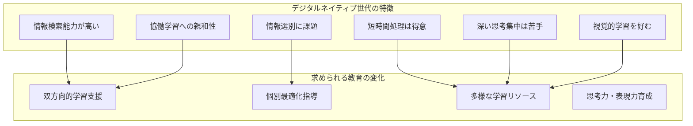

#### 大学入試や就職活動での生成AI活用の現実

大学入試制度も生成AIの影響を受け始めている。特に総合型選抜や学校推薦型選抜では、小論文や志望理由書の作成において生成AIを活用する受験生が増加しており、従来の評価基準だけでは対応が困難になっている。AO入試では研究計画書の作成にAIを使う受験生も現れ、面接対策においても想定問答の作成にAIを活用するケースが増えている。

就職活動においても同様の傾向が見られる。エントリーシート作成での生成AI支援、面接練習でのAIチャットボット活用、企業研究での情報収集・分析にAIを使用する学生が急速に増加している。これは単なる技術の活用を超えて、学生の就職活動そのものの質や方法を根本的に変化させている。

こうした状況により、教員は新たな課題に直面している。生徒がAIを使っているかどうかの判別が技術的に困難になり、AI活用の是非について明確な指導基準がない状態が続いている。また、従来の評価方法では生徒の真の能力を測ることが難しくなり、生徒への適切な指導法も確立されていないのが現状である。

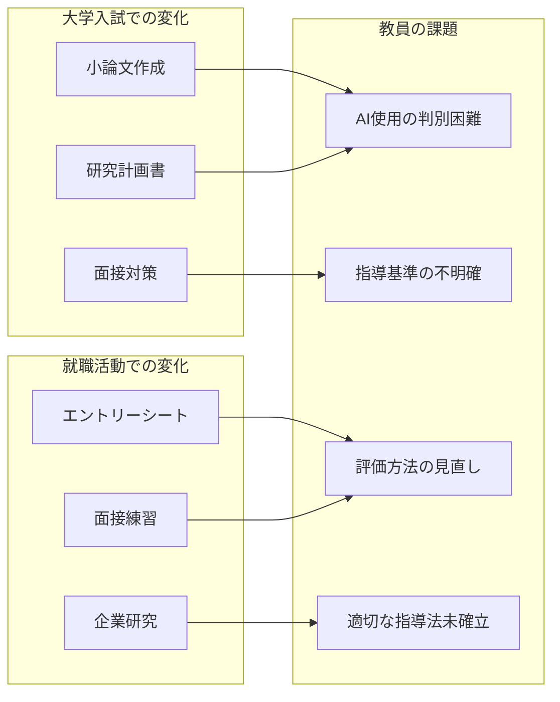

#### 社会で求められる新しいスキル

社会で求められるスキルも急速に変化している。21世紀型スキルとして、まず批判的思考力が重要視されている。これは生成AIが提供する情報や提案を鵜呑みにするのではなく、その妥当性や信頼性を適切に評価し、自分自身の判断で最終的な結論を導き出す能力である。次に創造性が求められる。AIが既存のパターンから回答を生成する一方で、人間には既存の枠を超えた独創的で革新的な発想力が期待されている。

協働性も現代社会で不可欠なスキルである。これは多様な背景を持つ人々、そしてAI技術とも効果的に協力し、チームとしてより大きな成果を生み出す能力を意味する。さらに、デジタルリテラシーは単にICTを操作できるだけでなく、その本質を理解し、教育や仕事の文脈で効果的に活用できる能力として再定義されている。

企業が求める人材像も大きく変化している。AIが多くの定型的な作業を担う時代において、企業は「人間ならではの価値」を持つ人材を強く求めている。これは感情的知性、倫理的判断力、複雑な人間関係の理解といった、AIでは代替できない能力を指す。同時に、AIを単なる脅威と捉えるのではなく、強力な道具として使いこなせる人材への需要も高まっている。重要なのは、AIの限界を正しく理解し、適切な場面で適切な方法で活用できる人材である。

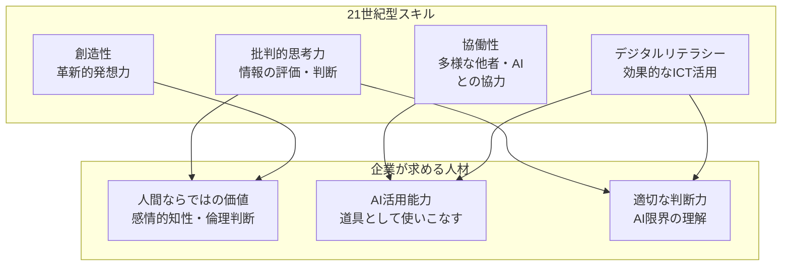

### 1.1.2 教員の働き方改革への貢献

#### 業務効率化の可能性

教員の業務効率化において、生成AIは大きな可能性を秘めている。最も時間を要する教材作成業務では、現在週10-15時間を費やしている作業を、AI支援により30-50%短縮することが可能である。具体的には、ワークシートのベース作成、小テスト問題の素案作成、授業資料の構成案作成、視覚的教材の企画立案などにおいて、AIが効率的な下書きや提案を提供できる。

文書作成業務においても大幅な効率化が期待できる。学級通信の構成案作成、保護者向け連絡文の文面調整、指導案の初期下書き作成、各種報告書のフォーマット作成などにおいて、AI支援により40-60%の時間短縮が可能とされている。ただし、最終的な内容の確認と調整は必ず教員が行い、人間らしい温かみや個別の配慮を加えることが重要である。

評価・フィードバック業務では、週8-12時間かかる作業のうち20-30%程度の効率化が見込まれる。所見コメントの下書き作成、個別指導計画のベース作成、学習状況データの基本分析などでAIを活用できるが、この分野では特に慎重な運用が必要で、最終的な判断や生徒への個別的な配慮は必ず教員が担う必要がある。

こうした効率化により創出される時間は、教育の本質的な価値を高める活動に充てることができる。生徒との個別対話時間の増加により、一人ひとりの悩みや興味関心により深く向き合えるようになる。また、教材研究により多くの時間をかけ、授業の質を根本から向上させることも可能になる。さらに、新しい授業方法の試行錯誤や、自己研鑽・スキルアップのための時間も確保でき、教員としての専門性を継続的に高めていくことができる。

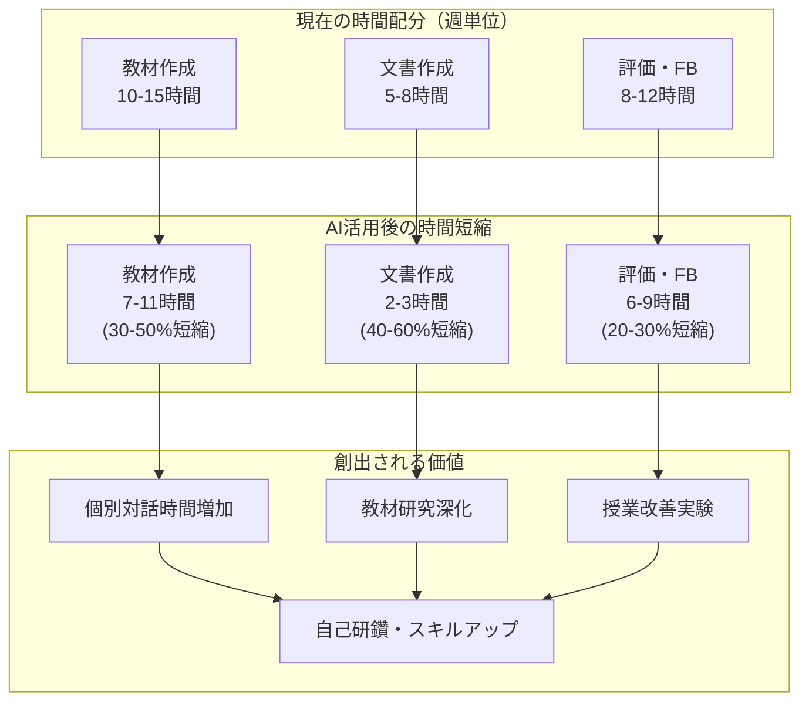

#### 創造的な教育活動への時間確保

教員本来の創造的業務への集中は、生成AI活用による最も重要な価値の一つである。現在の教育現場では、事務処理や定型業務に多くの時間が割かれ、教師が本来担うべき創造的で専門的な活動に十分な時間を確保できない状況が続いている。生成AIによる業務効率化は、この状況を改善し、教育の専門家として真に価値ある活動に集中できる環境を創造する。

- **生徒理解に基づく個別支援計画の策定**において、教師は生徒一人ひとりの学習状況、性格特性、家庭環境を総合的に理解し、最適化された支援計画を立案する必要がある。これは高度な教育的判断力と深い人間理解を要する創造的活動だが、現状では事務作業に追われ十分な時間を確保できない。生成AIが定型的なデータ整理や文書作成を支援することで、教師は生徒との対話により多くの時間を投資し、質の高い個別支援を実現できる。

- **革新的な授業方法の開発**は、教師の創造性が最も発揮される領域である。新しいアプローチの開発、ICT技術と教育理論の融合、アクティブラーニングの実践など、これらは教師にしかできない高度に創造的な業務である。生成AIによる業務支援により、教師は授業の創意工夫により多くの時間を投入でき、教育実践の革新と質的向上を実現できる。

- **教材の創意工夫**においても、生成AIは基礎的な情報整理や素材収集を効率化し、教師の創造性を増幅させる。どのような教材が効果的か、どのような提示方法が学習動機を高めるかという判断は、教師の専門性によってのみ実現される。AI支援により、教師は教材の教育的価値の検討や学習効果の最大化に集中でき、より創造的で効果の高い教材開発が可能になる。

- **同僚との協働による教育力向上**も重要な専門的業務である。実践事例の共有、課題解決への協働的取り組み、相互の授業参観など、これらの活動は学校全体の教育力を向上させる。生成AIによる業務効率化は、教師同士の専門的対話の時間を創出し、個人の創造性と組織の集合知が相乗効果を生み出す環境を実現する。

#### ワークライフバランスの改善

持続可能な教員キャリアの実現は、教育の質的向上にとって不可欠な課題である。現在の教育現場では、長時間労働の常態化により多くの教員が身体的・精神的疲労を抱え、職業への情熱と専門性を維持することが困難になっている。この問題は優秀な人材の教育現場離れを招き、教育全体の質的低下を引き起こす構造的課題となっている。

- **長時間労働の現状**として、多くの教員が週60時間を超える労働を常態的に行っている。授業時間数の増加、校務分掌の複雑化、保護者対応、部活動指導、ICT対応など複合的な要因により、この異常な労働環境が生まれている。疲労困憊した状態では、生徒一人ひとりに寄り添った指導や創意工夫に満ちた授業実践を継続することは困難である。

- **家庭生活との両立困難**は、特に子育て世代の教員にとって深刻である。平日の深夜帰宅、休日の部活動指導や持ち帰り仕事により、家族との時間や自己研鑽の時間が確保できない。教員自身が豊かな人生経験を持つことは優れた教育実践に不可欠だが、現状では読書や文化的活動など人間性を豊かにする活動の時間が取れない。

- **心身の健康への影響**も深刻で、慢性的な長時間労働により精神的疾患の発症率が他職種より高くなっている。教員の心身の不調は直接的に教育の質に影響し、学校運営にも支障をきたする。また、当初の教育への情熱を維持することが困難になり、職業満足度の低下や優秀な人材の流出を招いている。

- **生成AI活用による改善可能性**として、定型的な作業や文書作成の効率化により定時退勤の実現が期待できる。教材準備、採点作業、事務処理を学校内で効率的に完了できるようになることで、持ち帰り仕事を削減し、プライベート時間を確保できる。これにより、教員は心身の健康を維持しながら長期にわたって教育への情熱と専門性を発展させることが可能になり、個人の幸福向上と教育の質的向上を同時に実現できる。


## 1.2 高校教育現場の実情と課題

### 1.2.1 高校教員が直面する具体的課題

#### 授業・教材準備の負担

高校教員が直面する最も深刻な課題の一つが、授業・教材準備の膨大な負担である。一般的な高校教員は1日平均3-4コマの授業を担当しており、各授業50分に対して最低でも1-1.5時間の準備時間が必要とされている。これは決して過大な見積もりではなく、教材の準備、板書計画、生徒の反応予測、評価方法の検討などを含めた現実的な時間である。週20コマを担当する教員の場合、授業準備だけで週20-30時間を要し、これに授業実施、採点、校務分掌等を加えると、労働時間は容易に週60時間を超えてしまいる。

特に厳しいのは長期休暇中の状況である。生徒が休暇を過ごしている間も、教員は次学期の教材研究、新しい単元の準備、定期考査の作成などに追われ、実質的に休暇返上で業務に従事することが常態化している。これは単に時間の問題だけでなく、教員の心身の健康や職業への情熱維持に深刻な影響を与えている。

一方で、教育界では個別最適化学習への期待が高まっている。理想的には、生徒一人ひとりの理解度に応じた教材作成、個々の興味・関心を活かした課題設定、多様な学習スタイル（視覚型、聴覚型、体験型など）への対応が求められている。しかし現実には、40名を超える学級で個別対応を行うには限界がある。教材作成に十分な時間を確保できず、印刷費用や設備の制約により教材の多様化も困難である。さらに、個別対応を重視すると評価の公平性確保が難しくなるという新たな課題も生じている。

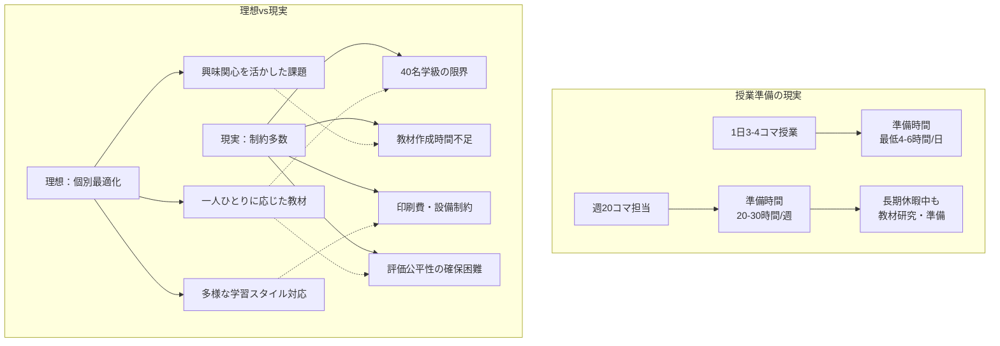
#### 定期考査問題作成・採点業務の重圧

定期考査問題作成・採点業務は、高校教員が抱える重圧の中でも特に深刻な負担となっている。年5回実施される定期考査において、担当する全ての教科・科目について質の高い問題作成を行うことは、想像以上の労力を要する作業である。

**問題作成の複雑な要求事項**
- 学習指導要領への準拠
- 適切な難易度配分の維持
- 生徒の理解度の正確な測定
- 重要概念の理解度を測る問題の設計
- 応用力を問う問題の配置
- 思考力・判断力・表現力を評価する問題の作成

問題作成の過程は極めて複雑で時間を要する。出題範囲の教材内容を詳細に分析し、各能力を適切にバランス良く評価できる問題構成を検討する必要がある。問題文の表現は生徒にとって理解しやすく、かつ曖昧さを排除した明確なものでなければならず、一つの問題を完成させるまでに何度もの推敲が必要である。特に記述式問題では、採点基準の明確化と部分点の配分も同時に検討する必要があり、これらの作業は深夜や休日に及ぶことも珍しくありない。

**採点業務の具体的な負担量**
```
採点作業量の実例：
■ 1クラス40名 × 3クラス = 120枚/回
■ 年5回実施 = 600枚/年間
■ 記述式問題：15-20分/枚
■ 1回の考査：30-40時間の採点作業
```

さらに困難なのは、**採点の公正性と一貫性の確保**である。
- 同じ内容の記述に対する評価の統一
- 採点日時や疲労度による評価のブレ防止
- 部分点配分の厳密な基準適用
- 生徒一人ひとりの解答の理解度の公正評価
- 採点ミス防止のための複数回見直し
- 進路への影響を考慮した責任ある評価

成績処理・分析業務においては、各生徒の得点を統計的に分析し、平均点、標準偏差、得点分布を算出した上で、絶対評価と相対的な位置づけの両方を考慮した成績評価を行わなければなりない。また、前回の成績との比較、学習内容別の理解度分析、個別の指導が必要な生徒の特定など、データに基づいた教育改善のための分析作業も求められる。

保護者・生徒への説明責任も重要な要素である。成績について質問や相談があった場合、なぜその評価に至ったのかを具体的かつ説得力のある形で説明する必要がある。この説明には、出題意図、採点基準、当該生徒の解答の特徴、改善のための具体的アドバイスなどが含まれ、高度な専門性と教育的配慮が求められる。これらの説明準備も、教員にとっては大きな時間的・精神的負担となっている。

#### ICT活用への社会的期待と現実のギャップ

#### ICT活用への社会的期待と現実のギャップ

ICT活用への社会的期待と現実のギャップは、現代の高校教員が直面する最も複雑で困難な課題の一つである。

**社会からの主要な期待事項**
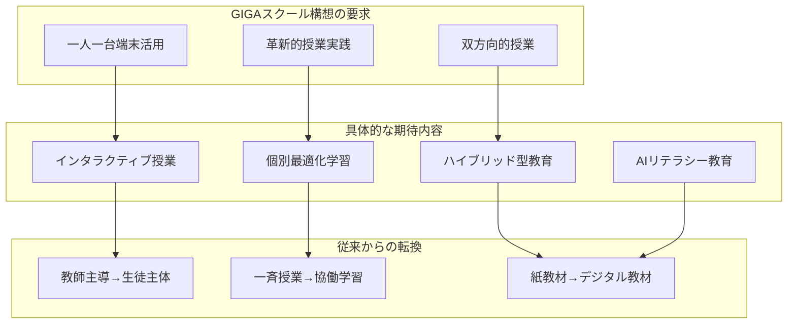

**新たに追加された期待領域**
- **AIリテラシー教育**の実施
- **AI技術を活用**した効率的な授業準備や評価
- **生徒がAIと適切に協働**できる能力の育成
- **ハイブリッド型教育**の実践能力
- **デジタル教材**の効果的活用

**現実のギャップ要因**

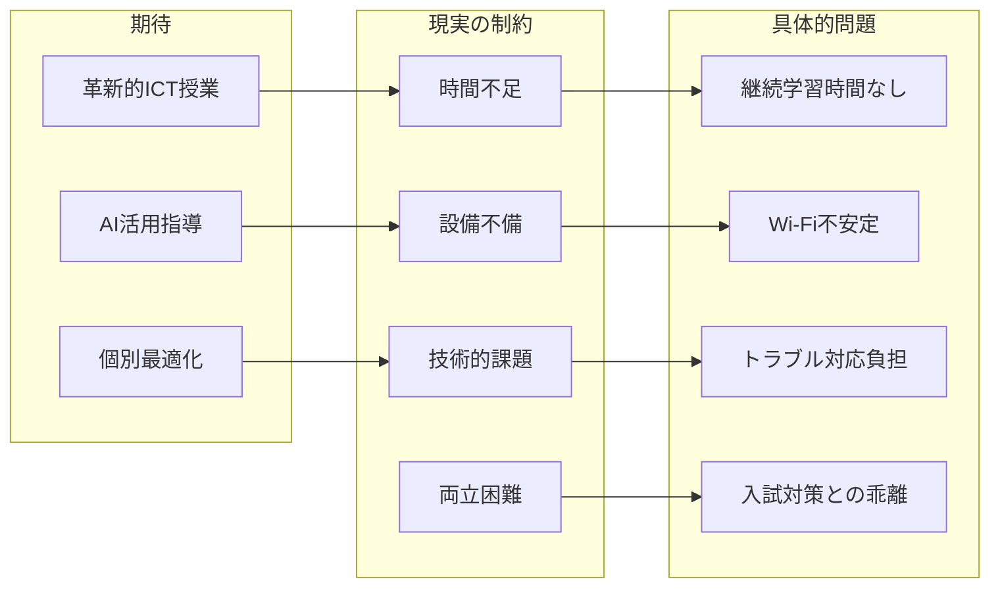

**主要な制約要因**

1. **時間的制約**
   - ICTスキル習得のための時間不足
   - 継続的アップデートの困難
   - 授業準備時間の大幅増加

2. **設備・環境の課題**
   - 校内Wi-Fi環境の不安定さ
   - 充電設備の不足
   - 故障時の代替機確保困難
   - ソフトウェアライセンス制限
   - 古い校舎の電力容量問題

3. **技術的課題**
   - 授業中のトラブル対応負担
   - 専門外の技術サポート要求
   - 授業計画への影響

4. **教育方法の両立困難**
   - ICT活用授業と従来型授業の使い分け基準不明
   - 入試対策（紙ベース）との乖離
   - 効果的な組み合わせ方法未確立

#### 多様化する生徒への対応

#### 多様化する生徒への対応

現代の高校教育現場では、生徒の多様化が著しく進んでいる。

**学力・学習意欲の多様化**
- **基礎学力不足生徒**: 中学校内容が未定着
- **標準レベル生徒**: 基本的な高校内容を学習
- **高学力生徒**: 難関大志望、発展的内容を求める
- **学習意欲の格差**: 明確な目標を持つ生徒～学習意味を見出せない生徒

**特別な支援を要する生徒の多様性**

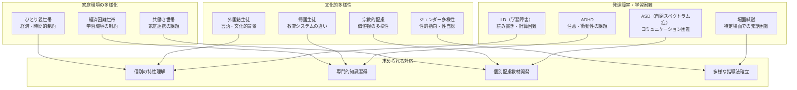

**教員に求められる対応**
- **個別の特性理解**: 一人ひとりの困難や強みの把握
- **専門的知識の習得**: 発達障害、文化的背景への理解
- **個別配慮教材の開発**: 特性に応じた教材・指導法の工夫
- **多様な指導方法の確立**: 全ての生徒が学べる授業設計
- **家庭との連携強化**: 多様な家庭状況に応じたコミュニケーション

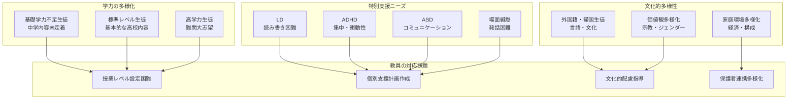

#### 不登校・別室登校生徒への学習保障

不登校や別室登校の生徒に対する学習保障は、現代の高校教育において避けて通れない重要な課題である。高校生の不登校者数は年々増加傾向にあり、年間30日以上欠席する生徒への適切な対応は、すべての高校教員が直面する可能性のある現実的課題となっている。

- **個別対応の複雑性**として、欠席の背景には心的外傷、対人関係の困難、学習不安、家庭環境の問題など一人ひとり異なる要因があり、画一的対応では効果を期待できない。教員は生徒の状況を慎重に把握し、スクールカウンセラーや保護者、外部機関と連携した個別学習計画の策定が必要である。欠席期間中の学習遅れを補う教材準備、理解度に応じた進度調整、評価方法の個別化など、通常業務とは異なる専門的対応が求められる。

- **学習機会確保の課題**では、教室での一斉授業参加が困難な生徒に同等の学習機会を提供する体制作りが必要である。保健室・相談室での個別指導、少人数別室授業、段階的教室復帰支援など、多様な学習形態の準備が求められる。しかし、これらの対応には追加的な人員配置や時間確保が必要で、限られた教育資源での実現は困難である。担任・教科担当者の業務負担増加も深刻な問題となっている。

- **オンライン学習システム**の活用では、単なるライブ配信では双方向コミュニケーションや個別支援が困難で、孤立感を深める可能性がある。録画授業提供、個別オンライン面談、チャット質問対応など多面的サポート体制が必要である。家庭のインターネット環境格差、機器操作習熟度、プライバシー保護など技術面の課題に加え、効果測定や評価方法、出席扱い基準設定などの制度整備も求められる。

- **段階的復帰支援**では、週1日登校、短時間授業参加、特定教科のみ出席など、心理的負担を考慮した柔軟なプログラム設計が重要である。養護教諭、カウンセラー、ソーシャルワーカー、保護者、医療機関との連携が不可欠だが、多忙な現場での効果的連携体制構築・維持は大きな挑戦である。復帰過程での挫折・後戻りへの対応策も含めた長期的・継続的支援体制の維持が求められている。

#### 進路指導の複雑化

大学入試制度の多様化により、進路指導業務が飛躍的に複雑化している。令和3年度の大学入学者選抜改革で、教員には従来とは全く異なる専門的知識と指導スキルが求められている。

- **選抜方法の多様化** - 一般選抜では「主体性・多様性・協働性」評価が重視され、学校推薦型選抜では推薦要件が複雑化し、総合型選抜では多面的・総合的評価への高度な対応が必要である。

- **共通テスト対応** - 従来のセンター試験と異なる出題形式に対し、複数資料の統合考察、図表読み取り、日常文脈での知識活用能力育成が求められ、授業方法の抜本的改革が必要である。

- **個別試験への対応** - 記述式・論述問題の増加により、思考力・判断力・表現力育成のための探究的学習活動や協働的問題解決の授業組み込みが必要だが、教材開発と指導技術習得に膨大な時間を要する。

- **推薦型選抜指導** - 学習成績に加え、部活動実績、資格取得、ボランティア活動など多岐にわたる要素の総合管理と、個性に応じた面接・小論文の本格的指導が必要である。

- **総合型選抜対応** - 志望理由書作成、課題レポート、プレゼンテーション指導など、従来の教科指導とは異なる専門性を要する長期的個別指導が不可欠となっている。

これらの高度で専門的な指導を限られた時間と人的資源で実現することは、現実的に極めて困難な課題である。

##### 就職指導における企業ニーズの変化

デジタル変革、働き方改革、グローバル化により、企業が求める人材像が根本的に変化し、従来の就職指導では対応困難な状況が生じている。

- **デジタルスキルの必須化** - 営業、経理、人事、製造など全職種でデジタル対応力が必須となり、単なるPC操作ではなく、デジタルツール活用による効率的業務遂行、データ分析による意思決定、AI技術との協働能力が求められている。しかし多くの教員は自身のデジタルスキルが不十分で、急速な技術進歩への対応も困難である。

- **課題解決能力の質的変化** - 定型業務処理能力から、複雑で曖昧な課題の分析・創造的解決策提案・チーム協働実行能力へと要求が変化した。知識伝達型から問題解決型・探究型学習指導への転換が必要だが、指導技術習得には相当な時間と専門研修を要する。

- **採用方式の多様化** - オンライン面接では技術的要素（カメラ映り、音声品質、画面共有、ネットワーク対応）が重要となり、AI面接システムでは表情・声のトーン・回答内容の総合分析に対応する必要がある。これらの新形式指導ノウハウは未確立で、手探り状態である。

- **就職先と働き方の多様化** - ITスタートアップ、グローバル企業、リモートワーク専門企業、フリーランスなど新しい雇用形態への対応や、国際的なビジネスマナー、異文化理解、多様性対応力など従来扱わなかった指導要素が必要となっている。

##### 保護者との進路方針のすり合わせ

生徒の進路希望多様化、保護者世代と現代雇用環境の相違、経済格差拡大により、従来の画一的進路指導では対応困難な複雑で繊細な課題となっている。

- **個別相談の急激な増加** - 「大学進学」「就職」の単純分類から、国公立・私立・専門職大学・海外留学や正社員・契約・派遣・フリーランス・起業など選択肢が多様化し、保護者は各選択肢の就職実績、企業安定性、奨学金制度など詳細で専門的情報を要求。情報収集・整理に膨大な時間を要し、限られた人的資源では対応限界がある。

- **価値観の世代間ギャップ** - 保護者の就職経験と現代雇用環境は大きく異なり、終身雇用崩壊、転職一般化、リモートワーク普及、ギグエコノミー拡大への理解獲得は困難である。「安定した大企業志向」の保護者と「やりがい・自分らしさ重視」の生徒間の価値観調整には、高度なコミュニケーション能力と調整技術が必要である。

- **期待値調整の困難** - 過度な期待や諦めが強い保護者と生徒の実際の能力・適性とのギャップ調整では、客観的評価データ提示、現実的選択肢提案、段階的合意形成など慎重で時間のかかる対応が必要である。

- **経済的配慮の複雑性** - デリケートな家計状況を扱いながら、奨学金・教育ローン・特待生制度など複雑で頻繁に変更される経済支援制度の最新情報把握と個別最適提案が求められ、教員の心理的負担も大きい困難な領域である。

##### 個別進路相談時間の確保困難

進路選択の重要性と選択肢の多様化・複雑化により、生徒一人ひとりに必要な相談時間と現実的に確保可能な時間との間に深刻なギャップが存在している。

- **相談時間の絶対的不足** - 適切な進路指導には一人あたり年間10-15時間が必要だが、担任30名担当時は週10時間相当となり、他業務と並行確保は現実的に不可能である。結果として年間2-3時間程度に制限され、表面的・形式的相談に留まり、深層的適性把握や適切アドバイス提供が困難である。

- **時期的集中による制約** - 3年生の9-12月期は推薦入試準備、出願準備、就職試験対策が集中し、教員の対応能力を大幅に超える需要が発生する。この時期的集中は24時間体制対応を強い、過労による健康問題と指導質低下を招く構造的問題となっている。

- **継続的フォローアップの困難** - 継続的フォローアップの時間的余裕がなく、早期設定した進路方針の状況適応ができず、生徒にとって最適でない選択のリスクが高まっている。進路決定後の心理的サポートや適応支援、卒業後相談も実施困難な状況である。

#### 校務・管理業務の増大

文部科学省や教育委員会から求められる各種調査・報告書作成が、教員の業務負担を大幅に増加させている。教育政策の立案や学校運営の改善を目的とする一方で、現場教員には日常的な教育活動に加えて膨大な事務処理時間を要求する重い負担となっている。

- **各種調査・報告書作成の負担** - 年間数十件の調査では、生徒学習状況、学校取り組み実績、施設設備状況、教員研修実績など多岐にわたる正確で詳細なデータ収集・分析・報告書作成が求められる。異なる形式や提出期限が設定され、継続的な管理と対応が必要である。

- **学校評価・自己点検業務** - 学校運営全般の詳細な現状分析、課題抽出、改善計画策定、実施状況評価の一連プロセス文書化が必要である。学校教育の質的向上を図る重要な取り組みだが、分析と報告書作成に相当な時間と労力を要する。

- **学習指導要領対応報告** - 新学習指導要領の実施状況、カリキュラム改善状況、評価方法変更点の詳細報告が求められ、生徒指導・進路指導実績では個別指導記録の集計・分析と効果的指導方法の改善点整理が必要である。これらの業務は授業準備や生徒指導時間を大幅削減し、教育活動の本質部分への影響が懸念されている。

#### 保護者対応の多様化・複雑化

情報化社会の進展と保護者の教育意識向上により、従来の学校訪問・電話連絡中心から多様化・複雑化・常時化した対応が求められている。教員の業務負担増加と職務満足度への深刻な影響が懸念される現代的課題である。
- **相談内容の拡大と個別対応の増加** - 家庭内で解決していた学習面・友人関係・進路選択・生活習慣の問題も学校への相談対象として持ち込まれ、個別相談件数が大幅に増加している。継続的で複数回にわたる対応が必要なケースが増え、一件あたりの時間と労力が増大している。

- **デジタル通信による常時対応化** - メールやLINE等のデジタル通信普及により、24時間365日の連絡可能性が生まれ、教員のプライベート時間との境界が曖昧化している。文書記録が残るため慎重で丁寧な表現が求められ、一通のメール作成にも相当な時間を要し、対面での細やかなニュアンス伝達が困難で誤解やトラブルの原因となるケースも増加している。

- **高品質サービスへの期待と理不尽要求** - 社会全体のサービス品質向上と保護者の権利意識高まりにより、教育内容・指導方法・施設環境・安全管理・個別対応など全面において高品質でカスタマイズされた対応が期待されている。理不尽な要求や感情的批判に直面する場面も増加し、教育的判断より保護者対応を優先せざるを得ない状況が生じ、教員の職務満足度と継続意欲に深刻な影響を与えている。

#### 研修参加義務と授業時数確保の両立

教員免許更新制廃止後の新研修制度では、キャリアステージに応じた継続学習が義務化され、現代教育課題対応の義務研修が年々増加している。授業との両立が困難な構造的課題を抱える現代的問題である。
- **義務研修の増加と受講管理の複雑化** - ICT・人権・生徒指導・安全指導研修など現代教育課題対応の義務研修が年々増加している。実施時期や受講方法の選択肢が限定され、通常授業スケジュールとの調整が困難で、個々教員の受講管理も複雑化している。

- **授業代替と学校運営への影響** - 研修は多くが平日勤務時間内実施のため、通常授業を他教員が代替するか自習にせざるを得ない状況が生じる。小規模校では一人の研修参加が他教員の負担大幅増を招き、学校全体の教育活動に支障をきたし、専門性高教科では適切な代替教員確保が困難で、生徒学習への直接影響が懸念される。

- **自己研鑽時間の圧迫と専門性発達への影響** - 義務研修増加により、教科専門性向上や新指導方法習得など教員が主体的に取り組むべき自己研鑽時間が圧迫され、教員の自律的専門性向上阻害と画一化された研修内容への依存助長の危険性が指摘されている。

### 1.2.2 生成AI導入への期待と不安

多忙を極める現代の高校教員にとって、生成AI技術の教育現場への導入は、大きな期待と同時に深刻な不安をもたらす両面性を持った変革として受け止められている。この新技術に対する教員の複雑な心境は、単なる技術的な問題を超えて、教育の本質的価値や教師としての役割に関わる根本的な問いを提起している。生成AI導入への反応は教員によって大きく異なり、積極的な期待を示す者もいれば、慎重な姿勢を取る者、さらには強い懸念を表明する者まで、多様な立場が存在する。

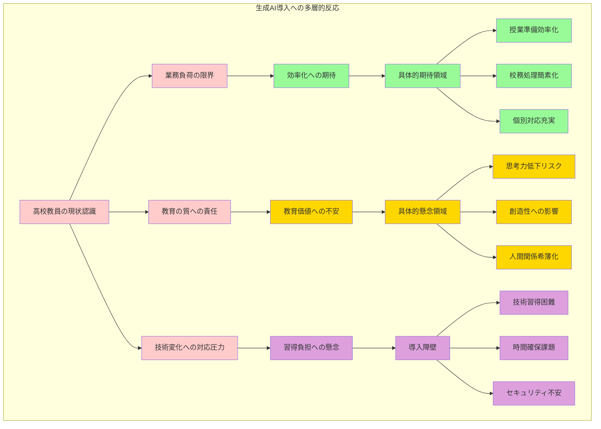

#### 業務効率化への期待

高校教員が生成AIに寄せる最も強い期待は、日常業務の効率化による時間的余裕の創出である。この期待は、現在の過重労働状況に対する切実な改善願望から生まれており、単なる便利さの追求ではなく、教育の本質的部分により多くの時間とエネルギーを注げるようになることを目指している。

- **授業準備における効率化期待**
　授業準備の分野では、ワークシート作成の時間短縮が最も期待される効果として挙げられている。従来であれば、生徒の理解度や興味に応じた多様なワークシートを作成するためには、相当な時間を要していた。生成AIを活用することで、基本的な構成やアイデアを迅速に生成し、それを教師の専門的判断で調整・完成させることが可能になると期待されている。また、問題作成の効率化により、定期考査や小テスト、宿題用の問題を多様なパターンで作成できるようになり、生徒の習熟度に応じた個別対応も実現しやすくなると考えられている。
　教材アイデアの拡充については、教師一人では限界のある発想やアプローチを、AIとの協働により大幅に広げることができると期待されている。特に、他教科との連携や実社会との関連付け、時事問題の教材化などにおいて、AIの豊富な知識データベースが有効活用できると考えられている。個別対応教材の作成においては、特別な支援が必要な生徒や、特定の分野で困難を抱える生徒向けの専用教材を、効率的に作成できることへの期待が高まっている。

- **校務処理における効率化期待**
　校務処理の分野では、文書作成の迅速化が最も具体的な期待として挙げられている。保護者向けの通知文、各種報告書、会議資料、企画書などの作成において、基本的な構成や文章の骨格をAIに生成させ、それを教師の意図や学校の実情に応じて調整することで、大幅な時間短縮が可能になると考えられている。定型業務の自動化については、出席管理、成績処理、各種調査への回答など、ルーチン的な作業をAIが支援することで、より創造的で教育的価値の高い業務に集中できる時間を確保できると期待されている。
　データ分析の簡素化では、生徒の学習データや学校運営データの分析をAIが支援することで、これまで専門的な知識が必要だった統計分析や傾向把握が、一般の教員にも利用しやすくなると期待されている。コミュニケーション支援においては、保護者との連絡や同僚との情報共有において、適切な表現や効果的な伝達方法をAIが提案することで、誤解やトラブルの減少につながると考えられている。

#### 教育の質への影響不安

生成AI導入に対する教員の不安は、技術的な問題よりも、教育の根本的価値や生徒の人格形成に与える影響に関するものが中心となっている。これらの懸念は、長年の教育経験に基づく専門的な洞察から生まれており、単なる技術への恐れではなく、教育者としての責任感の表れでもある。

- **生徒の思考力低下への深刻な懸念**
　最も大きな不安として挙げられるのは、AIへの過度な依存により生徒の自主的思考力が衰える可能性である。教員たちは、生徒が困難な問題に直面した際に、まず自分で考えるという習慣を身につけることの重要性を熟知している。しかし、簡単にAIから答えを得られる環境では、生徒が思考の過程を省略し、結果のみを求める傾向が強まる恐れがある。この懸念は特に、論理的思考力や問題解決能力の育成が重視される数学や理科、批判的思考力が必要な国語や社会科において深刻に受け止められている。
　思考力の低下は、単に学習面での問題にとどまらず、将来的な社会生活での判断力や創造性にも影響を及ぼす可能性がある。AIが提供する「正解」に慣れすぎることで、複雑で多面的な現実の問題に対して、単純で画一的な解決策を求める傾向が強まることを教員たちは危惧している。

- **創造性と個性への悪影響の懸念**
　生成AIの回答が持つ画一性により、生徒の個性的な発想や創造的な表現が抑制される可能性への懸念も強く表明されている。特に国語科での文章表現、美術や音楽での創作活動、総合的な探究の時間での研究活動において、AIが生成する「模範的」な内容が、生徒の独自性や創造性の発達を阻害するのではないかという不安がある。
　教員たちは、生徒一人ひとりが持つ独特の視点や感性こそが教育の最も重要な成果であると考えており、それがAIの標準化された回答により均質化されることを強く懸念している。また、創作活動における試行錯誤の過程や、失敗から学ぶ経験の価値が、AIによる効率的な解決により失われることも重要な問題として認識されている。

- **人間関係とコミュニケーション能力への影響**
　AI対話の増加により、生徒の対人コミュニケーション能力が低下する可能性への不安も大きな懸念事項である。高校時代は人格形成の重要な時期であり、同級生や教師との直接的な対話を通じて社会性や共感力を育成することが不可欠だと考えられている。AIとの対話が人間同士の対話を代替するようになれば、相手の感情を読み取る力、適切な言葉を選ぶ力、話し合いによる合意形成の力などが十分に育成されない可能性がある。
　さらに、AIが常に肯定的で忍耐強い反応を示すため、現実の人間関係で必要となる困難な状況への対処能力や、意見の対立を建設的に解決する力が育成されにくくなることも懸念されている。

- **学習意欲と探究心への影響**
　簡単に答えが得られる環境により、生徒の学習意欲や探究心が萎縮する可能性への不安も表明されている。教員たちは、「知りたい」という欲求から始まる主体的な学習こそが、真の理解と成長につながると信じている。しかし、AIが即座に詳細な回答を提供することで、生徒が自ら調べ、考え、発見する喜びを体験する機会が減少する可能性がある。
　また、困難な問題に粘り強く取り組む忍耐力や、わからないことを恥ずかしがらずに質問する勇気なども、AIへの依存により育成されにくくなることが懸念されている。これらの能力は学習面だけでなく、将来の職業生活や人生全般において重要な資質であるため、教員たちの不安は深刻なものとなっている。

#### 技術習得への負担感

生成AI技術の導入において、多くの教員が感じる重要な障壁の一つが、新しい技術習得に伴う負担感である。この負担感は単なる技術的な困難を超えて、現在の過重労働状況の中で新たな学習に取り組むことの現実的困難さを反映している。

- **技術的スキル習得の複合的困難**
　新しい操作方法の習得については、多くの教員が既存の業務で手一杯な状況において、さらに新しいシステムの操作を覚える必要があることに負担を感じている。特に、デジタル技術に不慣れな教員にとっては、基本的な操作から始まり、各種設定、アカウント管理、セキュリティ対策まで、学ぶべき内容が膨大に感じられる。また、生成AIサービスは頻繁にアップデートされるため、一度覚えた操作方法も継続的に更新していく必要があり、この継続性への不安も大きな要因となっている。
　適切なプロンプト（指示文）の作成技術は、生成AIを効果的に活用するための核心的なスキルだが、これまでの教育経験にない新しい種類の技能であるため、多くの教員が習得の困難さを感じている。単に質問をするのではなく、AIが教育的に価値のある回答を生成するための具体的で適切な指示を作成することは、技術的理解と教育的専門性の両方を必要とする高度なスキルである。
　生成結果の品質判断能力については、AIが生成した内容の正確性、適切性、教育的価値を迅速かつ的確に評価する能力が求められる。これは従来の教材選択や内容評価とは異なる新しい専門性であり、AIの特性や限界を理解した上での批判的判断力が必要である。

- **時間確保と学習継続の現実的困難**
　学習時間の確保困難は、現在の教員の働き方の中で最も深刻な問題の一つである。日常の授業準備、校務処理、生徒指導、部活動指導などで既に時間的余裕のない教員にとって、新しい技術学習のための時間を捻出することは極めて困難である。勤務時間内での学習は現実的でなく、私的時間を充てる必要があることも、大きな負担として感じられている。
　試行錯誤の時間不足については、新しい技術を実際に使いこなせるようになるためには、十分な実践と経験が必要だが、そのための時間が確保できない現実がある。授業での実際の活用を考えれば、事前に十分な練習と検証が必要だが、そのための時間的余裕がないことが、導入への躊躇につながっている。
　同僚との情報共有機会不足は、個人的な学習の限界を示している。新しい技術の習得においては、同僚との経験共有や相互支援が非常に有効だが、教員同士の情報交換の時間も十分に確保されていない現状がある。また、技術習得のレベルや関心の差により、効果的な情報共有が難しい場合も多くある。
　継続的なスキルアップの困難は、一度基本的な使い方を覚えても、それを維持・発展させていくことの困難さを表している。技術の進歩に合わせて常に学習を続ける必要がある一方で、日常業務の忙しさにより継続的な学習が困難になり、結果として技術を十分に活用できないまま終わってしまうことへの不安がある。

#### セキュリティへの懸念

生成AI導入における最も重要で現実的な課題の一つが、情報セキュリティとプライバシー保護に関する懸念である。学校現場では生徒の個人情報や機密性の高い教育データを日常的に扱うため、これらの情報が適切に保護されることは絶対的な要求事項となっている。

- **生徒の個人情報保護への深刻な懸念**
　教員が最も強く懸念しているのは、生徒の個人情報が意図せずに外部に流出する可能性である。生成AIサービスの多くはクラウドベースで動作し、入力された情報が外部サーバーで処理されるため、学習記録、健康情報、家庭環境、行動記録などの機微な情報が第三者によってアクセスされる可能性がある。特に、個別指導や生徒相談において、生徒の具体的な状況をAIに相談したい場面で、どこまでの情報を入力して良いのか、その判断基準が明確でないことが大きな不安材料となっている。
　また、生成AIサービスによっては、入力されたデータが今後のAI学習に使用される可能性があり、生徒の情報が匿名化されたとしても、AIシステムの改善に利用されることへの倫理的な問題も指摘されている。保護者への説明責任や同意取得の必要性についても、明確なガイドラインが存在しない現状では、教員個人の判断に委ねられることが多く、重い責任感と不安を感じる要因となっている。

- **学校組織としての情報管理責任**
　学校の機密情報の取り扱いについては、教育方針、人事情報、予算情報、他校との比較データなど、組織として保護すべき情報をAIサービスに入力することのリスクが懸念されている。これらの情報が競合他校や地域社会に漏洩した場合の影響は深刻であり、学校の信頼性や運営に重大な損害をもたらす可能性がある。
　外部サービス利用時のデータ流出リスクについては、サービス提供会社のセキュリティ体制への信頼性、データの保存期間と削除方針、海外サーバーでの処理に伴う法的管轄権の問題など、教員個人では判断困難な専門的課題が多数存在する。また、サービスの利用規約や プライバシーポリシーは頻繁に変更される可能性があり、継続的な監視と対応が必要なことも負担となっている。

- **制度的支援体制の不備による不安**
　教育委員会や学校レベルでのガイドライン不備は、現場教員にとって最も切実な問題である。生成AI活用の可否、利用可能なサービスの種類、入力禁止情報の具体的範囲、問題発生時の対応手順など、教員が安心してAIを活用するために必要な指針が十分に整備されていない現状がある。この状況では、教員が個人の判断でAI活用を進めることになり、問題が発生した場合の責任の所在が不明確になることへの不安が常につきまといる。
　また、技術的なトラブルや情報漏洩が発生した際の学校としての対応体制、保護者や地域への説明責任、関係機関への報告義務なども明確化されていないため、教員は常に「何かあったらどうしよう」という不安を抱えながらAIを使用する状況にある。このような制度的支援の不備は、AI活用の教育的メリットを理解していても、実際の導入に踏み切ることを困難にする重要な要因となっている。

## 1.3 本書の目的と活用方法

### 1.3.1 本書で学べること

#### 基礎知識から実践まで

#### 基礎知識から実践まで

本書は、高校教員の皆様が生成AIを安全かつ効果的に教育活動に取り入れられるよう、**4段階の学習設計**を採用している。

**学習段階の概要**

| 段階 | 章 | 内容 | 重要ポイント |
|------|-----|------|------------|
| **理解** | 1-2章 | 基本概念・意義・課題把握 | **認知負債**リスクの理解 |
| **導入** | 3章 | サービス選択・設定・環境構築 | セキュリティと個人情報保護 |
| **実践** | 4-7章 | 日常業務での具体的活用 | 教育的価値の向上 |
| **発展** | 8-10章 | リスク管理・応用技術 | 持続可能な運用体制 |

**各段階の詳細**

**🔍 第1段階：理解（第1-2章）**
- 生成AIの基本概念の正確な理解
- 教育現場での意義と課題の把握
- **認知負債**概念の理解（過度依存による思考力低下リスク）
- 健全な活用の土台づくり

**⚙️ 第2段階：導入（第3章）**
- 教育現場に適したサービスの選択方法
- セキュリティ設定の具体的手順
- 基本的な使用方法の習得
- 安全な利用環境の構築
- 個人情報保護と学校規則との整合性確保

**💡 第3段階：実践（第4-7章）**
- 授業準備での具体的活用方法
- 校務効率化の実践技術
- 生徒指導における活用事例
- 単なる効率化を超えた教育的価値の向上
- 生徒の学びを豊かにする活用法

**🚀 第4段階：発展（第8-10章）**
- リスク管理とトラブル対応の体系的習得
- より応用的な活用技術の修得
- 学校組織全体での持続可能な運用体制構築
- 長期的な活用戦略の策定

これらの期待と不安が複雑に入り交じる中で、高校教員にとって重要なのは、生成AI技術を盲目的に受け入れるのでも拒絶するのでもなく、教育の本質的価値を堅持しながら、技術の利点を適切に活用する方法を見つけることである。本書では、これらの期待を現実のものとし、不安を適切に管理するための具体的な方法論を提供する。

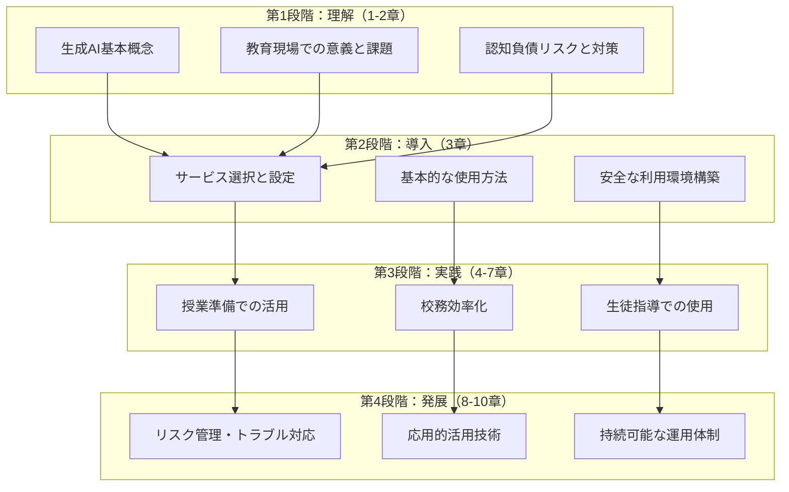

#### 具体的な活用事例

#### 具体的な活用事例

**教科別・場面別の実践例**

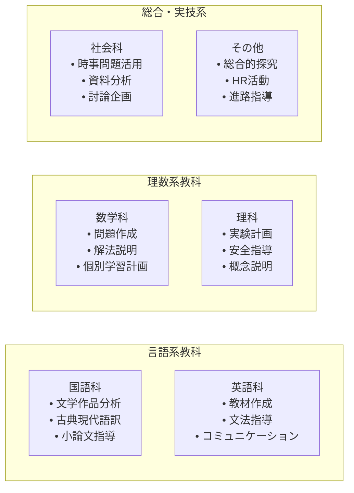

**活用場面の分類**
- **授業準備**: 教材作成、問題作成、説明資料準備
- **授業実践**: リアルタイム支援、個別対応、活動企画
- **評価・分析**: 採点支援、学習分析、フィードバック作成
- **校務・事務**: 文書作成、データ分析、コミュニケーション支援

#### リスク管理と倫理的配慮

#### リスク管理と倫理的配慮

**安全な活用のための知識体系**

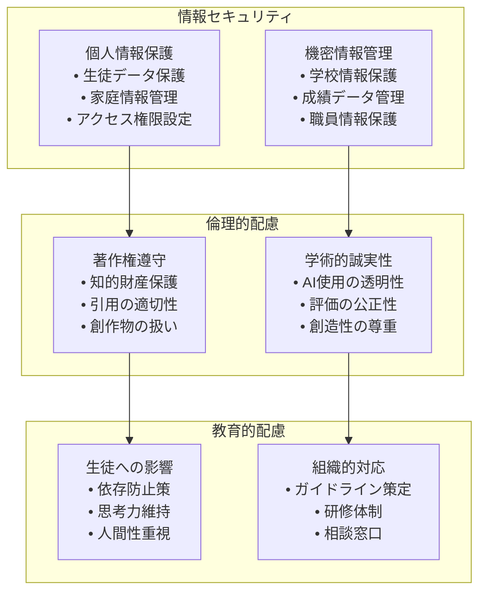

**重要な管理領域**
- 🔐 **情報セキュリティ**: データ保護、アクセス管理、漏洩防止
- ⚖️ **倫理的配慮**: 著作権、学術誠実性、創造性の尊重
- 👥 **教育的配慮**: 生徒への悪影響防止、健全な成長支援
- 🏫 **組織的対応**: 学校全体でのルール策定と体制構築

#### 認知負債の予防と対策

#### 認知負債の予防と対策

**持続可能な活用のための仕組み**

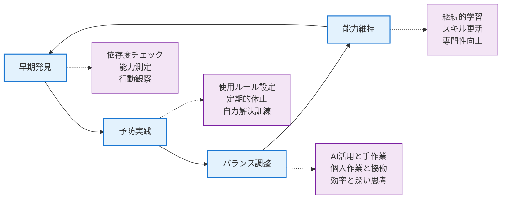

**具体的な対策方法**

| 段階 | 取り組み内容 | 実践方法 |
|------|-------------|----------|
| **早期発見** | 依存度チェック | 定期的な自己診断・同僚観察 |
| **予防実践** | 使用ルール設定 | AIフリーデー・手作業日の設定 |
| **バランス調整** | 適切な使い分け | 場面に応じた活用方針の明確化 |
| **能力維持** | 継続的成長 | 専門性向上・新しい学習の継続 |

**認知負債の具体的サイン**
- ❌ AIなしでは作業を開始できない
- ❌ 自分で考える前にすぐAIに頼る
- ❌ AI回答をそのまま使用することが増加
- ❌ 専門的判断力の低下を感じる
- ❌ 創造的思考の機会が減少

### 1.3.2 効果的な読み進め方

#### 章ごとの学習目標

**第1章：現状理解と動機形成**
- 生成AI活用の必要性を納得する
- 自分の課題と期待を明確にする
- 学習への意欲を高める

**第2章：基礎知識の確実な習得**
- 生成AIの仕組みと特性を理解する
- 認知負債のリスクを正しく認識する
- 適切な活用の土台を築く

**第3章：実践的な導入準備**
- 適切なサービスを選択する
- 安全な環境を構築する
- 基本的な操作を習得する

**第4-7章：段階的な実践スキル習得**
- 各場面での具体的活用法を身につける
- 試行錯誤を通じて上達する
- 自分なりの活用スタイルを確立する

**第8-10章：持続可能な運用体制構築**
- リスク管理能力を身につける
- 長期的な視点で計画を立てる
- 継続的な改善サイクルを構築する

#### 実践的な演習の取り組み方

効果的な学習を実現するため、本書では5段階の学習サイクルを推奨している。

**第1段階「理解」** では、各章で紹介される概念と原理をしっかりと学習する。単に表面的な知識を得るのではなく、なぜそのアプローチが必要なのか、どのような教育的根拠があるのかを深く理解することが重要である。

**第2段階「体験」** では、学習した内容を簡単な課題で実際に試してみる。例えば、基本的なプロンプト作成や簡単な教材作成から始めることで、理論と実践を結びつける。失敗を恐れずに、小さな実験から始めることがポイントである。

**第3段階「応用」** では、実際の教育業務において学習内容を活用する。授業準備、校務処理、生徒対応など、日常的な業務の中で生成AIを使ってみることで、実践的なスキルを身につける。

**第4段階「振り返り」** では、活用結果を客観的に評価し、改善点を見つける。効率化の効果、教育的価値の向上、生徒の反応などを総合的に検証し、より良い活用方法を模索する。

**第5段階「発展」** では、基本的な活用に慣れた後、より高度で創造的な活用方法に挑戦する。このサイクルを繰り返すことで、継続的な成長と改善を実現できる。


#### 継続的な学習のコツ

**習慣化のポイント**
- 毎日少しずつでも触れる時間を確保
- 小さな成功体験を積み重ねる
- 困ったときは躊躇せず相談する
- 学習記録をつけて進歩を可視化する

#### 同僚との協働学習の方法

**効果的な情報共有**
- 月1回程度の勉強会開催
- 成功事例・失敗事例の共有
- 疑問点の相互解決
- 学校全体での取り組み体制構築

### 1.3.3 本書の使い方（読者タイプ別ガイド）

#### 慎重派の先生方（ベテラン・管理職中心）

- **推奨学習順序**: 第1章→第2章→第8章→第3章→第4章
- **学習時間**: 週1-2時間、3ヶ月かけて段階的に
- **重点章**: 第2章（認知負債）、第8章（リスク管理）

**学習アプローチ**
```
安全第一の段階的導入：
□ まず理論的背景をしっかり理解
□ リスクと対策を十分に検討
□ 同僚と相談しながら慎重に進行
□ 小さな成功体験から徐々に拡大
□ 生徒への影響を常に観察・評価
```

**実践開始のタイミング**
- 安全性を十分確認してから
- 簡単な個人的業務から開始
- 効果を実感してから授業で活用
- 周囲の理解を得ながら段階的展開

#### 実践派の先生方（中堅教員中心）

- **推奨学習順序**: 第1章→第3章→第4章→第6章→第2章→第8章
- **学習時間**: 平日夜1-2時間、2ヶ月で習得
- **重点章**: 第4章（授業準備）、第6章（校務効率化）

**学習アプローチ**
```
効果測定重視の実用的活用：
□ 具体的な効果測定指標を設定
□ 明日から使える技術を優先習得
□ 業務改善効果を定量的に評価
□ PDCAサイクルによる継続改善
□ 他の教員への普及活動も視野
```

**実践開始のタイミング**
- 第3章学習後すぐに簡単な活用から開始
- 効果を感じたら積極的に活用範囲拡大
- 同僚への情報共有・指導も積極的に

#### 探究派の先生方（若手・技術系中心）

- **推奨学習順序**: 第2章→第3章→第5章→第9章→第10章→第4章→第8章
- **学習時間**: 平日夜2-3時間、1.5ヶ月で集中習得
- **重点章**: 第3章（技術詳細）、第10章（将来展望）

**学習アプローチ**
```
技術理解重視の高度活用：
□ 生成AIの技術的背景も深く理解
□ 最新動向・研究成果にも関心
□ 実験的・先進的活用にも挑戦
□ 独学とコミュニティ活用を両立
□ 学校のIT化推進リーダーを目指す
```

**実践開始のタイミング**
- 学習と並行して積極的に実験
- 高度な活用にも躊躇なく挑戦
- 新しい手法の開発・共有も積極的

#### 感性派の先生方（芸術・表現系中心）

- **推奨学習順序**: 第1章→第2章→第7章→第4章→第8章→第5章
- **学習時間**: 週末2-3時間、2-3ヶ月でじっくり
- **重点章**: 第2章（価値観整理）、第7章（生徒指導）

**学習アプローチ**
```
人間性重視の価値観両立型活用：
□ 教育的価値を最重視した活用
□ 人間の感性・創造性を決して軽視しない
□ AI活用と人間らしさの調和を追求
□ 生徒の心の成長を最優先に考慮
□ 同僚との対話を通じて価値観を深化
```

**実践開始のタイミング**
- 教育的意義を十分理解してから慎重に開始
- 人間らしさを損なわない範囲での活用
- 生徒の反応を細やかに観察

#### 管理職の先生方

- **推奨学習順序**: 第1章→第8章→第10章→第2章→組織導入検討
- **学習時間**: 週末3-4時間、1ヶ月で全体把握
- **重点章**: 第8章（組織運営）、第10章（戦略的導入）

**学習アプローチ**
```
組織運営・戦略的視点の活用：
□ 学校全体の教育効果向上を目指す
□ 教員の働き方改革への貢献を重視
□ リスク管理と安全性確保を最優先
□ 段階的で持続可能な導入計画を策定
□ 予算・人材・研修の総合的検討
```

**実践開始のタイミング**
- 個人的体験を積んでから組織導入検討
- 教員の意見を十分聞いて慎重に判断
- パイロット導入による効果検証から開始

## 1.4 この章のまとめ

### 重要ポイント

1. **環境変化への対応の必要性**
   - デジタルネイティブ世代の生徒への対応
   - 入試・就職での生成AI活用の現実
   - 21世紀型スキル育成の重要性

2. **教員の負担軽減と質向上の両立**
   - 業務効率化による時間創出
   - 創造的な教育活動への集中
   - 持続可能な教員キャリアの実現

3. **現場課題の現実的理解**
   - 授業準備・教材作成の時間圧迫
   - 多様化する生徒への対応困難
   - 校務負担の増大と複雑化

4. **期待と不安のバランス**
   - 適切な期待値設定の重要性
   - リスク認識と対策の必要性
   - 段階的・計画的導入の価値

### 実践チェックリスト

**現状理解**
```
□ 自分の教育現場の課題を具体的に認識した
□ 生成AI活用への期待と不安を整理した
□ 学習の動機と目標を明確にした
□ 自分の学習タイプを把握した
```

**学習準備**
```
□ 読み進め方を自分なりに計画した
□ 学習時間を確保する方法を決めた
□ 同僚との協働学習体制を検討した
□ 継続学習への意欲を確認した
```

### 次章への準備

次章では、生成AIの技術的な基礎知識と、教育現場での活用において最も重要な「認知負債」のリスクについて詳しく学びる。

**第2章で学ぶこと**
- 生成AIの基本的な仕組みと特性
- 認知負債とは何か、なぜ危険なのか
- 教育現場での適切な活用原則
- ハルシネーション等のリスクと対策

**準備しておくこと**
- 自分の教科・担当業務での活用イメージ
- 生徒への影響についての関心事項
- 技術に対する不安や疑問点
- 教育における価値観の再確認

---

:::message
第1章を読み終えたら、なぜ生成AIを学ぶのか、どのように活用したいのかを改めて整理してみましょう。目的が明確になることで、以降の学習がより効果的になる。不安がある場合は、同僚や管理職と相談することから始めても構いない。
:::
