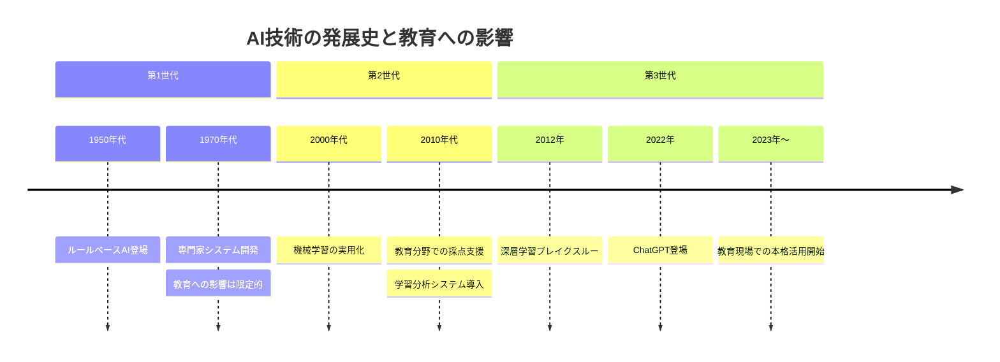
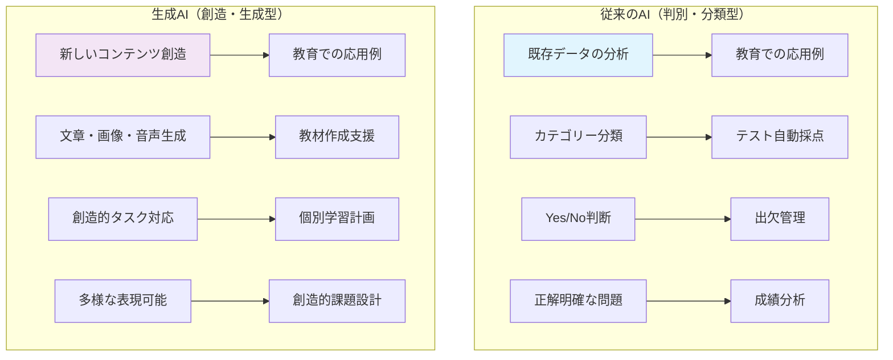
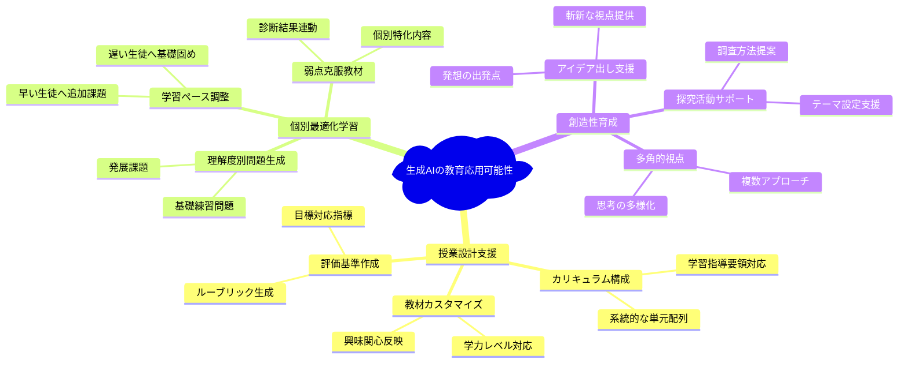
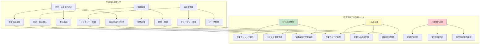
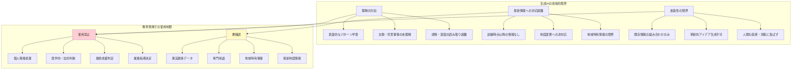
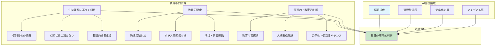

# 生成AIの基礎知識と認知負債の理解

## この章の目的

生成AIの技術的な仕組みと特性を正しく理解し、同時に過度な依存によって生じる「認知負債」のリスクを深く認識する。教育現場での適切な活用のための土台として、AIの可能性と限界を科学的に把握し、健全で持続可能な活用方法を確立していく。

:::message
**認知負債とは**: 生成AIなどの技術に過度に依存することで、本来持っていた思考力や判断力が徐々に低下するリスクを指する。この章では、このリスクを理解し、予防する方法を重点的に学習する。
:::

## 2.1 生成AIとは何か

### 2.1.1 人工知能と生成AIの違い

#### AI技術の発展史

人工知能（AI）の歴史は1950年代に遡りますが、教育現場に大きな影響を与えるようになったのは比較的最近のことである。AIの発展を理解することで、現在の生成AIがどのような位置づけにあるのかを把握できる。

AI技術は大きく3つの世代に分けて考えることができる。第1世代は1950年代から始まったルールベースAIである。これは人間が事前に定めた明確なルールに従って動作するシステムで、チェスプログラムや医療診断を支援する専門家システムなどが代表例である。しかし、このタイプのAIは人間が想定していない状況には対応できないという根本的な限界があった。

第2世代は2000年代から本格化した機械学習の時代である。これは大量のデータからパターンを自動的に学習する技術で、迷惑メールフィルターや画像認識システムなどに使われました。教育分野では、テストの自動採点や学習履歴の分析などに応用され始めました。この時代から、AIは人間が直接プログラムしたルール以外の判断もできるようになりました。

第3世代は2010年代から現在に続く深層学習・生成AIの時代である。人間の脳の神経回路を模した複雑なネットワーク構造を持ち、インターネット上の膨大なデータから高度なパターンを学習する。ChatGPTのような文章生成AI、画像生成AI、高精度な音声認識システムなどがこの世代の代表例で、現在教育現場で注目されている生成AIはここに位置する。



#### 生成AIの特徴

生成AIは、従来のAIとは根本的に異なる特徴を持っており、この違いを理解することが教育現場での適切な活用につながる。

従来のAIは主に「判別・分類型」と呼ばれるもので、与えられたデータを分析して既存のカテゴリーに分類したり、決められた選択肢の中から最適なものを選んだりすることを得意としていました。例えば、「この画像は犬か猫か」「この文章は迷惑メールか正常なメールか」といった、正解が明確に決まっている問題に対して高い精度で回答できました。教育現場では、選択式テストの自動採点、出欠管理システム、成績データの統計分析などに活用されている。

一方、生成AIは「創造・生成型」と呼ばれ、全く新しいコンテンツを作り出すことを得意とする。文章、画像、音声、動画など、様々な形式の創造的な成果物を生成できる。重要なのは、単にデータベースから既存の情報を取り出すのではなく、学習したパターンを基に新しい組み合わせや表現を生み出すことである。教育現場では、オリジナルの教材作成支援、生徒一人ひとりに合わせた学習計画の提案、創造的な課題や活動の設計などに活用できる可能性がある。



#### 教育分野での応用可能性

生成AIは教育分野に革新的な可能性をもたらしており、その応用範囲は従来のデジタル技術では実現困難だった領域まで広がっている。

授業設計での活用においては、まずカリキュラム構成の支援が挙げられる。生成AIは、学習指導要領の内容と生徒の実情を考慮しながら、系統的で効果的な単元配列を提案できる。また、既存の教科書だけでは不足する部分を補完する教材のカスタマイズも可能で、クラスの学力レベルや興味関心に応じて内容を調整した資料を作成できる。さらに、各単元の目標に対応した適切な評価基準の作成においても、ルーブリック形式での詳細な評価指標を提案するなど、教員の負担軽減と評価の質向上の両方を実現できる。

個別最適化学習の分野では、生成AIの真価がより発揮される。従来は困難だった生徒一人ひとりの理解度に応じた問題生成が可能になり、基礎が不足している生徒には段階的な練習問題を、理解が進んでいる生徒にはより発展的な課題を自動生成できる。また、各生徒の学習ペースの違いを考慮した調整支援も行え、早く理解できる生徒には追加課題を、時間のかかる生徒には基礎固めの教材を適切なタイミングで提供できる。特に重要なのは、診断テストの結果から個々の弱点を特定し、その克服に特化した教材を生成する機能で、これまで教員が手作業で行っていた個別対応を大幅に効率化できる。

創造性の育成においても、生成AIは新しい可能性を開きる。アイデア出しの支援では、教員や生徒が思いつかないような斬新な視点や発想を提供し、創造的な活動の出発点となる。また、一つのテーマに対して複数の角度からのアプローチを示すことで、多角的な思考を促進する。探究活動においては、研究テーマの設定から調査方法の提案、仮説の構築まで、生徒の探究心を刺激しながら学習を深めるサポートを提供できる。



### 2.1.2 生成AIができること・できないこと

#### 得意分野と活用場面

生成AIには明確な得意分野があり、これらを正しく理解することで、教育現場での効果的な活用が可能になる。

生成AIが最も力を発揮するのはパターン認識とその応用である。膨大なテキストデータから文章の構造や論理展開のパターンを学習しており、類似した構造を持つ新しい文章を生成することができる。例えば、教員が過去に作成した授業プリントの形式を学習して、同じスタイルで新しい単元のプリントを作成することができる。また、教科書や参考書から学んだ知識を組み合わせて、従来にはなかった新しい説明方法や例題を提案することも可能である。さらに、大量の情報が含まれた文書から教育に必要な要点だけを的確に抽出する能力も高く、研究論文や報告書から授業に活用できる部分を効率的に見つけ出すことができる。

言語処理における能力も生成AIの大きな強みである。長い文章を適切な長さに要約したり、逆に簡潔すぎる内容を詳しく展開したりすることが得意で、生徒の理解度に応じた説明の調整に活用できる。翻訳機能や言い換え機能も優秀で、難しい専門用語を平易な表現に変換したり、同じ内容を異なる表現で説明したりすることで、多様な学習スタイルの生徒に対応できる。文体の変換も可能で、硬い文章を親しみやすい表現に変えたり、保護者向けの丁寧な敬語表現に調整したりすることができる。

構造化された作業においても生成AIは高い能力を示する。決められたテンプレートに従って文書を作成することは特に得意で、学校で使用される各種書類のフォーマットに合わせた文書作成が効率的に行える。また、データの形式変換や整理・分類作業も正確に実行でき、成績データの集計や学習記録の整理などにも活用できる。

教育現場での具体的な活用効果を考えると、特に高い効果が期待できるのは授業プリントの下書き作成である。単元の目標と生徒のレベルを指定すれば、適切な内容と構成のプリント案を短時間で作成できる。小テスト問題の生成も得意分野で、出題範囲と難易度を指定すれば、多様なパターンの問題を大量に生成できる。保護者向け文書の構成案作成や英文の添削支援なども、定型的なパターンがある作業として高い精度で支援できる。

一方で、活用可能だが注意が必要な領域もありる。授業アイデアのブレインストーミングでは有用な提案を得られますが、最終的には教育効果を教員が判断する必要がある。生徒からの質問への参考回答作成は可能ですが、個々の生徒の理解状況を考慮した調整が不可欠である。教材研究での情報整理も効率化できますが、情報の正確性確認は必須である。

特に注意が必要なのは、成績評価の判断、生徒の個別相談への対応、専門的内容の最終確認などである。これらの領域では、教員の専門的判断と人間的な配慮が不可欠で、AIの提案は参考程度に留めるべきである。



#### 限界と注意点

生成AIには明確な限界があり、これを理解せずに使用すると深刻な問題が生じる可能性がある。教育現場での適切な活用のためには、これらの限界を正しく認識することが不可欠である。

最も重要な技術的限界は、生成AIが文章の真の意味を理解していないという点である。AIは膨大なテキストデータから言葉の使われ方のパターンを学習していますが、それは表面的な統計的関連性であり、人間が行うような深い理解ではありません。例えば、「生徒が授業中に眠そうにしている」という状況について、AIは一般的な対処法を提案できますが、その生徒が家庭の事情で睡眠不足なのか、授業内容が難しすぎるのか、体調不良なのかといった文脈や背景事情を真に理解することはできない。また、生徒の表情や態度から読み取れる微妙な感情の変化や、言葉にされていない意図を正確に把握することも困難である。

最新情報への対応についても重大な制約がある。生成AIは訓練時点のデータまでしか学習しておらず、それ以降の出来事や変更については知識がありません。教育分野では制度変更が頻繁に行われるため、この制約は特に問題となる。例えば、大学入試制度の変更、新しい学習指導要領の内容、最新の入試情報などについては、AIの回答が古い情報に基づいている可能性がある。また、地域特有の情報、例えば地元の高校の進学実績や地域の産業事情なども、AIが持つ情報は限定的である場合が多く、進路指導などでは特に注意が必要である。

創造性の限界も重要な認識事項である。生成AIは既存の情報を新しい形で組み合わせることは得意ですが、真に革新的なアイデアや前例のない解決策を生み出すことはできない。教育現場では、生徒一人ひとりの個性や特殊な状況に応じた創造的な指導方法が求められることがありますが、そうした場面では人間の直感や洞察、長年の経験に基づく判断が不可欠である。AIの提案は参考にはなりますが、最終的には教員の創造性と専門性が決定的な役割を果たする。

教育現場では、これらの限界を踏まえて使用を避けるべき場面を明確にする必要がある。生徒の個人情報を含む処理は、プライバシー保護の観点から絶対に避けるべきである。医学的な判断が必要な場面、例えば生徒の体調不良への対応や発達課題への対処についても、専門的な知識と責任が求められるため、AIの判断に依存することは危険である。最終的な成績判定や進路指導の決定についても、生徒の将来に大きな影響を与えるため、必ず教員が責任を持って行う必要がある。

一方で、AIを活用する際に必ず確認が必要な情報もありる。事実関係、特に日付、数値、制度名などの具体的なデータは、ハルシネーション（AIが生成する虚偽情報）のリスクが高いため、必ず信頼できる情報源での確認が必要である。専門用語の正確性、地域特有の情報、最新の教育制度や入試情報なども同様で、AIの回答を出発点として使用し、必ず正確性を検証してから活用することが重要である。



#### 人間の判断の重要性

生成AIを活用する上で最も重要なのは、最終的な判断と責任は必ず人間である教員が負うということである。AIが提供する情報や提案は、あくまで判断材料の一つであり、教育の質と生徒の成長を決定するのは教員の専門性と人間性である。

教員にしかできない最も重要な能力は、生徒理解に基づく判断である。長年の経験と日々の観察を通じて、生徒一人ひとりの特性、学習スタイル、興味関心、家庭環境などを総合的に把握し、それに基づいた指導を行うことは、AIには決して代替できない人間ならではの能力である。

- **個別状況の的確な診断** - 同じ間違いをした生徒でも、理解不足なのか、計算ミスなのか、集中力の問題なのかを、その生徒の普段の様子や表情、学習履歴から判断することは、教員の専門的な観察力があってこそ可能である。

- **心理状態の読み取りと適切な対応** - 生徒の表情や態度の微妙な変化から心理状態を読み取り、適切なタイミングで声をかけたり、個別の配慮をしたりすることも、長年生徒と向き合ってきた教員だからこそできることである。

- **長期的成長視点での継続支援** - 一時的な成績や行動だけでなく、長期的な成長の視点から生徒を見守り、将来を見据えた継続的な支援を行うことは、教員の重要な役割である。

教育的配慮も教員の専門領域である。高校生といっても発達段階には個人差があり、同じ内容を教える場合でも、生徒の認知的発達レベルに応じて説明の仕方や課題の設定を調整する必要がある。

- **多面的発達特性への対応** - これは単に学力レベルの問題ではなく、思考の抽象性、感情の安定性、社会性の発達など、多面的な発達特性を考慮した高度な専門判断である。

- **集団力学の理解と活用** - クラス全体の雰囲気や人間関係を常に把握し、それに応じて授業の進め方や生徒への接し方を調整することも、教員の重要な技能である。

- **家庭・地域社会との連携** - 保護者や地域社会との関係性を理解し、学校教育と家庭・地域との連携を図ることも、地域の事情や文化を深く理解した教員だからこそ可能である。

最も重要なのは、倫理的・教育的判断を行う能力である。膨大な知識の中から何を教え、何を教えないべきかを決定することは、教育者としての哲学と責任感に基づく重要な判断である。

- **教育内容選択の責任** - 生徒の人格形成に与える影響を常に考慮し、知識や技能の習得だけでなく、人間として成長するために必要な価値観や態度を育成することは、教員の使命である。

- **公平性と個別性の高度なバランス** - 公平性と個別性のバランスを取ることも、教育現場の複雑な現実を理解した教員だからこそ可能な高度な判断である。全ての生徒を平等に扱いながらも、一人ひとりの特性やニーズに応じた個別の配慮を行う、このバランス感覚は、長年の教育経験と人間理解に基づく専門性の結晶である。



## 2.2 認知負債とは何か

### 2.2.1 認知負債の定義と特徴

#### 認知負債の概念

**認知負債**とは、便利な技術に依存することで、本来自分が持っていた認知能力（思考力、記憶力、判断力など）が段階的に低下していく現象である。この概念は、金融の「借金」と同様に、短期的な利便性の代償として長期的な能力の「負債」を抱えることを意味する。

教育現場で認知負債が発生する過程は、まず短期的な効果として現れる。生成AIを使い始めた教員は、授業準備時間の大幅な短縮や、これまで思いつかなかったような新しいアイデアの獲得を実感し、業務に対する心理的な余裕を感じるようになる。この段階では、AIは単なる便利な道具として認識され、教員の能力を拡張する有用なツールとして歓迎される。

しかし、この短期的な利益の背後には、深刻な長期的リスクが潜んでいる。継続的なAI依存により、教員が本来持っていた「自分で考える力」が徐々に衰えていきる。創造性の減退も顕著な問題で、従来は教員自身の経験や直感から生まれていた独創的なアイデアが生まれにくくなりる。さらに深刻なのは、専門的判断力の衰えで、生徒一人ひとりの状況に応じた適切な指導方針を決定する能力や、教育の本質を見極める直感的な能力が鈍化してしまう。これらの変化は、教育の質に直接的な影響を与える重大な問題といえる。

#### 段階的進行性と自覚症状の欠如

認知負債の最も危険な特徴は、当事者が気づかないうちに段階的に進行することである。この現象は人間の適応能力の裏返しとして生じるため、変化を感じにくく、気づいた時には既に深刻な状態になっていることが多いのである。

第1段階は依存の始まりの段階で、使用開始から1-3ヶ月程度で現れる。この時期、教員は「便利だから」という単純な理由でAIを頻繁に利用するようになる。最初は補助的な使用のつもりでも、次第により多くの業務でAIに頼るようになり、従来の方法に戻ることを面倒に感じるようになる。この段階では、時間短縮の効果を実感するあまり、AI生成物の検証を省略し始める傾向が見られる。これは後の段階でより深刻な問題を引き起こす危険な兆候である。

第2段階は能力の退化が始まる段階で、使用開始から3-12ヶ月程度で顕在化する。この時期になると、自分で文章を考えることに明らかに時間がかかるようになり、以前は自然に使えていた語彙が思い浮かばなくなりる。教材作成や授業アイデアを自分の力だけで考え出すことに困難を感じ始め、創造的な発想力の低下を自覚するようになる。しかし、この段階でも多くの教員は「効率的な働き方に慣れただけ」と解釈し、根本的な問題として認識しないことが多いのである。

第3段階は深刻な依存状態で、使用開始から1年以上経過した頃に明確になる。この段階では、AIなしでは日常的な業務の遂行が困難になり、創造的思考や独立した判断を行うことが著しく困難になる。最も深刻なのは、教育的判断力の明らかな低下で、生徒一人ひとりに応じた指導方針の決定や、教育現場の複雑な人間関係への対応において、適切な判断を下すことができなくなってしまう。この段階に至ると、元の認知能力レベルへの回復は非常に困難になる。

#### 教員特有の認知負債リスク

高校教員は特に認知負債のリスクが高い職業である。

高校教員が特に認知負債のリスクが高い理由は、まず教育という職業の核心が高度な認知能力にあることである。教員の思考力、表現力、創造性は、直接的に教育効果に影響するため、これらの能力が低下した場合の影響は他の職業よりも深刻である。さらに、教員の日常業務には教材作成、指導計画立案、生徒評価など、認知能力をフルに活用する作業が数多く含まれており、これらすべてがAI依存によって影響を受ける可能性がある。

教員が置かれている時間的プレッシャーも、認知負債のリスクを高める重要な要因である。限られた時間で数多くの業務をこなす必要がある教育現場では、効率化へのインセンティブが非常に強く、これがAIへの過度な依存を引き起こしやすい環境を作っている。最も深刻なのは、教員の認知能力低下が生徒の学習に直接的に影響することである。教員が創造性や思考力を失えば、生徒に対してこれらの能力の重要性を教えることができなくなり、教育の質と教員の模範性が失われてしまう。

教員の認知負債が及ぼす影響は、まず教育活動そのものの質的低下から始まりる。個別指導の面では、生徒一人ひとりの特性や状況を細かく観察し、それに応じた最適なアプローチを考え出す能力が低下する。創造的な授業設計力も減退し、生徒の興味や関心を引き付ける独自性や新鮮さが失われ、マンネリ化した授業しかできなくなってしまう。さらに、生徒の表情や反応から理解度や心理状態を敏感に読み取る感受性も低下し、適切なタイミングでのサポートができなくなりる。これらの変化は、教育者としての直感的な能力、つまり長年の経験に基づいた教育的な判断力の鈍化を意味する。

さらに深刻なのは、これらの変化が生徒に与える間接的な影響である。教員の初期的な想像力や独自性が失われることで、授業が画一的で創造性を欠いたものになってしまう。このような授業に晩された生徒たちは、無意識のうちに教員の思考パターンを模倣し、自分で考えることよりも簡単な答えを求めるようになるリスクがある。また、批判的思考を育成すべき教員自身がその能力を失っているため、生徒に対して情報を適切に評価し、判断することの重要性を教えることができなくなってしまう。最終的には、教員が人間としての魅力や情熱、独自性を失うことで、生徒が教育に対して感じる吸引力や尊敬の念が減少してしまうことも、教育効果に大きな影響を与える。

### 2.2.2 認知負債の具体的症状

#### 初期症状（1-3ヶ月）：AIなしでの業務困難

文章作成面での初期症状は、日常的な業務で頻繁に行っていた文書作成において、以前はスムーズにできていた作業に明らかな困難を感じるようになることである。保護者向けのお知らせ文や学級通信を一から作成しようとすると、以前ならば自然に思い浮かんでいた適切な敬語表現や丁寧な表現が出てこなくなりる。文章全体の構成を考えることも面倒に感じるようになり、特に手紙や正式文書の冒頭につける時候の挨拶や結びの言葉など、以前は意識しなくとも適切に使い分けていた表現が思い出せなくなりる。

授業準備における症状は、教員として最も重要な能力の一つである創造性の低下として現れる。以前ならば教科書や参考書を読みながら自然に浮かんでいた教材のアイデアや、生徒の理解を促進するための具体例、興味深い演習問題などが思い浮かばなくなりる。小テストや定期考査の問題作成においても、生徒の理解を深めるための多様なアプローチや、異なる角度からの出題など、発想力の低下を実感するようになる。さらに、同じ内容でも生徒の理解レベルに合わせて複数の説明方法を用意することや、生徒の興味や関心を引き付けるための身近な例や時事問題なども、以前のように自然に思いつかなくなってしまう。

日常的な校務業務においても、認知能力の低下が顕著に現れる。企画書や報告書の作成では、以前ならば短時間で適切な構成を考え出せていたのに、論理的な流れや簡潔でわかりやすい構成を考えることに異常に時間がかかるようになる。会議や研修での発言においても、以前は自分の経験や知識を基にして自然に意見を述べられていたのに、事前にAIで発言内容を準備しておかないと不安になってしまう。最も深刻なのは、教育現場で頻繁に求められる即座の判断や対応能力が著しく低下することである。生徒からの突発的な質問、保護者からの相談、同僚からの協力要請などに対して、以前ならば経験と直感を基に適切に対応できていたことが、現在では困難になってしまう。

#### 中期症状（3-12ヶ月）：専門的判断力の低下

教科指導における中期症状は、教員の最も重要な専門性である教育的判断力の低下として現れる。長年の経験を通じて習得してきた、生徒の誤解パターンを早期に発見し、適切な修正指導を行う能力が顕著に低下する。また、同じ内容でも生徒の特性や状況に応じて複数の教え方から最適なアプローチを選択する判断力も衰えてしまう。さらに深刻なのは、授業中に生徒の表情や反応から理解度を瞬時に評価し、それに応じて授業の進行や説明方法を柔軟に調整する能力が減退することである。この能力は、教員が長年の経験を通じて育んできた「直感的教育力」の核心であり、これが失われることは教育効果に決定的な影響を与える。

生徒指導における症状は、教育の最も人間的な側面である生徒理解とコミュニケーション能力の低下として現れる。以前ならば生徒の表情、姿勢、言葉のニュアンスから敏感に読み取っていた心理状態や情緒を、適切に把握することが困難になる。個別指導においても、その生徒の性格、家庭背景、学習状況を総合的に考慮して適切な言葉を選び、励ましや指導を行う能力が低下する。さらに、問題行動やトラブルが発生した際に、状況を総合的に判断して最適な指導アプローチを選択する能力も減退し、保護者との面談や電話対応においても、状況を読み取った柔軟な対応や機転を利かせたコミュニケーションを行うことが困難になってしまう。

同僚との連携においても、認知能力の低下が明らかに現れる。教科会議や研修での議論において、以前ならば自分の教育経験や専門知識を基にして建設的な意見や提案をできていたのに、発言内容に深みや独自性が欠けるようになる。若手教員や困っている同僚に対して、長年の経験から得た実践的な知恵やノウハウを伝える能力も低下し、教育現場で発生する様々な問題に対して創造的で実用的な解決策を提案することが困難になる。特に、主任や主任クラスの主任、教科主任などの立場において、チームをまとめ、方針を決定し、問題解決に向けてリーダーシップを発揮する場面での判断力や決断力が著しく低下してしまう。

#### 重度症状（1年以上）：創造性の喪失

重度症状では、教育者としての本質的な能力が深刻に損なわれる。最も重要なのは、生徒一人ひとりの特性、学習状況、生活背景を総合的に考慮して、その生徒だけに適した独自の指導アプローチを創造する能力の喪失である。また、教育現場で日常的に発生する複雑な人間関係や微妙な心理的な動き、生徒同士の関係性、保護者との関わりなどに対する洞察力や理解力が著しく低下する。さらに、教育現場では予測不可能な突発的な出来事や緊急事態が頻繁に発生しますが、こうした予期せぬ問題に対して柔軟で適切な対応を行う能力が著しく欠如する。最終的には、教育に対する使命感や情熱、生徒の成長を支えることへの喜びなど、教員としての根本的な動機や情熱が減退し、単なる事務的作業として教育を捉えるようになってしまうこともありる。

この段階に至ると、もはや元の状態への回復が非常に困難な症状が現れる。最も深刻なのは、自分の頭で考えること自体に対する恐怖感や回避状態である。AIに相談することなしに教材を作ったり、文章を書いたり、指導方法を考えたりすることに強い不安やストレスを感じるようになる。さらに、以前は教育者としての独自性や個性を持っていたのに、今ではAIの提案した既製のアイデアや方法しか使えなくなり、独自性のある創造的な教育実践を行うことができなくなってしまう。最終的には、「教員としての自分は何者なのか」「教育に対して何を貢献できるのか」といった、教員としての根本的なアイデンティティに関わる危機を経験することもあり、これは単なる技術的な問題を超えた深刻な精神的・心理的な問題となる。

### 2.2.3 認知負債の予防と対策

#### 「3段階思考法」の実践

認知負債を防ぐ最も効果的な方法は、AIを使う前に必ず自分で考える習慣をつけることである。

**3段階思考法のプロセス**
```
第1段階：自力思考（5-10分）
・まず自分の力だけで考える
・完璧でなくても良いのでアイデアを出す
・既存の知識や経験を総動員する

第2段階：AI活用（10-15分）
・自分の考えを基にAIに相談
・AIの提案と自分のアイデアを比較
・新しい視点や情報を取り入れる

第3段階：統合判断（5-10分）
・AIの提案を批判的に検証
・自分の価値観・経験と照合
・最終的な判断は必ず自分で行う
```

#### 週次・月次の「AIデトックス」

定期的にAIを使わない期間を設けることで、認知能力の維持・回復を図りる。

**週次AIデトックス（毎週1日）**
- 特定の曜日をAI使用禁止日に設定
- その日は全て自分の力だけで業務を行う
- 困難を感じる部分を記録し、能力低下の指標とする

**月次AIデトックス（毎月3日間）**
- 月に一度、連続3日間のAI断食
- この期間の効率性と創造性を記録
- AIに依存していた部分の自覚促進

**効果的なデトックスのコツ**
```
□ デトックス期間中の困難を記録
□ 同僚との協力体制を構築
□ デトックス後の能力回復を実感
□ 必要に応じてデトックス期間を調整
```

#### 思考ジャーナルの記録

自分の思考プロセスを可視化することで、認知負債の早期発見と対策が可能になる。

**記録すべき項目**
```
日次記録：
・AI使用頻度と依存度
・自力で解決できた課題
・AIに頼らざるを得なかった課題
・創造的なアイデアが浮かんだ瞬間

週次振り返り：
・思考力の変化の実感
・創造性発揮の機会
・判断力を要した場面での対応
・同僚や生徒からの反応の変化

月次分析：
・認知能力の客観的評価
・AIデトックスの効果測定
・改善が必要な領域の特定
・次月の目標設定
```

## 2.3 生成AIの仕組みと特性

### 2.3.1 大規模言語モデルの基本

#### 学習データと処理方法

生成AIの中核となる「大規模言語モデル」について、教員として知っておくべき基本を解説する。

**学習の仕組み**

生成AIは、インターネット上の膨大なテキストデータから「言葉の使われ方」を学習している。

**学習データの特徴**
- 書籍、論文、ニュース記事、ウェブサイトなど
- 多言語、多分野の情報
- 良質な情報も誤った情報も含まれる

**パターン学習のイメージ**
```
例：「今日の天気は」の後に来る言葉
- 「晴れ」（30%）
- 「曇り」（25%）
- 「雨」（20%）
- 「いいですね」（15%）
- その他（10%）

AIはこのような確率的なパターンを
数百億以上学習している
```

#### 確率的な応答生成

生成AIは「次に来る可能性が高い言葉」を確率的に選んで文章を作りる。

**重要な理解**
- 同じ質問でも毎回少し異なる回答
- 「もっともらしい」回答を生成
- 必ずしも「正しい」とは限らない

**教育現場での影響**
```
プラス面：
- 多様な表現や視点の提供
- 創造的なアイデア生成
- 柔軟な対応

マイナス面：
- 回答の一貫性に欠ける場合
- 事実確認が必須
- 品質のばらつき
```

#### コンテキストの重要性

生成AIは、与えられた文脈（コンテキスト）に基づいて回答を生成する。

**効果的なコンテキスト提供**
```
良い例：
「高校1年生の数学の授業で、
二次関数を初めて学ぶ生徒向けに、
身近な例を使って説明してください」

悪い例：
「二次関数を説明して」
```

**コンテキストに含めるべき要素**
- 対象（学年、レベル）
- 目的（何のために）
- 条件（時間、形式など）
- 期待する結果

### 2.3.2 ハルシネーションと信頼性

#### 誤情報生成のメカニズム

「ハルシネーション（幻覚）」とは、AIが事実と異なる情報をもっともらしく生成する現象である。

**なぜ起こるのか**

**1. 確率的生成の限界**
- 文法的に正しく見える文章を優先
- 事実確認の仕組みがない
- 「それらしさ」を重視

**2. 学習データの問題**
- 誤った情報も学習している
- 情報の時期が混在
- 文脈を正確に理解できない

**具体例**
```
質問：「2024年の大学入試の変更点は？」

AIの誤った回答例：
「2024年から英語の配点が200点から
300点に変更されます」
→ 実際にはそのような変更はない

このような具体的な数値や日付を含む
誤情報を生成することがある
```

#### ファクトチェックの必要性

生成AIの回答は、必ず事実確認が必要である。

**確認すべき情報の優先順位**

**最優先で確認**
- 数値データ（統計、配点、定員など）
- 日付・期限
- 固有名詞（学校名、制度名など）
- 法令・規則関連

**確認が推奨される情報**
- 専門用語の定義
- 歴史的事実
- 科学的事実
- 最新の動向

**確認方法**
```
1. 公式サイトで確認
   - 文部科学省
   - 大学入試センター
   - 各都道府県教育委員会

2. 複数の情報源と照合
   - 教科書・参考書
   - 専門書
   - 信頼できるウェブサイト

3. 同僚・専門家に相談
   - 教科主任
   - 進路指導部
   - 管理職
```

#### 批判的思考の重要性

生成AIを使う際は、常に批判的思考を働かせることが重要である。

**批判的思考のチェックポイント**

**論理性の確認**
- 論理的な矛盾はないか
- 前提と結論が適切につながっているか
- 飛躍した推論はないか

**妥当性の検討**
- 教育現場の実情に合っているか
- 生徒の発達段階に適しているか
- 実施可能な内容か

**バイアスの認識**
- 特定の価値観に偏っていないか
- 多様性への配慮があるか
- 公平性が保たれているか

## 2.4 教育現場での健全な生成AI活用

### 2.4.1 AIを「代替」ではなく「補助」として使う

認知負債を避けるための最重要原則は、AIを教員や生徒の「代替」として使うのではなく、能力を拡張する「補助」として位置づけることである。

#### 最終判断は必ず人間が行う

**判断のプロセス**
```
✓ 正しいアプローチ：
1. 自分の専門知識で一次判断
2. AIの意見を参考として取り入れ
3. 複数の選択肢を検討
4. 教育的価値を基準に最終決定
5. 結果に対する責任は自分が負う

✗ 危険なアプローチ：
1. AIに判断を丸投げ
2. AI の最初の回答をそのまま採用
3. 検証なしに実行
4. 結果をAIのせいにする
```

**教育現場での具体例**
- **生徒指導**：AIの提案を参考に、生徒の個性と状況を踏まえて指導方針を決定
- **成績評価**：AIの分析を参考材料とし、教員の観察と経験に基づいて最終評価
- **授業設計**：AIのアイデアを出発点に、クラスの実情に合わせて調整
- **保護者対応**：AIで文案を検討し、関係性と状況に応じて表現を調整

#### AIの提案は参考意見として扱う

**健全な活用の心構え**
```
AIの役割：
・多様な選択肢の提示者
・アイデアの拡張支援者
・情報整理の協力者
・効率化のパートナー

人間（教員）の役割：
・教育的価値に基づく最終判断
・生徒の個別性への配慮
・状況に応じた柔軟な対応
・責任の所在の明確化
```

#### 専門性の維持と向上

AI活用と並行して、教員としての専門性を継続的に高めることが重要である。

**専門性維持のための取り組み**
- 定期的な教科研修への参加
- 学術論文や専門書の継続的な読書
- 同僚との教育実践に関する議論
- 生徒との直接対話による現場感覚の維持

### 2.4.2 個別最適化学習への貢献

AIを適切に活用することで、一人ひとりの生徒に合わせた学習支援が可能になる。

#### 生徒の理解度に応じた対応

**段階的な教材提供**
```
理解度診断：
1. 教員が生徒の理解度を直接観察
2. AIに理解度に応じた教材案を相談
3. 生徒の反応を見て教材を調整
4. 効果を検証し次の段階へ

重要な注意点：
・診断は教員の専門的判断が基本
・AIは選択肢拡張の役割に留める
・生徒の成長は教員が直接確認
```

#### 多様な学習スタイルへの適応

**学習スタイルに応じた支援**
- **視覚的学習者**：AIで図表作成のアイデアを得て、教員が教育効果を判断
- **聴覚的学習者**：AI で音読教材の構成を相談し、教員が読み方を指導
- **体験的学習者**：AIで体験活動のアイデアを拡張し、教員が安全性と教育効果を確保

#### インクルーシブ教育の実現

**特別な配慮が必要な生徒への対応**
```
支援プロセス：
1. 生徒の特性を教員が専門的に理解
2. AIに配慮方法の選択肢を相談
3. 学校の方針と資源を考慮して調整
4. 実際の効果を教員が直接観察
5. 継続的な改善を教員が主導
```

### 2.4.3 創造性と批判的思考の育成

AI時代だからこそ、人間にしかできない創造性と批判的思考の育成が重要である。

#### 新しい発想の促進

**創造性を育む AI活用**
```
プロセス例：文化祭企画
1. 生徒が自分たちでアイデア出し
2. AIに追加アイデアを相談
3. 生徒がAIの提案を批判的検討
4. 実現可能性を生徒が現実的に判断
5. オリジナルな企画として発展
```

**教員の役割**
- 生徒の創造性を最大限引き出す
- AIの提案を鵜呑みにしない指導
- 独創性と実現可能性のバランス支援
- 創造プロセス自体の価値を重視

#### 情報リテラシーの向上

**批判的思考を育む実践活動**
```
授業例：「AI情報の検証」
目的：AIの限界を理解し、批判的思考を育成

1. 同じテーマでAIに複数回質問
2. 回答の違いや矛盾点を発見
3. 事実確認の方法を学習
4. 信頼できる情報源との比較
5. 自分なりの結論を論理的に構築

教員の指導ポイント：
・検証プロセスの重要性を強調
・情報源の多様性を意識させる
・論理的思考の手順を明示
・結論に至る過程を重視
```

#### 21世紀型スキルの育成

**協働的問題解決能力**
- AIを含むチーム作業での役割分担
- 人間とAIのそれぞれの強みの理解
- 集合知の活用方法の学習

**メタ認知能力の向上**
- AIとの対話を通じた自己の思考パターンの気づき
- 学習過程の振り返りと改善
- 効果的な質問の仕方の習得

## 2.5 教育現場での注意点

### 2.5.1 生徒の思考力への影響

#### 依存のリスク

生成AIへの過度な依存は、生徒の思考力を低下させる危険がある。

**見られる問題行動**
```
初期段階：
- 宿題をAIに丸投げ
- 自分で考えずにすぐAIに質問
- AIの回答をそのまま提出

中期段階：
- 基礎的な思考力の低下
- 問題解決能力の衰え
- 創造性の減退

深刻な段階：
- 学習意欲の喪失
- 自己効力感の低下
- 学力の著しい低下
```

**予防と対策**

**明確なルール設定**
- AI使用可能な課題と不可の課題を区別
- 使用した場合の申告義務
- 段階的な使用制限

**思考プロセスの重視**
- 答えより過程を評価
- 思考の可視化を要求
- 対話的な評価の実施

#### 学習機会の確保

生徒が自ら学ぶ機会を奪わないよう配慮が必要である。

**守るべき学習体験**

**基礎力養成期（高1）**
- 基本的な計算や文法は自力で
- 暗記すべき内容は確実に定着
- 基礎的な思考訓練の徹底

**応用力育成期（高2）**
- 複雑な問題への挑戦
- 試行錯誤の経験
- 失敗から学ぶ機会

**総合力完成期（高3）**
- 自立的な学習計画
- 批判的思考の実践
- 創造的な課題解決

### 2.5.2 公平性の確保

#### デジタル格差への配慮

すべての生徒が平等にAIを活用できるわけではありません。

**格差の要因**
```
経済的要因：
- 端末の所有状況
- インターネット環境
- 有料サービスへのアクセス

技術的要因：
- デジタルスキルの差
- 家庭でのサポート体制
- 使用経験の差

文化的要因：
- 家庭の価値観
- 保護者の理解
- 地域の環境
```

**格差解消への取り組み**

**学校での環境整備**
- 共用端末の提供
- 放課後の端末開放
- 無料サービスの活用指導

**スキル支援**
- 基本操作の丁寧な指導
- 段階的なスキルアップ
- ピアサポートの活用

**代替手段の確保**
- AI以外の学習方法も提供
- 従来型の課題も選択可能
- 多様な評価方法の採用

### 2.5.3 評価の公正性

生成AIの使用が評価に与える影響を考慮する必要がある。

**評価方法の見直し**

**従来の評価の課題**
- AIで容易に解答できる問題
- 暗記重視の評価
- 結果のみの評価

**新しい評価の観点**
```
プロセス評価：
- 思考の過程を記録
- 試行錯誤の跡を評価
- 改善の努力を認める

対話的評価：
- 口頭試問の実施
- プレゼンテーション
- ディスカッション

実践的評価：
- プロジェクト型課題
- 協働作業の評価
- 実社会での応用
```

## この章のまとめ

### 重要ポイント

1. **生成AIの本質的理解**
   - 確率的に文章を生成する仕組み
   - できることとできないことの明確な区別
   - 人間の判断の不可欠性

2. **認知負債の深刻なリスク**
   - 便利さの代償として認知能力が段階的に低下
   - 教員特有の高いリスクとその影響
   - 早期発見と予防対策の重要性

3. **健全な活用の原則**
   - AIは「代替」ではなく「補助」として使用
   - 最終判断は必ず人間（教員）が行う
   - 専門性の維持・向上を並行して実施

4. **3段階思考法とAIデトックス**
   - 自力思考→AI活用→統合判断のプロセス
   - 定期的なAI使用制限による認知筋力維持
   - 思考ジャーナルによる自己モニタリング

5. **教育的価値を最優先**
   - 生徒の学習機会を奪わない配慮
   - 創造性と批判的思考の育成
   - 21世紀型スキルの発達支援

### 実践チェックリスト

**基礎理解**
```
□ 生成AIの仕組みと特性を説明できる
□ 認知負債のリスクを具体的に理解している
□ ハルシネーションの危険性を認識している
□ 教育現場での適切な活用原則を把握している
```

**認知負債対策**
```
□ 3段階思考法を実践できる
□ AIデトックスの計画を立てられる
□ 思考ジャーナルの記録方法を理解している
□ 自分の認知能力低下に気づくポイントを知っている
```

**健全活用の準備**
```
□ AIと人間の役割分担を明確にできる
□ 最終判断を自分で行う習慣を持てる
□ 専門性維持の計画を持っている
□ 教育的価値を最優先に判断できる
```

### 次章への準備

次章では、認知負債のリスクを理解した上で、実際に生成AIサービスを選び、健全に使い始めるための具体的な方法を学びる。

**第3章で学ぶこと**
- 教育現場に適したサービスの選択基準
- セキュリティを重視したアカウント設定
- 認知負債を防ぐプロンプト作成技術
- 教育理論に基づくAI活用方法

**準備しておくこと**
- 自分の認知負債リスクの自己診断
- 3段階思考法の練習
- AIデトックス計画の検討
- 教育現場での活用目標の明確化

---

:::message
第2章の学習で最も重要なことは、認知負債のリスクを正しく理解することである。AI活用の便利さに惑わされず、教員としての専門性と判断力を維持し続ける意識を持ちましょう。次章からの実践的な学習も、この認識を基盤として進めてください。
:::