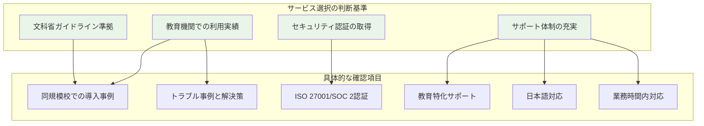
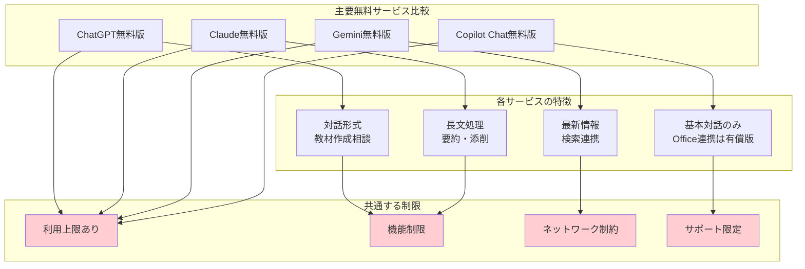
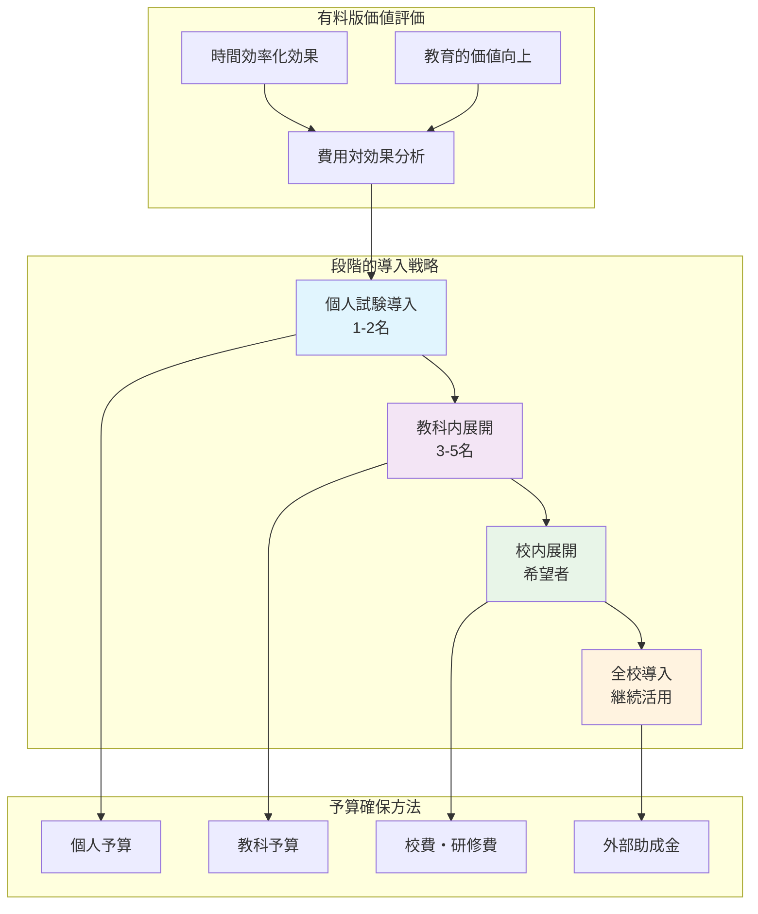
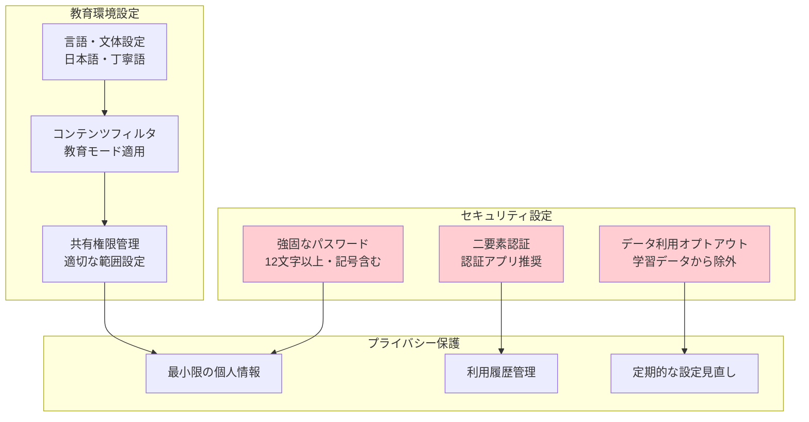
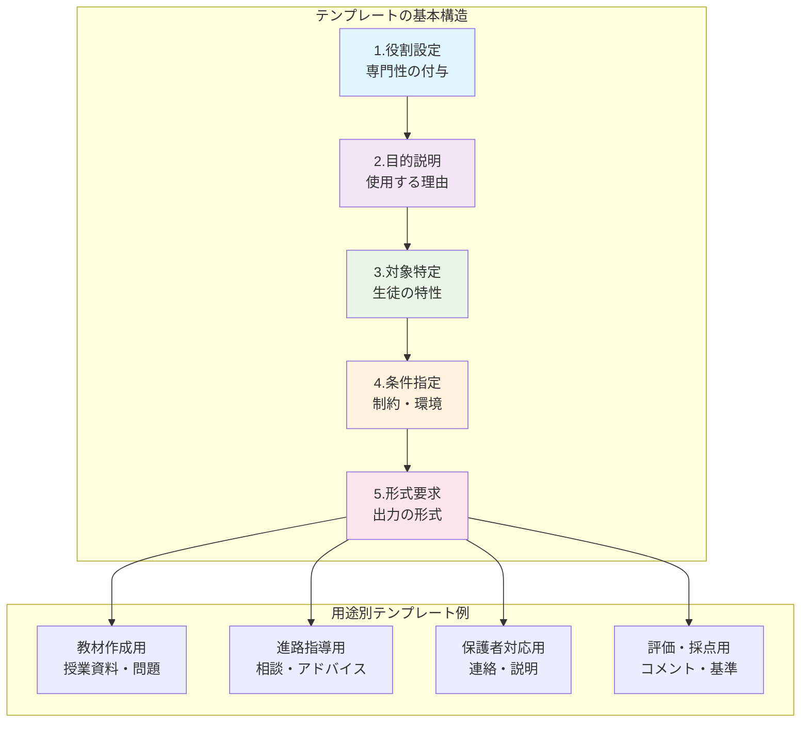
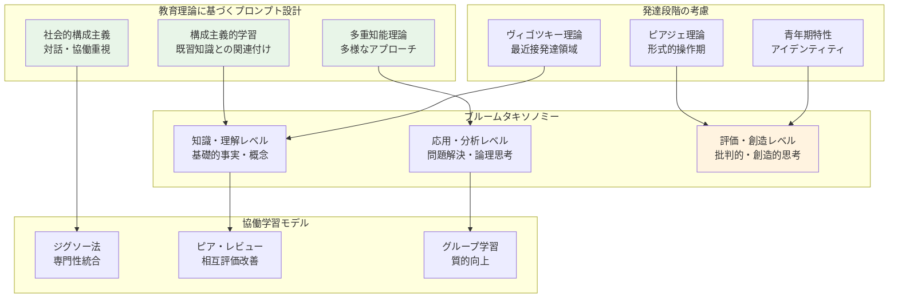

# 生成AIサービスの選び方と始め方

## この章の目的

認知負債のリスクを理解した上で、実際に生成AIサービスを選択し、教育現場で安全かつ効果的に使い始める方法を習得する。単なる技術的な導入手順にとどまらず、教育理論に基づいた活用方法や、学校環境に適した設定方法まで、包括的に学習していく。

:::message
**重要**: 第2章で学んだ認知負債の予防策を常に念頭に置きながら、「3段階思考法」を実践し、AIを補助ツールとして適切に活用することを心がけてください。
:::

## 3.1 学校での導入を前提としたサービス選択

### 3.1.1 教育現場での利用実績と信頼性

生成AIサービスを教育現場に導入する際に最も重要な要素は、そのサービスが教育機関での利用に適しているかどうかという信頼性の評価である。文部科学省は2023年7月に「初等中等教育段階における生成AIの利用に関する暫定的なガイドライン」を公表し、教育現場での生成AI活用について基本的な方針を示している。このガイドラインでは、生成AIの教育利用における可能性と留意点が整理されており、サービス選択の際にはこれらの指針に準拠していることが重要な判断基準となる。

教育機関での利用実績も重要な選択基準である。既に多くの学校で導入され、実際の教育活動において効果と安全性が確認されているサービスを選択することで、導入時のリスクを大幅に軽減できる。他校での導入事例を調査する際には、同規模の高等学校での活用例、特に自分の学校と類似した教育環境や生徒層を持つ学校での成功事例を重点的に調べることが有効である。また、導入後のトラブル事例や解決方法についても情報収集し、事前にリスクを把握しておくことが重要である。

セキュリティ認証については、ISO 27001やSOC 2 Type IIなどの国際的なセキュリティ基準を満たしているサービスを選択することが推奨される。これらの認証は、データの機密性、完全性、可用性が適切に管理されていることを第三者機関が認定するものである。教育現場では生徒の個人情報や成績情報など機密性の高いデータを扱うため、こうした認証の有無は極めて重要な判断材料となる。

サポート体制の充実度も見落とせないポイントである。教育現場では技術的な専門知識を持つ職員が限られているため、導入時の設定支援、使用方法の研修、トラブル発生時の迅速な対応など、包括的なサポートを提供しているサービスを選択することが重要である。特に、教育利用に特化したサポート担当者がいる、日本語での対応が可能、学校の業務時間内に対応してもらえるなどの条件を満たしているかを確認することが必要である。



### 3.1.2 無料サービスの特徴と制限

現在主要な生成AIサービスは、ChatGPT、Claude、Gemini、Microsoft Copilotなどがあり、それぞれに無料版が提供されている。これらの無料サービスは教育現場での導入初期段階において、コストを抑えながら生成AIの可能性を探るのに適していますが、同時に重要な制限があることを理解しておく必要がある。

ChatGPTの無料版（GPT-5ベース）は、OpenAIが提供する最も認知度の高いサービスである。自然な対話形式での質疑応答が得意で、教材作成の相談や授業アイデアの発想支援に活用できる。しかし、無料版では最新のGPT-4モデルは使用できず、応答の品質や複雑な推論能力に制限がある。また、利用頻度に応じてアクセス制限がかかることがあり、授業準備などの集中的な作業時に支障をきたす可能性がある。

Claudeの無料版は、Anthropic社が開発したサービスで、長文の処理や要約機能に優れているという特徴がある。教材の文献整理や、長文の生徒作品の添削コメント作成などに適している。ただし、無料版では月間の利用上限があり、頻繁に使用する教員にとっては制限が厳しい場合がある。

Geminiの無料版は、Googleが提供するサービスで、検索機能との連携が強みである。最新の情報を含めた回答が期待できるため、時事問題を扱う社会科の授業準備などに有用である。しかし、教育現場特有の配慮やプライバシー保護の面で、Google製品全般に対する学校の方針によっては使用が制限される場合がある。

Microsoft Copilotは、無償で利用できるのはMicrosoft 365 Copilot Chatのみである。Word、Excel、PowerPointなどのOfficeアプリケーションとの直接連携機能は、有償版のライセンスを購入した利用者のみが使用可能である。無償版では基本的な対話機能は利用できるが、教材作成で最も期待される資料作成支援機能を活用するには、有料プランへの移行が必要である。

無料サービス共通の制限として、学校のネットワーク環境での動作に注意が必要である。多くの教育機関では厳格なファイアウォール設定やコンテンツフィルタリングが行われており、これらが生成AIサービスのアクセスを阻害する場合がある。事前に学校のIT管理者と相談し、必要に応じてアクセス許可の設定を行う必要がある。



### 3.1.3 有料サービスの価値と予算確保

有料版への移行を検討する際には、追加される機能とそのメリットを教育的価値の観点から慎重に評価する必要がある。有料版の主なメリットとしては、より高性能なAIモデルへのアクセス、利用制限の緩和、優先的なサポート、高度なセキュリティ機能、カスタマイズ可能性の向上などがある。

教育現場における有料版の価値を評価する際には、まず時間効率化の効果を定量的に把握することが重要である。例えば、授業準備時間の短縮効果を月間で計算し、その時間を他の教育活動にどれだけ有効活用できるかを考慮する。仮に月額2,000円のサービスによって月間10時間の作業時間を節約できるとすれば、時給換算で200円という極めて効率的な投資となる。さらに、この節約された時間を生徒との個別相談や授業改善に充てることで、教育の質的向上という測定困難な価値も生まれる。

学校予算での導入可能性については、複数のアプローチが考えられる。個人予算での導入は最も手軽ですが、継続性に課題がある。教科予算や校費での導入を目指す場合は、導入効果を明確に示す必要がある。具体的には、教材作成効率の向上、生徒の学習成果への貢献、教員の負担軽減効果などを数値やエビデンスで示すことが重要である。

段階的導入の戦略としては、まず少数の教員による試験的導入から始め、成果を検証した上で段階的に拡大していく方法が現実的である。最初は教科主任や情報担当教員など、ITリテラシーが高く新しい取り組みに積極的な教員から始めて、成功事例を蓄積する。その後、研修や情報共有を通じて他の教員に展開し、最終的には学校全体での活用を目指する。この過程で、各段階での効果測定と改善を継続的に行うことが、持続可能な導入を実現する鍵となる。



## 3.2 アカウント作成と初期設定

### 3.2.1 セキュリティとプライバシー設定

生成AIサービスのアカウント作成において、セキュリティとプライバシーの適切な設定は教育現場での安全な利用に不可欠である。

**パスワード設定の基本原則**
- **文字数**: 12文字以上を必須とする
- **文字種類**: 英数字と記号を組み合わせる
- **独自性**: 他のサービスとは異なるユニークなパスワードを作成
- **管理方法**: パスワード管理ツールの活用を推奨

**二要素認証の設定方法**

認証方法の比較と選択:
- **SMS認証**
  * 利点: 設定が簡単
  * 欠点: 携帯電話紛失時のリスク
  * 推奨度: △（補助的利用のみ）

- **認証アプリ**
  * 利点: セキュリティと利便性のバランス
  * 対応アプリ: Google Authenticator、Microsoft Authenticator
  * 推奨度: ◎（教育現場での標準）

- **ハードウェアキー**
  * 利点: 最高水準のセキュリティ
  * 欠点: 追加コストと管理負担
  * 推奨度: ○（高セキュリティ要求時）

**データ利用設定の重要な調整項目**

教育現場では機密性の高い情報を扱うため、以下の設定変更が必須である:

- **学習データ利用の拒否**
  * データ利用のオプトアウト設定を有効化
  * 入力内容の学習データからの除外設定
  * サービス改善への協力拒否設定

- **データ保存期間の管理**
  * 保存期間を最短に設定
  * 自動削除機能の有効化
  * 手動削除のスケジュール設定

- **機密情報の保護対象**
  * 生徒の個人情報
  * 成績・評価情報
  * 授業内容・教材
  * 学校運営情報

**個人情報保護の基本原則**

- **最小限の情報提供**
  * 必須項目のみ入力
  * 任意項目は原則無記入
  * 生徒情報の一切登録禁止

- **定期的な情報管理**
  * プロフィール情報の定期見直し
  * 不要情報の積極的削除
  * 情報更新のタイミング管理

**学校規程との整合性確認**

- **事前確認作業**
  * 学校のプライバシーポリシーとの照合
  * 情報セキュリティ規程との適合性確認
  * 利用規約の矛盾点チェック

- **組織的承認プロセス**
  * 情報管理責任者への相談
  * 管理職への報告と承認取得
  * 学校内利用方針の文書化
  * 教職員全体への周知徹底

### 3.2.2 教育利用に適した環境設定

**教育利用に適した環境設定**

- **言語・文体の最適化**
  * 言語設定: 日本語に固定
  * 文体選択: 丁寧語・教育適合表現
  * 回答の調子: 分かりやすく理解しやすい形式
  * 専門用語: 適切な解説付きで使用

**コンテンツフィルタリングの設定**

- **年齢適合性の確保**
  * 暴力的・性的表現のフィルタリング
  * 不適切な言語表現の除外
  * 教育モード・安全モードの有効化

- **中立性の保持**
  * 政治的偏向の除外
  * 宗教的内容の中立的表現
  * 多様な観点の尊重
  * 価値観の強要防止

**共有設定と権限管理**

- **協働作業のための設定**
  * 同僚教員との情報共有レベル設定
  * 適切な共有範囲と権限の明確化
  * アクセス権限の段階的設定

- **機密情報の保護**
  * 生徒の個人情報の共有禁止
  * 成績・評価関連データの除外
  * 機密レベルの明確化と管理

- **定期的な管理**
  * 共有コンテンツの定期見直し
  * 不要データの積極的削除
  * アクセスログの監視と分析

**利用履歴とデータ管理**

- **履歴保存の最適化**
  * 保存期間の短縮設定
  * 機密セッションの履歴非保存設定
  * 自動削除機能の活用

- **定期的なメンテナンス**
  * 履歴情報の定期整理
  * 不要データの積極的削除
  * データ蓄積量の監視と管理
  * プライバシーリスクの最小化



## 3.3 基本的な使い方とプロンプト入門

### 3.3.1 効果的な質問の仕方

生成AIから質の高い回答を得るためには、明確で具体的な指示を与えることが最も重要である。

**効果的な質問の4つの基本要素**
1. **目的の明確化** - なぜその情報が必要か
2. **対象の特定** - どのような学習者か
3. **条件の設定** - 制約や制限事項
4. **形式の指定** - 回答のスタイルや構造

**曖昧な質問が引き起こすリスク**
- 期待と異なる回答の生成
- 教育現場に不適切な内容の含有
- 実用性の低い情報の提供

**目的の明確化の具体例**

良い例:
> 「高校１年生の数学の授業で二次関数の概念を初めて教えるため」

改善すべき例:
> 「二次関数について教えて」

**目的明示のメリット**
- AIが適切な難易度で回答
- 教育現場に適した内容の生成
- 実用性の高い情報の提供
- 教育目標との一致性確保

**対象の特定に含めるべき情報**

- **基本情報**
  * 学年・学級（例: 高校１年生）
  * 学力レベル（例: 基礎レベル、発展レベル）
  * 予備知識（例: 中学数学まで習得済み）

- **学習特性**
  * 興味関心の範囲
  * 得意・不得意分野
  * 進路希望（例: 理系・文系志望）

**対象特定の効果の比較**

曖昧な例:
> 「高校生に数学を教えたい」

具体的な例:
> 「数学が苦手な高校１年生（中学数学の基礎は理解済み）に二次関数を指導したい」

> 「理系志望の高校２年生（数学が得意）に微分の応用を指導したい」

**条件設定の重要項目**

- **時間的制約**
  * 授業時間（例: 50分授業で）
  * 準備時間（例: 準備に30分以内で）
  * 学習期間（例: 1学期で完結）

- **物理的制約**
  * 教室環境（例: 通常の教室で）
  * 利用可能機材（例: 特別な器具なしで）
  * クラス規模（例: 40名のクラスで）

- **教育的制約**
  * 学習指導要領の範囲内
  * 学校の教育方針に沿って
  * 使用中の教科書に合わせて

**具体的な条件記述例**
> 「50分授業で、特別な器具を使わずに、40名のクラスで実施可能な活動を計画してください」

**期待する形式の指定例**

- **構造的な形式**
  * 箇条書きで整理
  * 表形式での比較
  * 段階的な手順として
  * チェックリスト形式で

- **内容的な要素**
  * 具体例を含めて
  * 図解を交えて
  * 注意点もあわせて
  * 評価基準も含めて

**形式指定の効果**
- そのまま教材として活用可能
- 一貫性のある資料作成
- 生徒にとって理解しやすい構造
- 授業での使いやすさ向上

**コンテキスト提供の重要性**

- **提供すべき背景情報**
  * 前回の授業内容と進度
  * 生徒の反応や理解度
  * 現在の学習進度と課題
  * 使用中の教科書や教材

- **提供時の注意点**
  * 個人特定情報の除外
  * 一般化した表現で記述
  * プライバシーの保護を優先

**コンテキスト提供の効果**
- 継続性のある教育内容の提案
- 学習進度に合わせた適切なレベル
- 生徒の実情に即した内容

**段階的質問戦略の流れ**

1. **概要の確認**
   - 全体像や方向性の把握
   - 基本的な考え方やアプローチの理解

2. **具体的な方法の質問**
   - 詳細な手順や方法論
   - 教材やツールの具体的な使用法

3. **実施上の注意点の確認**
   - 起こりやすい問題や対応策
   - 評価方法や改善ポイント

**段階的質問のメリット**
- 複雑な内容を理解しやすく分割
- 各段階で詳細な情報を収集
- 実用性の高い回答を継続的に取得
- AIの回答の精度と深さを向上

### 3.3.2 プロンプトテンプレートの活用

**プロンプトテンプレート活用のメリット**

- **効率性の向上**
  * 毎回一から質問文を作成する手間を省略
  * 重要な要素の漏れを防止
  * 一貫性のある質問品質を確保

- **品質の安定化**
  * 成功パターンの再現性向上
  * 教育現場に適した内容の継続的取得
  * 初心者でも高品質な質問が可能

**テンプレートの5つの基本要素**

1. **役割設定**
   - AIに適切な専門性を付与
   - 例: 「高校教員として」「教材作成の専門家として」

2. **目的説明**
   - なぜその情報が必要かを明確化
   - 教育活動での具体的な使用目的

3. **対象特定**
   - 生徒の特性やレベルを詳細に記述
   - 個別最適化のための情報提供

4. **条件指定**
   - 時間、環境、リソースの制約を明示
   - 現実的な実行可能性を確保

5. **形式要求**
   - 期待する出力形式を具体的に指定
   - 教材としてすぐ使える形での出力を促進

**教材作成用テンプレートの例**

```
あなたは経験豊富な高校[教科名]教員である。
[学年]の生徒を対象とした[単元名]の授業で使用する
[教材の種類]を作成してください。

生徒の特徴：[学力レベル・興味関心など]
授業の制約：[時間・人数・設備など]
期待する形式：[具体的な形式]
```

**テンプレートのカスタマイズ例**
- [教科名] → 数学、英語、理科など
- [学年] → 高校１年生、２年生など
- [単元名] → 二次関数、仮定法など
- [教材の種類] → ワークシート、スライドなど

**用途別テンプレートの例**

- **進路指導用テンプレート**
```
進路指導の専門家として、[進路希望]の高校[学年]生に対する[相談内容]についてアドバイスしてください。

生徒の状況：[成績・興味・適性など]
配慮事項：[家庭環境・経済状況など]
回答形式：[具体的なアドバイス形式]
```

- **保護者対応用テンプレート**
```
学校と家庭の橋渡し役として、[相談内容]について
[保護者の立場]の保護者に対して、理解しやすく
配慮深い説明文を作成してください。

配慮事項：[特別な配慮が必要な点]
文書の用途：[連絡帳・文書・メールなど]
説明レベル：[一般的・専門的・初心者向けなど]
```

**テンプレートカスタマイズのコツ**

- **教育環境への適合**
  * 自分の指導スタイルに合わせた調整
  * 学校の教育方針や特色を反映
  * 使用中の教科書や教材に適合

- **効率性の向上**
  * 頻繁に使用する条件の固定化
  * 共通の要求事項のテンプレート組み込み
  * 毎回の入力手間を省略

- **品質の継続的改善**
  * 効果的だった表現のテンプレート反映
  * 成功パターンの標準化
  * 実用性の高い質問文の蓄積

**テンプレートの整理と管理**

- **保存形式の選択**
  * テキストファイル（.txt, .md）での保存
  * ノートアプリ（Evernote, Notion など）の活用
  * クラウドストレージでの同期管理

- **分類と整理**
  * 用途別のフォルダ分け（教材作成、進路指導等）
  * 教科別のサブフォルダ作成
  * タグやキーワードでの検索機能活用

- **アクセシビリティの向上**
  * 頻繁に使用するテンプレートのお気に入り登録
  * ショートカットキーやスニペット機能の活用
  * チーム内でのテンプレート共有と標準化



## 3.4 教育論を組み込んだプロンプト設計

### 3.4.1 学習理論に基づくプロンプト設計

生成AIの教育活用において真の価値を実現するためには、単なる効率化にとどまらず、確立された教育理論を基盤としたプロンプト設計が不可欠である。教育心理学や学習科学の知見を活用することで、生徒の学習効果を最大化する質の高い教材や指導方法を生成することができる。

構成主義的学習を促進するプロンプト設計では、生徒が既存の知識と新しい情報を関連付け、自分なりの理解を構築することを支援する内容の生成を目指する。

**構成主義プロンプトの例**
「構成主義の学習理論に基づき、高校生物の[単元名]について、生徒が日常生活の経験と結びつけて理解できるような課題を作成してください。生徒が主体的に仮説を立て、観察や実験を通じて自分なりの理解を深められる構成にしてください」

**教育効果**
- 暗記中心ではない深い理解を促進
- 既习知識との関連付けを実現
- 主体的な学習姿勢を育成

社会的構成主義の観点を取り入れたプロンプト設計では、生徒同士の対話や協働を通じた学習を重視する。

**社会的構成主義プロンプトの例**
「社会的構成主義の理論に基づき、高校現代文の[作品名]について、生徒同士の議論と相互作用を通じて理解が深まるようなグループ活動を設計してください。異なる視点や解釈を持つ生徒同士が建設的に対話し、共同で新しい洞察を発見できる仕組みを含めてください」

**活動の特徴**
- 協働学習を促進する活動案の生成
- 異なる視点の建設的な統合
- 共同での新しい洞察の発見

多重知能理論を活用したアプローチでは、ハワード・ガードナーが提唱した8つの知能を考慮したプロンプトを設計する。

**8つの知能領域**
- 言語的知能：文章読解・記述
- 論理数学的知能：論理的思考・数学的処理
- 空間的知能：視覚的情報処理
- 音楽的知能：リズム・音響認識
- 身体運動的知能：体験的・技能的学習
- 対人的知能：コミュニケーション・協働
- 内省的知能：自己理解・反省
- 自然探究的知能：自然観察・分類

**多重知能プロンプトの例**
「多重知能理論に基づき、高校世界史の[時代・地域]について、言語的知能、視覚空間的知能、音楽的知能、身体運動的知能など、多様な知能を活用して学習できる活動を提案してください。すべての生徒が自分の強みを活かして学習に参加できる多様なアプローチを含めてください」

### 3.4.2 発達段階を考慮したプロンプト作成

高校生という発達段階の特性を深く理解し、それに対応したプロンプト設計を行うことで、生徒の認知能力や心理的特徴に最適化された教育支援を実現できる。

ピアジェの認知発達理論における形式的操作期に該当する高校生に対しては、抽象的思考や仮説演繹的推理能力を活用したプロンプト設計が有効である。「ピアジェの発達段階理論における形式的操作期の特徴を考慮し、高校化学の[分野]について、生徒が抽象的な概念を論理的に操作し、仮説を立てて検証する思考過程を体験できる探究活動を設計してください。具体的な実験や観察から法則性を見出し、それを他の現象に適用して予測を立てる活動を含めてください」といったプロンプトを使用する。

ヴィゴツキーの最近接発達領域（ZPD）の概念を活用したプロンプト設計では、生徒の現在の能力レベルと潜在的な発達可能性との間に適切な挑戦を設定する。「ヴィゴツキーの最近接発達領域の理論に基づき、高校数学の[単元]において、現在一人でできることと、支援があればできることの間に適切な挑戦レベルを設定した問題セットを作成してください。段階的なヒントやスキャフォールディングを含め、生徒が自立的に解決できるまでの支援構造を組み込んでください」というアプローチにより、個々の生徒の発達を促進する教材を生成できる。

高校生特有の発達特性として、アイデンティティ形成期における自己探求への関心、同調性と独立性の両立への志向、将来への不安と希望の共存などがある。これらの特性を考慮したプロンプト例として、「青年期の発達的特徴を考慮し、高校現代社会の[テーマ]について、生徒が自分自身のアイデンティティや価値観と結びつけて考察できる課題を作成してください。将来の進路や社会での役割について自己理解を深めながら学習できる構成にし、同世代との意見交換を通じて多様な視点を獲得できる機会を含めてください」がある。

### 3.4.3 ブルームのタキソノミーとプロンプト

ベンジャミン・ブルームの教育目標分類学（タキソノミー）は、学習目標を認知的複雑さに応じて階層化したもので、質の高い教育活動の設計において極めて有用な枠組みである。このタキソノミーに基づいたプロンプト設計により、段階的で体系的な学習体験を提供することができる。

知識レベル（記憶）と理解レベルでのプロンプト設計では、基礎的な事実や概念の習得を支援する。「ブルームのタキソノミーの知識・理解レベルに対応した、高校日本史の[時代・出来事]に関する学習教材を作成してください。重要な事実や年代を正確に記憶し、その意味や背景を理解できるような問題と説明を含めてください。単なる暗記にならないよう、概念間の関連性を理解できる構成にしてください」というプロンプトを使用する。

応用レベルと分析レベルでは、習得した知識を新しい場面で使用したり、複雑な情報を構成要素に分解して理解する能力を育成する。「ブルームのタキソノミーの応用・分析レベルに対応した、高校物理の[法則・原理]について、現実の問題解決に法則を適用し、現象を構成要素に分解して分析できる課題を設計してください。日常生活や技術的な問題への応用例を含め、生徒が論理的思考を使って問題を体系的に分析できる活動にしてください」といったプロンプトにより、高次の思考スキルを育成する教材を生成できる。

評価レベルと創造レベルでは、最も高度な認知スキルである批判的評価と創造的思考を促進する。「ブルームのタキソノミーの評価・創造レベルに対応した、高校英語の[テーマ・トピック]について、複数の情報源を批判的に評価し、独自の視点から新しいアイデアや解決策を創造できる探究プロジェクトを設計してください。異なる立場や価値観を比較検討し、根拠に基づいた判断を行いながら、創造的で実用的な提案を生み出せる構成にしてください」というプロンプトにより、21世紀型スキルの育成に直結する高度な学習体験を設計できる。

### 3.4.4 協働学習とAIの融合

現代の教育において重視される協働学習と生成AIを効果的に融合させることで、従来以上に豊かで多面的な学習体験を提供することができる。

ジグソー法でのAI活用では、各グループが異なる専門分野を担当し、最終的に知識を統合する協働学習モデルにAI支援を組み込みる。「ジグソー法の協働学習モデルに生成AIを効果的に組み込んだ、高校地理の[地域・テーマ]に関する学習活動を設計してください。各専門グループがAIを活用して深い情報収集と分析を行い、その成果を他グループと共有統合することで、単独では到達できない総合的理解を構築できる活動にしてください。AIの活用方法と人間同士の対話の役割分担を明確にしてください」というプロンプトにより、AI時代の協働学習モデルを設計できる。

ピア・レビューとAI支援の組み合わせでは、生徒同士の相互評価にAIの客観的分析を加えることで、より質の高いフィードバック体制を構築する。「ピア・レビューシステムにAI支援を統合した、高校国語の小論文指導プログラムを設計してください。生徒同士の相互評価に加えて、AIによる構造分析や表現チェックを活用し、多角的で建設的なフィードバックを提供できるシステムにしてください。AIの客観的評価と人間の感性的評価の違いを生徒が理解し、両方を活用できる学習体験を含めてください」といったアプローチが有効である。

グループ学習の質向上においては、AIを活用してグループダイナミクスを改善し、すべてのメンバーが積極的に参加できる環境を整備する。「生成AIを活用してグループ学習の質を向上させる、高校社会科の[テーマ]に関する探究学習プログラムを設計してください。グループ内の役割分担、議論の進行、アイデアの整理、合意形成などの各段階でAIがどのような支援を提供できるかを明確にし、すべてのメンバーが能力を発揮できる協働的な学習環境を構築してください」というプロンプトにより、AI支援による協働学習の最適化を図ることができる。



## この章のまとめ

### 重要ポイント

1. **適切なサービス選択**
   - 文科省ガイドライン準拠と教育現場での利用実績を重視
   - セキュリティ認証とサポート体制の確認
   - 無料版から始めて段階的に有料版を検討

2. **セキュリティとプライバシー設定**
   - 二要素認証とデータ利用オプトアウトの必須設定
   - 教育現場に適したフィルタリングと共有設定
   - 定期的な設定見直しとデータ管理

3. **効果的なプロンプト設計**
   - 明確な目的・対象・条件・形式の指定
   - テンプレート活用による効率化と品質向上
   - 3段階思考法の実践による認知負債の予防

4. **教育理論の統合**
   - 構成主義・社会的構成主義・多重知能理論の活用
   - 発達段階とブルームタキソノミーの考慮
   - 協働学習とAI支援の効果的な融合

### 実践チェックリスト

**サービス選択・設定**
```
□ 学校の方針とガイドラインに準拠したサービスを選択した
□ セキュリティとプライバシー設定を適切に行った
□ 教育現場に適した環境設定をカスタマイズした
□ データ管理と共有設定を確認した
```

**プロンプト活用**
```
□ 基本的なプロンプト構造を理解した
□ 教育用テンプレートを作成・整理した
□ 段階的な質問戦略を実践できる
□ 3段階思考法を意識してAIを活用している
```

**教育理論の統合**
```
□ 学習理論に基づくプロンプトを作成できる
□ 生徒の発達段階を考慮した指導案を設計できる
□ ブルームタキソノミーを活用した課題を作成できる
□ 協働学習とAI支援を組み合わせた活動を計画できる
```

### 次章への準備

次章では、実際の授業準備において生成AIを効果的に活用し、教育の質を高める具体的な方法を学習する。

**第4章で学ぶこと**
- 教育理論に基づく教材作成の実践
- 学習目標に対応した評価基準の設計
- 個別最適化を実現する指導方法
- 効率化によって創出される時間の有効活用

**準備しておくこと**
- 自分の担当教科での具体的活用場面の想定
- 生徒の特性や学習状況の整理
- 現在の授業準備プロセスの課題把握
- 教育理論を活用した改善目標の設定

---

:::message
第3章では技術的な導入方法を学びましたが、常に認知負債の予防を意識し、AIを「補助」として活用することを忘れないでください。次章からは、この基盤の上に立って、実際の教育活動での具体的な活用方法を探求していく。
:::