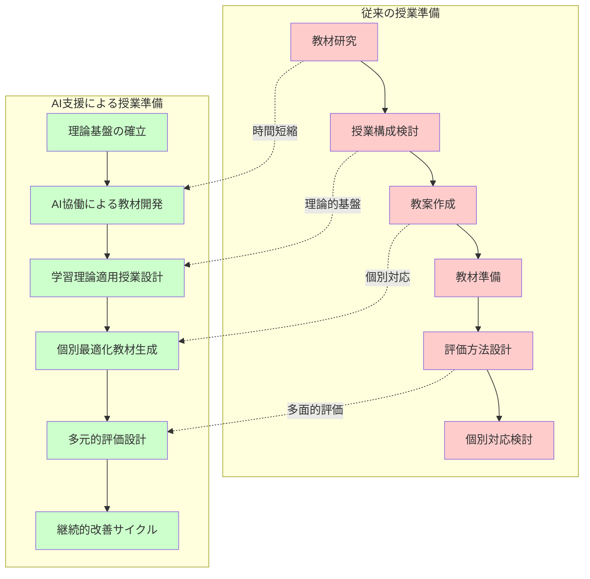
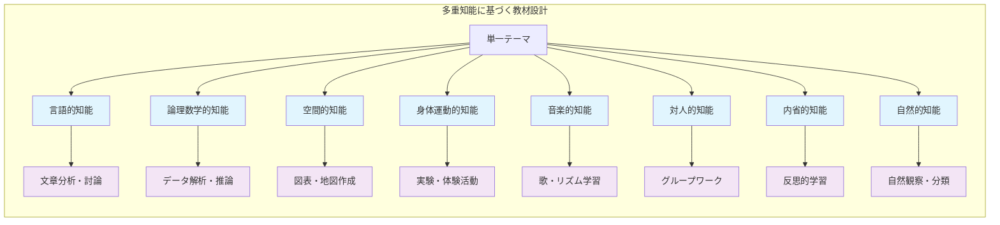
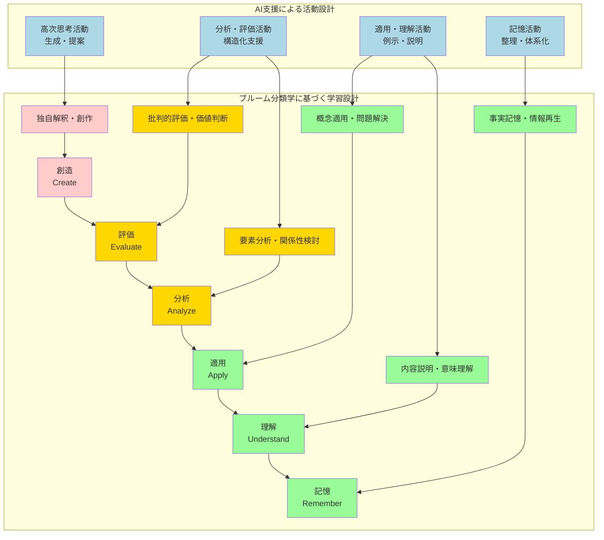
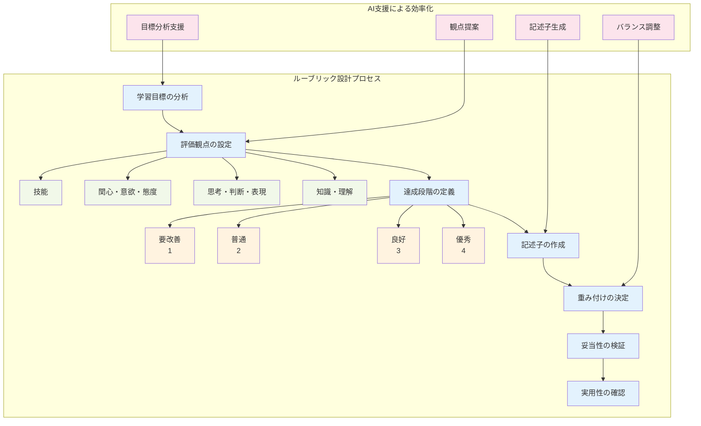

# 教育理論と実践の融合による効果的な授業準備

現代の教育現場において、生成AIは単なる作業効率化ツールにとどまらず、教育理論に基づいた質の高い授業準備を支援する強力なパートナーとしての役割を担っている。本章では、教育理論の実践的応用から学習者中心の授業設計、さらには評価理論に基づく測定方法まで、生成AIを活用した包括的な授業準備の手法について詳細に解説する。

従来の授業準備では、教材研究から教案作成、評価方法の設計まで、すべてを教師が一人で行う必要があった。しかし、生成AIの活用により、教育理論に基づいた体系的なアプローチを効率的に実現できるようになった。これは、単に作業時間を短縮するだけでなく、教育の質的向上を同時に実現する革新的な変化である。

## 教育理論に基づく教材作成

### 構成主義理論を活用した教材開発

教材作成において最も重要なのは、学習者が能動的に知識を構築できるような内容設計である。構成主義理論に基づく教材作成では、学習者の既存知識と新しい学習内容を適切に関連付けることが重要である。生成AIは、この理論的基盤に立った教材開発を効率的に支援する。

**構成主義的アプローチの実践例**

高校数学の二次関数を扱う際のアプローチ比較:

- **従来のアプローチ**
  * 公式の説明から開始
  * 抽象的な数学的概念を直接提示
  * 学習者の既存知識との関連づけが不十分

- **構成主義的アプローチ**
  * 日常生活で経験する放物線運動から導入
  * 具体的な物理現象から数学的概念への段階的移行
  * 学習者の認知的負荷を配慮した構造化

**効果的なプロンプト例**
> 「高校1年生が理解している物理現象を基に、二次関数の概念を段階的に構築する教材を作成してください。学習者の認知的負荷を考慮し、概念の関連付けを重視した内容にしてください」

**期待できる教育効果**
- 理論に基づいた高品質な教材の効率的作成
- 学習者の能動的な知識構築を促進
- 既存知識と新学習内容の有機的な結合

**認知発達理論を踏まえた教材設計**

- **ピアジェ理論の応用**
  * 形式的操作期にある高校生の思考特性を考慮
  * 抽象概念の具体化と段階的提示
  * 認知発達段階に応じた適切な挑戦レベル設定

- **生成AIの具体的支援内容**
  * 複雑な数学的概念の視覚的表現化
  * 具体例を通じた段階的提示方法の提案
  * 個別の理解度に応じた調整可能な教材案の作成

- **教師の役割と専門性発揮**
  * AI提案を基盤とした個別最適化
  * 学習者の反応や理解度に応じた柔軟な調整
  * 教育的判断に基づく最終的な内容決定

### 多重知能理論に基づく多様な学習スタイル対応

**多重知能理論の教育実践への応用**

ハワード・ガードナーの多重知能理論は、学習者が持つ8つの異なる知能を認識し、それぞれに適した学習機会を提供することの重要性を示している。

**8つの知能領域**
- 言語的知能
- 論理数学的知能
- 空間的知能
- 身体運動的知能
- 音楽的知能
- 対人的知能
- 内省的知能
- 自然的知能

**従来の一斉授業の限界とAI活用の可能性**
- **従来の問題点**: 主に言語的・論理数学的知能に偏った指導
- **AI活用のメリット**: 多様な知能に対応した教材の効率的作成が可能

**戦国時代学習での多重知能対応の実践例**

知能タイプ別の学習活動提案:

- **言語的知能に優れた学習者**
  * 詳細な文書資料の分析活動
  * 史料の文語的特徴の研究
  * 戦国武将の書状や記録の読み解き

- **空間的知能に優れた学習者**
  * 地図や図表を用いた領土変遷の視覚化
  * 城郭構造や戦術配置の立体的理解
  * 時代別建築様式の比較研究

- **身体運動的知能に優れた学習者**
  * 当時の生活様式の体験的再現活動
  * 武具や道具の使用法実習
  * 時代衣装や作法の再現

**効果的なプロンプト例**
> 「戦国時代の学習において、8つの多重知能それぞれに適した学習活動を提案し、具体的な実施方法まで含めて教材案を作成してください」

**期待できる成果**
- 包括的な教材セットを短時間で準備可能
- 個々の学習者の強みを活かした授業展開
- 多様な角度からの歴史理解を促進

### 社会構成主義に基づく協働学習教材

**ヴィゴツキーの社会構成主義理論の教育実践への応用**

社会構成主義理論は学習が社会的相互作用を通じて行われることを強調しており、この理論に基づく教材作成では学習者同士の対話や協働を促進する仕組みが重要である。

**近接発達領域（ZPD）を活用した教材設計の原則**
- **現在の能力レベルの把握**: 学習者の既習内容と理解度の正確な測定
- **到達可能レベルの設定**: 他者の支援があれば達成可能な適切な課題レベル
- **段階的な学習課題の配置**: 現在のレベルから一段階上への自然な移行

**効果的なプロンプト例**
> 「現在のレベルからワンステップ上の課題を設定し、ペア学習やグループ学習を通じて達成できる協働学習教材を作成してください」

**期待できる教育効果**
- 理論的に裏付けられた効果的な学習活動の設計
- 学習者の能動的参加を促進する協働学習環境
- 個人の学習と集団での学びの相乗効果

## 学習理論に基づく授業設計

### 認知負荷理論を考慮した情報提示設計

**認知負荷理論に基づく科学的な授業設計**

ジョン・スウェラーの認知負荷理論は人間の作業記憶の限界を踏まえた効果的な学習設計の重要性を示している。

**3つの認知負荷とバランス調整**
- **内在的負荷**: 学習内容そのものの複雑さによる負荷
- **外在的負荷**: 不適切な指導方法による不要な負荷
- **生成的負荷**: 学習者がスキーマ構築のために使う有意義な負荷

**従来の授業設計の課題と生成AIによる解決**
- **従来の問題点**
  * 教師の直感や経験に基づく情報量・提示方法の決定
  * 学習者の認知負荷の科学的管理が困難
  * 作業記憶の飽和による学習阻害

- **生成AI活用のメリット**
  * 認知負荷理論に基づいた体系的な授業設計
  * 情報の段階的提示による負荷軽減
  * 科学的根拠に基づいた効果的な授業構成

**化学教育での具体的応用例**
> 「高校化学のメタン分子の構造学習において、認知負荷理論に基づいて情報を段階的に提示する授業展開を設計してください。各段階での認知負荷の種類と軽減方法も含めてください」

**認知心理学の知見の活用**
- **チャンキング**: 情報の意味ある単位への分割
- **スキーマ構築**: 関連情報の体系的な組織化
- **段階的な複雑化**: 単純な概念から複雑な概念への移行
- **視覚的表現**: 抽象的概念の具体的な可視化

### ブルームの教育目標分類学に基づく段階的学習設計

**ブルームの教育目標分類学に基づく体系的学習設計**

ブルームの教育目標分類学は学習目標を認知的領域において6つの階層に分類し、低次から高次へと段階的に学習を進めることの重要性を示している。

**6つの認知的階層と現代的理解**
- **記憶（Remember）**: 事実情報の再生と判別
- **理解（Understand）**: 意味や関係性の把握
- **適用（Apply）**: 学習内容の実際的使用
- **分析（Analyze）**: 要素の分解と関係性の検討
- **評価（Evaluate）**: 基準に基づく判断と批判
- **創造（Create）**: 新しいアイデアや作品の生成

**現代的理解の特徴**
- 各階層は動的なプロセスとして捉えられる
- 相互に関連し合いながら学習が深化
- 線形的な進行ではなく立体的な学習過程

**文学作品学習での具体的応用例**
- **記憶段階**: 作品の基本情報、登場人物の把握
- **理解段階**: 物語の展開、主題の解釈
- **適用段階**: 他の作品との比較分析
- **分析段階**: 文学技法、構造の詳細検討
- **評価段階**: 作品の文学的価値の判断
- **創造段階**: 独自の解釈、創作活動

**効果的なプロンプト例**
> 「高校国語の『こころ』の学習において、ブルームの分類学の6段階すべてを含む3週間の授業プランを作成してください。各段階の学習活動が自然に次の段階につながるよう設計し、評価方法も含めてください」

**期待できる成果**
- 理論的基盤に基づいた包括的な授業計画の効率的作成
- 各階層の学習活動の自然な接続と連絡
- 多層的な評価方法による学習成果の適切な測定

### アクティブラーニングの効果的な設計と実装

**アクティブラーニングの理論的基盤と実践**

アクティブラーニングは学習者が能動的に学習プロセスに参加し、思考・議論・体験を通じて学びを深める教育手法である。

**従来の課題と生成AIによる解決**
- **従来の問題点**: 学習理論に基づいた精密な計画に多大な準備時間が必要
- **生成AIの支援内容**
  * 学習者の特性や学習内容に適した活動形態の提案
  * 具体的な実施方法まで含めた詳細な計画作成
  * 多様な手法の組み合わせと最適化

**歴史授業での具体例（明治維新）**
- **ジグソー法**: 専門グループでの深い調査と情報共有
- **シンク・ペア・シェア**: 個人思考から集団共有への段階的発展
- **ディベート**: 異なる立場からの批判的検討
- **ロールプレイ**: 歴史的人物の立場からの状況理解

**教育的价値の重要性**
アクティビティそのものではなく、学習目標達成への貢献という理論的根拠が最重要である。

**効果的なプロンプト例**
> 「明治維新の学習において、学習者の批判的思考力と歴史的思考力を育成するアクティブラーニング活動を、社会構成主義理論に基づいて設計してください。各活動の教育効果も含めて説明してください」

**期待できる成果**
- 理論と実践が統合された質の高い授業設計
- 学習者の能動的参加と深い学びの実現
- 批判的思考力と歴史的思考力の統合的育成

## 教育測定理論に基づく評価設計

### 真正な評価（オーセンティック・アセスメント）の設計

真正な評価は、学習者が実際の文脈において知識やスキルを活用する能力を測定する評価手法です。従来のペーパーテストでは測定困難な、問題解決能力、批判的思考力、創造力などの高次思考スキルの評価において、特に重要な役割を果たします。

生成AIを活用することで、各教科の特性と学習目標に適した真正な評価課題を効率的に設計できます。例えば、理科の環境問題学習において、「地域の環境課題を科学的に分析し、解決策を提案するプロジェクト」という真正な評価課題を設定する場合、生成AIに「高校生物の生態系学習における真正な評価として、地域環境の調査・分析・提案活動を設計してください。評価基準（ルーブリック）も含めて作成し、生物学的概念の理解と科学的思考力の両方を適切に評価できるようにしてください」と依頼することで、理論的に裏付けられた包括的な評価システムを構築できます。

この過程では、評価の信頼性と妥当性を確保することも重要です。信頼性は測定の一貫性を、妥当性は測定したい能力を適切に測定できているかを示す指標です。生成AIは、これらの測定理論的要件を満たす評価設計を支援し、多面的な評価方法の組み合わせを提案します。

### ルーブリック評価の体系的構築

ルーブリック評価は、学習成果を複数の評価観点において、質的な違いを段階的に記述した評価基準表を用いて行う評価方法です。学習者にとっては学習の方向性を明確にし、教師にとっては客観的で公正な評価を実現する重要なツールです。

効果的なルーブリックの作成には、評価観点の適切な設定、各段階の明確な記述、観点間のバランスの取れた配点など、多くの専門的知識が必要です。生成AIは、これらの要件を満たすルーブリックの作成を効率的に支援します。

例えば、英語のプレゼンテーション評価において、「内容の適切性」「論理的構成」「言語使用」「発表技術」という4つの評価観点を設定し、それぞれを4段階で評価するルーブリックを作成する場合、生成AIに「高校英語のプレゼンテーション評価用ルーブリックを作成してください。CEFR基準も参考にし、各段階の記述が具体的で観察可能な行動として表現されるようにしてください」と依頼することで、国際基準に準拠した質の高いルーブリックを短時間で作成できます。

### 形成的評価と総括的評価の統合設計

形成的評価は学習プロセス中に継続的に行われ、学習の改善を目的とする評価であり、総括的評価は学習プロセス終了時に成果を判定する評価です。効果的な学習には、これら両方の評価を適切に組み合わせることが重要です。

生成AIを活用することで、形成的評価と総括的評価が有機的に連携した包括的な評価システムを設計できます。形成的評価では、学習者の理解度を即座に把握し、必要に応じて学習支援を行うためのフィードバック機能を重視し、総括的評価では、学習目標の達成度を総合的に判定するための信頼性の高い測定を実現します。

たとえば、数学の関数学習において、「毎時間の理解度チェック（形成的評価）」「単元中間での応用課題（形成的評価）」「単元末テスト（総括的評価）」「実生活問題への適用プロジェクト（真正な評価）」を組み合わせた評価システムを設計します。生成AIに「高校数学の二次関数単元において、形成的評価と総括的評価を効果的に組み合わせた3週間の評価計画を作成してください。各評価の目的、方法、フィードバック方法を含め、学習者の成長を継続的に支援できるシステムを設計してください」と依頼することで、理論的基盤を持つ統合的な評価システムを構築できます。

## 継続的改善サイクルの構築

生成AIを活用した授業準備の最大の利点の一つは、実施後の振り返りと改善を効率的に行えることです。授業実践の結果を分析し、教育理論に基づいた改善策を立案することで、教育の質を継続的に向上させることができます。

授業後のリフレクション（省察）は、ドナルド・ショーンの「行為の中の省察」理論に基づき、実践と理論を往復させながら専門性を高める重要なプロセスです。生成AIは、授業の振り返りデータから改善点を抽出し、次回以降の授業設計に活かす具体的な提案を行います。

「本日の数学授業において、学習者の反応が予想より低かった部分について、認知負荷理論と構成主義理論の観点から分析し、次回授業での改善策を提案してください」といったプロンプトを使用することで、理論的根拠を持つ改善計画を効率的に作成できます。これにより、経験と理論が統合された専門的な授業実践能力の向上が実現されます。

このような継続的改善サイクルの構築により、生成AIは単なる作業効率化ツールを超えて、教師の専門的成長を支援する協働パートナーとしての役割を果たします。教育理論に基づいた体系的なアプローチと実践的な改善活動を通じて、質の高い教育の実現と教師自身の成長の両方を同時に達成することができるのです。