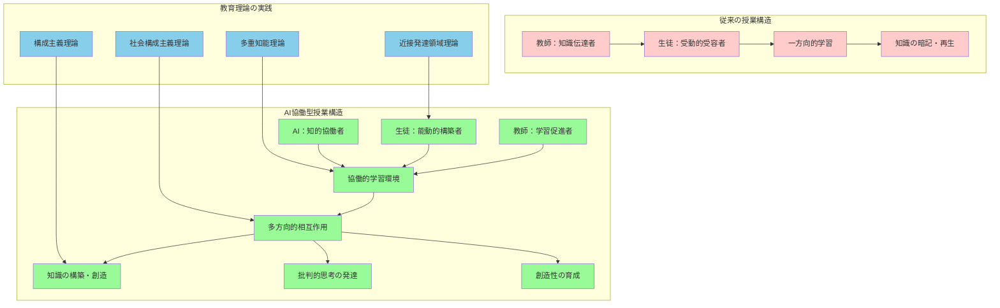
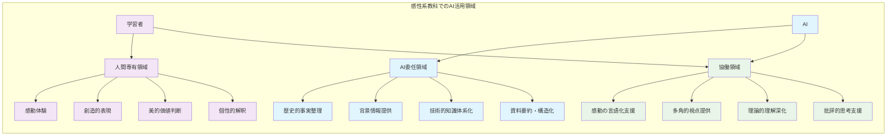

# 生きた学びの創造と教育理論の実践的応用

教室という学習空間において、生成AIは単なる教育ツールを超えて、教育理論を実践に結びつける架け橋として機能する。本章では、構成主義理論や社会構成主義理論といった現代教育学の知見を基盤として、リアルタイムでの生成AI活用による効果的な授業実践について詳細に解説する。特に、芸術・表現系教科における人間性の保持と創造性の育成、さらには協働学習と探究活動における生成AIの戦略的活用について、教育的価値を最重視したアプローチを提示する。

**新しい学習生態系の出現**

従来の教室では教師が知識の伝達者、生徒が受動的な受容者として位置づけられることが多かった。しかし、生成AIの導入により、三者が相互作用する新しい学習生態系が生まれている。

**新しい学習環境の三者関係**
- **教師**: 学習の促進者（ファシリテーター）
- **生徒**: 能動的な知識構築者
- **生成AI**: 知的な協働者

**教育の本質的価値の重視**
この新しい学習環境において重要なのは、技術的効率性だけではなく、教育の本質的価値の実現である。
- **人格形成**: 全人的な成長と価値観の育成
- **創造性の育成**: 個性的な表現力と発想力の開発
- **批判的思考力**: 情報を適切に判断し、自立的に思考する能力

生成AIの活用は、これらの教育目標を達成するための手段であり、決して目的そのものではない。

## 教育理論に基づく授業実践でのAI活用

### 構成主義的学習を支援するAI活用の実践

**構成主義理論に基づいた能動的学習の支援**

構成主義理論は学習者が既存の知識構造に新しい情報を関連付けながら、能動的に知識を構築していく過程を重視する。

**生成AIの主要な支援領域**
- **個別最適化説明の生成**: 学習者の既習知識を活用した段階的理解支援
- **認知的葛藤の創出**: 既存概念に疑問を喚起し、深い思考を促進
- **具体例の提示**: 抽象的概念を日常体験と結びつける材料提供

**高校化学での実践例：酸化還元反応**

教師は生成AIを活用して、個々の生徒が既に理解している日常現象を基点とした段階的概念構築を実現する。

**既習知識と新概念の橋渡し**
- **日常現象**: 金属の錆び、電池の仕組み、呼吸など
- **新概念**: 電子の移動、酸化還元の本質
- **認知的葛藤**: 「なぜそうなるのか」という疑問の喚起

**重要なアプローチ**
単に正しい情報を提供するだけではなく、生徒の既存概念に揺さぶりをかけることが重要である。

**実際の授業での活用手順**

1. **情報提供**: 「この生徒は中学校で学習した燃焼反応についてはよく理解しているが、電子の移動概念が曖昧である」

2. **プロンプト**: 「燃焼反応の具体例から電子移動の概念を段階的に理解できるような説明と、認知的葛藤を生む問いかけを作成してください」

3. **AIの対応**: 既習知識と新概念の橋渡し、予想を覆す現象や問いの提示

**教師の重要な役割**

構成主義的アプローチで重要なのは、生成AIが提供する情報をそのまま伝達するのではなく、教師が生徒の反応を観察しながら適切なタイミングで適切な情報を選択的に提示することである。

**学習の本質的理解**
学習は生徒の内的な知識構築過程であり、外部からの情報はその過程を支援する材料に過ぎない。

### 最近接発達領域（ZPD）に対応した個別支援の実現

ヴィゴツキーの最近接発達領域理論は、学習者が現在できることと、他者の支援があれば達成可能なこととの間に学習の最適な領域があることを示しています。生成AIを活用することで、この理論に基づいた精密な個別支援を効率的に実現できます。

実際の授業場面では、教師は生徒一人ひとりの理解度を把握し、それぞれの近接発達領域に適した課題や支援を提供する必要があります。しかし、30名を超える生徒がいる教室において、すべての生徒に個別最適化された支援を同時に提供することは現実的に困難でした。

生成AIは、このような状況において強力な支援を提供します。教師が生徒の現在の理解レベル、つまずいている箇所、学習スタイル等の情報を入力することで、それぞれの生徒の近接発達領域に適した課題、ヒント、説明方法を即座に生成できます。重要なのは、これらの支援が段階的に調整可能な「スキャフォルディング（足場かけ）」として機能することです。

例えば、数学の二次方程式の解法において、ある生徒が因数分解の概念は理解しているが、複雑な式への適用に困難を感じている場合、生成AIは「因数分解の基本は理解している生徒に対して、x²+7x+12=0のような具体例から始めて、段階的に係数が複雑な問題へと導く問題系列を作成し、各段階でのヒントも含めてください」という指示に基づいて、個別最適化された学習経路を提示します。

この過程において教師の役割は、生成AIが提供する支援を基に、実際の生徒の反応を観察し、支援レベルを動的に調整することです。生徒が自立的に解決できるようになれば支援を段階的に減らし、困難が生じれば追加的な支援を提供する、このような柔軟な対応が可能になります。

### 多重知能理論に基づく多様なアプローチの展開

ハワード・ガードナーの多重知能理論を実際の授業で活用する際、生成AIは各生徒の学習スタイルや認知的強みに応じた多様な説明方法や学習活動を提供します。この理論の実践において重要なのは、すべての生徒が同一の方法で学習する必要はなく、それぞれの知能的特性を活かした学習経路があることを認識することです。

例えば、歴史の授業で「産業革命」を扱う際、言語的知能に優れた生徒には詳細な文献資料の分析と論述活動を、論理数学的知能に優れた生徒には統計データの分析と因果関係の推論を、空間的知能に優れた生徒には地図や図表を用いた視覚的分析を、身体運動的知能に優れた生徒には当時の労働環境の体験的再現を提供します。

教師は授業中に生徒の学習への取り組み方や理解の示し方を観察し、「この生徒は視覚的な情報処理が得意で、文字情報よりも図表や画像を通じて理解が深まる傾向がある」といった情報を生成AIに提供します。生成AIは、この情報に基づいて「産業革命における技術革新を、視覚的知能に優れた学習者が理解しやすいような図表、年表、地図を組み合わせた教材を作成し、体験的な学習活動も含めてください」という依頼に応じて、個別最適化された学習支援を提供します。

重要なのは、多重知能理論の実践が単なる学習スタイルの違いに留まらず、それぞれの生徒の知的な強みを発見し、自己効力感を高めることにつながることです。生成AIは、生徒が自分の得意分野を通じて学習内容にアプローチし、成功体験を積み重ねることを支援します。

## 感性と人間性を大切にしたAI活用

### 芸術・表現系教科における人間中心のAI活用

芸術・音楽・文学といった感性系教科において、生成AIの活用は特別な配慮と明確な役割分担が必要です。これらの教科では、技術的効率性よりも人間の感性、創造性、個性的表現を最優先に考える必要があります。生成AIは、感性的体験の代替ではなく、人間の創造的活動を支援し、豊かにするための道具として位置づけられるべきです。

音楽科においては、楽曲の歴史的背景や文化的意味の深掘り、作曲家の人生観と作品の関連性の探究、多様な音楽ジャンルの文化的価値の理解といった領域で生成AIを活用します。しかし、演奏技術や音楽的感性の育成は、生徒自身の身体的・感覚的経験を通じて行われるべきものであり、AIが介入すべき領域ではありません。

例えば、ベートーヴェンの「運命」交響曲を扱う授業において、教師は生成AIを活用して作曲当時の社会状況、ベートーヴェンの聴覚障害と創作活動の関連、ロマン派音楽の特徴などの背景情報を整理し、多角的な視点を提供します。しかし、楽曲を実際に聴いた時の感動、リズムやメロディーに対する感覚的反応、演奏における表現の工夫などは、生徒一人ひとりが直接体験し、内面で育むものです。

美術科でも同様に、美術史の文脈における作品理解、技法研究と文化的背景の関連付け、多様な表現様式の比較分析において生成AIを活用しますが、創作活動の核心部分である感性的判断、色彩感覚、造形的表現などは生徒自身の感性と手技に委ねます。レオナルド・ダ・ヴィンチの作品を鑑賞する際、生成AIはルネサンス期の文化的背景や技法の特徴について詳細な情報を提供できますが、作品を前にした時の感動や美的体験は、生徒の心の中でのみ生まれるものです。

### AIと人間の役割分担の明確化

感性系教科における効果的なAI活用には、AIに委ねて良い領域、絶対に人間が担うべき領域、そして協働により価値を生む領域を明確に区別することが重要です。

AIに委ねて良い領域には、歴史的事実や背景情報の整理、複数の解釈や視点の提示、技術的な知識の体系化、研究資料の要約と構造化などがあります。これらは客観的な情報の処理や整理に関わる活動であり、生成AIの得意分野です。国語科において古典文学作品を扱う際、平安時代の社会制度、貴族文化の特徴、用語の解説、他作品との比較といった情報は、生成AIが効率的に提供できる領域です。

一方、絶対に人間が担うべき領域として、芸術作品への感動体験、創造的な表現活動、美的価値の判断、個性的な解釈と表現があります。これらは人間の内面的な体験や個性的な反応に関わる活動であり、AIが代替することはできません。詩の創作において、言葉に対する感覚、リズム感、情感の表現などは、生徒自身の言語感覚と感性を通じて育まれるものです。

協働により価値を生む領域では、感動を言語化する過程での語彙支援、多様な視点から作品を見る際の視座提供、表現技法の理論的理解の深化、批評活動における論理的思考の支援などがあります。例えば、生徒が絵画作品に感じた印象を言語化したいと思った時、生成AIは表現に適した語彙や表現方法を提案し、生徒の感性的体験を豊かに表現することを支援できます。

### 感性教育でのAI活用ガイドライン

感性教育における生成AI活用の基本原則として、AIは「情報提供者」として活用し、「感性の代替」は絶対に行わないことが重要です。生徒の内面的体験を最重視し、AIはそれを支える脇役に徹する姿勢が求められます。

多様性と個性の尊重も重要な原則です。芸術的表現や文学的解釈には、正解や標準的な反応というものが存在しません。生徒一人ひとりの感性や価値観に基づく多様な表現や解釈を尊重し、AIが画一的な「正解」を押し付けることを避ける必要があります。むしろ、AIは複数の視点や解釈の可能性を示すことで、生徒の思考を刺激し、より豊かな表現活動を促進する役割を担います。

人間関係と直接体験を通じた学びを最優先することも重要です。芸術・表現系教科の学習において最も価値があるのは、作品との直接的な出会い、他者との感性的な交流、教師からの個別的な指導です。生成AIの活用は、これらの人間的な相互作用を豊かにするための手段であり、代替するものではありません。

実践上の留意点として、作品鑑賞は必ず生徒自身の感想から始め、AI情報は生徒の感性が十分に発揮された後に提示することが重要です。技術的な知識はあくまで表現力向上の支援として活用し、評価は生徒の成長過程と努力を重視し、AIとの比較は行わないことが求められます。

## グループ学習・探究活動での活用と授業改善

### 協働学習の質向上を目指すAI支援

グループ学習や探究活動において、生成AIは生徒の主体的な学習を支援し、協働学習の質を向上させる重要な役割を果たします。従来のグループ学習では、情報収集の効率性や役割分担の困難、議論の深度不足などの課題がありましたが、生成AIの適切な活用により、これらの課題を解決し、より深い学習体験を実現できます。

調べ学習における生成AI支援では、情報収集の効率化、情報の整理と構造化、批判的検証の指導が重要な要素となります。例えば、「地球温暖化とその対策」をテーマとした探究学習において、各グループの生徒は生成AIを活用して基礎的な情報を収集し、複雑なデータを理解しやすい形に構造化します。しかし、重要なのは、AIが提供する情報をそのまま受け入れるのではなく、複数の情報源と照合し、批判的に検証する姿勢を育成することです。

教師は生徒に対して「生成AIが提供した情報について、他の信頼できる情報源と比較検証し、偏りや不正確性がないかを確認してください。また、なぜその情報が信頼できるのか、根拠を明確にしてください」といった指導を行います。これにより、生徒は単なる情報収集者ではなく、批判的思考力を持つ研究者としての姿勢を身につけます。

プロジェクト学習での活用においては、アイデア出しの支援、計画立案のサポート、成果物作成の補助において生成AIが有効な支援を提供します。しかし、プロジェクトの核心である問題設定、仮説構築、結論導出などの思考プロセスは、生徒自身が主体的に行うことが重要です。生成AIは、これらの思考プロセスを支援する情報やヒントを提供する役割を担います。

### 授業改善のためのフィードバック活用

生成AIを活用した継続的な授業改善は、データに基づく改善サイクルの構築を可能にします。従来の授業改善は、教師の主観的な印象や限定的なフィードバックに基づいて行われることが多く、客観的で体系的な改善が困難でした。

授業記録の分析と改善点の抽出において、生成AIは授業の振り返り支援、改善ポイントの特定、次回への反映方法の提案を行います。教師は授業後に「今日の化学実験の授業において、安全指導の部分で生徒の集中が散漫になり、手順の理解が不十分だった生徒が数名いました。この状況を改善するための具体的な指導方法を、認知負荷理論と安全教育の観点から提案してください」といった形で、生成AIに分析と改善策の提案を求めます。

生徒の反応分析と対応策においては、アンケート結果の分析、理解度の把握、個別対応策の立案が重要な要素となります。生成AIは、生徒から得られた学習に関するフィードバックデータを分析し、共通する課題や個別の支援が必要な領域を特定します。例えば、「アンケート結果から、数学の関数概念について60%の生徒が『難しい』と回答し、特に実生活との関連が見えないという意見が多数ありました。この状況を改善するための具体的な授業改善策を提案してください」といった分析依頼により、エビデンスに基づいた改善策を立案できます。

重要なのは、これらのデータ分析や改善提案を機械的に適用するのではなく、教師が教育的判断を加えながら、実際の授業実践に反映させることです。生成AIは改善のための情報とアイデアを提供しますが、最終的な判断と実践は教師の専門性に委ねられます。

このような継続的改善サイクルの構築により、教師は客観的データに基づいた授業改善を効率的に行い、生徒一人ひとりの学習成果向上を実現することができます。生成AIは、この過程において教師の専門的成長を支援する重要なパートナーとして機能するのです。